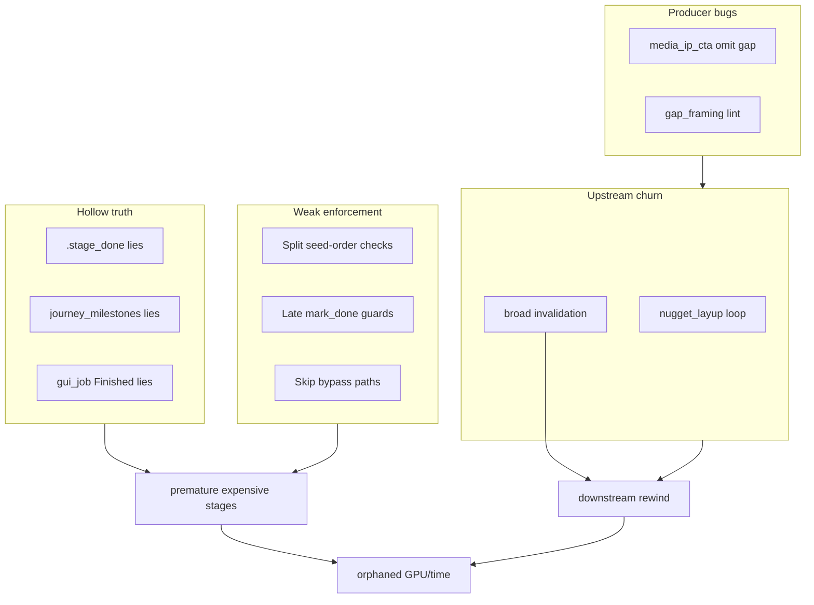

# Forensic run improvement 001

**Purpose:** Turn **exec_3751** into durable product rules — not another heal-only run. Holistic coverage: **ordering enforcement**, **phased effort management**, **deterministic guardrails**, **producer fixes**, **invalidation discipline**, and **rerun protocol**.

**Companion:** [full_auto_forensics_run.plan.md](full_auto_forensics_run.plan.md) — forensics parent must **patch + pytest** per §6–§7 using this plan as the product backlog.

**Scope:** Plan only — **no code in this document.**

---

## 0. Executive decision — stop, fix, rerun

| Question | Decision |
|----------|----------|
| Continue exec_3751 without patches? | **No** — looping VO/G1/EDL; ~25 min MusicGen + mix orphaned; no `master/master.wav` |
| Patch while driver healing? | **No** — stop stack first (`python tools/full_auto_daemon_launch.py stop`) |
| Fresh rerun without code? | **No** — same shapes will recur on this tape |
| Correct path | **Stop → Wave 0–2 (§12) → pytest green → MUX_FRESH=1 forensics rerun** (operator decision: full plan before rerun) |

Keep `exec_3751` artifacts under `ASSETS/executions/` for regression replay; do not resume that `run_id` for ship attempts after guardrails land.

---

## 1. Full incident catalog (exec_3751)

Every observed shape — grouped by layer. All must map to a guardrail (§4), phase rule (§13), or producer fix (§14).

### 1.1 Orchestration & hollow progress

| ID | Symptom | When (PT) | Impact |
|----|---------|-----------|--------|
| O1 | `assembly_preview` never ran; MusicGen started | 09:23–09:49 | ~25 min GPU waste |
| O2 | Progress 60/69 → 43/69 after layup re-entry | 09:59 | Full downstream rewind |
| O3 | `refuse_force_mark_done` on mmaudio *after* MusicGen | 10:05 | Guard too late |
| O4 | Homunculus walk skipped post-EDL chain | 09:22+ | edl → music jump |
| O5 | `gui_job` / counter vs disk disagree | throughout | False confidence |
| O6 | `premature_complete:assembly_preview ×3` then advance anyway | 10:10 | STOP rule bypassed |
| O7 | `g1_complete: true` while `check_g1_vo` missing lines | 10:38 | Milestone lie |
| O8 | Job `Finished: Synthesize spoken VO` + G1 missing `vo_preface_open` | 10:38 | Hollow VO complete |

### 1.2 Seed-order & producer loops

| ID | Symptom | Producer |
|----|---------|----------|
| S1 | `complete nugget_layup_compose before sound_design_plan` loop | layup never `.stage_done` |
| S2 | `complete nugget_corpus_mine before refinement_agenda` | upstream incomplete |
| S3 | `complete vo_line_adjudicate before vo_synthesize` | marker lag |
| S4 | `complete vo_synthesize before edl_narrative_audit` | VO batch incomplete |
| S5 | `seg_054` media-IP-CTA excluded but in order | `media_ip_cta.execute_cta_omit_from_needs` |
| S6 | Layup QC `open_high_salience_nuggets=['nug_003']` | spoken-copy / QC |
| S7 | `identical_failure` halt on `refinement_agenda` | forensics sync continued |

### 1.3 Validation & content QC

| ID | Symptom | Stage |
|----|---------|-------|
| V1 | `vo_preface_*` forward-cue / cold-open lint | `gap_framing_compose` |
| V2 | Hard-keep segs missing from `ordered_segment_ids` | `full_master_ranking` |
| V3 | `junction_snip_qa` — stale `sound_design_plan` | invalidation cascade |
| V4 | Pre-stage lifecycle missing `master/transitions.json` | rewind after archive |

### 1.4 Premature EDL / G1

| ID | Symptom | Driver behavior |
|----|---------|-----------------|
| E1 | Premature EDL complete with G1 missing (6–7 lines) | seed-front redirect (good) |
| E2 | Redirect to `vo_synthesize` while layup still churning | expensive VO re-burn |
| E3 | `premature EDL complete with mix unseated` | resume `assembly_preview` (good intent, blocked by O6) |

### 1.5 Wasted expensive work (summary)

| Stage | Approx spend | Orphaned when |
|-------|--------------|---------------|
| `mmaudio_sfx` (MusicGen) | ~25+ min | layup invalidation 09:59 |
| `vo_synthesize` (Chatterbox) | ~20+ min × retries | layup/EDL loops |
| `mix` | ~minutes | assembly archived |
| `audio_preclean` / `transcribe` | prepare (OK once) | reuse declined correctly |

---

## 2. Root cause taxonomy



**Core insight:** Manifest `DELIVERY_ORDER` is correct; failures are **runtime truth**, **phase discipline**, and **invalidation scope**.

---

## 3. Design principles (non-negotiable)

1. **One completeness predicate** everywhere — seed order, schedule, mark_done, milestones.
2. **Three enforcement layers** — schedule (agenda), dispatch (runtime), commit (mark_done). All must agree.
3. **Expensive stages require stability checkpoint** — not just prior stage `.stage_done`.
4. **Invalidation is structural only** — heal-only retries preserve post-assembly epoch unless fingerprint changes.
5. **Phased delivery** — conductor walks Phase A → B → C; never C while A unstable.
6. **Wasted work is observable** — ledger + forensics triggers.
7. **Deterministic rules over heal optimism** — heals recover; guardrails prevent.

---

## 4. Deterministic guardrail registry (§G)

Each rule: **predicate**, **when checked**, **action**, **test id**.

### G1 — `seed_stage_complete(ctx, stage) -> bool`

**Predicate:** `is_done(stage) ∧ stage_outputs_present(stage) ∧ stage_artifact_incompleteness(stage) is None`

**When:** `_seed_prereq_block`, `earliest_incomplete_seed_stage`, `constrain_conductor_to_seed_front`, driver seed heal.

**Action:** Earliest incomplete = first stage in order where predicate false; block consumers.

**Replaces:** weaker `llm_flow_hardening._earliest_incomplete_seed_stage` (is_done only).

**Test:** `test_seed_complete_blocks_hollow_assembly`

---

### G2 — Music requires assembly (schedule + dispatch)

**Predicate:** `assembly_preview.wav ∨ assembly.wav` exists before any stage in `MUSIC_REQUIRES_ASSEMBLY`:

- `music_palette_compose`, `sfx_prompt_craft`, `mmaudio_sfx`

**When:** agenda pin, `walk_seed_agenda` enqueue, `dispatch_stage`, `pipeline.run_single_stage` skip paths.

**Action:** Pin to `assembly_preview` (or `listen_delight_audit` if assembly done but delight incomplete).

**Test:** `test_music_blocked_without_assembly_wav`

---

### G3 — Hollow reconcile every delivery batch

**Predicate:** For post-EDL chain stages, `is_done ∧ ¬seed_stage_complete` → hollow.

**When:** Start of every `execute(delivery)`, homunculus delivery phase entry, **before** walk.

**Action:** `unmark_hollow_delivery_producers` + `reconcile_stage_done_marker`; log cleared list.

**Chain:** `assembly_preview`, `listen_delight_audit`, `music_palette_compose`, `sfx_prompt_craft`, `mmaudio_sfx`, `mix`, `junction_snip_qa`, `master_finalize`, `vo_synthesize`, `edl`, `edl_narrative_audit`.

**Test:** `test_reconcile_clears_hollow_music_before_walk`

---

### G4 — No skip bypass without assembly

**Predicate:** Same as G2 for any early-return: “SDP WAVs on disk — skip regenerate”.

**When:** `pipeline.py` MUSIC_BEFORE_MIX block, `runtime.dispatch_stage` skip path.

**Action:** Remove skip or gate on G2.

**Test:** `test_sdp_skip_still_requires_assembly`

---

### G5 — `delivery_stable_for_music(ctx) -> bool`

**Predicate (all required):**

| Check | Source |
|-------|--------|
| Layup committed | `seed_stage_complete(nugget_layup_compose)` |
| G1 clear | `not check_g1_vo(ctx)` |
| VO adjudicated | `seed_stage_complete(vo_line_adjudicate)` |
| EDL chain | `seed_stage_complete(edl)` |
| Assembly | `seed_stage_complete(assembly_preview)` |
| Listen delight | `seed_stage_complete(listen_delight_audit)` or explicit pass artifact |
| No stale blockers | `not upstream_stale_blockers(ctx, "mmaudio_sfx")` |
| No blocking layup escalation | `operator/escalations/nugget_layup_compose.json` not blocking |
| Fingerprint sealed | `run_meta.delivery_epoch.phase_a_sealed_at` set |

**When:** Before **Phase C** (§13) — entire music block.

**Action:** Conductor remaining = Phase A incomplete stages only; log `music_deferred: <reason>`.

**Test:** `test_music_deferred_until_delivery_stable`

---

### G6 — G1 milestone truth

**Predicate:** `journey_milestones.g1_complete` may flip true **only when** `check_g1_vo(ctx)` empty **and** every G1 line has committed WAV in `vo_pickup/synthesized` or transition paths.

**When:** `journey_state` update, `mark_done(vo_synthesize)`, driver heal paths.

**Action:** Clear `g1_complete` if predicate fails; never set from hollow VO job complete.

**Test:** `test_g1_milestone_tracks_check_g1_vo`

---

### G7 — Premature complete cap (hard pin)

**Predicate:** On `premature_complete:<stage> ×3`, **do not** “advance to next pending” if next stage requires failed producer.

**When:** `full_auto_driver` premature EDL / assembly / VO complete handlers.

**Action:** Pin at earliest incomplete seed stage; log `[DECISION major] premature_cap_hard_pin stage=…`.

**Fixes:** O6 — assembly_preview ×3 then skip.

**Test:** `test_premature_cap_pins_not_advances`

---

### G8 — VO synthesize stability gate

**Predicate before Chatterbox batch:**

- G5 sub-checks for layup + transitions + gap_report (G1 lines list frozen)
- `master/transitions.json` committed, not stale
- No `invalidated_by:nugget_layup_compose` on gap_report / sound_design in last heal window

**When:** `vo_synthesize` schedule + dispatch.

**Action:** Defer to layup/transitions producer; never log `Finished: Synthesize spoken VO` until G6 satisfied.

**Test:** `test_vo_synth_blocked_when_g1_open`

---

### G9 — Expensive-stage stale preflight (extends C3)

**Predicate:** `upstream_stale_blockers(ctx, stage) -> list[str]` empty.

**Consumers:** `mmaudio_sfx`, `vo_synthesize`, `mix`, `junction_snip_qa`, `master_finalize`.

**When:** Schedule + dispatch (same layers as G2).

**Test:** `test_mmaudio_blocked_on_stale_sound_design`

---

### G10 — Prepare-phase fingerprint gates (B5)

| Stage | Re-run only if |
|-------|----------------|
| `audio_preclean` | ingest hash changed |
| `transcribe` | G0 invalidated |
| `audio_probe_build` | probe hash changed |

**Test:** `test_transcribe_not_rerun_after_g0_lock`

---

## 5. Phased delivery & effort tiers (§E)

Manifest order in `v2/config.py` stays **69 stages** — phasing is **conductor policy**, not necessarily a config reorder. Optional manifest tweak in §13.3.

### 5.1 Effort tiers

| Tier | Cost | Stages (representative) |
|------|------|-------------------------|
| **T0** | Light | LLM plan stages, JSON artifacts, audits |
| **T1** | Medium | `assembly_preview`, ffmpeg extracts, `listen_delight_audit` |
| **T2** | Heavy GPU | `vo_synthesize` (Chatterbox), `mmaudio_sfx` (MusicGen) |
| **T3** | Heavy CPU/IO | `mix`, `master_finalize`, `transcribe`, `audio_preclean` |

**Rule:** Never enter **T2 MusicGen (`mmaudio_sfx`)** until Phase A is sealed and G5 passes. **T2 Chatterbox (`vo_synthesize`)** runs inside Phase A but only when **G8** passes (layup/transitions/G1 stable) — G5 does not block VO within Phase A.

### 5.2 Delivery phases (conductor policy)

```mermaid
flowchart LR
  subgraph phaseA [Phase A — Rewind-safe producers]
    A1[nugget_layup_compose]
    A2[transitions / gap / VO adjudicate]
    A3[vo_synthesize]
    A4[edl_narrative_audit / edl]
    A5[assembly_preview]
    A6[listen_delight_audit]
  end
  subgraph phaseB [Phase B — Music planning T0]
    B1[music_palette_compose]
    B2[sfx_prompt_craft]
  end
  subgraph phaseC [Phase C — T2 GPU music]
    C1[mmaudio_sfx]
  end
  subgraph phaseD [Phase D — Master path]
    D1[mix]
    D2[junction_snip_qa]
    D3[master_finalize]
  end
  subgraph phaseE [Phase E — Ship]
    E1[master_transcript / meta / cover / publish]
  end
  phaseA -->|G5 seal| phaseB
  phaseB --> phaseC
  phaseC --> phaseD
  phaseD --> phaseE
```



**Phase A — “Air order stable”** (must complete & seal before music):

- Explicit `DELIVERY_ORDER` slice (see **§5.6**) — includes `sound_design_plan` / `sound_design_vo_finalize` **before** `vo_synthesize` per manifest (not Phase B).
- **Seal:** automatic — when all G5 predicates pass, write **`operator/delivery_checkpoint.json`** (no new stage id; operator chose auto checkpoint over explicit stage).

```json
{
  "phase": "A_sealed",
  "sealed_at": "<iso>",
  "selection_fingerprint": "<hash>",
  "order_fingerprint": "<hash>",
  "g1_line_ids": ["..."],
  "assembly_path": "master/assembly_preview.wav"
}
```

**Phase B — Music planning (cheap LLM):** `music_palette_compose` + `sfx_prompt_craft` only — after Phase A sealed. **No MusicGen.** (`sound_design_plan` already committed in Phase A unless structurally invalidated.)

**Listen delight (soft waive):** Full-auto may proceed to Phase B/C with `operator/escalations/listen_delight_audit.json` status **`waived_unattended`** — log waiver in checkpoint; production parity path documented in `docs/workflows/operator-gates.md`.

**Phase C — MusicGen (`mmaudio_sfx`):** Requires G5 + Phase A seal + Phase B complete. **Last possible moment** before mix.

**Phase D — Mix & master:** Requires Phase C complete + mmaudio QA parity.

**Phase E — Ship:** Unchanged (`SHIP_AFTER_MASTER`).

### 5.6 Phase A — explicit stage list (manifest-aligned)

Phase A = contiguous prefix of `DELIVERY_ORDER` from first delivery stage through `listen_delight_audit`:

`topic_coverage_audit` → `narrative_arc_plan` → `chapter_close_hitch` → `connector_fuse_pass_pre_ranking` → `full_master_ranking` → `air_script_compose` → `nugget_corpus_mine` → `information_package_plan` → `nugget_layup_compose` → `refinement_agenda` → `gap_framing_recompose` → `selection_framing_apply` → `air_script_seams` → `transitions` → **`sound_design_plan`** → **`sound_design_vo_finalize`** → `vo_line_adjudicate` → `vo_synthesize` → `edl_narrative_audit` → `edl` → `assembly_preview` → `listen_delight_audit`

Homunculus **must not** enqueue any stage after this slice until checkpoint written — except Phase A retries on failure.

**Internal sub-step (not in DELIVERY_ORDER):** `sfx_prompt_refine` runs inside `mmaudio_sfx` / `sfx_mmaudio.py` — include in G2/G9 scope for Phase C, not a separate agenda stage.

---

### 5.7 Homunculus agenda changes (E1)

- `run_homunculus_phase(delivery)` reads checkpoint; if Phase A not sealed, **filter remaining** to Phase A stages only.
- `walk_seed_agenda` never enqueues Phase C while `delivery_stable_for_music` false.
- Conductor tool `resolve_stage_plan` exposes phase + blockers to homunculus memory.

### 5.8 Lazy MusicGen (E3 — effort optimization)

- After Phase B, compute **referenced theme slots** from `sound_design_plan` + mix recipe.
- `mmaudio_sfx` generates **only required slots** — skip unused palette candidates.
- Log skipped slots in `operator/wasted_work.json` as `avoided_musicgen`.

### 5.4 What we do NOT reorder

| Change | Why forbidden |
|--------|---------------|
| `mmaudio_sfx` after `mix` | `MUSIC_BEFORE_MIX` — mix consumes theme WAVs |
| `vo_synthesize` after `edl` | EDL requires seated VO paths |
| Ship stages before `master_finalize` | Publishability contract |

### 5.5 Optional manifest clarification (E2 — low risk)

If phasing alone is insufficient, document in `v2/config.py` comments or `docs/cross-cutting/delivery-phases.md`:

- Explicit **checkpoint markers** between `listen_delight_audit` and `music_palette_compose` (no stage id change required).
- Optional future stage id: `delivery_stability_seal` (T0 no-op validator) — **only if** checkpoint artifact insufficient for tests.

---

## 6. Ordering & enforcement fixes (§A) — implements G1–G4

(Same intent as prior §4; now mandatory under guardrail IDs.)

| Item | Guardrail | Files |
|------|-----------|-------|
| Unify seed completeness | G1 | `stage_completion.py`, `llm_flow_hardening.py`, `runtime.py`, `agenda.py` |
| Music schedule pin | G2 | `agenda.py` |
| Batch-start reconcile | G3 | `full_auto_driver.py`, `agenda.py` |
| Close skip bypasses | G4 | `pipeline.py`, `runtime.py` |

---

## 7. Wasted-work prevention by stage (§B)

| Stage | Guardrails | Phase | Extra rules |
|-------|------------|-------|-------------|
| `mmaudio_sfx` | G2, G5, G9 | C | Lazy slots E3; abort if fingerprint changes mid-run |
| `vo_synthesize` | G6, G8 | A | Batch size logged; per-line commit before job Finished |
| `mix` | G9, B3 | D | Requires `delivery_epoch.music_complete` |
| `master_finalize` | G9 | D | Requires mix + junction_snip_qa or waiver |
| LLM volley (layup/gap) | F1–F4 | A | Spoken-copy heal before mine refresh |
| Prepare heavy | G10 | pre-delivery | Fingerprint only |

### B3 — Mix epoch (detail)

- `run_meta.delivery_epoch`: `{ phase_a_sealed_at, music_started_at, music_complete_at, mix_started_at }`
- Mix blocked if `music_complete_at` null or mmaudio cleared in current epoch.

---

## 8. Invalidation & rewind discipline (§C)

### C1 — Structural vs heal-only

| Class | Trigger | Archive post-assembly? |
|-------|---------|------------------------|
| **Heal-only** | spoken-copy rewrite, QC retry, same selection+order fingerprint | **No** |
| **Structural** | selection reorder, seg remap, CTA omit changing air order, hard-keep ranking change | **Yes** |

**Implementation:** Compare fingerprints before `invalidate_downstream` / `artifact_lifecycle` stale mark.

### C2 — Auto-restore

On seed-order heal (not structural), call `delivery_recovery.restore_master_bundle` when fingerprints match sealed checkpoint.

### C3 — Stale blockers

Implement `upstream_stale_blockers` — consumed by G9.

---

## 9. Producer fixes — exec_3751 shapes (§F)

| ID | Fix | File | Test |
|----|-----|------|------|
| F1 | CTA omit for excluded-but-ordered segs | `media_ip_cta.py` | `test_cta_omit_excluded_in_order` |
| F2 | Layup QC → spoken-copy heal before corpus refresh | `nugget_layup.py`, driver | `test_layup_qc_spoken_copy_no_invalidate` |
| F3 | Gap framing forward-cue auto-rewrite | `gap_framing` stages, `spoken_copy_guard` | `test_preface_forward_cue_heal` |
| F4 | Hard-keep in ranking validator | `full_master_ranking` | `test_hard_keep_in_ordered_ids` |
| F5 | Transitions archive on layup — restore if fingerprint match | `delivery_recovery.py` | `test_transitions_survive_heal_layup` |

---

## 10. Observability & forensics (§D)

### D1 — `operator/wasted_work.json`

Events: `expensive_start`, `orphan`, `avoided_musicgen`, `phase_seal`, `music_deferred`.

### D2 — `run_meta.delivery_epoch` + checkpoint

Persist phase seals; forensics state template fields:

- `delivery_phase: A|B|C|D|E`
- `phase_a_sealed: true|false`
- `last_expensive_stage:`
- `orphaned_spend: true|false`

### D3 — Cross-ref `full_auto_forensics_run.plan.md`

Extend §7 failure shapes table with O1–O8, S1–S7, G1–G10.

Extend §12 anti-patterns:

| Anti-pattern | Plan fix |
|--------------|----------|
| Continue run without patch while predicate unchanged | §0 stop-fix-rerun |
| MusicGen before Phase A seal | G5 + §13 |
| g1_complete milestone lie | G6 |
| premature_complete ×3 advance | G7 |

---

## 11. Forensics parent obligations (§H)

When implementing this plan during a forensics chat:

1. **Stop** exec_3751 (or any wounded run) before merging guardrails.
2. Implement **§20 rerun gate (Wave 0–2)** — full plan before Mohan rerun (operator decision).
3. **pytest** affected tests before `MUX_FRESH=1` launch.
4. Update `full_auto_forensics_state.md` every monitor cycle (phase, epoch, orphaned_spend).
5. **Never** declare success on driver substring heal without predicate flip (§3.3 forensics plan).

---

## 12. Implementation priority (revised)

| Wave | Items | Rerun blocker? |
|------|-------|----------------|
| **Wave 0** | G1–G4, G6–G8, F1 | Rerun blocker (foundation) |
| **Wave 1** | G5, G9, C1–C3, E1 phase agenda, G7 | Rerun blocker |
| **Wave 2** | F2–F5, E3 lazy MusicGen, D1–D2, listen-delight waiver path | **Rerun blocker (operator: full plan before rerun)** |
| **Wave 3** | G10, D3, full test matrix, replay fixture, schema audit | Before declaring plan **built** |

---

## 13. Verification plan

```bash
# Guardrails
pytest tests/test_stage_completion.py tests/test_homunculus.py -q \
  -k "seed_complete or hollow or assembly or music or mmaudio or g1_milestone or premature_cap"

pytest tests/test_unattended_reliability.py -q \
  -k "seed or premature or assembly or delivery_stable"

# Producers
pytest tests/test_gap_framing_gates.py tests/test_nugget_layup.py -q -k "layup or cta or spoken"

# Contract
python tools/audit_config_keys.py
./scripts/verify_artifact_contract.sh
```

**Replay predicates (exec_3751 tape):**

1. Hollow `assembly_preview` done → MusicGen never subprocess.
2. Layup spoken-copy heal → assembly + transitions survive.
3. Stale `sound_design_plan` → mmaudio blocked at schedule time.
4. G1 missing `vo_preface_open` → job never `Finished: Synthesize spoken VO`.
5. Phase A seal → only then music_palette enqueued.

---

## 14. Anti-patterns (forbidden)

| Anti-pattern | Guardrail |
|--------------|-----------|
| Trust `.stage_done` alone | G1 |
| Music before assembly WAV | G2 |
| Reconcile only in heal | G3 |
| SDP skip without assembly | G4 |
| Music before layup/G1/EDL stable | G5 |
| `g1_complete` without WAVs | G6 |
| premature ×3 then advance | G7 |
| VO Finished with open G1 | G8 |
| Expensive stage on stale upstream | G9 |
| Broad invalidation on heal-only layup | C1 |
| Forensics chat without code patch | §H |

---

## 15. Wave 0 checklist (foundation)

- [ ] **G1** `seed_stage_complete` wired; tests green
- [ ] **G2** music blocked without assembly WAV; tests green
- [ ] **G3** reconcile at delivery batch start; tests green
- [ ] **G4** skip bypasses closed; tests green
- [ ] **G6** G1 milestone tracks `check_g1_vo`; tests green
- [ ] **G8** VO batch blocked when G1 open; tests green
- [ ] **F1** media_ip_cta seg_054 shape; tests green
- [ ] Guardrails landed on **clean diff from HEAD**; driver heal audit scheduled (not same PR initially)

---

## 20. Rerun gate (Wave 0–2 — operator decision)

All must pass before `MUX_FRESH=1` on `mohan_uttarwar_podcast_transforming_cancer_science_direct.mp3`:

**Wave 0** (§15) plus:

- [ ] **G5** + **E1** phased agenda + auto `delivery_checkpoint.json`; tests green
- [ ] **G7** premature cap hard pin; tests green
- [ ] **G9** + **C3** stale preflight; tests green
- [ ] **C1** heal-only layup does not archive assembly (or **C2** restore); tests green
- [ ] **F2–F5** producer fixes; tests green
- [ ] **E3** lazy MusicGen (or documented defer with todo if mix still correct)
- [ ] **D1–D2** wasted-work ledger + delivery_epoch
- [ ] Listen-delight **soft waive** path documented and tested
- [ ] `./scripts/verify_artifact_contract.sh` + `audit_config_keys.py` pass
- [ ] Prior run stopped: `pgrep full_auto_driver` empty
- [ ] Redundant driver heals pruned or gated after guardrails (second PR acceptable)

---

## 16. Success criteria (plan **built**)

1. No T2 stage subprocess without Phase A sealed + G5 (test + one forensics rerun).
2. No `g1_complete` / VO Finished while `check_g1_vo` non-empty.
3. Heal-only layup does not orphan MusicGen outputs (C1/C2 + D1 orphan events = 0 on happy path).
4. Counter monotonic within epoch — no 60→43 collapse without logged structural invalidate.
5. Forensics parent patches logged in `patches_this_session` before rerun completes delivery phase A.

---

## 17. Relationship to other work

| Doc | Relationship |
|-----|--------------|
| `full_auto_forensics_run.plan.md` | Runtime loop; this plan is **product backlog** for §6–§7 |
| `homunculus_vo_hardening_155525b9.plan.md` | VO freshness (9C, 1A) — G6/G8 extend; do not duplicate |
| Uncommitted `full_auto_driver.py` heals | Heals ≠ guardrails; merge guardrails first, then prune redundant heal thrash |

---

## 18. Out of scope

- Moving `mmaudio_sfx` after `mix`.
- Waiving MusicGen / `e2e_soft` in production full-auto without explicit env.
- Operator GUI redesign (full-auto remains automated).
- Changing analysis-phase order (35 stages) — delivery-only focus unless S5 requires analysis touch.

---

## 19. End state vision

Homunculus 0.1.0 delivery walk:

1. Completes **Phase A** with a sealed checkpoint artifact.
2. Runs **Phase B** planning (cheap).
3. Enters **Phase C** MusicGen once — lazy slots only.
4. **Phase D** mix/master without rewind unless **structural** invalidate.
5. Forensics loop intervenes on **orphan events** in D1, not after 25 minutes of silent GPU burn.

Deterministic rules make the right thing the **only** path; heals remain last-resort, not primary navigation.

---

## 21. Plan corrections log (review 2026-08-31)

| Issue | Correction applied |
|-------|-------------------|
| G5 blocked VO inside Phase A | G5 gates **music block only**; G8 gates `vo_synthesize` within Phase A |
| `sound_design_plan` in Phase B | Moved to Phase A per `DELIVERY_ORDER` (before `vo_synthesize`) |
| Phase A stage list vague | **§5.6** explicit slice through `listen_delight_audit` |
| Duplicate §5.3 numbering | Renumbered E1→§5.7, E3→§5.8 |
| `sfx_prompt_refine` omitted | Documented as internal Phase C sub-step |
| Minimum vs full rerun bar | **§20** Wave 0–2 required before rerun (operator choice) |
| Phase A seal mechanism | Auto `delivery_checkpoint.json` when G5 passes |
| Driver heal integration | Guardrails first on clean diff; prune heals after |
| Listen delight vs music | Soft waive via escalation artifact in full-auto |

---

## 22. Execution playbook (implementation order)

1. **Stop** wounded run; freeze exec_3751 as evidence.
2. **Branch** from HEAD — guardrails only (do not mix with uncommitted heal sprawl initially).
3. **Wave 0** → **Wave 1** → **Wave 2** with pytest after each wave.
4. **Second PR:** audit `full_auto_driver.py` heals — delete or gate any behavior duplicated by G1–G9.
5. **Schema/docs:** `delivery_checkpoint.json`, `wasted_work.json`, `delivery_epoch` in `docs/cross-cutting/json-schemas/` + config-keys audit.
6. **Replay fixture:** synthetic run dir mimicking O1 + O2 + O8 predicates (no ASSETS commit).
7. **Forensics handoff:** parent monitors `operator/wasted_work.json` for `orphan` / `music_deferred` → intervene per §H (patch required, not heal-only).
8. **Rerun** only after **§20** checklist green.

---

## 23. Open items for future plan revision (not blockers)

- **Feature flag** `MUX_DELIVERY_PHASES=1` for phased agenda rollout vs always-on.
- **Rollback:** if G5 too strict, log which predicate failed most — tune before loosening rules.
- **0.0.0 brains:** plan assumes homunculus **0.1.0** full-auto; document 0.0.0 out of scope.
- **GUI visibility:** optional Phase A/B/C badge in workbench (out of scope unless operator asks).
- **junction_snip_qa before mix:** manifest keeps mix first; if naked seams should block mix (not just junction), add guardrail proposal after Wave 2 data.
