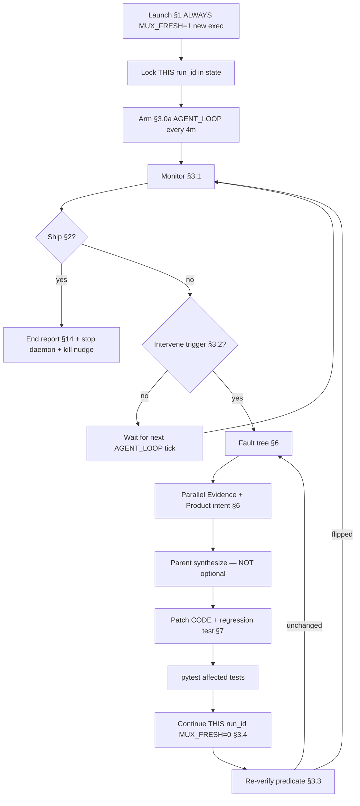

# Full-auto forensics run

Canonical workflow for a chat that runs Full-auto **and** patches the product when gates, QC, or heals lie. **Product debugger in the loop — not driver babysitter.**

**INPUT_FILE** = `<placeholder>` (under `ASSETS/input/`)

---

## Operator card (YOU — read this)

**Primary kickoff:** paste the **Session opener** (§0) into a **dedicated** forensics Agent chat. That chat owns one **fresh** campaign until ship or hard blocker.

| You want… | Do this |
|-----------|---------|
| Start a campaign | Paste **Session opener** below into a **new** Agent chat. Agent **always** creates a **new** `exec_*` (`MUX_FRESH=1`), arms **§3.0a nudge**, then monitors. No prior execution folders/files. |
| Bug mid-run | Agent patches **code**, pytest, then **continues the same fresh `run_id`** from the producer stage (`MUX_FRESH=0`). Not a second tape. |
| Status only | Separate status chat. Do not paste the forensics opener there. |
| Cursor died mid-campaign | Paste **Continue opener** (§0) — continue **this** campaign’s locked `run_id` only; **re-arm §3.0a**. |
| New campaign later | Paste Session opener again → **new** fresh `exec_*`. Old folders are history only. |
| Abort | Say **STOP** or **PAUSE**. |

**Meaning of “fresh”:** every campaign starts empty — new `ASSETS/executions/exec_*`. Do **not** copy artifacts from older runs, attach to last week’s partial, or “resume exec_4741” as a kickoff. Prior learning is already in **git/code**.

**Meaning of “continue”:** after a bug **inside this campaign’s** fresh run, fix the product and keep going on **that same** `run_id`. That is not “reusing a previous execution.”

---

## 0. Campaign doctrine + agent contract (NON-NEGOTIABLE)

### 0.1 Doctrine — fresh campaign, continue after bugs

```
ONE chat = ONE campaign = ONE fresh exec_*
─────────────────────────────────────────
Kickoff:     ALWAYS MUX_FRESH=1  → brand-new exec_* (never prior folders)
On bug:      patch product + pytest → continue THAT exec_* from producer (MUX_FRESH=0)
Ship / §4 → campaign ends
Next campaign chat → new MUX_FRESH=1 again
```

| Rule | Detail |
|------|--------|
| **Always fresh at kickoff** | Session opener → stop prior stack → `MUX_FRESH=1` → new `exec_*`. **Never** bind `MUX_RUN_ID` to an old campaign directory. **Never** copy `master/`, `understanding/`, or `.stage_done` from prior executions into the new run. |
| **No previous-execution workflow** | Old `exec_*` are forensic history / optional fixture source for **tests** only — not runtime inputs. Knowledge from past failures must already be in code. |
| **Continue this run after bugs** | Diagnose → narrow product patch → regression test → resume **this** `run_id` from producer. Prove the fix on the run that hit the bug. |
| **Do not spawn a second exec to verify** | Forbidden: `MUX_FRESH=1` mid-campaign “to make sure the patch works.” That re-burns early stages and undoes the continue model. |
| **New campaign only when** | (a) operator pastes Session opener again, (b) unrecoverable corruption of **this** exec (document + new fresh), or (c) operator STOP then later starts over. |

Homunculus / driver heals are **not** diagnosis. The parent agent patches root causes.

### 0.2 The parent MUST

1. **Launch fresh once** (§1) with **`MUX_FORENSICS=1`** + **`MUX_KEEPALIVE=1`**, lock the **new** `run_id`, then **monitor → intervene → fix → verify → continue**.
2. **Arm the automated nudge (§3.0a) immediately after launch** — a local `AGENT_LOOP_TICK_forensics` shell every **4 minutes** with `notify_on_output`, so the parent wakes without the operator clicking. Re-arm on Continue opener if the loop is dead.
3. **Never end a chat turn** while the run is incomplete and no hard blocker is evidenced — except to poll again in the **same chat**.
4. **Never stop after subagents** — parent **synthesizes, patches, pytest, continues this run**, then monitors.
5. **Driver exit = trigger** — patch if needed, **restart driver on this campaign’s `run_id`** (`MUX_FRESH=0`, §3.4.1).
6. **Track predicate flip** — if unchanged after a patch, iterate the fix; do **not** start a second execution to “check.”
7. **Persist state** in `.cursor/plans/full_auto_forensics_state.md` every intervene.
8. **On heal/predicate spin** (same predicate ×3, or idle ≥8 min with identical errors): stop blind heals → fault tree §6 → **product patch + pytest** → continue this run.

### 0.3 The parent MUST NOT

- Kick off by attaching to / copying from any **prior** `exec_*` (including shipped or partial campaigns).
- Call `MUX_FRESH=1` again **during** an active campaign to verify a late-stage fix.
- Launch bare `interview_mux delivery` instead of `full_auto_driver`.
- Read the plan and stop; or delegate forensics to subagents without patching and continuing.
- Heal downstream of a producer bug (mix/finalize when VO/EDL is the producer).
- Waive quality, stub MusicGen, fake `stage_done`, or skip optional without a product-defined path.
- Assume CPU/ffmpeg/chatterbox activity equals stage progress.
- Run two forensics campaign chats at once (dual-driver races).

### Session opener (paste exactly — always starts FRESH)

Do **not** add env vars to the user message. Agent reads §1 and launches with `MUX_FORENSICS=1` + `MUX_KEEPALIVE=1` + **`MUX_FRESH=1`**.

```
Follow .cursor/plans/full_auto_forensics_run.plan.md.
INPUT_FILE = <basename under ASSETS/input/>
Always start FRESH (MUX_FRESH=1): new exec_* only — do not use any previous execution folders or files.
On every bug in THIS run: diagnose → patch root cause into code → pytest → continue the SAME run_id (MUX_FRESH=0) from producer.
Never create a second execution to verify a late-stage fix. If heal/predicate unchanged ×3 or idle spin: escalate, patch product, then continue this run.
Immediately after launch: arm §3.0a automated nudge (AGENT_LOOP_TICK_forensics every 4m with notify_on_output). Keep that loop alive until ship or §4.
Run until ship or §4 hard blocker. Update .cursor/plans/full_auto_forensics_state.md every intervene.
Enter the continuous loop (§3) immediately after launch. Do not end the chat until ship or §4 hard blocker.
```

**Example (Mohan tape):**

```
Follow .cursor/plans/full_auto_forensics_run.plan.md.
INPUT_FILE = mohan_uttarwar_podcast_transforming_cancer_science_direct.mp3
Always start FRESH (MUX_FRESH=1): new exec_* only — do not use any previous execution folders or files.
On every bug in THIS run: diagnose → patch root cause into code → pytest → continue the SAME run_id (MUX_FRESH=0) from producer.
Never create a second execution to verify a late-stage fix. If heal/predicate unchanged ×3 or idle spin: escalate, patch product, then continue this run.
Immediately after launch: arm §3.0a automated nudge (AGENT_LOOP_TICK_forensics every 4m with notify_on_output). Keep that loop alive until ship or §4.
Run until ship or §4 hard blocker. Update .cursor/plans/full_auto_forensics_state.md every intervene.
Enter the continuous loop (§3) immediately after launch. Do not end the chat until ship or §4 hard blocker.
```

### Continue opener (paste after Cursor/chat restart — same campaign only)

Use only when **this** campaign’s state file still points at an **incomplete** `run_id` that **this** chat started. Not for picking up an old archived execution.

```
Follow .cursor/plans/full_auto_forensics_run.plan.md.
Continue the locked campaign in .cursor/plans/full_auto_forensics_state.md (this chat’s run_id only).
MUX_FRESH=0 — do not create a new execution; do not switch to any older exec_*.
Re-arm §3.0a AGENT_LOOP_TICK_forensics if the nudge shell is dead.
Re-enter §3 monitor → intervene → patch → continue until ship or §4 hard blocker.
Update the state file every intervene.
```

---

## 1. Launch (always FRESH — new exec_* only)

Stop any prior Full-auto processes first:

```bash
python tools/full_auto_daemon_launch.py stop
```

Confirm clean:

```bash
pgrep -fl 'full_auto_driver\.py' || echo 'no driver'
curl -s http://127.0.0.1:8765/api/health || echo 'server down'
```

### 1.1 Kickoff — always `MUX_FRESH=1`

```bash
MUX_RUN_MODE=full-auto \
MUX_HOMUNCULUS_VERSION=0.1.0 \
MUX_FRESH=1 \
MUX_FORENSICS=1 \
MUX_KEEPALIVE=1 \
MUX_INPUT_AUDIO=ASSETS/input/<INPUT_FILE> \
./scripts/run.sh --full-auto --input ASSETS/input/<INPUT_FILE>
```

Replace `<INPUT_FILE>` with the basename only. **Do not** pass `MUX_RUN_ID` at kickoff. **Do not** point at an existing `ASSETS/executions/exec_*` from a prior campaign.

### 1.2 After kickoff — lock THIS campaign and monitor

1. Read `ASSETS/full_auto_current_run.txt` → `run_id` (the **new** directory)
2. Write `.cursor/plans/full_auto_forensics_state.md` (§3.5) with `campaign_mode: fresh_campaign_continue_on_bug`, `run_id`, `fresh_launches: 1`
3. **Arm §3.0a automated nudge** (record PID in state `monitor_loop`)
4. Enter §3 loop — do not wait for the user

**From this moment forward:** continues use §3.4.1 / §3.4.2 with **`MUX_FRESH=0`** and **`MUX_RUN_ID=<this campaign’s run_id>`** only.

### 1.3 Forensics env

| Env | Purpose |
|-----|---------|
| `MUX_FORENSICS=1` | Identical-failure ×3 is telemetry; clears halt counters on restart / product fingerprint change. **After 3× same predicate without a product patch**, driver writes `operator/forensics_escalation.json` and **exits** so parent must patch + **continue this run**. |
| `MUX_KEEPALIVE=1` | Restarts driver **process** after crash — not a substitute for parent §3; does **not** detect heal-spins alone. |

Monitor surfaces:

- `ASSETS/full_auto_console.log`
- `ASSETS/full_auto_current_run.txt`
- `ASSETS/executions/<run_id>/run_meta.json`
- Job API: `GET /api/runs/<run_id>/job`
- GUI: `http://127.0.0.1:8765`
- Probe: `python tools/forensics_probe.py --run-id "$RUN" --write`

---

## 2. Success criteria (ship bar)

All must hold unless a **documented hard blocker** (§4):

| Criterion | Verification |
|-----------|--------------|
| **Master exists** | `ASSETS/executions/<run_id>/master/master.wav` — non-trivial size |
| **Mechanical loudness** | `python tools/verify_master.py <run_dir>/master/master.wav` passes |
| **Listen delight** | `mastering/listen_delight_audit.json` — authoritative floors pass at `master_finalize` |
| **Publish envelope** | `master/post_master_quality.json` with `publish_allowed: true` |
| **Cover + publish** | `episode_cover_generate` + `podcast_publish` stage_done, or evidenced §4 blocker for S3 |
| **North star** | [NORTH_STAR.md](../../NORTH_STAR.md) human-listen rubric |

**Forbidden shortcuts:** `INTERVIEW_MUX_E2E_QUALITY_WAIVERS`, stub MusicGen, soft listenability, fake `stage_done`, predicate waivers not in product config.

---

## 3. Continuous loop (core)

This section **is** the plan. Everything else supports it.

### 3.0a Automated nudge (mandatory — keeps the parent awake)

Cursor Agent turns end. Without a nudge, the chat **sleeps until you click**. The parent **must** arm a local wake loop so ticks re-enter §3.1 without the operator.

**Immediately after §1 kickoff (and again on Continue opener if dead):**

1. Check terminals for an existing `AGENT_LOOP_TICK_forensics` loop; if alive, record its PID and skip.
2. Start **one** background shell with `notify_on_output` matching `^AGENT_LOOP_TICK_forensics`:

```bash
while true; do
  sleep 240
  echo 'AGENT_LOOP_TICK_forensics {"prompt":"§3.1 monitor forensics run (locked run_id in full_auto_forensics_state.md): check job/progress/driver/nudge PID; intervene per plan if triggered; patch+continue same run_id; update state; continue until ship or hard blocker. Re-arm §3.0a if this loop died."}'
done
```

3. Run §3.1 **once immediately** after arming (do not wait for the first sleep).
4. Write `monitor_loop: every 4m (PID <pid>)` into the state file.
5. On each tick notification: run §3.1 → §3.2 if triggered → never ignore the tick.
6. On ship or §4: kill the nudge PID; clear `monitor_loop` in state.

**Limits (honest):** This nudge works **while this Agent chat / IDE session is alive**. Cursor full restart, killed terminal, or aborted background shell **stops** the nudge — Continue opener must re-arm. It does **not** replace `MUX_KEEPALIVE` (driver process) and does **not** run if the machine sleeps.

**Do not** rely on a plain `sleep` loop without `notify_on_output` — the agent will not wake.



### 3.0 Verify ladder (cheap → expensive)

After a product patch, prove the fix in this order — **stop at the first green level that unblocks continue:**

| # | Level | When |
|---|-------|------|
| 1 | **Unit / fixture pytest** | Optional: extract **minimal** failing artifacts into `tests/fixtures/` (test-only; runtime still uses THIS fresh run) |
| 2 | **Continue THIS run from producer** | `MUX_FRESH=0` + `--from-stage <producer>` or driver restart §3.4.1 |
| 3 | **Predicate re-check** §3.3 | Required after every continue |
| 4 | **New fresh campaign** | Only new Session opener / corruption of **this** exec — **not** to verify a late-stage patch |

### 3.1 Monitor (every 3–5 minutes while run active)

**If driver exited with `forensics stall escalated`:** do **not** restart until you have patched product code and run `pytest`. Then:

```bash
RUN=$(cat ASSETS/full_auto_current_run.txt)
python tools/forensics_probe.py --run-id "$RUN" --write
# patch + pytest, then restart driver on THIS run (§3.4.1) — MUX_FRESH=0
```

Run this batch (read-only unless continue):

```bash
RUN=$(cat ASSETS/full_auto_current_run.txt)
BASE="ASSETS/executions/$RUN"
DONE=$(ls "$BASE/.stage_done" 2>/dev/null | wc -l | tr -d ' ')
curl -s "http://127.0.0.1:8765/api/runs/$RUN/job" | .venv/bin/python -c "
import json,sys; j=json.load(sys.stdin)
print('status=', j.get('status'), 'stage=', j.get('current_stage'))
print('msg=', (j.get('message') or '')[:100])
print('err=', (j.get('error') or '')[:120] if j.get('error') else None)
"
tail -3 ASSETS/full_auto_console.log
pgrep -fl 'full_auto_driver\.py' || echo 'DRIVER DEAD'
pgrep -fl 'full_auto_keepalive_loop\.py' || echo 'KEEPALIVE DEAD'
test -f "$BASE/master/master.wav" && echo master=yes || echo master=no
```

If **KEEPALIVE DEAD** but driver should be running: restart per §3.4.1 (`MUX_KEEPALIVE=1`, **`MUX_FRESH=0`**, **this** `run_id` only).

**Progress** = any of:

- `.stage_done/` count increases
- `current_stage` advances per [port-manifest](../../docs/v2/port-manifest.csv)
- Predicate moves toward ship (G1 missing list shrinks, PMQ passes, etc.)
- Console log new line with stage completion or intentional heal

**Not progress:** ffmpeg/chatterbox alone, pending writes with same stage index, identical job `message` >8 min, heal spam without predicate flip.

Update state file: `last_progress_at`, `stages_done`, `current_stage`, `driver_alive`.

### 3.2 Intervene triggers (immediate)

Intervene when **any**:

| # | Trigger | Typical signal |
|---|---------|----------------|
| 1 | Job `error` / `gate` / `needs_operator` | API status, console `ERROR`, `PAUSE needs_operator` |
| 2 | **Driver dead** | `pgrep` empty; console `Full-auto halted` |
| 3 | **Idle ≥8 min** | No §3.1 progress signals |
| 4 | Identical failure ×3 | Console `STOP: … ×3`; `operator/identical_failures.json` — **intervene + patch**, not fresh run |
| 5 | Predicate unchanged after heal | Same `file:function` failure after resume |
| 6 | Disk vs checker lie | Artifact exists but check says missing (or inverse) |
| 7 | Monitor-only ≥15 min | Watching without fault tree + patch |
| 8 | Heal-spin | Same error storm / premature_cap / seed-order thrash without stage advance |
| 9 | Operator **PAUSE** / **STOP** | User message |

### 3.3 Predicate verification (required after every resume)

Before trusting progress, re-run the **exact check** that failed (not the driver log substring):

```bash
RUN=<run_id>
.venv/bin/python -c "
from interview_mux.run_context import RunContext
from interview_mux.gates import check_g1_vo
ctx = RunContext('$RUN')
print('check_g1_vo:', check_g1_vo(ctx) or 'clear')
print('vo_synthesize done:', ctx.is_done('vo_synthesize'))
"
# Add stage-specific probes per Agent 2 file:function
```

Record in state file: `last_predicate`, `last_predicate_before`, `predicate_flipped: true|false`, `resume_from_stage`.

**If not flipped:** another loop iteration (patch again) — do **not** `MUX_FRESH=1` / do **not** switch to an older `exec_*`.

### 3.4 Continue matrix (this campaign’s run_id only)

| Situation | Action |
|-----------|--------|
| Checker/read bug; artifact correct on disk | **This** `run_id`, `--from-stage <producer>` or driver restart |
| Writer/commit bug | **This** `run_id` + invalidate downstream + `--from-stage <producer>` |
| Schema/lineage/id churn | **This** `run_id` + `python tools/audit_segment_lineage.py --run-id <run_id>` |
| **Driver exited** | Fix predicate if product bug → **restart driver on this run** (§3.4.1) |
| Cursor/chat restart | **Continue opener** — this campaign’s `run_id`, `MUX_FRESH=0` |
| Want artifacts from an **old** campaign | **Forbidden** for runtime — bake learning into code; optional test fixture only |
| Unrecoverable corruption of **this** exec | Document → Session opener → **new** `MUX_FRESH=1` campaign |

#### 3.4.1 Restart driver on THIS run (default after halt / dead / reconnect)

```bash
# Only stop if needed to clear dual drivers — do NOT wipe the exec directory
# do NOT switch MUX_RUN_ID to any prior campaign
python tools/full_auto_daemon_launch.py stop
MUX_RUN_MODE=full-auto \
MUX_HOMUNCULUS_VERSION=0.1.0 \
MUX_FRESH=0 \
MUX_FORENSICS=1 \
MUX_KEEPALIVE=1 \
MUX_RUN_ID=<this_campaign_run_id> \
MUX_INPUT_AUDIO=ASSETS/input/<INPUT_FILE> \
./scripts/run.sh --full-auto --input ASSETS/input/<INPUT_FILE>
```

Or attach driver only if server already up:

```bash
MUX_RUN_ID=<this_campaign_run_id> MUX_FRESH=0 MUX_FULL_AUTO=1 MUX_FORENSICS=1 MUX_KEEPALIVE=1 \
  .venv/bin/python -u tools/full_auto_driver.py
```

After restart:

- **All ×3 halts auto-clear** when `MUX_FORENSICS=1` (every driver start) or when product fingerprint changed.
- Re-executing **any** stage clears that stage's identical-failure counters.
- Forensics driver continues past many `needs_operator` signals — **parent still must patch root causes**.
- Increment `driver_restarts` in state; **`fresh_launches` stays 1** for this campaign.

#### 3.4.2 Continue from producer (CLI)

```bash
.venv/bin/python -m interview_mux run --run-id <this_campaign_run_id> --from-stage <producer_stage>
```

Producer examples: `vo_line_adjudicate` → `vo_synthesize` → `edl_narrative_audit` → `edl` → `master_build`. Never resume ship stages when G1/EDL predicates fail.

### 3.5 Loop state file (mandatory)

Path: `.cursor/plans/full_auto_forensics_state.md`  
**Rewrite on each §1 fresh kickoff.** Update on every intervene. After Cursor restart, Continue opener reads **this** file only — never an archived ship report’s old `run_id`.

```markdown
# Forensics loop state

- **campaign_mode:** fresh_campaign_continue_on_bug
- **INPUT_FILE:**
- **run_id:**          # THIS campaign only — created by MUX_FRESH=1 kickoff
- **fresh_launches:** 1
- **driver_restarts:** 0
- **started_at:**
- **last_progress_at:**
- **driver_alive:** true|false
- **stages_done:** N/69
- **current_stage:**
- **g1_complete:** true|false
- **intervention_count:** 0
- **last_predicate:** file:function — value
- **last_predicate_flipped:** true|false
- **resume_from_stage:** null | <stage_id>
- **open_blockers:** []
- **patches_this_session:** []
- **hard_blocker:** null | { reason, evidence }
- **monitor_loop:** every 4m (PID <n>) | DEAD — re-arm §3.0a
- **notes:** No prior exec folders used. Learning is in code. Nudge §3.0a required.
```

---

## 4. Hard blockers (only valid stop conditions)

Stop the loop **only** when evidenced — document in state file + §14 report:

| Blocker | Evidence required |
|---------|-------------------|
| Missing secrets | `config/secrets/secrets.env` key absent; stage log names it |
| No network for S3 | G-Publish sync fails with network error; local ship otherwise complete |
| Operator PAUSE/STOP | User message |
| Hardware/GPU unavailable | Chatterbox/STT cannot run after retry; log + API error |
| Unfixable source tape | Corrupt input; documented after forensics |

**Not hard blockers:** `needs_operator`, identical_failure ×3, seed-order errors, hollow `stage_done`, missing VO WAVs, heal-spins — these require **product fix + continue this campaign’s run**.

---

## 5. Major vs nested error taxonomy

### Major errors (intervene — fix product or operator decision)

- Job `error`, `gate`, `needs_operator`
- Driver exit / `Full-auto halted`
- `identical_failures` halt (×3)
- Hard quality gate: listen delight, verify_master, PMQ `publish_allowed: false`
- Schema/QC validation in payload
- Playbook mismatch vs `error_class`
- Heal OK but predicate unchanged
- File-on-disk vs checker lie
- Heal-spin / premature_cap thrash without advance

### Nested errors (trace upstream)

- Downstream fail because upstream producer did not commit
- Missing artifact while producer in `error` or open `operator/escalations/{stage}.json`

**Rule:** Fix the **major producer** only. Revisit nested only if it persists after major fix with a **new shape**.

---

## 6. Forensics protocol

**No continue before predicate understood. No second fresh exec instead of a patch. No prior-campaign folders.**

### Fault tree

```
symptom → predicate (file:function + field)
       → producer stage
       → contract break (publishability, schema, lineage, VO)
       → root cause class: matcher | commit | stale_producer | schema_writer | playbook_routing | race
```

### Parallel sub-agents (every intervene)

Launch **Agent 1 (Evidence)** and **Agent 2 (Product intent)** in parallel.

**Parent MUST immediately after subagents return:**

1. Write one-paragraph synthesis (predicate + producer + fix shape)
2. Patch product **code** (narrow diff) — learning stays in git, not in old exec folders
3. Add/adjust regression test asserting predicate flip (fixture from **this** run ok for tests)
4. Run `pytest tests/<relevant>.py -q`
5. Continue per §3.4 (**this** `run_id`, `MUX_FRESH=0`)
6. §3.3 verify predicate
7. Update state file → return to §3.1 monitor

**Do not** report subagent output to the user and stop.  
**Do not** `MUX_FRESH=1` because “we need a clean slate to test the fix.”  
**Do not** copy files from a previous `exec_*` into this run.

#### Agent 1 — Evidence (prompt skeleton)

```
You are Agent 1 (Evidence). Run: <this_campaign_run_id>. Repo: <repo>.
Symptom: <one line from trigger>.
Return exactly: (1) run_id, job status, stage, gate (2) escalation/QC paths + key fields
(3) line_id/seg_id (4) disk vs checker paths (5) script_hash/pending vs committed
(6) identical_failures signature (7) predicate flip? (8) stage_done lie?
Read ASSETS/executions/<this_campaign_run_id>/. Do not patch.
Do not recommend attaching to or copying from any other exec_*.
```

#### Agent 2 — Product intent (prompt skeleton)

```
You are Agent 2 (Product intent). Run: <this_campaign_run_id>. Symptom: <one line>.
Return exactly: (1) file:function (2) failure shape (3) producer + heal_routing/--from-stage
(4) blast radius (5) two naive shortcuts: "fresh second exec to verify" and "reuse old exec folders" — reject both
(6) narrow CODE fix + test location for CONTINUE this run.
Read driver/homunculus/gates/stage_completion. Do not patch.
```

---

## 7. Fix gate

| Step | Action |
|------|--------|
| 1 | Match repair to failure **shape** |
| 2 | Narrow product **code** fix (checker, writer, commit, agenda seed-order) |
| 3 | Regression test: predicate **flips** (fixture from this run ok for tests only) |
| 4 | `pytest` affected tests before continue |
| 5 | Continue **this** `run_id` from producer (`MUX_FRESH=0`) |
| 6 | Forbidden: false `stage_done`, stubs, waivers, downstream heal of producer bug, second fresh exec to verify, copying prior `exec_*` files |

### Known failure shapes (from production runs)

| Shape | Producer | Fix direction |
|-------|----------|---------------|
| Driver suicide on fresh launch | `ensure_run` DELETE session | `?keep_driver=true` on CLI path only |
| Hollow `vo_synthesize` done, G1 missing | `stage_completion` / `gates.check_g1_vo` | G1 required pickups in completion predicate |
| `premature_complete:vo_synthesize ×3` → ship stages | `full_auto_driver` | **G7** `premature_cap_hard_pin` — pin producer, never advance |
| Seed-order: EDL before `vo_synthesize` | `homunculus/agenda` | Defer consumer until producer outputs present |
| `G1 VO pickup missing` / seated WAV missing | `vo_synthesize` / G1 | Pin synth; spoken-copy heal; **not** EDL; patch if ×3 no flip |
| `spoken_copy_guard` on layup | adjudicate / gap recompose | Rewrite line text, re-adjudicate, synthesize |
| Hard-keep missing from `ordered_segment_ids` | `full_master_ranking` | Ranking validator / heal from selection lock |
| O1 MusicGen before assembly | `mmaudio_sfx` | **G2/G5** — music deferred until Phase A seal |
| O6 premature_complete ×3 then skip | `full_auto_driver` | **G7** hard pin |
| O7 `g1_complete` while G1 missing | `journey_state` | **G6** live `check_g1_vo` only |
| O8 Finished Synthesize VO + G1 open | `web/runner.py` | **G8** no Finished while pickups missing |
| S5 excluded-but-in-order CTA | `media_ip_cta` | **F1** `reconcile_ordered_vs_excluded` |
| S6 `open_high_salience_nuggets` halt | `nugget_layup_compose` | **F2** recover + spoken-copy before halt |
| V1 `vo_preface_*` forward-cue lint | `gap_framing_compose` | **F3** preface forward-cue heal |
| Hollow `.stage_done` on music/mix | `stage_completion` | **G1** `seed_stage_complete` + **G3** batch reconcile |
| Missing `master/selection.json` + EDL thrash | selection / ranking producer | Resume producer, not EDL; hard-pin premature EDL |

---

## 8. VO / G1 lie class

| Shape | Diagnosis | Repair |
|-------|-----------|--------|
| Missing pickup | Line in gap/adjudicate, no WAV | Adjudicate → synthesize; not EDL; same-run resume |
| WAV exists, check fails | matcher / script_hash drift | Commit path, synthesis entry |
| G1 ok with `synthesized: []` | Gate lied | Product bug until WAV + EDL clip committed |

---

## 9. Schema / QC

- Read **N validation errors** from stage payload
- Second LLM failure = hard stop → fix upstream → `--from-stage` **same run**

---

## 10. Pipeline break shapes (generic)

1. Segment lineage  2. Cuts / geometry  3. Selection vs EDL  4. VO / G1
5. EDL / narrative QC  6. Mix / delight  7. Analysis partials  8. Orchestration

---

## 11. Core invariants + forbidden list

### Invariants

- Kickoff always creates a **new** `exec_*`; learning from past campaigns lives in **code**
- One campaign chat → one locked `run_id` after kickoff
- Read `operator/escalations/{stage}.json` before re-run
- Producer continue: geometry/id/text/order → producer stage, not mix remaster
- `heal_routing.PLAYBOOK_REGISTRY` for `error_class` → action
- After `seg_*` id change: `audit_segment_lineage.py`
- Publishability: selection leads EDL; PMQ before ship

### Forbidden

- Kickoff using / copying **prior** campaign `exec_*` folders
- Mid-campaign `MUX_FRESH=1` to “verify” or “clear the loop”
- Stopping after subagents without patch + continue
- Driver substring as sole diagnosis
- Healing mix/finalize for EDL/VO producer bugs
- Clearing `stage_done` without invalidate when artifacts changed
- Assuming auto-heal fixed predicate without re-read

---

## 12. Anti-patterns (why loops die)

| Anti-pattern | What happened | Plan fix |
|--------------|---------------|----------|
| Attach to / copy old `exec_*` at kickoff | Stale artifacts, wrong lineage | §0.1 always `MUX_FRESH=1`; no prior folders |
| Second fresh exec every bug | Hours of STT to re-hit same late gate | §0.1 continue **this** run after code patch |
| Read plan, launch subagents, stop | Parent transcript ended at 2 lines | §0 contract + §3 loop mandatory |
| Driver thrashes forever in forensics | `MUX_FORENSICS=1` suppressed all halts | Stall guard; parent patches before continue **this** run |
| Treat homunculus as debugger | Seed-order jump to EDL with G1 open | §6 parent patches agenda/completion |
| Ignore driver exit | `needs_operator`, no restart | §3.4.1 restart **this** run_id |
| Monitor without intervene | 15+ min idle | §3.2 trigger #3 |
| Continue without predicate check | Hollow `vo_synthesize` persisted | §3.3 |
| Continue without patch while predicate unchanged | Heal-only overnight spin | §3.2 #5/#8 + §6 |
| MusicGen before Phase A seal | ~25 min orphaned GPU | G5 + delivery-phases |
| `g1_complete` milestone lie | Sticky-OR stored true | G6 |
| premature_complete ×3 advance | Skip assembly after ×3 | G7 hard pin |
| Dual forensics chats | Dual drivers / race | §0.3 one campaign chat |
| Ignore `operator/wasted_work.json` | Silent GPU burn | Monitor `orphan` / `music_deferred` → patch |

Forensics parent: after Wave 0–2 guardrails, monitor `operator/wasted_work.json` for `orphan` / `music_deferred` and `run_meta.delivery_epoch` — intervene per §6 (patch required).

---

## 13. End report template

When ship bar met or §4 hard blocker:

```markdown
## What happened
(INPUT_FILE → outcome, run_id, fresh_launches=1, driver_restarts, interventions)

## Root causes fixed
(predicate → producer → class → files changed, per intervention — each continued **this** fresh run)

## Guardrails added
(tests, checkers, playbook fixes — learning in code)

## Dead ends
(ruled out — including second-fresh-to-verify and attaching to old exec folders)

## Quality & cleanup
(verify_master, delight, PMQ, lineage audit, daemon stopped)
```

---

## 14. When done

```bash
python tools/full_auto_daemon_launch.py stop
pgrep -fl 'full_auto_driver\.py' || echo 'clean'
```

Archive `.cursor/plans/full_auto_forensics_state.md` into the end report (or mark `ship: true`) after §13.

---

## Mission

**Kickoff always FRESH (new exec_*) → lock this run_id → monitor until ship or §4.**  
On every bug: fault tree → subagents → **patch CODE + pytest + continue THIS run** → verify predicate → monitor again.

Never attach to or copy prior campaign executions. Prior learning is already in code.

VO/G1: missing pickup → adjudicate then synthesize; WAV exists but check fails → matcher/commit; G1 ok with empty synthesis is **not** success.

**The chat is not done until §2 ship bar or §4 hard blocker.**  
**Fresh is the campaign start. Continue is how bugs are proven fixed.**
