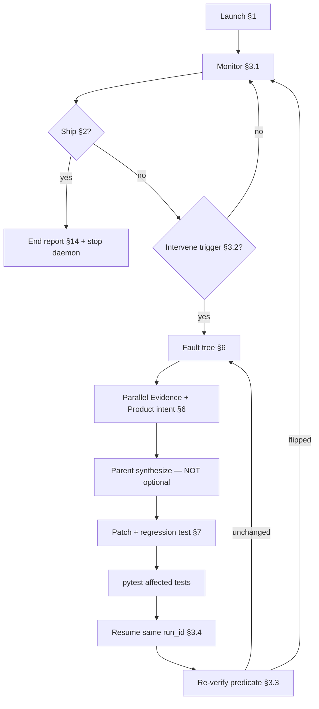

# Full-auto forensics run

Canonical workflow for a chat that runs Full-auto **and** patches the product when gates, QC, or heals lie. **Product debugger in the loop — not driver babysitter.**

**INPUT_FILE** = `<placeholder>` (under `ASSETS/input/`)

---

## 0. Agent contract (NON-NEGOTIABLE)

This plan **only works if the parent Cursor agent** runs the continuous loop in §3. Homunculus 0.1.0 and `full_auto_driver.py` **do not** replace the parent. Driver substring heals are **not** diagnosis.

### The parent MUST

1. **Launch** Full-auto once (§1) with **`MUX_FORENSICS=1`** and **`MUX_KEEPALIVE=1`**, then enter the **monitor → intervene → fix → verify → resume** loop until ship (§2) or a **documented hard blocker** (§4).
2. **Never end a chat turn** while the run is incomplete and no hard blocker is evidenced — except to poll again in the **same chat** within one turn cycle (monitor batch → act → monitor).
3. **Never stop after subagents** — Agent 1 (Evidence) + Agent 2 (Product intent) return **inputs** to the parent; the parent **synthesizes, patches, runs tests, resumes**, then returns to monitor.
4. **Treat driver exit as a trigger**, not session end — `needs_operator — Full-auto halted` means the driver process **exited** (`main()` return 1); the parent clears the predicate, patches if needed, and **restarts the driver** on the **same** `run_id` (§3.4).
5. **Track predicate flip** — every intervene ends with re-running the failing check; if unchanged, **do not** declare success or move on.
6. **Persist loop state** in `.cursor/plans/full_auto_forensics_state.md` (create/update every intervene) so context limits do not reset the mission.

### The parent MUST NOT

- Launch bare `interview_mux delivery` instead of `full_auto_driver` (forensics requires driver heal routing + identical-halt reset).
- Read the plan and stop.
- Delegate forensics to subagents without patching and resuming.
- Heal downstream of a producer bug (mix/finalize/transcript when VO/EDL is the producer).
- Waive quality, stub MusicGen, fake `stage_done`, or skip optional without product-defined path.
- Assume CPU/ffmpeg/chatterbox activity equals stage progress.

### Session opener (paste exactly)

The opener below is sufficient — **do not add env vars to the user message**. The agent MUST read §1 and launch with `MUX_FORENSICS=1` and `MUX_KEEPALIVE=1`.

```
Follow .cursor/plans/full_auto_forensics_run.plan.md.
INPUT_FILE = <basename under ASSETS/input/>
Run until success or evidenced hard blocker.
Enter the continuous loop (§3) immediately after launch. Do not end the chat until ship or §4 hard blocker.
```

---

## 1. Launch

Stop any prior Full-auto processes first:

```bash
python tools/full_auto_daemon_launch.py stop
```

Confirm clean:

```bash
pgrep -fl 'full_auto_driver\.py' || echo 'no driver'
curl -s http://127.0.0.1:8765/api/health || echo 'server down'
```

Start a **fresh** run (never reuse a prior execution unless resuming the **same** run after a product fix):

```bash
MUX_RUN_MODE=full-auto \
MUX_HOMUNCULUS_VERSION=0.1.0 \
MUX_FRESH=1 \
MUX_FORENSICS=1 \
MUX_KEEPALIVE=1 \
MUX_INPUT_AUDIO=ASSETS/input/<INPUT_FILE> \
./scripts/run.sh --full-auto --input ASSETS/input/<INPUT_FILE>
```

**Forensics env (required for this plan):**

| Env | Purpose |
|-----|---------|
| `MUX_FORENSICS=1` | Identical-failure ×3 is **telemetry only** for **all stages** (driver never halts on ×3 alone); clears **all** halt counters on every driver restart; clears all when product code fingerprint changes; re-execute any stage resets that stage's counters. **After 3× the same predicate without a product patch**, driver writes `operator/forensics_escalation.json` and **exits** so the parent agent must patch + restart. |
| `MUX_KEEPALIVE=1` | Restarts driver process after crash (not a substitute for the parent §3 loop) |

Replace `<INPUT_FILE>` with the basename only (e.g. `my_interview.wav`). `MUX_FRESH=1` forces a new `exec_*` directory.

**Immediately after launch:**

1. Read `ASSETS/full_auto_current_run.txt` → `run_id`
2. Write `.cursor/plans/full_auto_forensics_state.md` (§3.5 template)
3. Enter §3 loop — do not wait for the user

Monitor surfaces:

- `ASSETS/full_auto_console.log`
- `ASSETS/full_auto_current_run.txt`
- `ASSETS/executions/<run_id>/run_meta.json` (`needs_operator`, `journey_milestones`)
- Job API: `GET /api/runs/<run_id>/job`
- GUI: `http://127.0.0.1:8765`

---

## 2. Success criteria (ship bar)

All must hold unless a **documented hard blocker** (§4):

| Criterion | Verification |
|-----------|--------------|
| **Master exists** | `ASSETS/executions/<run_id>/master/master.wav` — non-trivial size |
| **Mechanical loudness** | `python tools/verify_master.py <run_dir>/master/master.wav` passes |
| **Listen delight** | `mastering/listen_delight_audit.json` — authoritative floors pass at `master_finalize` |
| **Publish envelope** | `master/post_master_quality.json` with `publish_allowed: true` |
| **Cover + publish** | `episode_cover_generate` + `podcast_publish` stage_done, or evidenced §4 blocker for S3 |
| **North star** | [NORTH_STAR.md](NORTH_STAR.md) human-listen rubric |

**Forbidden shortcuts:** `INTERVIEW_MUX_E2E_QUALITY_WAIVERS`, stub MusicGen, soft listenability, fake `stage_done`, predicate waivers not in product config.

---

## 3. Continuous loop (core)

This section **is** the plan. Everything else supports it.



### 3.1 Monitor (every 3–5 minutes while run active)

**If driver exited with `forensics stall escalated`:** do **not** restart until you have patched product code and run `pytest`. Then:

```bash
RUN=$(cat ASSETS/full_auto_current_run.txt)
python tools/forensics_probe.py --run-id "$RUN" --write
# patch + pytest, then restart driver (§3.4.1)
```

Run this batch (read-only unless resume):

```bash
RUN=$(cat ASSETS/full_auto_current_run.txt)
BASE="ASSETS/executions/$RUN"
DONE=$(ls "$BASE/.stage_done" 2>/dev/null | wc -l | tr -d ' ')
curl -s "http://127.0.0.1:8765/api/runs/$RUN/job" | .venv/bin/python -c "
import json,sys; j=json.load(sys.stdin)
print('status=', j.get('status'), 'stage=', j.get('current_stage'))
print('msg=', (j.get('message') or '')[:100])
print('err=', (j.get('error') or '')[:120] if j.get('error') else None)
"
tail -3 ASSETS/full_auto_console.log
pgrep -fl 'full_auto_driver\.py' || echo 'DRIVER DEAD'
pgrep -fl 'full_auto_keepalive_loop\.py' || echo 'KEEPALIVE DEAD'
test -f "$BASE/master/master.wav" && echo master=yes || echo master=no
```

If **KEEPALIVE DEAD** but driver should be running: restart per §3.4.1 (must include `MUX_KEEPALIVE=1`).

**Progress** = any of:

- `.stage_done/` count increases
- `current_stage` advances per [port-manifest](docs/v2/port-manifest.csv)
- Predicate moves toward ship (G1 missing list shrinks, PMQ passes, etc.)
- Console log new line with stage completion or intentional heal

**Not progress:** ffmpeg/chatterbox alone, pending writes with same stage index, identical job `message` >8 min.

Update state file: `last_progress_at`, `stages_done`, `current_stage`, `driver_alive`.

### 3.2 Intervene triggers (immediate)

Intervene when **any**:

| # | Trigger | Typical signal |
|---|---------|----------------|
| 1 | Job `error` / `gate` / `needs_operator` | API status, console `ERROR`, `PAUSE needs_operator` |
| 2 | **Driver dead** | `pgrep` empty; console `Full-auto halted` |
| 3 | **Idle ≥8 min** | No §3.1 progress signals |
| 4 | Identical failure ×3 | Console `STOP: … ×3`; `operator/identical_failures.json` `"halt": true` — **intervene + patch**, not session end; with `MUX_FORENSICS=1` ×3 never halts the driver (any stage) |
| 5 | Predicate unchanged after heal | Same `file:function` failure after resume |
| 6 | Disk vs checker lie | Artifact exists but check says missing (or inverse) |
| 7 | Monitor-only ≥15 min | Watching without fault tree + patch |
| 8 | Operator **PAUSE** / **STOP** | User message |

### 3.3 Predicate verification (required after every resume)

Before trusting progress, re-run the **exact check** that failed (not the driver log substring):

```bash
RUN=<run_id>
.venv/bin/python -c "
from interview_mux.run_context import RunContext
from interview_mux.gates import check_g1_vo
ctx = RunContext('$RUN')
print('check_g1_vo:', check_g1_vo(ctx) or 'clear')
print('vo_synthesize done:', ctx.is_done('vo_synthesize'))
"
# Add stage-specific probes per Agent 2 file:function
```

Record in state file: `last_predicate`, `last_predicate_before`, `predicate_flipped: true|false`.

**If not flipped:** another loop iteration — do not resume the same heal blindly.

### 3.4 Resume matrix

| Situation | Action |
|-----------|--------|
| Checker/read bug; artifact correct on disk | Same `run_id`, `--from-stage <producer>` or driver restart |
| Writer/commit bug | Same `run_id` + invalidate downstream + `--from-stage <producer>` |
| Schema/lineage/id churn | Same `run_id` + `python tools/audit_segment_lineage.py --run-id <run_id>` |
| **Driver exited** (`needs_operator`, halt) | Fix predicate if product bug → **restart driver same run** (§3.4.1) |
| Unrecoverable corruption | `MUX_FRESH=1` fresh run (document why in state file) |

#### 3.4.1 Restart driver on same run (after halt or dead process)

Driver exit does **not** end the mission:

```bash
python tools/full_auto_daemon_launch.py stop   # clean stray processes only if needed
MUX_RUN_MODE=full-auto \
MUX_HOMUNCULUS_VERSION=0.1.0 \
MUX_FRESH=0 \
MUX_FORENSICS=1 \
MUX_KEEPALIVE=1 \
MUX_RUN_ID=<run_id> \
MUX_INPUT_AUDIO=ASSETS/input/<INPUT_FILE> \
./scripts/run.sh --full-auto --input ASSETS/input/<INPUT_FILE>
```

Or attach driver only if server already up:

```bash
MUX_RUN_ID=<run_id> MUX_FRESH=0 MUX_FULL_AUTO=1 MUX_FORENSICS=1 MUX_KEEPALIVE=1 \
  .venv/bin/python -u tools/full_auto_driver.py
```

After restart:

- **All ×3 halts auto-clear** when `MUX_FORENSICS=1` (every driver start) or when git/product fingerprint changed since last run.
- Re-executing **any** stage clears that stage's identical-failure counters.
- Forensics driver **does not exit** on `needs_operator` or heal-cap — it logs, clears counters, and continues (agent still must patch root causes).
- Clear stale `needs_operator` automatically on forensics driver restart.

#### 3.4.2 Resume from producer (CLI)

```bash
.venv/bin/python -m interview_mux run --run-id <run_id> --from-stage <producer_stage>
```

Producer examples: `vo_line_adjudicate` → `vo_synthesize` → `edl_narrative_audit` → `edl` → `master_build`. Never resume ship stages when G1/EDL predicates fail.

### 3.5 Loop state file (mandatory)

Create/update `.cursor/plans/full_auto_forensics_state.md` on every launch and intervene:

```markdown
# Forensics loop state
- **INPUT_FILE:**
- **run_id:**
- **started_at:**
- **last_progress_at:**
- **driver_alive:** true|false
- **stages_done:** N/67
- **current_stage:**
- **g1_complete:** true|false (from journey_milestones)
- **intervention_count:**
- **last_predicate:** file:function — value
- **last_predicate_flipped:** true|false
- **open_blockers:** []
- **patches_this_session:** []
- **hard_blocker:** null | { reason, evidence }
```

---

## 4. Hard blockers (only valid stop conditions)

Stop the loop **only** when evidenced — document in state file + §14 report:

| Blocker | Evidence required |
|---------|-------------------|
| Missing secrets | `config/secrets/secrets.env` key absent; stage log names it |
| No network for S3 | G-Publish sync fails with network error; local ship otherwise complete |
| Operator PAUSE/STOP | User message |
| Hardware/GPU unavailable | Chatterbox/STT cannot run after retry; log + API error |
| Unfixable source tape | Corrupt input; documented after forensics |

**Not hard blockers:** `needs_operator`, identical_failure ×3, seed-order errors, hollow `stage_done`, missing VO WAVs — these require **product fix + resume**.

---

## 5. Major vs nested error taxonomy

### Major errors (intervene — fix product or operator decision)

- Job `error`, `gate`, `needs_operator`
- Driver exit / `Full-auto halted`
- `identical_failures` halt (×3)
- Hard quality gate: listen delight, verify_master, PMQ `publish_allowed: false`
- Schema/QC validation in payload
- Playbook mismatch vs `error_class`
- Heal OK but predicate unchanged
- File-on-disk vs checker lie

### Nested errors (trace upstream)

- Downstream fail because upstream producer did not commit
- Missing artifact while producer in `error` or open `operator/escalations/{stage}.json`

**Rule:** Fix the **major producer** only. Revisit nested only if it persists after major fix with a **new shape**.

---

## 6. Forensics protocol

**No resume before predicate understood.**

### Fault tree

```
symptom → predicate (file:function + field)
       → producer stage
       → contract break (publishability, schema, lineage, VO)
       → root cause class: matcher | commit | stale_producer | schema_writer | playbook_routing
```

### Parallel sub-agents (every intervene)

Launch **Agent 1 (Evidence)** and **Agent 2 (Product intent)** in parallel.

**Parent MUST immediately after subagents return:**

1. Write one-paragraph synthesis (predicate + producer + fix shape)
2. Patch product code (narrow diff)
3. Add/adjust regression test asserting predicate flip
4. Run `pytest tests/<relevant>.py -q`
5. Resume per §3.4
6. §3.3 verify predicate
7. Update state file → return to §3.1 monitor

**Do not** report subagent output to the user and stop.

#### Agent 1 — Evidence (prompt skeleton)

```
You are Agent 1 (Evidence). Run: <run_id>. Repo: <repo>.
Symptom: <one line from trigger>.
Return exactly: (1) run_id, job status, stage, gate (2) escalation/QC paths + key fields
(3) line_id/seg_id (4) disk vs checker paths (5) script_hash/pending vs committed
(6) identical_failures signature (7) predicate flip? (8) stage_done lie?
Read ASSETS/executions/<run_id>/. Do not patch.
```

#### Agent 2 — Product intent (prompt skeleton)

```
You are Agent 2 (Product intent). Run: <run_id>. Symptom: <one line>.
Return exactly: (1) file:function (2) failure shape (3) producer + heal_routing/--from-stage
(4) blast radius (5) two naive shortcuts (6) narrow fix + test location.
Read driver/homunculus/gates/stage_completion. Do not patch.
```

---

## 7. Fix gate

| Step | Action |
|------|--------|
| 1 | Match repair to failure **shape** |
| 2 | Narrow product fix (checker, writer, commit, agenda seed-order) |
| 3 | Regression test: predicate **flips** (or documents intentional operator path) |
| 4 | `pytest` affected tests before resume |
| 5 | Forbidden: false `stage_done`, stubs, waivers, downstream heal of producer bug |

### Known failure shapes (from production runs)

| Shape | Producer | Fix direction |
|-------|----------|---------------|
| Driver suicide on fresh launch | `ensure_run` DELETE session | `?keep_driver=true` on CLI path only |
| Hollow `vo_synthesize` done, G1 missing | `stage_completion` / `gates.check_g1_vo` | G1 required pickups in completion predicate |
| `premature_complete:vo_synthesize ×3` → ship stages | `full_auto_driver` | **G7** `premature_cap_hard_pin` — pin producer, never advance |
| Seed-order: EDL before `vo_synthesize` | `homunculus/agenda` | Defer consumer until producer outputs present |
| `spoken_copy_guard` on layup | adjudicate / gap recompose | Rewrite line text, re-adjudicate, synthesize |
| Hard-keep missing from `ordered_segment_ids` | `full_master_ranking` | Ranking validator / heal from selection lock |
| O1 MusicGen before assembly | `mmaudio_sfx` | **G2/G5** — music deferred until Phase A seal |
| O6 premature_complete ×3 then skip | `full_auto_driver` | **G7** hard pin |
| O7 `g1_complete` while G1 missing | `journey_state` | **G6** live `check_g1_vo` only |
| O8 Finished Synthesize VO + G1 open | `web/runner.py` | **G8** no Finished while pickups missing |
| S5 excluded-but-in-order CTA | `media_ip_cta` | **F1** `reconcile_ordered_vs_excluded` |
| S6 `open_high_salience_nuggets` halt | `nugget_layup_compose` | **F2** recover + spoken-copy before halt |
| V1 `vo_preface_*` forward-cue lint | `gap_framing_compose` | **F3** preface forward-cue heal |
| Hollow `.stage_done` on music/mix | `stage_completion` | **G1** `seed_stage_complete` + **G3** batch reconcile |

---

## 8. VO / G1 lie class

| Shape | Diagnosis | Repair |
|-------|-----------|--------|
| Missing pickup | Line in gap/adjudicate, no WAV | Adjudicate → synthesize; not EDL |
| WAV exists, check fails | matcher / script_hash drift | Commit path, synthesis entry |
| G1 ok with `synthesized: []` | Gate lied | Product bug until WAV + EDL clip committed |

---

## 9. Schema / QC

- Read **N validation errors** from stage payload
- Second LLM failure = hard stop → fix upstream → `--from-stage`

---

## 10. Pipeline break shapes (generic)

1. Segment lineage  2. Cuts / geometry  3. Selection vs EDL  4. VO / G1
5. EDL / narrative QC  6. Mix / delight  7. Analysis partials  8. Orchestration

---

## 11. Core invariants + forbidden list

### Invariants

- Read `operator/escalations/{stage}.json` before re-run
- Producer resume: geometry/id/text/order → producer stage, not mix remaster
- `heal_routing.PLAYBOOK_REGISTRY` for `error_class` → action
- After `seg_*` id change: `audit_segment_lineage.py`
- Publishability: selection leads EDL; PMQ before ship

### Forbidden

- Stopping after subagents without patch + resume
- Driver substring as sole diagnosis
- Healing mix/finalize for EDL/VO producer bugs
- Clearing `stage_done` without invalidate when artifacts changed
- Assuming auto-heal fixed predicate without re-read

---

## 12. Anti-patterns (why loops die)

| Anti-pattern | What happened | Plan fix |
|--------------|---------------|----------|
| Read plan, launch subagents, stop | Parent transcript ended at 2 lines | §0 contract + §3 loop mandatory |
| Driver thrashes forever in forensics | `MUX_FORENSICS=1` suppressed all halts | Stall guard exits after 3× same predicate; parent must patch before restart |
| Treat homunculus as debugger | Seed-order jump to EDL with G1 open | §6 parent patches agenda/completion |
| Ignore driver exit | `needs_operator` at 08:25, no restart | §3.4.1 restart same run_id |
| Monitor without intervene | 15+ min idle at 09:17 | §3.2 trigger #3 |
| Resume without predicate check | Hollow `vo_synthesize` persisted | §3.3 |
| Continue run without patch while predicate unchanged | Heal-only loop on exec_3751 | forensic_run_improvement_001 §0 stop-fix-rerun |
| MusicGen before Phase A seal | ~25 min orphaned GPU | G5 + delivery-phases.md |
| `g1_complete` milestone lie | Sticky-OR stored true | G6 |
| premature_complete ×3 advance | Skip assembly after ×3 | G7 hard pin |
| Ignore `operator/wasted_work.json` orphan | Silent GPU burn | Monitor `orphan` / `music_deferred` → patch, not heal-only |

Forensics parent: after Wave 0–2 guardrails, monitor `operator/wasted_work.json` for `orphan` / `music_deferred` and `run_meta.delivery_epoch` — intervene per §6 (patch required).

---

## 13. End report template

When ship bar met or §4 hard blocker:

```markdown
## What happened
(INPUT_FILE → outcome, run_id, interventions count)

## Root causes fixed
(predicate → producer → class → files changed, per intervention)

## Guardrails added
(tests, checkers, playbook fixes)

## Dead ends
(ruled out — prevents repeat)

## Quality & cleanup
(verify_master, delight, PMQ, lineage audit, daemon stopped)
```

---

## 14. When done

```bash
python tools/full_auto_daemon_launch.py stop
pgrep -fl 'full_auto_driver\.py' || echo 'clean'
```

Delete or archive `.cursor/plans/full_auto_forensics_state.md` after report.

---

## Mission

**Launch → monitor forever until ship or §4 blocker.** On every trigger: fault tree → subagents → **parent patch + test + resume** → verify predicate → monitor again.

VO/G1: missing pickup → adjudicate then synthesize; WAV exists but check fails → matcher/commit; G1 ok with empty synthesis is **not** success.

**The chat is not done until §2 ship bar or §4 hard blocker.**
