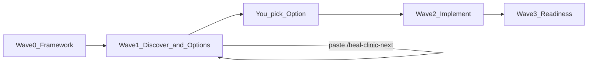

# Heal Clinic — operator-controlled heal variance cleanup

## Why this exists

Runtime failures on real executions often cluster in **heal variance**. This clinic does **not** auto-heal mid-run and does **not** decide for you. Operator-controlled flow:

1. Paste a command → agent works one bug class thoroughly.
2. You stay in control of **what caused it**.
3. Agent suggests related cousins and whether a **surgical** fix or a **bigger deterministic** SSOT change is wiser.
4. You get **Option 1 / 2 / 3** (plus Defer), each with plain-language pros/cons, a **real-world worst case**, and a **contextual recommendation**.
5. Paste `/heal-clinic-next` when you want the next open class.
6. Only when you pick a verdict does Wave 2 patch code.

**Goal:** Increase odds of error-free **partially-accelerated** runs first; improve **all modes** by fixing shared heal SSOT (no Partial-only soft lies).

**Campaign SSOT:** this file.  
**Pack root:** [`.cursor/heal-clinic/`](../heal-clinic/)  
**Skill / paste crib:** [`.cursor/skills/heal-clinic/SKILL.md`](../skills/heal-clinic/SKILL.md)

Related (do not merge): Debug mode (novel tape-quality / heal-audit when unclear).

---

## The five independent classes (one pack each)

Each class is its **own** clinic thread: own dossier, map, option packet, decisions log, solution swarm folder. Spawn **as many Cursor Agent chats / subagents as needed** per class; merge into one option packet before you decide.

| id | Plain name | What you notice |
|----|------------|-----------------|
| `wrong_pin` | Wrong pin | Heal/resume jumps to the wrong stage |
| `leapfrog_resume` | Leapfrog resume | Walk skips required upstream (e.g. layup → adjudicate) |
| `hollow_pass` | Hollow “pass” | Marked done / heal “ok” without real primary output |
| `heal_validate_stage_fail` | Heal-validate then stage-fail | Heal says pass; stage fails again (identical loop) |
| `post_heal_budget_thrash` | Budget thrash after “successful” heal | Heal looked done; then max_invokes / identical thrash |

HINT-only background (verify or drop on HEAD): prior Mohan exec histograms if the operator names a folder.

---

## Operator path (how you execute)

### Wave 0 — Framework (docs only)
- This plan frozen as doctrine.
- Pack under `.cursor/heal-clinic/` + skill paste prompts.
- Five class stubs + templates + ledger + queue + STEP_OFF.
- **No product patches.**

### Wave 1 — Analysis + options (you keep control)
Per class, in queue order (or your pick):

1. Paste **`/heal-clinic-discover CLASS=<id>`** → thorough L1 Possibility Map from **HEAD code** (code is king).
2. Paste **`/heal-clinic-options CLASS=<id>`** → Decision-style packet with **Option A / B / C / Defer**:
   - At least one **surgical** option and one **bigger deterministic SSOT** option when both are real.
   - Plain language TL;DR.
   - Pros / cons / trade-offs.
   - **Real-world worst case** if you pick each option.
   - **Contextual recommendation** (not a decision) + what it gives up.
   - Suggestions for **related cousin classes** to open next.
3. You answer with **`/heal-clinic-answer CLASS=<id> VERDICT=A|B|C|Defer|custom:…`** (or write in `classes/<id>/decisions.md`).
4. Paste **`/heal-clinic-next`** → next class with `L1` incomplete or options awaiting you.

**No product patches in Wave 1.**

### Wave 2 — Implement (only after your verdict)
Paste **`/heal-clinic-implement CLASS=<id>`** when verdict is logged.  
Patch unambiguous rows from the chosen option; stop on `needs_you`.  
Cascade tests `MUX_FORENSICS=0`. Update ledger. Prefer mode-wide SSOT.

### Wave 3 — Readiness rollup
Paste **`/heal-clinic-readiness`**.  
Write `heal_readiness.md`: are the five classes closed on HEAD? Odds for Partial + all-modes? Residual cousins? **Code-based**, not a live forensics campaign inside the clinic.

---

## Doctrine (non-negotiable)

- **You decide.** Agents recommend; never silent product patch from discover/options/next.
- **Code is king.** Tag claims: `IN_CODE` | `DOC_ONLY_UNVERIFIED` | `CODE_DOC_CONFLICT` | `UNKNOWN`.
- **Prior `exec_*`:** HINT only — verify or drop on HEAD. Do not browse `ASSETS/executions/` unless you name a folder.
- **Brain 0.2.0.** Mode lens: Partial for day-to-day; every option must state **all-modes / Full-auto impact** (`FULL_AUTO_REGRESSION_RISK` if Partial-only).
- **Lane split:** product auto-heal (improve under contract) ≠ Debug (quality / audit bad heals) ≠ this clinic (structured investigate → your options → implement).
- **No soft success:** no e2e_soft quality waiver, MusicGen stub, or hollow done to “raise odds.”
- **Simple language** in every option packet TL;DR and worst-case — operator-readable without jargon soup.
- **Dynamic agents:** no agent-count budget. Per class: census, map, devil’s advocate, surgical option author, SSOT option author, test/matrix designer — then **one merge** into `options.md`.

---

## Forced option shape (every class)

Copy from [templates/options_packet.md](../heal-clinic/templates/options_packet.md). Minimum:

| Option | Role (typical) |
|--------|----------------|
| **A** | Surgical — smallest honest fix on the hot call site |
| **B** | Bigger deterministic — one SSOT / shared rule that closes the cousin family |
| **C** | Alternate (CUT / refuse-hard / Partial gate / simplify) or second surgical if B not real |
| **Defer** | Need more HEAD evidence or a live Debug pass you request |

Each option must include: what we’d do · pros · cons · real-world worst case · Partial impact · all-modes impact · tests · reversibility.

Recommendation block: preferred letter · why for error-free Partial · honest downside · cousin classes to investigate next.

---

## Paste commands (operator)

Full text in [`.cursor/skills/heal-clinic/SKILL.md`](../skills/heal-clinic/SKILL.md) and [`.cursor/heal-clinic/paste_prompts.md`](../heal-clinic/paste_prompts.md).

| Command | When |
|---------|------|
| `/heal-clinic-next` | Pick up next open class (your main continue button) |
| `/heal-clinic-discover CLASS=<id>` | Deep cause map for one class |
| `/heal-clinic-options CLASS=<id>` | Build Option A/B/C packet + recommendation |
| `/heal-clinic-answer CLASS=<id> VERDICT=…` | Log your choice |
| `/heal-clinic-implement CLASS=<id>` | Wave 2 patch after verdict |
| `/heal-clinic-suggest-cousins CLASS=<id>` | Related classes / bigger SSOT opportunities |
| `/heal-clinic-readiness` | Wave 3 rollup |

Live resume: [`.cursor/heal-clinic/STEP_OFF.md`](../heal-clinic/STEP_OFF.md).

---

## Success

- All five classes: L1 complete + options packet + your verdict + (Wave 2) implement or explicit Defer.
- `heal_readiness.md` states residual risk for Partial and Full-auto in plain language.
- No clinic thread that patches without a logged verdict.

---

## Out of scope

- Mid-soak forensics doctor / silent auto-heal from the agent.
- Local heavy ML model tuning.
