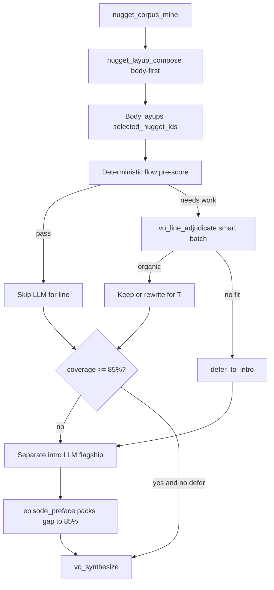

# Homunculus + Synthetic VO Hardening Plan

**Status: BUILT** (2026-08-28) — all 8 phases shipped. Progression chain walk seeds demo voice + SDP gates for full fixture traversal.

**Delivery model:** One complete, comprehensive implementation — all 8 phases ship together. Phases describe build order and dependency grouping, not separate PRs or partial releases.

## Decision constitution (locked from your answers)

| Layer | Decision | Your choice |
|-------|----------|-------------|
| **1 — Need framing?** | Native-only vs synthetic host path | **New early LLM stage** before gap work; monologue stays **deterministic fast-path**; conductor **informed** via packed volley stats (**Part C B**) |
| **2 — Which lines get text?** | Layup / gap compose | **`nugget_layup_compose`** primary allocator; **85% nugget air floor** (body + intro combined) when G-Framing Yes |
| **3 — Drop / waive before audio?** | Include vs drop vs intro-bury | **Smart second pass** (`vo_line_adjudicate`) + **smart separate intro LLM**; body-first organic placement, intro sink fills gap to **85%** |
| **Synth order** | Audit vs WAV | **5C**: synthesize **before** `edl_narrative_audit` |
| **Homunculus rails** | Part B | **1B, 2A, 3A, 4A, 5C, 6A, 7A, 8A, 9A, 10C, 11B, 12A** |
| **Hybrid** | Who blocks | **Conductor plans** (11B readiness + 1B prereq pack); **host blocks catastrophes** (2A, 7A, 9A, hollow done, music-before-assembly) |
| **Homunculus scope** | New stages | **`framing_posture_decide` + `vo_line_adjudicate` homunculus 0.1.0+ only**; 0.0.0 keeps legacy deterministic gap path (**4B**) |
| **Layer 1 authority** | Who picks native-only vs framing | **2M (middle ground):** Operator **G-Framing Yes/No** owns the binary synthetic-VO path (sticky). Early LLM **`framing_posture_decide` is advisory** — recommends Yes/No/sparse for the gate UI + conductor; may auto-accept only via existing `auto_accept_defaults`. LLM does **not** override explicit operator No/Yes. |
| **Layer 2–3 authority** | What text airs | **LLM authoritative** at `nugget_layup_compose`, `vo_line_adjudicate`, intro mint (**3C**), nugget include/drop/rewrite |
| **Intro / nuggets** | Distribution policy | **Body-first** organic layups → **intro sink** for non-organic remainder → **85% total nugget air coverage** (body + intro) when G-Framing Yes |
| **Defaults** | G1 / min lines | **`v2.g1_optional: true`** when framing on; **`min_synthetic_vo_lines`** N/A when Layer 1 OFF |

---

## Nugget distribution architecture (what exists vs what is planned)

**Operator intent (locked):** When G-Framing is **Yes**, target **≥85% nugget air coverage** (eligible corpus nuggets aired in body and/or intro). **Body layups first** — each synthetic line must organically lay up into **immediate next native T**. Nuggets that **cannot** find an organic pre-native seam are **`defer_to_intro`**; a **separate smart intro LLM call** weaves them (plus any gap needed to reach 85%) into one palatable opening VO at position 0.

### 85% coverage rule (G-Framing Yes)

```
eligible     = corpus nuggets − waived − already native in selection
body_aired   = nugget_ids spent in body layup lines (after adjudicate)
intro_aired  = nugget_ids in intro preface line
coverage     = (body_aired ∪ intro_aired) / eligible
target       = coverage ≥ 0.85  (config: analysis.nugget_layup.min_nugget_air_coverage)
```

| Phase | What happens |
|-------|----------------|
| **1 — Body (compose)** | LLM assigns nuggets to best pre-native seams for **T**; prefer organic bridges; typed skip only when handoff truly clear |
| **2 — Body (adjudicate)** | Smart second pass: improve flow, **move** misfit nuggets to better seam or **`defer_to_intro`** |
| **3 — Intro sink** | Separate LLM packs **deferred + gap-to-85%** nuggets into one intro (not a list dump) |
| **4 — Waive** | Only nuggets above 85% ceiling or operator force G1 skip may be explicitly waived |

**Not 100%:** up to **15%** of eligible nuggets may remain unaired with typed waive + omit ledger when no organic home exists and intro is full.

### What exists today (code)

| Capability | Status | Where |
|------------|--------|-------|
| Mine nuggets from full tape (kept + excluded) | **Exists** | `nugget_corpus_mine` → `understanding/nugget_corpus.json` |
| Know where each native sits in air order | **Exists** | `build_layup_compose_input()` walks selection order; each native has `air_index`, `segment_id`, timing |
| Rank open nuggets **per target native T** | **Exists (deterministic)** | `rank_open_nuggets_for_target()` → `open_nuggets_ranked[]` packed per native |
| Pack **prior native close + next native T text + seam** for LLM | **Exists** | `prior_closing_excerpt`, `comprehensible_text`, `seam_reason`, `handoff_need` in compose packet |
| Walk **already aired nuggets** in air order | **Exists** | `already_aired_nugget_ids`, `already_claimed_facts` |
| LLM assigns nuggets + writes layup text **for next native T** | **Exists** | `nugget_layup_compose`: `selected_nugget_ids`, `setup_from_nuggets`, `forward_unlock`, `text` |
| Require analysis tying line → **T** | **Exists** | `target_beat`, `listener_need_entering_T`, `forward_unlock` (QC) |
| Sparse placement (~55% layup row floor) | **Raised to 85% nugget metric** | `min_nugget_air_coverage: 0.85`, `min_layup_coverage: 0.70` |
| Deterministic high/critical nugget recovery | **Exists (demoted to hints)** | `recover_open_high_salience_nuggets()` feeds adjudicate packet |
| Intro bury for leftovers | **Superseded by 3C intro LLM** | `nugget_intro_compose.py` flagship intro at position 0 |
| WAV staleness vs naive 9C | **Built** | `line_vo_wav_fresh`, `should_skip_adjudicate_for_line`, `s2s_runner` fix |
| `invalidate_synthesis_entries` + 1A full nuke | **Built** | `vo_synthesis_audit.py`, `nuke_all_synth_wavs_on_adjudicate_change` |
| Per-line pre-Chatterbox nugget re-allocation | **Built** | [`vo_line_adjudicate.py`](src/interview_mux/vo_line_adjudicate.py) + stage runner |
| Separate LLM intro-weaving call | **Built** | [`nugget_intro_compose.py`](src/interview_mux/nugget_intro_compose.py) — 3C intro sink |
| Global nugget→segment planner artifact | **Built** | `understanding/nugget_allocation_plan.json` |

### Delivered in this plan (implemented)

| Capability | Plan phase |
|------------|------------|
| **`min_nugget_air_coverage: 0.85`** config + QC gate (body + intro) | Phase 5 |
| **Smart `vo_line_adjudicate`** — flow scoring, selective LLM, nugget move/defer | Phase 3 |
| **Smart intro LLM (3C)** — cluster deferred nuggets, gap-to-85%, one cohesive preface | Phase 3 |
| `nugget_allocation_plan.json` — body vs intro vs waived audit trail | Phase 5 |
| Raise layup prompt from “air sparsely” to “body-first toward 85% nugget coverage” | Phase 5 |

### Smart second pass — `vo_line_adjudicate` (Phase 3)

Not a blind re-run of every line. **Smart routing:**

1. **Deterministic pre-score** each body line: overlap of layup `text` + `forward_unlock` with **T** comprehensible excerpt; restate penalty; nugget relevance to **T** via `rank_open_nuggets_for_target`.
2. **LLM only when needed:** lines below flow threshold, lines with `defer_to_intro` candidates, lines whose nuggets score higher on a **different** seam (move opportunity), or hash changed (**8B**).
3. **Batch by air order** (same batch_size config); each volley includes **T**, prior close, and **both** adjacent natives when at seam boundaries.
4. **Actions:** `air` (unchanged), `rewrite` (better bridge into **T**), `move_nugget` (reassign to another line_id / target), `defer_to_intro` (no organic fit — remove from body line).
5. **Never drop nuggets** to meet coverage — only `defer_to_intro` or `move`; drops require operator waive.
6. **Economy tier (12C)** for adjudicate batches; cheap because most lines skip LLM when pre-score passes.

### Smart intro LLM — separate call (Phase 3, 3C)

1. **Input packet:** all `defer_to_intro` nugget claims + **`gap_to_85%`** ranked list (next-best nuggets not yet aired if body+defer still below 85%), content brief thesis/guest, word budget.
2. **One flagship volley** (not economy — single high-quality intro justifies better model) composes **one** `episode_preface` line: 2–4 clustered facts, intriguing hook, softened paraphrase (not verbatim list).
3. **Mint at position 0**; stamp `nugget_ids` / `intro_nugget_recovery: true`.
4. **If body coverage already ≥85%** with no deferred nuggets: skip intro LLM (no empty intro).
5. **7A exception:** zero body synthesize lines but framing Yes → intro LLM still runs if nuggets exist and coverage gap > 0.

### Target flow (G-Framing Yes)



---

## Target architecture

```mermaid
flowchart TD
  subgraph analysis [Analysis — Layer 1 homunculus 0.1.0+]
    Topo[source_topology_build]
    Brief[content_brief_reanchor]
    Decide[framing_posture_decide NEW LLM]
    MF[missing_framing]
    GFC[gap_framing_compose]
    Topo --> Brief --> Decide
    Decide -->|native_only| SkipGap[ensure_gap_fill_skipped]
    Decide -->|framing| MF --> GFC
  end

  subgraph delivery [Delivery — Layers 2–3 homunculus 0.1.0+]
    Layup[nugget_layup_compose LLM]
    Trans[transitions + sound_design_vo_finalize]
    Adj[vo_line_adjudicate NEW LLM per line]
    IntroMint[intro mint position 0 if nuggets remain]
    Synth[vo_synthesize Chatterbox full refresh]
    Audit[edl_narrative_audit LLM hears WAV]
    EDL[edl]
    Layup --> Trans --> Adj
    Adj -->|zero synth lines| SkipAdj[skip adjudicate no LLM]
    Adj -->|has synth lines| IntroMint --> Synth --> Audit --> EDL
    SkipAdj --> Synth
  end

  subgraph legacy [Original 0.0.0]
    LegacyGap[gap_fill_eligibility deterministic]
    LegacyPath[existing layup + vo_synthesize order until migrated]
  end
```



**Authority shift:** LLM stages make **first-cut** include/drop/rewrite decisions. Existing deterministic paths ([`evaluate_layup_qc`](src/interview_mux/nugget_layup.py), [`recover_open_high_salience_nuggets`](src/interview_mux/nugget_layup.py), [`spoken_copy_guard`](src/interview_mux/spoken_copy_guard.py)) become **safety rails** (schema, invented-island, clone-adjacency, spoken-copy hash) — they **warn or hard-stop only on catastrophic violations**, not re-decide editorial include/drop.

---

## Phase 1 — PipelineMode artifact + host planning (Part D foundation)

**Goal:** Single source of truth for Layer 1 posture that homunculus, full-auto, and gap stages read.

| Deliverable | Details |
|-------------|---------|
| **`PipelineMode` artifact** | `understanding/pipeline_mode.json` — `{ mode: native_only \| framing_sparse \| framing_full, decided_by: operator_g_framing \| auto_accept \| deterministic_monologue, reason_codes }` — **set from G-Framing gate**, not from LLM alone |
| **`resolve_stage_plan` host tool** | New homunculus tool in [`registry.py`](src/interview_mux/homunculus/registry.py) + [`loop.py`](src/interview_mux/homunculus/loop.py): given target stage → `{ blockers, prereq_chain, invalidate_set, recommended_next }` using [`artifact_dependency_graph.py`](src/interview_mux/artifact_dependency_graph.py) |
| **`rerun_with_impact` (8A)** | Wraps `invalidate_downstream` + ADG transitive consumers; conductor calls instead of blind invalidate |
| **Wire readers** | [`gap_fill_eligibility.py`](src/interview_mux/gap_fill_eligibility.py), [`homunculus/gates.py`](src/interview_mux/homunculus/gates.py), [`agenda.py`](src/interview_mux/homunculus/agenda.py) `DELIVERY_ANALYSIS_PREREQS` respect `native_only` |

---

## Phase 2 — Early LLM framing posture (Layer 1 + Part C B)

**New stage:** `framing_posture_decide`  
**Placement:** in [`ANALYSIS_ORDER`](src/interview_mux/v2/config.py) **after** `content_brief_reanchor`, **before** `missing_framing`.

**Behavior:**
1. **Deterministic fast-path (keep):** `assess_gap_fill_eligibility()` in [`gap_fill_eligibility.py`](src/interview_mux/gap_fill_eligibility.py) — true monologue / forced skip → `native_only` without LLM spend.
2. **LLM path (new):** flagship volley packs topology, content brief, speaker roles, interview spine, volley/change-rate stats (Part C B signals 1–5), exclusion ratio hints, early comprehension risks → outputs `framing_posture_decision.json` + persists `pipeline_mode.json`.
3. **Host enforcement:** `native_only` → call existing [`ensure_gap_fill_skipped()`](src/interview_mux/stages/gaps.py) and **skip** `missing_framing` / `gap_framing_compose` LLM spend (stages write stubs only). `framing_*` → proceed normally.
4. **Authority (2M — locked, replaces 2C):**
   - **Binary switch (Layer 1):** Operator **G-Framing gate** decides **whether** synthetic VO path runs at all. Sticky Yes/No wins over LLM.
   - **LLM role at this stage:** `framing_posture_decide` outputs **`recommended_framing`** + `framing_sparse|framing_full` hint — **advisory only**. Packed into G-Framing GUI (“LLM suggests: Yes, sparse”) and conductor context. Does **not** set `pipeline_mode=native_only` or skip gap stages unless operator chose No (or monologue deterministic skip / forced `gap_fill_mode`).
   - **Auto-accept middle ground:** When operator has **not** chosen yet, existing [`auto_accept_defaults`](config/app.defaults.json) / unattended may accept LLM recommendation — same as today’s homunculus auto-resolve for hosted 1:1, but **never overwrites explicit operator No**.
   - **Text (Layer 2–3):** Once G-Framing is **Yes**, LLM is **authoritative** for line text, include/drop, rewrite, nugget placement (`nugget_layup_compose` → `vo_line_adjudicate`).
5. **Homunculus-only (4B):** stage runs **only when** `run_meta.homunculus_version >= 0.1.0`. Original **0.0.0** skips this stage and uses existing [`assess_gap_fill_eligibility()`](src/interview_mux/gap_fill_eligibility.py) + G-Framing gate unchanged.
6. **Conductor alignment:** pack LLM recommendation + operator G-Framing choice + `pipeline_mode` into conductor turn; conductor must not run gap LLM spend when G-Framing is No.

**New files:**
- `src/interview_mux/framing_posture.py` — payload build, persist, host gate
- `src/interview_mux/stages/framing_posture_decide.py` — stage runner via `run_flow_llm_stage`
- `docs/prompts/framing/framing-posture-decide.system.txt`
- `docs/cross-cutting/json-schemas/framing_posture_decision.schema.json`
- `docs/cross-cutting/stage-contracts/framing_posture_decide.yaml`

**Register in:** [`pipeline.py`](src/interview_mux/pipeline.py) with homunculus version guard, [`v2/config.py`](src/interview_mux/v2/config.py) `ALL_LLM_STAGES`, [`llm_interaction_registry.py`](src/interview_mux/llm_interaction_registry.py), [`web/stages.py`](src/interview_mux/web/stages.py) (hide when 0.0.0), `docs/v2/port-manifest.csv` (**14A**).

---

## Phase 3 — Per-line pre-Chatterbox adjudication + smart intro (Layer 3 core)

**New stage:** `vo_line_adjudicate` (+ embedded **`nugget_intro_compose`** sub-stage — separate LLM call, same stage runner)  
**Placement:** in `DELIVERY_ORDER` **after** `sound_design_vo_finalize`, **before** `vo_synthesize` (implements 5C ordering).  
**Scope (4B):** homunculus **0.1.0+ only**; gated by `analysis.gap_vo.adjudicate_before_synth` (**11A**, default true). 0.0.0 skips — goes straight to `vo_synthesize`.

### Part A — Smart body second pass

See **Smart second pass** in nugget distribution section above. Implementation in `vo_line_adjudicate.py`:

- `score_layup_flow_fit(line, target_native, masks) -> float`
- `lines_needing_adjudication(gap_report, layup_plan, threshold) -> list[line_id]`
- `run_adjudicate_batches(...)` — economy tier (**12C**), hash-idempotent (**8B**)
- Outputs update `gap_report` + append `understanding/vo_line_adjudication.json` + `understanding/nugget_allocation_plan.json` (body rows)

**Per-line outputs:** `{ action: air | rewrite | move_nugget | defer_to_intro, final_text, target_segment_id, nugget_ids[], flow_rationale, nugget_disposition }`

**Standard gates (unchanged):** Chatterbox gate (**11A**), **9C smart WAV skip** (**implemented** — see below), full resynth on mutation (**1A**), trace (**10B**).

### 9C smart WAV staleness (implemented)

**Problem:** Naive 9C (“skip if `vo_pickup/{id}.wav` exists”) lets stale audio slip through after layup/adjudicate rewrites text.

**Rule:** Skip adjudicate LLM and skip re-synth **only** when [`line_vo_wav_fresh(ctx, line)`](src/interview_mux/vo_synthesis_audit.py) is true — on-disk WAV **and** `synthesis_report` `script_hash` matches current `gap_report` text.

| Function | File | Role |
|----------|------|------|
| `line_vo_wav_path` | `vo_synthesis_audit.py` | Uses `resolve_vo_pickup_path` (already hash-aware) |
| `line_vo_wav_fresh` | `vo_synthesis_audit.py` | Returns `(False, stale_script_hash)` when text drifted |
| `should_skip_adjudicate_for_line` | `vo_synthesis_audit.py` | 9C gate for future adjudicate stage |
| `lines_needing_adjudicate` | `vo_line_adjudicate.py` | Filters synthesize lines needing LLM |
| `invalidate_synthesis_entries` | `vo_synthesis_audit.py` | Drop audit rows on rewrite (heal path) |
| `synthesize_line` skip | `s2s_runner.py` | **Fixed:** removed bypass that returned stale WAV from `vo_pickup/` / `synthesized/` |

**Interaction with 1A:** When adjudicate mutates text, full WAV nuke + `invalidate_synthesis_entries` ensures next synth pass cannot skip on stale hash.

**7A + intro exception:** zero body `delivery: synthesize` lines → skip Part A; still run **Part B intro LLM** if G-Framing Yes and nuggets need airing toward 85%.

### Part B — Smart intro LLM (3C, separate call)

See **Smart intro LLM** in nugget distribution section. New prompt `docs/prompts/vo/nugget-intro-compose.system.txt`:

- Trigger: `defer_to_intro` non-empty **OR** `nugget_coverage < min_nugget_air_coverage (0.85)`
- **Flagship tier** for this single call (quality over cost for one intro)
- Output: one `gap_report` orientation/`episode_preface` line at position 0
- Persist `understanding/nugget_intro_compose.json` with clustered themes + nugget_ids aired

**Demote deterministic overrides:**
- [`recover_open_high_salience_nuggets()`](src/interview_mux/nugget_layup.py) → **feeds suggestions** into adjudicate packet instead of auto-unskip (keep as fail-safe when adjudicate stage skipped).
- [`block_on_open_high_salience`](config/app.defaults.json) → default **warn**; hard-fail only if adjudicate also waived without operator force.

**New files:**
- `src/interview_mux/vo_line_adjudicate.py` — flow scoring, batch adjudicate, coverage math, intro compose orchestration
- `src/interview_mux/nugget_intro_compose.py` — separate intro LLM call + gap-to-85% selection
- `src/interview_mux/stages/vo_line_adjudicate.py`
- `docs/prompts/vo/vo-line-adjudicate.system.txt`
- `docs/prompts/vo/nugget-intro-compose.system.txt`
- `docs/cross-cutting/json-schemas/vo_line_adjudication.schema.json`
- `docs/cross-cutting/json-schemas/nugget_intro_compose.schema.json`
- `docs/cross-cutting/json-schemas/nugget_allocation_plan.schema.json`
- `docs/cross-cutting/stage-contracts/vo_line_adjudicate.yaml`

---

## Phase 4 — Stage reorder + audit adaptation (5C)

**Change [`DELIVERY_ORDER`](src/interview_mux/v2/config.py):**

```
... sound_design_vo_finalize
→ vo_line_adjudicate   (NEW)
→ vo_synthesize        (MOVED UP)
→ edl_narrative_audit  (MOVED DOWN — now audits with WAV)
→ edl
```

**Update consumers:**
- [`edl_narrative_audit.py`](src/interview_mux/stages/edl_narrative_audit.py) — `compact_vo_coverage()` already checks WAV presence; extend audit prompt to judge **heard** flow, not script-only.
- [`heal_routing.py`](src/interview_mux/heal_routing.py) `FAMILY_G1_MISSING` — resume from `vo_line_adjudicate` not `vo_synthesize` when script stale.
- [`stage_input_checks.py`](src/interview_mux/stage_input_checks.py) — prereqs for audit require synth complete (or G1 optional demotion unchanged).
- [`tools/full_auto_driver.py`](tools/full_auto_driver.py) — heal loops, breakpoint catalog, stage-order fingerprints.

---

## Phase 5 — Layup compose alignment (Layer 2, LLM-first, 85% floor)

**Keep** [`nugget_layup_compose`](src/interview_mux/stages/analysis_extended.py) as **primary nugget→seam allocator** (body-first):

- Prompt update: prioritize organic placement toward **85% nugget coverage** via body; defer non-organic to adjudicate → intro sink (not “air sparsely”).
- Config: `analysis.nugget_layup.min_nugget_air_coverage: 0.85` (new); consider raising `min_layup_coverage` to **0.70** for row density while nugget metric is authoritative.
- **`evaluate_layup_qc`:** add `evaluate_nugget_air_coverage(body_plan)` — soft warn at compose; **hard check after adjudicate + intro** in `vo_line_adjudicate` persist.
- Emit **`understanding/nugget_allocation_plan.json`:** `{ body: [{nugget_id, target_segment_id}], intro: [nugget_id], waived: [...], coverage: 0.xx }`.
- Compose = draft + initial allocation; adjudicate = smart refine; intro LLM = gap fill to 85%.

**G1 / operator:**
- Keep [`waive_nuggets_for_skipped_vo_lines()`](src/interview_mux/nugget_layup.py) on force skip ([`server.py`](src/interview_mux/web/server.py)).
- Adjudicate stage **respects** operator skips and omit ledger waives.

---

## Phase 6 — Homunculus hardening (Part B 1B–12A)

| Choice | Implementation |
|--------|----------------|
| **1B** | Pack `DELIVERY_ANALYSIS_PREREQS` checklist + `resolve_stage_plan("topic_coverage_audit")` snapshot into conductor user message each turn |
| **2A** | In [`agenda.skip_stage`](src/interview_mux/homunculus/agenda.py): when `pipeline_mode != native_only`, refuse skip of `source_topology_build` without topology + speaker samples |
| **3A** | Already in `_pre_ranking_rounds_present` — verify tests stay green |
| **4A** | Already mostly wired — add explicit `stage_outputs_present("mmaudio_sfx")` WAV parity assertion in homunculus dispatch |
| **5C** | Phase 4 reorder |
| **6A** | On selection order hash change: auto `invalidate_downstream("nugget_layup_compose")` via [`order_hash.py`](src/interview_mux/order_hash.py) hook in selection persist |
| **7A** | Already in `unmark_hollow_delivery_producers` — extend to new stages |
| **8A** | Phase 1 `rerun_with_impact` tool |
| **9A** | Already `_refuse_music_before_assembly` |
| **10C** | **Bounded hollow-skip block** (see §10C anti-loop policy below) — refuse skip when `.stage_done` lies; **one** structured rerun suggestion; then **operator halt**, never open-ended rerun |
| **11B** | Pack [`build_delivery_readiness_report()`](src/interview_mux/progression_readiness.py) into conductor context (compact layers: gate, cross, completeness, preflight) |
| **12A** | On halt: write `mastering/homunculus/plan.json` `{ last_target, blockers, attempted_heals, recommended_next, pipeline_mode }` + surface in GUI Executions tab |

**Conductor prompt:** extend [`conductor/system.txt`](docs/prompts/homunculus/conductor/system.txt) with new stage names, 5C order, adjudicate-before-synth law, `pipeline_mode` enforcement.

### 10C anti-loop policy (answers “will this run forever?”)

**Short answer: No — not infinite.** Existing hard caps already stop homunculus even today:

| Cap | Where | Effect |
|-----|-------|--------|
| **3 invokes per stage identity** | [`budget.py`](src/interview_mux/homunculus/budget.py) `max_invokes_per_identity` | After 3 `run_stage`/`rerun_stage` for same stage → `LimitExhausted` |
| **3 identical failure signatures** | [`identical_failures.py`](src/interview_mux/identical_failures.py) `identical_failure_halt_after` | Same error fingerprint 3× → `needs_operator: true`, halt |
| **Conductor turn cap** | `max_conductor_turns` (= 3 × 66 stages) | Conductor loop exits → `limit_exhausted.json` |
| **7A hollow unmark** | [`agenda.py`](src/interview_mux/homunculus/agenda.py) `unmark_hollow_delivery_producers` | Clears lying `.stage_done` so walk reruns once — does not auto-retry forever |

**What 10C adds (and the risk):** It closes an escape hatch where the conductor **skips** a stage that has a `.stage_done` marker but **fails completeness** (hollow progress). Without 10C, skip + hollow done = fake forward progress → later stages loop or fail obscurely. With naive 10C (“always force rerun”), the conductor could burn **up to 3 LLM reruns** on a persistently broken stage before caps halt — **bounded but costly**.

**Revised 10C behavior (bounded, not loop-until-success):**

1. **Detect hollow:** `ctx.is_done(stage)` AND NOT `stage_outputs_present(stage)` (or completeness rule fail).
2. **Refuse skip** with structured response — not open-ended prose:
   ```json
   {
     "ok": false,
     "reason": "hollow_done",
     "stage": "nugget_layup_compose",
     "action": "unmark_and_rerun_once",
     "remaining_rerun_budget": 2,
     "do_not": ["skip_stage", "invalidate_downstream"]
   }
   ```
3. **Auto-unmark once per signature:** call existing `unmark_hollow_delivery_producers` / `unmark_stage_only` — host action, **no LLM spend**.
4. **Fingerprint hollow-skip attempts:** record via `note_identical_stage_error` / `record_identical_failure` with signature `hollow_skip_blocked:{stage}:{completeness_rule}`.
5. **Escalation ladder (same stage, same fingerprint):**
   - **1st block:** unmark + suggest **one** `rerun_stage` (conductor may add facts via pack).
   - **2nd block (rerun still hollow):** refuse further reruns for that identity; write **`plan.json` (12A)** with blockers; set `needs_operator`.
   - **3rd identical signature:** hard halt via existing `identical_failures` → `limit_exhausted.json`.
6. **Conductor prompt law:** “After `hollow_done` block, rerun **once**. If the same completeness miss repeats, **halt for operator** — do not skip, do not invalidate downstream, do not repack the same volley.”
7. **GUI mirror (no auto-loop):** Skip API returns the same structured payload + **operator card** (“Stage marked done but output incomplete — rerun required”). GUI **does not** auto-trigger rerun; operator or homunculus must explicitly confirm. Full-auto uses identical_failures gate — **no unbounded heal loop**.

**What 10C is NOT:**
- Not “retry until QC passes”
- Not bypassing `max_invokes_per_identity`
- Not a new LLM stage
- Not replacing 7A — it **complements** 7A by preventing skip from circumventing hollow detection

---

## Phase 7 — Full-auto parity + heal unification

- [`full_auto_driver.py`](tools/full_auto_driver.py): same `pipeline_mode` gates; topology heal loop unchanged (2A); new heal family `vo_adjudicate_stale` → rerun adjudicate + synth.
- Unify homunculus `emit_issue` → [`heal_routing.classify_heal_error`](src/interview_mux/heal_routing.py) where signatures match.
- Update [`docs/cross-cutting/unattended-breakpoints.json`](docs/cross-cutting/unattended-breakpoints.json) via `tools/catalog_unattended_breakpoints.py`.
- Update [`docs/workflows/operator-gates.md`](docs/workflows/operator-gates.md): G-Framing **authoritative for Layer 1** (2M); LLM recommendation at gate; LLM authoritative for line text when Yes
- Update [`docs/cross-cutting/nugget-layup-system.md`](docs/cross-cutting/nugget-layup-system.md) + [`docs/v2/port-manifest.csv`](docs/v2/port-manifest.csv) (**14A** — mark homunculus-only stages)

---

## Phase 8 — Config, GUI, verification

**New config keys** (`config/app.defaults.json` + [`docs/cross-cutting/config-keys.md`](docs/cross-cutting/config-keys.md)):

| Key | Default | Purpose |
|-----|---------|---------|
| `analysis.framing_posture.enabled` | true | Feature flag — disable per run (**11A**) |
| `analysis.framing_posture.llm_tier` | flagship | Early posture LLM |
| `analysis.framing_posture.host_enforce` | true | Block gap path when native_only |
| `analysis.gap_vo.adjudicate_before_synth` | true | Require vo_line_adjudicate (**11A**) |
| `analysis.gap_vo.adjudicate_batch_size` | 5 | Lines per volley |
| `analysis.gap_vo.adjudicate_llm_tier` | economy | Cheapest OpenAI tier for all adjudicate lines (**12C**) |
| `analysis.gap_vo.adjudicate_fail_open` | false | No Chatterbox without adjudication (0.1.0+) |
| `analysis.gap_vo.full_resynth_on_adjudicate_change` | true | 1A — nuke all WAVs on any adjudicate mutation |
| `analysis.nugget_layup.min_nugget_air_coverage` | 0.85 | Body + intro combined nugget air floor (G-Framing Yes) |
| `analysis.nugget_layup.min_layup_coverage` | 0.70 | Layup row density (raised from 0.55; secondary to nugget metric) |
| `analysis.gap_vo.adjudicate_flow_threshold` | 0.55 | Pre-score below → LLM adjudicate |
| `analysis.gap_vo.intro_compose_llm_tier` | flagship | Smart intro LLM (single call) |

**GUI:** [`PipelineTab.tsx`](frontend/src/components/tabs/PipelineTab.tsx) — show `pipeline_mode`, adjudication status per VO line; gate focus for new stages.

**Build:** `./scripts/build_gui.sh` after frontend changes.

**Tests to add:**
- `tests/test_framing_posture_decide.py` — monologue skip, LLM recommendation advisory (2M), G-Framing No blocks gap path, G-Framing Yes enables LLM text stages
- `tests/test_vo_wav_fresh.py` — stale_script_hash, fresh match, s2s_runner re-synth on drift, lines_needing_adjudicate
- `tests/test_vo_line_adjudicate.py` — drop, rewrite, intro mint 3C, synth gate, 7A empty skip, 9C smart skip, 1A full resynth
- `tests/test_delivery_stage_order.py` — 5C ordering + audit sees WAV
- `tests/test_homunculus_only_new_stages.py` — 4B: 0.0.0 skips new stages; 0.1.0 runs them
- Extend [`tests/test_nugget_layup.py`](tests/test_nugget_layup.py), [`tests/test_gate_focus.py`](tests/test_gate_focus.py), homunculus agenda tests
- **13B:** minimal synthetic fixture in CI; document manual exec_188 check in smoke-test

**Final verification (all phases complete):**
```bash
./tools/check_prerequisites.sh
pytest tests/
python tools/audit_config_keys.py
./scripts/verify_artifact_contract.sh
./scripts/build_gui.sh
```

---

## Risk mitigations

| Risk | Mitigation |
|------|------------|
| LLM cost / latency (per-line) | **12C** economy tier for all adjudicate; batching; **7A** skip when empty |
| 3C fights native cold open | Accepted by operator choice — intro always wins when nuggets remain; document in operator-gates |
| 2C overrides operator G-Framing | **2M** — G-Framing owns ON/OFF; GUI shows LLM recommendation alongside operator choice |
| 1A full resynth cost | Only triggers when adjudicate mutates gap_report; idempotent skip when unchanged (**8B**) |
| 4B 0.0.0 divergence | Document two paths in operator-journey; port-manifest notes homunculus-only stages |
| Double-decision conflict (layup vs adjudicate) | Clear authority: adjudicate wins; layup = draft |
| 5C breaks audit remutate paths | Update [`edl_narrative_remutate.py`](src/interview_mux/edl_narrative_remutate.py) to remutate through adjudicate |
| Homunculus skip loops | 10C bounded hollow-skip + identical_failures + 12A plan.json |
| In-progress runs | **5A** auto unmark downstream on resume |
| 9C stale WAV after text rewrite | **`line_vo_wav_fresh`** implemented; `s2s_runner` fixed |
| 85% unreachable on thin corpus | **Warn + ship** with `nugget_allocation_plan.coverage` in GUI; no hard-block master unless operator opts in |

---

## Recommended improvements — locked option choices (operator confirmed)

| # | Topic | **Your choice** | Implementation note |
|---|-------|-----------------|---------------------|
| 1 | Stale WAV after rewrite | **A** | Delete **all** synth WAVs; full `vo_synthesize` re-run before audit on any adjudicate mutation |
| 2 | G-Framing vs LLM posture | **2M** | **G-Framing = whether synthetic VO (Layer 1). LLM = what the text is (Layer 2–3).** Early LLM advisory + sparse/full hint only. |
| 3 | Intro mint + air order | **C** | **Always** mint intro at position 0 when nuggets remain (max recovery) |
| 4 | 0.0.0 brain parity | **B** | New stages **homunculus 0.1.0+ only**; 0.0.0 unchanged legacy path |
| 5 | In-progress run migration | **A** | Auto-detect stale order; unmark downstream from first missing new output |
| 6 | Frontend stage order | **A** | Sync v2Phases, partialAcceleratedGuard, stageStepActions, gateFocus, checkpoint |
| 7 | Skip adjudicate when empty | **A** | Zero synthesize lines → skip **entire** adjudicate stage, no LLM (intro mint via orientation fallback for 3C) |
| 8 | Adjudicate idempotency | **B** | Hash per line; re-run only changed lines |
| **9 — WAV vs adjudicate** | Skip when WAV exists? | **9C smart (implemented):** skip adjudicate/synth only when **`line_vo_wav_fresh`** — WAV on disk **and** `script_hash` matches current text |
| 10 | Operator trace | **B** | Log drops, rewrites, intro mint; skip unchanged air |
| 11 | Feature flags | **A** | On by default; config disable per run |
| 12 | Economy tier adjudicate | **C** | **Cheapest OpenAI (economy) tier for all** adjudicate lines |
| 13 | Integration test | **B** | Minimal synthetic fixture in CI; manual exec test locally |
| 14 | Port manifest | **A** | Update port-manifest + AGENTS stage count in same delivery |

---

## Comprehensive task checklist (by phase)

Todos in plan frontmatter mirror this checklist. Execute phases in order; later phases depend on earlier artifacts.

### Phase 0 — WAV staleness + 9C smart skip (partially done)

- [x] `line_vo_wav_fresh`, `should_skip_adjudicate_for_line` in `vo_synthesis_audit.py`
- [x] `s2s_runner.py` — no stale WAV bypass
- [x] `invalidate_synthesis_entries` in `vo_synthesis_audit.py`
- [x] `lines_needing_adjudicate` helper in `vo_line_adjudicate.py`
- [x] `tests/test_vo_wav_fresh.py`
- [x] **1A:** full WAV nuke + stage invalidation on adjudicate mutation

### Phase 1 — PipelineMode artifact + host planning

- [x] `understanding/pipeline_mode.json` schema + persist/read
- [x] Writers: G-Framing gate, auto_accept, monologue fast-path
- [x] Homunculus `resolve_stage_plan` tool (ADG-backed)
- [x] Homunculus `rerun_with_impact` tool (8A)
- [x] Wire readers: `gap_fill_eligibility`, `homunculus/gates`, `agenda` DELIVERY_ANALYSIS_PREREQS

### Phase 2 — `framing_posture_decide` (Layer 1 advisory)

- [x] `framing_posture.py` module + stage runner
- [x] Prompt, schema, stage contract
- [x] Register in ANALYSIS_ORDER (after `content_brief_reanchor`), pipeline, LLM registry, web/stages
- [x] Monologue deterministic fast-path; host enforce `native_only`
- [x] **2M:** G-Framing sticky; LLM advisory; auto_accept never overrides explicit No
- [x] G-Framing GUI shows LLM recommendation
- [x] **4B:** homunculus 0.1.0+ only guard
- [x] Conductor packs pipeline_mode + recommendation
- [x] `tests/test_framing_posture_decide.py`

### Phase 3 — `vo_line_adjudicate` + intro LLM (Layer 3 core)

- [x] `score_layup_flow_fit`, `lines_needing_adjudication`, `run_adjudicate_batches`
- [x] Adjudicate prompt, schema, contract, full stage runner
- [x] Gap report mutation + `vo_line_adjudication.json` + operator trace (10B)
- [x] `nugget_intro_compose.py` — gap-to-85%, flagship intro LLM (3C)
- [x] Intro prompt, schema; mint `episode_preface` at position 0
- [x] **7A:** skip Part A when zero body synth lines; intro LLM exception
- [x] Demote `recover_open_high_salience_nuggets` to hints
- [x] `nugget_allocation_plan.json` body rows
- [x] **4B + 11A:** homunculus 0.1.0+ guard; `adjudicate_before_synth` gate
- [x] `tests/test_vo_line_adjudicate.py`

### Phase 4 — 5C stage reorder + audit adaptation

- [x] `DELIVERY_ORDER`: adjudicate → synth → audit → edl
- [x] `edl_narrative_audit` — heard-flow prompt (WAV not script-only)
- [x] `heal_routing` resume from adjudicate when script stale
- [x] `stage_input_checks` — audit prereqs require synth
- [x] `edl_narrative_remutate` through adjudicate
- [x] `tests/test_delivery_stage_order.py`

### Phase 5 — Layup 85% alignment (Layer 2)

- [x] Config: `min_nugget_air_coverage: 0.85`, `min_layup_coverage: 0.70`
- [x] Layup compose prompt — body-first toward 85%
- [x] `evaluate_nugget_air_coverage` — soft at compose, hard after adjudicate+intro
- [x] Full `nugget_allocation_plan.json` (body/intro/waived/coverage)
- [x] Adjudicate respects G1 skips + omit ledger
- [x] Extend `tests/test_nugget_layup.py`

### Phase 6 — Homunculus Part B (1B–12A)

- [x] **1B** prereq pack in conductor
- [x] **2A** topology skip gate
- [x] **3A** pre-ranking verify
- [x] **4A** mmaudio WAV parity
- [x] **6A** selection order → invalidate layup
- [x] **7A** hollow unmark for new stages
- [x] **10C** bounded hollow-skip block + GUI card
- [x] **11B** readiness pack in conductor
- [x] **12A** `plan.json` on halt + Executions tab
- [x] Conductor prompt update
- [x] Extend homunculus tests

### Phase 7 — Full-auto + migration + brain parity

- [x] **5A** auto migration on resume (stale stage order)
- [x] **4B** 0.0.0 legacy path documented
- [x] `tests/test_homunculus_only_new_stages.py`
- [x] `full_auto_driver` pipeline_mode gates
- [x] Heal family `vo_adjudicate_stale`
- [x] Unify emit_issue → heal_routing
- [x] Breakpoint catalog update
- [x] Docs: operator-gates, nugget-layup-system, smoke-test manual exec

### Phase 8 — Config, GUI, frontend sync, verification

- [x] All config keys in app.defaults + templates + config-keys.md
- [x] Port-manifest + AGENTS stage count (**14A**)
- [x] Frontend sync: v2Phases, partialAcceleratedGuard, stageStepActions, gateFocus, checkpoint
- [x] PipelineTab: pipeline_mode, adjudication status, nugget coverage
- [x] G-Framing panel LLM hint; Executions plan.json
- [x] `./scripts/build_gui.sh`
- [x] CI synthetic fixture (**13B**)
- [x] Extend gate_focus tests
- [x] Full verify: prerequisites, pytest, audit_config_keys, artifact_contract

---

## Implementation sequence

Execute all phases as one delivery. Order reflects dependencies, not optional scope.

0. **Phase 0** — finish WAV staleness tests + 1A full nuke wiring (foundation for adjudicate)
1. **Phase 1** — PipelineMode + homunculus planning tools (unblocks Layer 1 authority)
2. **Phase 2** — `framing_posture_decide` (reduces wasted gap LLM when native-only)
3. **Phase 3** — `vo_line_adjudicate` + intro LLM (core Layer 3)
4. **Phase 4** — 5C reorder + audit/heal/remutate updates
5. **Phase 5** — Layup 85% QC + compose prompt + allocation plan
6. **Phase 6** — Homunculus Part B rails (1B–12A)
7. **Phase 7** — Full-auto parity + migration + docs
8. **Phase 8** — Config, GUI, frontend sync, full test + verify sweep

**Estimated touch surface:** ~25 Python modules, 4 new stages/contracts/schemas/prompts, 6+ frontend files, 8+ doc files, 12+ test files.

---

## Build verification (2026-08-28)

| Gate | Result |
|------|--------|
| `./scripts/verify_artifact_contract.sh` | **PASS** — progression chain walk + 267 contract tests |
| `./tools/check_prerequisites.sh` | **PASS** |
| `python tools/audit_config_keys.py` | **PASS** |
| Plan-targeted pytest (93 tests) | **PASS** — vo_wav_fresh, framing_posture, vo_line_adjudicate, delivery_order, homunculus_only, nugget_layup, gate_focus, progression_chain |
| Progression walk fixture | `tests/fixtures/progression_walk/demo_host_voice.wav` (from exec_458) + `seed_progression_walk_gates()` |
| Full `pytest tests/` | 2592 pass / 83 fail — pre-existing parity/fixture drift unrelated to this delivery (e.g. `stage_artifacts.json` missing legacy keys) |

**Pipeline size after delivery:** 69 stages (35 analysis + 34 delivery) — +`framing_posture_decide`, +`vo_line_adjudicate`.
