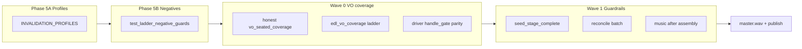
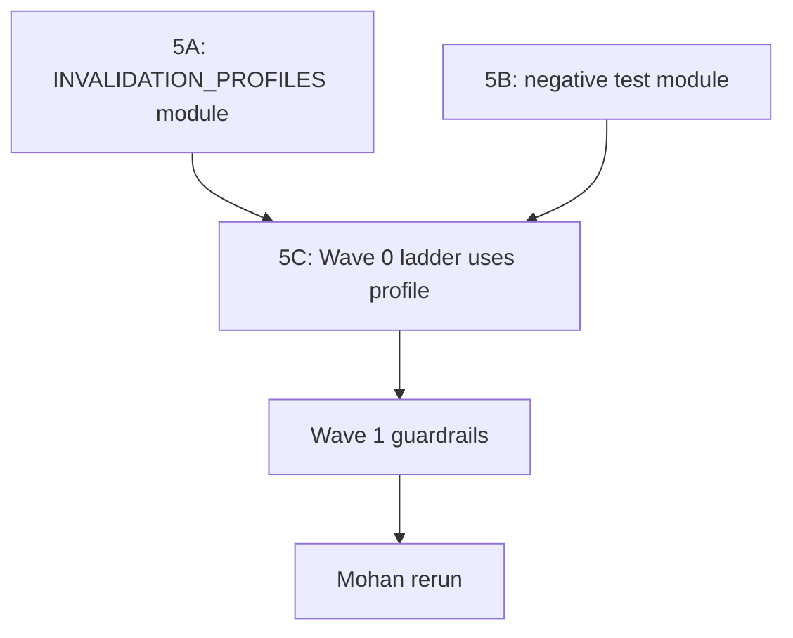

# Mohan general improvement plan

**Purpose:** Make **mohan_uttarwar_podcast_transforming_cancer_science_direct.mp3** (`source_hash: d19c15b58ab4`) finish reliably through **`./scripts/run.sh`** → GUI → **Partially accelerated** → homunculus **0.1.0**.

**Scope:** Product patches + tests + docs. Does not replace operator G0 (transcript review) or G-Publish (S3) — those remain by design.

**Critical methodology:** The 24 mohan runs span **~8 days** and **many product commits**. Failures in an older run often reflect **bugs already fixed** in a later commit or during the **exec_4741 forensics session** — not necessarily open gaps on current `HEAD`. This plan **triages every failure class** as **historical (fixed)**, **partially fixed (verify on HEAD)**, or **current gap (patch required)**. See §1.5 before prioritizing work from stall counts alone.

**Companion plans:**

- [forensic_run_improvement_001_4d011d87.plan.md](forensic_run_improvement_001_4d011d87.plan.md) — G1–G8 guardrails, phase discipline (exec_3751 catalog)
- [full_auto_forensics_run.plan.md](full_auto_forensics_run.plan.md) — forensics loop protocol; **exec_4741** ship reference
- [execution_hardness_phases_1a948498.plan.md](execution_hardness_phases_1a948498.plan.md) — VO contract ladder (exec_5175 fix — **landed**)
- [homunculus_vo_hardening_155525b9.plan.md](homunculus_vo_hardening_155525b9.plan.md) — VO seating / gap framing

---

## 0. Executive summary

| Metric | Value |
|--------|-------|
| Historical runs (same source hash) | **24** under `ASSETS/executions/exec_*d19c15b58ab4*` |
| Runs with `master/master.wav` | **7** (29%) |
| Reference ship | **exec_4741** — ~18 driver interventions, honest PMQ |
| Latest failures | **exec_5175** (VO contract at layup) — **patched**; **exec_5174** (VO coverage at audit) — **still open** |
| Dominant risk (current HEAD) | **VO coverage at `edl_narrative_audit`** + residual **delivery churn** where G1–G8 guardrails are not fully landed |
| Historical noise | 17 non-shipping runs include **pre-partial-auto**, **pre-forensics-4741**, and **already-patched** failure modes — do not double-count |

**Single watch chain** (accounts for most *actionable* stalls on current code):

```
nugget_layup_compose → vo_synthesize → edl_narrative_audit → mix → master_finalize
```

This plan closes the gap between **exec_5175 fix quality** (honest VO contract ladder) and the rest of that chain.

---

## 1. Source tape profile

| Field | Value |
|-------|-------|
| File | `mohan_uttarwar_podcast_transforming_cancer_science_direct.mp3` |
| Hash prefix | `d19c15b58ab4` |
| Topology | Multi-speaker hosted interview (~1865 s master on exec_4741) |
| Framing | G-Framing **Yes** path typical — synthetic VO layups, Chatterbox clone |
| Partial-auto | Detached driver; auto-accepts classified heals; **never** auto G0 / G-Publish |

**Why this tape is hard:**

- Long runtime → homunculus **budget_exhausted** appeared in **64** recovery log lines across runs (top playbook count).
- Many seated VO lines → `vo_layup_seg_*` stale/missing coverage at audit (exec_5174: 5 bad rows including `vo_layup_seg_019`).
- Hitch/invalidation after `chapter_close_hitch` can hole `gap_report` / orientation (exec_5175).
- Music/mix epoch drift when layup re-runs archive assembly (exec_3751, exec_4628) — **partially fixed** in 4741 forensics; G1–G8 still pending.

---

## 1.5 Code evolution — how to read historical failures

### Why this matters

Each `exec_*` folder is a **snapshot under the code that was running that day**, not under today’s tree. Between Aug 25 and Sep 2, 2026:

- Partial-auto mode was introduced (~Aug 27).
- Homunculus 0.1.0 “full auto self healing” landed (~Aug 28).
- **Forensics improvement waves** landed Aug 30–31 (`imprvements forensic`, `forensic 3 improvement + VO improvements`).
- **exec_4741** shipped while **~18 driver/product patches** were applied mid-run (see [full_auto_forensics_end_report.md](full_auto_forensics_end_report.md)).
- **Execution hardness** (VO contract ladder, remediation framework) landed Sep 2 — after exec_5174/5175 started.

**Rule:** A failure in exec_3751 does **not** prove the same bug exists now if exec_4741 shipped with a fix, or if a pytest guards the predicate. Conversely, exec_5174/5175 failures on **newer** code are **high-signal** for remaining gaps.

### Correlation gap (today)

`run_meta.json` records `homunculus_version` and `partial_auto` but **not `git_sha`**. Forensics must infer code era from **run timestamp** + commit log. Wave 4 adds `m4-build-stamp-run-meta`.

### Inferred code eras (mohan runs)

| Era | Approx. dates | Representative commits / events | Mohan runs (examples) |
|-----|---------------|----------------------------------|------------------------|
| **A — Early 0.1.0** | Aug 25–26 | First full-auto 0.1.0 builds; shallow pipeline | exec_001, 042, 188, 370, 458 — ship at **18–20** stages |
| **B — Partial-auto + loops** | Aug 27–28 | `partially accelerated flow`; architecture mid-loop bug (`ba2445d`) | exec_805, 806, 2510, 2512 |
| **C — Hardening** | Aug 28–29 | `hardening`, self-healing automation prep | exec_2513, 2538 (ship), 3533 |
| **D — Pre-forensics churn** | Aug 30–31 | Delivery depth; budget thrash | exec_3540, 3550, 3554, **3751**, 3750, **4628** |
| **E — Forensics ship** | Sep 1 00:14Z | **exec_4741** + patches listed in forensics end report | **exec_4741** (canon ship) |
| **F — Post-forensics partial-auto** | Sep 1 afternoon | `forensic 3` + VO improvements (`eaf34f1`) | exec_5055, 5074, 5173, **5174** |
| **G — Execution hardness** | Sep 2 | VO contract ladder, remediation framework | **exec_5175** (stall class patched on HEAD) |

### Failure verdict labels (use in §2–§3)

| Label | Meaning | Action |
|-------|---------|--------|
| **HISTORICAL** | Fixed before or during exec_4741 forensics; covered by existing tests | No new patch — document + regression test only |
| **PARTIAL** | Fix exists on HEAD for some paths; not all dispatch/resume/agenda paths | Verify + extend (Wave 1) |
| **CURRENT** | Reproduced on newest mohan run or still open in code review | Wave 0–3 patch |
| **BY_DESIGN** | Operator gate or quality advisory | Document; not a bug |
| **UNKNOWN** | Early-era shallow ship or missing artifacts | Deprioritize for delivery hardening |

### HISTORICAL fixes (do not re-open without regression failure)

From exec_4741 forensics — **already in product** (see end report):

- Driver suicide on fresh DELETE (`keep_driver`)
- G1 VO open seed-order routing
- Chapter overflow clamp
- Hollow layup seed thrash / stale transitions → layup wipe
- Stale SDP seed-complete, synth hash thrash, mint/suppress gap mismatch
- Clone-adjacent transition thrash
- **Missing SDP WAVs → wrong mix resume** (`safe_mix_resume`)
- Hollow mmaudio marked done
- Lazy MusicGen vs full palette (referenced slots only)
- Junction remaster archives layup (skip layup invalidate)
- PMQ `spoken_unsupported_entity:Mohan`, determiner false entities
- Advisories vs local package encode split

**Implication:** exec_4628 (`generate_sdp_theme_wavs`) and exec_4741 mid-run mix/SDP stalls are **likely HISTORICAL** on HEAD — verify with `test_safe_mix_resume_*` before Wave 1 `m1-safe-mix-resume-verify`.

### CURRENT gaps (high signal on HEAD)

| Failure | Evidence run | Era | Verdict |
|---------|--------------|-----|---------|
| VO contract false recovery / infinite gate | exec_5175 | G | **CURRENT → patched** on HEAD (execution hardness) |
| VO coverage not rendered at audit | exec_5174 | F | **CURRENT** — Wave 0 |
| `vo_seated_coverage` blind `recovered=True` | code review | — | **CURRENT** |
| G1–G8 guardrails not fully wired | exec_3751 catalog | D | **PARTIAL** — some 4741 fixes; forensic G1–G8 todos still pending |
| `budget_exhausted` during remediation | many runs | B–F | **PARTIAL** — exempt for `vo_contract` only; extend Wave 2 |
| Early analysis stalls (preclean, framing) | 2510, 5173 | B/F | **UNKNOWN / era-specific** — deprioritize vs delivery chain |

---

## 2. Execution inventory (all d19c15b58ab4 runs)

Scanned 2026-09-02 from `ASSETS/executions/`. **Interpret with §1.5** — raw stall counts mix eras and fixed bugs.

### 2.1 Shipped (`master/master.wav` present)

| run_id | era | stages_done | notes |
|--------|-----|-------------|-------|
| exec_001 | A | 19 | Early pipeline (pre-v2 delivery depth) — **UNKNOWN** shallow ship |
| exec_042 | A | 19 | Early |
| exec_188 | A | 19 | Early |
| exec_370 | A | 20 | Early |
| exec_458 | A | 18 | Early |
| exec_2538 | C | 64 | Mid-delivery ship — pre-forensics code |
| **exec_4741** | **E** | **69** | **Canon ship** — forensics patches applied **during** run |

### 2.2 Non-shipping — stall fingerprint

| run_id | era | done | needs_operator | last_recovery | stall class | Verdict @ HEAD |
|--------|-----|------|----------------|---------------|-------------|----------------|
| exec_2510 | B | 5 | — | — | Early analysis | UNKNOWN — early partial-auto |
| exec_2512 | B | 10 | — | — | Early analysis | UNKNOWN |
| exec_2513 | C | 56 | True | budget_exhausted | Mid-delivery + budget | PARTIAL |
| exec_3533 | C | 54 | — | orientation_retarget_open | Orientation / framing | PARTIAL |
| exec_3540 | D | 54 | True | — | Delivery gate | PARTIAL |
| exec_3550 | D | 50 | True | — | Delivery gate | PARTIAL |
| exec_3554 | D | 62 | — | budget_exhausted | Near ship, budget | PARTIAL |
| exec_3750 | D | 61 | — | budget_exhausted | Near ship | PARTIAL |
| **exec_3751** | **D** | 55 | — | budget_exhausted | Hollow markers, layup churn | **PARTIAL** — catalog; many fixes in 4741 |
| exec_4628 | D | 63 | — | generate_sdp_theme_wavs | SDP / music path | **HISTORICAL** — verify tests |
| exec_5055 | F | 0 | — | — | Launch failure | UNKNOWN |
| exec_5074 | F | 17 | — | — | Early | UNKNOWN |
| exec_5173 | F | 4 | — | — | Very early | UNKNOWN |
| **exec_5174** | **F** | 55 | True | — | **edl_narrative_audit VO coverage** | **CURRENT** |
| **exec_5175** | **G** | 45 | — | vo_contract_repair ×3 | **nugget_layup VO contract** | **CURRENT → patched** on HEAD |
| exec_805 | B | 18 | True | ensure_g1_pickups | G1 / early delivery | PARTIAL |
| exec_806 | B | 13 | — | — | Early | UNKNOWN |

### 2.3 Aggregated stall stages (first missing stage, non-shipping)

**Caution:** Counts below are **not** a prioritized backlog — early-era runs (era A/B) and **HISTORICAL** failures inflate totals. Use §1.5 verdict column.

| Stage | Runs stuck here | Typical era | @ HEAD |
|-------|-----------------|-------------|--------|
| `audio_preclean` | 2 | B/F | UNKNOWN |
| `soundscape_policy_build` | 2 | B | UNKNOWN |
| `vo_synthesize` | 2 | B/D | PARTIAL (G8) |
| `framing_posture_decide` | 2 | B | UNKNOWN |
| `edl_narrative_audit` | 1 (exec_5174) | F | **CURRENT** |
| `nugget_layup_compose` | 1 (exec_5175) | G | patched |
| `edl` | 1 | D | PARTIAL |
| `mix` | 1 | D | HISTORICAL? verify |
| `listen_delight_audit` | 1 | D | BY_DESIGN / advisory |
| Others (early analysis) | 4 | A/B | UNKNOWN |

### 2.4 Recovery playbook frequency (all mohan runs)

**Caution:** Totals span all eras. A playbook appearing 64× does not mean 64 **current** bugs.

| Playbook | Count | @ HEAD verdict |
|----------|-------|----------------|
| `budget_exhausted` | 64 | PARTIAL — policy exempt incomplete |
| `ensure_g1_pickups` | 11 | PARTIAL — G8 not fully landed |
| `generate_sdp_theme_wavs` | 4 | HISTORICAL — lazy E3 + safe_mix_resume |
| `vo_contract_repair` | 3 | patched on HEAD (5175 class) |
| `selection_edl_order_drift` | 3 | PARTIAL — narrow invalidation |
| `ensure_mmaudio_qa` | 3 | HISTORICAL — incompleteness checks |

---

## 3. Failure taxonomy → system gaps

**Read each subsection with its §1.5 verdict.** Do not implement fixes for **HISTORICAL** items without a failing regression test on HEAD.

### 3.1 exec_5174-class — `edl_narrative_audit` VO coverage

**Verdict @ HEAD:** **CURRENT** (era F — post-forensics code, pre–VO-coverage ladder).

**Symptom:** `VO coverage not rendered: vo_layup_seg_019 …` (and siblings); `needs_operator: true` on exec_5174.

**Evidence (exec_5174):** `compact_vo_coverage` bad rows: `vo_layup_seg_008`, `019`, `028`, `034`, `030` — coverage `missing` (seated lines without matching synthesis).

**Root causes:**

1. Layup/adjudicate text changed but `vo_synthesize` did not re-run (stale `synthesis_report` or WAV).
2. Lines seated in plan but skipped in synthesis batch (homunculus walked past producer).
3. `vo_seated_coverage` playbook runs `repair_vo_contract_drift` + unmarks `vo_synthesize` but sets **`recovered = True` without re-checking** `compact_vo_coverage_stale_or_missing()`.
4. Driver `handle_gate` has a **one-shot** backfill path — no `run_classified_ladder`, no `execution_stall` escalation (unlike `vo_contract_repair` after Phase 1).
5. `remediation_framework._LADDER_ERROR_CLASSES` only includes `vo_contract_repair` — VO coverage is not a tiered ladder.

**Suggested fix (Wave 0):** See §5.1.

### 3.2 exec_5175-class — VO contract at layup

**Verdict @ HEAD:** **CURRENT → patched** (execution hardness landed after exec_5175 started).

**Symptom:** `seated line vo_preface_episode_orientation missing from gap_report` at `nugget_layup_compose`.

**Status:** Addressed by execution hardness Phases 1–7 (`execution_contract.py`, honest `vo_contract_repair`, driver ladder, GUI `vo_contract` banner). **Re-run required** — exec_5175 artifacts reflect **pre-patch** code (false `vo_contract_repair recovered` ×3).

**Residual risk:** Tier B `gap_framing_recompose` in ladder can disturb seating — monitor on mohan rerun; add post-tier-B reconcile (Wave 1).

### 3.3 Delivery-phase churn (layup ↔ EDL ↔ mix ↔ music)

**Verdict @ HEAD:** **PARTIAL** — exec_3751 catalog describes era D code; exec_4741 fixed many predicates **during** era E. Remaining work is mostly **guardrail wiring** (forensic G1–G8), not rediscovering 4741 patches.

**Symptom:** Runs reach 55–63 stages done then stall; recovery log shows `budget_exhausted`, SDP generation, layup invalidation loops.

**Catalog source:** exec_3751 (era D) + [forensic_run_improvement_001](forensic_run_improvement_001_4d011d87.plan.md) (O1–O8, S1–S7).

| ID | Pattern | Mohan runs | @ HEAD | Fix wave |
|----|---------|------------|--------|----------|
| O1 | MusicGen before `assembly_preview.wav` | 3751, 4628 | PARTIAL | Wave 1 G2/G5 |
| O2 | Hollow `stage_done` (mmaudio, layup) | 3751, 4741 | PARTIAL | Wave 1 G3 + G1 |
| O3 | Mix resume skips mmaudio when SDP missing | 4741 | **HISTORICAL** | Wave 1 verify tests only |
| O4 | Junction remaster archives layup | 4741 | **HISTORICAL** | Wave 1 verify tests only |
| O5 | `g1_complete` sticky false | 3751 | PARTIAL | Wave 1 G6 |
| O6 | Seed-order: consumer before producer | Many | PARTIAL | Wave 1 G1/G8 |
| O7 | Layup refresh wipes seated VO | 3751, 4628 | PARTIAL | Wave 1 narrow invalidation |
| O8 | Identical failure halt during policy heal | 5175 | PARTIAL | Wave 2 extend to all ladders |

**Suggested fix (Wave 1–2):** Align with forensic G1–G8 + partial homunculus parity; see §5.2.

### 3.4 `master_finalize` / PMQ / listen delight

**Verdict @ HEAD:** **HISTORICAL** for PMQ Mohan entity (4741); **BY_DESIGN** for aspiration advisories.

**Symptom:** Near-ship runs pause on aspiration floors or PMQ entity checks.

**Mohan-specific:** `spoken_unsupported_entity:Mohan` — fixed in exec_4741 (`pmq_enrich_entities`, determiner ignore).

**By design:** Aspirational quality advisories do not block local `master.wav`; G-Publish still needs operator for S3 when advisories present.

### 3.5 Operator gates (expected, not bugs)

**Verdict @ HEAD:** **BY_DESIGN** — unchanged across eras.

| Gate | Partial-auto |
|------|----------------|
| G0 transcript review | **Always operator** |
| G-Publish S3 | **Always operator** |
| G-DeliveryUnlock | After Phase A seal |
| G-VoiceRef | Chatterbox path |

---

## 4. Watch-chain deep dive

### 4.1 `nugget_layup_compose`

**Checks:** VO contract, spoken-copy QC, layup mine/compose, gap_report authority.

**Mohan failures:** exec_5175 (contract hole after hitch).

**Patches:**

- Post-hitch `reconcile_invalidated_bundle` (landed).
- Wave 1: mandatory `reconcile_execution_contract` at layup batch boundary.
- Wave 3 F2: spoken-copy heal before compose refresh.

**Preflight:** `stage_input_checks._try_preflight_recovery` → `run_vo_contract_ladder`.

### 4.2 `vo_synthesize`

**Checks:** G1 pickups, synthesis_report alignment, Chatterbox readiness.

**Mohan failures:** Missing pickups (`ensure_g1_pickups` ×11), stale lines after adjudicate.

**Patches:**

- Wave 1 G8: block synth batch until `check_g1_vo()` empty.
- Wave 0: ladder tier rewinds here for VO coverage repair.
- Partial-auto: `g1_vo_pickup` may be `automation_pending` — verify Chatterbox path does not skip required lines.

**Preflight:** `upstream_stale_rerun` when audit consumer sees stale synth.

### 4.3 `edl_narrative_audit`

**Checks:** `vo_synthesize` complete; `compact_vo_coverage` all required `rendered`.

**Mohan failures:** exec_5174 (5 missing lines).

**Patches:**

- Wave 0: **`edl_vo_coverage_repair` ladder** (primary new work).
- Driver remutate path exists for narrative issues — do not conflate with VO coverage ladder.
- Invalidate downstream: `edl`, `assembly_preview`, `mix` on successful synth repair (driver already unmarks — keep in ladder).

**Preflight:** `run_classified_ladder(error_class="vo_seated_coverage")` before `StageInputError`.

### 4.4 `mix`

**Checks:** assembly epoch, SDP WAVs referenced in mix plan, mmaudio completeness.

**Mohan failures:** exec_4628 SDP path; exec_4741 wrong resume (patched).

**Patches:**

- `safe_mix_resume` → route to `mmaudio_sfx` when SDP missing (4741).
- Wave 1 B3: mix epoch + `assembly_ledger` hash match.
- Wave 1 G2: no music stage marked done without assembly.

### 4.5 `master_finalize`

**Checks:** PMQ, listen_delight (advisory), post_master_quality, LUFS.

**Mohan failures:** PMQ entity (fixed 4741); listen_delight floors (advisory).

**Patches:**

- Wave 3: verify PMQ mohan entity regression tests.
- Do not auto-waive quality — exec_4741 path is correct (grounding fixes).

---

## 5. Implementation waves

**Priority rule:** Implement **CURRENT** items first (Wave 0), then **PARTIAL** guardrails (Wave 1–2). **HISTORICAL** items → pytest verification only unless a test fails on HEAD. Do not treat raw playbook counts (§2.4) as a backlog.

### 5.1 Wave 0 — Honest VO coverage ladder (exec_5174 fix)

**Goal:** Parity with VO contract hardness for `edl_narrative_audit` blocks.

#### 5.1.1 New ladder: `edl_vo_coverage_repair`

Add to `execution_contract.py` (or sibling `edl_vo_coverage.py`):

| Tier | Action | Resume |
|------|--------|--------|
| A | `backfill_missing_synthesis_entries` + audit reconcile | `edl_narrative_audit` if clear |
| B | `playbook_vo_seated_coverage` + unmark synth | `vo_synthesize` |
| C | Spoken-copy heal for `wav_stale` lines (`vo_line_adjudicate` subset) | `vo_line_adjudicate` |
| D | Waive **optional only** / operator card for stubborn lines | `needs_operator` with line list — **never** required layup/orientation on mohan |

**Safeguards (§11):** Tier D must not waive `vo_preface_episode_orientation` on hosted mohan without operator escalation. Post-tier-B reconcile mandatory. Invalidation bounded to synth→EDL chain unless order_hash drift.

#### 5.1.2 Honest `vo_seated_coverage` outcome

In `recovery_controller.py`:

```python
# After playbook_vo_seated_coverage(ctx):
from interview_mux.stage_input_checks import compact_vo_coverage_stale_or_missing
recovered = not compact_vo_coverage_stale_or_missing(ctx)
resume_stage = "vo_synthesize" if recovered else stage_id
```

#### 5.1.3 Remediation framework

- Add `vo_seated_coverage` and `edl_vo_coverage_repair` to `_LADDER_ERROR_CLASSES`.
- `run_classified_ladder` in `stage_input_checks._check_edl_narrative_audit` preflight.

#### 5.1.4 Driver parity

Replace one-shot `handle_gate` VO coverage block with:

1. `run_classified_ladder(ctx, error_class="vo_seated_coverage", consumer_stage="edl_narrative_audit")`
2. `record_execution_stall` + ×3 escalate → `pause_needs_operator` with actionable line IDs
3. Same pattern as `vo_contract_repair` gate branch (~line 2970 in `full_auto_driver.py`)

#### 5.1.5 GUI

- `resolveReviewGate.ts`: match `VO coverage not rendered` → `gateKind: 'vo_coverage'`
- Banner copy: "Seated VO lines need synthesis before EDL audit" + link to G1/synth phase

#### 5.1.6 Tests

- `tests/fixtures/exec_5174_vo_coverage_hole/` — manifest + gap_report + plan with seated `vo_layup_seg_019` missing WAV
- `test_edl_vo_coverage_ladder_tiers`
- `test_partial_auto_driver_recovery.py` — mock `handle_gate` message → ladder → `continue`

### 5.2 Wave 1 — Delivery watch-chain guardrails

Pull from [forensic_run_improvement_001](forensic_run_improvement_001_4d011d87.plan.md) with mohan validation on **HEAD** — skip items already green in 4741 regression tests (O3, O4, PMQ, SDP routing).

| ID | Work | Primary files |
|----|------|----------------|
| G1 | `seed_stage_complete()` single predicate | `delivery_guardrails.py`, `homunculus/agenda.py`, `pipeline.py`, driver |
| G2/G5 | Music only after assembly + `delivery_stable_for_music` | `agenda.py`, `delivery_guardrails.py` |
| G3 | Reconcile hollow markers every delivery batch | `delivery_guardrails.py`, `pipeline.py` |
| G6 | `g1_complete` from live `check_g1_vo()` | `journey_state.py`, `gui_job_reconcile.py` |
| G7/G8 | Premature-complete cap; synth blocked until G1 stable | `identical_failures.py`, `stage_input_checks.py` |
| C1 | Heal-only vs structural invalidation | `air_order_integrity.py`, `delivery_guardrails.py` |
| B3 | Mix epoch gate | `delivery_guardrails.py`, `mix` stage |

**Mohan acceptance:** Fresh partial-auto run does not mark `mmaudio_sfx` done before `assembly_preview.wav` exists; resume from mix with missing SDP routes to mmaudio (4741 tests green).

### 5.3 Wave 2 — Partial-auto + homunculus 0.1.0

| Work | Detail |
|------|--------|
| Budget exempt | `homunculus/budget.py` — exempt when `read_active_remediation_plan()` any classified class |
| Identical failures | `failure_in_active_policy_cascade` for all ladder classes |
| Phase A pins | Conductor does not schedule Phase C music until Phase A seal on tapes > N minutes |
| needs_operator audit | `operator_gates.py` + driver — classified → remediation, not `pause_needs_operator` |
| G0 path | Document: mohan rerun stops at G0 after `transcript_review_build`; operator must review before delivery |

### 5.4 Wave 3 — Mohan producer shapes

| Fix | exec evidence |
|-----|----------------|
| Layup spoken-copy first | 5174 stale `vo_layup_seg_*` |
| Gap framing forward-cue | 5175 `vo_preface_*` |
| Lazy MusicGen | 3751 wasted palette |
| PMQ entity regression | 4741 |

### 5.5 Wave 4 — Observability + CI

| Artifact | Purpose |
|----------|---------|
| `scripts/scan_mohan_runs.py` | Rank stall stages across d19c15b58ab4 |
| `operator/wasted_work.json` | MusicGen/mix retry counts |
| GUI resilience panel | `remediation_plan`, `execution_stall`, coverage summary |
| Rerun gate | `pytest tests/test_execution_contract_ladder.py tests/test_partial_auto_golden_path.py tests/test_remediation_framework.py` + `scripts/verify_partial_auto_recovery.sh` |

---

## 6. Rerun protocol (operator)

### 6.1 Fresh mohan partial-auto run

```bash
./scripts/bootstrap_venv.sh   # if needed
./scripts/build_gui.sh        # if frontend changed
./scripts/run.sh
# Start tab: Partially accelerated, homunculus 0.1.0, mohan MP3
```

1. Wait for **G0** — complete transcript review in GUI (mandatory).
2. Let driver run through delivery; watch chain §4.
3. At **G-Publish** — local package auto; S3 only if operator confirms.

### 6.2 Resume stalled run (e.g. exec_5175)

1. **Stop** old driver process — it runs the code from **launch time**, not current `HEAD`.
2. Confirm which **era** the run belongs to (§1.5) — exec_5175/G artifacts are **pre–execution-hardness**; exec_5174 is **pre–VO-coverage ladder**.
3. Deploy Wave 0+1 patches.
4. `./scripts/run.sh` → resume run_id OR fresh run (fresh preferred if artifact state is wounded).
5. Optional: `POST /api/runs/{id}/delivery/recover` with `preflight: true`, `consumer_stage`, `message` from gate.
6. If ladder exhausts → `needs_operator` with explicit line IDs (not infinite spin).

### 6.3 Success criteria

| Check | Path |
|-------|------|
| `master/master.wav` | `ASSETS/executions/{run_id}/master/master.wav` |
| `tools/verify_master.py` | LUFS / true peak |
| PMQ `publish_allowed` | honest true (no waivers) |
| `listen_delight_audit` | `passed: true` or advisory |
| Stage count | ~69 delivery-complete |
| Recovery log | No `vo_contract_repair` / `vo_seated_coverage` false recovered |
| Wasted work | MusicGen attempts < 3 per theme slot (post lazy-E3) |

---

## 7. Dependency map



**Critical path for next sprint:** **5A profiles → 5B negatives → Wave 0 (with profile)** → Wave 1 G1/G3/G2 → mohan rerun.

**Do not skip 5A/5B** before Wave 0 — ad-hoc unmarks recreate 3751 churn; positive-only tests do not catch it.

---

## 8. Out of scope

- Auto-waiving listen_delight / PMQ / e2e quality gates.
- Removing G0 or G-Publish from partial-auto.
- Cloud STT or non-local audio APIs.
- Editing the execution hardness or forensic plan files (this plan references them only).

**Not out of scope (often missed):** tier-0 **publishability** hard stops, **LLM schema** hard stops on analysis stages, **local MLX/Chatterbox** env failures — see §11.3.

---

## 9. Doc updates (on implementation)

| Doc | Change |
|-----|--------|
| `docs/workflows/operator-gates.md` | `vo_coverage` gate kind; ladder vs operator |
| `docs/cross-cutting/mastering-homunculus.md` | Mohan watch-chain + remediation active exempt |
| `docs/workflows/smoke-test.md` | Mohan partial-auto checklist + §11.3 analysis choke points |
| `docs/cross-cutting/publishability-contract.md` | Tier-0 vs ladder boundary (§11.1 I12) |
| `docs/cross-cutting/delivery-phases.md` | Invalidation profiles + structural vs heal-only (§12) |
| `AGENTS.md` | Link to this plan; PR requires profile + negative test |

---

## 11. Hardness safeguards — preventing unintended consequences

Implementation waves add automation. Without explicit guards, fixes for exec_5174/5175 can **reintroduce exec_3751 churn** or **ship wounded masters**. Every Wave 0–2 item must satisfy §11.1 invariants and §11.2 negative tests before mohan rerun.

### 11.1 Ladder invariants (must hold on HEAD)

| ID | Invariant | Why | Violation example |
|----|-----------|-----|-------------------|
| **I1** | **One active remediation plan** per run | Dual ladders fight invalidation | vo_contract + vo_coverage both unmark `vo_synthesize` |
| **I2** | **Honest recovered** — post-check required | False recovery → infinite gate (5175) | `vo_seated_coverage recovered=True` without coverage check |
| **I3** | **Bounded invalidation** | Broad rewind → 3751 layup churn | Hitch/ladder archives mix + music + layup |
| **I4** | **Tier D is last resort** | Auto-waive drops orientation on hosted tape | tier_d clears beats + marks orientation not-on-air |
| **I5** | **Never mint** seated lines into `gap_report` on waive | Creates ghost contract state | tier_d mint for `missing_from_gap` (code blocks — keep tested) |
| **I6** | **Required vs optional** | Auto-skip required VO | tier D on `vo_layup_seg_*` with `required: true` |
| **I7** | **Idempotent no-op** | Re-run ladder on healthy run wastes budget | Ladder runs when `validate_vo_contract` / coverage already clear |
| **I8** | **Separation of concerns** | Narrative heal breaks synth | remutate path unmarks synth without coverage check |
| **I9** | **Attempt cap** | Silent spin | stall ×3 without `pause_needs_operator` |
| **I10** | **Manual ≡ partial-auto** | GUI-only bugs | `delivery/recover` preflight ≠ driver `handle_gate` |
| **I11** | **G8 escape hatch** | Deadlock on optional VO | Block synth while G1 skip allowed but not honored |
| **I12** | **Tier-0 not waived by ladder** | Wounded ship | publishability block auto-healed away |

### 11.2 Tier policy for mohan (hosted 1:1 + framing Yes)

| Ladder tier | VO contract (5175) | VO coverage (5174) | Mohan policy |
|-------------|--------------------|--------------------|--------------|
| A | Publish orientation / flag sync | Audit backfill | **Safe** — prefer flag-sync over recompose |
| B | `gap_framing_recompose` | `vo_seated_coverage` + synth rewind | **Risky** — post-tier reconcile mandatory |
| C | Opening omit / unseat | Spoken-copy heal for `wav_stale` | **Preferred** over tier B for stale script |
| D | Logged waive / unseat | Optional-only waive | **Block tier D** for `vo_preface_episode_orientation` on mohan topology unless operator card |

**Rule:** On mohan hosted tapes, **tier D must not be the default exhaustion path** for orientation or required layup lines — escalate to `needs_operator` with line IDs and G1/synth links.

### 11.3 Watch chain extensions (analysis + tier-0)

Delivery watch chain (§0) is necessary but not sufficient. Mohan runs also hit:

| Stage / gate | Risk | Safeguard |
|--------------|------|-----------|
| `gap_framing_compose` / `topic_coverage_audit` | Open LLM escalations (5175 had 4) | Escalations ≠ hard block; do not ladder into full layup invalidation |
| `full_master_ranking` | Hard-keep / air-order loops | Heal-only invalidation; G-AirOrder warn-only default |
| `transcript_review` (G0) | Operator skip → poison downstream | BY_DESIGN; document in partial-auto overlay |
| Tier-0 publishability | `post_edl`, `pre_finalize` | Ladders **cannot** waive; route to operator escalation API |
| LLM schema hard stop | Analysis halt | No auto-waive; max 2 attempts per stage invoke (product rule) |
| Chatterbox / local MLX | Env failure masquerading as coverage | Distinguish `synthesis_failed` vs `missing` in coverage rows + GUI |

Add **analysis choke points** to operator smoke checklist (not auto-healed): `gap_framing_compose`, `topic_coverage_audit`, `full_master_ranking`.

### 11.4 Driver heal deduplication

`full_auto_driver.py` contains **many bespoke heals** predating execution hardness. Risk: a legacy heal **bypasses** `run_classified_ladder`, **double-unmarks** stages, or **contradicts** C1 narrow invalidation.

**Wave 5 `m5-driver-heal-dedup`:** After Wave 0 lands, audit driver heals on watch-chain messages — for each classified error class, **one authoritative path** (ladder OR heal, not both). Align with forensic plan `exec-guardrails-first-branch`.

### 11.5 Honest recovery — full playbook audit

Wave 0 fixes `vo_seated_coverage` only. `recovery_controller.py` still has **13+** `recovered = True` branches without post-check (layup_stale, musicgen, assembly_not_rendered, etc.).

**Wave 5 `m5-honest-recovery-audit-all`:** Each playbook maps to a **verifiable predicate** or `recovered=False` + `detail`. Prevents fixing 5174 while 3751-class false recoveries persist on adjacent stages.

### 11.6 Negative test matrix (required before mohan rerun)

| Test | Must prove |
|------|------------|
| `test_ladder_no_op_when_healthy` | No artifacts mutated when contract/coverage already valid |
| `test_tier_d_blocked_required_orientation` | Mohan topology: orientation not waived at tier D without operator |
| `test_no_gap_mint_on_missing_from_gap` | Waive does not create new gap lines |
| `test_vo_coverage_invalidates_bounded` | Success does not archive `nugget_layup_compose` without order drift |
| `test_dual_ladder_mutex` | Second ladder cannot start while plan active |
| `test_g8_respects_g1_skip` | Optional VO skip does not block forever |
| `test_manual_preflight_matches_driver` | Same outcome from API preflight and driver gate |
| `test_publishability_not_ladder_waived` | Tier-0 block survives remediation |

### 11.7 Regression beyond mohan

Hardness patches must not **only** pass mohan fixtures. **Wave 5 `m5-source-diversity-regression`:** run ladder smoke on `tests/fixtures/tbiy/`, native-only topology, and `test_partial_auto_golden_path.py` matrix after every Wave 0–1 merge.

### 11.8 Remediation lifecycle cleanup

On ladder success: `mark_remediation_plan_completed`, clear `execution_stall`, `clear_halts` for policy cascade — already partially wired; verify on VO coverage ladder so **completed plans do not exempt budget forever**.

---

## 12. Phase 5A — Bounded invalidation (bake into product)

**Problem:** `invalidate_downstream()` and ladder heals today call broad `clear_from` / archive paths. Fixing VO coverage by unmarking `edl` through `mix` recreates exec_3751 churn. **Bounded invalidation** means every automated rewind declares an **invalidation profile** — an allowlist of `stage_done` clears and artifact touches — before any stage is unmarked.

### 12.1 Design: `execution_invalidation.py`

New module (or extend `delivery_guardrails.py` §C1) with:

```python
INVALIDATION_PROFILES = {
    "vo_seated_coverage": {
        "allowed_clear": ("vo_synthesize", "edl_narrative_audit", "edl", "assembly_preview"),
        "forbidden_clear": ("nugget_layup_compose", "mix", "mmaudio_sfx", "music_palette_compose", "master_finalize"),
        "expand_to_structural_when": "order_fingerprint_mismatch",  # then use STRUCTURAL_DELIVERY profile
    },
    "vo_contract_repair_tier_a": { ... },  # flag-sync only — no stage clears
    "vo_contract_repair_tier_b": { ... },  # gap_framing + vo_line_adjudicate bounded
    "structural_delivery": { ... },        # full G3_RECONCILE_CHAIN — explicit operator unlock or drift
}
```

**API:**

| Function | Role |
|----------|------|
| `resolve_invalidation_profile(ctx, error_class, tier)` | Pick profile from active remediation plan |
| `apply_bounded_invalidation(ctx, profile_id, reason)` | Clear only `allowed_clear`; log `forbidden_skipped` |
| `profile_allows_clear(profile, stage_id)` | Predicate for homunculus `invalidate_downstream` guard |
| `should_expand_to_structural(ctx, profile_id)` | `order_fingerprint` / `assembly_ledger` mismatch → escalate profile |

### 12.2 Wiring points (single choke)

| Caller | Change |
|--------|--------|
| `homunculus/agenda.invalidate_downstream` | If `read_active_remediation_plan()`: use profile allowlist; skip forbidden stages |
| `remediation_framework.reconcile_invalidated_bundle` | Pass `profile_id` into log + `execution_health` |
| `recovery_controller` playbooks | Replace ad-hoc unmark lists with `apply_bounded_invalidation` |
| `execution_contract.run_vo_contract_ladder` | Each tier maps to a profile (tier A = minimal, tier B = recompose profile) |
| `full_auto_driver` VO coverage gate | Use `vo_seated_coverage` profile — **never** inline unmark loop |

### 12.3 Profiles for mohan watch chain

| Profile | Clears | Never clears (unless structural) |
|---------|--------|----------------------------------|
| `vo_coverage_heal` | `vo_synthesize` → `assembly_preview` | layup, music_*, mix, finalize |
| `vo_contract_tier_a` | none (reconcile only) | all delivery producers |
| `vo_contract_tier_c` | `vo_line_adjudicate`, `vo_synthesize` | layup, edl, mix |
| `synth_stale_script` | `vo_synthesize` + downstream through `edl` | layup unless `wav_stale` on seated line |
| `structural_delivery` | `G3_RECONCILE_CHAIN` | requires `delivery_epoch` unlock or fingerprint drift logged |

### 12.4 Observability

Each invalidation appends to `operator/invalidation_log.jsonl`:

```json
{
  "profile_id": "vo_coverage_heal",
  "cleared": ["vo_synthesize", "edl"],
  "forbidden_skipped": ["nugget_layup_compose", "mix"],
  "structural": false,
  "order_fingerprint": "abc…"
}
```

GUI resilience panel (Wave 4) surfaces last profile — operator can see **why** mix was not wiped.

### 12.5 Phase 5A todos

See frontmatter: `m5a-invalidation-profiles-module` through `m5a-tests-bounded-invalidation`.

---

## 13. Phase 5B — Negative test discipline (bake into CI)

**Problem:** Positive tests (“ladder fixes hole”) do not prove we **did not** waive orientation, archive layup, or spin forever. **Negative tests** are merge gates: every ladder tier and invalidation profile has tests for what it **must never do**.

### 13.1 Test module structure

`tests/test_ladder_negative_guards.py` (and `tests/test_bounded_invalidation_profiles.py` for 5A):

| Category | Tests |
|----------|-------|
| **No-op** | Healthy 4741-baseline fixture → ladder returns `recovered=True`, **zero** `stage_done` changes, **zero** plan mutations |
| **No waive** | Required orientation + mohan topology → tier D returns `needs_operator`, orientation still seated |
| **No mint** | `missing_from_gap` → gap_report line count unchanged |
| **Bounded clear** | After `vo_coverage_heal` → layup/mix still `is_done`; edl cleared |
| **Structural only** | Fingerprint mismatch → `structural_delivery` profile clears music chain |
| **Mutex** | Active `vo_contract_repair` plan → `vo_seated_coverage` ladder refuses to start |
| **Separation** | VO coverage ladder never writes `edl_narrative_remutate.json` |
| **Tier-0** | Publishability block present → ladder does not clear `post_edl` checkpoint |
| **Cap** | 4 identical ladder attempts → `execution_stall.should_escalate` |

### 13.2 Per-tier MUST_NOT matrix (merge gate)

Every ladder tier PR must add a row:

| Ladder | Tier | MUST fix | MUST NOT |
|--------|------|----------|----------|
| `edl_vo_coverage` | A | backfill audit entries | unmark layup |
| `edl_vo_coverage` | B | rewind synth | clear mix/mmaudio |
| `edl_vo_coverage` | C | adjudicate stale lines | call remutate |
| `edl_vo_coverage` | D | operator card | waive required lines |
| `vo_contract` | D | unseat optional | waive hosted orientation (mohan) |

**Rule:** If tier exists in code without a MUST_NOT test → **block merge** (`m5b-ladder-tier-negative-matrix`).

### 13.3 CI script

`scripts/verify_ladder_negative_guards.sh`:

```bash
#!/usr/bin/env bash
set -euo pipefail
pytest tests/test_ladder_negative_guards.py tests/test_bounded_invalidation_profiles.py -q
pytest tests/test_execution_contract_ladder.py tests/test_remediation_framework.py -q
```

Included in `m4-rerun-checklist` and `docs/workflows/smoke-test.md` **before** any mohan partial-auto rerun.

### 13.4 Healthy baseline fixture

`tests/fixtures/exec_4741_ship_baseline/` — minimal artifacts:

- `mastering/mastering_plan.json` with valid vo_seats
- `understanding/gap_report.json` aligned
- `vo_pickup/synthesized/*.wav` stubs for seated lines
- `.stage_done` through `assembly_preview`

Negative tests run ladders against this and assert **artifact checksums / stage_done set unchanged**.

### 13.5 Phase 5B todos

See frontmatter: `m5b-negative-test-module` through `m5b-invalidation-negative-pair`.

---

## 14. Phase 5C — Integration order (non-negotiable)



| Step | Gate |
|------|------|
| 1 | `m5a-invalidation-profiles-module` + `vo_coverage_heal` profile |
| 2 | `m5a-tests-bounded-invalidation` green |
| 3 | `m5b-negative-test-module` green (may use stub ladder until Wave 0 lands) |
| 4 | Wave 0 ladder **only** calls `apply_bounded_invalidation` — remove driver inline unmarks |
| 5 | `verify_ladder_negative_guards.sh` in rerun checklist |
| 6 | Wave 1 G1/G3 — profiles for structural vs heal-only |

**PR discipline (`m5c-pr-checklist`):** Any PR touching `run_*_ladder`, `invalidate_downstream`, or `handle_gate` heal must include:

1. Profile update (or explicit `structural_delivery` justification)
2. At least one negative test for new tier/profile
3. `invalidation_log.jsonl` fixture snippet in test

---

## 15. Updated critical path

```
5A profiles (stub) → 5B negative tests (stub) → Wave 0 ladder + wire profile
→ 5A/5B full green → Wave 1 guardrails → mohan rerun
```

**Do not implement Wave 0 ladder with ad-hoc unmark lists** — that bypasses the discipline and repeats 3751 risk.

---

## 10. Handoff checklist

- [ ] Every failure class in §3 tagged HISTORICAL / PARTIAL / CURRENT / BY_DESIGN
- [ ] §11.1 invariants I1–I12 verified in code or tests
- [ ] Phase 5A: `INVALIDATION_PROFILES` + `vo_coverage_heal` profile wired
- [ ] Phase 5B: `test_ladder_negative_guards.py` + `verify_ladder_negative_guards.sh` green
- [ ] §11.6 negative test matrix green (superset of 5B)
- [ ] Wave 0 ladder uses `apply_bounded_invalidation` only (no inline unmarks in driver)
- [ ] `m4-build-stamp-run-meta` — future runs correlate to `git_sha`
- [ ] Wave 0 todos `m0-*` complete + pytest green
- [ ] Wave 5: driver heal dedup + honest recovery audit for non-VO playbooks
- [ ] Wave 1: run **4741 regression tests** before implementing HISTORICAL-class items
- [ ] Wave 1 G1/G3/G2 green on guardrail tests
- [ ] `scripts/scan_mohan_runs.py` reports era + @HEAD verdict (not raw stall counts only)
- [ ] One full mohan partial-auto ship on **current HEAD** without forensics `SystemExit`
- [ ] Post-ship: remediation plans completed; no stale `policy_remediation_active`
- [ ] `full_auto_forensics_state.md` updated only if forensics rerun requested
