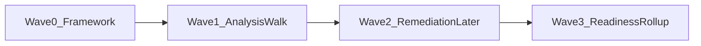
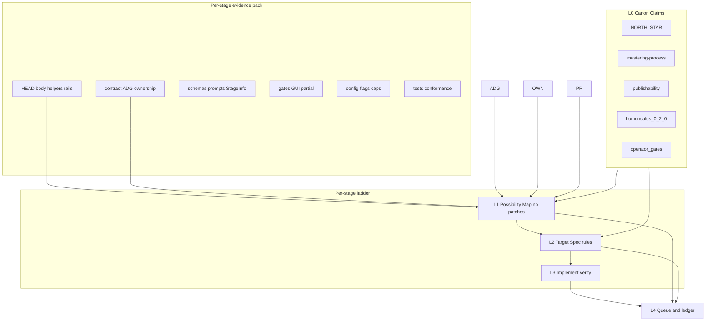

# Stage Clinic — comprehensive assessment architecture

**Thesis:** Thrash, plugs, unexpected stages, and prerequisite errors are usually **stage-local** failures of honesty (hollow done, wrong edges, soft-fail, over-heal) under brain **0.2.0**’s fixed seed walk. Cure them by **mapping what HEAD code actually does**, writing a **simpler deterministic target**, then **patching later** from that record—with the operator as an **optional** intent arbiter when forks appear.

### Campaign end-state (item 1 — why this exists; non-negotiable)

**Goal:** After Waves 0–3, HEAD is structured so a **Full-auto** run on **shipped product defaults**, brain **0.2.0**, can **complete unattended end-to-end**—ingest through master (and ship path as defaults allow)—without a human babysitting thrash, hollow-done, fake `needs_operator`, or OpenAI soft-lies.

**“Complete on its own” means (operational):**
- Operator starts Full-auto with defaults and walks away
- Seed walk advances; heals/retries **terminate** (cap, refuse, or classified remediation)—no infinite mix/junction/invalidate ping-pong
- Stages that fail OpenAI/schema **refuse or mark incomplete honestly**—they do not `.stage_done` hollow and poison the walk
- Auto-accept / default gate resolution fires where product defaults say they should; humans are not required except for true journey exceptions encoded in defaults (if any remain on HEAD—inventory them in §0.1)
- Local heavy ML may run as today (out of clinic quality scope); **host orchestration** around those calls must still be honest (done-without-artifact = fail/refuse)
- Outcome is a structurally publishable master path under defaults (listen-delight / publishability per NORTH_STAR + defaults inventory)—not “stuck in delivery limbo”

**Clinic is the means; this end-state is the goal.** Every L1/L2/L3 decision is judged by: *does this make unattended Full-auto on defaults more or less likely?*

**Non-goals for the end-state (do not confuse with success):**
- Proving success via a forensics/`exec_*` campaign inside the clinic
- Perfect creative quality of MusicGen/Chatterbox/STT models
- Supporting other brain ids
- Making Partially accelerated identical to Full-auto (partial may still pause; Full-auto must not inherit new pauses from clinic fixes)

**Campaign split (load-bearing):**
- **Now (this plan’s near-term execution):** freeze doctrine → scaffold framework + paste prompts → walk stages **analysis-first** (L1 Possibility Maps; L2 Target Specs as drafts). **No product code patches** in the analysis walk.
- **Later (remediation wave):** L3 implement from stored maps/targets. Operator may answer questions or stay silent; agent may proceed on unambiguous backlog items when the target says so. Framework built today must make that later wave mechanical.
- **Closeout (readiness rollup):** synthesize a code-based full-auto readiness verdict from all maps/targets against §0.2—not a live forensics exec inside the clinic.

**Pinned posture (non-negotiable):**
- Brain: **0.2.0 only** (deterministic seed walk / `control_plane=deterministic`). Homunculus law: [docs/cross-cutting/mastering-homunculus.md](docs/cross-cutting/mastering-homunculus.md). Do not analyze other brain ids; do not frame work as brain migration or control-plane revival.
- **Clinic interaction focus:** partially_accelerated for day-to-day analysis (gate waits visible). **Campaign reliability focus:** Full-auto + defaults must not be broken by partial-only fixes. Every L1 map includes a **full-auto / defaults path** subsection (§6.2 item 9).
- **Code is king.** Contracts, ADG diagrams, NORTH_STAR, and this plan are **claims**. Possibility Maps must be grounded in HEAD Python/TS. Tag every claim: `IN_CODE` | `DOC_ONLY_UNVERIFIED` | `CODE_DOC_CONFLICT` | `UNKNOWN`.
- **Prior executions are messy hints only — never evidence.** Assume many undocumented code changes between any `exec_*` / forensics run and HEAD. Do not mine run dirs for “what the stage does,” do not cite ledger/identical_failures from old folders as proof, do not rebuild stage meaning from historical artifacts. At most: a one-line hint (“look for X in code”) that must then be confirmed or rejected on HEAD. If unconfirmed, drop it.
- **Heavy local ML is out of clinic** (assumed high confidence; do not test, tune, or deep-map model internals): local speech/STT/diarization (`ASSETS/local_speech`), local LLM/framer (`ASSETS/local_llm`), Chatterbox / local S2S-TTS, MusicGen and music ladders, MMAudio, DeepFilterNet, CLAP, and any other GPU/venv-isolated local model subprocess. Clinic may note *that* a stage calls them (orchestration boundary only) and then **ignore** quality, latency, device, ladder, and model behavior.
- **External / OpenAI LLM and other remote services stay in clinic** — high variance and load-bearing for quality. Map prompts, schemas, accept/reformat/drop, retries (max 2), packet denylist, hollow outputs, and failure honesty for OpenAI (and any other cloud API the stage calls).
- **No product patches in L1 or during the analysis walk.** Discovery never edits stage bodies. L3 patches only in the **later remediation wave**, from a stored Target Spec.
- One stage per clinic thread when possible; multiple upgrades **inside** that stage are encouraged once a target exists (remediation wave).
- **Operator input is optional, not a hard gate for every step.** Prefer asking on true intent forks; for clear `IN_CODE` bugs already listed on an approved/draft target, later remediation may proceed without waiting. Unanswered `needs_you` items stay blocked only for those items—not the whole campaign.
- **Do not add operator dependence to “fix” full-auto.** Prefer deterministic host rules, honest refuse, and auto-resolve defaults over new `needs_operator` stalls.

This plan file is the **campaign SSOT**. Scaffolding under `.cursor/stage-clinic/` and the skill are **outputs of executing this plan**, not prerequisites.

---

## 0. Operator path — how you execute full stage cleanup

This is the path the framework is built to support (matches analysis-first, fixes-later):



### Wave 0 — Framework (do this first; enables everything later)
1. Freeze this plan as doctrine SSOT.
2. Scaffold skill + **copy-paste prompts** (discover / target / implement / continue / next-analysis / readiness).
3. Templates + bootstrap → 72 dossiers/maps/targets/notes + queue + ledger + `defaults_inventory.md` stub + `cross_stage_patterns.md` stub.
4. One pilot **L1 only** to shake out template gaps (must exercise full-auto dimension).
5. Stop. You now have the machine for the remaining cleanup.

### Wave 1 — Full stage-by-stage analysis (no product fixes)
1. Walk queue in seed order (or operator-prioritized hotspots after upstream maps exist).
2. Per stage: paste `/stage-clinic-discover` → fill Possibility Map from HEAD evidence pack.
3. Optionally paste `/stage-clinic-target` → write **draft** Target Spec (rules + subtraction list + ordered backlog). Default: leave `target_status: draft` during Wave 1.
4. Answer only when the agent surfaces `needs_you`; otherwise keep walking.
5. Ledger goal for Wave 1: `L1_map=complete` for all 72 (or waived with reason); `L2_target=draft|approved` as you choose; **`L3_patch=not_started` for all**.

### Wave 2 — Remediation later (uses Wave 0–1 artifacts)
1. Pick stages whose maps (and ideally targets) exist.
2. Paste `/stage-clinic-implement` (or target-then-implement if still draft).
3. Operator help **optional**: answer forks if present; otherwise agent implements unambiguous backlog rows.
4. Verify without local heavy ML; update ledger `L3_patch=done`.
5. When the same footgun appears in ≥3 stages, add a row to `cross_stage_patterns.md` and prefer one shared host rule over 72 one-offs.
6. Repeat until queue remediation complete (or remaining rows are only `needs_you`).

### Wave 3 — Full-auto readiness rollup (campaign closeout; still not a live exec)
1. Paste `/stage-clinic-readiness` (or manually synthesize).
2. Read all maps/targets/ledger + **§0.1 defaults inventory** + `cross_stage_patterns.md`.
3. Write `.cursor/stage-clinic/full_auto_readiness.md`: score **§0.2** checks 1–7 as `pass|fail|partial|unknown` with map/target pointers; list blockers and `FULL_AUTO_REGRESSION_RISK` leftovers.
4. Verdict per §0.2 aggregation: `ready_for_unattended_full_auto_attempt` | `not_ready` — **code/clinic-record based**, not a forensics `exec_*` inside this campaign.

**What “enough information” means for Wave 0:** the plan + skill + templates must encode evidence pack §5, L1 dimensions (including full-auto lens), L2 target shape, paste prompts, ledger rules, and readiness rollup shape so Wave 1–3 agents do not need to re-invent the architecture.

### 0.1 Defaults inventory (item 3 — required artifact)

File: `.cursor/stage-clinic/defaults_inventory.md`

**Purpose:** Single code-verified answer to “what is Full-auto on defaults on HEAD?” Without this, L1 dimension 9 and Wave 3 scoring are guesswork.

**When to fill:**
- Wave 0: create stub + fill from HEAD config/code (Start defaults, gate auto-accept, key `app.defaults` / env defaults)
- Wave 1: append any stage-local default that can stall or auto-resolve unattended progress as maps discover them
- Wave 2: update when a patch changes a default, auto-accept, or stall; refuse patches that worsen Full-auto vs this inventory (`FULL_AUTO_REGRESSION_RISK`)
- Wave 3: freeze a snapshot section used by readiness scoring

**Required sections (each row: key/behavior, default value, code site, unattended effect):**

1. **Start / run posture** — brain id (`0.2.0` / `latest`), pipeline mode Full-auto, podcast destination defaults, any CLI/GUI default that selects Full-auto
2. **Gate & auto-accept** — which gates auto-resolve under Full-auto / `auto_accept_defaults` / `INTERVIEW_MUX_AUTO_ACCEPT_GATES` (or HEAD equivalents); which still stamp `needs_operator`; journey-gate allowlist in code
3. **Unattended stall policy** — what must **not** open a human wait (VO coverage, seed prereq, classified remediation, etc.) vs what still may
4. **Quality / ship defaults** — listen-delight mode, publishability, aspirational quality, `e2e_soft` / soft-ship behavior under Full-auto Start, G-Listen mode, delivery unlock defaults
5. **Offers that must not block** — preclean offer, optional G1 skip, write-approval, and any “never auto-run” vs “Full-auto actually runs” conflicts (code king)
6. **Stage-local landmines** — per-stage flags discovered in Wave 1 that can halt Full-auto (freeze, unlock, skip, limbo); link stage id

**Rules:**
- Confirm every row in **code/config on HEAD**; docs are claims only
- Every L2 target that touches gates/stalls/defaults must cite the inventory row it changes
- **Partial-only fixes that make Full-auto worse are rejected**
- Do not invent defaults from prior `exec_*` runs

**Template stub** (Wave 0 bootstrap must emit this shape):
```text
# Defaults inventory — Full-auto on HEAD
last_verified: <date>
brain: 0.2.0
mode: full_auto

## Start / run posture
- ...

## Gate & auto-accept
- ...

## Unattended stall policy
- ...

## Quality / ship defaults
- ...

## Offers that must not block
- ...

## Stage-local landmines
- ...
```

### 0.2 Reliability Definition of Done (item 4 — campaign-level)

The application is “significantly more reliable for unattended Full-auto” when HEAD code, per clinic records, satisfies all seven checks below. Wave 3 scores each as `pass` | `fail` | `partial` | `unknown` with evidence pointers into maps/targets (file paths only—not exec logs).

1. **Progression** — For clinic’d stages, seed walk can advance without thrash loops (no-delta refuse works, identical-failure doesn’t spin forever, invalidate ping-pong killed). Evidence: L1 outcome×retry cells + L3 subtraction of thrash machinery.
2. **Honesty** — No hollow/incomplete primary marked `.stage_done`. Evidence: incompleteness helpers + declared-vs-actual outputs.
3. **Stalls** — `needs_operator` only for journey gates listed in defaults inventory; other failures use classified remediation / refuse / incomplete. Evidence: §0.1 gate section + stage stall cells.
4. **OpenAI variance** — Schema validate, ≤2 attempts, then refuse/incomplete—not soft-success or hollow persist. Evidence: §5.3 external service maps; local ML N/A.
5. **Defaults** — Full-auto path does not require GUI-only actions the unattended driver cannot take. Evidence: §0.1 + L1 dimension 9 on every stage.
6. **Ship bar** — listen-delight / publishability under defaults match NORTH_STAR intent (no silent waiver lies; no infinite remutate). Evidence: ship-adjacent stage maps + inventory quality section.
7. **Cross-stage** — Footguns seen in ≥3 stages have a shared host rule **or** an explicit deferred `needs_you` in `cross_stage_patterns.md`—not 72 divergent hacks.

**Wave 3 aggregation:**
- `ready_for_unattended_full_auto_attempt` only if checks 1–6 are `pass` or justified `partial` with no open `FULL_AUTO_REGRESSION_RISK`, and check 7 has no unlabeled repeats
- `not_ready` if any of 1–6 is `fail` or `unknown` on a ship-critical stage, or inventory is incomplete
- Scoring is **code/clinic-record based**; a live Full-auto run remains optional outside this campaign

**How Waves use the DoD:**
- Wave 1: each map tags cells that threaten checks 1–6
- Wave 2: backlog rows map to which DoD check they improve; prefer P0 honesty/progression/stalls before polish
- Wave 3: fill the scorecard in `full_auto_readiness.md`

---

## 1. Problem this solves

Observed production pain under 0.2.0 + partial accel:
- Stage thrash / plugs / identical-failure loops
- Unexpected stage dispatch relative to operator expectation
- Prerequisite / hard-input / ownership denials
- Over-complex heal / recovery / LLM branches where a rule would suffice
- Docs and contracts that drift from what the body actually does

Existing tools are incomplete for this job:
- Live runtime campaigns invent stage meaning too late and pull in historical run dirt
- Old identify-only catalogs drift from HEAD and must not steer discovery
- Archival control-plane redesign docs are not clinic inputs

Stage Clinic is **HEAD code → possibility map → rules target → (later) patch**, one stage at a time. It does not depend on other campaigns to define a stage. The framework and analysis records are the handoff into remediation.

---

## 2. Architecture overview



**Hard sequencing:** `L1 complete (or waived UNKNOWNs) → L2 draft or approved → L3 patches`. Ledger must not mark `implemented` without a Target Spec that lists the backlog. During Wave 1, stopping after L1 (or L2 draft) is **success**, not incomplete clinic.

---

## 3. Doctrine (always on during any clinic chat)

### 3.1 Code is king
1. Inventory actual reads/writes/refuses/retries/invalidations/done-marks from **HEAD only**.
2. Overlay contract + docs as claims.
3. Conflicts become map findings (`CODE_DOC_CONFLICT`), never silent trust of docs.
4. Never invent an edge case from docs alone.
5. **Never invent an edge case from a prior execution.** Old `ASSETS/executions/exec_*`, forensics state files, intervention logs, and historical `identical_failures.json` are **messy, possibly obsolete hints**. Assume the codebase moved without matching docs. Allowed use: optional “hint → verify on HEAD” only. Forbidden: quoting run artifacts as behavior, copying predicates from old ledgers into the Possibility Map as `IN_CODE`, or treating “it failed this way last run” as current truth without a HEAD symbol.

### 3.2 Brain pin
- Evaluate and improve the stage **as it executes under 0.2.0 on HEAD**.
- Control-plane facts from code: [src/interview_mux/homunculus/version.py](src/interview_mux/homunculus/version.py), [src/interview_mux/homunculus/agenda.py](src/interview_mux/homunculus/agenda.py) (`walk_seed_agenda`, deterministic control plane).
- Dead or legacy identifiers found in comments/strings are irrelevant unless they still execute on the 0.2.0 path — then treat as ordinary bugs, not as “other brains to support.”

### 3.3 Mode pin (partially accelerated)
- Must-act gates: `transcript_review`, `g_publish` ([partialOperatorGates.ts](frontend/src/utils/partialOperatorGates.ts)).
- May-pause gates: include `gap_framing`, `g1_vo_pickup`, `stage_reuse`, `write_approval`, etc. — verify against that file at clinic time (code king).
- Map cells must answer: does this stage illegally auto-progress past a partial wait?

### 3.4 Complexity → deterministic rules (primary quality bar)
Every **OpenAI / external** LLM branch, nested heal, thrash cap, or soft-fail must answer: **what total function of on-disk state + gate_decisions replaces this?** Prefer:
- refuse / wait_for_gate / mark_incomplete / invalidate precise upstream
- one remediation strategy
- honest `.stage_done` only when primary outputs exist

Delete complexity when the rule makes it redundant.

**Does not apply to** heavy local ML internals (Chatterbox, MusicGen, local STT/LLM, MMAudio, DeepFilter, etc.): do not propose model swaps, ladder tuning, device policy, or local-venv test campaigns. Only orchestration honesty around those calls (skip/refuse/done-without-artifact) stays in scope if the stage body lies about success.

### 3.4a Local heavy ML vs external services (clinic boundary)

- **Local heavy ML** (Chatterbox, MusicGen + ladder, MMAudio, DeepFilterNet, MLX STT/diarization, local LLM framer, CLAP-in-venv): **Ignore** model quality/perf/tests. One-line “calls local X” at most. No pytest that invokes them. No ASSETS venv work.
- **External / cloud** (OpenAI via `llm_simple` / homunculus gateway, other non-local HTTP APIs): **Full clinic** — prompts, schemas, variance, retries, accept path, hollow/done honesty, packet denylist.
- **Deterministic host** (FFmpeg glue, pure JSON transforms, ownership, gates): **Full clinic**.
- If unsure: subprocess into `ASSETS/local_*` venv = local-heavy ignore; OpenAI SDK / cloud HTTP = in clinic.

### 3.5 Ask-the-operator protocol
**Must ask before (blocks only the disputed item):**
- Architectural rewrite or deleting large recovery/heal surfaces
- Changing hard vs soft inputs in live-consumed paths
- Changing gate behavior in partial
- Touching listen-delight / ship / publishability / ownership constitution
- Choosing among two canon-compatible designs

**May proceed without asking (still report in notes/ledger):**
- Clear `IN_CODE` bugs already on the Target Spec backlog (wrong path, missing ALLOW for a write the body already does, hollow-done vs incompleteness helper, schema mismatch)
- Filling L1 cells with code citations
- Drafting L2 rules that restate already-tagged `CODE_DOC_CONFLICT` fixes

**Wave 1 default:** ask sparingly; prefer `UNKNOWN` + continue queue over stalling the whole walk.  
**Wave 2 default:** operator optional; implement unambiguous backlog; stop only on `needs_you` rows.

### 3.6 Scope lock per stage clinic
In scope: stage body, its tests (**excluding** any that require local heavy ML), its contract edges via real SSOT ([tools/contract_dependency_data.py](tools/contract_dependency_data.py) — generated YAML is not hand-edited), ownership ALLOW rows if new writes, **OpenAI / external** prompts/schemas if the stage calls them.
Out of clinic chat: fresh `MUX_FRESH` forensics exec, global ADG rewrite, multi-stage drive-by fixes (log follow-ups on ledger instead), **local ML model testing/tuning** (Chatterbox, MusicGen, local LLM/STT, MMAudio, DeepFilter, etc.).

---

## 4. L0 — Canon (claims, not ground truth)

Load as intent guides; verify against code:

- [NORTH_STAR.md](NORTH_STAR.md) — master quality + listen-delight ship gate authority
- [docs/cross-cutting/mastering-process.md](docs/cross-cutting/mastering-process.md) (+ narrative-mode, quality-hardening as needed)
- [docs/cross-cutting/publishability-contract.md](docs/cross-cutting/publishability-contract.md)
- [docs/cross-cutting/mastering-homunculus.md](docs/cross-cutting/mastering-homunculus.md) — **0.2.0 law**
- [docs/workflows/operator-gates.md](docs/workflows/operator-gates.md)
- [docs/cross-cutting/artifact-ownership.md](docs/cross-cutting/artifact-ownership.md) + [src/interview_mux/artifact_ownership.py](src/interview_mux/artifact_ownership.py)
- [docs/cross-cutting/llm-volley-context.md](docs/cross-cutting/llm-volley-context.md) for LLM stages
- Stage-specific prompts under `docs/prompts/` when tier is `llm_full`

Operator may pre-review these once; escalate only on bigger intent forks.

---

## 5. Per-stage evidence pack (required)

The pack is a **structured load order**, not a reading list. Every clinic chat for a stage must assemble it before filling L1 cells. **Code is king** within every subsection: docs/YAML/flags are claims until a HEAD symbol confirms them.

**Load order (always):**
1. §5.1 Body + rails (authority)
2. §5.2 Contracts / ADG / ownership (claims → verify)
3. §5.3 Schemas / prompts / StageInfo surface (claims → verify)
4. §5.4 Gates / GUI / partial-accel (authority for operator waits)
5. §5.5 Config keys / caps / feature flags touching this stage
6. §5.6 Tests + conformance harness
7. §5.7 Optional suspect crosslinks
8. Then write §5.8 Possibility Map (deliverable)

Tag every bullet used in the map: `IN_CODE` | `DOC_ONLY_UNVERIFIED` | `CODE_DOC_CONFLICT` | `UNKNOWN`.

### 5.0 Evidence index card (fill first — 10 lines)

Before deep reading, write a one-screen index on the dossier:
- `stage_id` / seed position (index in ANALYSIS_ORDER or DELIVERY_ORDER)
- `tier` from contract file if present (`process` | `deterministic` | `llm_full`) — verify vs body
- Primary artifact path (SSOT) + whether audio primary exists
- Immediate upstream producers (from code reads, not docs)
- Immediate downstream consumers (from code + contract claim)
- Gate adjacency (none | G0 | G-Framing | G1 | preclean offer | G-Publish | other)
- LLM? (no | OpenAI/external — list prompt ids | local-heavy only — note and skip deep dive)
- Known thrash identities (mix/junction/fuse/VO/delight) — yes/no
- Test gravity (none | thin | solid) — excluding local-ML integration tests

### 5.1 Code — body + cross-cutting rails (authority)

**Body**
- Stage entry + helpers under `src/interview_mux/` (locate via [src/interview_mux/web/stages.py](src/interview_mux/web/stages.py) `StageInfo`, pipeline registry, and stage-id grep)
- All `ctx.read_json` / `ctx.read_path` / `ctx.write_json` / `ctx.path` / staging flush paths the body touches
- Early-return / skip / no-op / soft-success branches (these invent “unexpected next stage” and hollow-done)
- Exception paths and what they record (Issue, identical failure, needs_operator, defect ledger)

**Completion honesty**
- `stage_artifact_incompleteness` / completeness helpers for this identity ([src/interview_mux/stage_completion.py](src/interview_mux/stage_completion.py) and related)
- Whether `.stage_done/<stage>` can be written while primary output missing or hollow
- Partial-persist policy for this stage (`block_partial_on_quality_fail`, min artifact mass, audit-sidecar-only paths) — confirm in code + [docs/cross-cutting/config-keys.md](docs/cross-cutting/config-keys.md) as claim

**Heal / recovery / remediation (stage-local call sites only)**
- `heal_routing.resume_stage_for_error_class` pins that name this stage
- `recovery_controller` playbooks that target this stage or its artifacts
- `remediation_framework` / `execution_contract` / VO contract ladder if this stage is on that path
- `identical_failures` fingerprint surfaces for this identity
- Thrash / sticky-heal / oscillation helpers that special-case this stage (`thrash_hardening`, delivery guardrails) — inventory to **subtract** in L2 when rules can replace them

**Dispatch / seed / invalidation**
- Seed-walk admission: [src/interview_mux/homunculus/agenda.py](src/interview_mux/homunculus/agenda.py) (`walk_seed_agenda`, seed prereq blocks, hollow checks)
- `check_dispatch` / attempt caps / identity limits for this stage
- `dispatch_delta` hard-input hash / no-delta refusal involvement
- `artifact_lifecycle` PRESTAGE hard-input checks; stale-hard fatality
- What this stage **clears** or **invalidates** (unlink `.stage_done`, stamp stale, `clear_from`, transitive invalidate) — code first

**Write path / ownership enforcement at runtime**
- [src/interview_mux/write_staging.py](src/interview_mux/write_staging.py) / flush behavior for this stage’s artifacts
- Runtime `write_permitted` / authority_denied paths that can fire for this stage’s writes
- One-writer / sanitize modules under `artifact_sanitize/` if this stage’s primary JSON is sanitized

**Observability shapes this stage can trip (code paths only — not run folders)**
- Homunculus ledger / issues / limit_exhausted **writers and readers in HEAD**
- Code that records `operator/defect_ledger.json`, `operator/identical_failures.json`, contract_observed (if `MUX_CONTRACT_RECORD`)
- Do **not** open prior execution directories to “see what happened”; infer tripwires from the recording code itself

### 5.2 Stage contracts + dependency neighborhood (claims — Item 6)

**Belongs as required evidence**, stage-local, 0.2.0/HEAD only — not a global ADG migration.

Load and **diff against §5.1**:
- [docs/cross-cutting/stage-contracts/&lt;stage_id&gt;.yaml](docs/cross-cutting/stage-contracts/) — tier, hard/soft inputs (`when` if present), outputs, consumers, remediation strategies, invalidation fields, sufficiency (note: sufficiency engine may be inert — verify)
- [docs/cross-cutting/stage-contracts/00-INDEX.md](docs/cross-cutting/stage-contracts/00-INDEX.md) — flag meanings (`MUX_CONTRACT_REQUIRES`, `MUX_CONTRACT_HARD_INPUT_STRICT`, `MUX_CONTRACT_RECORD`, strict groups)
- Live graph: [src/interview_mux/artifact_dependency_graph.py](src/interview_mux/artifact_dependency_graph.py) — baseline requires edges vs contract-derived; `transitive_invalidate` / propagation seeds affecting this stage
- Human neighborhood sketch: [docs/cross-cutting/stage-contracts/ADG.mmd](docs/cross-cutting/stage-contracts/ADG.mmd) (suspect diagram)
- Path SSOT: `STAGE_ARTIFACT_DISK_PATHS` / ownership-derived disk paths; drift tests (`test_path_ssot_drift`)
- Dependency populate SSOT: [tools/contract_dependency_data.py](tools/contract_dependency_data.py) (generated YAML — do not hand-edit)
- Ownership ALLOW/DENY rows for every path the body writes: [src/interview_mux/artifact_ownership.py](src/interview_mux/artifact_ownership.py)
- Conformance expectation: [tests/test_contract_conformance.py](tests/test_contract_conformance.py) / ownership xcheck — whether this stage’s group is strict or report-only

**L1 obligation:** produce an explicit **declared-vs-actual matrix** (inputs, outputs, invalidates, remediation) with conflict tags.

**L2/L3:** ideal edges and single remediation; patch via dependency data + ownership + body, never by trusting stale YAML alone.

### 5.3 Schemas, prompts, StageInfo, and service calls (claims → verify)

**Always**
- [src/interview_mux/web/stages.py](src/interview_mux/web/stages.py) `StageInfo` for this id: phase, `artifacts`, `audio_outputs`, description — compare to what flush actually promotes
- JSON Schema files under [docs/cross-cutting/json-schemas/](docs/cross-cutting/json-schemas/) bound to this stage’s primaries (and whether empty `{}` / `[]` can pass)
- Port / inventory row if present: [docs/v2/port-manifest.csv](docs/v2/port-manifest.csv) (suspect; useful for aliases/retired names)

**OpenAI / external services — in clinic (required when present)**
- Prompt registry / [docs/prompts/](docs/prompts/) ids invoked via OpenAI path (`llm_simple`, homunculus gateway, or equivalent cloud call)
- `prompt_validation` / accept / arbiter paths: max attempts (hard cap 2 per stage invoke), reformat vs drop
- Packet denylist risk: does packing ever leak `exists` / `stage_done` / `run_meta`? ([docs/cross-cutting/llm-volley-context.md](docs/cross-cutting/llm-volley-context.md) as claim)
- Failure variance: timeout, malformed JSON, schema fail, soft-accept, hollow persist, done-without-primary
- Any other non-local HTTP/API the stage depends on for meaning-bearing outputs (same depth as OpenAI)

**Local heavy ML — out of clinic (boundary note only)**
- If the stage shells into Chatterbox, MusicGen, MMAudio, DeepFilterNet, MLX STT/diarization, local LLM framer, CLAP-in-venv, or similar: record **one line** (“invokes local X; internals ignored per §3.4a”)
- Do **not** read local venv code, model cards, ladder/device policy, or [docs/cross-cutting/local-audio-stack.md](docs/cross-cutting/local-audio-stack.md) for clinic redesign
- Do **not** add TEST_GAP or acceptance checks that require running those models
- Still clinic the **host honesty** around the call: skip flags, stub-vs-real gating for *publishability* if code-visible, done markers when WAV missing, etc. — without testing the model

### 5.4 Gates, GUI, and partial-accel posture (authority for waits)

- Whether this stage **is** a gate, **arms** a gate, or **must not run** while a gate is open
- [docs/workflows/operator-gates.md](docs/workflows/operator-gates.md) as claim; confirm closers in Python that call `set_gate_decision` / write `gate_decisions.json`
- Partial lists: [frontend/src/utils/partialOperatorGates.ts](frontend/src/utils/partialOperatorGates.ts) (`PARTIAL_MUST_ACT_GATES`, `PARTIAL_MAY_PAUSE_GATES`) + [frontend/src/utils/partialAcceleratedGuard.ts](frontend/src/utils/partialAcceleratedGuard.ts)
- GUI surfaces that can mutate this stage’s artifacts or skip it (phase workbench, overlays, write-approval) — [docs/workflows/gui-surface-map.md](docs/workflows/gui-surface-map.md) as claim; verify routes/handlers in code
- [docs/cross-cutting/unattended-breakpoints.json](docs/cross-cutting/unattended-breakpoints.json) — does unattended/partial policy name this stage?

### 5.5 Config keys, caps, and env flags (stage-touching only)

From code references + [docs/cross-cutting/config-keys.md](docs/cross-cutting/config-keys.md) as claim:
- Per-stage caps (max invokes / mix cycles / master cycles / identical halt thresholds)
- Feature flags that change body behavior (`MUX_*`, app.defaults keys): preclean auto vs offer, contract strictness, partial persist, e2e_soft, forensics hooks
- Soft-lint / non-blocking progression flags that can mark success despite quality failure
- Default values on HEAD vs “docs say never auto-run” style footguns

L1 must list **every flag that alters control flow or done-honesty for this stage**, with default and code site.

### 5.6 Tests and harness map

- Direct unit/integration tests naming the stage **that do not require local heavy ML**
- Contract conformance / ownership xcheck / tier partition / path SSOT drift involvement
- Posture / gate-adjacent tests if relevant — **resolve actual test module names on HEAD**; do not assume historical `test_solver_*` filenames still exist or matter
- Golden / fixture tests that stay on CPU/fixtures; note and **skip** any test that boots MusicGen/Chatterbox/MMAudio/local STT/LLM venvs
- Pinned fixtures vs scaffolding policy doc as claim only when relevant
- **TEST_GAP** list: permutations in §6 with zero coverage (feeds L2 acceptance checks) — gaps about local model quality are **N/A, excluded**, not TODOs

### 5.7 Optional crosslinks (suspect — never authority)

Default stance: **skip prior executions entirely.** Prefer HEAD code + tests + contracts.

If the operator explicitly points at a past run, treat it as **messy hint only**:
- Assume undocumented code drift since that run; artifacts may describe deleted paths, old brains, or fixed bugs
- Extract at most a short hint list (“check hollow done?”, “check seed prereq?”) — then **verify or discard on HEAD**
- Do **not** attach run_ids, ledger excerpts, or historical JSON into the Possibility Map as evidence
- Do **not** browse `ASSETS/executions/` unprompted during discover

Other suspect crosslinks (same trust tier — claims/hints, not proof; **default skip** unless operator asks):
- In-repo docs that name the stage beyond L0 canon
- Pinned **test fixtures** in-repo — only as test code on HEAD, not as a historical exec
- Do **not** load failure-catalog / RSTM / solver-plan cards as part of the standard evidence pack

### 5.8 Possibility Map (L1 deliverable — not trusted input)

The map is the **code-verified picture** assembled from §5.0–5.6. Contracts and docs only supply checklists and conflict detection.

Path: `.cursor/stage-clinic/maps/<stage_id>.possibility.md`

**Pack completeness gate:** do not mark `discovery_status: complete` until §5.0 index + §5.1 body/rails + §5.2 declared-vs-actual matrix + §5.5 flag list + §5.6 TEST_GAP are present (other subsections marked N/A with reason when truly irrelevant — e.g. no OpenAI → skip external prompt deep-dive; local-heavy-only call → one-line §3.4a note, not a model audit).

### 5.9 Evidence pack anti-patterns

- Reading only the contract YAML and “analyzing” the stage
- Treating old campaign writeups or severity scores as current HEAD truth
- Skipping heal/dispatch rails because “that’s cross-cutting” (rails are where thrash lives)
- Listing flags without defaults and call sites
- Marking discovery complete with UNKNOWNs and no operator questions
- Expanding into global ADG/ownership rewrites inside one stage’s pack
- **Opening or citing prior `exec_*` / forensics run dirs as stage behavior** (messy, drifted, undocumented relative to HEAD)
- Pasting historical identical-failure signatures or intervention logs into maps/targets as facts
- Assuming “last campaign’s root cause” still exists without a HEAD code citation
- Deep-diving Chatterbox / MusicGen / local LLM / STT / MMAudio / DeepFilter model behavior or adding tests that run them
- Skipping OpenAI/external prompt–schema–accept paths because “LLM is fuzzy” (external variance is in-clinic by design)

---


## 6. L1 — Possibility Map (independent analysis, no patches)

### 6.1 Purpose
Before any “fix the stage” work, enumerate permutations and failure shapes so later design is strategic.

### 6.2 Forced dimensions (fill matrices; avoid free-prose-only maps)

1. **Input completeness** — all hard present; hard missing; soft missing; soft stale; hollow `{}`/`[]`; schema-valid semantic junk
2. **Upstream freshness** — producer done; invalidated; epoch/delivery drift where this stage cares
3. **Partial-accel gate posture** — gate open / waiting / answered / illegal skip
4. **Execution outcomes** — success; soft fail; hard fail; partial persist; done-without-primary; retry/heal; identical halt
5. **Side effects** — permitted writes; forbidden writes; invalidates whom; who consumes next (from code + contract claim)
6. **Complexity traps** — OpenAI/external LLM-as-control; multi-heal; caps papering bad loops; dual path SSSOT (local heavy ML internals excluded per §3.4a)
7. **Contract honesty** — every hard/soft/output/consumer vs body (CODE vs DOC tags)
8. **External service variance** — OpenAI (and other cloud APIs): malformed/hollow outputs, retry budget, accept vs done-honesty (local model variance excluded)
9. **Full-auto / defaults path (required)** — under Full-auto + shipped defaults: does this stage stall for a human, soft-lie success, thrash, or depend on a GUI-only action? What auto-accept/default must fire? Tag any fix that would help partial but hurt unattended Full-auto as `FULL_AUTO_REGRESSION_RISK`

**Do not** include a multi-brain comparison dimension.

Mode note: day-to-day clinic interaction often uses **partially_accelerated** to see gates; dimension **9 is mandatory every stage** because campaign success is unattended Full-auto on defaults (still 0.2.0-only).

### 6.3 Cell tagging
Each important cell: tag + code pointer (file:symbol) + brief note. `UNKNOWN` → ask operator.

### 6.4 L1 stop condition
Write map; list open questions; set `discovery_status: complete | needs_you | blocked`. **Stop. No patches.**

### 6.5 Operator role in L1
Intent arbiter (“refuse vs wait”, “hollow must not done”, “this OpenAI branch becomes a rule”)—not primary code reader. Do not ask the operator to tune local ML models.

---

## 7. L2 — Target Spec (strategic simple design)

Path: `.cursor/stage-clinic/targets/<stage_id>.target.md`

Only after L1 `complete` or explicit waive of remaining UNKNOWNs.

### 7.1 Required contents
- Ideal behavior table: important L1 permutations → required outcome under 0.2.0
- Explicit **Full-auto + defaults** outcome column (must not regress unattended completion)
- **Rules set** (deterministic preference): admit / refuse / wait_for_gate / incomplete / precise invalidate / auto_resolve_default
- **Complexity subtraction list**: code paths that should die
- Proposed contract/dependency deltas (still not applied)
- Non-goals (what this stage stops being smart about)
- Acceptance checks (tests/invariants)
- Multi-upgrade backlog inside the stage (ordered): P0 honesty → P1 edges → P2 simplification
- Impact note on `.cursor/stage-clinic/defaults_inventory.md` when defaults/gates/stalls change
- Flag `FULL_AUTO_REGRESSION_RISK` rows that need operator before Wave 2 implements them

### 7.2 Status gate
`target_status: draft | needs_you | approved`.

- **Wave 1:** `draft` is the normal end state; enough for later remediation of unambiguous rows.
- **Wave 2:** `approved` preferred for risky/constitutional changes; `draft` sufficient for `unambiguous` backlog rows tagged `IN_CODE`.
- Each backlog row should carry: `priority`, `unambiguous|needs_you`, acceptance check hint — so Wave 2 can run with or without the operator.

---

## 8. L3 — Implementation clinic (Wave 2 — later)

L3 is **designed now, executed later**. Wave 0–1 must leave enough map/target/ledger structure that remediation chats only need the paste prompt + stage id.

### 8.0 Entry conditions
- Possibility Map exists (`L1` complete or waived)
- Target Spec exists (`draft` allowed if backlog items are concrete and tagged; prefer `approved` for risky changes)
- Explicit Wave 2 intent (paste `/stage-clinic-implement`) — never an accidental side effect of discover

### 8.1 Inputs
Stored map + target + evidence index; optional operator answers in `notes/`.

### 8.2 Patch discipline
- Only what the target lists (may be multiple upgrades **in one stage**, sequenced by backlog)
- Ownership ALLOW in same change if new persist
- Contract YAML via [tools/contract_dependency_data.py](tools/contract_dependency_data.py) + verify script—not hand-edit generated files
- Prefer deleting heal / **OpenAI-control** complexity when rules land (do not “simplify” by retuning local MusicGen/Chatterbox)
- If operator is absent: implement only rows marked `unambiguous` / `IN_CODE` on the target; leave `needs_you` rows untouched

### 8.3 Verify bar (minimum)
- Focused pytest for the stage / touched helpers **that do not invoke local heavy ML**
- If contracts/ownership touched: `./scripts/verify_artifact_contract.sh` and/or ownership tests as appropriate
- Do not start a fresh forensics exec to “prove” a single-stage fix
- Do not run Chatterbox / MusicGen / MMAudio / DeepFilter / local STT / local LLM tests or boot their ASSETS venvs
- OpenAI-path coverage: prefer mocks/fixtures; live OpenAI only if the operator explicitly approves for that clinic

### 8.4 Closeout
Update dossier + ledger: `implemented`, files touched, `simplified_to_rules: yes|partial|no`, follow-ups for other stages.

---

## 9. L4 — Queue, ledger, walk order

### 9.1 Queue
File: `.cursor/stage-clinic/queue-partial-020.md`

Order: [ANALYSIS_ORDER](src/interview_mux/v2/config.py) then [DELIVERY_ORDER](src/interview_mux/v2/config.py) (72 stages). Hard mental pauses after gate-adjacent stages (`transcript_review_build`, `framing_posture_decide`, gap/VO cluster, `listen_delight_audit`, ship).

Thrash hotspots (`junction_snip_qa`, fuse/resplit, VO seat, mix, listen_delight) may be **prioritized only after** their upstream maps exist or are explicitly waived—avoid symptom-only clinics.

### 9.2 Ledger
File: `.cursor/stage-clinic/ledger.md`

Per stage track:
- `wave`: analysis | remediation (which campaign wave last touched it)
- `L1_map`: not_started | in_progress | needs_you | complete | waived
- `L2_target`: not_started | draft | needs_you | approved
- `L3_patch`: not_started | in_progress | done | deferred
- `simplified_to_rules`: yes | partial | no | n/a_analysis_only
- `open_questions` / `blocked_on`
- links to map/target/notes

Wave 1 success = analysis columns filled; `L3_patch` stays `not_started` or `deferred`.  
Skill: refuse implement during Wave 1 unless operator explicitly overrides with Wave 2 intent.

### 9.3 Chat hygiene
- Chat A: discover only
- Chat B: target (paste map)
- Chat C: implement (paste approved target)
- Or `/stage-clinic-continue` after answers

Append operator answers to `.cursor/stage-clinic/notes/<stage_id>.decisions.md` (append-only).

---

## 10. File structure (scaffold outputs)

```text
.cursor/plans/stage_clinic.plan.md          # THIS plan (campaign SSOT)

.cursor/skills/stage-clinic/SKILL.md        # paste-invoked skill (disable-model-invocation)
.cursor/skills/stage-clinic/reference.md    # templates + paste command crib

.cursor/stage-clinic/
  README.md                                 # Wave 0/1/2/3 + end-state pointer
  queue-partial-020.md
  ledger.md
  defaults_inventory.md                     # Full-auto defaults (code-verified)
  cross_stage_patterns.md                   # repeated footguns → shared rules
  full_auto_readiness.md                    # Wave 3 rollup (created late)
  templates/
    dossier.md
    possibility_map.md
    target_spec.md
    decisions.md
    cross_stage_patterns.md
    full_auto_readiness.md
    defaults_inventory.md
  dossiers/<stage_id>.md
  maps/<stage_id>.possibility.md
  targets/<stage_id>.target.md
  notes/<stage_id>.decisions.md

tools/bootstrap_stage_clinic.py
```

No always-on `.mdc` rule in v1 (skill is enough). Optional short `docs/cross-cutting/stage-clinic.md` pointer is **out of scope for initial scaffold** (see bottom).

---

## 11. Skill behavior (paste commands)

Skill name: `stage-clinic`. Explicit invoke only.

### 11.1 Commands
**Discover (Wave 1 — primary)**
```text
/stage-clinic-discover STAGE=<id> BRAIN=0.2.0 MODE=partially_accelerated
L1 only. Code is king. Write maps/<id>.possibility.md. Ask sparingly on UNKNOWN/intent forks. No patches.
```

**Target (Wave 1 — draft OK; Wave 2 — tighten)**
```text
/stage-clinic-target STAGE=<id>
Read map + canon claims. Prefer deterministic rules. Write targets/<id>.target.md with backlog rows tagged unambiguous|needs_you. Do not patch.
```

**Implement (Wave 2 — later remediation only)**
```text
/stage-clinic-implement STAGE=<id>
Wave 2. Read map + target. Patch unambiguous backlog rows; stop on needs_you unless I answered below. Verify. Update ledger.
```

**Continue**
```text
/stage-clinic-continue STAGE=<id> LAYER=L1|L2|L3
My answers (optional): ...
```

**Analysis-walk batch helper (optional paste)**
```text
/stage-clinic-next-analysis
Read queue-partial-020.md + ledger.md. Pick next stage with L1 not complete. Run discover only (include full-auto/defaults dimension). No patches.
```

**Readiness rollup (Wave 3)**
```text
/stage-clinic-readiness
Synthesize full_auto_readiness.md from all maps/targets/ledger + defaults_inventory.md + cross_stage_patterns.md.
Score the seven Reliability Definition of Done items. No product patches. No exec_* reads.
```

### 11.2 Skill must encode
Doctrine §3; **Wave 0/1/2/3 split**; **campaign end-state = unattended Full-auto on defaults**; no patches in analysis walk; no FULL_AUTO_REGRESSION without operator; prior-exec = messy hint only; §3.4a local heavy ML ignored / OpenAI+external in clinic; evidence pack §5; layer stop conditions; verify commands (no local-ML pytest); ledger + readiness format; “generated contracts are not hand-edited”; **do not browse ASSETS/executions/**; implement only on explicit Wave 2 paste.

---

## 12. Templates (content requirements)

### 12.1 Dossier skeleton
- §5.0 evidence index card fields
- Checklist mirrors §5.1–5.6 with link slots (body module, rails hit list, contract path, schema/prompt ids, gate adjacency, flag table, test + TEST_GAP)
- Declared-vs-actual matrix stub (filled in L1)
- Suspect crosslink slots (§5.7)
- status fields mirroring ledger
- Pack completeness gate note (§5.8)

### 12.2 Possibility map template
- Forced dimension headings §6.2
- Cell table-as-list format with tags
- Open questions section
- `discovery_status`

### 12.3 Target spec template
- Rules set, subtraction list, contract deltas, acceptance checks
- Ordered upgrade backlog; each row: `id`, `priority`, `unambiguous|needs_you`, `summary`, `acceptance_hint`
- `target_status: draft | needs_you | approved`
- Explicit note: Wave 2 may implement `unambiguous` rows without further operator input

### 12.4 Decisions log
- timestamp, layer, question, operator answer, implication for map/target

---

## 13. Bootstrap tool

`tools/bootstrap_stage_clinic.py`:
- Import `ANALYSIS_ORDER` + `DELIVERY_ORDER` from `interview_mux.v2.config`
- Emit queue in that order
- Create empty dossier/map/target/notes from templates for each stage id
- Idempotent (do not overwrite non-empty maps/targets/notes)
- Optionally sniff contract YAML for tier line into dossier frontmatter

---

## 14. Build phases (execute this plan in Cursor)

### Phase A — Author & freeze doctrine (Wave 0)
- Land this plan file as campaign SSOT
- No stage discovery yet; no product patches

### Phase B — Scaffold framework + paste prompts (Wave 0)
- Create skill + reference with discover/target/implement/continue/next-analysis prompts
- Create `.cursor/stage-clinic/` tree + templates
- Implement `tools/bootstrap_stage_clinic.py` and run once → 72 packs + queue + empty ledger
- README states Wave 0 / Wave 1 / Wave 2 split so later agents do not “helpfully” patch during analysis

### Phase C — Pilot L1 only (Wave 0→1 bridge)
- Operator-chosen pilot stage; discover only; refine templates/prompts
- Confirm paste prompts are good enough to reuse for the remaining 71

### Phase D — Full analysis walk (Wave 1)
- Walk queue stage-by-stage: L1 required; L2 draft encouraged
- **No L3 / no product patches**
- Ledger tracks analysis completeness across all 72

### Phase E — Remediation later (Wave 2)
- Implement from stored targets; operator input optional
- Promote repeated footguns into `cross_stage_patterns.md` + shared rules
- Reject `FULL_AUTO_REGRESSION_RISK` without operator

### Phase F — Full-auto readiness rollup (Wave 3)
- Synthesize `full_auto_readiness.md` against §0.2 Definition of Done
- Code-based verdict only; not a live Full-auto proof inside this campaign

---

## 15. Relationship to other work

- Stage Clinic is self-contained: HEAD code + optional operator answers + this plan.
- Do not require failure catalogs, RSTM matrices, solver plans, or forensics campaigns as inputs.
- A **later** real Full-auto run (outside this campaign) may confirm readiness; it is optional and must use a fresh exec if done — never as Wave 1–2 evidence.

---

## 16. Success criteria

### Wave 0 done when
- Plan + skill + paste prompts + templates + 72 empty packs + queue/ledger + defaults_inventory stub exist
- Pilot L1 proves the prompts/templates work (including full-auto dimension)

### Wave 1 done when
- All 72 stages have L1 maps (complete or waived with reason), each with §6.2 item 9 filled
- Targets drafted where ready; backlog rows tagged `unambiguous|needs_you` (+ regression flags)
- Zero product patches required for this milestone

### Wave 2 done when (later)
- Unambiguous backlog items implemented per stage as you schedule them
- Cross-stage patterns filed for repeats ≥3
- Ledger shows remediation progress; risky items either done with answers or still `needs_you`

### Wave 3 / campaign done when
- `full_auto_readiness.md` scores §0.2 and verdict is honest (`ready` or `not_ready` with remaining code work)
- End-state intent satisfied on paper: HEAD is structured for **unattended Full-auto on defaults** without new human stalls invented by clinic fixes
- Optional outside confirmation run is not required to close the clinic campaign

---

## Out of scope (only what does not fit this campaign)

Place here items too large or orthogonal; do not smuggle them into L1–L3. **Do not use this section to re-list deleted products or revived control planes** — if something is gone from the product, it is simply absent from clinic, not an “out of scope initiative.”

- Live full-auto / forensics campaigns and `MUX_FRESH` exec loops as part of a stage clinic
- Global ADG migration (`MUX_CONTRACT_REQUIRES=1` fleet flip) or rewriting all 72 contracts in one pass
- Deleting large cross-cutting recovery/heal surfaces wholesale without per-stage approved targets
- GUI redesign / Start-tab UX beyond reading partial gate lists as evidence
- Promoting a long-form `docs/cross-cutting/stage-clinic.md` canon (optional later pointer only)
- Cursor Automations / hooks to auto-open next queue chat
- Multi-agent swarm rewriting many stages in parallel without ledger discipline
- **Any dependence on prior `exec_*` folders, forensics campaign state, or historical run artifacts as evidence of HEAD behavior** — at most operator-supplied messy hints, always re-verified on code
- Systematic archaeology of `ASSETS/executions/` or MagicMock run dirs during clinic
- **Local heavy ML work:** Chatterbox / local S2S-TTS, MusicGen (+ ladders/device policy), MMAudio, DeepFilterNet, MLX STT/diarization, local LLM/framer (`ASSETS/local_*` venvs), CLAP-in-venv — no testing, tuning, or model-quality clinics; host orchestration honesty only
- Live OpenAI spend during clinic unless the operator explicitly approves for that stage
