# LLM Analysis Architecture

**Comprehensive reference** for how interview_helper_mux uses large language models: context assembly, API calls, rolling memory, on-disk artifacts, model routing (OpenAI + local MLX), and orchestration.

**Audience:** operators, contributors, and agents implementing or debugging analysis stages.

**Related docs (deeper slices):** [docs/cross-cutting/context-padding.md](docs/cross-cutting/context-padding.md) · [docs/cross-cutting/llm-orchestration.md](docs/cross-cutting/llm-orchestration.md) · [docs/cross-cutting/local-llm-tier.md](docs/cross-cutting/local-llm-tier.md) · [docs/cross-cutting/artifact-generation-and-validation.md](docs/cross-cutting/artifact-generation-and-validation.md) · [docs/workflows/analysis-orchestration-loop.md](docs/workflows/analysis-orchestration-loop.md)

---

## Table of contents

1. [Executive summary](#1-executive-summary)
2. [Where LLMs sit in the pipeline](#2-where-llms-sit-in-the-pipeline)
3. [End-to-end call flow](#3-end-to-end-call-flow)
4. [Rolling memory (analysis_state)](#4-rolling-memory-analysis_state)
5. [Message volley (context built per call)](#5-message-volley-context-built-per-call)
6. [Stage input shaping and gap-fill](#6-stage-input-shaping-and-gap-fill)
7. [The analysis envelope (LLM output contract)](#7-the-analysis-envelope-llm-output-contract)
8. [Persistence: what gets written to disk](#8-persistence-what-gets-written-to-disk)
9. [OpenAI model routing](#9-openai-model-routing)
10. [Local LLM tier (MLX on Apple Silicon)](#10-local-llm-tier-mlx-on-apple-silicon)
11. [LLM arbiter (quality gate)](#11-llm-arbiter-quality-gate)
12. [Shard / collate (map-reduce for long interviews)](#12-shard--collate-map-reduce-for-long-interviews)
13. [Retries, investigations, and inner loops](#13-retries-investigations-and-inner-loops)
14. [Audit trail and observability](#14-audit-trail-and-observability)
15. [Configuration reference](#15-configuration-reference)
16. [Code module map](#16-code-module-map)
17. [Stage reference tables](#17-stage-reference-tables)

---

## 1. Executive summary

interview_helper_mux does **not** send one giant growing chat history to OpenAI. Instead, each pipeline stage:

1. Reads **structured artifacts** already on disk (transcript, segments, brief, gaps, …).
2. Builds a **fresh multi-turn message volley** — task line, synthetic “prior conclusions” prose, optional profile slice, optional investigations, and **stage-only evidence JSON**.
3. Optionally runs a **local MLX model** to compress middle volley turns (framing only — not artifact generation).
4. Calls **OpenAI Chat Completions** for a structured **analysis envelope** (`status`, `artifacts`, `memory_updates`, …).
5. **Validates** JSON against schemas, runs an **economy-tier arbiter**, then **merges** accepted results into `analysis_state.json` and writes stage artifacts.

Context compounds **across stages via disk + memory**, not via an ever-longer API thread.

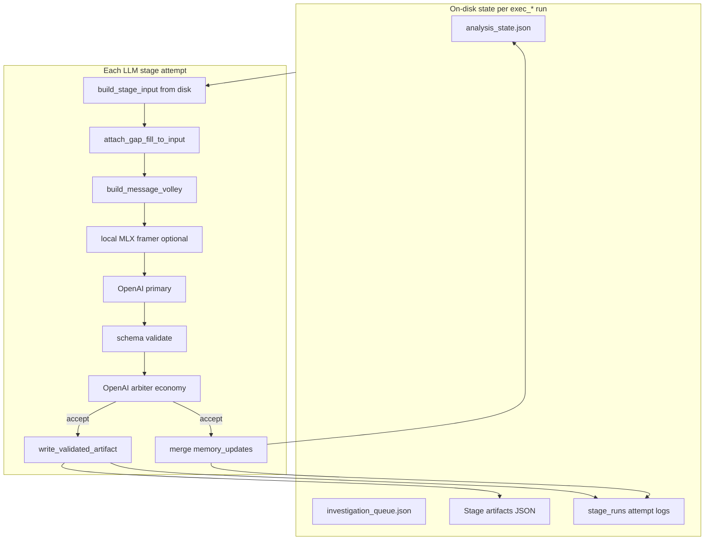

---

## 2. Where LLMs sit in the pipeline

### 2.1 Pipeline order (LLM stages highlighted)

**Shared analysis** (`ANALYSIS_ORDER` in `src/interview_mux/pipeline.py`):

| Order | Stage | LLM? | Primary output |
|------:|-------|:-----:|----------------|
| 1 | `audio_preclean` | No | Cleaned audio |
| 2 | `ingest` | No | Checksums, paths |
| 3 | `transcribe` | No | AWS Transcribe JSON |
| 4 | `transcript_review_build` | No | Review queue |
| 5 | `disfluency_extract` | No | Filler catalog |
| 6 | `source_acoustic_profile` | No | Acoustic profile |
| 7 | **`speaker_roles`** | **Yes** | `understanding/speakers.json` |
| 8 | **`content_context`** | **Yes** | `understanding/content_brief.json` |
| 9 | **`boundary_detection`** | **Yes** | `segments/boundaries.json` |
| 10 | **`segment_classification`** | **Yes** | `segments/manifest.json` |
| 11 | **`content_brief_reanchor`** | **Yes** | Patches `content_brief.json` |
| 12 | **`sound_design_palettes`** | **Yes** | `understanding/sound_design_plan.json` |
| 13 | **`missing_framing`** | **Yes** | `understanding/gap_evaluations.json` |
| 14 | **`optimal_questions`** | **Yes** | `understanding/gap_report.json` |

**Flow 1** (`FLOW1_ORDER` — after operator picks flow at gate G2):

| Stage | LLM? | Primary output |
|-------|:-----:|----------------|
| `topic_coverage_audit` | Yes | `flow_1_master/coverage_audit.json` |
| `narrative_arc_plan` | Yes | `flow_1_master/narrative_plan.json` |
| `full_master_ranking` | Yes | `flow_1_master/selection.json` |
| `transitions` | Yes | `flow_1_master/transitions.json` |
| `sound_design_plan_flow1` | Yes | Patches `sound_design_plan.json` |
| `edl_narrative_audit` | Yes | `flow_1_master/edl_narrative_audit.json` |
| `elevenlabs_prompt_craft` | Yes | `sound_design/elevenlabs_prompts.json` |
| `podcast_sfx_brief` | Yes | `flow_1_master/podcast_sfx_brief.json` |

**Flow 2:** `highlight_selection`, `sound_design_plan_flow2`, `sfx_brief`, `elevenlabs_prompt_craft` (shared stage id).

**Flow 3:** `podcast_show_description` → `flow_3_description/show_description.json`.

Non-LLM stages (assembly, mix, master, ElevenLabs audio generation) consume LLM artifacts but do not call OpenAI for envelopes.

### 2.2 Stage sets in code

| Constant | Location | Meaning |
|----------|----------|---------|
| `ANALYSIS_LLM_STAGES` | `analysis_orchestrator.py` | Understanding + segmentation + gaps |
| `FLOW_LLM_STAGES` | `analysis_orchestrator.py` | Flow 1/2/3 selection and sound-design LLM stages |
| `ALL_LLM_STAGES` | Union of above | Stages that drain investigation queue after run |
| `STAGE_ARTIFACT_SCHEMAS` | `prompt_validation.py` | Stages with strict JSON artifact schemas (force OpenAI primary) |

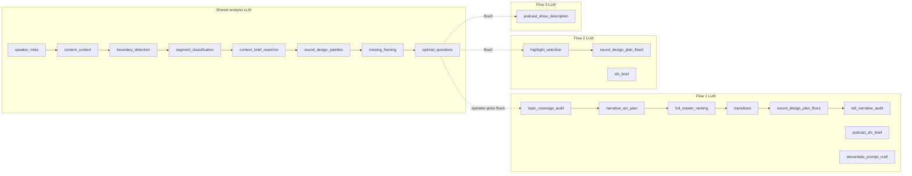

### 2.3 Knowledge dependency chain

Each stage reads **prior artifacts**, not raw prior LLM responses. The volley supplies **summaries**; the final user turn supplies **evidence**.

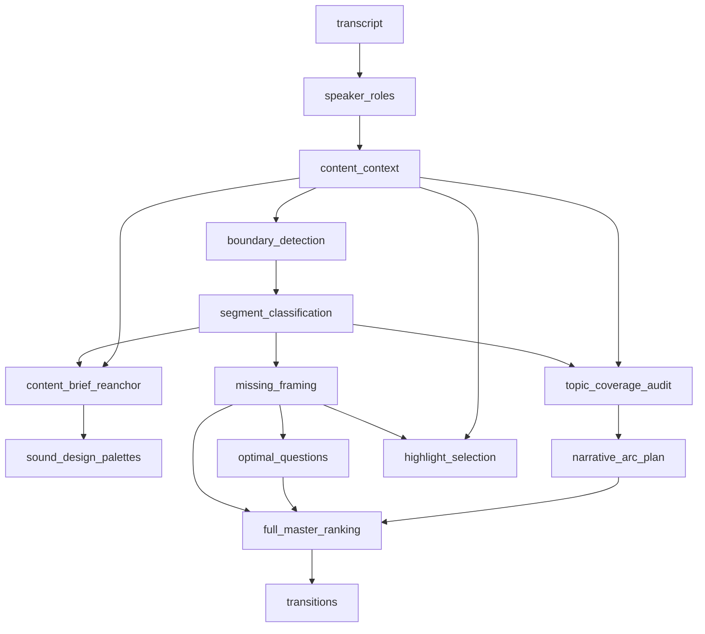

---

## 3. End-to-end call flow

### 3.1 Initialization (`pre_analysis_init`)

Before the first LLM stage, the orchestrator creates (if missing):

| File | Purpose |
|------|---------|
| `understanding/analysis_state.json` | Empty interview profile template |
| `understanding/investigation_queue.json` | `{ "items": [] }` |
| `understanding/context_index.json` | Volley plan registry from `STAGE_PLANS` |
| `understanding/analysis_orchestration.json` | Retry limits, `stage_attempts` counters |

### 3.2 Single stage attempt (detailed)

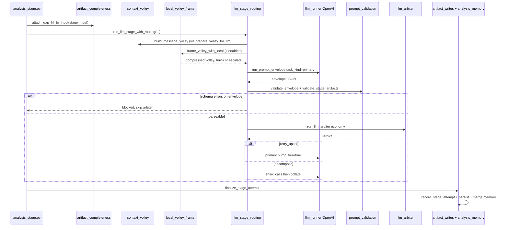

### 3.3 Entry points

| Function | Module | Used for |
|----------|--------|----------|
| `run_analysis_llm_stage` | `stages/analysis_stage.py` | Analysis phases with inner retry loop |
| `run_flow_llm_stage` | `stages/analysis_stage.py` | Flow 1/2/3 stages |
| `run_llm_stage_with_routing` | `llm_stage_routing.py` | Primary → validate → arbiter → uptier/decompose |
| `run_prompt_envelope` | `stages/llm_runner.py` | Low-level OpenAI Chat Completions call |
| `finalize_stage_attempt` | `llm_stage_routing.py` | Audit log + conditional persist + memory merge |

---

## 4. Rolling memory (`analysis_state`)

### 4.1 What it stores

`understanding/analysis_state.json` is the **per-interview profile** discovered incrementally:

| Section | Examples |
|---------|----------|
| `interview_identity` | `title`, `one_line_summary`, `source_audio_note` |
| `themes` | `{ id, label, … }` list |
| `major_questions` | Editorial questions the interview explores |
| `style` | `tone`, `tone_class`, `format_class`, pacing, interviewer/interviewee style |
| `narrative` | `thesis`, `audience`, `emotional_beats`, `key_claims` |
| `entities` | People, orgs, jargon with plain definitions |
| `speakers` | Cached speaker role mapping |
| `hypotheses` | Open/confirmed editorial hypotheses |
| `confidence` | Per-area confidence scores |
| `completion` | `analysis_ready`, `blockers` |
| `meta` | `stage_summaries`, `operator_verified`, `operator_locked_fields`, timestamps |

### 4.2 How memory grows

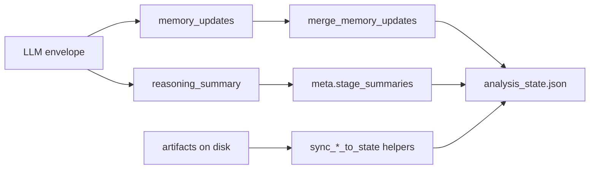

**`memory_updates` patch keys** (from `merge_memory_updates` in `analysis_memory.py`):

| Patch key | Effect |
|-----------|--------|
| `themes_append` | Append/merge theme by `id` |
| `major_questions_append` | Append question by `question` id |
| `entities_append` | Append entity by `id` |
| `hypotheses_append` | Append hypothesis by `id` |
| `narrative_patch` | Shallow merge into `narrative` |
| `style_patch` | Shallow merge into `style` (respects operator locks) |
| `interview_identity_patch` | Patch title/summary |
| `operator_notes` | Free-text operator context |
| `themes`, `major_questions`, … + `*_replace` | Full list replace when flagged |

**Operator protection:**

- `meta.operator_verified: true` → LLM must not silently overwrite verified profile fields; conflicts become `needs` with `type: operator`.
- `meta.operator_locked_fields` → GUI-tracked paths that skip LLM overwrites.

### 4.3 What is **not** sent wholesale to OpenAI

The full `analysis_state.json` is **never** pasted into every call. `context_volley.py` selects a **profile slice** per stage (`profile_keys` in `STAGE_PLANS`) and **prior stage summaries** only.

---

## 5. Message volley (context built per call)

### 5.1 Turn structure

Implemented in `build_message_volley()` (`src/interview_mux/context_volley.py`).

| # | Role | Content | Always? |
|---|------|---------|---------|
| — | `system` | `analysis-preamble.system.txt` + stage `.system.txt` + pipeline thresholds | Yes |
| 1 | `user` | Current task paragraph + volley profile (`full` / `shard` / `collate`) | Yes |
| 2 | `assistant` | Parent reasoning one-liner | Shard profile only |
| 3 | `assistant` | **Established conclusions** from prior stages (prose) | If priors exist |
| 4 | `user` | Operator profile slice (themes, narrative, style, …) | Full profile + keys exist |
| 5 | `user` | Open investigations (blocking + stage-matched, max 1–3) | If any selected |
| last | `user` | **Input data for this stage only** — shaped JSON (+ `gap_fill_context`) | Yes |

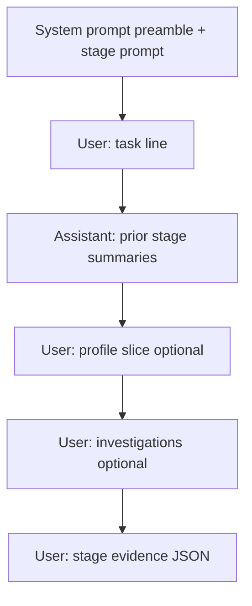

**Design principle:** Prior work appears as **short assistant prose** (`reasoning_summary` or artifact digests). Only the **last user turn** contains raw evidence for the current stage.

### 5.2 Prior conclusions sources (priority order)

For each stage in `plan.prior_stages`:

1. `analysis_state.meta.stage_summaries[stage]`
2. `reasoning_summary` from last **accepted** `understanding/stage_runs/<stage>/attempt_NNN.json`
3. One-line **artifact digest** (e.g. `"3/12 segments need framing"` from `gap_evaluations.json`)

### 5.3 Per-stage volley plan (`STAGE_PLANS`)

Each stage declares in `STAGE_PLANS`:

| Field | Meaning |
|-------|---------|
| `task_line` | One-paragraph instruction in first user turn |
| `prior_stages` | Which earlier stages contribute assistant summaries |
| `profile_keys` | Subset of `analysis_state` for optional user turn |
| `investigation_kinds` | Filter for `investigation_queue` items |
| `max_investigations` | Cap (0–3) |

**Example — `missing_framing`:**

| Plan field | Value |
|------------|-------|
| `prior_stages` | `segment_classification`, `content_brief_reanchor`, `content_context` |
| `profile_keys` | `narrative`, `entities`, `major_questions`, `hypotheses` |
| `investigation_kinds` | `gap_unresolved`, `segment_ambiguity` |
| `max_investigations` | 3 |

### 5.4 Volley profiles (map-reduce)

| Profile | When | Middle turns |
|---------|------|--------------|
| `full` | Normal primary call | Full priors + profile + investigations |
| `shard` | Economy sub-call on evidence slice | 1 prior stage + parent reasoning one-liner; no investigations |
| `collate` | Merge shard envelopes | One assistant turn per shard summary + merge instruction |

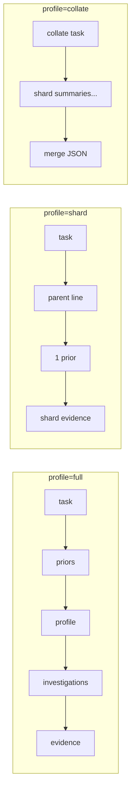

### 5.5 Character budgets (truncation)

Configured under `analysis.context` in `config/app.defaults.json`:

| Key | Default | Applies to |
|-----|--------:|------------|
| `transcript_full_chars` | 72,000 | `content_context`, boundaries transcript |
| `transcript_excerpt_chars` | 24,000 | `speaker_roles` excerpt |
| `speaker_roles_sample_chars` | 24,000 | Per-speaker samples |
| `max_stage_data_chars` | 64,000 | Final JSON block in volley |
| `segment_text_max_chars` | 400 | Per segment in lists |
| `max_segments_in_context` | 100 | Segment list cap |
| `max_gap_evaluations` | 50 | Gap evaluation list |
| `proactive_decompose_chars` | 72,000 | Auto shard/collate for long `content_context` |

When truncated, volley text includes `…[truncated]` or `…[stage data truncated]` — tracked as `truncation_flags` for arbiter and local LLM escalation.

---

## 6. Stage input shaping and gap-fill

### 6.1 `_shape_stage_input`

Before JSON enters the volley, `context_volley._shape_stage_input()` **strips irrelevant fields** per stage:

| Stage | What gets sent (high level) |
|-------|---------------------------|
| `speaker_roles` | Transcript excerpt/samples + speaker ids |
| `content_context` | Full transcript (clipped) + transcript quality flags |
| `boundary_detection` | Speakers, compact brief, transcript, pause hints, value features |
| `segment_classification` | Boundaries, brief, clipped transcript items |
| `missing_framing` | Compact brief + segments (gap-oriented) |
| `optimal_questions` | Gap evaluations + segments needing framing only |
| Flow stages | `_slim_flow_input` — brief, segments, prior flow artifacts |

This prevents shipping the entire transcript to every stage.

### 6.2 Gap-fill (incremental artifacts)

When an on-disk artifact exists but is **incomplete**, `attach_gap_fill_to_input()` adds:

```json
{
  "gap_fill_context": {
    "artifact_path": "understanding/content_brief.json",
    "existing": { "... current on-disk object ..." },
    "gaps": ["thesis", "topics[0].segment_ids"],
    "skip_fields": ["audience"],
    "instructions": "Only fill listed gaps. Do not overwrite skip_fields."
  }
}
```

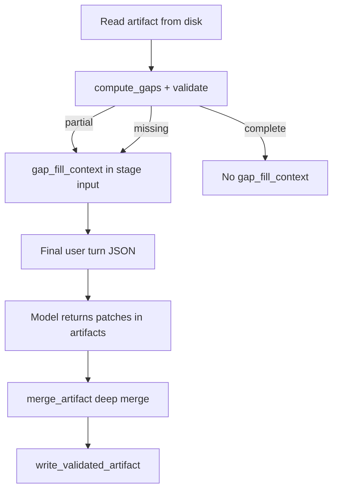

The shared preamble (`analysis-preamble.system.txt`) instructs the model: when `gap_fill_context` is present, output **patches only** for `gaps`.

---

## 7. The analysis envelope (LLM output contract)

Every LLM stage returns the same top-level shape, validated against `docs/cross-cutting/json-schemas/analysis_envelope.schema.json`.

### 7.1 Schema

```json
{
  "status": "complete",
  "artifacts": { },
  "memory_updates": { },
  "needs": [],
  "follow_up_investigations": [],
  "confidence": 0.85,
  "reasoning_summary": "One paragraph for the next stage's volley."
}
```

### 7.2 Field reference

| Field | Type | Purpose |
|-------|------|---------|
| `status` | `complete` \| `partial` \| `needs_input` \| `blocked` | Whether stage succeeded |
| `artifacts` | object | Stage-specific JSON; keys match prompt (e.g. `content_brief`, `segments`) |
| `memory_updates` | object | Patches merged into `analysis_state.json` |
| `needs` | array | `{ type, reason, blocking?, stage? }` — rerun or operator input |
| `follow_up_investigations` | array | Items enqueued to `investigation_queue.json` |
| `confidence` | number 0–1 | Model self-assessment |
| `reasoning_summary` | string | **Critical:** becomes next stage's assistant context |

### 7.3 `needs` types

| `type` | Meaning |
|--------|---------|
| `rerun_stage` | Suggests re-running a pipeline stage |
| `operator` | Requires human review (non-blocking for merge when flagged) |
| `transcript_excerpt` | Needs more transcript evidence |
| `human_fact` | External fact check |

### 7.4 OpenAI API technical details

| Parameter | Primary | Arbiter | Shard | Collate |
|-----------|---------|---------|-------|---------|
| SDK | `openai` Python package | same | same | same |
| Endpoint | Chat Completions `client.chat.completions.create` | same | same | same |
| `temperature` | `0.2` | `0.0` | `0.2` | `0.2` |
| `response_format` | `{ "type": "json_object" }` when supported | same | same | same |
| System prompt | Preamble + stage prompt + thresholds | `arbiter.system.txt` | Stage prompt (shard profile) | Stage prompt (collate) |

Response parsing: extract JSON from message content → `normalize_envelope()` → attach `_llm_meta: { model_id, model_tier, task_kind }`.

---

## 8. Persistence: what gets written to disk

### 8.1 Two persistence paths

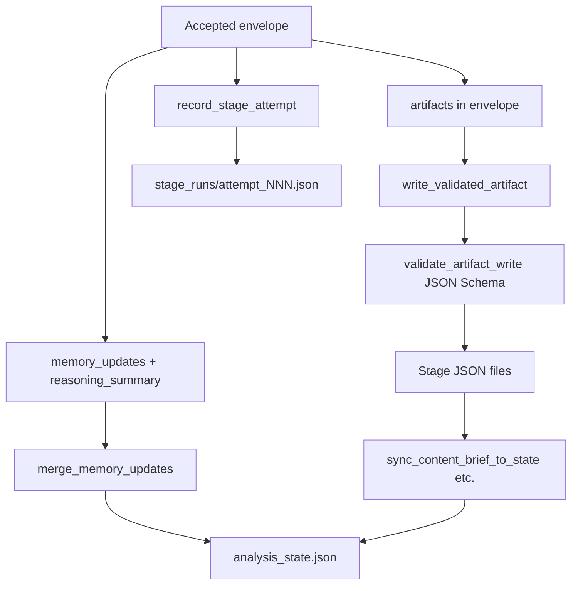

### 8.2 Stage → disk path map

From `STAGE_ARTIFACT_DISK_PATHS` in `prompt_validation.py`:

| Stage key | On-disk path | JSON Schema file |
|-----------|--------------|------------------|
| `speaker_roles` | `understanding/speakers.json` | `speakers_artifact.schema.json` |
| `content_context` | `understanding/content_brief.json` | `content_brief_artifact.schema.json` |
| `content_brief_reanchor` | `understanding/content_brief.json` (merge) | same |
| `boundary_detection` | `segments/boundaries.json` | `boundaries_artifact.schema.json` |
| `segment_classification` | `segments/manifest.json` | `manifest_artifact.schema.json` |
| `sound_design_palettes` | `understanding/sound_design_plan.json` | `sound_design_palettes_artifact.schema.json` |
| `missing_framing` | `understanding/gap_evaluations.json` | `gap_evaluations_artifact.schema.json` |
| `optimal_questions` | `understanding/gap_report.json` | `gap_report.schema.json` |
| `topic_coverage_audit` | `flow_1_master/coverage_audit.json` | `coverage_audit_artifact.schema.json` |
| `narrative_arc_plan` | `flow_1_master/narrative_plan.json` | `narrative_plan_artifact.schema.json` |
| `full_master_ranking` | `flow_1_master/selection.json` | `master_selection_artifact.schema.json` |
| `edl_narrative_audit` | `flow_1_master/edl_narrative_audit.json` | `edl_narrative_audit_artifact.schema.json` |
| `highlight_selection` | `flow_2_highlights/selection.json` | `highlights_artifact.schema.json` |
| `transitions` | `flow_1_master/transitions.json` | `transitions_artifact.schema.json` |
| `podcast_sfx_brief` | `flow_1_master/podcast_sfx_brief.json` | `podcast_sfx_artifact.schema.json` |
| `sound_design_plan_flow1` | `understanding/sound_design_plan.json` | `sound_design_plan_flow1_artifact.schema.json` |
| `sound_design_plan_flow2` | `understanding/sound_design_plan.json` | `sound_design_plan_flow2_artifact.schema.json` |
| `elevenlabs_prompt_craft` | `sound_design/elevenlabs_prompts.json` | `elevenlabs_prompts_artifact.schema.json` |
| `sfx_brief` | `flow_2_highlights/sfx_brief.json` | `sfx_montage_artifact.schema.json` |
| `podcast_show_description` | `flow_3_description/show_description.json` | `show_description_artifact.schema.json` |

Schemas live under `docs/cross-cutting/json-schemas/`.

### 8.3 Persist gating

Artifacts and memory merge **only when**:

1. Arbiter verdict is `accept` (or successful collate with `routed_via_collate`), **and**
2. No blocking schema errors on artifacts, **and**
3. `artifacts` object is non-empty (for file writes).

See `should_persist_artifacts()` and `should_merge_envelope()` in `analysis_memory.py`.

### 8.4 Supporting machine-managed files

| Path | Purpose |
|------|---------|
| `understanding/stage_runs/<stage>/attempt_NNN.json` | Full envelope, volley, arbiter result, local LLM meta |
| `understanding/llm_calls/<stage>/attempt_NNN/01_primary.json` | Per-API-call audit record |
| `understanding/llm_calls/index.jsonl` | Grep-friendly call index |
| `understanding/investigation_queue.json` | Open follow-ups from `follow_up_investigations` |
| `understanding/analysis_orchestration.json` | Attempt counts, uptier budget |

---

## 9. OpenAI model routing

### 9.1 Tier vocabulary

The codebase uses **tier names** in prose and config; concrete API IDs are resolved at runtime.

| Tier | Default API ID | Typical role |
|------|----------------|--------------|
| **economy** | `gpt-4o-mini` | Arbiter, shard sub-calls, specialist passes |
| **standard** | `gpt-4o` | Mid-tier; uptier bump; some collate on high-severity stages |
| **flagship** | `o3` | All structured artifact **primary** calls (committed defaults) |

Registry: `src/interview_mux/model_registry.py` — `DEFAULT_TIER_MODELS`, `resolve_model()`.

### 9.2 Resolution order

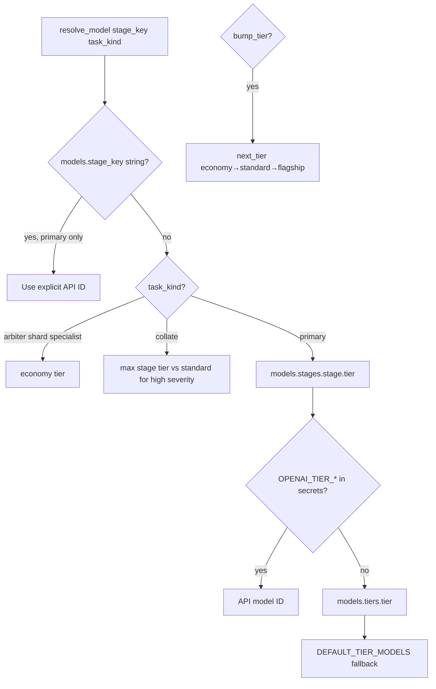

| Priority | Source | Example |
|----------|--------|---------|
| 1 | Flat per-stage override `models.<stage_key>` (string) | `"missing_framing": "gpt-4o"` |
| 2 | `models.stages.<key>.tier` → `models.tiers` | `"flagship"` → `o3` |
| 3 | Secrets `OPENAI_TIER_ECONOMY` / `_STANDARD` / `_FLAGSHIP` | Per-machine API ID |
| 4 | `DEFAULT_TIER_MODELS` in code | Fallback |

**Note:** `retry_uptier` bumps tier even when flat string override is set (override applies only to first primary pass).

### 9.3 Committed runtime defaults

From `config/app.defaults.json` — **all LLM stages use flagship (`o3`) for primary**:

```json
"models": {
  "tiers": {
    "economy": "gpt-4o-mini",
    "standard": "gpt-4o",
    "flagship": "o3"
  },
  "stages": {
    "speaker_roles": { "tier": "flagship" },
    "content_context": { "tier": "flagship" },
    "...": { "tier": "flagship" }
  }
}
```

Arbiter and shard calls still resolve to **economy** (`gpt-4o-mini`) regardless of stage flagship default.

### 9.4 `task_kind` → tier rules

| `task_kind` | Tier resolution |
|-------------|-----------------|
| `primary` | Stage default tier; `bump_tier=true` → `next_tier()` |
| `arbiter` | Always economy |
| `shard` | Always economy |
| `specialist` | Always economy |
| `collate` | Stage tier; if stage is high-severity and tier &lt; standard → standard |

### 9.5 Stage severity (editorial impact)

Used for local LLM escalation and collate tier rules (`model_registry.stage_severity`):

| Severity | Stages |
|----------|--------|
| **high** | `missing_framing`, `optimal_questions`, `topic_coverage_audit`, `narrative_arc_plan`, `full_master_ranking`, `edl_narrative_audit`, `highlight_selection`, `podcast_show_description`, `sound_design_plan_flow1`, `sound_design_plan_flow2` |
| **low** | `speaker_roles`, `transitions`, `podcast_sfx_brief`, `sfx_brief`, `sound_design_palettes`, `elevenlabs_prompt_craft` |
| **medium** | Everything else (e.g. `content_context`, `boundary_detection`, `segment_classification`) |

### 9.6 Authentication

| Secret | Purpose |
|--------|---------|
| `OPENAI_API_KEY` | Required — read via `require_secret("OPENAI_API_KEY")` |
| `OPENAI_TIER_ECONOMY` | Optional tier ID override |
| `OPENAI_TIER_STANDARD` | Optional tier ID override |
| `OPENAI_TIER_FLAGSHIP` | Optional tier ID override |

Set in `config/secrets/secrets.env` (gitignored).

### 9.7 Force OpenAI for schema stages

Stages in `STAGE_ARTIFACT_SCHEMAS` set `force_openai = True` in `llm_stage_routing.py`. Local MLX **cannot skip** OpenAI primary for these stages even if `skip_openai_primary_when_local_satisfied` were enabled.

---

## 10. Local LLM tier (MLX on Apple Silicon)

### 10.1 Purpose

A **small instruct model** runs on-device to **compress and frame** the message volley before OpenAI — reducing token cost and latency. It does **not** produce validated stage artifacts in normal operation.

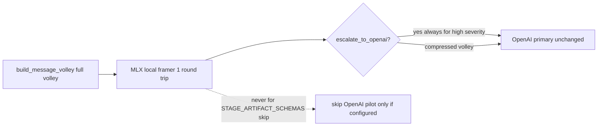

### 10.2 Hardware and runtime

| Aspect | Detail |
|--------|--------|
| Target | Apple Silicon (e.g. M1 16 GB) |
| Runtime | **MLX** via `mlx-lm` (in project `.venv`) |
| Weight format | 4-bit MLX builds from `mlx-community/*` on Hugging Face |
| Weights path | `ASSETS/local_llm/models/<slug>/` (gitignored) |
| HF cache | `ASSETS/local_llm/hf_cache/` |
| Selection manifest | `ASSETS/local_llm/selection.json` (from llmfit) |

### 10.3 Model selection

| Method | Command / config |
|--------|------------------|
| **Auto (recommended)** | `python scripts/select_local_llm.py --download` — uses [llmfit](https://github.com/AlexsJones/llmfit) to pick best MLX model for your RAM |
| **Config default** | `local_llm.model_id`: `mlx-community/Llama-3.2-3B-Instruct-4bit` |
| **Secret override** | `LOCAL_LLM_MODEL_ID` in `secrets.env` |
| **Fallback** | `mlx-community/Llama-3.2-3B-Instruct-4bit` if llmfit finds no candidate |

**Optional manual picks (4-bit MLX only on 16 GB):**

| Hugging Face repo | Approx RAM | Notes |
|-------------------|-------------|-------|
| `mlx-community/Llama-3.2-3B-Instruct-4bit` | ~2 GB | Default / fallback |
| `mlx-community/Mistral-7B-Instruct-v0.3-4bit` | ~4–5 GB | Higher quality summaries |
| `mlx-community/Qwen2.5-7B-Instruct-4bit` | ~4–5 GB | Alternative 7B |

### 10.4 Local call shape

| Turn | Role | Content |
|------|------|---------|
| — | `system` | `docs/prompts/_shared/local-volley-framer.system.txt` |
| 1 | `user` | JSON: `stage_key`, `task_kind`, `severity`, capped input digest, `prior_one_liners`, `volley_budget` |
| 2 | `assistant` | Strict JSON: `{ escalate, confidence, reason, volley_turns[] }` |

| Generation setting | Value |
|--------------------|-------|
| `temperature` | 0.0 (deterministic) |
| `max_tokens` | 768 default (`local_llm.max_tokens`) |
| Max injected turns | 2 (`local_llm.max_volley_turns`) |

### 10.5 Escalation matrix (local → OpenAI)

| Signal | Local outcome | OpenAI |
|--------|---------------|--------|
| Stage severity **high** | Frame only | **Always** primary |
| `truncation_flags` set | Frame + escalate | Primary (+ possible decompose) |
| `meta.operator_verified` | Frame only | Primary unchanged |
| Local JSON parse fail | Escalate | Primary (fail-safe) |
| `confidence` &lt; `min_confidence` (0.6) | Escalate | Primary |
| Empty `volley_turns` without escalate | Escalate | Primary |
| Stage in `STAGE_ARTIFACT_SCHEMAS` | May compress volley | **Cannot skip** primary |

`skip_openai_primary_when_local_satisfied` defaults to **`false`** — OpenAI always runs for real artifacts.

### 10.6 Local vs OpenAI responsibility

| Task | Local MLX | OpenAI |
|------|:---------:|:------:|
| Compress prior summaries to one paragraph | Yes | No |
| Drop non-blocking investigations | Yes | No |
| Emit `artifacts` + `memory_updates` envelope | No* | Yes |
| Gap / narrative / ranking judgment | No | Yes |
| Schema validation + arbiter | No | Yes |

\*Except experimental pilot path when `skip_openai_primary_when_local_satisfied: true` and stage not in `STAGE_ARTIFACT_SCHEMAS`.

### 10.7 Applying local framing to volley

`apply_local_framing_to_volley()` keeps:

- **First** user turn (task line)
- **Last** user turn (stage evidence)
- Replaces **middle** turns with local `volley_turns`

---

## 11. LLM arbiter (quality gate)

After primary parse + artifact schema check, an **economy** OpenAI call judges whether to accept, uptier, decompose, or enqueue investigation.

### 11.1 Verdict flow

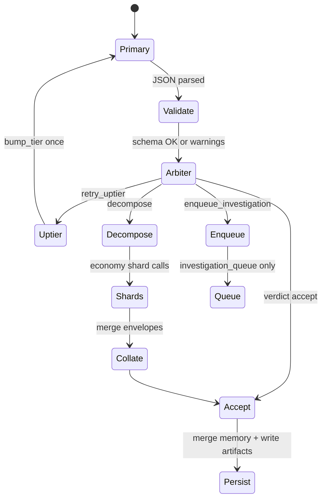

### 11.2 Arbiter inputs (compact — no full transcript)

| Field | Description |
|-------|-------------|
| `stage_key` | Stage being judged |
| `envelope_summary` | status, confidence, reasoning_summary, artifact key counts |
| `schema_errors` | Validation messages |
| `context_chars` | Volley size estimate |
| `truncation_flags` | e.g. `max_stage_data_chars` |
| `stage_expectations` | severity, default_tier, decompose_eligible |
| `attempt_number` | Inner-loop attempt |

### 11.3 Arbiter response

```json
{
  "verdict": "accept",
  "confidence": 0.85,
  "gaps": [],
  "shard_plan": [],
  "suggested_investigation": null,
  "reasoning_summary": "Artifacts cover all segments; schema clean."
}
```

| `verdict` | Action |
|-----------|--------|
| `accept` | Persist artifacts + merge memory |
| `retry_uptier` | Re-run primary at next tier (budget limited) |
| `decompose` | Run shard → collate path |
| `enqueue_investigation` | Queue item only; **no merge** on rejected primary |

Prompt: `docs/prompts/_shared/arbiter.system.txt`

---

## 12. Shard / collate (map-reduce for long interviews)

### 12.1 When decomposition triggers

| Trigger | Mechanism |
|---------|-----------|
| Proactive | `content_context` transcript &gt; `proactive_decompose_chars` (72k) |
| Arbiter | `verdict: decompose` with `shard_plan` |
| Deterministic fallback | Arbiter requests decompose but empty plan + `truncation_flags` set |
| Truncation investigation | Enqueued when volley truncated and arbiter did not accept |

### 12.2 Decompose-eligible stages

`DECOMPOSE_ELIGIBLE` in `llm_shard_plans.py`:

- `content_context`
- `boundary_detection`
- `segment_classification`
- `content_brief_reanchor`
- `missing_framing`
- `topic_coverage_audit`
- `full_master_ranking`
- `highlight_selection`

Max **8** shards per attempt.

### 12.3 Shard / collate sequence

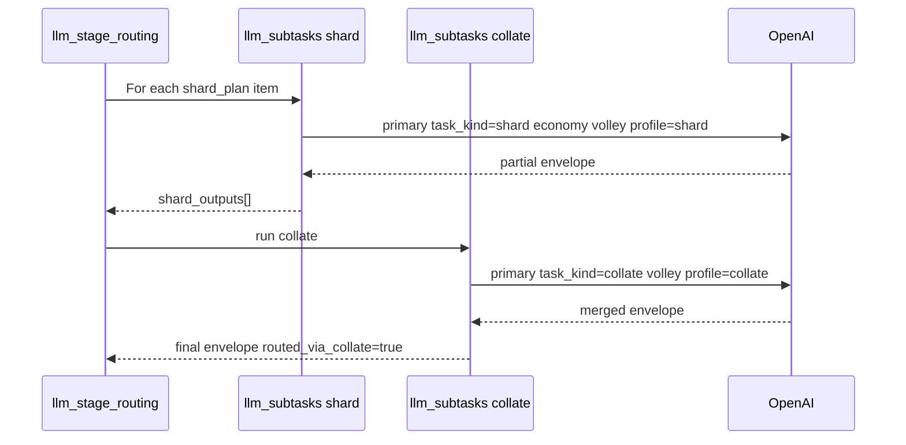

### 12.4 `shard_plan` item shape

```json
{
  "label": "batch_1_of_3",
  "segment_ids": ["seg_001", "seg_002"],
  "start_ms": 0,
  "end_ms": 120000
}
```

---

## 13. Retries, investigations, and inner loops

### 13.1 Retry layers

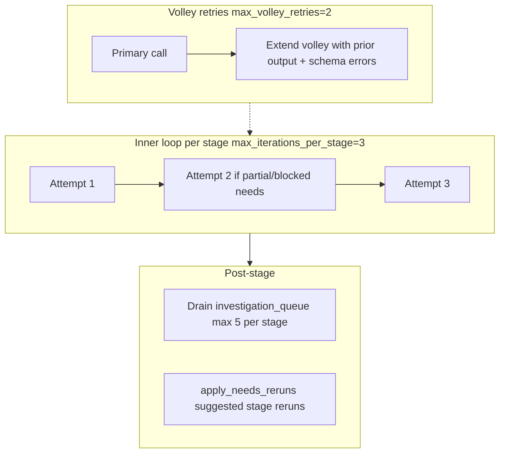

| Mechanism | Default limit | Config key |
|-----------|---------------|------------|
| Inner stage attempts | 3 | `analysis.max_iterations_per_stage` |
| Volley retries (schema/status) | 2 | `analysis.max_volley_retries` |
| Queue drains after LLM stage | 5 | `analysis.max_queue_drains_per_stage` |
| Uptier per stage per run | Budget tracked in orchestration | `uptier_budget_remaining()` |

### 13.2 Investigation queue

Items from `follow_up_investigations` or arbiter `suggested_investigation`:

| Field | Purpose |
|-------|---------|
| `kind` | e.g. `theme_unmapped`, `gap_unresolved`, `context_truncated` |
| `question` | Human-readable issue |
| `blocking` | Whether it blocks progress |
| `suggested_action` | `{ type: rerun_stage, stage: ... }` |
| `priority` | `high` / normal |

After each `ALL_LLM_STAGES` stage completes, `drain_investigation_queue()` may re-run suggested stages (specialist passes use economy tier).

---

## 14. Audit trail and observability

### 14.1 LLM call records

Every OpenAI call through `run_prompt_envelope` can be recorded when `analysis.llm_call_records.enabled: true`.

```
understanding/llm_calls/
  index.jsonl
  <stage_key>/
    attempt_001/
      01_primary.json
      01_primary.md          # optional markdown sidecar
      02_arbiter.json
      03_shard_01.json
      04_collate.json
```

**Label format:** `<phase>:<stage_key>:a<attempt>:<sequence>:<task_kind>`

Example: `analysis:missing_framing:a002:02:arbiter`

**Export for review:**

```bash
python tools/export_llm_calls.py --run-id <exec_*>
```

### 14.2 Stage attempt files

`understanding/stage_runs/<stage>/attempt_NNN.json` contains:

| Field | Content |
|-------|---------|
| `envelope` | Full analysis envelope |
| `context_volley` | Messages sent (minus system) |
| `context_chars` | Character estimate |
| `arbiter_result` | Verdict + shard plan |
| `model_id`, `model_tier` | From `_llm_meta` |
| `local_llm` | Escalation, confidence, latency |
| `shard_count`, `routed_via_collate` | Routing metadata |

### 14.3 GUI

Pipeline workspace → **LLM calls** sub-tab: browse, expand, edit volley turns, save back to disk.

---

## 15. Configuration reference

### 15.1 `analysis` block (`config/app.defaults.json`)

| Key | Default | Purpose |
|-----|--------:|---------|
| `max_iterations_per_stage` | 3 | Inner retry loop per stage |
| `max_queue_drains_per_stage` | 5 | Investigation queue processing |
| `max_volley_retries` | 2 | Schema/status volley extensions |
| `llm_call_records.enabled` | true | Write `understanding/llm_calls/` |
| `llm_call_records.write_markdown_sidecar` | true | `.md` copy-paste files |
| `specialists.enabled` | true | Post-stage specialist passes |
| `prompt_examples.enabled` | true | Few-shot examples for select stages |

### 15.2 `analysis.context` caps

See [Section 5.5](#55-character-budgets-truncation).

### 15.3 `local_llm` block

| Key | Default | Purpose |
|-----|---------|---------|
| `enabled` | `true` | Master switch |
| `model_id` | `mlx-community/Llama-3.2-3B-Instruct-4bit` | HF repo id |
| `models_dir` | `ASSETS/local_llm/models` | Weight directory |
| `max_volley_turns` | 2 | Injected turn cap |
| `max_tokens` | 768 | Generation limit |
| `escalate_on_parse_error` | `true` | Fail-safe to OpenAI |
| `min_confidence` | 0.6 | Escalate if local confidence below |
| `skip_openai_primary_when_local_satisfied` | `false` | Pilot: skip OpenAI when local says no escalate |
| `apply_to_shards` / `apply_to_collate` / `apply_to_specialists` | `true` | Frame those task kinds |

### 15.4 `models` block

See [Section 9.3](#93-committed-runtime-defaults).

---

## 16. Code module map

| Module | Path | Responsibility |
|--------|------|----------------|
| Pipeline order | `src/interview_mux/pipeline.py` | `ANALYSIS_ORDER`, `FLOW*_ORDER`, stage dispatch |
| Stage runner | `src/interview_mux/stages/analysis_stage.py` | Inner loop, gap-fill attach, finalize |
| Volley builder | `src/interview_mux/context_volley.py` | `STAGE_PLANS`, `build_message_volley`, shaping |
| OpenAI client | `src/interview_mux/stages/llm_runner.py` | `run_prompt_envelope`, prompts, JSON extract |
| Model registry | `src/interview_mux/model_registry.py` | Tiers, `resolve_model`, severity |
| Routing orchestration | `src/interview_mux/llm_stage_routing.py` | Primary, arbiter, uptier, decompose gate |
| Arbiter | `src/interview_mux/llm_arbiter.py` | Economy quality gate |
| Shard/collate | `src/interview_mux/llm_subtasks.py` | Map-reduce sub-calls |
| Shard plans | `src/interview_mux/llm_shard_plans.py` | Deterministic decomposition |
| Memory | `src/interview_mux/analysis_memory.py` | State, queue, merge, attempt records |
| Orchestrator | `src/interview_mux/analysis_orchestrator.py` | Init, queue drain, stage sets |
| Gap-fill | `src/interview_mux/artifact_completeness.py` | Gaps, merge, completeness status |
| Validated writes | `src/interview_mux/artifact_writes.py` | `write_validated_artifact` |
| Schema registry | `src/interview_mux/prompt_validation.py` | `STAGE_ARTIFACT_SCHEMAS`, validators |
| Local config | `src/interview_mux/local_llm_config.py` | MLX settings resolution |
| Local runner | `src/interview_mux/local_llm_runner.py` | `generate_local_chat`, model load |
| Local framer | `src/interview_mux/local_volley_framer.py` | `prepare_volley_for_llm`, escalation |
| Call records | `src/interview_mux/llm_call_record.py` | Audit JSON + volley reconstruction |
| Prompts | `docs/prompts/**` | System prompts per stage |

---

## 17. Stage reference tables

### 17.1 Analysis LLM stages

| Stage | Severity | Primary tier (committed) | Decompose | Prior stages in volley | Profile keys |
|-------|----------|--------------------------|-----------|------------------------|--------------|
| `speaker_roles` | low | flagship | no | — | operator_notes |
| `content_context` | medium | flagship | yes | speaker_roles | operator_notes, interview_identity |
| `boundary_detection` | medium | flagship | yes | speaker_roles, content_context | themes, narrative |
| `segment_classification` | medium | flagship | yes | content_context, boundary_detection | themes, narrative, speakers |
| `content_brief_reanchor` | medium | flagship | yes | content_context, segment_classification | themes, narrative, hypotheses |
| `sound_design_palettes` | low | flagship | no | content_context, reanchor, classification | themes, narrative, style, operator_notes |
| `missing_framing` | high | flagship | yes | classification, reanchor, content_context | narrative, entities, major_questions, hypotheses |
| `optimal_questions` | high | flagship | no | missing_framing, content_context | style, major_questions, narrative |

### 17.2 Flow LLM stages

| Stage | Severity | Primary tier | Decompose | Flow |
|-------|----------|--------------|-----------|------|
| `topic_coverage_audit` | high | flagship | yes | 1 |
| `narrative_arc_plan` | high | flagship | no | 1 |
| `full_master_ranking` | high | flagship | yes | 1 |
| `edl_narrative_audit` | high | flagship | no | 1 |
| `transitions` | low | flagship | no | 1 |
| `podcast_sfx_brief` | low | flagship | no | 1 |
| `sound_design_plan_flow1` | high | flagship | no | 1 |
| `highlight_selection` | high | flagship | yes | 2 |
| `sound_design_plan_flow2` | high | flagship | no | 2 |
| `sfx_brief` | low | flagship | no | 2 |
| `elevenlabs_prompt_craft` | low | flagship | no | 1+2 |
| `podcast_show_description` | high | flagship | no | 3 |

### 17.3 Prompt file paths

| Stage | System prompt path |
|-------|-------------------|
| `speaker_roles` | `docs/prompts/understanding/speaker-roles.system.txt` |
| `content_context` | `docs/prompts/understanding/content-context.system.txt` |
| `boundary_detection` | `docs/prompts/segmentation/boundary-detection.system.txt` |
| `segment_classification` | `docs/prompts/segmentation/segment-classification.system.txt` |
| `content_brief_reanchor` | `docs/prompts/understanding/content-brief-reanchor.system.txt` |
| `missing_framing` | `docs/prompts/interviewer-gap/missing-framing.system.txt` |
| `optimal_questions` | `docs/prompts/interviewer-gap/optimal-questions.system.txt` |
| `topic_coverage_audit` | `docs/prompts/selection/topic-coverage-audit.system.txt` |
| `narrative_arc_plan` | `docs/prompts/selection/narrative-arc-plan.system.txt` |
| `full_master_ranking` | `docs/prompts/selection/full-master-ranking.system.txt` |
| `highlight_selection` | `docs/prompts/selection/highlight-selection.system.txt` |
| `podcast_show_description` | `docs/prompts/publishing/podcast-show-description.system.txt` |
| Arbiter | `docs/prompts/_shared/arbiter.system.txt` |
| Local framer | `docs/prompts/_shared/local-volley-framer.system.txt` |
| Shared preamble | `docs/prompts/_shared/analysis-preamble.system.txt` |

### 17.4 API calls per successful stage (typical)

| Path | OpenAI calls | Local MLX calls |
|------|-------------|-----------------|
| Simple stage (accept first try) | 1 primary + 1 arbiter | 0–1 framer |
| Schema retry | 2–3 primary + 1 arbiter | 0–1 framer |
| Uptier | 2 primary + 2 arbiter | 0–2 framer |
| Decompose 3 shards | 3 shard + 1 collate + 1 arbiter | 0–1 framer |
| Long content_context proactive | 3 shard + 1 collate + arbiter skipped accept | 0–1 framer |

---

## 18. Flow hardening

**Module:** `src/interview_mux/llm_flow_hardening.py` — single policy for stage completion truth, fail-closed critical path, and downstream gates.

**Config:** `analysis.flow_hardening` in `config/app.defaults.json` (see [config-keys.md](docs/cross-cutting/config-keys.md)).

### 18.1 Critical vs soft LLM stages

| Class | Stages | On failure (hardening on) |
|-------|--------|---------------------------|
| **Critical (analysis)** | `speaker_roles`, `content_context`, `boundary_detection`, `segment_classification`, `content_brief_reanchor`, `missing_framing`, `optimal_questions` | `SystemExit` — GUI job status `gate` |
| **Critical (flow)** | `topic_coverage_audit`, `narrative_arc_plan`, `full_master_ranking`, `highlight_selection`, `podcast_show_description` | Same |
| **Soft** | All other `STAGE_ARTIFACT_SCHEMAS` stages (transitions, SFX briefs, sound design, etc.) | Warning log; stage **not** marked done; investigations may enqueue |

Set `analysis.flow_hardening.enabled: false` to restore legacy permissive behavior (always `mark_done` after LLM call).

### 18.2 Completion truth (`complete_llm_stage_or_halt`)

Called from `run_analysis_llm_stage` / `run_flow_llm_stage` when `auto_complete=True` (default). Marks `.stage_done` only when `llm_stage_progress_ok`:

- Envelope `status == complete`
- No blocking non-operator `needs`
- Arbiter merge allowed (`should_merge_envelope`)
- No `schema_errors` when `halt_on_schema_errors_with_accept`
- Producer artifact `artifact_status == complete`

### 18.3 Preflight (`llm_preflight.py`)

Deterministic checks **before** OpenAI when `preflight_enabled`. On failure: blocked envelope, no API call.

| Stage | Checks |
|-------|--------|
| `speaker_roles` | `transcript/full.json` exists and non-empty; G0 clear |
| `content_context` | Transcript min length; G0 clear |
| `boundary_detection` | `speakers.json` valid; ≥1 interviewer |
| `segment_classification` | `boundaries.json` non-empty |
| `content_brief_reanchor` | Brief thesis+topics; `manifest.json` exists |
| `missing_framing` | Manifest segments; `content_brief` exists |
| `optimal_questions` | `gap_evaluations.json` exists |
| Flow LLM stages | Upstream artifacts `complete` per dependency map |

**Gap report:** An empty `interviewer_lines` array is valid when no VO pickup lines are required — `gap_report.json` is still `complete`.

### 18.4 Upstream LLM progress (`require_llm_stage_progress`)

Before each LLM stage runs (when hardening is on), `pipeline.py` calls `maybe_require_upstream_llm_progress`, which verifies the immediate upstream LLM stage is marked done and its producer artifact is `complete`. This complements preflight (which catches missing inputs before OpenAI) by blocking runs when `.stage_done` is set but the on-disk artifact is still partial.

### 18.5 Cross-artifact validation (`artifact_cross_validate.py`)

| Checkpoint | After stage | Validates |
|------------|-------------|-----------|
| `post_segmentation` | `segment_classification` | Boundary `segment_id` ⊆ manifest; monotonic times; brief topic `segment_id` ⊆ manifest |
| `post_reanchor` | `content_brief_reanchor` | Reanchor completeness (gap rules) |
| `post_gaps` | `missing_framing` | Gap evaluation `segment_id` ⊆ manifest |
| `pre_flow1` | Flow entry | All analysis-ready artifacts `complete` |

Critical checkpoints → `SystemExit`. Wired in `pipeline.py` after LLM stages and via `gates.require_analysis_artifacts_complete()` at flow entry.

### 18.6 Shard / collate / investigation

- **Shard min ratio:** `shard_min_success_ratio` (default `0.75`) — collate skipped when too many shards fail schema/status.
- **Collate arbiter:** Proactive `content_context` decompose and arbiter `decompose` path run **real** `run_llm_arbiter` on collate output (no synthetic accept).
- **Truncation hard-block:** High-severity stages with `truncation_flags` block primary and request decompose.
- **Investigation drain:** Rerun investigations mark done only when producer artifact reaches `complete`; specialists require parseable envelope.
- **Inner retry:** `inner_retry_require_delta` stops when attempt signature unchanged.

### 18.7 Recovery playbook

```text
1. Read gate message → note stage_key
2. Inspect understanding/stage_runs/<stage>/attempt_*.json + producer JSON on disk
3. Fix artifacts (GUI Fill gaps / File editor) or transcript upstream
4. Re-run: python tools/run_analysis.py --run-id <exec> --from-stage <stage>
   Flow: python tools/run_flow.py --flow flow1 --from-stage <stage>
```

Arbiter **accept** with schema errors is overridden to **blocked** when `halt_on_schema_errors_with_accept` is on.

---

## Quick commands

| Task | Command |
|------|---------|
| Run analysis (headless) | `python tools/run_analysis.py --run-id <exec_*>` |
| Run flow | `python tools/run_flow.py --flow flow1 --run-id <exec_*>` |
| Export LLM audit | `python tools/export_llm_calls.py --run-id <exec_*>` |
| Download local model | `python scripts/select_local_llm.py --download --verify` |
| GUI | `./scripts/run.sh` → `http://127.0.0.1:8765` |

---

*Generated as the canonical root-level LLM architecture reference for interview_helper_mux. For implementation guardrails and doc maintenance obligations, see [AGENTS.md](AGENTS.md) and [docs/build-out/doc-maintenance.md](docs/build-out/doc-maintenance.md).*
