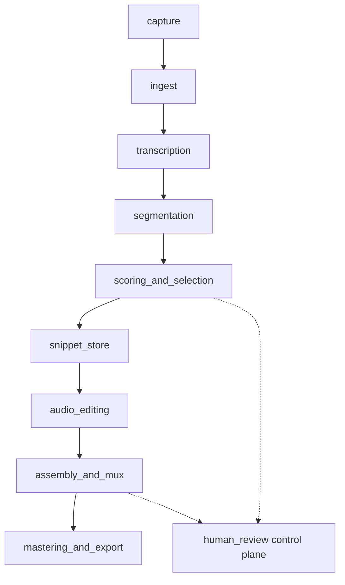

# interview_helper_mux

Turn **one long interview recording** into analyzable text, ranked segments, optional edits, and a **muxed podcast-style master**—for **personal, single-operator** use. You work from **audio + transcripts + manifests**, not by re-interviewing, unless you explicitly add synthetic voice lines later.

**`docs/` is the source of truth** for product behavior, pipeline vocabulary, and end-to-end presets. The repo ships **Python for presets A–E**: file-backed secrets, cloud adapters, SQLite **`mux_store`**, `pipeline/` runners, and CLIs under `tools/`. Presets **F–K** remain docs-only.

---

## Overview

| | |
|--|--|
| **North star** | Re-order, trim, bridge, process, and master using information already in the recording and its derivatives. |
| **Doc corpus** | ~57 Markdown files under `docs/` (execution, pipeline, workflows, versions, cross-cutting), indexed in SQLite via `tools/sync_to_sqlite.py`. |
| **Code today** | Config + secrets, OpenAI / AWS / ElevenLabs adapters, `mux_store`, `pipeline/` (ingest → STT → segment → rank → mux → DSP), `tools/run_*.py`. |
| **Local media** | `ASSETS/` (gitignored) holds operator waveforms for experiments; pointers belong in `mux_store` `asset` rows, not BLOBs in SQLite. |
| **Where to start** | Complete **Steps 1–5** in [SETUP.md](SETUP.md) before production (Step 6+) · [docs/INDEX.md](docs/INDEX.md) |

---

## Maturity phases

There is no separate “Phase 2” folder in the tree; progress is best read as **layers**:

| Phase | Status | What exists |
|-------|--------|-------------|
| **1 — Spec & vocabulary** | **Done (living docs)** | Full pipeline stage READMEs, workflow patterns, low/high-risk tiers, execution archetypes **A–K**, segment schema, evaluation metrics. Front matter on many leaves (`id`, `tier`, `status`, `depends_on`). |
| **2 — Canonical store** | **Done (foundation)** | `db/schema.sql`, `db/seed_pipeline_stages.sql`, `db/python/mux_store/` (`init_db`, Markdown sync, FTS5, `execution_run` / `asset` / `segment` / `edl_clip` tables). Default DB: `data/interview_mux.sqlite` (gitignored). |
| **3 — Integrations** | **Early** | `mux_secrets`, `openai_mux` (SDK 2.x gate, prompts, LLM ranking), `aws_mux` (**AWS CLI** only), `elevenlabs_mux` (client stub). Smoke scripts under `tools/`. |
| **4 — Pipeline runners** | **A–E scaffold** | `pipeline/` ingest, STT, segmentation, mux, DSP; CLIs under `tools/run_*.py`. See [AGENTS.md](AGENTS.md). |

Git history matches this: initial ideas → doc expansion → SQLite/integrations → local `ASSETS/` for test audio.

---

## Technologies in use

| Layer | Stack |
|-------|--------|
| **Language** | Python **3.12** (native **arm64** on Apple Silicon; see [SETUP.md](SETUP.md)) |
| **Database** | SQLite 3 + FTS5 (`doc_search`), WAL, foreign keys |
| **Config** | `config/app.defaults.json`, `config/secrets/secrets.env` (gitignored), templates under `config/templates/` |
| **OpenAI** | `openai` SDK **2.x** — chat completions, JSON ranking (`openai_mux.rank_segments_by_rubric`) |
| **AWS** | **AWS CLI v2** — subprocess + JSON (`aws_mux`); S3 / Transcribe via `aws` commands |
| **ElevenLabs** | `elevenlabs` SDK — TTS / voice (wired for smoke; dub archetype **K** in docs) |
| **Planned (docs only)** | ffmpeg-style cuts, optional YOLO11 on spectrograms, Wav2Vec embeddings, speech-to-speech, custom rankers—see [docs/execution/](docs/execution/) |

Full install and verification: **[SETUP.md](SETUP.md)** (`.venv`, single `requirements.txt`, gate scripts, pytest).

Quick path (Apple Silicon):

```bash
eval "$(/opt/homebrew/bin/brew shellenv)"
brew install ffmpeg python@3.12
export PYTHON=/opt/homebrew/bin/python3.12
./scripts/bootstrap_venv.sh
cp config/templates/secrets.env.example config/secrets/secrets.env   # edit keys
source .venv/bin/activate
python tools/check_env.py
pytest -q
```

Confirm `uname -m` is **arm64** before bootstrapping. See [SETUP.md](SETUP.md) Step 0 if pytest fails with `pydantic_core` architecture errors.

Details: [config/README.md](config/README.md), [db/README.md](db/README.md).

---

## Pipeline backbone (all stories)

Single ordered DAG; human review is a **control plane** (ordinal 1000), not duplicate physics:

```text
capture → ingest → transcription → segmentation → scoring_and_selection
  → snippet_store → audio_editing → assembly_and_mux → mastering_and_export
```

Seeded in `db/seed_pipeline_stages.sql`; stage docs under [docs/pipeline/](docs/pipeline/). Optional enrichments (e.g. spectrogram YOLO, Wav2Vec) attach **after ingest** and feed scoring/mux only—see [docs/execution/spectrogram-yolo-wav2vec-orchestration.md](docs/execution/spectrogram-yolo-wav2vec-orchestration.md).

---

## Product tiers & end-to-end presets

**Versions** ([docs/versions/](docs/versions/)): **low-risk** (single STT, heuristics + optional one LLM rank, linear mux) vs **high-risk** (multi-provider STT, ensembles, S2S, custom models, graph mux). Matrix: [docs/versions/capability-matrix.md](docs/versions/capability-matrix.md).

**Execution archetypes** ([docs/execution/complexity-ladder-end-to-end-ideas.md](docs/execution/complexity-ladder-end-to-end-ideas.md)) — each is a shippable “one button” vertical slice:

| # | Preset | One-line idea |
|---|--------|----------------|
| A | Highlight reel | STT → top-N chunks → crossfade → loudness |
| B | Chapter podcast | Linear + auto chapter metadata |
| C | Director’s cut | Timeboxed segment selection under diversity rules |
| D | Nonlinear story | Graph EDL, flashbacks, edge-cost search |
| E | Room and breath polish | DSP, denoise, adaptive bridges |
| F | Bilingual / code-switch | Per-span locale STT + careful boundaries |
| G | S2S same words | Neural re-render aligned to transcript |
| H | Custom ranker + acoustic | Fine-tuned scoring / voice models |
| I | Spectrogram YOLO overlay | Hazard labels for mux edge costs |
| J | Wav2Vec continuity | Embeddings for dedup / reorder hints |
| K | Full localized dub | MT + guard rails + voice clone → new-language master |

Conformance (min components, skips, library gaps): [docs/execution/orchestration-component-map.md](docs/execution/orchestration-component-map.md).

**Orchestration principles** (summary): frozen backbone with parameterized tools; presets not ad-hoc stages; difficult joins as first-class edge costs; [high-risk first-use gating](docs/execution/high-risk-first-use-gating.md); automation via prompts ([docs/execution/automation-and-prompt-orchestration.md](docs/execution/automation-and-prompt-orchestration.md)).

---

## Repository layout

```text
interview_helper_mux/
├── README.md
├── ASSETS/                        ← gitignored local waveforms (operator experiments)
├── config/
│   ├── app.defaults.json          ← default SQLite path, etc.
│   ├── templates/                 ← secrets.env.example, app.defaults template
│   └── secrets/                   ← gitignored API keys (see config/README.md)
├── ai/python/
│   ├── mux_secrets/               ← load_repo_config() (in-memory only)
│   ├── openai_mux/                ← client, prompts, rank_segments_by_rubric
│   ├── aws_mux/                   ← AWS CLI subprocess
│   └── elevenlabs_mux/            ← ElevenLabs client
├── db/
│   ├── schema.sql                 ← DDL + FTS5
│   ├── seed_pipeline_stages.sql
│   └── python/mux_store/          ← connect, init_db, sync docs, runtime helpers
├── data/                          ← default *.sqlite (gitignored); .gitkeep tracked
├── tools/                         ← sync_to_sqlite.py, *\_smoke.py
├── requirements.txt               ← full pip stack + editable install
└── docs/
    ├── INDEX.md
    ├── execution/                 ← presets A–K, mux difficulty, gating, S2S, dub
    ├── pipeline/                  ← capture … mastering + human-review-ui
    ├── workflows/                 ← loops, idempotency, overrides
    ├── versions/                  ← low-risk vs high-risk
    └── cross-cutting/             ← segment schema, metrics
```

Heavy binaries, secrets, generated audio, and SQLite files stay **out of git** (see `.gitignore`). An empty top-level `mux_secrets/` directory may exist from an early layout; the **canonical** secrets package is `ai/python/mux_secrets/`.

---

## What code does today

| Capability | Location | Notes |
|------------|----------|--------|
| Load secrets (no `os.environ` mutation) | `ai/python/mux_secrets/` | Merges optional `openai.env` then `secrets.env` |
| LLM segment ranking | `openai_mux.rank_segments_by_rubric` | [docs/pipeline/scoring-and-selection/llm-assisted-ranking.md](docs/pipeline/scoring-and-selection/llm-assisted-ranking.md) |
| Prompts | `ai/python/openai_mux/prompts/` | Index: `PROMPTS_EXECUTION.txt` |
| Init DB + sync docs | `tools/sync_to_sqlite.py`, `mux_store` | Imports `docs/**` + root README into `doc_source` + FTS |
| Pipeline runners | `pipeline/`, `tools/run_*.py` | Presets A–E; see [SETUP.md](SETUP.md) |
| Run ledger | `execution_run`, `run_event`, `asset`, … | Used by ingest/STT/preset orchestrators |
| Connectivity checks | `tools/*_smoke.py` | Requires `pip install -r requirements.txt` |

---

## Documentation map

| Area | Role |
|------|------|
| [docs/execution/](docs/execution/) | Whole-product stories, archetype conformance, difficult mux, automation, gating |
| [docs/pipeline/](docs/pipeline/) | Per-stage mechanics (capture through export + human review UI) |
| [docs/workflows/](docs/workflows/) | Feedback loops, idempotent runs, parallel candidates, overrides |
| [docs/versions/](docs/versions/) | Low-risk vs high-risk capability posture |
| [docs/cross-cutting/](docs/cross-cutting/) | Shared segment schema and evaluation metrics |

Read order suggested in [docs/README.md](docs/README.md): execution map → versions → pipeline → workflows → cross-cutting.

---

## Architecture (condensed)



`pipeline/` aligns with `docs/pipeline/` for presets A–E; higher presets (F–K) remain spec-only.
