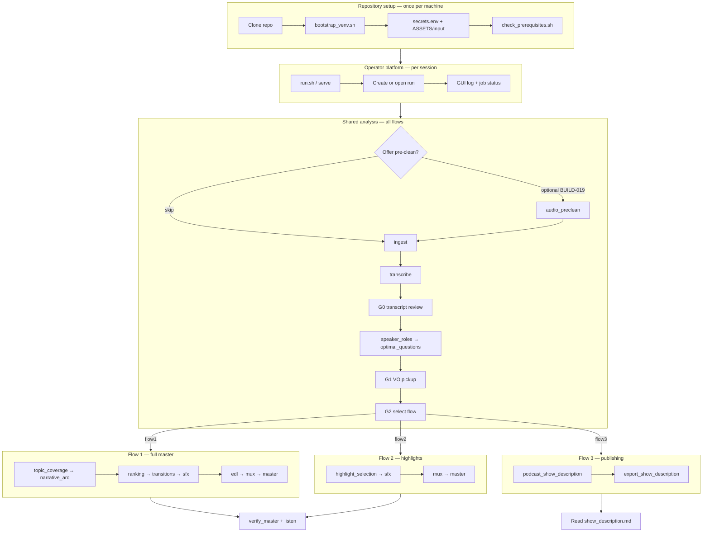

# Full application flow

End-to-end journey: **operator actions**, **system stages**, **gates**, **artifacts**, and **CLI/GUI entry points**. Use with [stage-registry.md](./stage-registry.md) for per-stage detail.

---

## Lifecycle overview

---

## Operator journey (happy path)

| Step | Operator does | System runs | Gate / artifact |
|------|---------------|-------------|-----------------|
| 1 | Place `interview.wav` in `ASSETS/input/` | — | — |
| 2 | `./scripts/run.sh` | FastAPI + static UI | `ASSETS/.gui/session.json` |
| 3 | New run from GUI | Creates `ASSETS/executions/exec_*/` | `run_meta.json` |
| 4 | Optional: accept pre-clean offer | `audio_preclean` *(planned)* | `preclean/isolated.wav` |
| 5 | Execute **analysis** (or step through stages) | `ingest` → … → `optimal_questions` | `.stage_done/*` |
| 6 | **G0:** Review ranked STT clips | `transcript_review` completes | `transcript/corrections.json` |
| 7 | Edit interview profile (optional) | — | `analysis_state.json` |
| 8 | Continue analysis if paused at G0 | Remaining analysis stages | `analysis_complete.json` |
| 9 | **G1:** Record pickup lines | `vo_ingest` when re-run | `vo_pickup/*.wav` |
| 10 | Optional: clean new VO only | pickup-scoped pre-clean *(planned)* | — |
| 11 | **G2:** Choose flow1, flow2, or flow3 | `set_selected_flow` | `run_meta.selected_flow` |
| 12 | Execute flow | Flow-specific stages | `flow_*/*` outputs |
| 13 | Listen / export | — | `master.wav` or `show_description.md` |
| 14 | QA | `verify_master.py` *(audio flows)* | pass/fail in log |

**Mandatory gates:** G0, G1 (when gaps require record), G2. Details: [operator-gates.md](../workflows/operator-gates.md).

**Optional quality offers** (never blocking): pre-clean at checkpoints — [podcast-quality-roadmap.md](../cross-cutting/podcast-quality-roadmap.md).

---

## CLI entry points

| Command | When | Doc |
|---------|------|-----|
| `./scripts/bootstrap_venv.sh` | First setup | [SETUP.md](../../SETUP.md) |
| `./tools/check_prerequisites.sh` | After env change | [anchored-toolchain.md](../cross-cutting/anchored-toolchain.md) |
| `python tools/run_analysis.py [--run-id] [--from-stage]` | Shared analysis | [analysis-orchestration-loop.md](../workflows/analysis-orchestration-loop.md) |
| `python tools/run_flow.py --flow flow1\|flow2\|flow3` | After G2 | [smoke-test.md](../workflows/smoke-test.md) |
| `python tools/verify_master.py <wav>` | After flow1/2 master | [evaluation-metrics.md](../cross-cutting/evaluation-metrics.md) |
| `python -m interview_mux serve` | Web GUI | [gui-surface-map.md](../workflows/gui-surface-map.md) |

**GUI equivalent:** `POST /api/runs/{id}/execute` with `mode`: `analysis` \| `flow1` \| `flow2` \| `flow3` *(flow3 when BUILD-080 ships)* \| `stage`.

---

## Shared analysis stage order

Matches `ANALYSIS_ORDER` in `src/interview_mux/pipeline.py`:

1. `ingest`
2. `transcribe`
3. `transcript_review_build` → **pause for G0** → `transcript_review`
4. `speaker_roles`
5. `content_context`
6. `boundary_detection`
7. `segment_classification`
8. `missing_framing`
9. `optimal_questions` → may **pause for G1**
10. `vo_ingest` (after operator records pickup)

**Orchestrator:** LLM stages drain `investigation_queue` — [analysis-orchestration-loop.md](../workflows/analysis-orchestration-loop.md).

---

## Flow 1 stage order (after G2 = flow1)

1. `topic_coverage_audit`
2. `narrative_arc_plan`
3. `full_master_ranking`
4. `transitions`
5. `podcast_sfx_brief` *(v1; superseded by SDP — BUILD-060+)*
6. `elevenlabs_sfx_flow1`
7. `edl_flow1`
8. `mux_flow1` *(target: `mix_flow1` — BUILD-065)*
9. `master_flow1`

**Planned inserts:** `assembly_preview` (BUILD-069); `sound_design_*` stages (BUILD-061–064) before mix.

---

## Flow 2 stage order (after G2 = flow2)

1. `highlight_selection`
2. `sfx_brief`
3. `elevenlabs_sfx_flow2`
4. `mux_flow2`
5. `master_flow2`

---

## Flow 3 stage order (after G2 = flow3) — planned

1. `podcast_show_description`
2. `export_show_description`

No mastering. Output: `flow_3_description/show_description.json` + `.md`.

---

## Run workspace layout

Per run under `ASSETS/executions/exec_*` (or legacy `data/run_*`):

| Path | Created by |
|------|------------|
| `run_meta.json` | Run creation, G2 |
| `gui_log.jsonl` | All operator-visible events |
| `gui_job.json` | Background execute |
| `.stage_done/<stage>` | Each completed stage |
| `ingest/`, `transcript/`, `understanding/`, `segments/` | Shared analysis |
| `vo_pickup/` | Operator + G1 |
| `flow_1_master/`, `flow_2_highlights/`, `flow_3_description/` | After G2 |

Full tree: [artifact-layout.md](../cross-cutting/artifact-layout.md).

---

## Failure and rerun loops

| Situation | Action | Doc |
|-----------|--------|-----|
| Stage failed mid-pipeline | `--from-stage <id>` | [idempotent-runs.md](../workflows/idempotent-runs.md) |
| Wrong STT after analysis | Re-open G0, rerun from `speaker_roles` | [feedback-loops-and-reruns.md](../workflows/feedback-loops-and-reruns.md) |
| Switched flow at G2 | New `selected_flow`; avoid mixing flow dirs | [operator-stage-checklists.md](../workflows/operator-stage-checklists.md) |
| Symptom unknown | [troubleshooting.md](../workflows/troubleshooting.md) | — |

---

## Target state vs v1 (what “successful app” means)

| Capability | v1 today | Target |
|------------|----------|--------|
| Three flows runnable | flow1 + flow2 only | + flow3 (BUILD-080) |
| G2 API | flow1 \| flow2 | + flow3 |
| Flow 1 master | Speech-only concat | VO + SFX mix (BUILD-065–067) |
| Flow 2 montage | Index-based SFX | Shared transition asset (BUILD-065) |
| Master QA | ffprobe | LUFS + true peak (BUILD-070) |
| LLM routing | Single model per stage | Arbiter + tiers (BUILD-073) |
| Pre-clean | Spec only | Offers at checkpoints (BUILD-019, 072) |

Track progress in [steps-forward.md](./steps-forward.md) and [repository-map.md](./repository-map.md).

---

## Related

- [implementation-guide.md](./implementation-guide.md) — phased build plan
- [stage-registry.md](./stage-registry.md) — complete stage table
- [pipeline.md](../pipeline.md) — flow comparison
