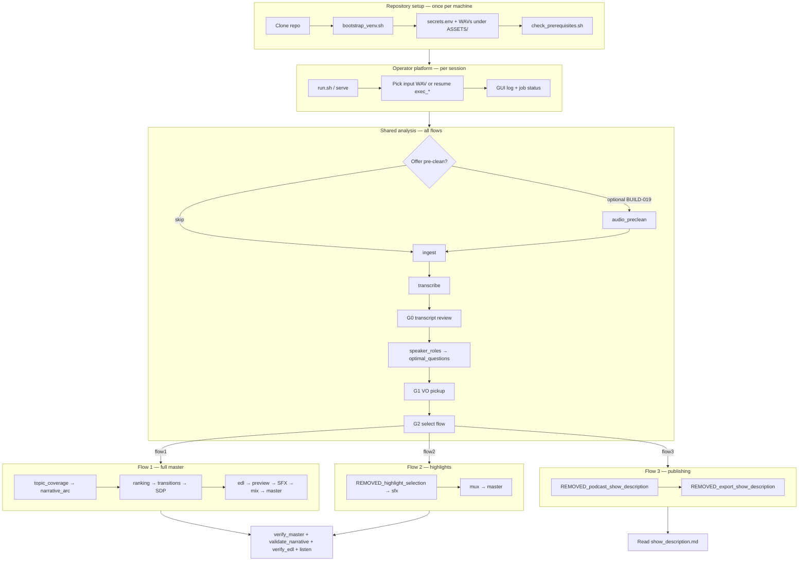
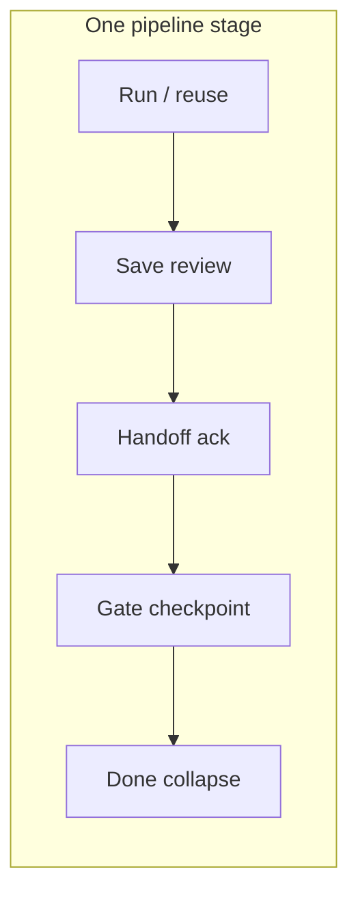

# Full application flow

End-to-end journey: **operator actions**, **system stages**, **gates**, **artifacts**, and **CLI/GUI entry points**. Use with [stage-registry.md](./stage-registry.md) for per-stage detail.

---

## Lifecycle overview

---

## Operator journey (happy path)

| Step | Operator does | System runs | Gate / artifact |
|------|---------------|-------------|-----------------|
| 1 | Place one or more `.wav` files under `ASSETS/` (recommended: `ASSETS/input/`) | — | — |
| 2 | `./scripts/run.sh` | FastAPI + static UI; reconciles stale `gui_job.json` | `ASSETS/.gui/server_session.json` |
| 2b | Browser load / refresh | `GET /api/session` → restore run, tab, stage | `ASSETS/.gui/active_execution.json` |
| 3a | **New:** pick file in **Input audio** (home) | `POST /api/runs` → `ASSETS/executions/exec_NNN_<hash12>_TIMESTAMP/` | `run_meta.json` (`input_audio_path`, `source_audio_hash`) |
| 3b | **Resume:** pick row in **Previous executions** | `PUT /api/session/active` | same `exec_*` folder; logs + `.stage_done` intact |
| 4 | Optional: accept pre-clean offer | `audio_preclean` | `preclean/isolated.wav` |
| 5 | Execute **analysis** (or step through stages) | `ingest` → … → `optimal_questions`; optional reuse per stage; write approval when enabled | `.stage_done/*` under same `exec_*` (markers deferred until approve when staging on) |
| 6 | **G0:** Review ranked STT clips (dock word edits + optional fuzzy batch replace) | `transcript_review` completes | `transcript/corrections.json`, `transcript/full.json` (`corrected` words) |
| 7 | Edit interview profile (optional) | — | `analysis_state.json` |
| 8 | Continue analysis if paused at G0 | Remaining analysis stages | `analysis_complete.json` |
| 9 | **G1:** Record pickup lines | `vo_ingest` when re-run | `vo_pickup/*.wav` |
| 10 | Optional: clean new VO only | pickup-scoped pre-clean (`vo_pickup` scope, BUILD-019 + BUILD-072) | `vo_pickup/clean/*.wav` |
| 11 | **G2:** Choose flow1, flow2, or flow3 | `set_REMOVED_selected_flow` | `run_meta.REMOVED_selected_flow` |
| 12 | Execute flow | Flow-specific stages | `flow_*/*` outputs |
| 13 | Listen / export | — | `master.wav` or `show_description.md` |
| 14 | QA | `verify_master.py`, `validate_narrative.py --include-edl`, `verify_edl.py` *(Flow 1 schema)* | pass/fail in log |

**Mandatory gates:** G0, G1 (when gaps require record), G2. Details: [operator-gates.md](../workflows/operator-gates.md).

### Substep loop (GUI)

Within each pipeline stage the operator follows **substeps** (sidebar rows under the stage):

1. **Run** automated stage (or accept reuse offer)
2. **Save review** when write approval is enabled (`.pending_writes/`)
3. **Handoff** skim when LLM JSON handoff applies
4. **Gate** checkpoint (G0, G0.5, profile, G1, G2, SFX) when `action_required`
5. Stage collapses with **Step complete** banner; focus advances via `journey.active_substep_id`

**GUI feedback:** Every substep and primary CTA follows [gui-flow-hardening.md](../workflows/gui-flow-hardening.md) — no silent blocked clicks; job terminals toast; checkpoint saves call `advanceFromCheckpoint()`.

**Optional quality offers** (never blocking): pre-clean before ingest and after G1 pickup — [podcast-quality-roadmap.md](../cross-cutting/podcast-quality-roadmap.md).

---

## CLI entry points

| Command | When | Doc |
|---------|------|-----|
| `./scripts/bootstrap_venv.sh` | First setup | [SETUP.md](../../SETUP.md) |
| `./tools/check_prerequisites.sh` | After env change | [anchored-toolchain.md](../cross-cutting/anchored-toolchain.md) |
| `python tools/run_analysis.py [--run-id] [--from-stage]` | Shared analysis | [analysis-orchestration-loop.md](../workflows/analysis-orchestration-loop.md) |
| `python tools/run_delivery.py --flow flow1\|flow2\|flow3` | After G2 | [smoke-test.md](../workflows/smoke-test.md) |
| `python tools/verify_master.py <wav>` | After flow1/2 master | [evaluation-metrics.md](../cross-cutting/evaluation-metrics.md) |
| `python tools/validate_narrative.py --run-id <id> --include-edl` | Flow 1 upstream + EDL narrative QC | [evaluation-metrics.md](../cross-cutting/evaluation-metrics.md) |
| `python tools/validate_edl.py --run-id <id>` | Flow 1 EDL timeline validation | [evaluation-metrics.md](../cross-cutting/evaluation-metrics.md) |
| `python tools/verify_edl.py --run-id <id>` | Flow 1 EDL schema validation | [json-schema-coverage.md](../cross-cutting/json-schema-coverage.md) |
| `python -m interview_mux serve` | Web GUI | [gui-surface-map.md](../workflows/gui-surface-map.md) |

**GUI equivalent:** `POST /api/runs/{id}/execute` with `mode`: `analysis` \| `flow1` \| `flow2` \| `flow3` \| `stage`.

---

## Shared analysis stage order

Matches `ANALYSIS_ORDER` in `src/interview_mux/pipeline.py`:

1. `audio_preclean` *(optional)*
2. `ingest`
3. `transcribe`
4. `transcript_review_build` → **pause for G0** → `transcript_review`
5. `source_acoustic_profile`
6. `speaker_roles`
7. `content_context` — pass 1: thesis, topics, typed claims, open hypotheses
8. `boundary_detection`
9. `segment_classification`
10. `content_brief_reanchor` — pass 2: `segment_ids`, `topic_relationships`, confirm/reject hypotheses
11. `sound_design_palettes`
12. `missing_framing`
13. `optimal_questions` → may **pause for G1**
14. `vo_ingest` *(after operator records pickup; not in `ANALYSIS_ORDER` but callable)*

**Orchestrator:** LLM stages drain `investigation_queue` — [analysis-orchestration-loop.md](../workflows/analysis-orchestration-loop.md).

---

## Flow 1 stage order (after G2 = flow1)

1. `topic_coverage_audit`
2. `narrative_arc_plan`
3. `full_master_ranking`
4. `transitions`
5. `sound_design_plan`
6. `sound_design_vo_finalize`
7. `edl_narrative_audit`
8. `edl`
9. `assembly_preview`
10. `sfx_prompt_craft`
11. `mmaudio_sfx`
12. `mix`
13. `master_finalize`

**v1 legacy:** `podcast_sfx_brief` and `mux_flow1` remain available as single-stage reruns but are not in `DELIVERY_ORDER`.

---

## Flow 2 stage order (after G2 = flow2)

1. `REMOVED_highlight_selection`
2. `REMOVED_sdp_flow2`
3. `sfx_prompt_craft`
4. `REMOVED_mmaudio_flow2`
5. `REMOVED_mix_flow2` *(legacy alias: `mux_flow2` for single-stage rerun)*
6. `REMOVED_master_flow2`

**v1 legacy:** `sfx_brief` remains available as a single-stage rerun (`run_single_stage`) but is not in `REMOVED_FLOW2_ORDER`.

---

## Flow 3 stage order (after G2 = flow3) — **shipped**

1. `REMOVED_podcast_show_description`
2. `REMOVED_export_show_description`

No mastering. Output: `show_notes/show_description.json` + `.md`.

---

## Run workspace layout

Per run under `ASSETS/executions/exec_*` (or legacy `data/run_*`). Full ASSETS conventions: [assets-and-executions.md](../cross-cutting/assets-and-executions.md).

| Path | Created by |
|------|------------|
| `run_meta.json` | Run creation, G2 |
| `gui_log.jsonl` | All operator-visible events |
| `gui_job.json` | Background execute |
| `.stage_done/<stage>` | Each completed stage |
| `ingest/`, `transcript/`, `understanding/`, `segments/` | Shared analysis |
| `vo_pickup/` | Operator + G1 |
| `master/`, `REMOVED_flow2/`, `show_notes/` | After G2 |

Full tree: [artifact-layout.md](../cross-cutting/artifact-layout.md).

---

## Failure and rerun loops

| Situation | Action | Doc |
|-----------|--------|-----|
| Stage failed mid-pipeline | `--from-stage <id>` | [idempotent-runs.md](../workflows/idempotent-runs.md) |
| Wrong STT after analysis | Re-open G0, rerun from `speaker_roles` | [feedback-loops-and-reruns.md](../workflows/feedback-loops-and-reruns.md) |
| Switched flow at G2 | New `REMOVED_selected_flow`; avoid mixing flow dirs | [operator-stage-checklists.md](../workflows/operator-stage-checklists.md) |
| Symptom unknown | [troubleshooting.md](../workflows/troubleshooting.md) | — |

---

## Shipped capabilities vs optional follow-ups

| Capability | Shipped | Optional follow-ups |
|------------|---------|---------------------|
| Three flows runnable | flow1, flow2, flow3 (`run_delivery/2/3`, BUILD-080) | — |
| G2 API | flow1 \| flow2 \| flow3 (`gates.py`, `server.py`) | — |
| Flow 1 master | VO + SFX mix via `mix` (BUILD-065–067) plus extended EDL narrative validators | — |
| Flow 2 montage | `REMOVED_mix_flow2` + SDP transitions (BUILD-065–066) | Cold-open polish |
| Master QA | LUFS + true peak (`verify_master`, BUILD-070–071) | — |
| Narrative QC | Topic + chapter checks plus final EDL semantics (`validate_narrative --include-edl`) | — |
| LLM routing | Tier registry + arbiter + shard/collate (BUILD-073) | — |
| Pre-clean | `audio_preclean` + GUI offers (BUILD-019, 072); never auto | New checkpoint wiring only |

Release sign-off: [definition-of-done-signoff.md](./definition-of-done-signoff.md). Open build work: [remaining-build-commands.md](./remaining-build-commands.md).

---

## Related

- [assets-and-executions.md](../cross-cutting/assets-and-executions.md) — ASSETS layout, input picker, execution resume
- [implementation-guide.md](./implementation-guide.md) — phased build plan
- [stage-registry.md](./stage-registry.md) — complete stage table
- [pipeline.md](../pipeline.md) — flow comparison
