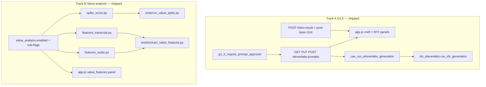

# G1.5 + Value-Analysis — execution guide (remaining work)

**Purpose:** Track **optional** follow-ups only. Core G1.5 wiring and value-analysis tooling are **shipped** on this branch.

**Constraints (unchanged):**
- Do **not** add value-analysis stages to default [`pipeline.py`](../../src/interview_mux/pipeline.py) order.
- G1.5: `g1_5_require_prompt_approval` (default `false`).
- Value-analysis: `value_analysis.*` (default all off).

**Enable locally:** set `g1_5_require_prompt_approval: true` and/or `value_analysis.enabled: true` in `config/app.defaults.json` (or secrets overlay).

---

## Your execution list (remaining)

| Command | Status | Action |
|---------|--------|--------|
| **A5** — Post-listen log hook | **Shipped** | `POST /api/runs/{run_id}/elevenlabs-prompts/listen-result` → `run_meta.elevenlabs_listen_results[]` |
| **B5** — GUI value_features panel | **Shipped** | Read-only panel on `content_context` when `value_analysis.enabled` (`app.js`) |
| **Command 5** — Post-listen GUI | **Shipped** | Pass/Fail + optional note on `elevenlabs_prompt_craft` and `elevenlabs_sfx_flow*` panels (`app.js`) |

Everything else from the original guide is **done** — see [Shipped checklist](#shipped-checklist) below.

---

## Architecture (shipped)

---

## Shipped checklist

### Track A — G1.5 (complete)

| File | Role |
|------|------|
| `src/interview_mux/g15_prompt_review.py` | Gate + validation + SDP warnings |
| `src/interview_mux/stages/sfx_elevenlabs.py` | Calls `require_elevenlabs_generation` |
| `src/interview_mux/web/runner.py` | Pre-flight before SFX stages |
| `src/interview_mux/web/server.py` | GET/PUT/POST hardened (`warnings`, schema on PUT); **POST listen-result** |
| `src/interview_mux/web/static/app.js` | Craft review panel; **post-listen** Pass/Fail on craft + SFX stages; log refresh via `refreshRun` / `pollLog` |
| Docs | `operator-gates.md`, `gui-surface-map.md`, checklists, troubleshooting, `sound-design.md`, guardrails |

### Track B — Value-analysis (complete)

| File | Role |
|------|------|
| `config/app.defaults.json` + template | `value_analysis` block |
| `src/interview_mux/value_analysis/config.py` | `value_analysis_enabled`, `value_analysis_flag` |
| `src/interview_mux/value_analysis/spike_score.py` | Rubric aggregation |
| `src/interview_mux/value_analysis/features_transcript.py` | Transcript metrics |
| `src/interview_mux/value_analysis/features_audio.py` | Audio metrics |
| `tools/run_value_spike.py` | Spike CLI |
| `tools/extract_value_features.py` | Features CLI |
| `src/interview_mux/value_analysis/extract.py` | Shared extract + optional post-`content_context` hook |
| `src/interview_mux/web/static/app.js` | Read-only **value_features** panel on `content_context` when enabled |
| `docs/cross-cutting/json-schemas/value_features.schema.json` | Artifact shape |
| `tests/fixtures/value_analysis/spike_flow1_sound.json` | Example scorecard |
| Docs | `value-analysis/README.md`, `future-proofing.md`, `flow1-sound-and-mix.md`, `spike-results-and-winners.md` (fixture row) |

### Config keys

| Key | Default | Effect |
|-----|---------|--------|
| `g1_5_require_prompt_approval` | `false` | When `true`, block ElevenLabs SFX until GUI approve |
| `value_analysis.enabled` | `false` | Master switch for VA tools + GUI panel |
| `value_analysis.spike_scoring` | `true` | Allow `run_value_spike.py` when enabled |
| `value_analysis.transcript_features` | `true` | Transcript profile in extractor |
| `value_analysis.audio_features` | `false` | Audio profile in extractor |
| `value_analysis.auto_extract_after_content_context` | `false` | After successful `content_context`, auto-write `understanding/value_features.json` (transcript and/or audio per sub-flags) |

Documented in [config-keys.md](../cross-cutting/config-keys.md).

---

## Out of scope (this guide)

- Pytest / CI coverage (later)
- Default pipeline stages for value-analysis
- CLAP / SSL / new ML dependencies
---

## Related

- [remaining-build-commands.md](./remaining-build-commands.md) — **current Agent queue**
- [value-analysis/README.md](../pipeline/value-analysis/README.md) — rubrics and tooling flags
- [elevenlabs-integration-guide.md](../cross-cutting/elevenlabs-integration-guide.md) — G1.5 operator journey
