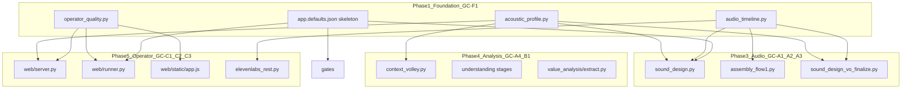

# Gap closure agent commands — optimized execution sequence

**Purpose:** Copy-paste **one command per Agent chat** to close gaps between shipped BUILD waves and operator-ready quality (sections #2 / #5 in [steps-forward.md](./steps-forward.md)). Covers shared foundation modules, SAP-driven mix, operator gates, integration tests, and Phase 6 quality follow-up.

**ONE COMMAND PER AGENT CHAT:** Run exactly one GC-* or Phase 6 command per Cursor Agent session. Do not batch F1 + F2, or Q1 + Q2, in a single chat.

**CODE FIRST, TEST ONCE:** Each command implements production code (and test files where specified). **Do not run pytest between commands.** When the agent finishes a command, open the next chat immediately. Run the **[final verification](#final-verification-run-once-after-all-commands)** block only after **all** Phase 6 commands (1–13) are complete.

**Status (original program):** **GC-00 through GC-D1 are shipped** in code and tests (`pytest tests/ -q` green as of gap-closure completion).

**Status (quality follow-up):** **Phase 6 (Commands 1–13) is complete** — doc sweep (Command 13) landed; run **[final verification](#final-verification-run-once-after-all-commands)** once if not already done.

### How to use

1. Run **Step 0** (shell only — no Agent chat) once if `.venv/` is missing.
2. Open **Agent mode** in Cursor.
3. Copy the **Agent prompt** for the next command; `@`-attach listed docs.
4. When the agent finishes, **immediately** start the next command — no pytest, no manual checks in between.
5. After Command 13 (or when all code commands are done), run **[Final verification](#final-verification-run-once-after-all-commands)** once.
6. Fix any test failures in a follow-up Agent chat if needed.

**Always-on:** `.cursor/rules/interview-helper-mux.mdc` · [AGENTS.md](../../AGENTS.md)

### Automation (optional)

Run Phase 6 commands sequentially via the isolated [CURSOR_EXECUTE](../../CURSOR_EXECUTE/) runner (Cursor SDK; own `.venv`):

```bash
export CURSOR_API_KEY="cursor_..."
./CURSOR_EXECUTE/run.sh docs/build-out/gap-closure-agent-commands.md --from 1 --to 13
```

Dry-run (parse + prompt sizes, no API): add `--dry-run`. Historical GC-00–GC-D1 blocks: add `--include-legacy-gc`. See [CURSOR_EXECUTE/README.md](../../CURSOR_EXECUTE/README.md).

### Where to begin

| Start here | Why |
|------------|-----|
| **[Step 0](#step-0--bootstrap-virtual-environment-required)** | One-time venv setup before the command run |
| **[Command 1](#command-1--gc-q1-complete-gc-t1-gaps-smoke-fixture--chunk-test)** | First Agent command — then continue 2 → 3 → … → 13 without testing |

Do **not** re-run GC-00–GC-D1 unless fixing a regression. Run Phase 6 **sequentially** (1 through 13); skip Command 13 only if you defer doc updates.

### Phase 6 command index

Run **1 → 2 → 3 → … → 13** in order. Each command depends on the previous one completing (code landed); no pytest between steps.

| # | ID | Title |
|---|-----|-------|
| **0** | — | Bootstrap virtual environment (shell) |
| **1** | GC-Q1 | Smoke fixture + chunk test |
| **2** | GC-Q2 | Flow 2 SAP on `sfx_brief` |
| **3** | GC-Q3 | SAP prompt one-liners |
| **4** | GC-Q4 | Recompute SAP auto-invalidate |
| **5** | GC-Q6 | Artifact boundary validators |
| **6** | GC-Q7 | Full-flow preclean job banner |
| **7** | GC-Q8 | Pause-aligned stinger placement |
| **8** | GC-Q9 | Post-mix intelligibility QC |
| **9** | GC-Q10 | Specialists pilot (one stage) |
| **10** | GC-Q11 | SAP GUI `operator_overrides` |
| **11** | GC-Q12 | EDL-level narrative QC |
| **12** | GC-Q13 | G1 pickup preclean product polish |
| **13** | GC-Q-DOC | Doc drift sweep (optional) |

GC-Q5 is reserved (merged into Commands 4 + 6) — no separate prompt.

### Phase 6 scope (what each command creates — verify once at end)

Baseline before starting (2026-05-29). After all commands complete, the final verification block confirms these exist.

| Command | Code / artifacts to create |
|---------|---------------------------|
| 1 (GC-Q1) | `tests/fixtures/runs/gap_closure_smoke/`, `tests/test_gap_closure_smoke.py`, chunk test in `test_audio_preclean.py` |
| 2 (GC-Q2) | `selection_flow2.py` imports `acoustic_profile`; flow2 SAP in `sfx_brief` build_input |
| 3 (GC-Q3) | `pace_class` / `underscore_policy` in plan-flow1 + podcast-sfx-brief prompts |
| 4 (GC-Q4) | `recompute-acoustic-profile` calls `clear_from` / `invalidate_from` on pace change |
| 5 (GC-Q6) | Extended `ARTIFACT_WRITE_VALIDATORS` for high-risk paths |
| 6 (GC-Q7) | Full-flow `preclean_warnings` in gui_job + GUI amber banner |
| 7 (GC-Q8) | Pause-aligned stinger placement in `sound_design.py` |
| 8 (GC-Q9) | Post-mix intelligibility QC in `master_qc.py` |
| 9 (GC-Q10) | Specialists pilot for `full_master_ranking` only |
| 10 (GC-Q11) | SAP GUI `operator_overrides` API + panel |
| 11 (GC-Q12) | EDL-level narrative QC + `validate_edl` tooling |
| 12 (GC-Q13) | G1 pickup preclean offer on G1 complete |
| 13 (GC-Q-DOC) | Doc drift sweep (optional) |

**Related:** [remaining-build-commands.md](./remaining-build-commands.md) · [stage-registry.md](./stage-registry.md) · [config-keys.md](../cross-cutting/config-keys.md) · [definition-of-done-signoff.md](./definition-of-done-signoff.md)

---

## Architecture — shared foundation (built in GC-F1)



### Module contracts (implement exactly in GC-F1)

| Module | Path | Public API (minimum) | Consumers |
|--------|------|----------------------|-----------|
| **Acoustic profile** | `src/interview_mux/acoustic_profile.py` | `load_profile(ctx) -> dict \| None`, `mix_contract(ctx) -> dict`, `compact_for_volley(profile) -> dict`, `pacing_one_liner(profile) -> str`, `placement_hints(profile) -> dict` | GC-A2, GC-A3, GC-A4, GC-C1 |
| **Audio timeline** | `src/interview_mux/audio_timeline.py` | `wav_duration_ms(path) -> int`, `append_with_crossfade(base, clip, crossfade_ms) -> AudioSegment`, `concat_clips_with_crossfade(clips, crossfade_ms) -> AudioSegment`, `chunk_wav_by_max_bytes(path, max_bytes) -> list[Path]` | GC-A1, GC-A3, GC-C3 |
| **Operator quality** | `src/interview_mux/operator_quality.py` | `PRECLEAN_CHECKPOINTS: frozenset`, `preclean_acknowledged(meta, checkpoint) -> bool`, `record_qc_summary(ctx, key, result)`, `qc_summary(meta, key) -> dict \| None` | GC-F3, GC-C1, GC-C2 |

**Rule for all later commands:** Do not re-implement duration/crossfade/SAP load inline — import from these modules.

---

## Execution phases

Phases 0–5 (GC-00 through GC-D1) are the **original 16-command program** (shipped). Phase 6 is the **quality follow-up** queue — see [Phase 6 status table](#phase-6-status-table).

| Phase | Cmd | Title | Depends on | Status | Deliverable (code) |
|-------|-----|-------|------------|--------|---------------------|
| 0 | **GC-00** | Author command queue doc | — | [x] | Queue file + AGENTS link |
| 1 Foundation | **GC-F1** | Shared foundation modules + defaults skeleton | GC-00 | [x] | `acoustic_profile`, `audio_timeline`, `operator_quality` + test file |
| 1 Schema | **GC-F2** | Schema hardening (fail-fast) | GC-F1 | [x] | Validators + `validate_nle.py` |
| 1 Schema | **GC-F3** | Production defaults + gates qc_summaries | GC-F1 | [x] | Production `app.defaults.json` + gate wiring |
| 2 Audio | **GC-A1** | Speech crossfades | GC-F1 | [x] | Crossfade in mix + assembly preview |
| 2 Audio | **GC-A2** | SAP-driven mix engine | GC-F1, GC-A1 | [x] | SAP duck/stinger policy in mix |
| 2 Audio | **GC-A3** | vo_finalize stage | GC-F1, GC-A2 | [x] | `sound_design_vo_finalize` in FLOW1_ORDER |
| 3 Analysis | **GC-A4** | SAP volley wiring | GC-F1 | [x] | SAP in volley build_input |
| 3 Analysis | **GC-B1** | Value pipeline wiring | GC-F3, GC-A4 | [x] | Value extract + gap volley wiring |
| 4 Operator | **GC-C1** | Recompute SAP API + runner preclean gate | GC-F1, GC-F3, OQ | [x] | Recompute API + runner gate |
| 4 Operator | **GC-C2** | NLE UX + GUI QC panels + before_sfx_spend | GC-F2, GC-F3, GC-C1 | [x] | GUI QC panels + preclean offers |
| 4 Operator | **GC-C3** | ElevenLabs chunk resilience | GC-F1 (audio_timeline) | [x] | Chunk isolation path |
| 5 Tests | **GC-T1** | Integration tests | all above | [x] | Full test suite + smoke fixture |
| 5 Docs | **GC-D1** | Documentation closure | GC-T1 | [x] | Doc sweep |
| 6 | **GC-Q1** | GC-T1 gaps: smoke fixture + chunk test | GC-D1 | [x] | Smoke fixture + test files |
| 6 | **GC-Q2** | Flow 2 SAP on `sfx_brief` | GC-Q1 | [x] | Flow2 SAP wiring |
| 6 | **GC-Q3** | SAP prompt one-liners in `.system.txt` | GC-Q2 | [x] | Prompt `.system.txt` updates |
| 6 | **GC-Q4** | Recompute SAP auto-invalidate | GC-Q1 | [x] | Invalidation on pace change |
| 6 | **GC-Q5** | Recompute + preclean ROI (non-doc) | GC-Q4 | [x] | (merged into Q4 + Q7) |
| 6 | **GC-Q6** | Artifact boundary validators (extend) | GC-Q1 | [x] | Extended validators |
| 6 | **GC-Q7** | Full-flow preclean job banner | GC-Q1 | [x] | GUI preclean warnings |
| 6 | **GC-Q8** | Pause-aligned stinger placement | GC-Q2, GC-A2 | [x] | Pause-aligned stingers |
| 6 | **GC-Q9** | Post-mix intelligibility QC | GC-Q8 | [x] | Intelligibility QC |
| 6 | **GC-Q10** | Specialists pilot (one stage) | GC-Q3 | [x] | Ranking specialist pilot |
| 6 | **GC-Q11** | SAP GUI `operator_overrides` | GC-Q4 | [x] | Override API + GUI |
| 6 | **GC-Q12** | EDL-level narrative QC | GC-Q1 | [x] | EDL QC |
| 6 | **GC-Q13** | G1 pickup preclean product polish | GC-Q7 | [x] | G1 pickup preclean offer |
| 6 | **GC-Q-DOC** | Doc drift sweep (optional) | any | [x] | Doc updates |

**Phase 6 agent queue:** Step 0 (venv, once) + Commands 1–13 in order — see [command index](#phase-6-command-index). **No pytest between commands**; run [final verification](#final-verification-run-once-after-all-commands) once after Command 13.

---

## Exclusions (unchanged for GC-00–GC-D1)

- Alternate STT, NISQA, SSL, CLAP, Demucs, WhisperX, openSMILE
- SQLite, boto3, preset ladder A–E
- Full DAW NLE

**Phase 6 exception:** GC-Q10 may enable `analysis.specialists.enabled` for **one** stage only (`full_master_ranking` pilot) — no new specialist prompts; use existing `docs/prompts/_shared/specialists/*.system.txt`.

---

## Config policy

Single authoritative **[config/app.defaults.json](config/app.defaults.json)** with `_comment_*` section keys:

```json
"_comment_paths": "ASSETS, executions, sample_rate",
"_comment_models": "OpenAI tier routing per stage",
"_comment_mix_engine": "crossfade_ms_*, duck defaults",
"_comment_quality_gates": "G1.5, narrative_qc, show_description_qc, nle_edits.strict, preclean ack",
"_comment_value_analysis": "deterministic extract flags — no SSL",
"_comment_elevenlabs": "upload limits, timeouts, chunk policy",
"_comment_analysis": "volley caps, thresholds",
"_comment_web": "port, GUI behavior flags"
```

- **GC-F1:** structure + **safe** defaults (`strict: false`) until GC-F3 flips production values
- **GC-F3:** flip production values (`strict: true`, `g1_5_require_prompt_approval: true`, `value_analysis.enabled: true`)
- Mirror every change to [config/templates/app.defaults.json](config/templates/app.defaults.json)

---

## Global constraints (every command)

- `.cursor/rules/interview-helper-mux.mdc` + [AGENTS.md](AGENTS.md)
- **Code only during the command run — do not run pytest.** Write test files when the prompt asks; the operator runs tests once at the end.
- Operator-visible strings **only** via `ctx.log()` → `gui_log.jsonl`
- No new ML deps; no `torch` / `transformers`
- Import shared modules from GC-F1 — never duplicate
- Update [docs/cross-cutting/config-keys.md](docs/cross-cutting/config-keys.md) when adding keys
- Same PR doc rule: touch [stage-registry.md](docs/build-out/stage-registry.md) when adding stages
- When a command finishes, **continue to the next command** — no manual verification in between

---

## Final verification (run once after all commands)

Requires **Step 0** complete (`.venv` present). Run this **only after** Phase 6 Commands 1–13 (or after the last code command you intend to ship). Fix failures in a follow-up Agent chat.

```bash
source .venv/bin/activate

pytest tests/ -q
./tools/check_prerequisites.sh
```

---

# Original program agent prompts (GC-00 through GC-D1)

**Convention (all prompts below):** Implement code and test files per deliverable. **Do not run pytest** during the command — continue to the next command; run [final verification](#final-verification-run-once-after-all-commands) once at the end.

---

## GC-00 — Author the command queue file

```text
Create docs/build-out/gap-closure-agent-commands.md — the operator Agent queue for gap closure.

Read:
@.cursor/plans/gap_closure_agent_queue_540bf4ba.plan.md (this plan — all GC-* prompts below)
@docs/build-out/remaining-build-commands.md (format reference)
@AGENTS.md

Deliver:
1. New file docs/build-out/gap-closure-agent-commands.md containing:
   - Purpose, exclusion list (no ML inference), ONE COMMAND PER AGENT CHAT rule
   - Phase diagram (Foundation → Schema → Audio → Analysis → Operator → Tests → Docs)
   - Module contract table (acoustic_profile, audio_timeline, operator_quality)
   - Phase checkpoint bash blocks (single final verification only — no pytest between commands)
   - Full copy-paste Agent prompt for GC-F1 through GC-D1 (verbatim from plan)
   - Status table with [ ] per command
2. Link from docs/build-out/remaining-build-commands.md Related section
3. Add to AGENTS.md read order after remaining-build-commands.md

No production code in this command.
```

**Done when:** Queue file exists with all 15 implementation prompts; AGENTS.md links it.

---

## GC-F1 — Foundation modules + defaults skeleton

```text
Implement shared foundation ONLY — no mix/GUI changes yet. Later commands must import these modules.

Read:
@src/interview_mux/sound_design.py (load_audio, pydub usage)
@src/interview_mux/stages/understanding.py (source_acoustic_profile shape, _derive_mix_contract)
@src/interview_mux/context_volley.py (_compact_source_acoustic_profile — migrate logic to acoustic_profile.py)
@src/interview_mux/stages/assembly_flow1.py (_wav_duration_ms duplicate)
@src/interview_mux/web/server.py (_record_preclean_offer checkpoint ids)
@src/interview_mux/gates.py
@config/app.defaults.json
@docs/cross-cutting/json-schemas/run_meta.schema.json

Deliver:

### 1. src/interview_mux/acoustic_profile.py
- load_profile(ctx) -> dict | None from understanding/source_acoustic_profile.json
- mix_contract(ctx) -> dict with defaults {duck_under_speech_db: 16.0, underscore_policy: "normal", stinger_max_per_minute: 4}
- compact_for_volley(profile) -> dict (pace_class, mix_contract subset, placement_hints)
- pacing_one_liner(profile) -> str e.g. "pace=conversational wpm=142 pause_p50=680ms"
- placement_hints(profile) -> dict passthrough from profile or {}

### 2. src/interview_mux/audio_timeline.py
- wav_duration_ms(path: Path) -> int (ffprobe or pydub — one implementation)
- append_with_crossfade(base: AudioSegment, clip: AudioSegment, crossfade_ms: int) -> AudioSegment
  Equal-power: overlay clip at len(base)-crossfade_ms with fades on overlap; first clip returns clip unchanged
- concat_clips_with_crossfade(clips: list[AudioSegment], crossfade_ms: int) -> AudioSegment
- chunk_wav_by_max_bytes(path: Path, max_bytes: int, *, work_dir: Path) -> list[Path] via ffmpeg segment

### 3. src/interview_mux/operator_quality.py
- PRECLEAN_CHECKPOINTS = frozenset({before_ingest, after_g0, after_profile_or_segmentation, g1_vo_pickup, before_sfx_spend, before_flow_mix, before_master_export})
- preclean_acknowledged(meta: dict, checkpoint: str) -> bool  # checkpoint in meta.audio_preclean.offered_at
- record_qc_summary(ctx, key: str, payload: dict) -> None  # merge into run_meta.qc_summaries[key]
- qc_summary(meta: dict, key: str) -> dict | None

### 4. config/app.defaults.json + template — SECTION SKELETON ONLY
Add _comment_* headers and new keys with SAFE defaults (strict false):
  mix: {crossfade_ms_flow1: 100, crossfade_ms_flow2: 120, crossfade_ms_assembly_preview: 80, require_preclean_acknowledgment: true}
  nle_edits: {strict: true}
  elevenlabs: {max_upload_bytes: 52428800, request_timeout_sec: 120, max_retries: 3}
  (keep existing keys; reorganize with _comment sections)

### 5. run_meta.schema.json — add optional qc_summaries object

### 6. tests/test_gap_foundation.py
- test append_with_crossfade increases length correctly
- test mix_contract defaults when profile missing
- test preclean_acknowledged false when offered_at empty

### 7. context_volley.py — thin wrapper: import compact_for_volley from acoustic_profile (delegate, do not duplicate)

Update docs/cross-cutting/config-keys.md with new keys (skeleton section).

Do NOT modify mix_flow1 behavior yet. Do NOT enable strict QC yet (GC-F3).
```

**Done when:** Three new modules exist and import; `tests/test_gap_foundation.py` written per deliverable. *(pytest deferred to final verification.)*

---

## GC-F2 — Schema hardening (fail-fast)

```text
Wire artifact validators at write boundaries — uses foundation config nle_edits.strict.

Read:
@docs/cross-cutting/json-schema-coverage.md
@src/interview_mux/prompt_validation.py
@src/interview_mux/stages/transcript_review.py
@src/interview_mux/nle_state.py
@docs/cross-cutting/json-schemas/transcript_review.schema.json
@config/app.defaults.json (nle_edits.strict from GC-F1)

Deliver:
1. validate_transcript_review_queue(data) in prompt_validation.py; register path transcript/review_queue.json in ARTIFACT_VALIDATORS if not present
2. transcript_review_build: call validator before write; fail stage with ctx.log path errors
3. nle_state.save_nle: when merged_config nle_edits.strict true, raise ValueError / return errors to server — refuse write (upgrade from warning in nle_state.py line ~36)
4. web/server.py put_nle: HTTP 400 + {errors: [...]} on strict validation fail
5. tools/validate_nle.py --run-id <exec_id> (CLI, exit 1 on fail)
6. json-schema-coverage.md matrix updates

Add tests/test_transcript_review_schema.py + extend tests/test_prompt_validation.py for nle strict.

Uses operator_quality only for logging — no GUI yet.
```

**Done when:** Validators wired; `validate_nle.py` CLI exists; test files written. *(pytest deferred to final verification.)*

---

## GC-F3 — Production defaults + qc_summaries in gates

```text
Flip app.defaults.json to production-quality values and wire qc_summaries persistence.

Read:
@config/app.defaults.json (skeleton from GC-F1)
@src/interview_mux/operator_quality.py (record_qc_summary)
@src/interview_mux/gates.py (check_narrative_qc, check_show_description_qc)
@src/interview_mux/narrative_qc.py
@src/interview_mux/show_description_qc.py
@docs/cross-cutting/config-keys.md

Deliver:
1. In _comment_quality_gates section set:
   g1_5_require_prompt_approval: true
   narrative_qc.strict: true
   show_description_qc.strict: true
2. In _comment_value_analysis section set:
   value_analysis.enabled: true
   transcript_features: true
   audio_features: true
   auto_extract_after_content_context: true
3. analysis.specialists.enabled: false (explicit comment: excluded — inference)
4. gates.py: after check_narrative_qc / check_show_description_qc, call record_qc_summary(ctx, "narrative_qc"|"show_description_qc", {passed, errors, strict, at_stage})
5. Extend tests/test_gates.py: strict true blocks with qc_summaries written

Mirror config/templates/app.defaults.json. Update config-keys.md with sectional map and production default rationale.

Do NOT build GUI panels yet (GC-C2).
```

**Done when:** Production defaults flipped; `gates.py` calls `record_qc_summary`; gate tests written. *(pytest deferred to final verification.)*

---

## GC-A1 — Speech crossfades (uses audio_timeline)

```text
Integrate crossfades into mix and assembly preview — import ONLY from audio_timeline.py.

Read:
@src/interview_mux/audio_timeline.py (append_with_crossfade, concat_clips_with_crossfade)
@src/interview_mux/sound_design.py (mix_flow1 EDL loop line ~29-56, mix_flow2 line ~129-137)
@src/interview_mux/stages/assembly_flow1.py (assembly_preview ffmpeg concat ~404-428)
@config/app.defaults.json mix.crossfade_ms_*
@docs/pipeline/audio_editing/README.md

Deliver:
1. sound_design.py mix_flow1: replace `base += audio` with append_with_crossfade(base, audio, cfg mix.crossfade_ms_flow1); first clip unchanged
2. mix_flow2: crossfade highlight speech segments (between source slices), keep transition SFX as separate append
3. assembly_flow1 assembly_preview: build clip list then concat_clips_with_crossfade(clips, mix.crossfade_ms_assembly_preview) export via pydub; remove ffmpeg concat-only path OR keep ffmpeg fallback behind flag
4. ctx.log per stage: crossfade_ms=<n> clips=<count>
5. tests/test_sound_design_crossfade.py — re-export or import from test_gap_foundation; add integration test with silent clips

Do NOT duplicate crossfade logic. Do NOT change overlay/SFX path in GC-A1.
```

**Done when:** Crossfade integrated in mix + assembly preview; test file written. *(pytest deferred to final verification.)*

---

## GC-A2 — SAP-driven mix (uses acoustic_profile)

```text
Wire mix engine to source acoustic profile — import from acoustic_profile.py only.

Read:
@src/interview_mux/acoustic_profile.py (mix_contract, load_profile)
@src/interview_mux/sound_design.py (build_flow1_overlays, MIN_DUCK_DB, flow1_overlays_from_sdp, mix_flow2 cold open)
@docs/cross-cutting/source-derived-sonic-mix-profile.md

Deliver:
1. mix_flow1 start: contract = mix_contract(ctx); log pace_class, underscore_policy, duck db
2. build_flow1_overlays / flow1_overlays_from_sdp:
   - duck_under_speech_db from contract (not hardcoded 16)
   - if underscore_policy == "skip": skip all under_segment bed cues; ctx.log underscore_skipped
   - stinger_max_per_minute: count stinger overlays per timeline minute; drop excess with ctx.log warn
3. mix_flow2: if underscore_policy skip, reduce/suppress cold_open bed levels (document behavior in log)
4. tests/test_mix_acoustic_profile.py with fixture SAP JSON (dense vs calm vs skip)

Update source-derived-sonic-mix-profile.md mux row → shipped.

Builds on GC-A1 crossfade base timeline — run after GC-A1.
```

**Done when:** Mix reads SAP contract for duck/stinger/skip; test file written. *(pytest deferred to final verification.)*

---

## GC-A3 — sound_design_vo_finalize stage

```text
New deterministic pipeline stage — uses audio_timeline.wav_duration_ms + acoustic_profile.load_profile.

Read:
@docs/build-out/stage-registry.md (planned sound_design_vo_finalize)
@docs/cross-cutting/sound-design.md Phase C
@src/interview_mux/pipeline.py FLOW1_ORDER (insert after sound_design_plan_flow1, before edl_flow1)
@src/interview_mux/stages/assembly_flow1.py resolve_vo_pickup_path
@src/interview_mux/stages/sound_design_stages.py _validate_sound_design_plan
@src/interview_mux/audio_timeline.py
@src/interview_mux/web/stages.py EXECUTABLE_ORDER

Deliver:
1. stages/sound_design_vo_finalize.py:
   - Load SDP; iterate flow_plans.flow1.cues where asset role vo_bridge OR cue ties to gap line_id
   - Resolve vo_pickup path via resolve_vo_pickup_path pattern
   - wav_duration_ms → write cue.measured_duration_ms; adjust pre_roll_ms/post_roll_ms heuristics from acoustic_profile placement_hints if present
   - validate_sound_design_plan; write SDP back
   - ctx.log vo_finalize: adjusted=N skipped=M
2. pipeline.py + web/stages.py registration
3. stage-registry.md → shipped; operator-stage-checklists row
4. tests/test_vo_finalize.py with tmp wav fixtures

No LLM. Skip gracefully (mark done) when no vo_pickup files.

Position in FLOW1_ORDER after EDL narrative QC shipped: ... sound_design_plan_flow1 → sound_design_vo_finalize → edl_narrative_audit → edl_flow1 ...
```

**Done when:** Stage registered in `pipeline.py` + `web/stages.py`; test file written. *(pytest deferred to final verification.)*

---

## GC-A4 — SAP volley wiring (uses acoustic_profile compact helpers)

```text
Complete LLM stage input consumption of SAP — delegate to acoustic_profile.py.

Read:
@src/interview_mux/acoustic_profile.py (compact_for_volley, pacing_one_liner, placement_hints)
@src/interview_mux/context_volley.py (_slim_flow_input — replace inline SAP compact)
@src/interview_mux/stages/understanding.py run_content_context build_input
@src/interview_mux/stages/sound_design_stages.py plan build_input
@src/interview_mux/stages/selection_flow1.py podcast_sfx_brief
@docs/cross-cutting/source-derived-sonic-mix-profile.md LLM table

Deliver:
1. content_context build_input: if load_profile(c): payload["source_acoustic_pacing"] = pacing_one_liner(profile)
2. sound_design plan stages: payload["source_acoustic_profile"] = compact_for_volley(profile) including placement_hints
3. _slim_flow_input for plan_flow1/2: pass placement_hints + underscore_policy
4. legacy podcast_sfx_brief / sfx_brief: pace_class + underscore_policy from profile
5. Remove duplicated _compact_source_acoustic_profile body from context_volley — import compact_for_volley
6. Update source-derived doc table rows → shipped
7. Optional one-line prompt additions in plan-flow1.system.txt / content-context.system.txt ONLY if volley fields undocumented

No new models. ctx.log only for operator text.
```

**Done when:** Volley build_input includes SAP compact fields; duplicated compact logic removed from `context_volley.py`.

---

## GC-B1 — Deterministic value pipeline

```text
Wire value analysis into analysis path — numpy/heuristic only, no new deps.

Read:
@src/interview_mux/value_analysis/extract.py
@src/interview_mux/stage_enrichment.py (quality_trajectory_flags)
@src/interview_mux/context_volley.py
@src/interview_mux/stages/gaps.py
@src/interview_mux/stages/understanding.py run_content_context
@config/app.defaults.json value_analysis section (enabled true from GC-F3)

Deliver:
1. content_context: after success, if value_analysis.enabled call maybe_auto_extract (existing); if sub-flag off log skip reason
2. extract.py maybe_enqueue_orchestration_investigations: ADD fallback when value_features.json missing — call quality_trajectory_flags(ctx) from stage_enrichment directly, enqueue acoustic_anomaly investigations (same shape as existing)
3. gaps.py missing_framing + optimal_questions build_input: include compact_value_features_summary when value_features.json exists (pattern from selection_flow2 quotability_signals)
4. context_volley: ensure value_features_summary reaches gap stages in _slim_flow_input
5. app.js: extend value-features card on content_context when profiles present (read-only)
6. future-proofing.md + value-analysis/README.md shipped table rows

Depends on GC-F3 enabled flags and GC-A4 volley patterns.

No torch/NISQA/ssl_features.
```

**Done when:** Value extract wired into content_context + gaps volley; GUI card extended.

---

## GC-C1 — Recompute SAP API + runner preclean gate

```text
Operator backend: recompute profile + block auto-run until preclean offers acknowledged.

Read:
@src/interview_mux/operator_quality.py (PRECLEAN_CHECKPOINTS, preclean_acknowledged)
@src/interview_mux/stages/understanding.py run_source_acoustic_profile
@src/interview_mux/web/runner.py _execute_single_stage / start
@src/interview_mux/web/server.py
@config/app.defaults.json mix.require_preclean_acknowledgment

Deliver:
### Recompute API
1. POST /api/runs/{run_id}/recompute-acoustic-profile → run_source_acoustic_profile(ctx); return {profile, derived_from}
2. ctx.log acoustic_profile_recomputed; hint in log to rerun sound_design_palettes if pace_class changed (compare hash optional)
3. api-reference.md + gui-surface-map.md stub (button in GC-C2)

### Runner gate
4. operator_quality.py: stage_requires_preclean_ack(stage_id) -> checkpoint | None mapping:
   - assembly_preview → before_sfx_spend
   - mix_flow1/2/mux_* → before_flow_mix
   - master_flow1/2 → before_master_export
5. runner.py before executing gated stage: if mix.require_preclean_acknowledgment and mode is stage/single-step: load run_meta; if not preclean_acknowledged → write gui_job {status: needs_operator, message: ...}; return WITHOUT running stage
6. Full-flow mode (run entire flow): log warn once and continue (document in config-keys)

Never auto-enable preclean on accept — acknowledgment only.

tests/test_runner_preclean_gate.py with mocked RunContext meta.
```

**Done when:** Recompute API + runner preclean gate implemented; test file written. *(pytest deferred to final verification.)*

---

## GC-C2 — NLE UX + GUI QC panels + before_sfx_spend offer

```text
Operator frontend — consumes operator_quality.qc_summary + GC-F2 NLE errors + GC-C1 API.

Read:
@src/interview_mux/web/static/app.js (renderPrecleanOffer, resolvePrecleanOffer, stage panels)
@src/interview_mux/web/server.py GET runs/{id} response shape (include qc_summaries, meta)
@src/interview_mux/operator_quality.py
@src/interview_mux/nle_state.py
@docs/workflows/gui-surface-map.md

Deliver:
### Preclean
1. resolvePrecleanOffer: assembly_preview → before_sfx_spend checkpoint (register in server allowed_checkpoints if not from GC-C1)
2. Prompt: "Clean source before ElevenLabs SFX spend?"

### NLE (GC-F2 strict errors surfaced)
3. save NLE failure → toast with errors[0]; excluded segments CSS .nle-excluded strikethrough
4. Banner when nle_has_operator_edits: CTA buttons run full_master_ranking / edl_flow1
5. Show split_at_ms in segment override tooltip

### QC panels (reads run_meta.qc_summaries from GC-F3)
6. full_master_ranking + edl_flow1 panels: render narrative_qc pass/fail card from qc_summaries.narrative_qc
7. podcast_show_description panel: show_description_qc card
8. elevenlabs_sfx_flow* / craft panel: G1.5 banner when g1_5_require_prompt_approval && !can_run_elevenlabs_generation

### Recompute button
9. source_acoustic_profile panel: "Recompute profile" → POST recompute-acoustic-profile → refresh

styles.css: .qc-summary-card, .nle-excluded, .quality-offer-card variants

Update gui-surface-map.md, operator-stage-checklists.md, operator-gates.md (before_sfx_spend row).
```

**Done when:** GUI panels, preclean offers, NLE UX, and recompute button implemented per deliverable.

---

## GC-C3 — ElevenLabs chunk resilience (uses audio_timeline.chunk_wav_by_max_bytes)

```text
REST operational limits — reuse audio_timeline chunk + concat_with_crossfade for reassembly.

Read:
@src/interview_mux/elevenlabs_rest.py
@src/interview_mux/audio_timeline.py chunk_wav_by_max_bytes, concat_clips_with_crossfade
@src/interview_mux/stages/audio_preclean.py
@src/interview_mux/stages/sfx_elevenlabs.py
@config/app.defaults.json elevenlabs.*
@docs/cross-cutting/elevenlabs-integration-guide.md

Deliver:
1. elevenlabs_rest.py: read timeout/max_retries from config; apply urllib timeout; size guard before POST with human-readable error
2. audio_preclean full_source path: if wav > max_upload_bytes → chunk_wav_by_max_bytes → isolate each → concat isolated with crossfade_ms=80 → write preclean/isolated.wav; ctx.log elevenlabs_chunked_isolation chunks=N
3. sfx generate: if prompt path somehow exceeds limit, fail with actionable message (no chunk for SFX unless trivial)
4. elevenlabs-integration-guide.md: replace streaming TBD with chunk policy table
5. tests/test_elevenlabs_chunk_policy.py mocking REST (no live API)

Import chunk helpers — do NOT copy ffmpeg segment logic into audio_preclean.py.
```

**Done when:** Chunk path in `audio_preclean`; REST limits from config; test file + guide update written. *(pytest deferred to final verification.)*

---

## GC-T1 — Integration test suite

```text
Consolidate and extend tests for entire gap-closure stack. Write all test files and fixtures — do not run pytest in this command.

Read:
@tests/test_gap_foundation.py
@tests/test_sound_design_crossfade.py
@tests/test_mix_acoustic_profile.py
@tests/test_vo_finalize.py
@tests/test_transcript_review_schema.py
@tests/test_gates.py
@tests/test_runner_preclean_gate.py
@tests/test_elevenlabs_chunk_policy.py
@docs/build-out/testing-and-verification.md

Deliver:
1. Ensure all above exist and pass; fill gaps:
   - test acoustic_profile.compact_for_volley keys
   - test operator_quality.record_qc_summary merge
   - test gates strict + qc_summaries integration end-to-end with fixture run dir under tests/fixtures/runs/gap_closure_smoke/
2. Minimal fixture: run_meta.json, source_acoustic_profile.json, invalid/valid nle_edits.json, review_queue.json
3. Write full test suite files (operator runs `pytest tests/ -q` once at end — not during this command)

Fix production bugs found by tests only — no new features.

Update testing-and-verification.md with gap-closure test file list.
```

**Done when:** All test files and smoke fixture exist per deliverable list. *(Run `pytest tests/ -q` in final verification only.)*

---

## GC-D1 — Documentation closure

```text
Final doc sweep — no code unless doc reveals one-line bug (note in commit message).

Read:
@docs/build-out/stage-registry.md
@docs/cross-cutting/source-derived-sonic-mix-profile.md
@docs/workflows/operator-stage-checklists.md
@docs/cross-cutting/podcast-quality-roadmap.md
@docs/build-out/repository-map.md
@docs/build-out/gap-closure-agent-commands.md
@docs/build-out/definition-of-done-signoff.md

Deliver:
1. stage-registry: sound_design_vo_finalize shipped; new modules in repository-map (acoustic_profile, audio_timeline, operator_quality)
2. source-derived-sonic-mix-profile: all consumption + Recompute GUI → shipped
3. operator-stage-checklists: vo_finalize, crossfade listen, QC panels, before_sfx_spend, recompute SAP, preclean runner gate
4. podcast-quality-roadmap v1 vs target: mark crossfades, SAP duck, vo_finalize, chunk policy shipped
5. gap-closure-agent-commands.md: mark GC-F1–GC-D1 [x]
6. definition-of-done-signoff.md: add optional § gap-closure verify pointers
7. rg stale: `sound_design_vo_finalize.*planned|Recompute GUI.*future|streaming TBD` in docs/ → fix

Follow doc-maintenance.md.
```

**Done when:** Stale grep clean; repository-map lists new modules; all queue commands marked done.

---

## Anti-patterns (agents must avoid)

| Anti-pattern | Correct approach |
|--------------|------------------|
| Copy-paste ffprobe duration in vo_finalize | `audio_timeline.wav_duration_ms` |
| Inline pydub crossfade in elevenlabs chunk merge | `concat_clips_with_crossfade` |
| Read SAP JSON directly in 5 files | `acoustic_profile.load_profile(ctx)` |
| Restructure app.defaults.json in every command | F1 skeleton, F3 production values only |
| Build GUI QC before gates write qc_summaries | F3 before C2 |
| Enable specialists for "quality" | Excluded — inference |
| Add NISQA/torch for value analysis | stage_enrichment heuristics only |

---

## Success criteria (entire program)

After all commands complete and [final verification](#final-verification-run-once-after-all-commands) passes, a fresh operator path should:

1. Use one sectional `app.defaults.json` with strict QC + G1.5 + value analysis ON
2. Produce crossfaded `assembly_preview.wav` and `master.wav` with SAP-driven duck/stinger policy
3. Adjust VO bridge cues in `sound_design_vo_finalize` when pickups exist
4. Block/auto-warn on schema-invalid NLE and review queue
5. Show preclean offers at all roadmap checkpoints including before SFX spend
6. Stop step-through runner until preclean offer acknowledged at mix/master gates
7. Survive oversized interview WAV via ElevenLabs chunk isolation
8. Pass `pytest tests/ -q` (final verification) and manual [definition-of-done-signoff.md](docs/build-out/definition-of-done-signoff.md) §3 listen check

---

## Command count

| | Count |
|---|------|
| GC-00 doc authoring | 1 |
| Phase 1 Foundation (F1, F2, F3) | 3 |
| Phase 2 Audio (A1–A3) | 3 |
| Phase 3 Analysis (A4, B1) | 2 |
| Phase 4 Operator (C1–C3) | 3 |
| Phase 5 Tests + Docs (T1, D1) | 2 |
| **Original program (shipped)** | **16** |
| Phase 6 Quality follow-up (Step 0 + Commands 1–13) | 14 |
| **Total commands in this file** | **31** |

---

# Step 0 — Bootstrap virtual environment (required)

**Type:** Shell only — **not** an Agent chat. Run once per machine (or whenever `.venv/` is missing).

```bash
cd /path/to/interview_helper_mux
./scripts/bootstrap_venv.sh
source .venv/bin/activate
./tools/check_prerequisites.sh
python -c "import interview_mux; print('venv ok')"
```

**Done when:** `.venv/` exists; `import interview_mux` succeeds; `check_prerequisites.sh` passes (or only warns on secrets you have not configured yet).

**Notes:**
- `bootstrap_venv.sh` creates `.venv`, installs from `requirements.lock`, and installs this package in editable mode.
- You do **not** need pytest working until the [final verification](#final-verification-run-once-after-all-commands) step at the end.
- Secrets and ASSETS are separate from venv; see [SETUP.md](../../SETUP.md) and [smoke-test.md](../workflows/smoke-test.md) before a full GUI run.

---

# Phase 6 — Quality follow-up (Commands 1–13)

**Goal:** Create all remaining production code (and test files) for gap-closure quality follow-up — trust, operator ROI, and audible polish.

**Workflow:** Run **Step 0** once, then Commands **1 → 2 → … → 13** in order. **Do not run pytest between commands.** Run [final verification](#final-verification-run-once-after-all-commands) once after the last command.

**Convention (every Phase 6 prompt):** Code only — implement deliverables; write tests when listed; **do not run pytest**; continue to the next command immediately.

**Tier map:**

| Tier | Commands | Scope |
|------|----------|--------|
| **Low-cost, high-trust** | 1, 2, 3, 13 | Tests, Flow 2 SAP, prompt one-liners, doc drift |
| **Biggest ROI (no `docs/` edits)** | 4, 5, 6 | Recompute invalidation, preclean visibility, artifact validators |
| **High impact** | 7, 8, 9, 10, 11, 12 | Mix placement, intelligibility QC, specialists pilot, SAP GUI overrides, EDL QC, G1 pickup UX |

---

## Command 1 — GC-Q1: Complete GC-T1 gaps (smoke fixture + chunk test)

**Tier:** Low-cost, high-trust · **Status:** [x] done

```text
Code only — do not run pytest. Continue to Command 2 when deliverables are implemented.

Finish GC-T1 items that were specified but not fully delivered.

Read:
@docs/build-out/gap-closure-agent-commands.md (GC-T1 section)
@tests/test_gap_foundation.py
@tests/test_runner_preclean_gate.py
@src/interview_mux/stages/audio_preclean.py (chunk_wav_by_max_bytes path)
@src/interview_mux/audio_timeline.py
@docs/build-out/testing-and-verification.md

Deliver:
1. tests/fixtures/runs/gap_closure_smoke/ with minimal:
   - run_meta.json (execution_id, optional qc_summaries sample)
   - understanding/source_acoustic_profile.json (valid per schema)
   - segments/nle_edits.json (valid + invalid variant for strict tests)
   - transcript/review_queue.json (invalid variant for schema test)
2. tests/test_gap_closure_smoke.py:
   - load fixture run dir; assert validate_nle_edits / validate_transcript_review_queue
   - assert record_qc_summary merge on run_meta
3. tests/test_audio_preclean_chunk.py (or extend test_audio_preclean.py):
   - monkeypatch isolate_audio; oversized wav triggers chunk path
   - assert ctx.log contains elevenlabs_chunked_isolation
4. Update testing-and-verification.md with gap-closure + Phase 6 test file list

No live ElevenLabs API in tests.
```

**Done when:** Smoke fixture, `test_gap_closure_smoke.py`, and chunk test code exist per deliverable. **Continue to Command 2.** *(pytest deferred to final verification.)*

---

## Command 2 — GC-Q2: Flow 2 SAP on `sfx_brief`

**Tier:** Low-cost, high-trust · **Status:** [x] done

```text
Code only — do not run pytest. Continue to Command 3 when deliverables are implemented.

Mirror selection_flow1 podcast_sfx_brief SAP wiring for Flow 2 legacy sfx_brief stage.

Read:
@src/interview_mux/stages/selection_flow1.py (run_podcast_sfx_brief build_input)
@src/interview_mux/stages/selection_flow2.py (run_sfx_brief)
@src/interview_mux/acoustic_profile.py

Deliver:
1. selection_flow2.run_sfx_brief build_input: load_profile + compact_for_volley + pace_class + underscore_policy in payload (same pattern as flow1)
2. tests/test_selection_flow2_sap.py or extend test_sound_design_stages.py with flow2 volley shape assertion

Do not add docs/ changes in this command (use GC-Q-DOC).
```

**Done when:** `selection_flow2.py` wires SAP in `sfx_brief` build_input. **Continue to Command 3.**

---

## Command 3 — GC-Q3: SAP prompt one-liners in `.system.txt`

**Tier:** Low-cost, high-trust · **Status:** [x] done

```text
Code only — do not run pytest. Continue to Command 4 when deliverables are implemented.

Reinforce SAP fields in system prompts (GC-A4 optional follow-up).

Read:
@docs/prompts/sound_design/plan-flow1.system.txt
@docs/prompts/sound_design/plan-flow2.system.txt
@docs/prompts/sound_design/theme-palettes.system.txt
@docs/prompts/assembly/podcast-sfx-brief.system.txt
@docs/prompts/assembly/sfx-brief.system.txt
@docs/cross-cutting/source-derived-sonic-mix-profile.md (LLM table)

Deliver:
1. Add 2–4 lines per prompt: when stage input includes source_acoustic_profile / pace_class / underscore_policy, honor mix_contract (skip beds if underscore_policy=skip, respect stinger_max_per_minute)
2. tests/test_prompt_validation.py or test_prompt_pack.py: assert prompt files contain pace_class or underscore_policy keyword

Code-free except tests; no new inference.
```

**Done when:** Prompt files updated with SAP one-liners. **Continue to Command 4.**

---

## Command 4 — GC-Q4: Recompute SAP auto-invalidate downstream

**Tier:** Biggest ROI (code) · **Status:** [x] done

```text
Code only — do not run pytest. Continue to Command 5 when deliverables are implemented.

When acoustic profile pace_class changes, invalidate downstream sound design stages automatically.

Read:
@src/interview_mux/web/server.py (POST recompute-acoustic-profile)
@src/interview_mux/pipeline.py (ANALYSIS_ORDER segment: sound_design_palettes through sound_design_plan_flow*)
@src/interview_mux/web/runner.py (invalidate_from)

Deliver:
1. On pace_class change after recompute: ctx.clear_from("sound_design_palettes", ANALYSIS_ORDER tail) OR runner.invalidate_from(run_id, "sound_design_palettes")
2. ctx.log: acoustic_profile_invalidation with list of cleared stage markers
3. Return JSON { invalidated_from: "sound_design_palettes", prior_pace, new_pace }
4. tests/test_recompute_acoustic_profile.py with tmp run fixture

Do not edit docs/ in this command.
```

**Done when:** Recompute invalidates from `sound_design_palettes` on pace change; test file written. **Continue to Command 5.**

---

## GC-Q5 — (Reserved — merged into Commands 4 and 6)

GC-Q5 row in the phase table refers to Command 4 + Command 6 preclean ROI; no separate prompt.

---

## Command 5 — GC-Q6: Artifact boundary validators (extend)

**Tier:** Biggest ROI (code) · **Status:** [x] done

```text
Code only — do not run pytest. Continue to Command 6 when deliverables are implemented.

Extend schema validation at write boundaries beyond GC-F2 minimum.

Read:
@src/interview_mux/prompt_validation.py (ARTIFACT_WRITE_VALIDATORS)
@docs/cross-cutting/json-schema-coverage.md
@src/interview_mux/run_context.py (write_json)

Deliver:
1. Register validators for any high-risk paths still write-unvalidated:
   - understanding/sound_design_plan.json (validate_sound_design_plan)
   - flow_1_master/selection.json if schema exists
2. Stage persist hooks call validate before write where missing
3. tests: invalid sound_design_plan rejected on write_json

Skip docs/ updates here.
```

**Done when:** Extended validators registered and wired; test written. **Continue to Command 6.**

---

## Command 6 — GC-Q7: Full-flow preclean job banner

**Tier:** Biggest ROI (code) · **Status:** [x] done

```text
Code only — do not run pytest. Continue to Command 7 when deliverables are implemented.

Make full-flow preclean gaps visible in GUI job state (not only gui_log warning).

Read:
@src/interview_mux/web/runner.py (_check_preclean_gate)
@src/interview_mux/web/static/app.js (job poll, status-job)
@src/interview_mux/operator_quality.py

Deliver:
1. When mode is flow1/flow2/flow3 and checkpoint not acknowledged: append to gui_job.json
   { status: "running_with_warnings", preclean_warnings: [{ checkpoint, stage }] }
2. GUI: show amber banner in status header when preclean_warnings non-empty
3. tests/test_runner_preclean_gate.py: full-flow mode sets warning payload (no RuntimeError)

Do not edit docs/workflows/ in this command.
```

**Done when:** `preclean_warnings` in gui_job + GUI banner implemented; test written. **Continue to Command 7.**

---

## Command 7 — GC-Q8: Pause-aligned stinger placement

**Tier:** High impact · **Status:** [x] done

```text
Code only — do not run pytest. Continue to Command 8 when deliverables are implemented.

Place chapter stingers on pause tails using transcript timing + SAP placement_hints.

Read:
@src/interview_mux/sound_design.py (flow1_overlays_from_sdp, stinger position_ms)
@src/interview_mux/stages/understanding.py (placement_hints prefer_stinger_after_pause_tail)
@understanding/source_acoustic_profile.json schema placement_hints
@transcript/full.json word timings

Deliver:
1. Helper: resolve_stinger_position_ms(segment, transcript, profile) → int
2. Use in overlay build instead of fixed pos-40 heuristic when pause tail detectable
3. ctx.log mix_flow1: stinger_aligned pause_tail when applied
4. tests/test_stinger_pause_alignment.py with synthetic transcript gaps

Import acoustic_profile.placement_hints — no duplicate SAP reads.
```

**Done when:** Pause-aligned stinger helper wired in mix; test written. **Continue to Command 8.**

---

## Command 8 — GC-Q9: Post-mix intelligibility QC

**Tier:** High impact · **Status:** [x] done

```text
Code only — do not run pytest. Continue to Command 9 when deliverables are implemented.

Add lightweight post-mix check: beds should not mask speech band after ducking.

Read:
@src/interview_mux/master_qc.py
@src/interview_mux/sound_design.py (duck_under_speech_db from mix_contract)
@docs/cross-cutting/evaluation-metrics.md

Deliver:
1. After mix_flow1/2: optional analyze assembly.wav — compare speech-band energy vs bed-heavy regions (pydub/numpy only, no ML)
2. On fail: ctx.log intelligibility_warn with segment_ids; record_qc_summary mix_intelligibility
3. config mix.intelligibility_qc.enabled default false for pytest; true in production optional
4. tests/test_mix_intelligibility_qc.py with silent+tone fixture

Do not add torch/librosa.
```

**Done when:** Intelligibility QC implemented in mix path; test written. **Continue to Command 9.**

---

## Command 9 — GC-Q10: Specialists pilot (one stage)

**Tier:** High impact · **Status:** [x] done

```text
Code only — do not run pytest. Continue to Command 10 when deliverables are implemented.

Pilot analysis.specialists for full_master_ranking only.

Read:
@src/interview_mux/llm_specialists.py
@src/interview_mux/llm_stage_routing.py
@docs/prompts/_shared/specialists/
@config/app.defaults.json analysis.specialists

Deliver:
1. config: analysis.specialists.enabled: false globally; add specialists.pilot_stages: ["full_master_ranking"]
2. llm_specialists: run only when stage in pilot_stages and enabled flag true
3. tests/test_llm_specialists.py: pilot stage invokes specialist mock; other stages skip
4. Do NOT enable for all stages in defaults

Document in config-keys.md only if you must touch config-keys — prefer code comment in app.defaults.json _comment_analysis.
```

**Done when:** Pilot config + specialist gating implemented; test written. **Continue to Command 10.**

---

## Command 10 — GC-Q11: SAP GUI `operator_overrides`

**Tier:** High impact · **Status:** [x] done

```text
Code only — do not run pytest. Continue to Command 11 when deliverables are implemented.

Let operators edit operator_overrides on source acoustic profile without re-running DSP.

Read:
@docs/cross-cutting/json-schemas/source_acoustic_profile.schema.json (operator_overrides)
@src/interview_mux/acoustic_profile.py (load_profile merge)
@src/interview_mux/web/static/app.js (source_acoustic_profile panel)
@src/interview_mux/web/server.py

Deliver:
1. PUT /api/runs/{id}/artifact for source_acoustic_profile OR dedicated PATCH overrides endpoint
2. load_profile: deep-merge operator_overrides over derived fields; log acoustic_profile_override_saved
3. GUI: small JSON editor for overrides keys (pace_class, underscore_policy) on profile stage
4. tests/test_acoustic_profile_overrides.py

Skip docs/cross-cutting/source-derived-sonic-mix-profile.md in this PR (GC-Q-DOC).
```

**Done when:** Override API + GUI + merge in `load_profile` implemented; test written. **Continue to Command 11.**

---

## Command 11 — GC-Q12: EDL-level narrative QC

**Tier:** High impact · **Status:** [x] done

```text
Code only — do not run pytest. Continue to Command 12 when deliverables are implemented.

Validate EDL timeline coherence beyond topic/chapter narrative_qc.

Read:
@src/interview_mux/narrative_qc.py
@src/interview_mux/stages/assembly_flow1.py (build_flow1_edl, run_edl)
@flow_1_master/edl.json schema

Deliver:
1. tools/validate_edl.py or extend validate_narrative: VO clips reference valid line_ids; no overlapping speech; timeline monotonic
2. check_edl_qc(ctx) called before mix_flow1 (warn) and edl_flow1 (strict already has narrative_qc)
3. record_qc_summary edl_qc key
4. tests/test_edl_qc.py

No docs/ in this command.
```

**Done when:** EDL QC + tooling implemented; test written. **Continue to Command 12.**

---

## Command 12 — GC-Q13: G1 pickup preclean product polish

**Tier:** High impact · **Status:** [x] done

```text
Code only — do not run pytest. Continue to Command 13 when deliverables are implemented.

Explicit product moment: after G1 VO recorded, offer pickup-only isolation.

Read:
@docs/cross-cutting/podcast-quality-roadmap.md (G1 pickup section)
@src/interview_mux/web/static/app.js (g1_vo_pickup panel, renderPrecleanOffer)
@src/interview_mux/stages/audio_preclean.py (vo_pickup scope)

Deliver:
1. When g1_vo_pickup transitions to done (all lines recorded): auto-show preclean offer card
   checkpoint g1_vo_pickup scope vo_pickup — copy: "Remove background noise from new pickup recordings?"
2. Accept path: invalidate vo_ingest + flow assembly markers; run audio_preclean scoped
3. ctx.log g1_pickup_preclean_offered / accepted
4. tests/test_preclean_offer.py extension for G1-complete trigger

Skip docs/ unless one line in gui_log message only.
```

**Done when:** G1-complete preclean offer implemented; test written. **Continue to Command 13.**

---

## Command 13 — GC-Q-DOC: Doc drift sweep (gap follow-up)

**Tier:** Low-cost, high-trust (docs only) · **Status:** [x] done

```text
Doc-only sweep for gap-closure + Phase 6 operator truth. No production code. No pytest.

Read:
@docs/build-out/stage-registry.md (FLOW1_ORDER line ~66)
@docs/workflows/operator-stage-checklists.md
@docs/workflows/operator-gates.md
@docs/cross-cutting/elevenlabs-integration-guide.md (chunk policy TBD)
@docs/build-out/testing-and-verification.md
@docs/cross-cutting/source-derived-sonic-mix-profile.md (Recompute GUI future → shipped)

Deliver:
1. stage-registry FLOW1_ORDER: insert sound_design_vo_finalize after sound_design_plan_flow1
2. operator-stage-checklists: vo_finalize, QC cards, before_sfx_spend, recompute button, strict-gate recovery steps
3. operator-gates: before_sfx_spend row
4. elevenlabs-integration-guide: chunk policy table (max_upload_bytes, chunk+concat, no SFX chunk)
5. Mark Commands 1–13 [x] in this file as each completes

rg stale: sound_design_vo_finalize.*planned|chunk policy TBD|Recompute GUI.*future
```

**Done when:** Doc updates complete; Commands 1–13 marked [x]. **Then run [final verification](#final-verification-run-once-after-all-commands).**

---

## Phase 6 status table

| # | ID | Tier | Status |
|---|-----|------|--------|
| 0 | — | Setup (shell) | [ ] |
| 1 | GC-Q1 | Low-cost / trust | [x] |
| 2 | GC-Q2 | Low-cost / trust | [x] |
| 3 | GC-Q3 | Low-cost / trust | [x] |
| 4 | GC-Q4 | ROI (code) | [x] |
| 5 | GC-Q6 | ROI (code) | [x] |
| 6 | GC-Q7 | ROI (code) | [x] |
| 7 | GC-Q8 | High impact | [x] |
| 8 | GC-Q9 | High impact | [x] |
| 9 | GC-Q10 | High impact | [x] |
| 10 | GC-Q11 | High impact | [x] |
| 11 | GC-Q12 | High impact | [x] |
| 12 | GC-Q13 | High impact | [x] |
| 13 | GC-Q-DOC | Low-cost / trust (docs) | [x] |

All prompts above are the authoritative copy source for this file. After Commands 1–13, run **[final verification](#final-verification-run-once-after-all-commands)** once.
