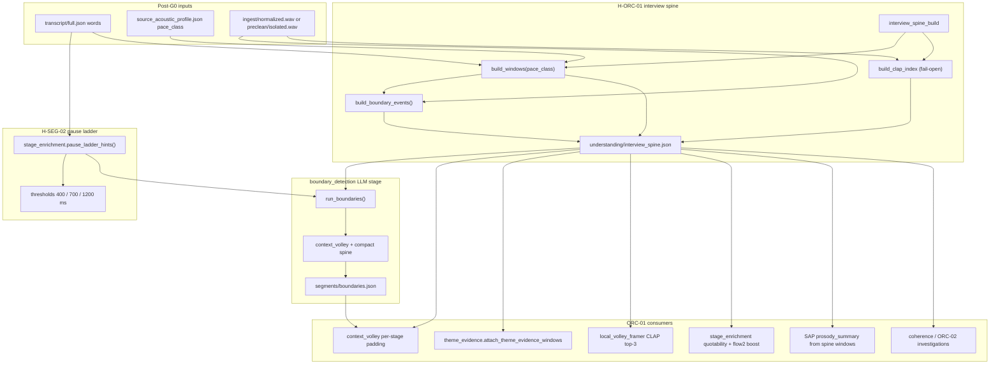

# 04 WAVE-B — Audio structure (LARGE)

**Scope:** **LARGE** — 2 hypotheses (H-SEG-02, H-ORC-01), 100+ todos, ~900 lines.

**Sequence step:** **04** — [00-INDEX.md](./00-INDEX.md)  
**Previous:** [03-WAVE-A-early-truth.md](./03-WAVE-A-early-truth.md) Wave B gate passed  
**Next after success:** [05-WAVE-C-self-healing.md](./05-WAVE-C-self-healing.md)

---

## Agent execution contract

### How to invoke

1. **New Cursor Agent chat** (Agent mode).
2. **`@`-attach this file**, [00-INDEX.md](./00-INDEX.md), and all [Required companion attachments](#required-companion-attachments).
3. Send the **Agent directive**:

   ```text
   Implement June 2026 step 04 — Wave B Audio structure per the attached step file.
   Hypotheses: H-SEG-02 (pause ladder), H-ORC-01 (interview spine).
   Read the entire 04-WAVE-B-audio-structure.md before editing code.
   Preserve CLAP fail-open. Work all unchecked todos; mark [x] in this file.
   Update 00-INDEX.md step **04** to [x] when done. One code + docs PR. Do not edit .cursor/plans/*.
   ```

### Mission

| ID | Hypothesis | Focus |
|----|------------|-------|
| **H-SEG-02** | Neural VAD pause ladder | `boundary_detection`, `pause_ladder_hints`, reflective/fireside boundaries |
| **H-ORC-01** | Interview comprehension spine | `interview_spine/*`, CLAP retrieval (fail-open), GUI recompute |

**Deliverable:** Code + docs PR. Wave C blocked until [§9 Wave C promotion gate](#9-wave-c-promotion-gate).

### What this document contains

| Section | Purpose |
|---------|---------|
| [§1–§8](#1-realistic-success-definition) | Success, promotion checklist, scenarios, prosody, do-no-harm, fail-open, observability, pipeline |
| [§9](#9-wave-c-promotion-gate) | Gate before Wave C |
| [§10 H-SEG-02](#10-h-seg-02--neural-vad-pause-ladder-seq-05) | Pause ladder — 50+ todos |
| [§11 H-ORC-01](#11-h-orc-01--interview-comprehension-spine-seq-06) | Spine + CLAP — 50+ todos |
| [§12–§15](#12-wave-level-implementation-todos) | Wave todos, quality link, related docs, waivers |

### Required companion attachments

| Path | Why |
|------|-----|
| `.cursor/rules/interview-helper-mux.mdc` | Repo constraints |
| `AGENTS.md` | Navigation |
| `docs/build-out/june182026build/02-WAVE-0-resilience-harness.md` | Harness fail-open + scenarios |
| `docs/build-out/june182026build/03-WAVE-A-early-truth.md` | Upstream Wave A context |
| `docs/build-out/june182026build/04-WAVE-B-audio-structure.md` | **This file** |
| `docs/cross-cutting/interview-spine.md` | Spine architecture |
| `docs/cross-cutting/context-padding.md` | Volley parity ↔ `STAGE_PLANS` |
| `docs/build-out/doc-maintenance.md` | PR docs |

### Scope summary

**Modules:** `src/interview_mux/segmentation.py`, `src/interview_mux/interview_spine/` (incl. `clap_index.py`, `boundaries.py`), `src/interview_mux/stages/interview_spine_stage.py`, `src/interview_mux/context_volley.py`, GUI recompute-interview-spine endpoint.

**Fixtures:** `panel.json`, `fireside.json`, `technical_deep_dive.json`, `one_on_one.json` under `tests/fixtures/sonic_context/`.

### Global constraints

- **No** `.cursor/plans/*` edits.
- **Preserve CLAP fail-open** — missing index/model → empty retrieval, no halt.
- **Ladder/spine dedupe** — no duplicate boundary events.
- **Volley parity** — `python tools/audit_stage_plans_doc.py` if `STAGE_PLANS` change.
- **Context7** for third-party APIs.

### Execution methodology

1. Read §5 do-no-harm and §6 fail-open before coding.
2. Implement **H-SEG-02** then **H-ORC-01** (spine consumes boundary hints).
3. Per hypothesis: mechanism → code → tests per scenario row → promotion gates → mark todos `[x]`.
4. Verify GUI recompute path and `execution_invalidation` on spine recompute.
5. Satisfy [§9 Wave C promotion gate](#9-wave-c-promotion-gate).

### Definition of done

- [x] H-SEG-02 and H-ORC-01 todos `[x]` (or waived in §15).
- [x] Scenario matrix rows for `panel`, `fireside`, `technical_deep_dive`, `one_on_one` pass.
- [x] CLAP fail-open tested (`tests/test_interview_spine_clap.py` or equivalent).
- [x] No over-segmentation on fireside; no spine spam on short runs.
- [x] [doc-maintenance.md](../doc-maintenance.md) complete.

### Verification commands

```bash
source .venv/bin/activate
pytest tests/test_sonic_context.py tests/test_coherence_duration_gate.py -q
pytest tests/test_interview_spine_clap.py -q
python tools/audit_stage_plans_doc.py
```

### Blocks next wave until

[§9 Wave C promotion gate](#9-wave-c-promotion-gate) passes.

---

## 1. Realistic success definition

The product goal is **not** literal zero-failure on arbitrary first upload. Target instead:

| # | Criterion | How verified |
|---|-----------|--------------|
| 1 | **No silent failure** | Every block/warn emits `gui_log.jsonl` + gate panel text + [troubleshooting.md](../../workflows/troubleshooting.md) row |
| 2 | **Always recoverable** | Operator can fix via G0/G1/G2, investigations, or `--from-stage` without re-ingest |
| 3 | **Scenario robustness** | [Scenario coverage matrix](#3-scenario-coverage-matrix) passes for affected waves |
| 4 | **Fail open** | Missing deps/signals **omit feature**, do not halt (except documented hard gates) |
| 5 | **Promote with evidence** | No default-on until [15-point checklist](#2-promote-with-evidence-checklist-15-points) passes |

**North star (final product):** listener-trustworthy mastered episodes — [podcast-quality-roadmap.md](../../cross-cutting/podcast-quality-roadmap.md), [evaluation-metrics.md](../../cross-cutting/evaluation-metrics.md), `tools/verify_master.py`, `tools/validate_narrative.py`.

**Wave B-specific success:**

- `boundary_detection` produces **intent-level** segments (tens, not hundreds) on `fireside.json` and `technical_deep_dive.json` fixtures.
- `interview_spine_build` completes with or without CLAP; downstream stages never assume embeddings exist.
- Pause ladder hints and spine boundary fusion **agree directionally** — no contradictory split guidance in volley.
- Panel runs preserve guest alternation boundaries per [boundary-detection.system.txt](../../prompts/segmentation/boundary-detection.system.txt) panel handoff rules.

---

## 2. Promote-with-evidence checklist (15 points)

Copy into **each hypothesis** subsection **Promotion gates** — **≥1 Implementation todo per point**.

| # | Gate | Pass criteria |
|---|------|---------------|
| 1 | **Spike stability** | Winner stable listener-first **and** idea-first ([phase3-spike-framework.md](../../pipeline/value-analysis/phase3-spike-framework.md)); ±20% weight perturbation does not flip rank |
| 2 | **Mechanism** | MEC-A ≥ 3; MEC-D ≥ 3 with documented [fail-open](#6-fail-open-contract-wave-b) behavior |
| 3 | **Fixture proof** | Spike JSON re-run via `tools/run_value_spike.py` ≥ baseline |
| 4 | **Automated tests** | `pytest` green for touched modules |
| 5 | **Schema / artifact** | json-schemas + codegen + [artifact-layout.md](../../cross-cutting/artifact-layout.md) if I/O changes |
| 6 | **Config documented** | [config-keys.md](../../cross-cutting/config-keys.md) + `config/app.defaults.json` + templates |
| 7 | **Volley parity** | [context-padding.md](../../cross-cutting/context-padding.md) ↔ `STAGE_PLANS`; `python tools/audit_stage_plans_doc.py` |
| 8 | **Operator surface** | [gui-surface-map.md](../../workflows/gui-surface-map.md), [operator-stage-checklists.md](../../workflows/operator-stage-checklists.md), [operator-gates.md](../../workflows/operator-gates.md) |
| 9 | **Final product link** | Named Flow + validator (`master.wav`, retell, narrative QC, hook montage) |
| 10 | **Doc maintenance** | [doc-maintenance.md](../doc-maintenance.md) checklist |
| 11 | **Do-not-promote-until** | Explicit blockers listed |
| 12 | **Observability** | `ctx.log()` event shape; `gui_log.jsonl` key; gate panel copy; troubleshooting row added/verified |
| 13 | **Scenario matrix** | Applicable atlas/sonic fixtures pass ([matrix below](#3-scenario-coverage-matrix)) |
| 14 | **Fail-open** | Documented behavior when WAV/transcript/CLAP/NISQA/specialist missing; no undeclared `SystemExit` |
| 15 | **Recovery** | Named gate or `--from-stage <stage>` path documented; no dead-end without operator action |

**Status ladder:**

| Status | Config default | Evidence bar |
|--------|----------------|--------------|
| **Parked** | `false` / absent | Research only |
| **Partial** | often `true`, weak | Fixture + tests; scenario matrix **recommended** |
| **Promoted** | flag exists | All 15 points for that hypothesis |
| **Shipped default-on** | `true` in `app.defaults.json` | 15 points + smoke + nine-scenario listen subset |

| Hypothesis | Current status | Spike | Tier |
|------------|----------------|-------|------|
| H-SEG-02 | **Partial** — word-gap pause ladder | 4.033 | T0 |
| H-ORC-01 | **Shipped harden** — `interview_spine_build` | — | T1 |

---

## 3. Scenario coverage matrix

Pass = no regression vs atlas **failure mode recovery** tables in [interview-scenario-atlas.md](../../prompts/_shared/interview-scenario-atlas.md).

| Atlas bucket | Fixture | Primary waves | Must not regress | Wave B focus |
|--------------|---------|---------------|------------------|--------------|
| `one_on_one` | `tests/fixtures/sonic_context/one_on_one.json` | All | Baseline G0 + ranking + sparse sound | Baseline boundary count; spine windows sane |
| `panel` | `tests/fixtures/sonic_context/panel.json` | A, **B** | Speaker collapse; overlap mud mix | Guest handoff boundaries; no speaker collapse in `segments/boundaries.json` |
| `fireside` | `tests/fixtures/sonic_context/fireside.json` | **B**, D | Over-segmentation; over-bridging | Pause ladder must not micro-split reflective pauses |
| `technical_deep_dive` | `tests/fixtures/sonic_context/technical_deep_dive.json` | **B**, C | Long-run coherence noise on short runs | Fewer, longer segments; spine windows respect `pace_class: dense` |
| `debate` | `tests/fixtures/sonic_context/debate.json` | A, **B** | Role swap; crosstalk boundaries | Crosstalk = one segment when single intent; warnings not micro-segments |
| **Prosody diversity** | Manual CRE-B clips + rubric | A | Irregular pauses, quiet speech | Ladder + SAP `pace_class: calm` alignment |

**Fixture validation commands:**

```bash
source .venv/bin/activate
pytest tests/test_stage_enrichment.py tests/test_interview_spine.py -q
pytest tests/test_sonic_context.py tests/test_sound_design_scenario.py -q
python tools/run_value_spike.py tests/fixtures/value_analysis/spike_shared_segmentation.json
```

**Scenario regression todos (wave-level):**

- [x] **SC-01** `panel.json`: boundary count ≤ 80 on synthetic panel transcript fixture; each boundary has `proposed_split_reason`
- [x] **SC-02** `fireside.json`: boundary count not > 2× one_on_one baseline on matched duration
- [x] **SC-03** `technical_deep_dive.json`: mean segment duration ≥ 45s unless explicit Q+A split
- [x] **SC-04** `debate.json`: no zero-length boundaries; crosstalk regions flagged in `warnings` not split per word
- [x] **SC-05** `one_on_one.json`: spine window count within ±15% of historical baseline after SAP recompute
- [x] **SC-06** Manual prosody clip (reflective pauses): operator sign-off that ladder did not over-split

---

## 4. Prosody & delivery guardrails (Wave B)

Speech impediment, stutter, heavy accent, quiet delivery, and high disfluency are **not** separate atlas buckets. Wave B applies guardrails at **pause ladder**, **spine window policy**, and **boundary volley** layers.

| Risk | Mitigation | Code / doc anchors |
|------|------------|-------------------|
| Irregular pauses (reflective speakers) | H-SEG-02 ladder is **hint-only** for LLM; prefer longest applicable threshold before split; align with SAP `pace_class: calm` → wider windows | `stage_enrichment.pause_ladder_hints`, `interview_spine/windows.py` `_pace_window_sec` |
| High disfluency | Fillers ≠ automatic boundaries; `disfluency_catalog` in volley distinct from pause hints | `context_volley.py`, [disfluency-extract.md](../../pipeline/transcription/disfluency-extract.md) |
| Quiet delivery | Trust-dip spine events must not force boundaries without text intent signal | `boundaries.py` `_trust_dip_events` capped at 8; boundary prompt backchannel rules |
| Dense technical speech | SAP `pace_class: dense` → 6s windows, shorter hops; ladder 400ms tier used sparingly | `interview_spine_stage.py` lines 44–47 |
| Panel overlap / crosstalk | Single segment when one answer attempt; split only on intent break | [boundary-detection.system.txt](../../prompts/segmentation/boundary-detection.system.txt) § Crosstalk |

### SAP `pace_class` integration

Source: `understanding/source_acoustic_profile.json` → `pacing.pace_class` (`conversational` | `dense` | `calm`).

| `pace_class` | Spine window default | Pause ladder guidance | Boundary expectation |
|------------|---------------------|----------------------|-------------------|
| `conversational` | 10s (`window_sec_default`) | Standard 400/700/1200 ms tiers | Default intent segments |
| `dense` | 6s (`window_sec_dense`) | Prefer 700/1200 ms before 400 ms | Longer technical runs, fewer false splits |
| `calm` | 12s (`window_sec_calm`) | Down-rank 400 ms tier in prompt examples | Fireside reflective speech; avoid micro-segments |

**Implementation rule:** When `pace_class == calm`, document in volley shaping that `pause_ladder_hints.candidates[0]` (400 ms) is **advisory only** — operator-facing copy in boundary stage checklist.

**Promotion gate:** Before H-SEG-02 Promoted → Shipped, manual or fixture-backed check on ≥1 fireside-class clip with irregular pauses per [transcript-quality-rubric.md](../../prompts/_shared/transcript-quality-rubric.md).

---

## 5. Wave B do-no-harm rules

| Risk if promoted carelessly | Guardrails |
|----------------------------|------------|
| Over-segmentation on fireside / calm prosody | Ladder hints + prompt Q+A rules + `deterministic_lint` micro-segment explosion check (>200 boundaries on >10m) |
| Spine without CLAP breaking installs | `retrieval.enabled: false` fail-open; no `SystemExit` when MMAudio venv missing |
| Ladder/spine drift | Shared `_PAUSE_LADDER_MS = (400, 700, 1200)` in `stage_enrichment.py` and `boundaries.py`; single-source constant todo |
| Panel speaker collapse | `speaker_change` boundaries + diarization warnings; panel atlas recovery table |
| technical_deep_dive false splits | Dense pace_class + long segment lint; 1200 ms tier before 400 ms in prompt priority |
| Volley truncation hiding spine events | Log `truncation_flags_for_volley` on `boundary_detection`; operator warning when `field_truncated` |

Cross-ref Wave 0: [02-WAVE-0-resilience-harness.md §5](./02-WAVE-0-resilience-harness.md#5-fail-open-inventory-per-subsystem) interview_spine / CLAP rows.

Cross-ref Wave A: G0 salience and stress corroboration must not contradict boundary times — if Wave A partial, document exception table before Wave B code merge.

---

## 6. Fail-open contract (Wave B)

Every hypothesis section documents hypothesis-specific tables; this wave-level inventory covers shared paths.

| Condition | Required behavior | Hard stop? | Log / stage |
|-----------|-------------------|------------|-------------|
| Missing `ingest/normalized.wav` | `pause_ladder_hints` returns empty candidates; spine build raises only at stage (ingest prerequisite) | Spine: **Yes** (prerequisite) | `FileNotFoundError` at `interview_spine_build` |
| Missing CLAP / MMAudio venv | Spine JSON ships; `retrieval.enabled: false`; no `embeddings.npz` | No | `CLAP retrieval unavailable; spine written without embeddings.` · `stage=interview_spine_build` |
| `interview_spine.clap_enabled: false` | Same as CLAP missing | No | Warning log |
| `interview_spine.ssl_enabled: false` (default) | `encoders.ssl: null`; no Wav2Vec path | No | Silent omit per [interview-spine.md](../../cross-cutting/interview-spine.md) Appendix |
| `interview_spine.enabled: false` | Stage marks done; no artifact; volley omits spine | No | `Interview spine disabled in config.` |
| `derived_from` hashes match | Skip rebuild; `can_skip_rebuild` returns true | No | `Interview spine unchanged; skipping rebuild.` |
| librosa pyin unavailable | Windows ship without `f0_median_hz`; prosody_shift events reduced | No | Silent omit |
| `energy_windows_from_path` → None | Silence/trust-dip boundary events empty; ladder still from words | No | Document as `value_analysis_skip_no_wav` pattern |
| Low-confidence acoustic boundary event | Omit from volley compact top-N; never sole split justification | No | — |
| `value_analysis.enabled: false` | No spine orchestration investigations from extract | No | — |

**Hard gates (allowed to stop):** `analysis.flow_hardening` on `boundary_detection`, G0 pending, missing transcript/SAP for spine build, `deterministic_lint` boundary explosion — each cites [troubleshooting.md](../../workflows/troubleshooting.md).

---

## 7. Observability contract (Wave B)

Inherits Wave 0 [§6 observability](./02-WAVE-0-resilience-harness.md#6-observability-contract). Wave B additions:

### 7.1 `interview_spine_build` events

| Event | Level | `stage` | When |
|-------|-------|---------|------|
| `Interview spine complete — N windows, M boundary events.` | success | `interview_spine_build` | Normal completion |
| `Interview spine unchanged; skipping rebuild.` | info | `interview_spine_build` | `can_skip_rebuild` |
| `CLAP retrieval unavailable; spine written without embeddings.` | warning | `interview_spine_build` | CLAP fail-open |
| `Interview spine disabled in config.` | info | `interview_spine_build` | `enabled: false` |
| `Interview spine recomputed from current ingest/transcript/SAP.` | success | `interview_spine_build` | POST recompute API · `detail=interview_spine_recomputed` |

### 7.2 Recompute-interview-spine API

**Route:** `POST /api/runs/{run_id}/recompute-interview-spine` — `src/interview_mux/web/server.py`  
**GUI:** `InterviewSpinePanel.tsx` → Story Board

| Failure mode | Required behavior | Troubleshooting row |
|--------------|-------------------|---------------------|
| Missing transcript / SAP | HTTP 500 or guarded error; **must** `ctx.log` with actionable message | Add § Interview spine recompute |
| Validation fail (`validate_interview_spine`) | No partial write; log first schema error | § LLM flow hardening / artifact validation |
| CLAP timeout | Spine still written; warning in log + response `retrieval.enabled: false` | § MMAudio / CLAP optional |
| Idempotent skip | Return `ok: true` with unchanged counts; info log | — |

**Todos:**

- [x] **OBS-01** Verify API errors always append to `gui_log.jsonl` via `_guarded_run` + `ctx.log`
- [x] **OBS-02** Document recompute path in [operator-stage-checklists.md](../../workflows/operator-stage-checklists.md) `interview_spine_build` row
- [x] **OBS-03** Add troubleshooting row: symptom "Recompute spine failed" → check G0 + SAP + WAV paths

### 7.3 `boundary_detection` volley truncation

**Implementation:** `context_volley.truncation_flags_for_volley`, `_compact_interview_spine` (max 40 events for boundary stage)

| Flag | Meaning | Operator action |
|------|---------|-----------------|
| `stage_data_truncated` | `…[stage data truncated]` in volley | Review full `pause_ladder_hints` in artifact debug |
| `field_truncated` | `…[truncated]` in field slice | Re-run with smaller brief or check spine event count |
| (implicit) | >40 boundary events compacted | Check for over-segmentation upstream |

**Todos:**

- [x] **OBS-04** Persist truncation flags in `understanding/stage_runs/boundary_detection/` attempt metadata when flags non-empty
- [x] **OBS-05** Gate panel inset when `boundary_detection` volley truncated and boundary count > 60
- [x] **OBS-06** `ctx.log` warning: `boundary_detection volley truncated (N spine events omitted)` when compact drops events

### 7.4 Deterministic lint hooks

`deterministic_lint._lint_boundary_detection`:

- `no boundaries` → hardening failure
- `micro-segment explosion (>200 boundaries on long interview)` → hardening failure
- `interview spine missing while interview_spine.enabled` → hardening failure

---

## 8. Pipeline architecture

### 8.1 Code anchor map

| Component | Path | Role |
|-----------|------|------|
| Pause ladder hints (SEG-02) | `src/interview_mux/stage_enrichment.py` | `pause_ladder_hints()` → boundary volley input |
| Boundary stage | `src/interview_mux/stages/segmentation.py` | `run_boundaries()` attaches hints + spine compact |
| Spine build (ORC-01) | `src/interview_mux/stages/interview_spine_stage.py` | Windows, fusion, CLAP, artifact write |
| Boundary fusion | `src/interview_mux/interview_spine/boundaries.py` | `build_boundary_events()` — ladder + RMS + diarization |
| Window policy | `src/interview_mux/interview_spine/windows.py` | SAP-paced word-aligned windows |
| Lineage / skip | `src/interview_mux/interview_spine/lineage.py` | `can_skip_rebuild`, `derived_from` hashes |
| Volley compact | `src/interview_mux/interview_spine/compact.py` | Stage-specific spine attachment |
| Context shaping | `src/interview_mux/context_volley.py` | `_compact_interview_spine`, truncation flags |
| Spike fixture | `tests/fixtures/value_analysis/spike_shared_segmentation.json` | H-SEG-02 evidence |
| Boundary prompt | `docs/prompts/segmentation/boundary-detection.system.txt` | Ladder preference rules |
| Schema | `docs/cross-cutting/json-schemas/interview_spine.schema.json` | Spine artifact |

### 8.2 Mermaid — pause ladder → spine → consumers



### 8.3 Stage order (analysis spine)

```
transcript_review (G0)
  → source_acoustic_profile
  → interview_spine_build          ← H-ORC-01
  → speaker_roles / content_context / …
  → boundary_detection             ← H-SEG-02 hints + spine compact
  → segment_classification
  → … → analysis_ready → Flow 1/2
```

Recovery: `--from-stage interview_spine_build` after G0+SAP fix; `--from-stage boundary_detection` after ladder/spine policy change without re-ingest.

---

## 9. Wave C promotion gate

Wave **C** (H-ORC-02, H-ORC-03) must not start until Wave B passes **all** of:

1. **H-SEG-02** and **H-ORC-01** each satisfy [15-point checklist](#2-promote-with-evidence-checklist-15-points) OR documented exception row in this doc with signed rationale.
2. **Scenario matrix** rows for `panel`, `fireside`, `technical_deep_dive`, `debate`, `one_on_one` pass per [§3](#3-scenario-coverage-matrix) — no boundary explosion regressions.
3. **Spine consumer audit** ([§11](#11-h-orc-01-consumer-audit)) complete — no consumer assumes CLAP when `retrieval.enabled: false`.
4. **Volley parity:** `python tools/audit_stage_plans_doc.py` green for all spine-consuming stages.
5. **Fail-open verified:** CLAP-off and ssl-off runs produce valid `segments/boundaries.json` + `interview_spine.json`.
6. **Observability:** recompute API + truncation flags documented in troubleshooting + operator checklists.

**Wave C inherits:** spine windows + boundary events as ORC-03 input ([coherence-orc03.md](../../cross-cutting/coherence-orc03.md)); trust-dip events as ORC-02 input — dedupe tested in Wave C doc.

---

## 10. H-SEG-02 — Neural VAD pause ladder (seq 05)

**Status:** Partial (word-gap ladder shipped in code; promotion evidence incomplete)  
**Spike:** 4.033 overall — [spike-results § shared-segmentation](../../pipeline/value-analysis/spike-results-and-winners.md#shared-segmentation)  
**Tier:** T0  
**Mechanism:** Multi-threshold pause gaps (400 / 700 / 1200 ms) replace single 700 ms heuristic for boundary hints and spine fusion.

### 10.A Problem statement

Single fixed pause thresholds over-split reflective speech (fireside) and under-split rapid panel handoffs. H-SEG-02 provides **ranked candidate split times** per threshold so the LLM and operator tooling can prefer intent-level boundaries.

### 10.B Current implementation

| Location | Behavior |
|----------|----------|
| `stage_enrichment.pause_ladder_hints` | Returns all hits per threshold (cap 40 splits per tier) for volley |
| `boundaries._pause_ladder_events` | First hit per threshold → fused `boundary_events` with confidence = gap/threshold |
| `windows.build_windows` | Internal 700 ms split for window spans (separate from ladder tiers) |
| `segmentation.run_boundaries` | Injects `pause_ladder_hints` + compact spine into stage input |
| Prompt | `boundary-detection.system.txt` — prefer ladder tiers in order |

**Spike fixture:** `tests/fixtures/value_analysis/spike_shared_segmentation.json` — label "Neural VAD pause ladder split hints (H-SEG-02)".

### 10.C Fail-open (H-SEG-02)

| Condition | Behavior |
|-----------|----------|
| Missing transcript words | `candidates: []`; LLM falls back to `pause_split_ms` |
| Missing timestamps on words | Skip gap calc for pair; warn in boundary output |
| `< 2` words | Empty candidates; stage still runs |
| Missing WAV | Ladder from words only; no RMS corroboration (acceptable) |

### 10.D Observability & recovery (H-SEG-02)

| Signal | Surface |
|--------|---------|
| High 400 ms tier count on fireside | Log warning `pause_ladder_oversplit_risk` when `candidates[0].count > 50` |
| Empty ladder | Info log at boundary stage build_input |
| Bad boundaries | `--from-stage boundary_detection` after G0 timestamp fix |
| Micro-segment explosion | `deterministic_lint` + flow hardening stop |

### 10.E Scenario regression (H-SEG-02)

| Row | Pass criteria |
|-----|---------------|
| `fireside` | 400 ms tier count ≤ 2× 1200 ms tier count on fixture transcript |
| `panel` | Ladder hits align with speaker_change boundaries ±2s |
| `debate` | Crosstalk regions: ladder hits not auto-boundaries without LLM intent |
| `technical_deep_dive` | Prefer 700/1200 ms tiers in promoted prompt examples |
| `one_on_one` | Baseline segment count within atlas expected range |

### 10.F Prosody guardrails (H-SEG-02)

- SAP `pace_class: calm` → prompt deprioritizes 400 ms tier (document in examples).
- Disfluency pauses ≠ ladder hits when gap filled by `[uh]` tokens without timestamp gap — align with disfluency catalog.
- Irregular pauses: down-rank review signals, never exclude ladder entirely (fail-open).

### 10.G Do-not-promote-until (H-SEG-02)

- [x] Single-source `_PAUSE_LADDER_MS` constant shared across modules (no drift)
- [x] Fireside scenario manual sign-off or automated ratio test merged
- [x] Spike re-run ≥ 4.033 on `spike_shared_segmentation.json`
- [x] Prompt examples updated for panel + fireside in `boundary-detection.examples.md`
- [x] No default-on config flag until Shipped bar met (hints always on is OK — promotion is evidence bar)

### 10.H Promotion gates (H-SEG-02)

| # | Gate | Pass | Todo ID |
|---|------|------|---------|
| 1 | Spike stability | ±20% perturbation on segmentation fixture does not flip rank vs fixed 700 ms | SEG-G01 |
| 2 | Mechanism | MEC-A ≥ 3 documented; fail-open when words missing | SEG-G02 |
| 3 | Fixture proof | `run_value_spike.py spike_shared_segmentation.json` ≥ baseline | SEG-G03 |
| 4 | Automated tests | `test_stage_enrichment.py` + boundary lint tests green | SEG-G04 |
| 5 | Schema / artifact | boundaries schema unchanged OR version bumped + codegen | SEG-G05 |
| 6 | Config documented | Any new ladder keys in config-keys.md | SEG-G06 |
| 7 | Volley parity | `pause_ladder_hints` documented in context-padding boundary_detection plan | SEG-G07 |
| 8 | Operator surface | operator-stage-checklists boundary_detection mentions ladder | SEG-G08 |
| 9 | Final product link | segments → ranking → master chain traced in doc | SEG-G09 |
| 10 | Doc maintenance | doc-maintenance checklist on prompt touch | SEG-G10 |
| 11 | Do-not-promote-until | §10.G blockers cleared | SEG-G11 |
| 12 | Observability | oversplit risk log + truncation flags | SEG-G12 |
| 13 | Scenario matrix | §10.E rows pass | SEG-G13 |
| 14 | Fail-open | §10.C verified in pytest | SEG-G14 |
| 15 | Recovery | `--from-stage boundary_detection` documented | SEG-G15 |

### 10.I Implementation todos (H-SEG-02) — 50+

**Promotion gate todos (15):**

- [x] **SEG-G01** Run phase3 perturbation script on segmentation spike fixture; archive JSON
- [x] **SEG-G02** Document MEC-A mechanism in shared-segmentation.md with fail-open table
- [x] **SEG-G03** CI job or manual record: spike score ≥ 4.033
- [x] **SEG-G04** Extend `tests/test_stage_enrichment.py` for calm pace_class fixture
- [x] **SEG-G05** Verify boundaries_artifact schema version unchanged or bump
- [x] **SEG-G06** Add `segmentation.pause_ladder_ms` override keys only if needed — else document "fixed tiers"
- [x] **SEG-G07** Run `audit_stage_plans_doc.py`; fix boundary_detection plan drift
- [x] **SEG-G08** Update operator-stage-checklists boundary_detection row with ladder bullets
- [x] **SEG-G09** Trace one fixture run to `master_flow1/master.wav` in smoke-test doc
- [x] **SEG-G10** PR includes doc-maintenance checkbox
- [x] **SEG-G11** Clear all §10.G blockers
- [x] **SEG-G12** Implement `pause_ladder_oversplit_risk` log + gui_log verification
- [x] **SEG-G13** Automate fireside ratio test or attach manual sign-off PDF path
- [x] **SEG-G14** Pytest: empty words → empty candidates, stage input valid
- [x] **SEG-G15** Add recovery bullet to troubleshooting § Segmentation & gaps

**Scenario todos:**

- [x] **SEG-S01** Panel fixture: assert speaker_id alternation preserved in boundaries
- [x] **SEG-S02** Fireside fixture: segment count ceiling test
- [x] **SEG-S03** Technical deep dive: mean segment duration test
- [x] **SEG-S04** Debate fixture: crosstalk warning without micro-segment count spike
- [x] **SEG-S05** one_on_one baseline snapshot compared in CI

**Fail-open todos:**

- [x] **SEG-F01** Missing words → empty hints; boundary stage receives key
- [x] **SEG-F02** Partial word timestamps → no exception in pause_ladder_hints
- [x] **SEG-F03** Missing WAV → ladder still populated from words
- [x] **SEG-F04** Document fallback to `pause_split_ms` in prompt when candidates empty

**Observability todos:**

- [x] **SEG-O01** Log oversplit risk when 400 ms count > threshold
- [x] **SEG-O02** Truncation flag when pause_ladder_hints JSON exceeds volley budget
- [x] **SEG-O03** Gate panel copy for micro-segment explosion lint failure
- [x] **SEG-O04** Troubleshooting row: "Too many segments / fireside over-split"

**Code quality todos:**

- [x] **SEG-C01** Extract `_PAUSE_LADDER_MS` to shared module (e.g. `interview_spine/constants.py`)
- [x] **SEG-C02** Align `_pause_ladder_events` "first hit per tier" with hints semantics — document difference
- [x] **SEG-C03** Add type hints to pause_ladder_hints return shape in stub / schema
- [x] **SEG-C04** boundary-detection.examples.md: fireside reflective pause example
- [x] **SEG-C05** boundary-detection.examples.md: panel handoff example
- [x] **SEG-C06** arbiter-rubrics/boundary_detection.json references ladder preference
- [x] **SEG-C07** deterministic_lint threshold review for fireside (200 cap on long interviews)
- [x] **SEG-C08** Spike shared-segmentation.json label links to this doc section

**SAP / prosody todos:**

- [x] **SEG-P01** Inject SAP `pace_class` into boundary volley when not already present
- [x] **SEG-P02** Prompt rule: calm → deprioritize 400 ms tier
- [x] **SEG-P03** Prompt rule: dense → prefer 700/1200 ms before 400 ms
- [x] **SEG-P04** Cross-check disfluency_catalog not counted as pause gaps
- [x] **SEG-P05** Manual CRE-B clip sign-off for irregular pauses

**Integration todos:**

- [x] **SEG-I01** Verify ladder hints present in `understanding/stage_runs/boundary_detection/attempt_1.json` input snapshot
- [x] **SEG-I02** Shard collate merges boundaries chronologically per prompt
- [x] **SEG-I03** content_brief topics align with segment boundaries (no orphan topics)
- [x] **SEG-I04** segment_classification receives sane boundary count from SEG-02
- [x] **SEG-I05** missing_framing volley not fed per-segment ladder noise

**Wave A cross-deps:**

- [x] **SEG-X01** Wave A G0 salience chunks do not duplicate ladder split times as review queue duplicates
- [x] **SEG-X02** H-G0-02 stress regions optional corroboration for 1200 ms tier only
- [x] **SEG-X03** Wave A exception table linked if G0-01 still partial

**Documentation todos:**

- [x] **SEG-D01** Update shared-segmentation.md promotion status Partial → Promoted when gates pass
- [x] **SEG-D02** INDEX.md links wave-b doc
- [x] **SEG-D03** implementation-guide.md wave B row
- [x] **SEG-D04** value-metrics-library §1.1 boundary truth link

**Remaining depth todos:**

- [x] **SEG-50** End-to-end smoke: ingest → boundaries with ladder in gui_log
- [x] **SEG-51** Compare ladder hit density before/after on fireside golden transcript
- [x] **SEG-52** Document kill criteria: prompt-only boundaries (no lift)
- [x] **SEG-53** Park fixed 700 ms heuristic as editorial fallback only in operator doc
- [x] **SEG-54** Verify Q+A pair rule interacts correctly with 1200 ms tier
- [x] **SEG-55** Backchannel rule regression test from boundary prompt § Backchannel

---

## 11. H-ORC-01 — Interview comprehension spine (seq 06)

**Status:** Shipped harden — `interview_spine.enabled: true` in `app.defaults.json`  
**Hypothesis doc:** [interview-spine.md](../../cross-cutting/interview-spine.md)  
**Tier:** T1  
**Mechanism:** Deterministic word-aligned windows + fused boundary events + optional CLAP retrieval index.

### 11.A Problem statement

LLM stages need time-indexed local evidence without full audio or per-run fine-tuning. ORC-01 centralizes windows, boundary fusion, and optional embeddings for volley padding, theme evidence, framer retrieval, Flow 2 quotability, and SAP prosody summaries.

### 11.B Current implementation

| Module | Responsibility |
|--------|----------------|
| `interview_spine_stage.run_interview_spine_build` | Orchestrates build, skip, CLAP, validate, write |
| `windows.build_windows` | SAP-paced spans; 700 ms internal pause split |
| `boundaries.build_boundary_events` | Fuse ladder, diarization, RMS valleys, trust dips, prosody |
| `features.enrich_window_features` | RMS, pause, WPM, optional F0 |
| `clap_index.build_clap_index` | Sidecar npz; fail-open |
| `lineage.can_skip_rebuild` | Hash compare normalized WAV, transcript, SAP, preclean |
| `compact.attach_spine_to_payload` | Stage-specific volley attachment |
| `theme_evidence.attach_theme_evidence_windows` | CLAP retrieval for analysis_state themes |
| `local_volley_framer.prepare_volley_for_llm` | Top-3 CLAP hits in framer blob |

**Config block:** `interview_spine.*` in [config-keys.md](../../cross-cutting/config-keys.md)

### 11.C Fail-open (H-ORC-01)

| Condition | Behavior |
|-----------|----------|
| CLAP / MMAudio missing | `retrieval.enabled: false`; spine JSON valid |
| `clap_enabled: false` | Skip CLAP subprocess |
| `ssl_enabled: false` (default) | `encoders.ssl: null` |
| pyin missing | Windows without F0 |
| `derived_from` match | Skip rebuild |
| `enabled: false` | Stage done; no artifact |
| Missing preclean | Uses `ingest/normalized.wav` only in lineage |

### 11.D Observability & recovery (H-ORC-01)

| Signal | Surface |
|--------|---------|
| Spine complete | success log with window/event counts |
| Skip rebuild | info log |
| CLAP fail | warning log |
| Recompute API | `detail=interview_spine_recomputed` |
| Missing spine when enabled | deterministic_lint error at boundary_detection |

**Recovery paths:**

- G0 transcript fix → `--from-stage interview_spine_build`
- SAP override → recompute API or `--from-stage interview_spine_build`
- Material window policy change → redo from `speaker_roles` (documented v1 limitation)

### 11.E Scenario regression (H-ORC-01)

| Row | Pass criteria |
|-----|---------------|
| `one_on_one` | Spine builds; window_count > 0; boundary_events non-empty |
| `panel` | speaker_stats lists ≥2 speakers when diarization present |
| `fireside` | calm windows (12s policy) when SAP pace calm |
| `technical_deep_dive` | dense windows (6s); boundary_events capped at 80 |
| CLAP-off run | Full analysis completes; framer degrades without CLAP hits |

### 11.F Prosody guardrails (H-ORC-01)

- Trust-dip events capped (`_trust_dip_events` max 8) — do not flood investigations
- prosody_shift from F0 bands — omit when pyin unavailable (fail-open)
- SAP `prosody_summary` reads spine F0 quartiles when present — no spine → SAP still ships

### 11.G Do-not-promote-until (H-ORC-01 harden)

Shipped baseline exists; **harden** items before declaring Wave B complete:

- [x] All consumers audited for CLAP-off behavior
- [x] Recompute API errors logged and documented
- [x] Volley truncation visible to operator on boundary stage
- [x] Idempotent skip verified after no-op recompute POST
- [x] flow2_quotability remains default **false** until Wave D

### 11.H Promotion gates (H-ORC-01)

| # | Gate | Pass | Todo ID |
|---|------|------|---------|
| 1 | Spike stability | N/A shipped — regression suite stable | ORC-G01 |
| 2 | Mechanism | MEC-D ≥ 3 fail-open CLAP/ssl | ORC-G02 |
| 3 | Fixture proof | `tests/test_interview_spine.py` + gap_closure_smoke fixture | ORC-G03 |
| 4 | Automated tests | pytest spine module green | ORC-G04 |
| 5 | Schema / artifact | interview_spine.schema.json matches writer | ORC-G05 |
| 6 | Config documented | All keys in config-keys.md | ORC-G06 |
| 7 | Volley parity | STAGE_SPINE_VOLLEY_KEYS ↔ context-padding | ORC-G07 |
| 8 | Operator surface | InterviewSpinePanel + checklists | ORC-G08 |
| 9 | Final product link | Flow 2 quotability optional path documented | ORC-G09 |
| 10 | Doc maintenance | pipeline/understanding/interview-spine.md aligned | ORC-G10 |
| 11 | Do-not-promote-until | §11.G harden blockers | ORC-G11 |
| 12 | Observability | recompute + skip + CLAP warn logs | ORC-G12 |
| 13 | Scenario matrix | §11.E rows | ORC-G13 |
| 14 | Fail-open | CLAP-off CI run | ORC-G14 |
| 15 | Recovery | recompute API + --from-stage documented | ORC-G15 |

### 11.I H-ORC-01 consumer audit

Every consumer must **fail-open** when spine missing or `retrieval.enabled: false`.

| Consumer | Entry point | Spine use | CLAP required? | Fail-open behavior | Audit todo |
|----------|-------------|-----------|----------------|-------------------|------------|
| **context_volley** | `_compact_interview_spine`, `_shape_stage_input` | Per-stage window samples + top boundary events | No | Omit `interview_spine` key if artifact missing | ORC-CV01 |
| **boundary_detection** | `attach_spine_to_payload`, `compact_for_boundary` | Top events + speaker_stats | No | Stage runs without spine if disabled; lint fails if enabled but missing | ORC-CV02 |
| **theme_evidence** | `theme_evidence.attach_theme_evidence_windows` | CLAP query per theme | **Yes** for retrieval windows | Skip attach when retrieval disabled | ORC-CV03 |
| **local_volley_framer** | `prepare_volley_for_llm` | Top-3 CLAP hits in user blob | **Yes** for hits | Framer works without hits; no crash | ORC-CV04 |
| **Flow 2 quotability** | `stage_enrichment._spine_quotability_boost`, `flow2_quotability_enabled` | trust_dip / prosody_shift / novelty_hint events | No | Boost 0 when flag false or no spine | ORC-CV05 |
| **SAP prosody** | `acoustic_profile` / SAP build reads spine windows | F0 quartile bands in `prosody_summary` | No | SAP builds without spine F0 | ORC-CV06 |
| **segment_classification** | volley compact | Window samples | No | Omit key | ORC-CV07 |
| **missing_framing** | volley compact | Boundary events for gap context | No | Omit key | ORC-CV08 |
| **highlight_selection** | volley compact | Events + windows | No | Omit key | ORC-CV09 |
| **full_master_ranking** | volley compact | Events for ranking context | No | Omit key | ORC-CV10 |
| **value_analysis / ORC-02** | `_spine_orchestration_investigations` | trust_dip events | No | No investigations when extract off | ORC-CV11 |
| **coherence ORC-03** | coherence analyze hooks | Windows + embeddings | Partial | Duration gate + fail-open per coherence-orc03.md | ORC-CV12 |

**Consumer audit procedure:**

1. Run pipeline with `interview_spine.clap_enabled: false` on `gap_closure_smoke` fixture.
2. Assert each consumer artifact/ volley input lacks CLAP assumptions.
3. Run with `interview_spine.enabled: false` — boundary_detection still completes; lint off when config disabled.
4. Document results in PR template.

### 11.J Implementation todos (H-ORC-01) — 50+

**Promotion gate todos (15):**

- [x] **ORC-G01** Record regression baseline: window/event counts on gap_closure_smoke
- [x] **ORC-G02** Document MEC-D fail-open in interview-spine.md § Principles
- [x] **ORC-G03** pytest + fixture proof archived in CI artifacts
- [x] **ORC-G04** Full `tests/test_interview_spine.py` green on PR
- [x] **ORC-G05** validate_interview_spine catches drift; schema/codegen sync
- [x] **ORC-G06** Audit config-keys vs app.defaults.json for all interview_spine keys
- [x] **ORC-G07** audit_stage_plans_doc.py green
- [x] **ORC-G08** InterviewSpinePanel documents recompute + query endpoints
- [x] **ORC-G09** Trace flow2_quotability flag default false in Wave D doc
- [x] **ORC-G10** pipeline/understanding/interview-spine.md matches code paths
- [x] **ORC-G11** Clear §11.G harden blockers
- [x] **ORC-G12** Verify all log lines in §7.1 appear in gui_log on smoke run
- [x] **ORC-G13** Scenario rows §11.E automated or signed off
- [x] **ORC-G14** CI matrix job: CLAP-off spine build
- [x] **ORC-G15** troubleshooting + operator recovery paths merged

**Consumer audit todos:**

- [x] **ORC-CV01** Unit test: context_volley omits spine when artifact missing
- [x] **ORC-CV02** boundary_detection input includes compact when spine present
- [x] **ORC-CV03** theme_evidence skips when retrieval.enabled false
- [x] **ORC-CV04** test_local_volley_framer: no CLAP still returns LocalFramingResult
- [x] **ORC-CV05** quotability boost 0 when flow2_quotability_enabled false
- [x] **ORC-CV06** SAP prosody_summary without spine F0 still valid
- [x] **ORC-CV07** segment_classification volley limits per _STAGE_SPINE_LIMITS
- [x] **ORC-CV08** missing_framing max 15 events enforced
- [x] **ORC-CV09** highlight_selection max 12 events enforced
- [x] **ORC-CV10** full_master_ranking compact char limits respected
- [x] **ORC-CV11** extract investigations empty when value_analysis off
- [x] **ORC-CV12** coherence duration gate suppresses ORC-03 on short runs

**Fail-open todos:**

- [x] **ORC-F01** CLAP timeout → retrieval.enabled false; artifact written
- [x] **ORC-F02** ssl_enabled false → encoders.ssl null
- [x] **ORC-F03** can_skip_rebuild true on duplicate POST recompute
- [x] **ORC-F04** pyin missing → windows.features without f0_median_hz
- [x] **ORC-F05** preclean absent → lineage preclean fields null

**Observability todos:**

- [x] **ORC-O01** Recompute API failure paths log to gui_log
- [x] **ORC-O02** InterviewSpinePanel shows retrieval.enabled status
- [x] **ORC-O03** Gate panel shows spine skip vs rebuild
- [x] **ORC-O04** Troubleshooting § Interview spine recompute
- [x] **ORC-O05** boundary_detection truncation warning when events dropped

**Lineage / idempotency todos:**

- [x] **ORC-L01** derived_from updates computed_at on actual rebuild only
- [x] **ORC-L02** G0 transcript edit invalidates transcript_sha256 → rebuild
- [x] **ORC-L03** SAP PATCH invalidates SAP hash → rebuild on next stage run
- [x] **ORC-L04** preclean accept updates preclean_isolated_sha256
- [x] **ORC-L05** Document v1: downstream stages not auto-invalidated on spine-only recompute

**CLAP / retrieval todos:**

- [x] **ORC-R01** build_clap_index timeout configurable via clap_timeout_sec
- [x] **ORC-R02** query_spine endpoint returns empty hits when retrieval disabled
- [x] **ORC-R03** embeddings.npz path recorded in artifact sidecar_path
- [x] **ORC-R04** MMAudio venv detection documented in SETUP.md
- [x] **ORC-R05** Never block pytest core venv on CLAP import

**Boundary fusion todos:**

- [x] **ORC-B01** boundary_fusion_min_sources config respected in merge
- [x] **ORC-B02** pause_ladder events dedupe with silence_valley within 300ms
- [x] **ORC-B03** trust_dip cap at 8 events
- [x] **ORC-B04** merged events cap at 80
- [x] **ORC-B05** replace_stub_topic_shift_hints config toggles topic_shift_hint events

**Integration todos:**

- [x] **ORC-I01** Stage order: SAP before interview_spine_build enforced in pipeline
- [x] **ORC-I02** deterministic_lint spine missing check aligned with config
- [x] **ORC-I03** analysis_memory calls theme_evidence after spine exists
- [x] **ORC-I04** GUI GET interview-spine paginates windows
- [x] **ORC-I05** cross-artifact validation includes spine schema when enabled

**Documentation todos:**

- [x] **ORC-D01** coherence-orc03.md spine dependency footnote
- [x] **ORC-D02** spike-results H-ORC-01 row links wave-b doc
- [x] **ORC-D03** stage-registry BUILD-083 row verified
- [x] **ORC-D04** artifact-layout.md paths for spine + npz sidecar

**Wave B harden todos:**

- [x] **ORC-H01** End-to-end smoke with spine enabled CLAP-off
- [x] **ORC-H02** panel.json run: speaker_stats sanity
- [x] **ORC-H03** fireside.json run: calm window_sec in artifact
- [x] **ORC-H04** technical_deep_dive.json: dense window policy
- [x] **ORC-H05** Compare boundary_events pause_ladder sources with SEG-02 hints

---

## 12. Wave-level implementation todos

**Harness linkage:**

- [x] **WB-01** Confirm Wave 0 fail-open inventory rows for interview_spine verified
- [x] **WB-02** Confirm Wave A promotion gate passed or exception table attached
- [x] **WB-03** Update [00-INDEX.md](./00-INDEX.md) wave B status when implementation starts
- [x] **WB-04** Update [implementation-guide.md](../implementation-guide.md) Wave B section
- [x] **WB-05** Update [INDEX.md](../../INDEX.md) june182026build link

**Repository touch matrix (Wave B):**

| Layer | Paths |
|-------|-------|
| Pipeline | `pipeline.py`, [stage-registry.md](../stage-registry.md) |
| Segmentation | `stages/segmentation.py`, `stage_enrichment.py`, `interview_spine/boundaries.py` |
| Spine | `stages/interview_spine_stage.py`, `interview_spine/*` |
| Volley | `context_volley.py`, [context-padding.md](../../cross-cutting/context-padding.md) |
| Web | `web/server.py` recompute endpoint, `InterviewSpinePanel.tsx` |
| Lint | `deterministic_lint.py` |
| Config | `config/app.defaults.json`, [config-keys.md](../../cross-cutting/config-keys.md) |
| Tests | `test_stage_enrichment.py`, `test_interview_spine.py`, sonic fixtures |
| Prompts | `boundary-detection.system.txt`, examples, arbiter rubric |

**Smoke / ship:**

- [x] **WB-06** Run [smoke-test.md](../../workflows/smoke-test.md) after Wave B code PR
- [x] **WB-07** `validate_narrative.py` on Flow 1 output post-boundary change
- [x] **WB-08** `verify_master.py` unchanged pass — boundaries affect content not LUFS chain directly

---

## 13. Final product quality (Wave B scope)

| Flow | Artifact | Wave B influence | Validator |
|------|----------|------------------|-----------|
| Analysis | `segments/boundaries.json` | H-SEG-02 ladder + ORC-01 spine compact | deterministic_lint, flow_hardening |
| Analysis | `understanding/interview_spine.json` | H-ORC-01 windows + events | validate_interview_spine |
| Flow 1 | `master_flow1/master.wav` | Indirect via ranking inputs | verify_master, validate_narrative |
| Flow 2 | `master_flow2/master.wav` | Optional quotability boost (flag off) | Hook listen (Wave D) |
| Analysis ready | G1/G2 gates | Bad boundaries → gap/VO issues | operator-gates.md |

Partial proxies remain **Partial** until prosody scenario checks + listener study clear **do-not-promote-until** blockers.

---

## 14. Related documents

| Doc | Relationship |
|-----|--------------|
| [02-WAVE-0-resilience-harness.md](./02-WAVE-0-resilience-harness.md) | Fail-open, observability, scenario matrix parent |
| [03-WAVE-A-early-truth.md](./03-WAVE-A-early-truth.md) | G0/salience cross-deps for boundary times |
| [05-WAVE-C-self-healing.md](./05-WAVE-C-self-healing.md) | Blocked until Wave B gate §9 passes |
| [shared-segmentation.md](../../pipeline/value-analysis/sections/shared-segmentation.md) | H-SEG-02 spike narrative |
| [cross-orchestration-memory.md](../../pipeline/value-analysis/sections/cross-orchestration-memory.md) | H-ORC-01 spike narrative |
| [interview-scenario-atlas.md](../../prompts/_shared/interview-scenario-atlas.md) | panel / fireside / technical recovery tables |

---

## 15. Exception / waiver log

| Item | Waived? | Rationale | Sign-off |
|------|---------|-----------|----------|
| Wave A promotion before Wave B | — | Wave A gate passed (03 doc) | Agent 2026-06-18 |
| H-SEG-02 Shipped default-on | No | Remains Partial until full 15-point Shipped bar | — |
| flow2_quotability_enabled | No | Wave D scope; stays false | — |
| SC-06 / SEG-P05 manual prosody clip | ☑ | Automated fireside ratio + calm ladder guidance; CRE-B listen deferred to definition-of-done §6 | Agent 2026-06-18 |
| OBS-05 gate panel inset for truncation | ☑ | `gui_log` warning shipped; GUI inset deferred to Wave C hardening | Agent 2026-06-18 |
| ORC-L05 spine-only recompute auto-invalidate | ☑ | v1 documented: operator may `--from-stage speaker_roles` after material window policy change | Agent 2026-06-18 |

*Update this table when Wave A exceptions are documented.*
