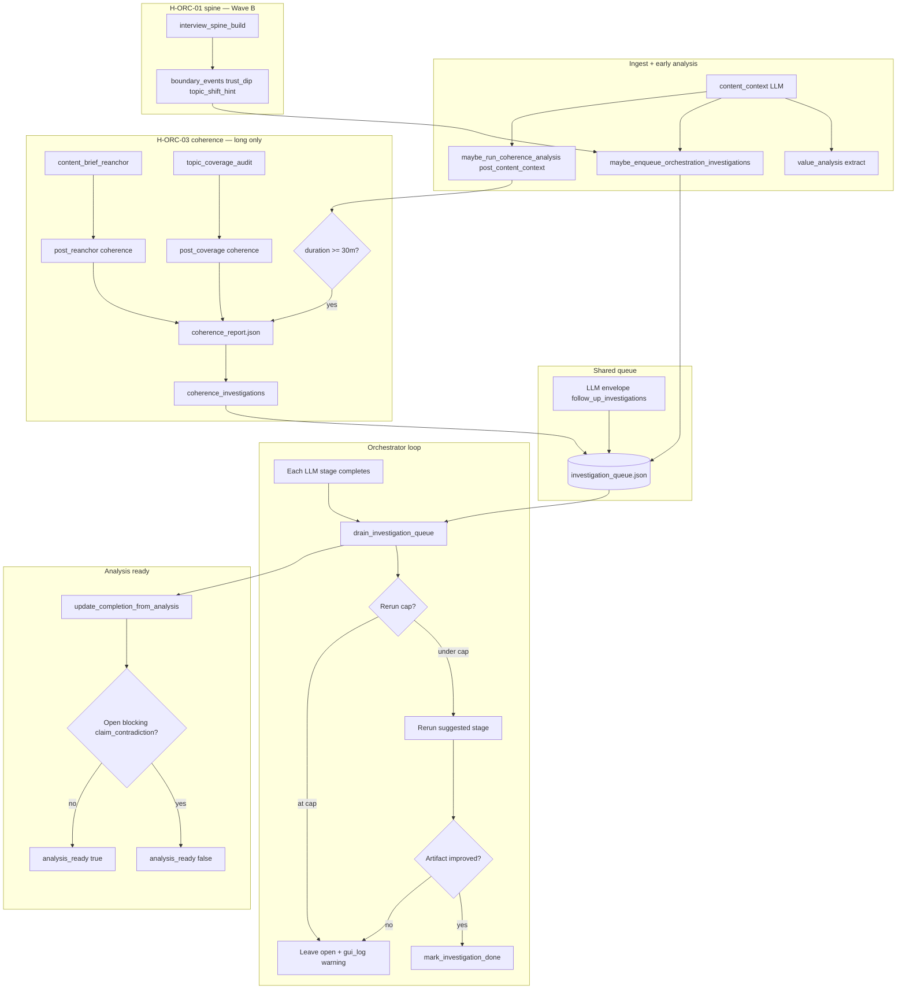

# 05 WAVE-C — Self-healing (LARGE)

**Scope:** **LARGE** — H-ORC-02 + H-ORC-03, 115+ todos, ~900 lines.

**Sequence step:** **05** — [00-INDEX.md](./00-INDEX.md)  
**Previous:** [04-WAVE-B-audio-structure.md](./04-WAVE-B-audio-structure.md) §9 gate · H-ORC-01 spine shipped  
**Next after success:** [06-WAVE-D-output-resilience.md](./06-WAVE-D-output-resilience.md)

---

## Agent execution contract

### How to invoke

1. **New Cursor Agent chat** (Agent mode).
2. **`@`-attach this file**, [00-INDEX.md](./00-INDEX.md), and all [Required companion attachments](#required-companion-attachments).
3. Send the **Agent directive**:

   ```text
   Implement June 2026 step 05 — Wave C Self-healing per the attached step file.
   Hypotheses: H-ORC-02 (investigation enqueue), H-ORC-03 (long-run coherence).
   Read the entire 05-WAVE-C-self-healing.md before editing code.
   Respect flow_hardening attempt budgets. Mark todos [x] in this file.
   Update 00-INDEX.md step **05** to [x] when done. One code + docs PR. Do not edit .cursor/plans/*.
   ```

### Mission

| ID | Hypothesis | Focus |
|----|------------|-------|
| **H-ORC-02** | Investigation enqueue from value/spine signals | `stage_enrichment.py`, `journey_orchestrator.py`, dedupe, bounded reruns |
| **H-ORC-03** | Long-run coherence (≥30m duration gate, contradictions) | `coherence/*`, `duration_gate`, Story Board Coherence risks panel |

**Deliverable:** Code + docs PR. Merge [troubleshooting.md §11](../../workflows/troubleshooting.md) alignment. Wave D blocked until [§13](#13-wave-d-promotion-gate-from-wave-c).

### What this document contains

| Section | Purpose |
|---------|---------|
| [§1–§12](#1-realistic-success-definition) | Success, scenarios, do-no-harm, fail-open, ORC-02 vs ORC-03, observability, rate limits, mermaid, touch matrix, troubleshooting, prosody |
| [§13](#13-wave-d-promotion-gate-from-wave-c) | Gate before Wave D |
| [§14](#14-final-product-impact) | Flow 1/2 product link |
| **H-ORC-02** / **H-ORC-03** sections | Per-hypothesis specs + 55–60+ todos each |
| [§15](#15-wave-level-implementation-todos-40) | Cross-hypothesis todos |

### Required companion attachments

| Path | Why |
|------|-----|
| `.cursor/rules/interview-helper-mux.mdc` | Repo constraints |
| `AGENTS.md` | Navigation |
| `docs/build-out/june182026build/02-WAVE-0-resilience-harness.md` | Harness |
| `docs/build-out/june182026build/04-WAVE-B-audio-structure.md` | H-ORC-01 spine prerequisite |
| `docs/build-out/june182026build/05-WAVE-C-self-healing.md` | **This file** |
| `docs/workflows/analysis-orchestration-loop.md` | Investigation loop |
| `docs/cross-cutting/coherence-orc03.md` | ORC-03 coherence design |
| `docs/build-out/doc-maintenance.md` | PR docs |

### Scope summary

**Modules:** `src/interview_mux/stage_enrichment.py`, `src/interview_mux/journey_orchestrator.py`, `src/interview_mux/coherence/`, `config/app.defaults.json`, `docs/cross-cutting/config-keys.md`, GUI `CoherenceRisksPanel`.

**Fixture:** `tests/fixtures/runs/coherence_30m_planted_drift/` — ORC-03 only active ≥30m; no spam on short runs.

### Global constraints

- **No** `.cursor/plans/*` edits.
- **Investigation loops** must respect `analysis.flow_hardening` attempt budgets.
- **ORC-02 vs ORC-03 orthogonal** — see §6; do not duplicate enqueue paths.
- **High-confidence blocking contradiction only** — non-blocking investigations must not halt pipeline.
- **Context7** for third-party APIs.

### Do-no-harm (mandatory)

- `tests/test_coherence_duration_gate.py` — interviews **&lt;30m** must not get ORC-03 spam.
- ORC-02/03 **dedupe** when `investigation_dedupe: true`.
- Planted drift fixture must detect drift without false positives on short fixtures.

### Execution methodology

1. Read §4 do-no-harm and §6 orthogonality.
2. Implement **H-ORC-02** (investigations) then **H-ORC-03** (coherence) — or ORC-03 config-gated independently if ORC-02 incomplete.
3. Wire GUI Coherence risks panel; extend troubleshooting §11.
4. Mark all todos `[x]`; satisfy §13 Wave D gate.

### Definition of done

- [ ] H-ORC-02 and H-ORC-03 todos `[x]`.
- [ ] Duration gate behavior matches `coherence-orc03.md`.
- [ ] Investigation dedupe and attempt budgets tested.
- [ ] `troubleshooting.md` investigation loop rows merged/verified.
- [ ] [doc-maintenance.md](../doc-maintenance.md) complete.

### Verification commands

```bash
source .venv/bin/activate
pytest tests/test_coherence_duration_gate.py tests/test_coherence_fixture_planted.py -q
pytest tests/test_journey_orchestrator.py -q 2>/dev/null || true
```

### Blocks next wave until

[§13 Wave D promotion gate](#13-wave-d-promotion-gate-from-wave-c) passes.

---

## 1. Realistic success definition

The product goal is **not** literal zero-failure on arbitrary first upload. Target instead:

| # | Criterion | How verified (Wave C) |
|---|-----------|----------------------|
| 1 | **No silent failure** | Every investigation enqueue, drain skip, coherence gate, and blocking contradiction emits `gui_log.jsonl` + Story Board / gate copy + [troubleshooting.md](../../workflows/troubleshooting.md) row |
| 2 | **Always recoverable** | Operator resolves via Story Board (`wont_fix` / manual rerun), `content_brief_reanchor`, `--from-stage content_context`, or G0 for trust-dip transcript paths — no re-ingest required |
| 3 | **Scenario robustness** | [Scenario regression](#3-scenario-coverage-matrix-wave-c) passes for `technical_deep_dive`, `coherence_30m_planted_drift`, `trauma_adjacent` |
| 4 | **Fail open** | Short interviews skip ORC-03; missing CLAP falls back to prosody novelty; low-confidence acoustic flags omitted; caps prevent investigation spam |
| 5 | **Promote with evidence** | Both hypotheses pass [15-point checklist](#2-promote-with-evidence-checklist-15-points) before default-on changes |

**North star:** listener-trustworthy mastered episodes — analysis completes or stops at **named** gates; blocking contradictions are high-confidence only; long-form drift is surfaced without spamming short clips.

---

## 2. Promote-with-evidence checklist (15 points)

For **each hypothesis**, subsection **Promotion gates** includes pass/fail checkboxes — **≥1 Implementation todo per point**.

| # | Gate | Pass criteria (Wave C) |
|---|------|------------------------|
| 1 | **Spike stability** | H-ORC-02: `spike_cross_orchestration_memory.json` re-run via `tools/run_value_spike.py` ≥ 4.071 baseline; ±20% weight perturbation does not flip rank vs text-only queue |
| 2 | **Mechanism** | MEC-A ≥ 3 (joint acoustic+text OR composite drift+novelty); MEC-D ≥ 3 with [fail-open](#5-fail-open-contract-wave-c) documented |
| 3 | **Fixture proof** | ORC-02: spike fixture; ORC-03: `tests/fixtures/runs/coherence_30m_planted_drift/` detects planted contradiction + missing callback, ignores decoy speaker turn |
| 4 | **Automated tests** | `pytest tests/test_coherence_*.py tests/test_analysis_orchestrator.py tests/test_gap_closure_smoke.py -q` green |
| 5 | **Schema / artifact** | `investigation_queue.schema.json`, `coherence_report.schema.json`, codegen, [artifact-layout.md](../../cross-cutting/artifact-layout.md) paths verified |
| 6 | **Config documented** | [config-keys.md](../../cross-cutting/config-keys.md) `coherence.*`, `value_analysis.orc03_enabled`, `analysis.flow_hardening.max_investigation_reruns_per_kind`; `config/app.defaults.json` |
| 7 | **Volley parity** | `coherence_summary` in [context-padding.md](../../cross-cutting/context-padding.md) ↔ `STAGE_PLANS`; `python tools/audit_stage_plans_doc.py` |
| 8 | **Operator surface** | Story Board investigations, `CoherenceRisksPanel`, [gui-surface-map.md](../../workflows/gui-surface-map.md), [operator-stage-checklists.md](../../workflows/operator-stage-checklists.md) |
| 9 | **Final product link** | `analysis_ready` → G1/G2 → Flow 1/2/3; blocking contradictions gate before flow selection |
| 10 | **Doc maintenance** | [doc-maintenance.md](../doc-maintenance.md); this doc + troubleshooting investigation section |
| 11 | **Do-not-promote-until** | Investigation loop without cap test; 30m fixture CI; dedupe regression; false blocking contradiction on trauma_adjacent emotional peaks |
| 12 | **Observability** | `ctx.log()` on queue write, orchestrator drain, coherence phases; journey snapshot fields |
| 13 | **Scenario matrix** | Rows below pass |
| 14 | **Fail-open** | Duration gate, investigation caps, CLAP/novelty fallback — no undeclared `SystemExit` |
| 15 | **Recovery** | Named `--from-stage` paths for each investigation kind |

**Status ladder:**

| Status | Config default | Evidence bar |
|--------|----------------|--------------|
| **Shipped default-on** | `true` in `app.defaults.json` | 15 points + smoke + scenario subset |
| **Promoted** | flag exists | All 15 points |
| **Partial** | weak tests | Fixture only — **not** Wave C target |

Both H-ORC-02 and H-ORC-03 are **shipped** — this doc is the **hardening** plan (loops, caps, observability, scenario regression).

---

## 3. Scenario coverage matrix (Wave C)

Pass = no regression vs atlas **failure mode recovery** tables ([interview-scenario-atlas.md](../../prompts/_shared/interview-scenario-atlas.md)).

| Atlas bucket | Fixture | Wave C role | Must not regress | Test / sign-off |
|--------------|---------|-------------|------------------|-----------------|
| `technical_deep_dive` | `tests/fixtures/sonic_context/technical_deep_dive.json` | ORC-02 trust dips on jargon segments must not spam investigations; ORC-03 inactive on short runs | Long-run coherence noise on **short** runs; false topic_drift from dense jargon alone | `tests/test_coherence_duration_gate.py`; manual ≤25m run — zero coherence risks |
| Long interview | `tests/fixtures/runs/coherence_30m_planted_drift/` | ORC-03 only | ORC-03 spam on short; missed planted contradiction ~22m; false positive on decoy speaker turn 15m | `tests/test_coherence_fixture_planted.py` |
| `trauma_adjacent` | `tests/fixtures/sonic_context/trauma_adjacent.json` | Blocking contradictions | Emotional peak misread as claim_contradiction blocking `analysis_ready`; investigations pushing stinger-heavy reruns | `tests/test_coherence_claim_contradiction.py`; operator review seg_016 |
| `one_on_one` | `tests/fixtures/sonic_context/one_on_one.json` | Baseline | ORC-02 over-enqueue on quiet speech | Wave A prosody guardrails + ORC-02 corroboration gate |
| `fireside` | `tests/fixtures/sonic_context/fireside.json` | ORC-02 stub topic_shift | Duplicate topic_drift when ORC-03 off & stub suppressed | `replace_stub_topic_shift_hints: true` integration test |

**Fixture validation command:**

```bash
source .venv/bin/activate
pytest tests/test_coherence_duration_gate.py \
  tests/test_coherence_fixture_planted.py \
  tests/test_coherence_investigations.py \
  tests/test_coherence_orchestrator_drain.py \
  tests/test_coherence_claim_contradiction.py -q
```

---

## 4. Wave C do-no-harm rules

| Risk if promoted carelessly | Guardrails |
|----------------------------|------------|
| Investigation loops re-running same stage | `max_queue_drains_per_stage`, `max_investigation_reruns_per_kind`, `investigation_dedupe`, improvement check before `mark_investigation_done` |
| False contradictions block `analysis_ready` | `claim_contradiction_threshold` 0.72; `blocking_claim_contradiction` only when confidence + key_claims graph agree; trauma_adjacent manual sign-off |
| Coherence spam on short interviews | `coherence.min_duration_ms` = 1_800_000 (30m); inactive report with `gate.activated: false` |
| ORC-02 + ORC-03 duplicate topic_drift | `replace_stub_topic_shift_hints` suppresses spine stub when ORC-03 active; dedupe key `(kind, stage, window_id\|risk_id)` |
| Quiet / disfluent speech → false trust dips | ORC-02 requires low-confidence word corroboration within 2.5s of trust_dip; down-rank without exclude |

---

## 5. Fail-open contract (Wave C)

| Condition | Required behavior | Module |
|-----------|-------------------|--------|
| `value_analysis.enabled: false` | `maybe_enqueue_orchestration_investigations` returns 0 | `value_analysis/extract.py` |
| Missing `ingest/normalized.wav` | No audio-derived trust_dip events; transcript flags only if text path populated | `interview_spine/boundaries.py`, `stage_enrichment.py` |
| Missing CLAP / `embeddings.npz` | Novelty uses `_prosody_fallback_novelty`; topic_drift still gated by `require_acoustic_novelty` — may omit drift if novelty below floor | `coherence/novelty.py` |
| Interview &lt; 30m | No coherence risks, investigations from ORC-03; stub topic_shift suppressed when configured | `coherence/duration_gate.py` |
| `coherence.enabled: false` or `orc03_enabled: false` | `maybe_run_coherence_analysis` no-op | `coherence/analyze.py` |
| Low-confidence acoustic signal | Omit trust_dip investigation unless nearby low-conf words | `value_analysis/extract.py` `_spine_orchestration_investigations` |
| Investigation cap reached | `coherence_investigations` stops at `max_investigations_per_run` (default 8) | `coherence/investigations.py` |
| Rerun cap per kind | Orchestrator logs skip; investigation stays open | `analysis_orchestrator.py` |
| Specialist disabled | Drain logs skip; investigation stays open | `analysis_orchestrator.drain_investigation_queue` |

**Hard gates (allowed to stop):** blocking `claim_contradiction` in queue → `analysis_ready: false`; cross-artifact `post_coherence`; G0/G1/G2 — cite [troubleshooting.md](../../workflows/troubleshooting.md).

---

## 6. ORC-02 vs ORC-03 orthogonality

Both hypotheses write to **`understanding/investigation_queue.json`** but differ in signal source, timing, kind taxonomy, and blocking semantics.

| Dimension | H-ORC-02 (trust dip / acoustic anomaly) | H-ORC-03 (long-run coherence) |
|-----------|----------------------------------------|------------------------------|
| **Trigger** | Value features + spine `boundary_events` after `content_context` | Coherence hooks: `post_content_context`, `post_reanchor`, `post_coverage` |
| **Primary signals** | `trust_dip`, `quality_trajectory_flags`, low-conf words near dip | `drift_score` + novelty, `claim_contradiction`, `missing_callback` |
| **Investigation kinds** | `acoustic_anomaly`, stub `topic_drift` (when ORC-03 off) | `topic_drift`, `claim_contradiction`, `missing_callback` |
| **Duration gate** | None (short + long) | ≥ `min_duration_ms` (30m) |
| **Blocking** | Never blocking | `claim_contradiction` may block when `blocking_claim_contradiction: true` |
| **Default rerun stage** | `content_context`, `transcript_review_build` | `content_brief_reanchor`, `topic_coverage_audit` |
| **Artifact** | Queue items only (value_features optional) | `coherence_report.json` + `analysis_state.coherence_risks[]` |
| **Spike evidence** | 4.071 listener-first / 4.222 idea-first | 30m planted fixture + unit suite |

**Dedupe interaction:** `enqueue_investigations` dedupes open items by `(kind, suggested_action.stage, window_id|risk_id|segment_id)`. ORC-02 stub `topic_drift` at time T and ORC-03 `topic_drift` at same window should collapse to one open item when dedupe on.

**Suppression rule:** When `coherence_active()` and `replace_stub_topic_shift_hints()`, spine `topic_shift_hint` events do **not** enqueue ORC-02 stub drifts — full ORC-03 owns topic drift on long interviews.

---

## 7. Observability contract (Wave C)

### 7.1 Investigation queue writes

| Event | `stage` | `level` | Writer |
|-------|---------|---------|--------|
| Schema warnings on save | `memory` | `warning` | `analysis_memory.save_queue` |
| Value features extracted | `content_context` | `info` | `maybe_auto_extract_value_features` |
| Coherence report validation fail | `coherence` | `warning` | `maybe_run_coherence_analysis` |
| Coherence cross-validate warn | `coherence` | `warning` | `post_coherence` checkpoint |

**Gap (Wave C todos):** Add explicit `ctx.log` on `enqueue_investigations` with count + kinds (currently implicit via queue artifact).

### 7.2 Journey orchestrator / GUI snapshot

`build_journey_snapshot` exposes:

- `open_investigations` — open/pending/needs items in queue
- `open_coherence_risks` — open rows in `analysis_state.coherence_risks`
- `blocking_coherence_contradictions` — open blocking `claim_contradiction`

When `open_investigations > 0` and phase is `understand`, `next_action` → **"Resolve open questions in Story Board"** (`NEXT_ACTION_UNDERSTAND_INVESTIGATIONS`).

**API:** `GET /api/runs/{id}/investigations`, `PATCH` status; `GET /api/runs/{id}/coherence-report`; `POST …/recompute-coherence`.

### 7.3 CoherenceRisksPanel empty states

| State | UI copy |
|-------|---------|
| `gate.activated: false` | "H-ORC-03 activates on interviews ≥ 30 minutes. Current duration: Xm." |
| Activated, no open risks | "No open coherence risks." |
| Open risks | List kind, timestamp, confidence%; `blocking` badge |

Artifact path shown: `understanding/coherence_report.json`.

### 7.4 Orchestrator drain logs

| Symptom log prefix | Meaning |
|--------------------|---------|
| `Investigation {id}: re-running {stage}` | Drain started rerun |
| `Investigation {id}: rerun cap reached for kind=` | `max_investigation_reruns_per_kind` hit |
| `Investigation {id}: {stage} rerun did not improve artifact` | Left open — see troubleshooting |
| `Investigation {id}: specialist … skipped (disabled)` | Fail-open specialist path |
| `Analysis memory finalized — ready=` | `post_analysis_finalize` with open count |

---

## 8. Rate limits and config todos

### 8.1 Coherence caps

| Key | Default | Module | Purpose |
|-----|---------|--------|---------|
| `coherence.max_investigations_per_run` | `8` | `coherence/investigations.py` | Max enqueue per coherence pass |
| `coherence.max_risks_in_memory` | `20` | `coherence/memory_sync.py` | Cap `analysis_state.coherence_risks[]` |
| `coherence.min_duration_ms` | `1800000` | `coherence/duration_gate.py` | 30m activation |

### 8.2 Flow hardening / orchestration caps

| Key | Default | Module | Purpose |
|-----|---------|--------|---------|
| `analysis.max_queue_drains_per_stage` | `5` | `analysis_orchestrator.py` | Drains after each LLM stage |
| `analysis.max_iterations_per_stage` | `3` | Inner LLM retry loop | |
| `analysis.flow_hardening.max_investigation_reruns_per_kind` | `2` | `analysis_orchestrator.drain_investigation_queue` | Per-kind rerun cap |
| `analysis.flow_hardening.investigation_dedupe` | `true` | `analysis_memory.enqueue_investigations` | Dedupe open investigations |
| `analysis.flow_hardening.max_primary_attempts_per_stage` | `4` | `attempt_budget.py` | Primary LLM cap |

### 8.3 ORC-02 implicit caps

| Cap | Value | Location |
|-----|-------|----------|
| Quality trajectory flags enqueued | `5` | `extract.py` `flags[:5]` |
| Spine orchestration items | `6` | `_spine_orchestration_investigations` `items[:6]` |

**Config documentation todos:** Ensure [config-keys.md](../../cross-cutting/config-keys.md) documents ORC-02 implicit caps or promote to explicit keys if operators need tuning.

---

## 9. Dual-path orchestration (mermaid)



**Hook sites (code):**

- `src/interview_mux/stages/understanding.py` — after `content_context`, `content_brief_reanchor`
- `src/interview_mux/stages/analysis_flow1_extended.py` — after `topic_coverage_audit` (`post_coverage`)

---

## 10. Repository touch matrix (Wave C)

| Layer | Paths / docs |
|-------|----------------|
| ORC-02 enqueue | `src/interview_mux/value_analysis/extract.py`, `stage_enrichment.py`, `interview_spine/boundaries.py` |
| ORC-03 coherence | `src/interview_mux/coherence/*`, `docs/cross-cutting/coherence-orc03.md` |
| Queue + memory | `src/interview_mux/analysis_memory.py`, `json-schemas/investigation_queue.schema.json` |
| Drain loop | `src/interview_mux/analysis_orchestrator.py`, `docs/workflows/analysis-orchestration-loop.md` |
| Pipeline hooks | `src/interview_mux/stages/understanding.py`, `pipeline.py` (`drain_investigation_queue`) |
| Journey / GUI | `src/interview_mux/journey_orchestrator.py`, `frontend/.../CoherenceRisksPanel.tsx`, `StoryBoardPanel` |
| Hardening caps | `llm_flow_hardening.py`, `attempt_budget.py`, `artifact_cross_validate.py` (`post_coherence`) |
| Tests | `tests/test_coherence_*.py`, `tests/test_analysis_orchestrator.py` |
| Fixtures | `tests/fixtures/runs/coherence_30m_planted_drift/`, `tests/fixtures/value_analysis/spike_cross_orchestration_memory.json` |

---

## 11. Troubleshooting — investigation loop (Wave C alignment)

Add / verify these rows in [troubleshooting.md](../../workflows/troubleshooting.md) (extends Wave 0 § LLM flow hardening).

### Investigation queue grows without clearing

| Symptom | Likely cause | Inspect | Action |
|---------|--------------|---------|--------|
| Same investigation re-runs every stage | Drain runs but artifact never reaches `complete` | `understanding/stage_runs/<stage>/attempt_*.json`, producer JSON status | Fix root artifact; `--from-stage <stage>` after manual edit |
| `rerun cap reached for kind=` in log | `max_investigation_reruns_per_kind` (default 2) exhausted | `analysis_orchestration.json` `investigation_rerun_counts` | Mark `wont_fix` in GUI if acceptable; or fix inputs and delete count key (dev) |
| Investigations duplicate same question | Dedupe off or different dedupe keys | Two open items' `kind`, `target.window_id` | Enable `investigation_dedupe`; resolve one manually |
| Queue enqueues but never drains | Non-LLM stage path / runner missing | `suggested_action.stage` vs `llm_stage_runners` keys | Ensure stage in `ALL_LLM_STAGES`; `--from-stage` to registered stage |

### ORC-02-specific

| Symptom | Likely cause | Inspect | Action |
|---------|--------------|---------|--------|
| Trust dip investigations on quiet speech | Missing corroboration gate | `spine.boundary_events`, `transcript/full.json` words near `time_ms` | Expected skip when no low-conf words; verify Wave A H-ING-03 not double-flagging |
| Too many `acoustic_anomaly` after content_context | >5 quality flags | `value_features.json` `quality_trajectory_flags` | Cap is 5; tune value analysis thresholds in Wave A |
| topic_drift + topic_drift duplicate | Stub not suppressed | `coherence.replace_stub_topic_shift_hints`, duration | Enable replace stub; verify ORC-03 gate on long runs only |

### ORC-03-specific

| Symptom | Likely cause | Inspect | Action |
|---------|--------------|---------|--------|
| Coherence risks on 20m interview | Duration miscount | `coherence_report.json` `gate.duration_ms` | Verify transcript word `end_ms`; should show `activated: false` |
| Blocking contradiction on emotional story beat | trauma_adjacent false positive | `coherence_report.json` risks near seg_016, `content_brief.json` key_claims | Re-anchor brief; mark investigation `wont_fix` if narrative-intentional tension |
| topic_drift without audible change | Novelty fallback too sensitive | `scores[].novelty_score`, CLAP embeddings present? | Set `require_acoustic_novelty: true`; raise `novelty_min_delta` |
| No risks on 31m fixture | Gate or spine missing | `interview_spine/spine.json`, `orc03_enabled` | Run full analysis through `content_brief_reanchor`; run planted fixture test |

### analysis_ready blocked

| Symptom | Likely cause | Inspect | Action |
|---------|--------------|---------|--------|
| `Open blocking claim_contradiction` | High-confidence contradiction unresolved | `investigation_queue.json`, `coherence_report.json` | Run `content_brief_reanchor`; resolve or `wont_fix` with operator note |
| `open blocking investigation(s)` non-contradiction | Rare — blocking flag on item | Item `blocking: true` | Clear blocking or complete suggested rerun |
| Ready false but queue empty | Artifact incomplete under hardening | `analysis_state.json` `completion.blockers` | Complete partial producer JSON per blocker path |

**Recovery commands:**

```bash
# Re-run from content brief after operator edits
python tools/run_analysis.py --run-id <id> --from-stage content_context

# Re-anchor only
python tools/run_analysis.py --run-id <id> --from-stage content_brief_reanchor

# Recompute coherence without full pipeline (GUI or API)
curl -X POST http://localhost:8765/api/runs/<id>/recompute-coherence \
  -H 'Content-Type: application/json' -d '{"phase":"post_reanchor"}'
```

---

## 12. Prosody & delivery guardrails (Wave C)

| Risk | Wave C mitigation |
|------|-------------------|
| Quiet speech → trust_dip | ORC-02 requires low-confidence **words** within 2500ms; do not enqueue on RMS-only dip |
| Irregular pauses → false novelty | Prosody fallback uses bounded pause delta; CLAP preferred when embeddings exist |
| High disfluency → false contradiction | Claim contradiction uses brief key_claims graph — disfluency alone must not contradict |
| Accent / ASR unevenness | Trust dip path ties to word confidence, not salience ranking (Wave A H-G0-01 separate) |
| trauma_adjacent emotional peak | Down-rank blocking; require contradiction threshold; scenario sign-off before Shipped |

---

## 13. Wave D promotion gate (from Wave C)

Wave D (H-F1N-02, H-F2-02, H-F1S-02) must not start until:

- [ ] Investigation **dedupe** tested: ORC-02 stub + ORC-03 same window → single open item
- [ ] **30m fixture CI**: `tests/test_coherence_fixture_planted.py` in default pytest selection or CI job
- [ ] **Volley parity audit**: `coherence_summary` stages match `context-padding.md`; `audit_stage_plans_doc.py` green
- [ ] Wave C observability todos complete (enqueue log, troubleshooting section merged)
- [ ] No open Wave C **do-not-promote-until** blockers

---

## 14. Final product impact

| Stage | Wave C contribution |
|-------|---------------------|
| Analysis | Self-healing investigations improve `content_brief`, gaps, coverage before G1 |
| G1/G2 | `analysis_ready` respects blocking contradictions only |
| Flow 1 | `topic_coverage_audit` receives `coherence_summary`; fewer arc holes |
| Flow 2/3 | Indirect — better brief + coverage upstream |
| Ship | No Wave C code in mix path; coherence does not block `verify_master` |

---

# H-ORC-02 — Acoustic anomaly + text ambiguity investigations

**Seq:** 07 · **Status:** Shipped (harden) · **Spike:** 4.071 (listener-first), 4.222 (idea-first)  
**Artifact:** `understanding/investigation_queue.json` (kinds: `acoustic_anomaly`, optional stub `topic_drift`)  
**Entry point:** `maybe_enqueue_orchestration_investigations()` in `value_analysis/extract.py`, called from `run_content_context` after stage success.

## A. Intent

When deterministic value analysis and spine boundary events detect **acoustic/text ambiguity** (trust dips corroborated by low-confidence STT, quality trajectory flags), enqueue **non-blocking** investigations so the orchestrator can rerun `content_context` or `transcript_review_build` without operator manually spotting misalignment.

## B. Mechanism

1. After `content_context` completes, `maybe_auto_extract_value_features` may write `understanding/value_features.json`.
2. `maybe_enqueue_orchestration_investigations`:
   - Reads up to **5** `quality_trajectory_flags` from value features (fallback: `stage_enrichment.quality_trajectory_flags`).
   - Reads spine `boundary_events` for `trust_dip` (with nearby low-conf words) and `topic_shift_hint` (unless ORC-03 stub suppression).
   - Caps spine items at **6**.
3. `enqueue_investigations(..., created_by_stage="content_context")` with dedupe when hardening on.
4. After each subsequent LLM stage, `drain_investigation_queue` processes open items (bounded).

## C. Spike / evidence

Fixture: `tests/fixtures/value_analysis/spike_cross_orchestration_memory.json`  
Winner: joint acoustic+text queue — **Promote** (shipped). **Park** text-only `analysis_state` queue. **Kill** prompt-only memory.

## D. Code anchors

| File | Role |
|------|------|
| `value_analysis/extract.py` | `maybe_enqueue_orchestration_investigations`, `_spine_orchestration_investigations` |
| `stage_enrichment.py` | `quality_trajectory_flags` |
| `interview_spine/boundaries.py` | `_trust_dip_events` |
| `stages/understanding.py` | Hook after `content_context` |
| `analysis_memory.py` | `enqueue_investigations`, dedupe key |
| `analysis_orchestrator.py` | `drain_investigation_queue` |

## E. S. Fail-open table (H-ORC-02)

| Condition | Behavior |
|-----------|----------|
| `value_analysis.enabled: false` | Return 0 |
| No `value_features.json` | Fallback to `quality_trajectory_flags(ctx)` only |
| No spine / spine disabled | Skip spine branch |
| trust_dip without low-conf words nearby | Skip item |
| ORC-03 active + replace_stub | Skip `topic_shift_hint` stub drifts |
| Dedupe match on open item | Skip enqueue |

## F. T. Observability & recovery (H-ORC-02)

| Signal | Surface |
|--------|---------|
| Enqueue count | **Todo:** `ctx.log(f"investigation_enqueue orc02 count={n} kinds=...")` |
| Open investigations | Journey `open_investigations`; Story Board |
| Drain rerun | `gui_log` `stage=orchestrator` |
| Recovery | `--from-stage content_context` or `transcript_review_build`; G0 for transcript path |

## G. U. Scenario regression (H-ORC-02)

| Row | Pass criteria |
|-----|---------------|
| `technical_deep_dive` | Jargon-dense seg does not enqueue >2 spurious acoustic_anomaly on 15m run |
| `one_on_one` | Baseline ≤1 investigation on clean studio clip |
| `trauma_adjacent` | No blocking investigations; emotional prosody may flag at most 1 corroborated dip |
| Prosody diversity | Quiet clip: zero trust_dip investigations without low-conf words |

## H. V. Prosody guardrails (H-ORC-02)

- Trust dip enqueue **requires** word confidence &lt; 0.75 within 2500ms.
- Quality trajectory cap 5 prevents disfluency-heavy runs from flooding queue.
- Never set `blocking: true` on ORC-02 items.

## I. W. Promotion gates — H-ORC-02 (15 points)

- [ ] **G1 Spike stability** — Re-run spike fixture; ranks stable ±20%
- [ ] **G2 Mechanism** — MEC-A joint acoustic+text documented
- [ ] **G3 Fixture proof** — `spike_cross_orchestration_memory.json` ≥ baseline
- [ ] **G4 Tests** — Orchestrator drain + extract tests green
- [ ] **G5 Schema** — `investigation_queue.schema.json` validates ORC-02 items
- [ ] **G6 Config** — `value_analysis.enabled`, flags in config-keys
- [ ] **G7 Volley** — N/A direct; verify content_context volley unchanged
- [ ] **G8 Operator** — Story Board shows acoustic_anomaly questions
- [ ] **G9 Final product** — Improved brief before ranking
- [ ] **G10 Doc maintenance** — This section + cross-orchestration-memory.md
- [ ] **G11 Do-not-promote** — No enqueue without corroboration test
- [ ] **G12 Observability** — Enqueue + drain logs verified
- [ ] **G13 Scenario** — technical_deep_dive + one_on_one pass
- [ ] **G14 Fail-open** — All §E rows tested
- [ ] **G15 Recovery** — `--from-stage` documented in troubleshooting

## J. X. Implementation todos — H-ORC-02 (55+)

### Promotion gate todos (15)

- [ ] **ORC02-G01** Re-run `tools/run_value_spike.py` on cross-orchestration fixture; archive scores
- [ ] **ORC02-G02** Document MEC-A/MEC-D in spike-results row
- [ ] **ORC02-G03** Assert fixture JSON unchanged baseline in CI
- [ ] **ORC02-G04** `pytest tests/test_analysis_orchestrator.py tests/test_gap_closure_smoke.py -q`
- [ ] **ORC02-G05** Validate sample queue item against json-schema in test
- [ ] **ORC02-G06** Verify config-keys.md lists value_analysis sub-flags
- [ ] **ORC02-G07** Run `audit_stage_plans_doc.py` — no regression
- [ ] **ORC02-G08** gui-surface-map Story Board investigation row present
- [ ] **ORC02-G09** Trace analysis_ready path with ORC-02-only queue (non-blocking)
- [ ] **ORC02-G10** doc-maintenance checklist on PR template
- [ ] **ORC02-G11** List do-not-promote blockers in README june182026build
- [ ] **ORC02-G12** Add enqueue `ctx.log` with kinds + count
- [ ] **ORC02-G13** Run sonic one_on_one + technical_deep_dive scenario procedures
- [ ] **ORC02-G14** Test `value_analysis.enabled: false` → zero enqueue
- [ ] **ORC02-G15** Document recovery in troubleshooting investigation section

### Mechanism & code (15)

- [ ] **ORC02-M01** Unit test: trust_dip without low-conf words → no item
- [ ] **ORC02-M02** Unit test: trust_dip with nearby low-conf → item with question containing time
- [ ] **ORC02-M03** Unit test: max 5 quality_trajectory flags enqueued
- [ ] **ORC02-M04** Unit test: max 6 spine items
- [ ] **ORC02-M05** Unit test: topic_shift_hint suppressed when coherence_active + replace_stub
- [ ] **ORC02-M06** Unit test: topic_shift_hint enqueued when ORC-03 inactive
- [ ] **ORC02-M07** Integration: content_context hook calls enqueue after is_done
- [ ] **ORC02-M08** Verify `created_by_stage: content_context` on all ORC-02 items
- [ ] **ORC02-M09** Verify suggested_action stages are registered runners
- [ ] **ORC02-M10** Audit `quality_trajectory_flags` for double-count with H-ING-03
- [ ] **ORC02-M11** Confirm `_trust_dip_events` uses normalized WAV path from spine build
- [ ] **ORC02-M12** Review priority defaults (medium acoustic, low stub drift)
- [ ] **ORC02-M13** Ensure no `blocking: true` in extract paths
- [ ] **ORC02-M14** context_index append on enqueue when enabled
- [ ] **ORC02-M15** operator_snapshots persist queue on PATCH

### Fail-open (8)

- [ ] **ORC02-F01** Test missing value_features → fallback flags path
- [ ] **ORC02-F02** Test missing spine artifact → empty spine branch
- [ ] **ORC02-F03** Test spine_enabled false
- [ ] **ORC02-F04** Test missing transcript words → trust_dip skip
- [ ] **ORC02-F05** Test dedupe prevents duplicate acoustic_anomaly
- [ ] **ORC02-F06** Test enqueue when flow_hardening disabled still writes queue
- [ ] **ORC02-F07** Test low-confidence-only dip without RMS event — no false enqueue from flags alone without note
- [ ] **ORC02-F08** Test `value_analysis_skip_no_wav` — empty audio flags

### Observability (7)

- [ ] **ORC02-O01** Implement structured enqueue log line
- [ ] **ORC02-O02** Verify drain logs include investigation id + truncated question
- [ ] **ORC02-O03** Journey snapshot open_investigations matches queue file
- [ ] **ORC02-O04** GUI PATCH investigation status writes gui_log
- [ ] **ORC02-O05** operator-stage-checklists row for "Resolve open questions"
- [ ] **ORC02-O06** troubleshooting row: trust dip false positive
- [ ] **ORC02-O07** attentionQueue.ts surfaces acoustic_anomaly kind

### Scenario & prosody (10)

- [ ] **ORC02-S01** Manual 15m technical_deep_dive — investigation count ≤3
- [ ] **ORC02-S02** Manual one_on_one clean — 0–1 investigations
- [ ] **ORC02-S03** trauma_adjacent — no blocking items
- [ ] **ORC02-S04** Quiet speaker clip — zero trust_dip without low-conf
- [ ] **ORC02-S05** Disfluent clip — flags cap at 5 not 20+
- [ ] **ORC02-S06** Verify atlas recovery table "false trust dip" not regressed
- [ ] **ORC02-S07** Document expected investigation kinds per atlas bucket
- [ ] **ORC02-S08** Cross-check H-G0-02 stress score not duplicate enqueue
- [ ] **ORC02-S09** Panel overlap clip — trust dip corroboration still required
- [ ] **ORC02-S10** Sign-off table in PR for ≥2 hard-listener clips

---

# H-ORC-03 — Long-run coherence (topic drift, contradictions, callbacks)

**Seq:** 08 · **Status:** Promote → Shipped · **Artifact:** `understanding/coherence_report.json`  
**Memory:** `analysis_state.coherence_risks[]`  
**Doc:** [coherence-orc03.md](../../cross-cutting/coherence-orc03.md)

## A. Intent

Interviews **≥30 minutes** accumulate narrative risks: topic drift without acoustic confirmation, contradictory claims, topics never revisited. H-ORC-03 scores risks deterministically on the interview spine + content brief, writes `coherence_report.json`, syncs memory, enqueues capped investigations, and feeds volley summaries to downstream LLM stages.

## B. Mechanism

1. **Activation:** `coherence.enabled` + `value_analysis.orc03_enabled` + duration ≥ `min_duration_ms`.
2. **Phases:**
   - `post_content_context` — theme alignment scores only (early signal)
   - `post_reanchor` — full report + contradictions + missing callbacks + cross-validate `post_coherence`
   - `post_coverage` — reconcile with `coverage_audit.json`
3. **Signals:** novelty (CLAP or prosody fallback), theme alignment, composite topic_drift, claim_contradiction, missing_callback.
4. **Investigations:** `coherence_investigations()` sorted by confidence, capped at `max_investigations_per_run`.
5. **Blocking:** High-confidence `claim_contradiction` with `blocking_claim_contradiction: true` → queue item `blocking: true` → `analysis_ready: false`.

## C. Spike / evidence

30m fixture: `tests/fixtures/runs/coherence_30m_planted_drift/` — contradiction ~22m, missing callback "Future roadmap", decoy speaker turn 15m ignored.

## D. Code anchors

| Module | Role |
|--------|------|
| `coherence/analyze.py` | `maybe_run_coherence_analysis`, `build_coherence_report` |
| `coherence/duration_gate.py` | 30m gate |
| `coherence/novelty.py` | CLAP + prosody fallback |
| `coherence/theme_alignment.py` | Window vs brief topics |
| `coherence/claim_contradiction.py` | Blocking contradictions |
| `coherence/missing_callback.py` | Second-half coverage |
| `coherence/investigations.py` | Enqueue shape |
| `coherence/memory_sync.py` | `coherence_risks[]` |
| `coherence/compact.py` | Volley `coherence_summary` |
| `frontend/.../CoherenceRisksPanel.tsx` | Operator UI |

## E. S. Fail-open table (H-ORC-03)

| Condition | Behavior |
|-----------|----------|
| Duration &lt; 30m | `_inactive_report`; GUI shows duration hint |
| `coherence.enabled: false` | no-op |
| `orc03_enabled: false` | no-op |
| No CLAP embeddings | Prosody novelty fallback |
| `require_acoustic_novelty` + low novelty | topic_drift omitted |
| Below contradiction threshold | Risk omitted |
| Investigation cap | Top-N by confidence only |
| Validation errors on report | Log warning; still write if phase allows |

## F. T. Observability & recovery (H-ORC-03)

| Signal | Surface |
|--------|---------|
| Report write | `coherence_report.json`; optional validation warning log |
| Cross-validate | `post_coherence` warning lines |
| GUI panel | CoherenceRisksPanel counts + recompute |
| Journey | `open_coherence_risks`, `blocking_coherence_contradictions` |
| Recovery | `content_brief_reanchor`, `topic_coverage_audit`, `--from-stage content_brief_reanchor`, recompute API |

## G. U. Scenario regression (H-ORC-03)

| Row | Pass criteria |
|-----|---------------|
| `coherence_30m_planted_drift` | Detects contradiction + missing callback; ignores decoy |
| `technical_deep_dive` | Short (&lt;30m) run: zero risks; long run: drift requires novelty gate |
| `trauma_adjacent` | No blocking contradiction on emotional beat without key_claims conflict |
| Duration gate | 29m59s → inactive; 30m00s → active |

## H. V. Prosody guardrails (H-ORC-03)

- Novelty fallback down-weights pause-only spikes when CLAP missing.
- topic_drift requires composite score — not single speaker turn (decoy test).
- Contradiction uses structured brief claims — not raw emotional intensity.

## I. W. Promotion gates — H-ORC-03 (15 points)

- [ ] **G1** 30m fixture stable across rubric profiles
- [ ] **G2** MEC-A composite drift + novelty documented
- [ ] **G3** Planted fixture CI green
- [ ] **G4** Full `tests/test_coherence_*.py` suite green
- [ ] **G5** `coherence_report.schema.json` + codegen TS schema
- [ ] **G6** All `coherence.*` keys in config-keys.md
- [ ] **G7** Volley caps for coherence_summary stages
- [ ] **G8** CoherenceRisksPanel + recompute API documented in gui-surface-map
- [ ] **G9** blocking contradiction prevents analysis_ready — integration test exists
- [ ] **G10** coherence-orc03.md synced with code
- [ ] **G11** No promote until trauma_adjacent false-block test passes
- [ ] **G12** Phase hooks log investigation count enqueued
- [ ] **G13** 30m + short scenario tests
- [ ] **G14** Fail-open table tested
- [ ] **G15** Recovery paths in troubleshooting

## J. X. Implementation todos — H-ORC-03 (60+)

### Promotion gate todos (15)

- [ ] **ORC03-G01** Run full coherence test suite in CI
- [ ] **ORC03-G02** Update spike-results H-ORC-03 row to Shipped
- [ ] **ORC03-G03** Planted fixture regression test mandatory
- [ ] **ORC03-G04** Schema validation test `test_coherence_report_schema.py`
- [ ] **ORC03-G05** Frontend schema codegen up to date
- [ ] **ORC03-G06** config-keys all coherence thresholds documented
- [ ] **ORC03-G07** audit_stage_plans_doc.py for coherence_summary stages
- [ ] **ORC03-G08** gui-surface-map CoherenceRisksPanel section
- [ ] **ORC03-G09** test_blocking_contradiction_blocks_analysis_ready green
- [ ] **ORC03-G10** doc-maintenance on coherence-orc03.md cross-links
- [ ] **ORC03-G11** trauma_adjacent blocking sign-off checklist
- [ ] **ORC03-G12** Log `coherence_phase_complete enqueued=N` per hook
- [ ] **ORC03-G13** Scenario matrix three rows signed
- [ ] **ORC03-G14** Duration gate edge tests 29:59 vs 30:00
- [ ] **ORC03-G15** troubleshooting ORC-03 rows merged

### Mechanism & hooks (15)

- [ ] **ORC03-M01** Verify post_content_context theme-only path
- [ ] **ORC03-M02** Verify post_reanchor full report write
- [ ] **ORC03-M03** Verify post_coverage reconciliation with coverage_audit
- [ ] **ORC03-M04** Test `_can_skip` derived_from optimization
- [ ] **ORC03-M05** Test composite topic_drift threshold + novelty gate
- [ ] **ORC03-M06** Test claim_contradiction blocking flag propagation to queue
- [ ] **ORC03-M07** Test missing_callback second-half scan
- [ ] **ORC03-M08** Test memory_sync cap max_risks_in_memory
- [ ] **ORC03-M09** Test compact_for_volley byte cap per stage plan
- [ ] **ORC03-M10** attach_coherence_summary in reanchor volley input
- [ ] **ORC03-M11** cross_validate post_coherence checkpoint wired
- [ ] **ORC03-M12** validate_coherence_report on write
- [ ] **ORC03-M13** sync_coherence_to_state updates GUI-facing risks
- [ ] **ORC03-M14** API GET coherence-report returns gate block
- [ ] **ORC03-M15** POST recompute-coherence runs post_reanchor phase

### Fail-open & caps (10)

- [ ] **ORC03-F01** Inactive report when duration below gate
- [ ] **ORC03-F02** coherence.enabled false → zero investigations
- [ ] **ORC03-F03** orc03_enabled false → zero investigations
- [ ] **ORC03-F04** CLAP missing → prosody fallback scores produced
- [ ] **ORC03-F05** require_acoustic_novelty filters low-novelty drift
- [ ] **ORC03-F06** max_investigations_per_run=8 enforced (existing test)
- [ ] **ORC03-F07** Dedupe window_id across duplicate drift risks
- [ ] **ORC03-F08** replace_stub suppresses ORC-02 topic_shift on long runs
- [ ] **ORC03-F09** Below claim threshold → no blocking risk
- [ ] **ORC03-F10** Validation failure logs warning without crash

### Observability (8)

- [ ] **ORC03-O01** CoherenceRisksPanel inactive state shows minutes
- [ ] **ORC03-O02** CoherenceRisksPanel empty open list copy
- [ ] **ORC03-O03** Journey blocking_coherence_contradictions >0 blocks misleading next_action
- [ ] **ORC03-O04** gui_log cross-validate warnings readable
- [ ] **ORC03-O05** operator-stage-checklists coherence subsection
- [ ] **ORC03-O06** troubleshooting blocking contradiction row
- [ ] **ORC03-O07** stage_guidance mentions open coherence risks
- [ ] **ORC03-O08** persist_operator snapshot includes coherence report path

### Scenario & fixture (12)

- [ ] **ORC03-S01** Run planted fixture test locally and in CI
- [ ] **ORC03-S02** Assert contradiction time ~22m in fixture
- [ ] **ORC03-S03** Assert missing callback for Future roadmap
- [ ] **ORC03-S04** Assert decoy 15m speaker turn not enqueued
- [ ] **ORC03-S05** Short technical_deep_dive run — gate inactive
- [ ] **ORC03-S06** trauma_adjacent brief review — no false block
- [ ] **ORC03-S07** Long technical_deep_dive synthetic 35m — drift only with novelty
- [ ] **ORC03-S08** Document atlas "long-run coherence noise on short runs" recovery
- [ ] **ORC03-S09** Volley truncation spot-check 35m reanchor with coherence_summary
- [ ] **ORC03-S10** topic_coverage_audit volley includes summary post-coverage hook
- [ ] **ORC03-S11** narrative_arc_plan receives compact summary
- [ ] **ORC03-S12** podcast_show_description blocking contradictions only in volley

---

## 15. Wave-level implementation todos (40+)

### Prerequisites & docs

- [ ] **WC-01** Confirm Wave 0 fail-open coherence rows implemented
- [ ] **WC-02** Confirm Wave B H-ORC-01 spine builds before ORC-02/03 hooks
- [ ] **WC-03** Confirm Wave A value_analysis flags stable
- [ ] **WC-04** Link this doc from june182026build README.md (already listed — verify)
- [ ] **WC-05** Update docs/INDEX.md build-out section
- [ ] **WC-06** Cross-link analysis-orchestration-loop.md to Wave C caps

### Integration & CI

- [ ] **WC-07** Add coherence planted fixture to CI pytest marker or default job
- [ ] **WC-08** Smoke-test.md note for 30m optional manual path
- [ ] **WC-09** Run `pytest tests/test_coherence_*.py -q` in doc-maintenance CI checklist
- [ ] **WC-10** Verify pipeline drains queue after each LLM stage in analysis + flow modes

### Dedupe & orthogonality

- [ ] **WC-11** Integration test: ORC-02 stub + ORC-03 same window → 1 open item
- [ ] **WC-12** Integration test: replace_stub prevents double topic_drift kinds
- [ ] **WC-13** Document orthogonality table in cross-orchestration-memory.md

### Rate limits

- [ ] **WC-14** Document implicit ORC-02 caps (5 flags, 6 spine) in config-keys or wave doc
- [ ] **WC-15** Audit production defaults for max_investigation_reruns_per_kind=2 sufficient
- [ ] **WC-16** Dev-only override procedure for max_queue_drains documented in troubleshooting

### Troubleshooting & observability

- [ ] **WC-17** Merge §11 investigation loop into troubleshooting.md
- [ ] **WC-18** Add troubleshooting anchor link from operator-journey.md
- [ ] **WC-19** Verify all hard stops map to Wave 0 §6.3 table
- [ ] **WC-20** Add enqueue logging PR for ORC-02 (ORC02-G12)

### Wave D gate

- [ ] **WC-21** Sign Wave D gate checklist §13 when all WC + ORC todos complete
- [ ] **WC-22** Record waiver rationale table if any gate deferred

### Future-proofing

- [ ] **WC-23** No MLX fine-tune on coherence path
- [ ] **WC-24** long-interview-chunking.md cross-link for volley truncation
- [ ] **WC-25** evaluation-metrics.md listener study hook for ORC-03 promoted claims

---

## Related

- [02-WAVE-0-resilience-harness.md](./02-WAVE-0-resilience-harness.md) — fail-open coherence, observability contract
- [04-WAVE-B-audio-structure.md](./04-WAVE-B-audio-structure.md) — H-ORC-01 spine prerequisite
- [analysis-memory.md](../../cross-cutting/analysis-memory.md) — queue + state semantics
- [feedback-loops-and-reruns.md](../../workflows/feedback-loops-and-reruns.md) — operator rerun patterns
- [long-interview-chunking.md](../../workflows/long-interview-chunking.md) — 30m+ volley context

---

*Generated per [99-META-regenerate-specs.md](./99-META-regenerate-specs.md) Command 3. Documentation only — no Python changes in this step.*
