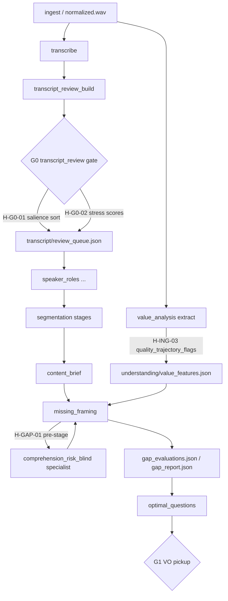

# Wave A — Early truth (June 2026)

**Status:** Planning doc — seq 01–04; requires [wave-0-resilience-harness.md](./wave-0-resilience-harness.md) promotion gate.  
**Parent:** [h-hypothesis-wave-prompts.md](./h-hypothesis-wave-prompts.md) Command 1  
**Do not edit:** `.cursor/plans/h-hypothesis_plan_files_909fce9f.plan.md`

Wave A hardens **listener-trust signals before deep analysis**: ingest quality trajectories, G0 review ordering, acoustic stress corroboration, and blind comprehension-risk specialist input into `missing_framing`. All four hypotheses ship as **Partial** today — promotion to **Promoted** requires the 15-point checklist per hypothesis.

**Canonical references:** [wave-0-resilience-harness.md](./wave-0-resilience-harness.md) · [interview-scenario-atlas.md](../../prompts/_shared/interview-scenario-atlas.md) · [spike-results-and-winners.md](../../pipeline/value-analysis/spike-results-and-winners.md) · [operator-gates.md](../../workflows/operator-gates.md) · [troubleshooting.md](../../workflows/troubleshooting.md)

| Seq | ID | Status | Spike | Tier | Primary axis |
|-----|-----|--------|-------|------|--------------|
| 01 | H-ING-03 | partial RMS proxy | 3.738 | T0 | LEX · COM |
| 02 | H-G0-02 | partial | — | T1 | LEX · COM |
| 03 | H-G0-01 | partial | 4.037 | T0 | LEX · COM · CRE |
| 04 | H-GAP-01 | partial specialist | 4.037 | T0 | LEX · COM |

---

## Requires Wave 0

Wave A work **must not begin** until [wave-0-resilience-harness.md §15](./wave-0-resilience-harness.md#15-promotion-gate-for-wave-a) passes or todos are waived with signed rationale.

| Wave 0 artifact | Wave A use |
|-----------------|------------|
| [§5 Fail-open inventory](./wave-0-resilience-harness.md#5-fail-open-inventory-per-subsystem) | `stage_enrichment.py`, `value_analysis/*`, G0 ordering, specialist skip |
| [§6 Observability contract](./wave-0-resilience-harness.md#6-observability-contract) | Queue mode, trust flags, comprehension threshold logs |
| [§3 Scenario matrix](./wave-0-resilience-harness.md#3-scenario-coverage-matrix) | `noisy_room`, `panel`, `debate`, `dense_jargon`, prosody diversity |
| [§4 Prosody guardrails](./wave-0-resilience-harness.md#4-prosody--delivery-guardrails) | Per-hypothesis application below |

**Wave B blocked** until Wave A promotion gates pass or documented exceptions in this file's [§ Wave B promotion gate](#wave-b-promotion-gate).

---

## Wave A do-no-harm

| Risk if promoted carelessly | Mitigation |
|----------------------------|------------|
| False trust dips on `noisy_room` | Cap flags; require corroboration before investigation enqueue; scenario test `tests/fixtures/sonic_context/noisy_room.json` |
| Salience punishing accent / low confidence | H-G0-01 weights require H-G0-02 `acoustic_stress_score` or idea-break text; never confidence-only primary |
| Comprehension specialist blocking gaps loop | Specialist fail-open; `missing_framing` continues on specialist timeout; investigations non-blocking |
| Bad G0 order wastes operator time | A/B salience vs confidence-only in spike fixture; CRE-B timed task before Shipped |

Copy from [h-hypothesis-wave-prompts.md § Per-wave do-no-harm](./h-hypothesis-wave-prompts.md#per-wave-do-no-harm-rules-copy-into-each-wave-doc).

---

## 1. Realistic success definition

The product goal is **not** literal zero-failure on arbitrary first upload. Wave A succeeds when:

| # | Criterion | Wave A verification |
|---|-----------|---------------------|
| 1 | **No silent failure** | Trust-dip flags, queue reorder, specialist skip each emit `gui_log.jsonl` + troubleshooting row |
| 2 | **Always recoverable** | G0 re-rank via `--from-stage transcript_review_build`; gaps via `--from-stage missing_framing` |
| 3 | **Scenario robustness** | [Scenario matrix](#2-scenario-coverage-matrix-wave-a) rows pass |
| 4 | **Fail open** | Missing WAV → empty flags; specialist fail → gaps continue |
| 5 | **Promote with evidence** | No default-on until [15-point checklist](#3-promote-with-evidence-checklist-15-points) per hypothesis |

**North star:** Corrected transcript and comprehension-aware gaps → trustworthy `content_brief` → Flow 1 ranking / Flow 2 hooks — [podcast-quality-roadmap.md](../../cross-cutting/podcast-quality-roadmap.md), `tools/validate_narrative.py`, `tools/verify_master.py`.

---

## 2. Scenario coverage matrix (Wave A)

Pass = no regression vs atlas **failure mode recovery** in [interview-scenario-atlas.md](../../prompts/_shared/interview-scenario-atlas.md).

| Atlas bucket | Fixture | Wave A hypotheses | Must not regress | Test / sign-off |
|--------------|---------|-------------------|------------------|-----------------|
| `noisy_room` | `tests/fixtures/sonic_context/noisy_room.json` | H-ING-03, H-G0-02 | False trust dips; false G0 emphasis; beds conflate with speech RMS | `tests/test_mix_acoustic_profile.py`; manual listen ≥1 clip |
| `panel` | `tests/fixtures/sonic_context/panel.json` | H-G0-01, H-GAP-01 | Speaker collapse in review chunks; comprehension false negatives on crosstalk | `tests/test_sound_design_scenario.py`; G0 queue spot-check |
| `debate` | `tests/fixtures/sonic_context/debate.json` | H-G0-01, H-G0-02 | Role swap mis-rank; crosstalk stress false positives | `tests/test_style_inference.py` |
| `dense_jargon` | `tests/fixtures/sonic_context/dense_jargon.json` | H-GAP-01 | Comprehension false positives; filler ≠ gap | `tests/test_sonic_context.py` |
| **Prosody diversity** | Manual CRE-B clips + [transcript-quality-rubric.md](../../prompts/_shared/transcript-quality-rubric.md) | H-ING-03, H-G0-01, H-G0-02 | Quiet/disfluent/accent clips not over-flagged | Manual ≥2 hard-listener clips |
| `one_on_one` | `tests/fixtures/sonic_context/one_on_one.json` | All | Baseline — no regression vs pre-Wave-A | `tests/test_sonic_context.py` |

**Fixture validation:**

```bash
source .venv/bin/activate
pytest tests/test_sonic_context.py tests/test_mix_acoustic_profile.py tests/test_style_inference.py -q
python tools/run_value_spike.py --fixture tests/fixtures/value_analysis/spike_shared_ingest_transcribe.json
python tools/run_value_spike.py --fixture tests/fixtures/value_analysis/spike_shared_g0_and_profile.json
python tools/run_value_spike.py --fixture tests/fixtures/value_analysis/spike_shared_gaps_and_vo.json
```

---

## 3. Promote-with-evidence checklist (15 points)

Per-hypothesis **§W** below maps each gate to pass criteria and todos. Wave-level requirement: all four hypotheses reach **Promoted** (or documented exception) before Wave B default-on changes.

| # | Gate | Pass criteria (Wave A) |
|---|------|------------------------|
| 1 | Spike stability | ±20% weight perturbation does not flip rank on fixture sprint |
| 2 | Mechanism | MEC-A ≥ 3; MEC-D ≥ 3; fail-open documented |
| 3 | Fixture proof | `run_value_spike.py` ≥ baseline JSON scores |
| 4 | Automated tests | `pytest` green for touched modules |
| 5 | Schema / artifact | json-schemas + [artifact-layout.md](../../cross-cutting/artifact-layout.md) if I/O changes |
| 6 | Config documented | [config-keys.md](../../cross-cutting/config-keys.md) + `config/app.defaults.json` |
| 7 | Volley parity | [context-padding.md](../../cross-cutting/context-padding.md) ↔ `STAGE_PLANS`; `audit_stage_plans_doc.py` |
| 8 | Operator surface | [gui-surface-map.md](../../workflows/gui-surface-map.md), [operator-stage-checklists.md](../../workflows/operator-stage-checklists.md) |
| 9 | Final product link | Named Flow validator path for hypothesis consumer |
| 10 | Doc maintenance | [doc-maintenance.md](../doc-maintenance.md) checklist |
| 11 | Do-not-promote-until | Explicit blockers listed per hypothesis |
| 12 | Observability | `ctx.log()` + troubleshooting row |
| 13 | Scenario matrix | Applicable rows pass |
| 14 | Fail-open | Missing signals omit feature; no undeclared `SystemExit` |
| 15 | Recovery | Named gate or `--from-stage` documented |

---

## 4. Prosody & delivery guardrails (wave-level)

From [wave-0-resilience-harness.md §4](./wave-0-resilience-harness.md#4-prosody--delivery-guardrails). Per-hypothesis application in each **§V**.

| Risk | Wave A mitigation |
|------|-------------------|
| Low volume / quiet speech | H-ING-03 RMS dips require transcript confidence or G0-02 stress corroboration before `comprehension_risk` segment flag |
| Irregular pauses | H-G0-01 `pause_proxy` capped; reflective long pauses must not dominate salience alone |
| High disfluency | G0.5 `disfluency_catalog` ≠ `missing_framing` gaps — [context_volley.py](../../../src/interview_mux/context_volley.py) distinct keys |
| Accent / ASR unevenness | H-G0-01: `low_conf * 0.45` balanced by `stress * 0.2`; confidence-only sort is fallback only |
| Atypical prosody | Down-rank investigate signals; never exclude analysis segments |

**Promotion gate:** Before **Shipped default-on**, manual or fixture-backed check on ≥2 hard-listener clips per [transcript-quality-rubric.md](../../prompts/_shared/transcript-quality-rubric.md).

---

## 5. Fail-open (wave-level summary)

Detailed per-hypothesis tables in **§S**. Wave A touch points:

| Condition | Required behavior | Hypotheses |
|-----------|-------------------|------------|
| Missing `ingest/normalized.wav` | `energy_windows_from_path` → `None`; empty `quality_trajectory_flags`; log `value_analysis_skip_no_wav` | H-ING-03, H-G0-02 |
| `value_analysis.enabled: false` | No extract investigations; flags omitted from volley summary | H-ING-03 |
| Specialist timeout / API error | `missing_framing` continues; log warning or action per hardening | H-GAP-01 |
| Low-confidence acoustic signal | Omit flag; do not enqueue investigation | H-ING-03, H-G0-02 |
| `analysis.specialists.enabled: false` | Skip `comprehension_risk_blind`; gaps use LLM only | H-GAP-01 |

Full inventory: [wave-0-resilience-harness.md §5](./wave-0-resilience-harness.md#5-fail-open-inventory-per-subsystem).

---

## 6. Observability (wave-level)

Contract: [wave-0-resilience-harness.md §6](./wave-0-resilience-harness.md#6-observability-contract).

| Event / symptom | `stage` | `level` | Troubleshooting row |
|-----------------|---------|---------|---------------------|
| G0 queue built with salience rank | `transcript_review_build` | `info` | § Transcript review (G0) |
| Trust dip flags written | `value_analysis_extract` or `transcript_review_build` | `info` | § Value analysis / trust dips (add if missing) |
| `value_analysis_skip_no_wav` | `value_analysis_extract` | `warning` | § Value analysis |
| Pre-stage specialist fail | `missing_framing` | `action` if hardening + blind specialist | § LLM flow hardening gates |
| Comprehension risk threshold enqueue | `missing_framing` | `info` | § Segmentation & gaps |
| Review queue schema fail | `transcript_review_build` | `error` | § Transcript review (G0) |

**Log keys for Wave A debugging:**

- `transcript/review_queue.json` → `chunks[].rank`, `acoustic_stress_score`, `communicative_salience` (computed at sort)
- `understanding/value_features.json` → `profiles.transcript.quality_trajectory_flags`
- `understanding/stage_runs/missing_framing/specialist_comprehension_risk_blind.json`
- `understanding/investigation_queue.json` → `kind: gap_unresolved` from specialist

---

## 7. Pipeline mermaid — ingest → G0 → value_features → missing_framing



**Code path summary:**

| Stage | Module | Wave A signal |
|-------|--------|---------------|
| `transcript_review_build` | `src/interview_mux/stages/transcript_review.py` | H-G0-01, H-G0-02 |
| `value_analysis` extract | `src/interview_mux/value_analysis/extract.py`, `features_transcript.py` | H-ING-03 |
| `interview_spine_build` | `src/interview_mux/interview_spine/boundaries.py` | H-ING-03 trust_dip events |
| `sonic_context_build` | `src/interview_mux/sonic_context.py` | H-ING-03 → segment flags |
| `missing_framing` | `src/interview_mux/stages/gaps.py`, `llm_specialists.py` | H-GAP-01 |
| Volley padding | `src/interview_mux/context_volley.py` | `comprehension_risks`, `value_features_summary` |

---

## Wave B promotion gate

Wave B (`wave-b-audio-structure.md`, H-SEG-02, H-ORC-01) **must not begin** until:

1. **Wave A doc exists** and is linked from [june2026build/README.md](./README.md) and [implementation-guide.md](../implementation-guide.md).
2. **All four Wave A hypotheses** pass §W promotion gates **OR** exceptions recorded in waiver table below with maintainer sign-off.
3. **Scenario matrix** rows for Wave A (`noisy_room`, `panel`, `debate`, `dense_jargon`, prosody diversity) have automated test green or manual sign-off dated.
4. **No Wave A flag** ships `default-on` in `config/app.defaults.json` without full 15-point checklist for that hypothesis.
5. **Orthogonality verified:** H-ING-03 trust dips do not duplicate H-ORC-02 investigation spam (Wave C prep note — document baseline count).

### Wave A → B waiver table

| Hypothesis | Gate # waived | Rationale | Sign-off |
|------------|---------------|-----------|----------|
| | | | |

---

## Final product impact

Wave A signals feed the **transcript → content_brief → master** chain:

| Signal | Artifact | Downstream consumer | Product effect |
|--------|----------|---------------------|----------------|
| H-ING-03 trust dips | `value_features.json`, spine boundaries | `sonic_context` `comprehension_risk`, `sound_design` emphasis hints | Listener-trust-aware mix beds; fewer false cold-open peaks |
| H-G0-01 salience queue | `review_queue.json` | Operator G0 throughput | Faster correction of idea-breaking errors → cleaner `content_brief` |
| H-G0-02 stress | chunk `acoustic_stress_score` | Salience sort, operator clip review | Surfaces mishears operators hear, not only low ASR confidence |
| H-GAP-01 comprehension risks | specialist JSON → volley | `missing_framing`, `gap_report.json`, VO script | Retell COM uplift via targeted interviewer lines → G1 pickup → `mix_flow1` |

**Validators:** `tools/validate_narrative.py` (gap coverage in Flow 1), `tools/validate_show_description.py` (Flow 3), `tools/verify_master.py` (post-mix LUFS/peak). Wave A does not directly touch mix — but G0/gap quality determines ranking inputs to `full_master_ranking`.

---

# Hypothesis 01 — H-ING-03 (quality trajectory / trust-dip proxy)

**Thesis:** NISQA-class **quality trajectories** flag listener-trust dips over time, not only low ASR confidence per chunk.  
**Status:** Partial — RMS sliding-window proxy in `quality_trajectory_flags`; full NISQA model not merged.  
**Spike:** 3.738 global — [spike-results § shared-ingest](../../pipeline/value-analysis/spike-results-and-winners.md#shared-ingest-transcribe)  
**Fixture:** `tests/fixtures/value_analysis/spike_shared_ingest_transcribe.json`  
**Section map:** [shared-ingest-transcribe.md](../../pipeline/value-analysis/sections/shared-ingest-transcribe.md)

## A. Assertion

Sliding RMS dips below baseline × 0.55 correlate with listener-trust degradation windows independent of word-level confidence. Operators and downstream stages should **review** these windows, not auto-cut or auto-exclude content.

## B. Baseline behavior today

`quality_trajectory_flags()` in `stage_enrichment.py` computes up to 8 flags from `energy_windows_from_path(normalized.wav)`. Written to `understanding/value_features.json` via `value_analysis/features_transcript.py` and `value_analysis/extract.py`. Duplicate logic in `interview_spine/boundaries.py` `_trust_dip_events()` feeds spine boundary events with `sources: ["quality_trajectory"]`. `sonic_context.py` maps flags to `tension_peak` cue opportunities and `comprehension_risk` segment flags when `dip_ratio` is severe.

## C. Code anchors

| Path | Symbol / role |
|------|---------------|
| `src/interview_mux/stage_enrichment.py` | `quality_trajectory_flags`, `_energy_windows` |
| `src/interview_mux/audio_energy.py` | `energy_windows_from_path`, `rms_at_ms` |
| `src/interview_mux/value_analysis/features_transcript.py` | Persists flags to value_features |
| `src/interview_mux/value_analysis/extract.py` | Recomputes if missing from profile |
| `src/interview_mux/interview_spine/boundaries.py` | `_trust_dip_events` |
| `src/interview_mux/sonic_context.py` | `build_cue_opportunities`, `build_segment_flags` |
| `src/interview_mux/sound_design.py` | Reads flags for emphasis hints |
| `tools/run_value_spike.py` | Spike replay |
| `tools/extract_value_features.py` | CLI extract |

## D. Downstream consumers

- `sonic_context_build` → `understanding/sonic_context.json` segment_flags / cue_opportunities
- `interview_spine_build` → boundary events merged with prosody/topic hints
- `compact_value_features_summary` → `missing_framing` volley via `gaps.py`
- Wave D H-F1N-02 emphasis (future) — do not over-couple in Wave A

## E. Evidence & spike

| Profile | Score | Notes |
|---------|-------|-------|
| listener-first | 3.738 | Promoted over H-ING-01 SSL (parked) |
| idea-first | 3.778 | Stable rank |
| MEC-D | Strong for RMS proxy | NISQA full model deferred |

Re-run: `python tools/run_value_spike.py --fixture tests/fixtures/value_analysis/spike_shared_ingest_transcribe.json`

## F. Failure modes & risks

| Mode | Symptom | Wave A mitigation |
|------|---------|-------------------|
| Noisy room HVAC | False trust dips every 30s | Cap at 8 flags; `noisy_room` fixture regression |
| Quiet thoughtful speech | RMS dip without mishear | Require G0-02 stress or low chunk confidence before `comprehension_risk` |
| Missing WAV | Empty flags silently | Log `value_analysis_skip_no_wav` |
| Duplicate spine + value_features | Divergent dip lists | Align thresholds or document single source of truth todo |

## G. Guardrails & caps

- Max 8 flags per run (`quality_trajectory_flags` slice)
- Baseline = p60 RMS; dip threshold = local p50 < baseline × 0.55
- Never auto-remove transcript segments based on dip alone
- Never blocking gate on trust dips

## H. Hypothesis dependencies

| Related | Relationship |
|---------|--------------|
| H-G0-02 | Corroborate dip windows at chunk level |
| H-ORC-02 (Wave C) | Investigations from trust — must dedupe |
| H-F1N-02 (Wave D) | Emphasis regions — shared `stage_enrichment` |

## I. Integration & pipeline position

Runs at value_analysis extract (post-G0, pre-segmentation) and implicitly at spine build. Does not block ingest or transcribe.

## J. JSON artifacts & schemas

| Path | Field |
|------|-------|
| `understanding/value_features.json` | `profiles.transcript.quality_trajectory_flags[]` |
| Flag shape | `{ start_ms, dip_ratio, note }` |
| Spine events | `{ time_ms, type: trust_dip, confidence, sources }` |

Schema: extend `value_features` schema if shape changes — `docs/cross-cutting/json-schemas/`.

## K. Config keys

| Key | Location | Default | Notes |
|-----|----------|---------|-------|
| `value_analysis.enabled` | `config/app.defaults.json` | check config-keys | Master switch |
| `value_analysis.window_count` | TBD if exposed | 12 in code | Promotion todo |
| `interview_spine.enabled` | config | — | Spine trust_dip duplicate path |

Document any new keys in [config-keys.md](../../cross-cutting/config-keys.md).

## L. LLM / volley integration

`compact_value_features_summary` injects flags into `missing_framing` input indirectly. No direct LLM prompt change for H-ING-03 in Wave A — deterministic only.

## M. Mechanism rubric

| Rubric | Target | Evidence |
|--------|--------|----------|
| MEC-A (listener mechanism) | ≥ 3 | Spike Likert trust windows |
| MEC-D (deterministic fail-open) | ≥ 3 | Missing WAV → `[]`; logged |
| MEC-B (idea clarity) | Secondary | Indirect via cleaner G0 |

## N. Non-goals & kill criteria

- **Kill:** Prompt-only trust scoring without time-aligned audio
- **Park:** Full NISQA torch model until isolated venv ([future-proofing.md](../../roadmap/future-proofing.md))
- **Non-goal:** Auto preclean trigger from dips (BUILD-072 operator offer only)

## O. Operator surface

No dedicated trust-dip panel in v1 — flags surface via investigations (Wave C) and engineering artifacts. Todo: optional G0 annotation hint when dip overlaps chunk (future).

## P. Product impact

Trust-aware sonic context → fewer jarring beds under recovered speech; comprehension_risk segment flags inform SDP restraint on `noisy_room`.

## Q. Quality metrics & validation

- [value-metrics-library.md §2 — MOS-like predictor](../../pipeline/value-analysis/value-metrics-library.md#2-model-proxies-allowed-with-caveats)
- Spike fixture scores ≥ 3.738 baseline
- `pytest tests/test_sonic_context.py` with seeded value_features

## R. Recovery & `--from-stage`

```bash
python tools/run_analysis.py --run-id <id> --from-stage value_analysis_extract
python tools/extract_value_features.py --run-id <id> --profile transcript
python tools/run_analysis.py --run-id <id> --from-stage interview_spine_build  # spine trust_dip recompute
```

---

### S. Fail-open table (H-ING-03)

| Condition | Required behavior | Hard stop? | Log |
|-----------|-------------------|------------|-----|
| Missing `ingest/normalized.wav` | Return `[]`; skip investigations from flags | No | `value_analysis_skip_no_wav` |
| `energy_windows_from_path` returns None | Empty flags | No | warning |
| RMS length < window_count | Empty flags | No | — |
| `value_analysis.enabled: false` | No extract; no flags in artifact | No | — |
| librosa read fail | Empty flags | No | error + continue |
| NISQA model absent (future) | RMS proxy only | No | info |

### T. Observability & recovery (H-ING-03)

| Log message | `stage` | `level` | Gate / recovery |
|-------------|---------|---------|-----------------|
| `value_analysis_skip_no_wav` | `value_analysis_extract` | `warning` | Run ingest first |
| `value_features: N trust-dip flags` | `value_analysis_extract` | `info` | Inspect `value_features.json` |
| Spine trust dip count | `interview_spine_build` | `info` | `--from-stage interview_spine_build` |

### U. Scenario regression (H-ING-03)

| Row | Applies | Pass criteria |
|-----|---------|---------------|
| `noisy_room` | **Yes** | Flag count ≤ baseline; no new investigations vs one_on_one |
| `panel` | Monitor | No dip flags on overlap-only segments |
| `debate` | Monitor | Crosstalk does not flood flags |
| `dense_jargon` | No | — |
| Prosody diversity | **Yes** | Quiet clip: ≤1 flag without corroboration |

### V. Prosody guardrails (H-ING-03)

- RMS dip alone must not set `comprehension_risk` in `sonic_context.py` without `dip_ratio` threshold review (todo: align with G0-02 overlap check)
- Quiet speech: compare chunk mean confidence before segment flag
- Disfluency-heavy regions: ignore dips < 2s duration

### W. Promotion gates — 15 points (H-ING-03)

| # | Gate | Pass criteria | Todo |
|---|------|---------------|------|
| 1 | Spike stability | ±20% dip threshold no rank flip on fixture | H-ING-03-PG-01 |
| 2 | Mechanism | MEC-A ≥ 3; MEC-D ≥ 3 | H-ING-03-PG-02 |
| 3 | Fixture proof | spike_shared_ingest_transcribe ≥ 3.738 | H-ING-03-PG-03 |
| 4 | Automated tests | `test_sonic_context`, energy tests green | H-ING-03-PG-04 |
| 5 | Schema / artifact | value_features schema documents flag shape | H-ING-03-PG-05 |
| 6 | Config documented | keys in config-keys.md | H-ING-03-PG-06 |
| 7 | Volley parity | N/A minimal — audit if volley adds flags | H-ING-03-PG-07 |
| 8 | Operator surface | troubleshooting row for trust dips | H-ING-03-PG-08 |
| 9 | Final product link | sonic_context → mix via SDP | H-ING-03-PG-09 |
| 10 | Doc maintenance | shared-ingest-transcribe.md status | H-ING-03-PG-10 |
| 11 | Do-not-promote-until | noisy_room false positive rate documented | H-ING-03-PG-11 |
| 12 | Observability | ctx.log on skip + flag count | H-ING-03-PG-12 |
| 13 | Scenario matrix | noisy_room + prosody pass | H-ING-03-PG-13 |
| 14 | Fail-open | §S verified in pytest | H-ING-03-PG-14 |
| 15 | Recovery | --from-stage paths documented | H-ING-03-PG-15 |

### X. Implementation todos (H-ING-03) — 52 items

**Promotion gates (15):**

- [ ] H-ING-03-PG-01 Spike ±20% perturbation test on ingest fixture
- [ ] H-ING-03-PG-02 Document MEC-A/MEC-D scores in spike-results row
- [ ] H-ING-03-PG-03 CI job reruns spike_shared_ingest_transcribe.json
- [ ] H-ING-03-PG-04 pytest coverage for quality_trajectory_flags edge cases
- [ ] H-ING-03-PG-05 json-schema field for quality_trajectory_flags
- [ ] H-ING-03-PG-06 config-keys.md entries for value_analysis flags
- [ ] H-ING-03-PG-07 audit_stage_plans_doc.py — no drift from flags in volley
- [ ] H-ING-03-PG-08 gui-surface-map note for trust dip artifact path
- [ ] H-ING-03-PG-09 Link sonic_context consumer in ticket-specs
- [ ] H-ING-03-PG-10 Update shared-ingest-transcribe.md Partial → Promoted
- [ ] H-ING-03-PG-11 Publish noisy_room false-positive budget table
- [ ] H-ING-03-PG-12 Add ctx.log flag count in extract.py
- [ ] H-ING-03-PG-13 noisy_room fixture sign-off
- [ ] H-ING-03-PG-14 pytest missing WAV fail-open
- [ ] H-ING-03-PG-15 troubleshooting.md trust dip recovery row

**Fail-open (8):**

- [ ] H-ING-03-FO-01 Test empty flags when normalized.wav missing
- [ ] H-ING-03-FO-02 Test short RMS array (< window_count)
- [ ] H-ING-03-FO-03 Test value_analysis.enabled false
- [ ] H-ING-03-FO-04 Log value_analysis_skip_no_wav in extract
- [ ] H-ING-03-FO-05 Document spine vs stage_enrichment threshold parity
- [ ] H-ING-03-FO-06 Ensure no SystemExit on librosa errors
- [ ] H-ING-03-FO-07 Fail-open when interview_spine disabled
- [ ] H-ING-03-FO-08 Unit test energy_windows_from_path None path

**Observability (8):**

- [ ] H-ING-03-OBS-01 ctx.log info with flag count after extract
- [ ] H-ING-03-OBS-02 detail JSON with first flag start_ms
- [ ] H-ING-03-OBS-03 Map trust dip symptom in troubleshooting.md
- [ ] H-ING-03-OBS-04 operator-stage-checklists value_features bullet
- [ ] H-ING-03-OBS-05 Verify gui_log.jsonl shape in smoke-test.md
- [ ] H-ING-03-OBS-06 Log spine trust_dip merge count
- [ ] H-ING-03-OBS-07 Document engineering vs operator visibility
- [ ] H-ING-03-OBS-08 export_llm_calls N/A — confirm no LLM cost

**Scenario (10):**

- [ ] H-ING-03-SC-01 noisy_room.json regression test
- [ ] H-ING-03-SC-02 one_on_one baseline flag count bound
- [ ] H-ING-03-SC-03 panel overlap no flag spam
- [ ] H-ING-03-SC-04 debate crosstalk spot-check
- [ ] H-ING-03-SC-05 prosody manual clip 1 (quiet)
- [ ] H-ING-03-SC-06 prosody manual clip 2 (disfluent)
- [ ] H-ING-03-SC-07 dense_jargon no false dip requirement
- [ ] H-ING-03-SC-08 Compare flags pre/post preclean (optional offer)
- [ ] H-ING-03-SC-09 Atlas failure mode recovery table review
- [ ] H-ING-03-SC-10 Sign-off row in definition-of-done matrix

**Implementation (11):**

- [ ] H-ING-03-IMP-01 Deduplicate threshold constants spine vs stage_enrichment
- [ ] H-ING-03-IMP-02 Add dip_ratio floor before comprehension_risk segment flag
- [ ] H-ING-03-IMP-03 Cap investigation enqueue from trust dips (Wave C prep)
- [ ] H-ING-03-IMP-04 expose window_count in config (optional)
- [ ] H-ING-03-IMP-05 tests/fixtures/value_features/trust_dip_sample.json
- [ ] H-ING-03-IMP-06 Wire extract.py to log skip reasons
- [ ] H-ING-03-IMP-07 repository-map.md gap row if any
- [ ] H-ING-03-IMP-08 sound_design.py consumer audit
- [ ] H-ING-03-IMP-09 Document NISQA upgrade path in future-proofing.md
- [ ] H-ING-03-IMP-10 Kill H-ING-01 SSL promotion until gate met
- [ ] H-ING-03-IMP-11 BUILD ticket linkage in ticket-specs.md

---

# Hypothesis 02 — H-G0-02 (acoustic stress / breath proxy)

**Thesis:** **Acoustic stress** at chunk edges (low RMS + low confidence) clusters with mishears operators actually care about.  
**Status:** Partial — `_acoustic_stress_score` in transcript_review_build.  
**Spike:** No dedicated fixture sprint row — corroborates H-G0-01.  
**Tier:** T1  
**Section map:** [shared-g0-and-profile.md](../../pipeline/value-analysis/sections/shared-g0-and-profile.md)

## A. Assertion

Edge RMS stress combined with ASR uncertainty surfaces audible strain (breath, clipped words, room noise at boundaries) better than confidence alone.

## B. Baseline behavior today

`transcript_review_build` computes `acoustic_stress_score` per chunk via `_acoustic_stress_score(wav_path, chunk)` using `rms_at_ms` at start/end edges. Score feeds `communicative_salience_score` at weight 0.2. Stored on each chunk in `transcript/review_queue.json`.

## C. Code anchors

| Path | Symbol |
|------|--------|
| `src/interview_mux/stages/transcript_review.py` | `_acoustic_stress_score`, `run_transcript_review_build` |
| `src/interview_mux/audio_energy.py` | `rms_at_ms`, `energy_windows_from_path` |
| `src/interview_mux/stage_enrichment.py` | `communicative_salience_score` (consumer) |
| `docs/pipeline/transcription/transcript-review.md` | G0 workflow (update salience note) |

## D. Downstream consumers

- H-G0-01 salience sort primary input for stress term
- Operator listens to ranked clips — stress boosts review priority for audible issues
- Future: waveform overlay in lab tool (out of band)

## E. Evidence & spike

Corroborating evidence via H-G0-01 fixture `spike_shared_g0_and_profile.json` — stress term required for accent bias mitigation per [value-metrics-library.md](../../pipeline/value-analysis/value-metrics-library.md).

## F. Failure modes & risks

| Mode | Risk | Mitigation |
|------|------|------------|
| Noisy room constant low edge RMS | False high stress everywhere | Down-weight edge_stress when SAP noise high (todo) |
| Very short chunks | Unstable RMS at edges | MIN chunk duration guard |
| Missing WAV | transcript_review_build hard fails (ingest prerequisite) | Expected — not fail-open at G0 build |

## G. Guardrails

- `edge_stress` normalized against 0.02 RMS floor
- Combined score capped at 1.0
- Must not be sole sort key — salience composite only

## H. Dependencies

| ID | Relationship |
|----|--------------|
| H-G0-01 | Required salience component |
| H-ING-03 | Corroborate trust dips at chunk overlap |

## I. Pipeline position

`transcript_review_build` immediately after transcribe; before G0 operator gate.

## J. Artifacts

`transcript/review_queue.json` → `chunks[].acoustic_stress_score` (float 0–1)

## K. Config

`LOW_CONFIDENCE_THRESHOLD = 0.85` in transcript_review.py — document if made configurable.

## L. LLM / volley

No LLM — deterministic only. Volley receives corrected transcript post-G0.

## M. Mechanism

MEC-A ≥ 3 via operator timed correction task with/without stress term (A/B in spike).

## N. Non-goals

- Full breath detection model (T1 research)
- Auto text correction from stress

## O. Operator surface

`TranscriptReviewPanel` — clips ranked by salience which includes stress. Doc update: [transcript-review.md](../../pipeline/transcription/transcript-review.md) still says confidence-first — **must align**.

## P. Product impact

Better G0 throughput → cleaner transcript → all downstream LLM stages.

## Q. Validation

CRE-B operator timed task; pytest with synthetic WAV edges.

## R. Recovery

```bash
python tools/run_analysis.py --run-id <id> --from-stage transcript_review_build
```

---

### S. Fail-open (H-G0-02)

| Condition | Behavior | Hard stop? |
|-----------|----------|------------|
| Missing normalized.wav | `FileNotFoundError` at build | **Yes** (ingest required) |
| rms_at_ms returns None | Treat as 0.0 edge RMS | No |
| Zero-duration chunk | stress = low_conf component only | No |

### T. Observability (H-G0-02)

| Event | stage | level |
|-------|-------|-------|
| review_queue schema fail | transcript_review_build | error |
| Build complete | transcript_review_build | info (add chunk count + top salience) |

### U. Scenario regression (H-G0-02)

| Row | Applies | Pass |
|-----|---------|------|
| noisy_room | **Yes** | Stress scores do not dominate entire queue |
| panel | **Yes** | Overlap chunks not all max stress |
| debate | **Yes** | Crosstalk edges reviewed without spam |
| dense_jargon | Monitor | Technical terms low confidence + moderate stress OK |
| Prosody | **Yes** | Accent clip: stress corroborates, not punishes alone |

### V. Prosody guardrails (H-G0-02)

- Low volume: edge RMS may be low without mishear — require low_conf ≥ 0.15 for max stress
- Stutter: repeated short chunks should not all max edge_stress

### W. Promotion gates (H-G0-02)

| # | Gate | Pass | Todo |
|---|------|------|------|
| 1–15 | Same checklist | T1 bar: may Promote with H-G0-01 joint evidence | H-G0-02-PG-01 … PG-15 |

(Full 15 gate todos listed in §X.)

### X. Implementation todos (H-G0-02) — 51 items

**Promotion gates (15):**

- [ ] H-G0-02-PG-01 Joint spike stability with H-G0-01 fixture
- [ ] H-G0-02-PG-02 MEC-A ≥ 3 documented
- [ ] H-G0-02-PG-03 A/B stress on/off in spike harness
- [ ] H-G0-02-PG-04 pytest _acoustic_stress_score edges
- [ ] H-G0-02-PG-05 review_queue schema includes acoustic_stress_score
- [ ] H-G0-02-PG-06 config-keys if threshold exposed
- [ ] H-G0-02-PG-07 volley N/A post-G0
- [ ] H-G0-02-PG-08 TranscriptReviewPanel doc
- [ ] H-G0-02-PG-09 Final product: G0 → content_brief link
- [ ] H-G0-02-PG-10 doc-maintenance transcript-review.md
- [ ] H-G0-02-PG-11 Block promote until transcript-review.md aligned
- [ ] H-G0-02-PG-12 ctx.log top-3 salience chunks
- [ ] H-G0-02-PG-13 noisy_room + prosody scenario pass
- [ ] H-G0-02-PG-14 fail-open rms_at_ms None
- [ ] H-G0-02-PG-15 --from-stage transcript_review_build docs

**Fail-open (7):**

- [ ] H-G0-02-FO-01 rms_at_ms None → 0.0
- [ ] H-G0-02-FO-02 Short chunk stress bounds
- [ ] H-G0-02-FO-03 Document ingest hard prerequisite
- [ ] H-G0-02-FO-04 No investigation from stress alone
- [ ] H-G0-02-FO-05 SAP noise gate for edge_stress (design)
- [ ] H-G0-02-FO-06 Test silent WAV edges
- [ ] H-G0-02-FO-07 Test clipped WAV edges

**Observability (7):**

- [ ] H-G0-02-OBS-01 Log mean stress at build
- [ ] H-G0-02-OBS-02 troubleshooting G0 queue order section
- [ ] H-G0-02-OBS-03 operator checklist salience note
- [ ] H-G0-02-OBS-04 GUI displays rank not raw stress (verify)
- [ ] H-G0-02-OBS-05 schema validation error messages actionable
- [ ] H-G0-02-OBS-06 detail JSON top chunk ids
- [ ] H-G0-02-OBS-07 smoke-test G0 build step

**Scenario (10):**

- [ ] H-G0-02-SC-01 noisy_room queue length stable
- [ ] H-G0-02-SC-02 panel stress distribution
- [ ] H-G0-02-SC-03 debate top-5 not all same speaker
- [ ] H-G0-02-SC-04 dense_jargon low false stress
- [ ] H-G0-02-SC-05 prosody accent clip
- [ ] H-G0-02-SC-06 prosody quiet clip
- [ ] H-G0-02-SC-07 one_on_one baseline
- [ ] H-G0-02-SC-08 CRE-B timed task sign-off
- [ ] H-G0-02-SC-09 Compare confidence-only vs salience sort
- [ ] H-G0-02-SC-10 Atlas recovery table

**Implementation (12):**

- [ ] H-G0-02-IMP-01 Update transcript-review.md ranking section
- [ ] H-G0-02-IMP-02 Optional SAP noise dampening on edge_stress
- [ ] H-G0-02-IMP-03 Unit test weights 0.6/0.4 low_conf/edge
- [ ] H-G0-02-IMP-04 Fixture WAV snippets for stress
- [ ] H-G0-02-IMP-05 expose LOW_CONFIDENCE_THRESHOLD in config
- [ ] H-G0-02-IMP-06 BUILD ticket for G0-02 promotion
- [ ] H-G0-02-IMP-07 repository-map gap clear
- [ ] H-G0-02-IMP-08 Validate clip paths after regen
- [ ] H-G0-02-IMP-09 Document breath model T1 park path
- [ ] H-G0-02-IMP-10 Cross-test with H-ING-03 overlapping windows
- [ ] H-G0-02-IMP-11 frontend TranscriptReviewPanel rank display
- [ ] H-G0-02-IMP-12 spike-results H-G0-02 row if added

---

# Hypothesis 03 — H-G0-01 (communicative salience queue)

**Thesis:** Review queue ranked by **communicative salience** (idea-break risk) beats confidence-only ordering.  
**Status:** Partial — `communicative_salience_score` + sort in transcript_review_build.  
**Spike:** 4.037 — [spike-results § shared-g0](../../pipeline/value-analysis/spike-results-and-winners.md#shared-g0-and-profile)  
**Fixture:** `tests/fixtures/value_analysis/spike_shared_g0_and_profile.json`  
**Tier:** T0

## A. Assertion

Operators fix highest-impact transcript errors first when sort combines low confidence, word density, pause proxy, and acoustic stress — not confidence alone.

## B. Baseline behavior today

```python
# transcript_review.py — sort key
key=lambda c: (communicative_salience_score(c), -float(c.get("confidence") or 1.0))
```

`communicative_salience_score` weights: low_conf 0.45, density 0.2, pause_proxy 0.15, stress 0.2.

## C. Code anchors

| Path | Symbol |
|------|--------|
| `src/interview_mux/stage_enrichment.py` | `communicative_salience_score` |
| `src/interview_mux/stages/transcript_review.py` | sort + rank assignment |
| `docs/pipeline/transcription/transcript-review.md` | **needs update** — still describes confidence ascending |

## D. Downstream consumers

All analysis LLM stages after G0 — cleaner transcript propagates to `content_brief`, gaps, ranking.

## E. Evidence

Spike winner 4.037 stable listener-first and idea-first. **Kill** confidence-only as primary (safe fallback only).

## F. Failure modes

| Mode | Risk | Mitigation |
|------|------|------------|
| Accent → low confidence | Over-prioritize benign chunks | Stress + density balance |
| Long pauses reflective speech | pause_proxy inflates salience | Cap pause_proxy at 1.0; SAP pace_class future |
| Dense jargon | High density false priority | Pair with H-GAP-01 comprehension |

## G. Guardrails

- Confidence-only sort available as config fallback for A/B
- Never hide chunks — only reorder
- `needs_review` still tied to LOW_CONFIDENCE_THRESHOLD

## H. Dependencies

| ID | Role |
|----|------|
| H-G0-02 | stress term 0.2 weight |
| H-GAP-01 | Post-G0 comprehension (orthogonal) |

## I. Pipeline position

Same as H-G0-02 — `transcript_review_build`.

## J. Artifacts

`transcript/review_queue.json` — `rank`, sorted `chunks[]`

## K. Config

Todo: `transcript_review.sort_mode: salience | confidence` for fallback.

## L. Volley

Post-G0 corrected text via `transcript_quality_for_ctx` in context_volley.py

## M. Mechanism

MEC-A ≥ 3; CRE-B operator timed task primary metric.

## N. Non-goals

- Prompt-only queue ordering (killed in spike)
- Skipping chunks with low salience

## O. Operator surface

G0 modal clip order; checkpoint banner; complete transcript review gate.

## P. Product impact

Reduced G0 minutes → faster path to `content_brief` → Flow 1/2/3.

## Q. Validation

`python tools/run_value_spike.py --fixture tests/fixtures/value_analysis/spike_shared_g0_and_profile.json`

## R. Recovery

```bash
python tools/run_analysis.py --run-id <id> --from-stage transcript_review_build
# Operator re-complete G0 after queue regen
```

---

### S. Fail-open (H-G0-01)

| Condition | Behavior |
|-----------|----------|
| Missing stress scores | stress term = 0 |
| Empty text chunk | density = 0 |
| confidence null | treated as 1.0 |

### T. Observability (H-G0-01)

Log sort mode and top chunk ids at build; G0 complete logs reviewed count.

### U. Scenario regression (H-G0-01)

| Row | Applies |
|-----|---------|
| panel | **Yes** — speaker diversity in top 10 |
| debate | **Yes** |
| noisy_room | Monitor |
| dense_jargon | Monitor |
| Prosody | **Yes** — accent clip not all top ranks |

### V. Prosody (H-G0-01)

Require H-G0-02 stress for chunks in top decile with confidence > 0.85 (review todo — prevent pause-only rank inflation)

### W. Promotion gates (H-G0-01)

15 gates — see §X PG-01…PG-15 (mirror checklist; spike 4.037 baseline)

### X. Implementation todos (H-G0-01) — 53 items

**Promotion gates (15):**

- [ ] H-G0-01-PG-01 Spike ±20% weight perturbation stable rank
- [ ] H-G0-01-PG-02 MEC-A ≥ 3 CRE-B proof
- [ ] H-G0-01-PG-03 Fixture ≥ 4.037 baseline
- [ ] H-G0-01-PG-04 pytest communicative_salience_score
- [ ] H-G0-01-PG-05 review_queue schema rank field
- [ ] H-G0-01-PG-06 config sort_mode documented
- [ ] H-G0-01-PG-07 context_volley transcript_quality parity
- [ ] H-G0-01-PG-08 operator-stage-checklists G0 salience
- [ ] H-G0-01-PG-09 Link to validate_narrative indirect
- [ ] H-G0-01-PG-10 shared-g0-and-profile.md Promoted
- [ ] H-G0-01-PG-11 Block until transcript-review.md fixed
- [ ] H-G0-01-PG-12 ctx.log sort_mode=salience
- [ ] H-G0-01-PG-13 panel + prosody scenario
- [ ] H-G0-01-PG-14 fail-open null confidence
- [ ] H-G0-01-PG-15 recovery docs in idempotent-runs.md

**Fail-open (6):**

- [ ] H-G0-01-FO-01 Null stress → 0
- [ ] H-G0-01-FO-02 Empty text density
- [ ] H-G0-01-FO-03 confidence-only fallback config
- [ ] H-G0-01-FO-04 All chunks still present
- [ ] H-G0-01-FO-05 needs_review independent of rank
- [ ] H-G0-01-FO-06 Regenerate queue idempotent

**Observability (8):**

- [ ] H-G0-01-OBS-01 Log sort_mode
- [ ] H-G0-01-OBS-02 Log top 5 chunk_id + salience
- [ ] H-G0-01-OBS-03 troubleshooting queue order
- [ ] H-G0-01-OBS-04 GUI rank display
- [ ] H-G0-01-OBS-05 G0 complete reviewed/total
- [ ] H-G0-01-OBS-06 transcript_quality volley keys
- [ ] H-G0-01-OBS-07 smoke-test G0 ordering
- [ ] H-G0-01-OBS-08 disfluency distinct from flagged_chunks

**Scenario (10):**

- [ ] H-G0-01-SC-01 panel top-10 speaker spread
- [ ] H-G0-01-SC-02 debate crosstalk ranks
- [ ] H-G0-01-SC-03 noisy_room no all-top low-conf from noise
- [ ] H-G0-01-SC-04 dense_jargon comprehension overlap
- [ ] H-G0-01-SC-05 prosody accent CRE-B
- [ ] H-G0-01-SC-06 prosody quiet speech
- [ ] H-G0-01-SC-07 one_on_one baseline order
- [ ] H-G0-01-SC-08 A/B timed task sign-off
- [ ] H-G0-01-SC-09 Kill confidence-only primary in docs
- [ ] H-G0-01-SC-10 nine-scenario prep note

**Implementation (14):**

- [ ] H-G0-01-IMP-01 Fix transcript-review.md sort description
- [ ] H-G0-01-IMP-02 Add sort_mode config key
- [ ] H-G0-01-IMP-03 Tune weights from spike sensitivity
- [ ] H-G0-01-IMP-04 Top-decile stress corroboration rule
- [ ] H-G0-01-IMP-05 BUILD ticket G0-01
- [ ] H-G0-01-IMP-06 repository-map update
- [ ] H-G0-01-IMP-07 Frontend show salience hint (optional)
- [ ] H-G0-01-IMP-08 tests/test_transcript_review_salience.py
- [ ] H-G0-01-IMP-09 operator-gates.md G0 copy
- [ ] H-G0-01-IMP-10 value-metrics-library §1.3 link
- [ ] H-G0-01-IMP-11 Document tie-break -confidence
- [ ] H-G0-01-IMP-12 Chunk MAX_CHUNK_MS interaction
- [ ] H-G0-01-IMP-13 MIN_PAUSE_MS 700ms doc
- [ ] H-G0-01-IMP-14 spike-results Promoted row

---

# Hypothesis 04 — H-GAP-01 (blind comprehension-risk specialist)

**Thesis:** **Blind listener comprehension risk** scores segments without blaming a specific STT vendor — pre-stage input to `missing_framing`.  
**Status:** Partial — `comprehension_risk_blind` specialist in `llm_specialists.py`.  
**Spike:** 4.037 — [spike-results § gaps](../../pipeline/value-analysis/spike-results-and-winners.md#shared-gaps-and-vo)  
**Fixture:** `tests/fixtures/value_analysis/spike_shared_gaps_and_vo.json`  
**Tier:** T0

## A. Assertion

A specialist pass blind to vendor-specific error patterns produces segment-level comprehension risks that improve gap detection and retell COM scores without blocking the pipeline when it fails.

## B. Baseline behavior today

1. `maybe_run_pre_stage_specialists` runs before `missing_framing` primary LLM
2. Prompt: `docs/prompts/_shared/specialists/comprehension-risk-blind.system.txt`
3. Output persisted: `understanding/stage_runs/missing_framing/specialist_comprehension_risk_blind.json`
4. `load_comprehension_risks` merges into stage input; `context_volley.py` caps at 25 risks
5. `_process_specialist_investigations` enqueues `gap_unresolved` when `risk_score ≥ comprehension_risk_threshold` (default 0.7)
6. On failure with hardening: `level=action` log + optional investigation — **parent stage still runs**

## C. Code anchors

| Path | Role |
|------|------|
| `src/interview_mux/llm_specialists.py` | SPECIALIST_PROMPTS, PRE_STAGE_SPECIALISTS, threshold |
| `src/interview_mux/stages/gaps.py` | `run_missing_framing`, build_input |
| `src/interview_mux/context_volley.py` | `comprehension_risks` in missing_framing volley |
| `src/interview_mux/llm_flow_hardening.py` | flow_hardening_enabled gates |
| `docs/prompts/_shared/specialists/comprehension-risk-blind.system.txt` | Prompt |
| `docs/pipeline/interviewer-gap/README.md` | Gap stage docs |

## D. Downstream consumers

- `missing_framing` primary LLM → `gap_evaluations.json`
- `optimal_questions` → `gap_report.json` → G1 VO → `mix_flow1`
- `full_master_ranking` post-stage specialist (same key) — Wave A focus pre-stage only

## E. Evidence

Spike 4.037; retell protocol [value-metrics-library §1.2](../../pipeline/value-analysis/value-metrics-library.md#12-retell-protocol-com-a-com-b)

## F. Failure modes

| Mode | Risk | Mitigation |
|------|------|------------|
| Specialist timeout | Blocks operator perception | Fail-open; gaps LLM without risks |
| False positive jargon | Over-gaps | dense_jargon fixture; disfluency ≠ gap |
| Investigation spam | Operator fatigue | threshold 0.7; dedupe investigations |
| Hardening action modal | Scary but non-blocking | troubleshooting copy |

## G. Guardrails

- `blocking: false` on specialist investigations
- Risks capped at 25 in volley
- Fillers from disfluency_catalog excluded by prompt + volley separation

## H. Dependencies

| ID | Role |
|----|------|
| H-G0-01/02 | Clean transcript input |
| H-ING-03 | value_features_summary optional context |
| flow_hardening | attempt_budget caps |

## I. Pipeline position

Pre-stage to `missing_framing` — after segmentation + content_brief.

## J. Artifacts

| Path | Content |
|------|---------|
| `understanding/stage_runs/missing_framing/specialist_comprehension_risk_blind.json` | envelope |
| `understanding/gap_evaluations.json` | primary output |
| `understanding/gap_report.json` | VO lines |

## K. Config keys

| Key | Default |
|-----|---------|
| `analysis.specialists.enabled` | check config-keys |
| `analysis.specialists.comprehension_risk_threshold` | 0.7 |

## L. Volley & hardening

`STAGE_PLANS["missing_framing"]` in context_volley.py; preflight checks transcript G0 complete; cross_validate `post_gaps` checkpoint.

## M. Mechanism

MEC-A ≥ 3 retell uplift; MEC-D ≥ 3 fail-open on specialist error.

## N. Non-goals

- Vendor-specific error attribution (blind by design)
- Blocking analysis on specialist fail

## O. Operator surface

Investigations on Story Board; G1 VO pickup for record lines; gate panel on hardening action for specialist fail.

## P. Product impact

Targeted interviewer VO → comprehension restoration → better Flow 1 narrative QC pass rate.

## Q. Validation

`python tools/run_value_spike.py --fixture tests/fixtures/value_analysis/spike_shared_gaps_and_vo.json`  
`pytest tests/test_llm_specialists.py` (if present)

## R. Recovery

```bash
python tools/run_analysis.py --run-id <id> --from-stage missing_framing
python tools/export_llm_calls.py --run-id <id>  # audit specialist call
```

---

### S. Fail-open (H-GAP-01)

| Condition | Behavior | Hard stop? |
|-----------|----------|------------|
| `specialists.enabled: false` | Skip specialist | No |
| Specialist exception | Log; continue missing_framing | No |
| Empty comprehension_risks | Primary LLM no risks field | No |
| risk_score < threshold | No investigation | No |
| API timeout | Same as exception | No |
| flow_hardening + fail | action log + investigation; parent runs | Soft |

### T. Observability (H-GAP-01)

| Message | stage | level |
|---------|-------|-------|
| `Pre-stage specialist comprehension_risk_blind failed` | missing_framing | action/warning |
| Investigation enqueue count | missing_framing | info |
| `comprehension_risks` in volley | engineering audit | — |

### U. Scenario regression (H-GAP-01)

| Row | Applies | Pass |
|-----|---------|------|
| dense_jargon | **Yes** | No filler-only gaps |
| panel | **Yes** | Crosstalk risks plausible |
| debate | Monitor | |
| noisy_room | Monitor | Risks not from STT noise alone |
| Prosody | **Yes** | Accent ≠ comprehension gap by default |

### V. Prosody (H-GAP-01)

Prompt must instruct: disfluency ≠ missing framing; atypical prosody down-rank risk_score; require idea-break not delivery style.

### W. Promotion gates (H-GAP-01)

15 gates — fixture ≥ 4.037; specialist fail-open verified; post_gaps cross_validate green.

### X. Implementation todos (H-GAP-01) — 54 items

**Promotion gates (15):**

- [ ] H-GAP-01-PG-01 Spike stability gaps fixture
- [ ] H-GAP-01-PG-02 MEC-A retell ≥ 3
- [ ] H-GAP-01-PG-03 Fixture ≥ 4.037
- [ ] H-GAP-01-PG-04 pytest llm_specialists comprehension path
- [ ] H-GAP-01-PG-05 Specialist envelope schema
- [ ] H-GAP-01-PG-06 config threshold documented
- [ ] H-GAP-01-PG-07 audit_stage_plans missing_framing
- [ ] H-GAP-01-PG-08 operator investigations copy
- [ ] H-GAP-01-PG-09 validate_narrative gap coverage link
- [ ] H-GAP-01-PG-10 shared-gaps-and-vo.md Promoted
- [ ] H-GAP-01-PG-11 Block if specialist blocks parent (regression test)
- [ ] H-GAP-01-PG-12 ctx.log risk count above threshold
- [ ] H-GAP-01-PG-13 dense_jargon + prosody scenario
- [ ] H-GAP-01-PG-14 fail-open exception path pytest
- [ ] H-GAP-01-PG-15 --from-stage missing_framing docs

**Fail-open (8):**

- [ ] H-GAP-01-FO-01 specialists.enabled false skip
- [ ] H-GAP-01-FO-02 Exception continues parent
- [ ] H-GAP-01-FO-03 Empty risks array
- [ ] H-GAP-01-FO-04 Below threshold no investigation
- [ ] H-GAP-01-FO-05 attempt_budget does not infinite retry specialist
- [ ] H-GAP-01-FO-06 No SystemExit on specialist fail alone
- [ ] H-GAP-01-FO-07 load_comprehension_risks missing file → []
- [ ] H-GAP-01-FO-08 Hardening action does not skip primary LLM

**Observability (9):**

- [ ] H-GAP-01-OBS-01 Log specialist duration ms
- [ ] H-GAP-01-OBS-02 Log enqueued investigation count
- [ ] H-GAP-01-OBS-03 troubleshooting specialist fail row
- [ ] H-GAP-01-OBS-04 operator-stage-checklists missing_framing
- [ ] H-GAP-01-OBS-05 gui_log action level copy review
- [ ] H-GAP-01-OBS-06 export_llm_calls includes specialist
- [ ] H-GAP-01-OBS-07 investigation_queue kind gap_unresolved
- [ ] H-GAP-01-OBS-08 post_gaps cross_validate message
- [ ] H-GAP-01-OBS-09 flow_hardening preflight transcript check

**Scenario (10):**

- [ ] H-GAP-01-SC-01 dense_jargon false gap rate
- [ ] H-GAP-01-SC-02 panel comprehension risks
- [ ] H-GAP-01-SC-03 debate segment risks
- [ ] H-GAP-01-SC-04 noisy_room STT noise not gap
- [ ] H-GAP-01-SC-05 prosody accent segment
- [ ] H-GAP-01-SC-06 disfluency not in gaps
- [ ] H-GAP-01-SC-07 one_on_one baseline gap count
- [ ] H-GAP-01-SC-08 Retell A/B sign-off
- [ ] H-GAP-01-SC-09 Atlas gap recovery table
- [ ] H-GAP-01-SC-10 VO pickup G1 path end-to-end sample

**Implementation (12):**

- [ ] H-GAP-01-IMP-01 Prompt disfluency guardrail audit
- [ ] H-GAP-01-IMP-02 Tune comprehension_risk_threshold
- [ ] H-GAP-01-IMP-03 Dedupe investigations same segment
- [ ] H-GAP-01-IMP-04 tests/fixtures/specialist/comprehension_risk_blind.json
- [ ] H-GAP-01-IMP-05 BUILD ticket GAP-01
- [ ] H-GAP-01-IMP-06 interviewer-gap README update
- [ ] H-GAP-01-IMP-07 context_volley 25 cap documented
- [ ] H-GAP-01-IMP-08 gap_evaluations schema alignment
- [ ] H-GAP-01-IMP-09 Post-stage ranking specialist defer to Wave D note
- [ ] H-GAP-01-IMP-10 analysis_orchestrator investigation budget
- [ ] H-GAP-01-IMP-11 examples md prompt parity
- [ ] H-GAP-01-IMP-12 spike-results Promoted row

---

## Wave A implementation todos (44 items)

Cross-hypothesis and doc hygiene — minimum 40 required.

### Prerequisites & Wave 0 linkage

- [ ] WA-01 Confirm wave-0-resilience-harness.md §15 gate signed
- [ ] WA-02 Link this doc from june2026build/README.md (verify)
- [ ] WA-03 Link from implementation-guide.md Wave A section
- [ ] WA-04 INDEX.md entry for wave-a-early-truth.md
- [ ] WA-05 Record Wave 0 waived todos in cross-ref table

### Section value maps

- [ ] WA-06 Update shared-ingest-transcribe.md status Partial → target
- [ ] WA-07 Update shared-g0-and-profile.md H-G0-01/H-G0-02
- [ ] WA-08 Update shared-gaps-and-vo.md H-GAP-01
- [ ] WA-09 spike-results-and-winners.md Wave A promotion rows
- [ ] WA-10 repository-map.md gap table for G0 salience doc drift

### Smoke & verification

- [ ] WA-11 smoke-test.md G0 salience build step
- [ ] WA-12 smoke-test.md value_features trust flags step
- [ ] WA-13 smoke-test.md missing_framing with specialist
- [ ] WA-14 testing-and-verification.md Wave A checklist
- [ ] WA-15 Run full analysis on one_on_one fixture run id
- [ ] WA-16 Run G0 complete path on panel fixture
- [ ] WA-17 verify export_llm_calls specialist artifact

### Scenario matrix (wave-level)

- [ ] WA-18 noisy_room sign-off dated
- [ ] WA-19 panel sign-off dated
- [ ] WA-20 debate sign-off dated
- [ ] WA-21 dense_jargon sign-off dated
- [ ] WA-22 prosody diversity ≥2 clips sign-off
- [ ] WA-23 pytest sonic + mix + style batch green in CI

### Observability & troubleshooting

- [ ] WA-24 Add troubleshooting § trust dips if missing
- [ ] WA-25 Add troubleshooting § G0 salience queue
- [ ] WA-26 Add troubleshooting § comprehension specialist fail
- [ ] WA-27 audit all Wave A ctx.log strings in codebase
- [ ] WA-28 operator-stage-checklists Wave A bullets

### Config & hardening

- [ ] WA-29 config-keys.md Wave A keys audit
- [ ] WA-30 app.defaults.json no default-on without PG pass
- [ ] WA-31 flow_hardening enabled true in production docs
- [ ] WA-32 analysis.specialists.enabled documented
- [ ] WA-33 comprehension_risk_threshold default 0.7 verified

### Orthogonality & future-proofing

- [ ] WA-34 Document H-ING-03 vs H-ORC-02 investigation dedupe plan
- [ ] WA-35 future-proofing.md NISQA / breath model park paths
- [ ] WA-36 value-metrics-library accent bias cross-link
- [ ] WA-37 disfluency vs gaps alignment checklist (wave-0 §4)
- [ ] WA-38 transcript-review.md salience doc fix (blocks G0-01 PG)

### Doc maintenance & gates

- [ ] WA-39 doc-maintenance.md Wave A PR template
- [ ] WA-40 ticket-specs.md BUILD ids for Wave A
- [ ] WA-41 build-out/README.md Wave A status row
- [ ] WA-42 definition-of-done nine-scenario prep
- [ ] WA-43 audit_stage_plans_doc.py in CI checklist
- [ ] WA-44 Wave B waiver table empty or signed before B start

---

## Repository touch matrix (Wave A)

| Layer | Paths |
|-------|-------|
| Ingest / G0 | `stages/transcript_review.py`, `stage_enrichment.py`, `audio_energy.py` |
| Value analysis | `value_analysis/extract.py`, `features_transcript.py`, `tools/extract_value_features.py` |
| Spine | `interview_spine/boundaries.py` |
| Sonic | `sonic_context.py`, `sound_design.py` |
| Gaps / specialist | `stages/gaps.py`, `llm_specialists.py`, `context_volley.py` |
| Hardening | `llm_flow_hardening.py`, `artifact_cross_validate.py` (post_gaps) |
| Prompts | `docs/prompts/_shared/specialists/comprehension-risk-blind.system.txt` |
| Tests | `tests/test_sonic_context.py`, `tests/test_mix_acoustic_profile.py`, spike fixtures |
| Docs | [transcript-review.md](../../pipeline/transcription/transcript-review.md), value-analysis sections |

---

## Related

- [wave-0-resilience-harness.md](./wave-0-resilience-harness.md)
- [wave-b-audio-structure.md](./wave-b-audio-structure.md) (blocked until this doc gates pass)
- [h-hypothesis-wave-prompts.md](./h-hypothesis-wave-prompts.md) Command 1
- [implementation-guide.md](../implementation-guide.md)
- [smoke-test.md](../../workflows/smoke-test.md)
- [idempotent-runs.md](../../workflows/idempotent-runs.md)
