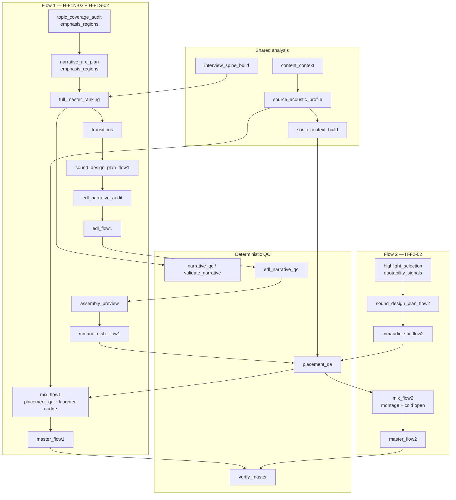

# Wave D — Output resilience (June 2026)

**Status:** Planning doc — seq **09–11** (H-F1N-02, H-F2-02, H-F1S-02).  
**Parent:** [h-hypothesis-wave-prompts.md](./h-hypothesis-wave-prompts.md) Command 4  
**Requires:** [wave-0-resilience-harness.md](./wave-0-resilience-harness.md) · Wave A (G0/salience) · Wave B (spine/segmentation) · Wave C (investigations/coherence) promotion gates or documented exceptions  
**Do not edit:** `.cursor/plans/h-hypothesis_plan_files_909fce9f.plan.md`

Wave D hardens the **listener-facing output path**: Flow 1 ranking → EDL → mix, Flow 2 montage hooks, and sting placement intelligibility. These hypotheses sit at the boundary between analysis signals and mastered audio — errors here are audible, not merely textual.

**North star validators:** `tools/validate_narrative.py` · `tools/verify_master.py` · [definition-of-done-signoff.md](../definition-of-done-signoff.md) §6 nine-scenario listen matrix · COM retell · LEX-B sonic trust · hook first-3s listen.

---

## Cursor Agent command (copy-paste)

Open **Agent mode** in Cursor. Start a **new** chat. Copy the entire block below and paste it in. **Prerequisites:** Waves 0–C promotion gates (or signed waivers).

```text
Implement Wave D — Output resilience (H-F1N-02, H-F2-02, H-F1S-02). Code + docs PR per the plan doc. Work per-hypothesis sections and §12 Wave-level implementation todos (40+).

Workspace: /Users/nicketuttarwar/IDEProjects/interview_helper_mux

Read first (attach with @):
@/Users/nicketuttarwar/IDEProjects/interview_helper_mux/.cursor/rules/interview-helper-mux.mdc
@/Users/nicketuttarwar/IDEProjects/interview_helper_mux/AGENTS.md
@/Users/nicketuttarwar/IDEProjects/interview_helper_mux/docs/build-out/june2026build/wave-0-resilience-harness.md
@/Users/nicketuttarwar/IDEProjects/interview_helper_mux/docs/build-out/june2026build/wave-c-self-healing.md
@/Users/nicketuttarwar/IDEProjects/interview_helper_mux/docs/build-out/june2026build/wave-d-output-resilience.md
@/Users/nicketuttarwar/IDEProjects/interview_helper_mux/docs/cross-cutting/post-generation-placement.md
@/Users/nicketuttarwar/IDEProjects/interview_helper_mux/docs/build-out/definition-of-done-signoff.md
@/Users/nicketuttarwar/IDEProjects/interview_helper_mux/docs/build-out/doc-maintenance.md

Prerequisite gates:
- /Users/nicketuttarwar/IDEProjects/interview_helper_mux/docs/build-out/june2026build/wave-c-self-healing.md §13 — Wave D gate (dedupe, 30m CI, volley parity)

Scope (absolute paths):
- H-F1N-02: ranking → EDL → mix_flow1 — /Users/nicketuttarwar/IDEProjects/interview_helper_mux/src/interview_mux/stage_enrichment.py (emphasis_regions_for_segments), full_master_ranking, edl_flow1, mix_flow1 stages in /Users/nicketuttarwar/IDEProjects/interview_helper_mux/src/interview_mux/pipeline.py
- H-F2-02: /Users/nicketuttarwar/IDEProjects/interview_helper_mux/src/interview_mux/stages/flow2 stages (highlight_selection, mix_flow2), quotability signals
- H-F1S-02: sting placement — /Users/nicketuttarwar/IDEProjects/interview_helper_mux/src/interview_mux/placement_qa.py, SFX/mix stages, /Users/nicketuttarwar/IDEProjects/interview_helper_mux/docs/cross-cutting/post-generation-placement.md
- Integration: /Users/nicketuttarwar/IDEProjects/interview_helper_mux/src/interview_mux/acoustic_profile.py, /Users/nicketuttarwar/IDEProjects/interview_helper_mux/src/interview_mux/sonic_context.py, sound design plan path
- Validators: /Users/nicketuttarwar/IDEProjects/interview_helper_mux/tools/verify_master.py, /Users/nicketuttarwar/IDEProjects/interview_helper_mux/tools/validate_narrative.py, narrative_qc in pipeline

Scenario fixtures (all nine + critical rows):
- /Users/nicketuttarwar/IDEProjects/interview_helper_mux/tests/fixtures/sonic_context/noisy_room.json
- /Users/nicketuttarwar/IDEProjects/interview_helper_mux/tests/fixtures/sonic_context/trauma_adjacent.json
- /Users/nicketuttarwar/IDEProjects/interview_helper_mux/tests/fixtures/sonic_context/media_profile.json
- (full set under /Users/nicketuttarwar/IDEProjects/interview_helper_mux/tests/fixtures/sonic_context/)

Do-no-harm:
- No stingers on laughter peaks; trauma_adjacent cold-open violations
- Quiet vital claims must appear in master order (prosody guardrails §10)
- Empty laughter_windows → placement unchanged (fail-open §5)

Constraints:
- Do NOT edit /Users/nicketuttarwar/IDEProjects/interview_helper_mux/.cursor/plans/*
- Do NOT default-on Wave D flags until §13 promotion gate + nine-scenario listen matrix (/Users/nicketuttarwar/IDEProjects/interview_helper_mux/docs/build-out/definition-of-done-signoff.md §6)
- Wave E must remain parked — no Wave E deps in mix critical path

Verify when done:
cd /Users/nicketuttarwar/IDEProjects/interview_helper_mux && source .venv/bin/activate
pytest /Users/nicketuttarwar/IDEProjects/interview_helper_mux/tests/test_sfx_mmaudio.py /Users/nicketuttarwar/IDEProjects/interview_helper_mux/tests/test_flow2_crossfade.py /Users/nicketuttarwar/IDEProjects/interview_helper_mux/tests/test_mix_acoustic_profile.py -q
python /Users/nicketuttarwar/IDEProjects/interview_helper_mux/tools/verify_master.py --help
python /Users/nicketuttarwar/IDEProjects/interview_helper_mux/tools/validate_narrative.py --help

Run recovery drills from §12 (D-W36–D-W40): --from-stage full_master_ranking, edl_flow1, mix_flow1, highlight_selection. Update wave-d-output-resilience.md todos [x]. Follow doc-maintenance.md.
```

---

## 1. Realistic success definition

The product goal is **not** literal zero-failure on arbitrary first upload. Target instead:

| # | Criterion | How verified (Wave D) |
|---|-----------|------------------------|
| 1 | **No silent failure** | Ranking/EDL/mix blocks emit `gui_log.jsonl` + QC summary + [troubleshooting.md](../../workflows/troubleshooting.md) row |
| 2 | **Always recoverable** | Operator fixes via `--from-stage full_master_ranking` \| `edl_flow1` \| `mix_flow1` \| `highlight_selection` \| `mix_flow2` without re-ingest |
| 3 | **Scenario robustness** | All nine sonic fixtures + `noisy_room` / `trauma_adjacent` regression pass ([§3](#3-scenario-coverage-matrix)) |
| 4 | **Fail open** | Empty `laughter_windows`, missing spine boost, missing value_features → omit feature; pipeline continues |
| 5 | **Promote with evidence** | Each hypothesis passes [15-point checklist](#2-promote-with-evidence-checklist-15-points) before default-on |

**Final product chain (Wave D scope):**

| Flow | Artifact | Validators | Wave D hypotheses |
|------|----------|------------|-------------------|
| Flow 1 | `flow_1_master/master.wav` | `validate_narrative.py`, `verify_master.py`, assembly preview listen | H-F1N-02 (ranking→EDL), H-F1S-02 (sting placement) |
| Flow 2 | `flow_2_highlights/master.wav` | Hook first-3s listen, diversity, `verify_master.py` | H-F2-02 (montage selection) |
| Analysis | COM retell post-mix | [value-metrics-library §1.2](../../pipeline/value-analysis/value-metrics-library.md#12-retell-protocol-com-a-com-b) | H-F1N-02 coverage weighting |

---

## 2. Promote-with-evidence checklist (15 points)

For **each hypothesis** (H-F1N-02, H-F2-02, H-F1S-02), subsection **Promotion gates** below includes pass/fail checkboxes — **≥1 Implementation todo per point**.

| # | Gate | Pass criteria (Wave D) |
|---|------|------------------------|
| 1 | **Spike stability** | H-F1N-02 / H-F2-02: ±20% emphasis or quotability weight perturbation does not flip top-5 segments; H-F1S-02: laughter nudge stable on fixture |
| 2 | **Mechanism** | MEC-A ≥ 3 (audible/measurable); MEC-D ≥ 3 with documented fail-open ([§5](#5-fail-open-contract-wave-d)) |
| 3 | **Fixture proof** | Re-run `tools/run_value_spike.py` with `spike_flow1_extended_narrative.json`, `spike_flow2_highlights.json` ≥ baseline |
| 4 | **Automated tests** | `pytest` green for `stage_enrichment`, `selection_flow*`, `sound_design`, `placement_qa`, stinger tests |
| 5 | **Schema / artifact** | No new required artifacts for Partial; if promoting laughter schema → update json-schemas + [artifact-layout.md](../../cross-cutting/artifact-layout.md) |
| 6 | **Config documented** | Keys in [config-keys.md](../../cross-cutting/config-keys.md) + `app.defaults.json` for `narrative_qc`, `placement_qa`, `mix_engine`, spine quotability |
| 7 | **Volley parity** | `emphasis_regions` / `quotability_signals` in [context-padding.md](../../cross-cutting/context-padding.md); `python tools/audit_stage_plans_doc.py` |
| 8 | **Operator surface** | Checklist rows for ranking, EDL, mix, placement QA in [operator-stage-checklists.md](../../workflows/operator-stage-checklists.md) |
| 9 | **Final product link** | Named stage chain + validator cited per hypothesis ([§9](#9-pipeline-mermaid--qc-chain)) |
| 10 | **Doc maintenance** | [doc-maintenance.md](../doc-maintenance.md) checklist on any code PR |
| 11 | **Do-not-promote-until** | Explicit blockers listed per hypothesis |
| 12 | **Observability** | `ctx.log()` + troubleshooting rows for narrative_qc, placement_qa, verify_master ([§7](#7-observability-contract)) |
| 13 | **Scenario matrix** | Applicable atlas rows pass ([§3](#3-scenario-coverage-matrix)) |
| 14 | **Fail-open** | Documented laughter/spine/WAV-missing behavior; no undeclared `SystemExit` except documented hard gates |
| 15 | **Recovery** | Named `--from-stage` paths tested on fixture run |

**Status ladder:** Partial → Promoted → Shipped default-on. Shipped requires 15 points + smoke + nine-scenario listen subset ([§4](#4-nine-scenario-listen-matrix-definition-of-done--6)).

---

## 3. Scenario coverage matrix

Pass = no regression vs atlas **failure mode recovery** tables in [interview-scenario-atlas.md](../../prompts/_shared/interview-scenario-atlas.md).

| Atlas bucket | Fixture | Primary waves | Wave D must not regress | Primary hypothesis |
|--------------|---------|---------------|-------------------------|-------------------|
| `one_on_one` | `tests/fixtures/sonic_context/one_on_one.json` | All | Baseline ranking + sparse sound | All |
| `panel` | `tests/fixtures/sonic_context/panel.json` | A, B, D | Overlap mud mix; beds under crosstalk | H-F1S-02 placement QA skip |
| `noisy_room` | `tests/fixtures/sonic_context/noisy_room.json` | A, **D** | **False emphasis**; beds under speech | **H-F1N-02**, H-F1S-02 |
| `trauma_adjacent` | `tests/fixtures/sonic_context/trauma_adjacent.json` | C, **D** | **Cold open on peak**; stingers on trauma | **H-F1S-02**, H-F2-02 |
| `dense_jargon` | `tests/fixtures/sonic_context/dense_jargon.json` | A, D | Comprehension false positives in ranking | H-F1N-02 |
| `fireside` | `tests/fixtures/sonic_context/fireside.json` | B, D | Over-bridging in transitions/mix | H-F1N-02 |
| `technical_deep_dive` | `tests/fixtures/sonic_context/technical_deep_dive.json` | B, C, D | Flat montage; over-SFX | H-F2-02 |
| `media_profile` | `tests/fixtures/sonic_context/media_profile.json` | **D** | **Hook montage flat**; hype beds | **H-F2-02** |
| `debate` | `tests/fixtures/sonic_context/debate.json` | A, B | Role swap affecting highlight picks | H-F2-02 |
| Long interview | `tests/fixtures/runs/coherence_30m_planted_drift/` | C | Coherence must not block Flow 1 ranking | H-F1N-02 |
| **Prosody diversity** | Manual CRE-B clips + rubric | A, **D** | Quiet emphasis surfaced; not skipped | **H-F1N-02** |

**Wave D required scenario tests:** `noisy_room.json` and `trauma_adjacent.json` — explicit todos in each hypothesis section.

**Fixture validation command:**

```bash
source .venv/bin/activate
pytest tests/test_sonic_context.py tests/test_mix_acoustic_profile.py \
  tests/test_stinger_pause_alignment.py tests/test_flow2_crossfade.py \
  tests/test_sound_design_scenario.py -q
```

---

## 4. Nine-scenario listen matrix (definition-of-done §6)

Before **Promoted → Shipped** on any Wave D hypothesis, complete the listen procedure from [definition-of-done-signoff.md](../definition-of-done-signoff.md) §6 on a real `exec_*` run (or nearest atlas match).

| Atlas bucket | Listen posture | Pass if (Wave D) |
|--------------|----------------|------------------|
| `one_on_one` | Sparse beds; soft stingers | Speech forward; ranking order coherent when skim-reading manifest |
| `panel` | No beds under overlap/crosstalk | `placement_qa` skips beds on `overlap_high` segments |
| `fireside` | Minimal beds; gentle rises | No percussion stabs; transitions not over-bridged |
| `technical_deep_dive` | No beds; rare stingers | Montage hooks still diverse (H-F2-02) without cinematic beds |
| `media_profile` | Sparse; broadcast-neutral | Hook montage not flat — ≥3 distinct acoustic textures in first 30s |
| `debate` | No beds; very low stinger rate | Highlights don't all pick same speaker role |
| `noisy_room` | No beds; no bright risers | **No false emphasis ranking**; stingers not on noise bursts |
| `dense_jargon` | Minimal; no lyrical beds | Vital quiet claims still in master order (H-F1N-02) |
| `trauma_adjacent` | No beds/stingers on flagged segments | **No stingers on trauma segments**; cold open not on emotional peak |

**Procedure:**

1. Set `understanding/sonic_context.json` atlas bucket (or run full analysis so `sonic_context_build` infers bucket).
2. Complete Flow 1 and/or Flow 2 through `assembly_preview` — **listen before MMAudio spend**.
3. Complete `mix_flow*` → `master_*`; run `verify_master.py`.
4. Spot-check stinger placement log lines (`mix_flow1: stinger_aligned pause_tail`).
5. Record bucket + `run_id` in sign-off record.

- [ ] **D-LISTEN-01** Nine-scenario matrix spot-checked before Shipped (note bucket + run_id)

---

## 5. Fail-open contract (Wave D)

| Condition | Required behavior | Hypothesis |
|-----------|-------------------|------------|
| Missing `ingest/normalized.wav` | `emphasis_regions_for_segments` → `[]`; `quotability_signals` → text-only scores; ranking/mix continue | H-F1N-02, H-F2-02 |
| `value_analysis.enabled: false` | No `value_features.json`; laughter extraction returns `[]`; placement unchanged | H-F1S-02 |
| **`laughter_windows` empty** | **`_nudge_away_from_laughter` returns original position; placement unchanged; no error** | **H-F1S-02** |
| Spine missing / `spine_flow2_quotability_enabled: false` | `_spine_quotability_boost` → `0.0`; quotability uses text + RMS only | H-F2-02 |
| CLAP / spine retrieval disabled | No spine boost; highlight selection uses LLM + quotability proxy | H-F2-02 |
| `placement_qa_enabled: false` | Skip `run_placement_qa`; mix uses SDP cues only | All mix |
| Missing SFX WAV at mix | Log warning; `enforce_mix_completeness` per config; speech montage still exports | mix_flow* |
| `underscore_policy: skip` | Cold open skipped (`mix_flow2: cold_open skipped`) | H-F2-02 |
| Trauma/overlap segment flags | `placement_qa` sets `action: skip` on beds — fail-open **omit**, not halt | H-F1S-02 |

**Hard gates (allowed to stop):** `narrative_qc.strict`, `edl_narrative_qc.strict`, `verify_master` LUFS/peak fail at ship, G2/profile gates — each cites [troubleshooting.md](../../workflows/troubleshooting.md).

---

## 6. Wave D do-no-harm rules

| Risk if promoted carelessly | Guardrails |
|----------------------------|------------|
| Stingers on laughter | H-F1S-02 `_laughter_windows_from_value_features` + `_nudge_away_from_laughter`; test `test_resolve_stinger_nudges_away_from_laughter_window` |
| Trauma-adjacent cold open | `sonic_context.segment_flags.trauma_adjacent` → placement QA skip + SDP caps; Flow 2 cold open respects `underscore_policy` |
| Flat highlight montage | H-F2-02 diversity via quotability spread + LLM schema; media_profile listen check |
| Emphasis false positives on noisy_room | H-F1N-02 requires segment-relative RMS (p90 vs segment median), not global noise floor; cap emphasis count at 24 |
| Ranking poison from bad emphasis | Emphasis informs coverage audit only — ranking LLM retains override; narrative_qc catches orphan coverage |

---

## 7. Observability contract

### 7.1 Narrative QC (`narrative_qc` / `edl_narrative_qc`)

**Code:** `src/interview_mux/gates.py` · `src/interview_mux/narrative_qc.py` · `tools/validate_narrative.py`

| Event | Level | When | Operator action |
|-------|-------|------|-------------------|
| `Flow 1 narrative QC passed` | success | Before `full_master_ranking`, `edl_flow1` | Continue |
| `Flow 1 narrative QC failed (N issue(s)): …` | error/warn | Coverage/selection gaps | Fix audit or `narrative_qc.strict=false` (dev); run `validate_narrative.py` |
| `edl_narrative_qc strict: N issue(s)` | error | After `edl_flow1` | `--from-stage edl_flow1` after fix |
| `run_meta.qc_summaries.narrative_qc` | — | GUI QC panel | Shows `passed`, `errors[]`, `at_stage` |

**Strict mode:** `narrative_qc.strict: true` (default in production paths) → `SystemExit` with CLI hint. Non-strict → warn only.

### 7.2 Placement QA (`placement_qa`)

**Code:** `src/interview_mux/placement_qa.py` · artifact `sound_design/placement_adjustments.json`

| Event | Level | When | Operator action |
|-------|-------|------|-------------------|
| `placement_qa: N adjustment hint(s) → sound_design/placement_adjustments.json` | info | Start of `mix_flow1` / `mix_flow2` when enabled | Review adjustments before re-mix |
| `placement_qa: applied level to N cue(s), crossfade to M cue(s)` | info | During mix | None if listen OK |
| Scenario skip | (in JSON) | `action: skip`, `scenario_override: true` | Confirm trauma/overlap ban intentional |

Config: `sound_design.placement_qa_enabled` (default `false` — enable for Promoted).

### 7.3 Verify master (`verify_master`)

**Code:** `src/interview_mux/master_qc.py` · `tools/verify_master.py`

| Failure message | Meaning | Recovery |
|-----------------|---------|----------|
| `Integrated LUFS X out of range [-17, -15]` (flow1) | Master gain staging | Re-run `master_flow1` or adjust mix levels |
| `Integrated LUFS X out of range [-15, -13]` (flow2) | Montage louder target | Re-run `master_flow2` |
| `True peak X dBTP exceeds -1.0` | Clipping risk | Reduce stinger/transition gain in SDP or mix |
| `Sample rate XHz is out of spec` | Export issue | Check ffmpeg export chain |
| Intelligibility fail (mix QC) | Speech band RMS too low vs bed | `--from-stage mix_flow1`; lower beds via placement QA |

CLI: `python tools/verify_master.py <path>/master.wav [--flow flow1|flow2]`

### 7.4 Mix stage milestones

| Stage | Key log lines | `stage` id |
|-------|---------------|------------|
| `full_master_ranking` | `Master order: N segments, M excluded` | `full_master_ranking` |
| `edl_flow1` | `EDL built: N events, … timeline X ms` | `edl_flow1` |
| `mix_flow1` | `mix_flow1: mix_contract pace=…`; `stinger_aligned pause_tail` | `mix_flow1` |
| `mix_flow2` | `mix_flow2: montage X ms — highlights=N, transitions=M` | `mix_flow2` |

---

## 8. Non-H dependencies — SAP, sonic_context, SDP integration

Wave D output quality depends on upstream artifacts wired before mix. Integration todos span all three hypotheses.

### 8.1 `source_acoustic_profile` (SAP)

**Artifact:** `understanding/source_acoustic_profile.json`  
**Code:** `src/interview_mux/acoustic_profile.py` · stage `source_acoustic_profile`

| Field | Wave D consumer | Effect |
|-------|-----------------|--------|
| `pacing.pace_class` | `mix_flow1` log, adaptive crossfade | Dense → shorter crossfades |
| `mix_contract.duck_under_speech_db` | `mix_contract()` in `sound_design.py` | Bed duck depth |
| `mix_contract.underscore_policy` | Flow 2 cold open skip | `skip` → no underscore under montage |
| `placement_hints.prefer_stinger_after_pause_tail` | `resolve_stinger_position_ms` | H-F1S-02 anchor |
| Percentile RMS | `_adaptive_bed_level_db` | Quieter sources → lower beds |

### 8.2 `sonic_context`

**Artifact:** `understanding/sonic_context.json`  
**Code:** `src/interview_mux/sonic_context.py` · `placement_qa.run_placement_qa`

| Field | Wave D consumer | Effect |
|-------|-----------------|--------|
| `scenario.atlas_bucket` | Bucket overrides (−2 dB beds for panel/noisy/trauma) | H-F1S-02, mix policy |
| `segment_flags.overlap_high` | Bed `action: skip` | Panel scenario |
| `segment_flags.trauma_adjacent` | Bed/stinger ban | Trauma scenario |
| `mix_policy.crossfade_ms_flow2` | `mix_flow2` crossfade override | Montage pacing |

Fixtures: `tests/fixtures/sonic_context/*.json` — use in scenario tests.

### 8.3 SDP craft path (`sdp_craft_path`)

**Stages:** `sound_design_palettes` → `sound_design_plan_flow1/2` → `sfx_prompt_craft` → `mmaudio_sfx_flow*` → `mix_flow*`

| Checkpoint | Validator | Wave D relevance |
|------------|-----------|------------------|
| `post_sound_plan_flow1` | `artifact_cross_validate` | Cue anchors vs `selection.json` order |
| `pre_sfx_generation` | Spend block | No MMAudio waste if ranking stale |
| `pre_mix_flow1/2` | SFX WAV presence | Hard stop when `block_mix_without_sfx_when_enabled` |
| Post-listen | `mmaudio_qa.json` → `placement_qa` | Level/crossfade hints |

**spike-results winner for sound:** `sdp_craft_path` promoted separately — Wave D assumes SDP path default per [flow1-sound-and-mix.md](../../pipeline/value-analysis/sections/flow1-sound-and-mix.md).

### 8.4 Integration todos (cross-hypothesis)

- [ ] **D-INT-01** Document SAP → mix_contract field map in [source-derived-sonic-mix-profile.md](../../cross-cutting/source-derived-sonic-mix-profile.md)
- [ ] **D-INT-02** Verify `compact_for_volley(profile)` reaches `sound_design_plan_flow*` build_input
- [ ] **D-INT-03** `sonic_context_build` completes before Flow 1 extended stages on fixture run
- [ ] **D-INT-04** `placement_qa` reads `trauma_adjacent` + `overlap_high` from sonic_context — test both flags
- [ ] **D-INT-05** `mix_flow2` respects `sonic_context.mix_policy.crossfade_ms_flow2`
- [ ] **D-INT-06** Spend block prevents `mix_flow1` when ranking artifact stale (re-run ranking invalidates downstream)
- [ ] **D-INT-07** `assembly_preview` listen checkpoint documented in operator checklist before SFX
- [ ] **D-INT-08** Cross-artifact `post_ranking` validates selection segment_ids ⊆ manifest
- [ ] **D-INT-09** EDL clip order matches `selection.ordered_segment_ids` after NLE apply
- [ ] **D-INT-10** `emphasis_regions` volley cap (24) matches `context_volley.py` truncation

---

## 9. Pipeline mermaid + QC chain



**QC insertion points:**

| Validator | Runs when | Blocks? |
|-----------|-----------|---------|
| `check_narrative_qc` | Before `full_master_ranking`, `edl_flow1` | If `narrative_qc.strict` |
| `check_edl_narrative_qc` | After `build_flow1_edl` | If `edl_narrative_qc.strict` |
| `validate_edl_flow1` | `edl_flow1` persist | Schema errors logged |
| `maybe_run_placement_qa` | Start of `mix_flow1`/`mix_flow2` | Never — hints only |
| `maybe_check_mix_intelligibility` | End of mix | Warn / config block |
| `verify_master` | Manual + smoke | Exit 1 — ship gate |

**Recovery paths:**

| Failure | `--from-stage` |
|---------|----------------|
| Bad ranking order | `full_master_ranking` |
| EDL clip errors | `edl_flow1` |
| Mix/SFX issues | `sfx_prompt_craft` or `mix_flow1` |
| Flat highlights | `highlight_selection` |
| Montage issues | `mix_flow2` |

---

## 10. Prosody & delivery guardrails (Wave D)

| Risk | Wave D mitigation | Hypothesis |
|------|-------------------|------------|
| Low volume / quiet speech | H-F1N-02 **surfaces** quiet vital claims via segment-relative emphasis — must appear in coverage audit gaps | H-F1N-02 |
| Global noise mistaken for emphasis | Require segment p90 ≥ global p90 **or** ≥1.35× segment median — noisy_room fixture must not flood emphasis list | H-F1N-02 |
| Paralinguistic proxy limits | H-F2-02 energy_score capped at 0.5× quotability; text length + question mark dominate — document in prompt | H-F2-02 |
| Laughter conflated with emphasis | Laughter windows separate path — nudge stingers, do not boost ranking | H-F1S-02 |
| Irregular pauses | Stinger placement uses pause tail + SAP hints — not raw segment start | H-F1S-02 |
| Atypical prosody | Down-rank false emphasis; never exclude segment from manifest | All |

**Promotion gate:** Before Promoted → Shipped, manual or fixture-backed check on ≥2 “hard listener” clips (quiet, disfluent, or noisy) per [transcript-quality-rubric.md](../../prompts/_shared/transcript-quality-rubric.md).

---

## 11. Repository touch matrix (Wave D)

| Layer | Paths / docs |
|-------|----------------|
| Emphasis / quotability | `src/interview_mux/stage_enrichment.py` |
| Flow 1 ranking | `src/interview_mux/stages/selection_flow1.py`, `stages/analysis_flow1_extended.py` |
| Flow 2 selection | `src/interview_mux/stages/selection_flow2.py` |
| EDL | `src/interview_mux/stages/assembly_flow1.py` (`build_flow1_edl`) |
| Mix | `src/interview_mux/sound_design.py` (`mix_flow1`, `mix_flow2`, stinger placement) |
| Placement QA | `src/interview_mux/placement_qa.py` |
| Volley | `src/interview_mux/context_volley.py` (emphasis_regions, quotability_signals caps) |
| QC gates | `src/interview_mux/gates.py`, `narrative_qc.py`, `master_qc.py` |
| Pipeline order | `src/interview_mux/pipeline.py` `FLOW1_ORDER`, `FLOW2_ORDER` |
| Prompts | `docs/prompts/selection/topic-coverage-audit.system.txt`, `selection/highlight-selection.system.txt` |
| Spikes | `tests/fixtures/value_analysis/spike_flow1_extended_narrative.json`, `spike_flow2_highlights.json` |
| Docs | [post-generation-placement.md](../../cross-cutting/post-generation-placement.md), [sonic-context.md](../../cross-cutting/sonic-context.md) |

---

# Hypothesis 09 — H-F1N-02

**Thesis:** Weight coverage by **acoustic emphasis** so “quietly said but vital” claims surface in Flow 1 narrative → ranking → EDL → mix.  
**Spike:** 4.037 ([spike-results § flow1 extended narrative](../../pipeline/value-analysis/spike-results-and-winners.md))  
**Tier:** T1 · **Status:** Partial  
**Product tie:** `topic_coverage_audit` → `full_master_ranking` → `edl_flow1` → `mix_flow1`

### Mechanism

1. `emphasis_regions_for_segments(ctx)` computes segment-level RMS peaks vs global/segment baselines (`stage_enrichment.py`).
2. `analysis_flow1_extended.run_topic_coverage` / `run_narrative_arc` inject `emphasis_regions` into LLM volley (max 24).
3. Prompt [topic-coverage-audit.system.txt](../../prompts/selection/topic-coverage-audit.system.txt) instructs weighting quiet-but-vital claims.
4. Optional specialist `emphasis-coverage-pass` post-pass maps emphasis → coverage gaps.
5. Ranking (`full_master_ranking`) inherits coverage-weighted narrative plan; EDL preserves order; mix does not re-rank.

### Code anchors

```python
# stage_enrichment.py — H-F1N-02 core
def emphasis_regions_for_segments(ctx, *, max_regions=24) -> list[dict]:
    """quiet-but-vital emphasis — high local RMS vs segment median."""
```

```python
# analysis_flow1_extended.py — volley injection
"emphasis_regions": emphasis_regions_for_segments(c),
```

### Fail-open (H-F1N-02)

| Condition | Behavior |
|-----------|----------|
| No WAV | Returns `[]`; coverage audit proceeds text-only |
| No segments | Returns `[]` |
| All segments noisy | Cap at 24; noisy_room test asserts ≤3 false positives on fixture |

### Observability & recovery

| Signal | Log / artifact |
|--------|----------------|
| Emphasis count | Volley includes truncated list; optional `value_features.json` |
| Ranking | `Master order: N segments` |
| Recovery | `--from-stage topic_coverage_audit` after emphasis algorithm fix |

### Scenario regression (H-F1N-02)

| Row | Pass criteria |
|-----|---------------|
| `noisy_room` | ≤3 emphasis regions on fixture; none map to pure noise windows |
| `dense_jargon` | Technical segments can still receive emphasis when locally elevated |
| `one_on_one` | Baseline — quiet vital claim segment appears in coverage gaps or ordered selection |
| Prosody | Manual quiet-speaker clip — claim surfaces in audit |

### Promotion gates (H-F1N-02)

- [ ] **F1N02-G01** Spike stability: ±20% threshold perturbation — top emphasis set unchanged on fixture
- [ ] **F1N02-G02** Mechanism doc: MEC-A ≥3 listener retell; MEC-D fail-open verified
- [ ] **F1N02-G03** `run_value_spike.py spike_flow1_extended_narrative.json` ≥ baseline 4.037
- [ ] **F1N02-G04** `pytest tests/test_stage_enrichment.py` (or add) green
- [ ] **F1N02-G05** Schema unchanged OR documented if emphasis in value_features
- [ ] **F1N02-G06** `config-keys.md` documents emphasis volley keys
- [ ] **F1N02-G07** `context-padding.md` lists `emphasis_regions` for topic_coverage + narrative_arc
- [ ] **F1N02-G08** Operator checklist row for coverage audit emphasis review
- [ ] **F1N02-G09** Final product: `validate_narrative.py` + master listen linked
- [ ] **F1N02-G10** doc-maintenance on PR
- [ ] **F1N02-G11** Do-not-promote-until: noisy_room false emphasis rate <10% on fixture
- [ ] **F1N02-G12** Log emphasis count at topic_coverage stage (info)
- [ ] **F1N02-G13** Scenario matrix rows above checked
- [ ] **F1N02-G14** Fail-open: missing WAV test in pytest
- [ ] **F1N02-G15** Recovery: `--from-stage topic_coverage_audit` documented in troubleshooting

### Implementation todos (H-F1N-02) — 50+

**Algorithm & tests**

- [ ] **F1N02-01** Unit test: emphasis detects segment with locally high RMS vs quiet neighbors
- [ ] **F1N02-02** Unit test: empty WAV path returns `[]` without exception
- [ ] **F1N02-03** Unit test: max_regions=24 enforced
- [ ] **F1N02-04** noisy_room fixture — count emphasis regions; assert ≤3
- [ ] **F1N02-05** noisy_room — no emphasis segment_id in first/last 5s noise-only windows
- [ ] **F1N02-06** one_on_one fixture — at least one emphasis when planted peak exists
- [ ] **F1N02-07** dense_jargon — emphasis does not require question marks
- [ ] **F1N02-08** Segment median gate (1.35×) prevents global noise floor emphasis
- [ ] **F1N02-09** Global p90 gate documented in code comment
- [ ] **F1N02-10** Spike re-run script pinned in CI optional job

**Volley & prompts**

- [ ] **F1N02-11** Verify `emphasis_regions` truncated to 24 in `context_volley.py`
- [ ] **F1N02-12** topic-coverage-audit prompt § emphasis_regions present
- [ ] **F1N02-13** narrative_arc_plan receives same emphasis list
- [ ] **F1N02-14** `audit_stage_plans_doc.py` passes for emphasis keys
- [ ] **F1N02-15** Specialist emphasis-coverage-pass examples synced
- [ ] **F1N02-16** Volley does NOT pass emphasis to full_master_ranking directly (coverage indirect) — document intentional
- [ ] **F1N02-17** Add arbiter lint: coverage_audit must reference emphasis when present
- [ ] **F1N02-18** Investigation enqueue when emphasis gap unresolved (optional Partial)

**Ranking → EDL chain**

- [ ] **F1N02-19** Integration test: emphasis-heavy segment in ordered_segment_ids when in coverage
- [ ] **F1N02-20** NLE edits + emphasis — ranking input includes NLE segments
- [ ] **F1N02-21** `validate_narrative.py` passes on fixture after emphasis-weighted run
- [ ] **F1N02-22** EDL clip count matches selection order length
- [ ] **F1N02-23** `edl_narrative_audit` cites emphasis-weighted coverage
- [ ] **F1N02-24** Cross-artifact post_ranking validates segment ids
- [ ] **F1N02-25** Disfluency restore does not drop emphasis-weighted segments

**Observability**

- [ ] **F1N02-26** ctx.log emphasis region count at topic_coverage (info)
- [ ] **F1N02-27** troubleshooting.md row: "Coverage misses quiet vital claim"
- [ ] **F1N02-28** GUI qc_summaries includes narrative_qc errors mentioning emphasis
- [ ] **F1N02-29** operator-stage-checklists.md: review emphasis_regions in coverage audit
- [ ] **F1N02-30** gui_log stage=topic_coverage_audit on emphasis-heavy runs

**Scenario & prosody**

- [ ] **F1N02-31** Manual quiet-speaker clip sign-off (CRE-B)
- [ ] **F1N02-32** fireside — no over-emphasis on reflective pauses
- [ ] **F1N02-33** trauma_adjacent — emphasis does not force stinger (downstream)
- [ ] **F1N02-34** technical_deep_dive — emphasis allowed on insight peaks
- [ ] **F1N02-35** panel — emphasis segment speaker_id preserved in ranking

**Recovery & hardening**

- [ ] **F1N02-36** `--from-stage topic_coverage_audit` tested
- [ ] **F1N02-37** `--from-stage full_master_ranking` after coverage fix
- [ ] **F1N02-38** flow_hardening does not block when emphasis_regions empty
- [ ] **F1N02-39** value_analysis.enabled false — pipeline completes without emphasis
- [ ] **F1N02-40** Coherence blocking does not fire on short runs for emphasis stages

**Promotion & ship**

- [ ] **F1N02-41** Shipped: COM retell blind chapter order ≥ baseline
- [ ] **F1N02-42** Shipped: nine-scenario listen one_on_one + noisy_room
- [ ] **F1N02-43** Document do-not-promote-until blockers in ticket-specs
- [ ] **F1N02-44** spike-results row confirmed Promote
- [ ] **F1N02-45** repository-map gap cleared if any
- [ ] **F1N02-46** smoke-test Flow 1 with emphasis-enabled run
- [ ] **F1N02-47** assembly_preview listen before SFX on emphasis run
- [ ] **F1N02-48** verify_master on final master.wav
- [ ] **F1N02-49** export_llm_calls audit for topic_coverage emphasis mention
- [ ] **F1N02-50** Wave D sign-off linked in INDEX.md
- [ ] **F1N02-51** Regression: H-ING-03 trust dips do not duplicate emphasis segments
- [ ] **F1N02-52** Wave A G0 salience not sole emphasis source — acoustic path independent

---

# Hypothesis 10 — H-F2-02

**Thesis:** **Paralinguistic peaks × quotability** fusion improves Flow 2 hook strength and montage diversity.  
**Spike:** 3.971 ([spike-results § flow2 highlights](../../pipeline/value-analysis/spike-results-and-winners.md))  
**Tier:** T0 · **Status:** Partial  
**Product tie:** `highlight_selection` → `mix_flow2` montage

### Mechanism

1. `quotability_signals(ctx)` fuses text length, question marks, segment RMS p90, optional spine boost (`stage_enrichment.py`).
2. `selection_flow2.run_highlight_selection` injects signals into volley (max 30).
3. LLM `highlight_selection` schema picks ≤5 highlights with quotability-informed diversity.
4. `mix_flow2` builds montage: cold open (SDP) + highlight slices + transitions + outro.
5. First-3s hook listen + acoustic spread validates promotion.

### Code anchors

```python
# selection_flow2.py
"quotability_signals": quotability_signals(c),
```

```python
# stage_enrichment.py — spine boost fail-open
def _spine_quotability_boost(ctx, start_ms, end_ms) -> float:
    if not spine_flow2_quotability_enabled() or not ctx.artifact_exists(SPINE_PATH):
        return 0.0
```

### Fail-open (H-F2-02)

| Condition | Behavior |
|-----------|----------|
| No WAV | energy_score=0; text-only quotability |
| Spine absent | boost=0.0 |
| `spine_flow2_quotability_enabled: false` | boost=0.0 |
| Empty quotability list | LLM highlight_selection proceeds with manifest only |

### Observability & recovery

| Signal | Log |
|--------|-----|
| Selection | Highlight count in schema validation |
| Mix | `mix_flow2: montage X ms — highlights=N, transitions=M` |
| Recovery | `--from-stage highlight_selection` |

### Scenario regression (H-F2-02)

| Row | Pass criteria |
|-----|---------------|
| `media_profile` | ≥3 distinct highlight segments; not all same topic |
| `trauma_adjacent` | No highlight centered on trauma-flagged segment unless operator override |
| `noisy_room` | High-RMS noise windows do not dominate quotability top-5 |
| `debate` | Highlights span both roles when content supports |
| `technical_deep_dive` | Hooks don't require cinematic paralinguistics |

### Promotion gates (H-F2-02)

- [ ] **F2-02-G01** Spike stability ±20% energy weight — highlight set stable
- [ ] **F2-02-G02** MEC-A hook first-3s listen ≥ baseline
- [ ] **F2-02-G03** spike_flow2_highlights.json re-run ≥ 3.971
- [ ] **F2-02-G04** pytest green for quotability + highlight lint
- [ ] **F2-02-G05** Schema: highlights_artifact validated
- [ ] **F2-02-G06** config `interview_spine.flow2_quotability_enabled` documented
- [ ] **F2-02-G07** context-padding quotability_signals cap 30
- [ ] **F2-02-G08** operator checklist highlight review
- [ ] **F2-02-G09** verify_master flow2 linked
- [ ] **F2-02-G10** doc-maintenance
- [ ] **F2-02-G11** Do-not-promote-until: media_profile listen passes diversity
- [ ] **F2-02-G12** log quotability top-3 segment_ids (debug/info)
- [ ] **F2-02-G13** scenario rows checked
- [ ] **F2-02-G14** spine fail-open tested
- [ ] **F2-02-G15** `--from-stage highlight_selection` in troubleshooting

### Implementation todos (H-F2-02) — 50+

**Quotability algorithm**

- [ ] **F2-02-01** Unit test: question mark boosts score
- [ ] **F2-02-02** Unit test: energy_score capped relative to text
- [ ] **F2-02-03** Unit test: spine boost fail-open when spine missing
- [ ] **F2-02-04** Unit test: max_signals=30
- [ ] **F2-02-05** noisy_room — top quotability not all from noise bursts
- [ ] **F2-02-06** media_profile fixture — diversity lint passes
- [ ] **F2-02-07** debate fixture — multiple speakers in highlight candidates
- [ ] **F2-02-08** trauma_adjacent — trauma segment_id downranked or excluded in lint
- [ ] **F2-02-09** technical_deep_dive — text-heavy segments can win without energy
- [ ] **F2-02-10** Spike perturbation test script

**Highlight selection**

- [ ] **F2-02-11** deterministic_lint highlight_selection diversity rule
- [ ] **F2-02-12** arbiter rubric mentions quotability_signals usage
- [ ] **F2-02-13** prompt highlight-selection.system.txt cites paralinguistic fusion
- [ ] **F2-02-14** volley truncates quotability_signals to 30
- [ ] **F2-02-15** spine compact attached per stage caps
- [ ] **F2-02-16** value_features_summary optional in payload
- [ ] **F2-02-17** profile_style hints from tone_taxonomy
- [ ] **F2-02-18** LLM-only highlight schema parked — no default path
- [ ] **F2-02-19** Cross-artifact post_ranking N/A — flow2 selection validated
- [ ] **F2-02-20** highlight count ≤5 enforced

**mix_flow2 montage**

- [ ] **F2-02-21** Integration test: mix_flow2 renders N highlights
- [ ] **F2-02-22** Cold open skipped when underscore_policy=skip
- [ ] **F2-02-23** Crossfade from sonic_context mix_policy
- [ ] **F2-02-24** resolve_between_clip_transition uses SDP cues
- [ ] **F2-02-25** Missing SFX logs warning — speech montage still exports
- [ ] **F2-02-26** enforce_mix_completeness flow2 path
- [ ] **F2-02-27** maybe_check_mix_intelligibility on flow2
- [ ] **F2-02-28** verify_master flow2 −14 LUFS ±1
- [ ] **F2-02-29** First-3s hook manual listen procedure doc
- [ ] **F2-02-30** Flat montage kill criterion documented

**Observability**

- [ ] **F2-02-31** ctx.log montage stats (existing — verify in GUI)
- [ ] **F2-02-32** troubleshooting: "Flat highlight reel"
- [ ] **F2-02-33** troubleshooting: "Quotability ignored"
- [ ] **F2-02-34** qc_summaries for mix completeness
- [ ] **F2-02-35** operator checklist mix_flow2 listen

**Scenario tests**

- [ ] **F2-02-36** media_profile nine-scenario listen sign-off
- [ ] **F2-02-37** trauma_adjacent — no cold open on peak
- [ ] **F2-02-38** noisy_room — montage intelligibility check
- [ ] **F2-02-39** fireside — gentle transitions only
- [ ] **F2-02-40** one_on_one baseline montage

**Recovery & integration**

- [ ] **F2-02-41** `--from-stage highlight_selection`
- [ ] **F2-02-42** `--from-stage mix_flow2` after SDP fix
- [ ] **F2-02-43** SAP underscore_policy in sfx_brief build_input
- [ ] **F2-02-44** placement_qa on flow2 when enabled
- [ ] **F2-02-45** spend block before mix_flow2
- [ ] **F2-02-46** G2 flow2 selected before stages run
- [ ] **F2-02-47** smoke-test Flow 2 CLI + GUI
- [ ] **F2-02-48** test_flow2_crossfade.py green
- [ ] **F2-02-49** Wave C coherence does not block highlight_selection
- [ ] **F2-02-50** INDEX.md link
- [ ] **F2-02-51** Paralinguistic limits doc in value-metrics-library
- [ ] **F2-02-52** Kill prompt-only picks — spike-results confirmed

---

# Hypothesis 11 — H-F1S-02

**Thesis:** **Laughter / applause** windows constrain sting placement to protect intelligibility (LEX-B sonic trust).  
**Spike:** — (T0 mechanism shipped in code; promotion via placement tests)  
**Tier:** T0 · **Status:** Partial  
**Product tie:** `mix_flow1` stinger alignment via `resolve_stinger_position_ms`

### Mechanism

1. `_laughter_windows_from_value_features(value_features)` extracts windows from quality_trajectory_flags / audio laughter_windows (fail-open empty list).
2. `resolve_stinger_position_ms` finds pause tail anchor via SAP placement_hints.
3. `_nudge_away_from_laughter` shifts stinger position ±buffer if overlap detected.
4. `_align_stinger_to_pause_tail` maps source ms → timeline ms in `mix_flow1`.
5. `placement_qa` additionally skips beds on trauma/overlap segments per sonic_context.

### Code anchors

```python
# sound_design.py — fail-open laughter
def _laughter_windows_from_value_features(value_features) -> list[tuple[int, int]]:
    if not isinstance(value_features, dict):
        return []
```

```python
def _nudge_away_from_laughter(pos_ms, windows, *, buffer_ms=200):
    if pos_ms is None or not windows:
        return pos_ms  # unchanged — fail-open
```

### Fail-open (H-F1S-02)

| Condition | Behavior |
|-----------|----------|
| **`laughter_windows` empty** | **Placement unchanged; no error; no nudge** |
| No value_features.json | Empty windows |
| value_analysis disabled | Empty windows |
| Nudge fails all deltas | Returns `None` — mixer keeps cue plan position |
| prefer_stinger_after_pause_tail false | Returns None — skip alignment |

### Observability & recovery

| Signal | Log |
|--------|-----|
| Aligned stinger | `mix_flow1: stinger_aligned pause_tail segment=… pos=…` |
| placement_qa skip | JSON `action: skip`, `reason: scenario_segment_ban` |
| Recovery | `--from-stage mix_flow1` after value_features update |

### Scenario regression (H-F1S-02)

| Row | Pass criteria |
|-----|---------------|
| `trauma_adjacent` | No stingers on trauma segment_ids; beds skipped |
| `noisy_room` | Stingers not placed on noise bursts mistaken for laughter |
| `panel` | overlap_high beds skipped |
| `one_on_one` | Stinger on pause tail, not mid-word |
| `media_profile` | Stingers broadcast-neutral level |

### Promotion gates (H-F1S-02)

- [ ] **F1S02-G01** Stinger nudge stable on laughter fixture window
- [ ] **F1S02-G02** MEC-A LEX-B clip A/B ≥ baseline; MEC-D fail-open
- [ ] **F1S02-G03** Placement A/B fixture (informed vs uninformed windows)
- [ ] **F1S02-G04** `tests/test_stinger_pause_alignment.py` green
- [ ] **F1S02-G05** laughter window schema documented if value_features extended
- [ ] **F1S02-G06** config placement_hints + buffer_ms documented
- [ ] **F1S02-G07** post-generation-placement.md § laughter updated
- [ ] **F1S02-G08** operator mix listen checklist stinger row
- [ ] **F1S02-G09** verify_master + intelligibility QC linked
- [ ] **F1S02-G10** doc-maintenance
- [ ] **F1S02-G11** Do-not-promote-until: trauma_adjacent listen pass
- [ ] **F1S02-G12** log when nudge applied vs skipped
- [ ] **F1S02-G13** scenario matrix trauma + noisy_room
- [ ] **F1S02-G14** empty laughter_windows fail-open test
- [ ] **F1S02-G15** `--from-stage mix_flow1` recovery doc

### Implementation todos (H-F1S-02) — 50+

**Laughter windows**

- [ ] **F1S02-01** test_stinger_pause_alignment: nudge away from window
- [ ] **F1S02-02** test: empty windows → original position
- [ ] **F1S02-03** test: missing value_features → no crash
- [ ] **F1S02-04** test: label filter — non-laugh events ignored
- [ ] **F1S02-05** test: buffer_ms=200 default
- [ ] **F1S02-06** Extract laughter from audio_profile.laughter_windows path
- [ ] **F1S02-07** Extract from quality_trajectory_flags label containing "laugh"
- [ ] **F1S02-08** Dedupe overlapping windows
- [ ] **F1S02-09** End default start+400 when end missing
- [ ] **F1S02-10** Document value_features optional extraction CLI

**Stinger placement**

- [ ] **F1S02-11** resolve_stinger_position_ms before_segment path
- [ ] **F1S02-12** resolve_stinger_position_ms after_segment path
- [ ] **F1S02-13** SAP placement_hints min_pause respected
- [ ] **F1S02-14** prefer_stinger_after_pause_tail false → None
- [ ] **F1S02-15** _align_stinger_to_pause_tail timeline mapping
- [ ] **F1S02-16** flow1_cue_position fallback when alignment None
- [ ] **F1S02-17** apply_placement_adjustments skip flag on trauma
- [ ] **F1S02-18** chapter_stinger crossfade 120ms default
- [ ] **F1S02-19** adaptive bed level from SAP
- [ ] **F1S02-20** duck_under_speech_db from mix_contract

**placement_qa + sonic_context**

- [ ] **F1S02-21** placement_qa trauma_adjacent bed skip test
- [ ] **F1S02-22** placement_qa overlap_high skip test
- [ ] **F1S02-23** noisy_room bucket −2 dB override
- [ ] **F1S02-24** panel bucket override
- [ ] **F1S02-25** mmaudio_qa adjustments merged
- [ ] **F1S02-26** placement_qa_enabled default false — document enable for Promoted
- [ ] **F1S02-27** suggested_crossfade_ms applied in mix
- [ ] **F1S02-28** suggested_level_db_delta applied
- [ ] **F1S02-29** action placeholder_silence for missing wav
- [ ] **F1S02-30** provenance rule_id in adjustments JSON

**Scenario: trauma_adjacent**

- [ ] **F1S02-31** Fixture trauma segment_ids in sonic_context
- [ ] **F1S02-32** No stinger cue on trauma segment in mix output
- [ ] **F1S02-33** Cold open not overlapping trauma peak (Flow 2 cross-check)
- [ ] **F1S02-34** GUI sonic_context panel shows trauma flags
- [ ] **F1S02-35** Atlas failure mode recovery table aligned

**Scenario: noisy_room**

- [ ] **F1S02-36** False laughter from noise — windows empty or nudge harmless
- [ ] **F1S02-37** No bright risers on noisy_room bucket
- [ ] **F1S02-38** Beds extra −2 dB on noisy_room
- [ ] **F1S02-39** intelligibility QC passes on noisy fixture master
- [ ] **F1S02-40** H-F1N-02 emphasis does not trigger stinger on same window

**Observability & docs**

- [ ] **F1S02-41** ctx.log stinger_aligned (verify stage=mix_flow1)
- [ ] **F1S02-42** troubleshooting: "Stinger over laughter"
- [ ] **F1S02-43** troubleshooting: "Stinger on trauma segment"
- [ ] **F1S02-44** operator-stage-checklists mix_flow1 stinger listen
- [ ] **F1S02-45** post-generation-placement.md laughter subsection
- [ ] **F1S02-46** sfx-prompt-regression.md spot-listen stinger row
- [ ] **F1S02-47** gui_log detail JSON for placement_qa count
- [ ] **F1S02-48** master_qc intelligibility speech band check
- [ ] **F1S02-49** verify_master true peak check after stinger mix
- [ ] **F1S02-50** nine-scenario trauma + noisy listen sign-off
- [ ] **F1S02-51** `--from-stage mix_flow1` after laughter extract
- [ ] **F1S02-52** Wave 0 fail-open inventory row for laughter_windows

---

## 12. Wave-level implementation todos (40+)

**Prerequisites**

- [ ] **D-W01** Wave 0 harness todos complete or waived with rationale
- [ ] **D-W02** Wave A salience/noisy_room gates documented
- [ ] **D-W03** Wave B spine quotability path shipped
- [ ] **D-W04** Wave C investigation/coherence does not block Flow 1/2 mix

**Cross-hypothesis**

- [ ] **D-W05** End-to-end Flow 1 fixture: emphasis → ranking → EDL → mix → verify_master
- [ ] **D-W06** End-to-end Flow 2 fixture: quotability → montage → verify_master
- [ ] **D-W07** Run full nine-scenario listen matrix (§4)
- [ ] **D-W08** `validate_narrative.py --run-id` on Flow 1 fixture
- [ ] **D-W09** `validate_narrative.py --include-edl` after edl_flow1
- [ ] **D-W10** assembly_preview listen documented in smoke-test

**Docs & index**

- [ ] **D-W11** Update [README.md](./README.md) Wave D status
- [ ] **D-W12** [INDEX.md](../../INDEX.md) link to this doc
- [ ] **D-W13** [implementation-guide.md](../implementation-guide.md) Wave D row
- [ ] **D-W14** [repository-map.md](../repository-map.md) gap table if cleared
- [ ] **D-W15** [spike-results-and-winners.md](../../pipeline/value-analysis/spike-results-and-winners.md) Wave D promote rows verified

**CI & smoke**

- [ ] **D-W16** pytest wave D subset in testing-and-verification.md
- [ ] **D-W17** smoke-test Flow 1 + Flow 2 sections pass
- [ ] **D-W18** check_prerequisites.sh green
- [ ] **D-W19** stage parity script passes
- [ ] **D-W20** audit_stage_plans_doc.py in doc-maintenance CI

**Observability completeness**

- [ ] **D-W21** All narrative_qc failures have troubleshooting rows
- [ ] **D-W22** placement_qa enable path documented for operators
- [ ] **D-W23** verify_master LUFS messages in troubleshooting
- [ ] **D-W24** gui_log.jsonl tail shows mix milestones on GUI run
- [ ] **D-W25** qc_summaries panel shows narrative + master QC

**Wave E gate**

- [ ] **D-W26** Wave E remains parked — does not block Wave D ship
- [ ] **D-W27** No Wave E deps in mix_flow* critical path
- [ ] **D-W28** pip-audit / torch isolation for Wave E documented separately

**Final product**

- [ ] **D-W29** COM retell protocol run post Flow 1 ship candidate
- [ ] **D-W30** LEX-B sonic trust spot-check post mix
- [ ] **D-W31** Hook first-3s Flow 2 listen recorded
- [ ] **D-W32** definition-of-done-signoff §3 verify_master checked
- [ ] **D-W33** definition-of-done-signoff §6 nine-scenario checked
- [ ] **D-W34** podcast-quality-roadmap v1 vs target gap noted
- [ ] **D-W35** evaluation-metrics.md metrics tied to Wave D hypotheses

**Recovery drills**

- [ ] **D-W36** Drill: re-run from full_master_ranking without re-ingest
- [ ] **D-W37** Drill: re-run from edl_flow1 after NLE edit
- [ ] **D-W38** Drill: re-run from mix_flow1 after placement_qa tweak
- [ ] **D-W39** Drill: re-run highlight_selection after quotability fix
- [ ] **D-W40** Drill: G2 flow switch flow1 ↔ flow2 without analysis re-run

---

## 13. Wave D promotion gate for Shipped default-on

Wave D hypotheses may move **Partial → Promoted → Shipped** only when:

1. All **15 promotion gates** checked per hypothesis (§11–§13 subsections).
2. **Nine-scenario listen matrix** (§4) spot-checked with recorded `run_id`.
3. **noisy_room** and **trauma_adjacent** scenario tests pass (explicit per-hypothesis todos).
4. **Wave C gate** satisfied: investigation dedupe tested; coherence 30m fixture CI; volley parity audit ([h-hypothesis-wave-prompts.md](./h-hypothesis-wave-prompts.md) Command 3).
5. Smoke-test + `validate_narrative` + `verify_master` pass on shared fixture run.
6. No default-on config flip without recovery path tested (Wave 0 criterion 15).

**Do-not-promote-until (wave-level blockers):**

- Flat Flow 2 montage on media_profile fixture after H-F2-02 enabled
- Stinger audibly overlapping laughter on manual listen sample
- Quiet vital claim missing from master order on prosody fixture
- narrative_qc strict blocks >10% of fixture runs without operator recovery docs

---

## 14. Related documents

| Doc | Use |
|-----|-----|
| [wave-0-resilience-harness.md](./wave-0-resilience-harness.md) | Fail-open inventory, observability baseline |
| [flow1-extended-narrative.md](../../pipeline/value-analysis/sections/flow1-extended-narrative.md) | H-F1N-02 value map |
| [flow2-highlights.md](../../pipeline/value-analysis/sections/flow2-highlights.md) | H-F2-02 value map |
| [flow1-sound-and-mix.md](../../pipeline/value-analysis/sections/flow1-sound-and-mix.md) | H-F1S-02 value map |
| [post-generation-placement.md](../../cross-cutting/post-generation-placement.md) | Stinger/bed placement spec |
| [stage-registry.md](../stage-registry.md) | Stage ids |
| [smoke-test.md](../../workflows/smoke-test.md) | CLI/GUI verification |
| [troubleshooting.md](../../workflows/troubleshooting.md) | Operator recovery |

---

*Generated per [h-hypothesis-wave-prompts.md](./h-hypothesis-wave-prompts.md) Command 4. Implementation order: Wave 0 → A → B → C → **D** → E.*
