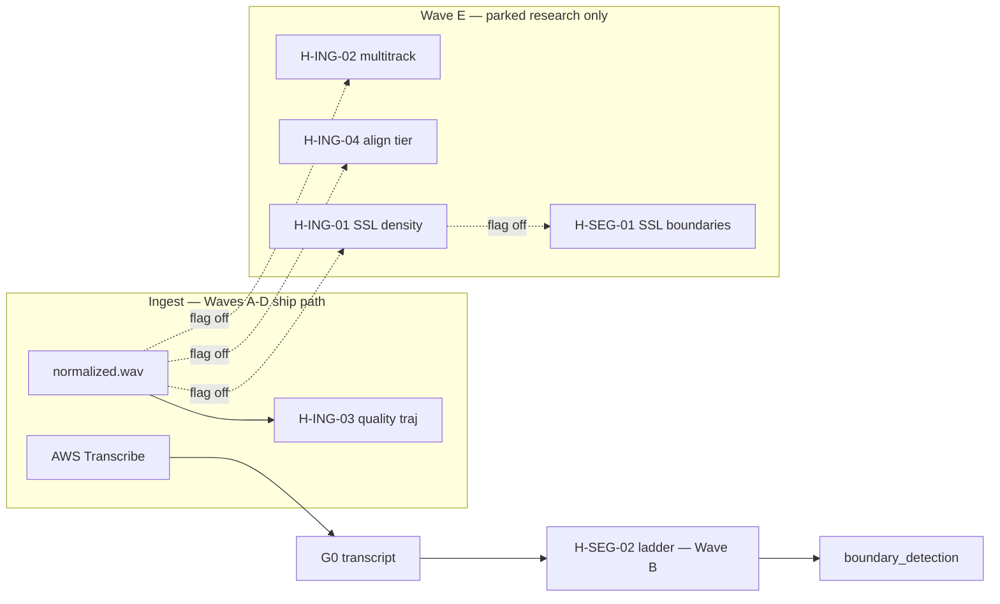

# Wave E — Big bets (parked) (June 2026)

**Status:** **Parked** — unpark gates only; **never default-on** alongside Waves A–D.  
**Parent:** [h-hypothesis-wave-prompts.md](./h-hypothesis-wave-prompts.md) Command 5  
**Requires:** [wave-0-resilience-harness.md](./wave-0-resilience-harness.md) (fail-open inventory, observability contract, scenario matrix)  
**Do not edit:** `.cursor/plans/h-hypothesis_plan_files_909fce9f.plan.md`

Wave E documents **research moonshots** that carry heavy dependencies, unproven listener lift, or cross-cutting ingest/segmentation risk. All four hypotheses remain **Parked** until every unpark gate in §2 and §3 clears **and** the hypothesis-specific §15 unpark checklist passes. Production paths for Waves A–D must remain unchanged while parked.

---

## Cursor Agent command (copy-paste)

Open **Agent mode** in Cursor. Start a **new** chat. Copy the entire block below and paste it in.

**Default mode:** documentation + gate tracking + research spike prep only — **no production code** and **no default-on config** unless §16 Human unpark sign-off table is signed for a specific hypothesis.

```text
Wave E — Big bets (PARKED). Work per /Users/nicketuttarwar/IDEProjects/interview_helper_mux/docs/build-out/june2026build/wave-e-big-bets.md. Default: docs + gate tracking only. Do NOT unpark or merge heavy deps without explicit human sign-off in §16.

Workspace: /Users/nicketuttarwar/IDEProjects/interview_helper_mux

Read first (attach with @):
@/Users/nicketuttarwar/IDEProjects/interview_helper_mux/.cursor/rules/interview-helper-mux.mdc
@/Users/nicketuttarwar/IDEProjects/interview_helper_mux/AGENTS.md
@/Users/nicketuttarwar/IDEProjects/interview_helper_mux/docs/build-out/june2026build/wave-0-resilience-harness.md
@/Users/nicketuttarwar/IDEProjects/interview_helper_mux/docs/build-out/june2026build/wave-e-big-bets.md
@/Users/nicketuttarwar/IDEProjects/interview_helper_mux/docs/build-out/remaining-build-commands.md
@/Users/nicketuttarwar/IDEProjects/interview_helper_mux/docs/pipeline/value-analysis/spike-results-and-winners.md
@/Users/nicketuttarwar/IDEProjects/interview_helper_mux/docs/pipeline/value-analysis/value-metrics-library.md
@/Users/nicketuttarwar/IDEProjects/interview_helper_mux/docs/cross-cutting/anchored-toolchain.md

CRITICAL constraints:
- All hypotheses H-ING-02, H-ING-04, H-ING-01, H-SEG-01 remain PARKED
- Do NOT set research flags true in /Users/nicketuttarwar/IDEProjects/interview_helper_mux/config/app.defaults.json
- Do NOT add torch/transformers to /Users/nicketuttarwar/IDEProjects/interview_helper_mux/requirements.lock (SG-05)
- Do NOT block Waves A–D CI when Wave E flags are off (SG-06)
- Do NOT edit /Users/nicketuttarwar/IDEProjects/interview_helper_mux/.cursor/plans/*
- Sequential unpark order: ING-02 → ING-04 → ING-01 → SEG-01

If working gate-tracking todos (§17 Wave-level todos):
- Update shared unpark gates §3 (SG-01 through SG-10) with evidence links
- Track Command 8 status from /Users/nicketuttarwar/IDEProjects/interview_helper_mux/docs/build-out/remaining-build-commands.md
- Update deferred rows in /Users/nicketuttarwar/IDEProjects/interview_helper_mux/docs/pipeline/value-analysis/spike-results-and-winners.md
- Document bias mitigation per /Users/nicketuttarwar/IDEProjects/interview_helper_mux/docs/pipeline/value-analysis/value-metrics-library.md §5

If explicitly unparking ONE hypothesis (requires §16 signed table first):
- Isolated research venv only — never core /Users/nicketuttarwar/IDEProjects/interview_helper_mux/.venv
- All 15 unpark gates §2 + ≥8 SG gates per hypothesis
- Prerequisites: H-ING-03 Promoted (SG-07), H-SEG-02 Promoted (SG-08) where applicable
- Run: python /Users/nicketuttarwar/IDEProjects/interview_helper_mux/tools/run_value_spike.py on section fixture
- ./tools/check_prerequisites.sh && pip-audit per /Users/nicketuttarwar/IDEProjects/interview_helper_mux/docs/cross-cutting/anchored-toolchain.md

Verify (always):
cd /Users/nicketuttarwar/IDEProjects/interview_helper_mux && source .venv/bin/activate
./tools/check_prerequisites.sh
pytest /Users/nicketuttarwar/IDEProjects/interview_helper_mux/tests/ -q --ignore=/Users/nicketuttarwar/IDEProjects/interview_helper_mux/tests/fixtures/ 2>/dev/null || pytest /Users/nicketuttarwar/IDEProjects/interview_helper_mux/tests/ -q
grep -E 'torch|transformers' /Users/nicketuttarwar/IDEProjects/interview_helper_mux/requirements.lock && echo 'FAIL: core lock must not contain torch' && exit 1 || echo 'OK: no torch in core lock'

Update wave-e-big-bets.md todos [x]. Follow /Users/nicketuttarwar/IDEProjects/interview_helper_mux/docs/build-out/doc-maintenance.md.
```

**Canonical references:** [spike-results-and-winners.md](../../pipeline/value-analysis/spike-results-and-winners.md) · [value-metrics-library.md](../../pipeline/value-analysis/value-metrics-library.md) · [remaining-build-commands.md](../remaining-build-commands.md) Command 8 · [anchored-toolchain.md](../../cross-cutting/anchored-toolchain.md) · [shared-ingest-transcribe.md](../../pipeline/value-analysis/sections/shared-ingest-transcribe.md) · [shared-segmentation.md](../../pipeline/value-analysis/sections/shared-segmentation.md)

---

## Hypothesis roster (all Parked)

| Seq | ID | Status | Tier | Spike / deferred | Primary value axis |
|-----|-----|--------|------|------------------|-------------------|
| 12 | **H-ING-02** | **Parked** | T0 | No fixture winner — multitrack research | COM + CRE (speaker attribution) |
| 13 | **H-ING-04** | **Parked** | T1 | Deferred — revisit after ingest winner | LEX + CRE (micro-timing) |
| 14 | **H-ING-01** | **Parked** | T0 | [H-ING-01 T0 spike — Park](../../pipeline/value-analysis/spike-results-and-winners.md#h-ing-01-t0-spike--ssl-idea-density) | LEX + COM (idea-density) |
| 15 | **H-SEG-01** | **Parked** | T0 | Wav2Vec2 fusion deferred | COM + CRE (boundaries) |

**Sequential unpark order (mandatory):** **H-ING-02 → H-ING-04 → H-ING-01 → H-SEG-01**. Do not unpark later IDs until prior seq prerequisites and shared gates clear.

---

## 1. Realistic success definition

The product goal is **not** literal zero-failure on arbitrary first upload. Wave E success while **parked** means research flags exist, default-off, and **never** block operator recovery on the A–D spine.

| # | Criterion | How verified (Wave E scope) |
|---|-----------|---------------------------|
| 1 | **No silent failure** | Research extract failures emit `gui_log.jsonl` + troubleshooting row when flag enabled; parked runs omit feature silently |
| 2 | **Always recoverable** | No Wave E research flag in `app.defaults.json` default-on; unpark requires explicit config + gates |
| 3 | **Scenario robustness** | [§4 Scenario matrix](#4-scenario-coverage-matrix-future-unpark-only) documents buckets each unpark would help — **no implementation until unparked** |
| 4 | **Fail open** | Research flags only; production path unchanged when parked ([§6](#6-fail-open-research-flags-only)) |
| 5 | **Unpark with evidence** | No `config true` until [§2 15-point unpark checklist](#2-unpark-with-evidence-checklist-15-points) passes |

**North star (final product):** listener-trustworthy mastered episodes — [podcast-quality-roadmap.md](../../cross-cutting/podcast-quality-roadmap.md), [evaluation-metrics.md](../../cross-cutting/evaluation-metrics.md), `tools/verify_master.py`, `tools/validate_narrative.py`. Wave E hypotheses are **optional enrichments** to ingest/segmentation truth — not ship blockers.

---

## 2. Unpark-with-evidence checklist (15 points)

Adapted from [wave-0 §2](../../build-out/june2026build/wave-0-resilience-harness.md#2-promote-with-evidence-checklist-15-points). For **each** hypothesis, §12–§15 include subsection **Unpark gates** with pass/fail checkboxes — **≥1 Implementation todo per point**. **All 15 must pass BEFORE** the research config flag may be set `true` in operator config (never default-on in `app.defaults.json` without Shipped sign-off).

| # | Unpark gate | Pass criteria (BEFORE config `true`) |
|---|-------------|----------------------------------------|
| 1 | **Spike stability** | Winner stable listener-first **and** idea-first ([phase3-spike-framework.md](../../pipeline/value-analysis/phase3-spike-framework.md)); ±20% weight perturbation does not flip rank vs parked baseline |
| 2 | **Mechanism** | MEC-A ≥ 3; MEC-D ≥ 3 with documented [fail-open](#6-fail-open-research-flags-only) behavior for research path |
| 3 | **Fixture proof** | Spike JSON re-run via `tools/run_value_spike.py` ≥ baseline for section fixture |
| 4 | **Automated tests** | `pytest` green for touched modules; research code behind flag; core CI unchanged when flag off |
| 5 | **Schema / artifact** | json-schemas + codegen + [artifact-layout.md](../../cross-cutting/artifact-layout.md) if research I/O added |
| 6 | **Config documented** | [config-keys.md](../../cross-cutting/config-keys.md) + research defaults **false** + templates; no silent default-on |
| 7 | **Volley parity** | If research artifacts enter volley: [context-padding.md](../../cross-cutting/context-padding.md) ↔ `STAGE_PLANS`; `python tools/audit_stage_plans_doc.py` |
| 8 | **Operator surface** | [gui-surface-map.md](../../workflows/gui-surface-map.md), [operator-stage-checklists.md](../../workflows/operator-stage-checklists.md) — research panels opt-in only |
| 9 | **Final product link** | Named Flow + validator impact documented (or explicit “analysis-only, no mux change”) |
| 10 | **Doc maintenance** | [doc-maintenance.md](../doc-maintenance.md) checklist; spike-results deferred row updated |
| 11 | **Do-not-unpark-until** | Explicit blockers listed; shared §3 gates cleared |
| 12 | **Observability** | `ctx.log()` event shape; `gui_log.jsonl` key; gate panel copy; troubleshooting row |
| 13 | **Scenario matrix** | Applicable atlas rows pass regression when flag on ([§4](#4-scenario-coverage-matrix-future-unpark-only)) |
| 14 | **Fail-open** | Documented behavior when WAV/transcript/research venv missing; no undeclared `SystemExit` from research extract |
| 15 | **Recovery** | Named gate or `--from-stage` path; disabling flag restores A–D behavior without re-ingest |

**Kill / park (Wave E):** prompt-only evidence channels; unpark without listener study; merge `torch`/`transformers` into core lock; unpark while [spike-results deferred row](#3-shared-unpark-gates) still says Park without date + profiles.

---

## 3. Shared unpark gates

These gates apply to **every** Wave E hypothesis before **any** research flag may be set `true`. Each hypothesis todo list includes **≥8** explicit references (SG-* todos).

| Gate ID | Gate | Pass criteria | Owner / evidence |
|---------|------|---------------|------------------|
| **SG-01** | **Command 8** | [remaining-build-commands.md](../remaining-build-commands.md) Command 8 (SSL moonshot) completed **or** waived with signed rationale for hypotheses that do not need SSL (ING-02, ING-04) | spike-results § Command 8 outcome |
| **SG-02** | **pip-audit** | Any new research dependency pinned in optional research table; `requirements.lock` refresh; `./tools/check_prerequisites.sh` passes; no unaccepted HIGH/CRITICAL ([anchored-toolchain.md](../../cross-cutting/anchored-toolchain.md)) | lock diff + audit log |
| **SG-03** | **Listener study** | N ≥ 8 listeners ([value-metrics-library.md](../../pipeline/value-analysis/value-metrics-library.md) §1.4) OR N ≥ 3 operators CRE-B/C for operator-facing unpark | study protocol archived |
| **SG-04** | **spike-results deferred row** | [spike-results-and-winners.md](../../pipeline/value-analysis/spike-results-and-winners.md) deferred table row updated from **Park** → **Partial** or **Promote** with date, profiles tested, global scores | doc PR merged |
| **SG-05** | **No core torch** | `torch`, `transformers`, and Wav2Vec2 weights **not** in default `requirements.lock`; research uses isolated venv or optional extras only | grep lock + bootstrap script |
| **SG-06** | **Waves A–D not blocked** | Wave E PR does not add hard pipeline stages; does not change `app.defaults.json` for A–D flags; CI green with all Wave E flags off | CI artifact |
| **SG-07** | **ING-03 prerequisite** | H-ING-03 (Wave A) at **Promoted** before ING-04 unpark; stable `normalized.wav` + quality trajectory fixtures | wave-a sign-off |
| **SG-08** | **SEG-02 prerequisite** | H-SEG-02 (Wave B) at **Promoted** before H-SEG-01 unpark; pause ladder baseline for boundary comparison | wave-b sign-off |
| **SG-09** | **Human unpark sign-off** | Maintainer + operator lead signed unpark table in this doc §16 | initials / date |
| **SG-10** | **Bias mitigation doc** | Accent / prosody bias mitigation per [§5](#5-prosody--delivery-guardrails-wave-e) recorded in spike sheet | value-metrics failure modes row |

**Command 8 detail (SSL moonshot):** Proceed only if spike-results recommend SSL for a section. Fixture sprint promoted H-ING-03 and **parked** H-ING-01 — Command 8 gate **not met** for SSL unpark. H-ING-01 and H-SEG-01 unpark **requires** Command 8 outcome documented (lift or explicit Park with no core merge).

**spike-results deferred row (current):**

| Hypothesis ID | Verdict | Reason |
|---------------|---------|--------|
| H-ING-01 | Park | Command 7 did not recommend SSL; no lift vs `audio` profile without heavy deps |
| H-ING-04 | Park | Alternate ASR + forced alignment T1; revisit after ingest winner ships |
| H-SEG-01 | Park | Wav2Vec2 boundary fusion deferred — SSL out of scope for fixture sprint |
| H-ING-02 | Park | Multitrack not in fixture sprint — no deferred row yet; treat as Park until spike run |

---

## 4. Scenario coverage matrix (future unpark only)

**No scenario implementation until unparked.** This matrix documents which atlas buckets each hypothesis **would** help if unparked, and what must **not regress** when the research flag is enabled. Pass criteria apply only after unpark + flag-on regression run.

| Atlas bucket | Fixture | Would help (if unparked) | Must not regress when flag on | Wave E IDs |
|--------------|---------|--------------------------|-------------------------------|------------|
| `one_on_one` | `tests/fixtures/sonic_context/one_on_one.json` | ING-01 idea-density; ING-04 alignment baseline | Baseline G0 + ranking unchanged when flags off | ING-01, ING-04 |
| `panel` | `tests/fixtures/sonic_context/panel.json` | ING-02 multitrack asymmetry; SEG-01 crosstalk boundaries | Speaker collapse; overlap mud when ING-02 hints wrong | ING-02, SEG-01 |
| `noisy_room` | `tests/fixtures/sonic_context/noisy_room.json` | ING-03 corroboration for ING-01/02 flags | False trust dips; false boundary splits | ING-01, ING-02, SEG-01 |
| `trauma_adjacent` | `tests/fixtures/sonic_context/trauma_adjacent.json` | ING-04 micro-timing for clip handles | No auto-cut on trauma peaks from SSL change-points | ING-04, SEG-01 |
| `dense_jargon` | `tests/fixtures/sonic_context/dense_jargon.json` | SEG-01 thought boundaries vs pause-only | Comprehension false positives from bad splits | SEG-01 |
| `fireside` | `tests/fixtures/sonic_context/fireside.json` | SEG-01 reflective boundaries | Over-segmentation vs H-SEG-02 ladder | SEG-01 |
| `technical_deep_dive` | `tests/fixtures/sonic_context/technical_deep_dive.json` | ING-01 long-run idea-density | Long-run coherence noise on short runs | ING-01 |
| `media_profile` | `tests/fixtures/sonic_context/media_profile.json` | ING-04 clip sync for montage handles | Hook montage timing drift | ING-04 |
| `debate` | `tests/fixtures/sonic_context/debate.json` | ING-02 attribution; SEG-01 role boundaries | Role swap; crosstalk boundary errors | ING-02, SEG-01 |
| Long interview | `tests/fixtures/runs/coherence_30m_planted_drift/` | ING-01 density curves on long runs | ORC-03 spam from SSL novelty | ING-01 |
| **Prosody diversity** | Manual CRE-B clips + rubric | All ingest/seg research | Accent bias; quiet speech over-split | All |

**Nine-scenario listen matrix:** After any unpark touching mux timing, run [definition-of-done-signoff.md](../definition-of-done-signoff.md) §6 subset before Shipped default-on.

---

## 5. Prosody & delivery guardrails (Wave E)

Accent, multitrack bleed, and SSL states can **punish** atypical delivery. Every unpark spike sheet must document mitigation per [value-metrics-library.md](../../pipeline/value-analysis/value-metrics-library.md) §2 proxy failure modes.

| Risk | Wave E exposure | Mitigation (required in unpark spike) |
|------|-----------------|----------------------------------------|
| **Accent / ASR unevenness** | ING-04 alternate ASR; SEG-01 SSL + transcript fusion | SSL/ASR proxies must not **purely** punish low confidence; require text corroboration or H-G0-02 stress path; document accent failure modes in spike sheet |
| **Low volume / quiet speech** | ING-02 stem ratios; ING-01 density on quiet monologue | Quiet vital claims must not read as “low idea density”; cross-check H-ING-03 trust dips |
| **Irregular pauses** | SEG-01 boundaries beyond pause ladder | Must not over-split reflective speakers; align with SAP `pace_class` and H-SEG-02 ladder |
| **High disfluency** | ING-04 alignment on fillers | Fillers ≠ boundary anchors; align [disfluency-extract.md](../../pipeline/transcription/disfluency-extract.md) |
| **Multitrack imbalance** | ING-02 energy asymmetry | Bleed/music confounds must be tagged; Family 6 separation-informed checks |
| **Atypical prosody** | All SSL/ASR research | Down-rank review signals, never **exclude** analysis; fail-open |

**value-metrics-library accent bias warning (mandatory spike row):**

Every proxy row in the unpark spike sheet must include **known failure modes** (e.g. music as speech, bias toward certain accents) per [value-metrics-library.md](../../pipeline/value-analysis/value-metrics-library.md#2-model-proxies-allowed-with-caveats). Unpark blocked if spike sheet omits accent/prosody failure modes.

**Unpark gate:** Before Partial → Promoted on ING-01/02/04/SEG-01, document manual or fixture-backed check on ≥2 “hard listener” clips (quiet, disfluent, accented, or noisy) per [transcript-quality-rubric.md](../../prompts/_shared/transcript-quality-rubric.md).

---

## 6. Fail-open (research flags only)

When Wave E hypotheses are **Parked**, production behavior matches pre-research code paths. When research flags are **enabled** in operator config, missing deps **omit** the feature — never halt ingest, G0, segmentation, or mux.

| Condition | Required behavior (research flag on) | Hard stop? | Log key |
|-----------|-------------------------------------|------------|---------|
| Flag absent / `false` | No research extract; A–D path only | No | — |
| Missing `ingest/normalized.wav` | Skip audio-derived research; log skip | No | `wave_e_research_skip_no_wav` |
| Missing research venv / model weights | Skip research profile; core spine ships | No | `wave_e_research_skip_no_venv` |
| `value_analysis.enabled: false` | No research enqueue | No | — |
| ING-02: single-track only | Skip multitrack hints; no attribution queue | No | `ing02_skip_single_track` |
| ING-04: aligner timeout | Keep AWS transcript timestamps | No | `ing04_aligner_skip` |
| ING-01: SSL OOM / import fail | Skip `ssl_density`; existing audio profile only | No | `ing01_ssl_skip` |
| SEG-01: Wav2Vec unavailable | Pause ladder + LLM boundaries only | No | `seg01_ssl_skip` |
| Low-confidence SSL/ASR signal | Omit flag; no investigation enqueue | No | — |
| Research flag on + unpark gates incomplete | **Reject config** at GUI validation | Soft | `wave_e_unpark_gate_blocked` |

**Hard gates (unchanged by Wave E):** `analysis.flow_hardening`, blocking `claim_contradiction`, G0/G1/G2, `verify_master` — cite [troubleshooting.md](../../workflows/troubleshooting.md). Wave E must not add new hard stops on the default path.

---

## 7. Wave E must NOT block Waves A–D

Explicit non-blocking contract:

| Rule | Rationale |
|------|-----------|
| No new **default-on** keys in `app.defaults.json` for Wave E | Operators run A–D without research deps |
| No new **required** pipeline stages | Research runs via optional extract profiles or isolated tools |
| No `torch` / `transformers` in core `requirements.lock` | Bootstrap + pip-audit for all developers |
| Wave E doc/PR may merge **in parallel** with A–D after Wave 0 exists | Planning does not gate A–D code |
| CI must pass with all Wave E flags **off** | Regression signal stays A–D scoped |
| Unpark is **sequential** inside Wave E only | ING-02 before ING-04 before ING-01 before SEG-01 — does not gate Wave B/C/D ship |

**Wave blocking table (from [wave-0 §12](../../build-out/june2026build/wave-0-resilience-harness.md#12-wave-blocking-rules)):**

| Order | Doc | Prerequisite |
|-------|-----|--------------|
| 0 | wave-0 | First |
| A–D | wave-a … wave-d | Sequential A→B→C→D |
| **E** | **this file** | Wave 0 doc exists; **does not require** A–D complete for **documentation**; **code unpark** requires §3 SG-06 + seq prerequisites |

---

## 8. Wave E do-no-harm

| Risk if unparked carelessly | Guardrails |
|----------------------------|------------|
| Heavy deps break core venv | Stay parked; isolated research venv; SG-05 |
| Bad speaker hints before G0 | ING-02 hints advisory only; never auto speaker_roles |
| Alignment jitter breaks clip mux | ING-04 research timestamps not default for EDL without operator accept |
| SSL change-points over-segment fireside | SEG-01 must beat SEG-02 ladder on boundary truth fixture |
| Accent bias in SSL/ASR | §5 spike sheet + hard-listener clips |

---

## 9. Repository touch matrix (Wave E)

| Layer | Paths / docs |
|-------|----------------|
| **Ingest research** | `value_analysis/features_audio.py`, `tools/extract_value_features.py`, [shared-ingest-transcribe.md](../../pipeline/value-analysis/sections/shared-ingest-transcribe.md) |
| **Segmentation research** | `stage_enrichment.py`, `boundaries.py`, [shared-segmentation.md](../../pipeline/value-analysis/sections/shared-segmentation.md) |
| **Moonshot families** | [moonshot-model-families.md](../../pipeline/value-analysis/moonshot-model-families.md) Families 1, 3, 6 |
| **Spike harness** | `tools/run_value_spike.py`, `tests/fixtures/value_analysis/spike_*.json` |
| **Toolchain** | [anchored-toolchain.md](../../cross-cutting/anchored-toolchain.md), `tools/check_prerequisites.sh` |
| **STT reference** | [stt-and-diarization.md](../../pipeline/transcription/stt-and-diarization.md) (multitrack capture) |
| **Config** | [config-keys.md](../../cross-cutting/config-keys.md) — research keys default false |
| **Observability** | `run_context.py`, [troubleshooting.md](../../workflows/troubleshooting.md) |

---

## 10. Pipeline context (parked — no default wiring)



Solid lines = shipped/partial path. Dotted = **disabled when parked**.

---

## 11. Final product impact (if unparked)

| Hypothesis | Flow / artifact | Validator | Default mux impact |
|------------|-------------------|-----------|-------------------|
| H-ING-02 | Analysis — speaker hints → G0 volley | CRE-B mis-attribution task | None without operator accept |
| H-ING-04 | Clip handles, micro-edits research | Listener micro-cut preference | None until EDL policy explicit |
| H-ING-01 | `value_features` idea-density series | COM retell + boundary correlation | None |
| H-SEG-01 | Boundary hints → `pause_ladder_hints` merge | Listener Likert SectionFit | None without boundary merge policy |

Partial proxies remain **Parked** until prosody scenario checks + listener/operator study clear **do-not-unpark-until**.

---

## 12. H-ING-02 — Multitrack energy / coherence asymmetry (seq 12)

**Status:** **Parked** · **Tier:** T0 · **Moonshot:** [Family 6](../../pipeline/value-analysis/moonshot-model-families.md#family-6--separation-informed-analysis-eg-demucs-stems-as-features)

**Thesis:** Multitrack **energy / coherence asymmetry** improves speaker-attribution hints before explicit roles ([shared-ingest-transcribe.md](../../pipeline/value-analysis/sections/shared-ingest-transcribe.md)).

**Prerequisites for unpark:** SG-01 through SG-10; Wave A G0 path stable; **no** ING-04/01/SEG-01 unpark before ING-02 completes unpark checklist.

### 12.1 Fail-open (ING-02)

| Condition | Behavior |
|-----------|----------|
| Single-track ingest | Skip multitrack features; log `ing02_skip_single_track` |
| Stem separation fail | Skip asymmetry scores; no speaker hint queue |
| Missing WAV | `wave_e_research_skip_no_wav` |

### 12.2 Observability (ING-02)

| Event | `gui_log` key | Gate panel |
|-------|---------------|------------|
| Research extract ok | `ing02_multitrack_research` | None (research panel opt-in) |
| Skip single-track | `ing02_skip_single_track` | Info in Activity log |
| Hint queue advisory | `ing02_attribution_hint` | G0 dock optional badge — not blocking |

### 12.3 Scenario regression (future unpark)

| Bucket | Pass when flag on |
|--------|-------------------|
| `panel`, `debate` | Attribution hints reduce mis-label vs blind; no speaker collapse |
| `noisy_room` | Bleed asymmetry does not false-flag guest as interviewer |
| Prosody diversity | Accented guest not systematically down-ranked |

### 12.4 Prosody guardrails (ING-02)

Document Family 6 bleed vs accent confusion in spike sheet. Cross-check quiet channel not interpreted as “inactive speaker.”

### 12.5 Kill criteria (ING-02)

- [ ] **K-ING02-01** CRE-B mis-attribution task shows **no** improvement vs transcript-only diarization on panel fixture
- [ ] **K-ING02-02** pip-audit HIGH/CRITICAL on separation stack without accepted advisory
- [ ] **K-ING02-03** Hints auto-write `speaker_roles` without operator — **kill**
- [ ] **K-ING02-04** Music bleed asymmetry correlates with accent groups (bias) without mitigation — **park**
- [ ] **K-ING02-05** Multitrack capture &lt; 5% of target operator workflows — defer unpark

### 12.6 Unpark gates — 15 points (ING-02)

| # | Gate | Pass |
|---|------|------|
| 1 | Spike stability | ☐ |
| 2 | Mechanism MEC-A/D | ☐ |
| 3 | Fixture proof | ☐ |
| 4 | pytest | ☐ |
| 5 | Schema | ☐ |
| 6 | Config documented | ☐ |
| 7 | Volley parity | ☐ |
| 8 | Operator surface | ☐ |
| 9 | Final product link | ☐ |
| 10 | Doc maintenance | ☐ |
| 11 | Do-not-unpark-until | ☐ |
| 12 | Observability | ☐ |
| 13 | Scenario matrix | ☐ |
| 14 | Fail-open | ☐ |
| 15 | Recovery | ☐ |

### 12.7 Implementation todos (ING-02) — 58 items

#### Shared unpark gates (≥8)

- [ ] **ING02-SG01** Verify SG-01 Command 8 waived for ING-02 (non-SSL) with signed rationale in §16
- [ ] **ING02-SG02** SG-02 pip-audit pass on any Demucs/separation research pins
- [ ] **ING02-SG03** SG-03 listener study N≥8 on mis-attribution Likert or CRE-B panel/debate clips
- [ ] **ING02-SG04** SG-04 spike-results row for H-ING-02 added/updated from Park
- [ ] **ING02-SG05** SG-05 confirm no torch in core lock for ING-02 research path
- [ ] **ING02-SG06** SG-06 CI green with `value_analysis.multitrack_research.enabled: false`
- [ ] **ING02-SG07** SG-07 waived for ING-02 (ING-03 not required for multitrack spike start — document)
- [ ] **ING02-SG08** SG-08 waived for ING-02 (SEG-02 not required)
- [ ] **ING02-SG09** SG-09 human unpark sign-off in §16
- [ ] **ING02-SG10** SG-10 bias mitigation row in spike sheet for bleed vs accent

#### 15-point unpark todos

- [ ] **ING02-U01** Spike stability: ±20% weight perturbation on multitrack fixture
- [ ] **ING02-U02** MEC-A ≥ 3 mechanism doc for asymmetry score
- [ ] **ING02-U03** MEC-D ≥ 3 fail-open for single-track skip
- [ ] **ING02-U04** Fixture `spike_shared_ingest_transcribe.json` extended or new multitrack fixture
- [ ] **ING02-U05** `tools/run_value_spike.py` ≥ baseline with hints off
- [ ] **ING02-U06** `pytest` for research extract behind flag
- [ ] **ING02-U07** Schema for optional `multitrack_hints.json` if artifact added
- [ ] **ING02-U08** `config-keys.md` key `value_analysis.multitrack_research.enabled` default false
- [ ] **ING02-U09** `app.defaults.json` remains false
- [ ] **ING02-U10** Volley: hints advisory in G0 volley only if unparked + explicit
- [ ] **ING02-U11** `audit_stage_plans_doc.py` if volley touched
- [ ] **ING02-U12** gui-surface-map research panel stub
- [ ] **ING02-U13** operator-stage-checklists research opt-in row
- [ ] **ING02-U14** Final product: document no mux change default
- [ ] **ING02-U15** doc-maintenance checklist on unpark PR
- [ ] **ING02-U16** Do-not-unpark-until blockers listed in spike-results
- [ ] **ING02-U17** `ctx.log` for `ing02_multitrack_research`
- [ ] **ING02-U18** troubleshooting row for separation venv missing
- [ ] **ING02-U19** Scenario: `panel.json` regression procedure documented
- [ ] **ING02-U20** Scenario: `debate.json` regression procedure documented
- [ ] **ING02-U21** Fail-open test: single-track skip
- [ ] **ING02-U22** Fail-open test: separation timeout
- [ ] **ING02-U23** Recovery: disable flag → no hints in volley

#### Research spike todos

- [ ] **ING02-R01** Inventory multitrack capture rate in operator interviews
- [ ] **ING02-R02** Spike sheet: stem ratios per window (Family 6)
- [ ] **ING02-R03** Operator marks mis-attributed segments blind vs with hints
- [ ] **ING02-R04** Compare asymmetry vs AWS diarization-only on panel clip
- [ ] **ING02-R05** Document Demucs vs ffmpeg energy fallback
- [ ] **ING02-R06** Isolated venv script for separation research
- [ ] **ING02-R07** Pin versions in anchored-toolchain optional table
- [ ] **ING02-R08** Context7 at pins before integration code
- [ ] **ING02-R09** Bleed score correlate with “hard to follow” Likert
- [ ] **ING02-R10** No auto `speaker_roles` write — code review gate

#### Kill / park verification

- [ ] **ING02-K01** Run kill criterion K-ING02-01 before unpark PR
- [ ] **ING02-K02** Run kill criterion K-ING02-02 pip-audit
- [ ] **ING02-K03** Run kill criterion K-ING02-03 no auto roles
- [ ] **ING02-K04** Run kill criterion K-ING02-04 bias check
- [ ] **ING02-K05** Run kill criterion K-ING02-05 capture rate

#### Observability + docs

- [ ] **ING02-O01** Activity log message human-readable for skip paths
- [ ] **ING02-O02** Gate panel no blocking state for research
- [ ] **ING02-O03** `gui_log.jsonl` sample in doc PR
- [ ] **ING02-D01** Link ING-02 in shared-ingest-transcribe spike section
- [ ] **ING02-D02** Update june2026build README unpark status
- [ ] **ING02-D03** INDEX.md if unparked

#### Extended verification

- [ ] **ING02-V01** `noisy_room.json` false asymmetry check
- [ ] **ING02-V02** Prosody: ≥2 hard-listener clips documented
- [ ] **ING02-V03** `one_on_one.json` no regression when flag off
- [ ] **ING02-V04** Research flag validation rejects unpark without gates
- [ ] **ING02-V05** Sequential: complete before ING-04 unpark todo gate
- [ ] **ING02-V06** `tests/fixtures/value_analysis/` fixture committed
- [ ] **ING02-V07** Spike global score recorded listener-first + idea-first
- [ ] **ING02-V08** No new pipeline stage in `pipeline.py` default order

---

## 13. H-ING-04 — Alternate ASR + forced alignment (seq 13)

**Status:** **Parked** · **Tier:** T1 · **Moonshot:** [Family 3](../../pipeline/value-analysis/moonshot-model-families.md#family-3--whisper-class--forced-aligners-eg-whisperx-pattern)

**Thesis:** Alternate ASR + **forced alignment** tier improves micro-timing for emotional sync in clips ([shared-ingest-transcribe.md](../../pipeline/value-analysis/sections/shared-ingest-transcribe.md)).

**Prerequisites for unpark:** ING-02 unpark checklist **or** waived; SG-07 ING-03 Promoted; SG-01 through SG-10.

### 13.1 Fail-open (ING-04)

| Condition | Behavior |
|-----------|----------|
| Aligner missing | Keep AWS `transcript/full.json` timestamps |
| Aligner timeout | Log `ing04_aligner_skip`; no EDL timestamp swap |
| Flag off | AWS path only |

### 13.2 Observability (ING-04)

| Event | Key |
|-------|-----|
| Aligner research run | `ing04_aligner_research` |
| Skip | `ing04_aligner_skip` |
| Jitter report | `ing04_alignment_jitter` (research panel) |

### 13.3 Scenario regression (future unpark)

| Bucket | Pass when flag on |
|--------|-------------------|
| `media_profile` | Micro-cut handles improve listener preference |
| `trauma_adjacent` | No harmful auto-narrow on emotional peaks |
| `dense_jargon` | Alignment does not break jargon token boundaries |

### 13.4 Prosody guardrails (ING-04)

Accent unevenness in alternate ASR must not alone drive clip boundaries; require acoustic or editorial corroboration. Spike sheet accent failure modes mandatory.

### 13.5 Kill criteria (ING-04)

- [ ] **K-ING04-01** Alignment jitter **worse** than AWS on 10 micro-cuts — park
- [ ] **K-ING04-02** Default EDL uses research timestamps without operator — kill
- [ ] **ING04-K03** pip-audit fail on aligner stack
- [ ] **ING04-K04** ING-03 not Promoted — do not unpark
- [ ] **ING04-K05** Listener study shows no LEX lift on clip handles

### 13.6 Unpark gates — 15 points (ING-04)

| # | Gate | Pass |
|---|------|------|
| 1–15 | Same as §2 | ☐ each |

### 13.7 Implementation todos (ING-04) — 57 items

#### Shared unpark gates

- [ ] **ING04-SG01** SG-01 Command 8 waived (non-SSL aligner path)
- [ ] **ING04-SG02** SG-02 pip-audit on aligner pins
- [ ] **ING04-SG03** SG-03 listener micro-cut study N≥8
- [ ] **ING04-SG04** SG-04 deferred row H-ING-04 updated
- [ ] **ING04-SG05** SG-05 no core torch unless isolated extras
- [ ] **ING04-SG06** SG-06 CI flags off
- [ ] **ING04-SG07** SG-07 ING-03 Promoted evidence linked
- [ ] **ING04-SG08** SG-08 waived for ING-04
- [ ] **ING04-SG09** SG-09 sign-off §16
- [ ] **ING04-SG10** SG-10 accent bias spike row

#### 15-point unpark todos

- [ ] **ING04-U01** Spike stability aligner vs AWS
- [ ] **ING04-U02** MEC-A mechanism for alignment tier
- [ ] **ING04-U03** MEC-D fail-open on timeout
- [ ] **ING04-U04** Fixture proof ingest transcribe spike
- [ ] **ING04-U05** pytest aligner behind flag
- [ ] **ING04-U06** Schema optional `alignment_research.json`
- [ ] **ING04-U07** config `value_analysis.alignment_research.enabled` false
- [ ] **ING04-U08** app.defaults false
- [ ] **ING04-U09** Volley unchanged unless unparked + policy
- [ ] **ING04-U10** audit_stage_plans if volley touched
- [ ] **ING04-U11** gui-surface-map aligner research panel
- [ ] **ING04-U12** operator checklist aligner opt-in
- [ ] **ING04-U13** Final product: clip handle listen protocol
- [ ] **ING04-U14** doc-maintenance PR
- [ ] **ING04-U15** do-not-unpark-until list
- [ ] **ING04-U16** ctx.log ing04_* keys
- [ ] **ING04-U17** troubleshooting aligner missing
- [ ] **ING04-U18** scenario media_profile procedure
- [ ] **ING04-U19** scenario trauma_adjacent procedure
- [ ] **ING04-U20** fail-open timeout test
- [ ] **ING04-U21** fail-open flag off test
- [ ] **ING04-U22** recovery disable flag
- [ ] **ING04-U23** Compare jitter metrics documented

#### Research spike todos

- [ ] **ING04-R01** WhisperX-class spike time-box T1
- [ ] **ING04-R02** 10 micro-cuts listener preference protocol
- [ ] **ING04-R03** AWS vs aligner word timestamp diff stats
- [ ] **ING04-R04** Isolated venv for aligner
- [ ] **ING04-R05** Pin versions + pip-audit
- [ ] **ING04-R06** Context7 at pins
- [ ] **ING04-R07** No default transcript/full.json overwrite
- [ ] **ING04-R08** Emotional sync rubric CRE-C
- [ ] **ING04-R09** Dense jargon token boundary audit
- [ ] **ING04-R10** Record spike in spike-results

#### Kill verification

- [ ] **ING04-K01** K-ING04-01 jitter worse — park check
- [ ] **ING04-K02** K-ING04-02 no default EDL swap
- [ ] **ING04-K03** ING04-K03 pip-audit
- [ ] **ING04-K04** ING04-K04 ING-03 gate
- [ ] **ING04-K05** ING04-K05 listener LEX

#### Observability + scenario + seq

- [ ] **ING04-O01** Activity log aligner skip readable
- [ ] **ING04-O02** Research panel jitter chart spec
- [ ] **ING04-O03** gui_log sample in PR
- [ ] **ING04-SC01** `dense_jargon.json` procedure
- [ ] **ING04-SC02** `one_on_one.json` no regression flag off
- [ ] **ING04-SC03** Prosody ≥2 hard-listener clips
- [ ] **ING04-SC04** `noisy_room.json` alignment stability
- [ ] **ING04-SC05** Nine-scenario subset if mux touched
- [ ] **ING04-V01** Sequential: after ING-02 unpark or waive
- [ ] **ING04-V02** Before ING-01 unpark gate
- [ ] **ING04-V03** Fixture JSON in value_analysis
- [ ] **ING04-V04** Global scores listener + idea-first
- [ ] **ING04-V05** No pipeline stage default
- [ ] **ING04-D01** shared-ingest-transcribe link
- [ ] **ING04-D02** stt-and-diarization cross-link
- [ ] **ING04-D03** README status

---

## 14. H-ING-01 — SSL idea-density curves (seq 14)

**Status:** **Parked** · **Tier:** T0 · **Moonshot:** [Family 1](../../pipeline/value-analysis/moonshot-model-families.md#family-1--wav2vec-20--hubert--data2vec-audio-ssl-speech)

**Thesis:** SSL sliding-window embeddings expose **idea-density curves** independent of word errors.

**Spike verdict:** [H-ING-01 T0 spike — Park](../../pipeline/value-analysis/spike-results-and-winners.md#h-ing-01-t0-spike--ssl-idea-density). Command 8 gate **not met**.

**Prerequisites for unpark:** ING-04 unpark or waived; SG-01 Command 8 **required**; SG-05 no core torch; ING-03 Promoted.

### 14.1 Fail-open (ING-01)

| Condition | Behavior |
|-----------|----------|
| `ssl_features` false / absent | No `ssl_density` in value_features |
| torch import fail | `ing01_ssl_skip` |
| Missing WAV | `wave_e_research_skip_no_wav` |

### 14.2 Observability (ING-01)

| Event | Key |
|-------|-----|
| SSL research extract | `ing01_ssl_research` |
| Skip | `ing01_ssl_skip` |

### 14.3 Scenario regression (future unpark)

| Bucket | Pass when flag on |
|--------|-------------------|
| `technical_deep_dive`, long interview | Density curves stable; no ORC-03 spam |
| `one_on_one` | Idea switches correlate with human marks |
| `noisy_room` | Density not confounded by noise alone |

### 14.4 Prosody guardrails (ING-01)

SSL state deltas must not punish accent groups; correlate density with transcript change-points + ING-03 trust dips, not confidence alone.

### 14.5 Kill criteria (ING-01)

- [ ] **K-ING01-01** No lift vs existing `audio` profile + ING-03 — park ([spike-results](../../pipeline/value-analysis/spike-results-and-winners.md#h-ing-01-t0-spike--ssl-idea-density))
- [ ] **K-ING01-02** Command 8 recommends Park — do not merge heavy deps
- [ ] **K-ING01-03** torch in core lock — kill
- [ ] **K-ING01-04** ±20% weight flips rank — park
- [ ] **K-ING01-05** Human boundary marks do not correlate with \|h\| deltas

### 14.6 Unpark gates — 15 points (ING-01)

| # | Gate | Pass |
|---|------|------|
| 1–15 | §2 | ☐ each |

### 14.7 Implementation todos (ING-01) — 58 items

#### Shared unpark gates

- [ ] **ING01-SG01** SG-01 Command 8 completed with SSL lift documented
- [ ] **ING01-SG02** SG-02 pip-audit on torch/transformers pins in **optional** table only
- [ ] **ING01-SG03** SG-03 listener study boundary/idea switch N≥8
- [ ] **ING01-SG04** SG-04 H-ING-01 deferred row → Partial/Promote
- [ ] **ING01-SG05** SG-05 **no** torch in default lock — verified
- [ ] **ING01-SG06** SG-06 CI all Wave E flags off green
- [ ] **ING01-SG07** SG-07 ING-03 Promoted
- [ ] **ING01-SG08** SG-08 waived
- [ ] **ING01-SG09** SG-09 §16 sign-off
- [ ] **ING01-SG10** SG-10 accent bias spike row

#### 15-point unpark todos

- [ ] **ING01-U01** Spike stability ±20% weights
- [ ] **ING01-U02** MEC-A ≥ 3 SSL density mechanism
- [ ] **ING01-U03** MEC-D fail-open import fail
- [ ] **ING01-U04** Fixture spike_shared_ingest_transcribe re-run
- [ ] **ING01-U05** pytest features_ssl behind flag
- [ ] **ING01-U06** Optional `ssl_density` in value_features schema
- [ ] **ING01-U07** `value_analysis.ssl_features` config default false
- [ ] **ING01-U08** app.defaults false (never true without Shipped)
- [ ] **ING01-U09** Volley only if density enters investigations — policy doc
- [ ] **ING01-U10** audit_stage_plans if volley touched
- [ ] **ING01-U11** gui-surface-map SSL research opt-in
- [ ] **ING01-U12** operator checklist SSL row
- [ ] **ING01-U13** COM retell link as validator
- [ ] **ING01-U14** doc-maintenance
- [ ] **ING01-U15** do-not-unpark-until from spike-results revisit list
- [ ] **ING01-U16** ctx.log ing01_* keys
- [ ] **ING01-U17** troubleshooting SSL venv missing
- [ ] **ING01-U18** scenario technical_deep_dive
- [ ] **ING01-U19** scenario coherence_30m no spam
- [ ] **ING01-U20** fail-open torch missing test
- [ ] **ING01-U21** fail-open ssl_features false test
- [ ] **ING01-U22** recovery disable flag
- [ ] **ING01-U23** Compare vs audio profile metrics doc

#### Command 8 / research spike

- [ ] **ING01-R01** Run remaining-build-commands Command 8 prompt
- [ ] **ING01-R02** features_ssl.py or features_audio profile only behind flag
- [ ] **ING01-R03** Export 20Hz stats mean \|h\|, delta aligned to transcript
- [ ] **ING01-R04** Human mark “should have cut here” correlation study
- [ ] **ING01-R05** Isolated research venv bootstrap script
- [ ] **ING01-R06** Pin Wav2Vec2/HuBERT versions
- [ ] **ING01-R07** pip-audit on research lock refresh
- [ ] **ING01-R08** Context7 at pins
- [ ] **ING01-R09** No default pipeline stage
- [ ] **ING01-R10** Record outcome Park or Partial in spike-results

#### Kill verification

- [ ] **ING01-K01** K-ING01-01 no lift vs audio profile
- [ ] **ING01-K02** K-ING01-02 Command 8 gate
- [ ] **ING01-K03** K-ING01-03 no core torch
- [ ] **ING01-K04** K-ING01-04 weight perturbation
- [ ] **ING01-K05** K-ING01-05 human correlation

#### Extended todos

- [ ] **ING01-O01** Activity log SSL skip message
- [ ] **ING01-O02** No gate panel block
- [ ] **ING01-O03** gui_log sample
- [ ] **ING01-SC01** `one_on_one.json` flag off regression
- [ ] **ING01-SC02** `noisy_room.json` noise confound check
- [ ] **ING01-SC03** Prosody ≥2 hard-listener clips
- [ ] **ING01-SC04** Long interview fixture ORC interaction
- [ ] **ING01-SC05** `interview_spine.ssl_enabled` stays false default
- [ ] **ING01-V01** Sequential after ING-04
- [ ] **ING01-V02** Before SEG-01 unpark
- [ ] **ING01-V03** tools/extract_value_features.py flag path only
- [ ] **ING01-V04** Global scores both profiles
- [ ] **ING01-V05** interview-spine.md appendix aligned
- [ ] **ING01-D01** moonshot Family 1 cross-link
- [ ] **ING01-D02** config-keys ssl_features row
- [ ] **ING01-D03** README unpark status

---

## 15. H-SEG-01 — Wav2Vec2 boundary fusion (seq 15)

**Status:** **Parked** · **Tier:** T0 · **Moonshot:** Family 1 + [shared-segmentation.md](../../pipeline/value-analysis/sections/shared-segmentation.md)

**Thesis:** **Wav2Vec2-class states + transcript** suggest thought boundaries beyond pause rules.

**Prerequisites for unpark:** ING-01 unpark or waived; SG-08 SEG-02 Promoted; SG-01 Command 8 for SSL path; all SG gates.

### 15.1 Fail-open (SEG-01)

| Condition | Behavior |
|-----------|----------|
| SSL unavailable | `seg01_ssl_skip`; H-SEG-02 ladder only |
| Flag off | LLM + pause ladder only |
| Low-confidence SSL boundary | Omit hint |

### 15.2 Observability (SEG-01)

| Event | Key |
|-------|-----|
| SSL boundary research | `seg01_ssl_boundaries` |
| Skip | `seg01_ssl_skip` |

### 15.3 Scenario regression (future unpark)

| Bucket | Pass when flag on |
|--------|-------------------|
| `fireside` | SectionFit ≥ SEG-02 alone; no over-split |
| `panel`, `debate` | Crosstalk boundaries improved |
| `dense_jargon` | No comprehension false splits |

### 15.4 Prosody guardrails (SEG-01)

Irregular pauses + accent must not produce excess SSL change-points; ladder merge policy documented.

### 15.5 Kill criteria (SEG-01)

- [ ] **K-SEG01-01** Listener Likert SectionFit **below** H-SEG-02 ladder on fixture — park
- [ ] **K-SEG01-02** fireside over-segmentation worse than ladder — park
- [ ] **K-SEG01-03** SSL in core lock — kill
- [ ] **K-SEG01-04** Auto-merge into manifest without operator — kill
- [ ] **K-SEG01-05** spike-results SEG-01 still Park without study

### 15.6 Unpark gates — 15 points (SEG-01)

| # | Gate | Pass |
|---|------|------|
| 1–15 | §2 | ☐ each |

### 15.7 Implementation todos (SEG-01) — 58 items

#### Shared unpark gates

- [ ] **SEG01-SG01** SG-01 Command 8 SSL outcome for boundaries
- [ ] **SEG01-SG02** SG-02 pip-audit research pins
- [ ] **SEG01-SG03** SG-03 listener SectionFit N≥8
- [ ] **SEG01-SG04** SG-04 H-SEG-01 deferred row updated
- [ ] **SEG01-SG05** SG-05 no core torch
- [ ] **SEG01-SG06** SG-06 CI flags off
- [ ] **SEG01-SG07** SG-07 waived
- [ ] **SEG01-SG08** SG-08 SEG-02 Promoted evidence
- [ ] **SEG01-SG09** SG-09 §16 sign-off
- [ ] **SEG01-SG10** SG-10 bias mitigation doc

#### 15-point unpark todos

- [ ] **SEG01-U01** Spike stability vs SEG-02 baseline
- [ ] **SEG01-U02** MEC-A boundary fusion mechanism
- [ ] **SEG01-U03** MEC-D seg01_ssl_skip
- [ ] **SEG01-U04** Fixture spike_shared_segmentation re-run
- [ ] **SEG01-U05** pytest boundary hints behind flag
- [ ] **SEG01-U06** Schema optional ssl_boundary_hints
- [ ] **SEG01-U07** config `value_analysis.ssl_boundaries.enabled` false
- [ ] **SEG01-U08** app.defaults false
- [ ] **SEG01-U09** Merge policy into pause_ladder_hints doc only
- [ ] **SEG01-U10** audit_stage_plans if volley touched
- [ ] **SEG01-U11** gui-surface-map boundary research
- [ ] **SEG01-U12** operator checklist boundary opt-in
- [ ] **SEG01-U13** SectionFit validator named
- [ ] **SEG01-U14** doc-maintenance
- [ ] **SEG01-U15** do-not-unpark-until
- [ ] **SEG01-U16** ctx.log seg01_* keys
- [ ] **SEG01-U17** troubleshooting SSL boundary skip
- [ ] **SEG01-U18** scenario fireside procedure
- [ ] **SEG01-U19** scenario panel/debate
- [ ] **SEG01-U20** fail-open ssl unavailable test
- [ ] **SEG01-U21** fail-open flag off test
- [ ] **SEG01-U22** recovery disable flag
- [ ] **SEG01-U23** Boundary truth human marks protocol

#### Research spike todos

- [ ] **SEG01-R01** 5 hard segments human boundary truth
- [ ] **SEG01-R02** SSL change-point + transcript fusion spike
- [ ] **SEG01-R03** Compare SectionFit vs SEG-02 only
- [ ] **SEG01-R04** Isolated SSL venv
- [ ] **SEG01-R05** Pin model versions pip-audit
- [ ] **SEG01-R06** Context7 at pins
- [ ] **SEG01-R07** stage_enrichment merge policy code behind flag
- [ ] **SEG01-R08** boundaries.py consumer audit
- [ ] **SEG01-R09** No auto manifest write
- [ ] **SEG01-R10** spike-results segmentation section update

#### Kill verification

- [ ] **SEG01-K01** K-SEG01-01 SectionFit below ladder
- [ ] **SEG01-K02** K-SEG01-02 fireside over-split
- [ ] **SEG01-K03** K-SEG01-03 core torch
- [ ] **SEG01-K04** K-SEG01-04 auto manifest
- [ ] **SEG01-K05** K-SEG01-05 deferred row

#### Extended todos

- [ ] **SEG01-O01** Activity log skip readable
- [ ] **SEG01-O02** No blocking gate panel
- [ ] **SEG01-O03** gui_log sample
- [ ] **SEG01-SC01** `dense_jargon.json` procedure
- [ ] **SEG01-SC02** `technical_deep_dive.json` long segments
- [ ] **SEG01-SC03** Prosody ≥2 hard-listener clips
- [ ] **SEG01-SC04** `noisy_room.json` false splits
- [ ] **SEG01-SC05** Nine-scenario if boundary merge affects mux
- [ ] **SEG01-V01** Sequential last in Wave E
- [ ] **SEG01-V02** After ING-01 unpark or waive
- [ ] **SEG01-V03** logic-tree.md pause heuristic alignment
- [ ] **SEG01-V04** segment-schema.md if artifacts change
- [ ] **SEG01-V05** Global scores both profiles
- [ ] **SEG01-D01** shared-segmentation link
- [ ] **SEG01-D02** phase3 SectionFit rubric link
- [ ] **SEG01-D03** README final Wave E status

---

## 16. Human unpark sign-off table

| Hypothesis | Unpark requested? | SG-01–SG-10 | 15-point | Seq prerequisite | Sign-off (initials / date) |
|------------|-------------------|-------------|----------|------------------|----------------------------|
| H-ING-02 | ☐ | ☐ | ☐ | Wave 0 doc | |
| H-ING-04 | ☐ | ☐ | ☐ | ING-02 or waive | |
| H-ING-01 | ☐ | ☐ | ☐ | ING-04 or waive | |
| H-SEG-01 | ☐ | ☐ | ☐ | ING-01 or waive; SEG-02 Promoted | |

**Approver:** Maintainer + operator lead before any research flag `true` in production operator config.

---

## 17. Wave-level implementation todos (45+)

- [ ] **WE-01** Link this file from [june2026build/README.md](./README.md)
- [ ] **WE-02** Link from [implementation-guide.md](../implementation-guide.md) Wave E section
- [ ] **WE-03** [INDEX.md](../../INDEX.md) entry verified
- [ ] **WE-04** Cross-link [wave-0-resilience-harness.md](./wave-0-resilience-harness.md) fail-open inventory
- [ ] **WE-05** spike-results deferred table cites this doc for unpark gates
- [ ] **WE-06** remaining-build-commands Command 8 status tracked
- [ ] **WE-07** No `.cursor/plans/*` edits in Wave E PRs
- [ ] **WE-08** Confirm A–D CI green with all Wave E flags off
- [ ] **WE-09** grep `app.defaults.json` for Wave E keys — all false/absent
- [ ] **WE-10** Document isolated research venv in anchored-toolchain
- [ ] **WE-11** tools/check_prerequisites.sh unchanged for default bootstrap
- [ ] **WE-12** troubleshooting.md Wave E research skip section stub
- [ ] **WE-13** operator-journey.md research opt-in note
- [ ] **WE-14** future-proofing.md Wave E pointer
- [ ] **WE-15** tools-not-in-repo-landscape.md alignment
- [ ] **WE-16** Scenario matrix §4 linked in wave-a/b/c/d docs (no block)
- [ ] **WE-17** definition-of-done §6 procedure linked for post-unpark listen
- [ ] **WE-18** testing-and-verification.md Wave E row (flags off)
- [ ] **WE-19** doc-maintenance checklist template for unpark PRs
- [ ] **WE-20** Repository-map Wave E touch paths
- [ ] **WE-21** Sequential unpark order in team runbook
- [ ] **WE-22** Kill criteria summary poster in spike-results
- [ ] **WE-23** value-metrics-library failure modes template copied to spike sheets
- [ ] **WE-24** transcript-quality-rubric hard-listener procedure
- [ ] **WE-25** disfluency-extract cross-link for ING-04
- [ ] **WE-26** stt-and-diarization multitrack capture note for ING-02
- [ ] **WE-27** interview-spine ssl_enabled stays false doc audit
- [ ] **WE-28** coherence duration gate — SSL novelty no spam doc
- [ ] **WE-29** journey_orchestrator no Wave E investigations default
- [ ] **WE-30** context_volley no ssl_density default injection
- [ ] **WE-31** pipeline.py stage order unchanged audit
- [ ] **WE-32** web/stages.py no required Wave E panels default
- [ ] **WE-33** frontend gates no Wave E blockers default
- [ ] **WE-34** smoke-test.md note Wave E optional
- [ ] **WE-35** AGENTS.md june2026build link
- [ ] **WE-36** Record Wave E doc creation date in README
- [ ] **WE-37** Phase3 spike framework unpark language alignment
- [ ] **WE-38** moonshot-model-families cross-links for Families 1,3,6
- [ ] **WE-39** No prompt_only_pattern unpark — kill
- [ ] **WE-40** confidence-only G0 not replaced by SSL salience
- [ ] **WE-41** Wave E parallel doc merge policy documented
- [ ] **WE-42** Annual review date for parked hypotheses
- [ ] **WE-43** Escalation path if unpark blocked by pip-audit
- [ ] **WE-44** Escalation path if listener study inconclusive
- [ ] **WE-45** Archive unpark PR evidence in definition-of-done-signoff

---

## Related

- [h-hypothesis-wave-prompts.md](./h-hypothesis-wave-prompts.md) — Command 5 source
- [wave-0-resilience-harness.md](./wave-0-resilience-harness.md) — fail-open + scenario harness
- [spike-results-and-winners.md](../../pipeline/value-analysis/spike-results-and-winners.md) — deferred rows
- [remaining-build-commands.md](../remaining-build-commands.md) — Command 8 SSL moonshot
- [value-metrics-library.md](../../pipeline/value-analysis/value-metrics-library.md) — listener study + proxy caveats
- [phase3-spike-framework.md](../../pipeline/value-analysis/phase3-spike-framework.md) — rubrics
- [interview-scenario-atlas.md](../../prompts/_shared/interview-scenario-atlas.md) — atlas buckets
- [definition-of-done-signoff.md](../definition-of-done-signoff.md) — nine-scenario listen matrix
