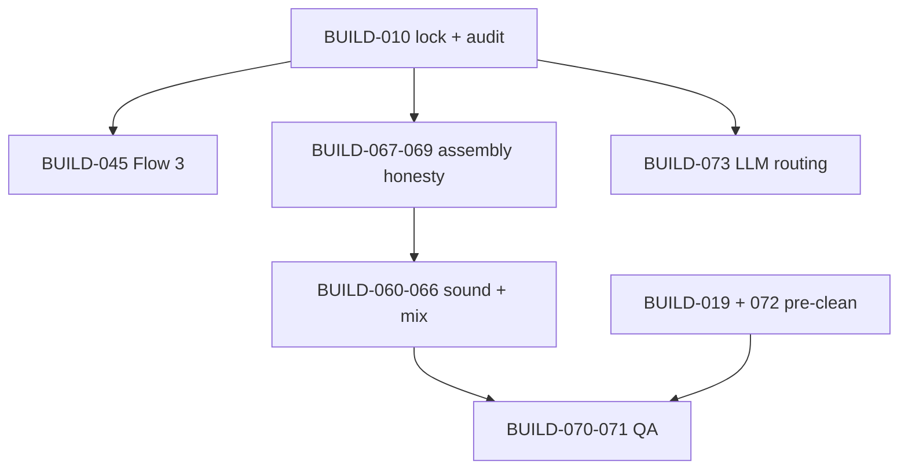

# Steps forward

Prioritized backlog for making the **whole repository** coherent: code, GUI, docs, and operator journey. Each item links to build-out tickets and north-star docs.

**Holistic build-out guide:** [implementation-guide.md](./implementation-guide.md) (all phases) · [full-application-flow.md](./full-application-flow.md) (operator journey) · [ticket-specs.md](./ticket-specs.md) (acceptance per BUILD id) · [stage-registry.md](./stage-registry.md) (every stage).

**Status key:** **Now** = unblock operators or agents this week · **Next** = quality/mix wave · **Later** = R&D or optional track

---

## Now — coherence and unblockers

| # | Goal | Tickets | Touch |
|---|------|---------|-------|
| 1 | **Finish anchor lock** — generate `requirements.lock`, run `pip-audit` in `check_prerequisites.sh`, point bootstrap at lock only | BUILD-010 | `scripts/`, `tools/check_prerequisites.sh`, [anchored-toolchain.md](../cross-cutting/anchored-toolchain.md) |
| 2 | **Flow 3 end-to-end** — `publishing_flow3.py`, `FLOW3_ORDER` in `pipeline.py`, CLI/GUI/runner | BUILD-045, 046, **080** | `src/`, [publishing/README.md](../pipeline/publishing/README.md), [smoke-test.md](../workflows/smoke-test.md) |
| 3 | **Align API docs with server** — mark `flow3` execute/G2 as shipped only after #2; until then GUI copy = flow1 \| flow2 only | BUILD-080 | [api-reference.md](../workflows/api-reference.md), [gui-surface-map.md](../workflows/gui-surface-map.md) |
| 4 | **Profile gate before Flow 1 extended** — warn/block `topic_coverage_audit` if `operator_verified` false | BUILD-081 *(new)* | `gates.py`, GUI, [operator-gates.md](../workflows/operator-gates.md) |
| 5 | **Keep operator checklists current** — any new stage/offer updates [operator-stage-checklists.md](../workflows/operator-stage-checklists.md) in the same PR | — | workflows |

---

## Next — podcast quality (product north star)

Aligned with [podcast-quality-roadmap.md](../cross-cutting/podcast-quality-roadmap.md).

### Wave A — Assembly honesty

| # | Goal | Tickets |
|---|------|---------|
| 6 | Gap report → EDL (VO placements, timeline offsets) | BUILD-067 |
| 7 | Apply `nle_edits.json` before ranking / EDL | BUILD-068 |
| 8 | `assembly_preview.wav` (speech + VO, no SFX) | BUILD-069 |

### Wave B — Coherent sound + mix

| # | Goal | Tickets |
|---|------|---------|
| 9 | Sound Design Plan schema + palettes | BUILD-060–061 |
| 10 | Flow 1/2 plan stages + ElevenLabs craft | BUILD-062–064 |
| 11 | Real mix engine (beds, stingers, ducking) | BUILD-065–066 |
| 12 | Source-derived sonic profile (optional input to SDP) | [source-derived-sonic-mix-profile.md](../cross-cutting/source-derived-sonic-mix-profile.md) + BUILD-082 *(new)* |

### Wave C — QA and mastering

| # | Goal | Tickets |
|---|------|---------|
| 13 | `verify_master` LUFS / true peak | BUILD-070 |
| 14 | Measured loudness on assembly bus | BUILD-071 |

### Wave D — Pre-clean offers

| # | Goal | Tickets |
|---|------|---------|
| 15 | `audio_preclean` stage (ElevenLabs isolation) | BUILD-019 |
| 16 | GUI offers at documented checkpoints + pickup-only scope | BUILD-072 |

---

## Later — platform and intelligence

| # | Goal | Tickets / docs |
|---|------|----------------|
| 17 | Smart LLM routing (arbiter, tiers, shard/collate) | BUILD-073 · [llm-orchestration-implementation-handoff.md](../cross-cutting/llm-orchestration-implementation-handoff.md) |
| 18 | Expand pytest coverage (gates, pipeline smoke, schema fixtures) | BUILD-054–055 |
| 19 | Value-analysis spikes (optional) | [value-analysis/README.md](../pipeline/value-analysis/README.md) · [future-proofing.md](../roadmap/future-proofing.md) |
| 20 | G1.5 SFX prompt review panel | [elevenlabs-integration-guide.md](../cross-cutting/elevenlabs-integration-guide.md) · BUILD-066 |

---

## Dependency sketch

---

## Definition of done (repository-wide)

- [ ] Fresh clone: `SETUP.md` → bootstrap → `check_prerequisites` → smoke-test passes for flow1 **or** flow2 on a fixture run
- [ ] `docs/build-out/repository-map.md` has no stale “code today” rows
- [ ] Every pipeline stage README links to a ticket and matches `pipeline.py` stage ids
- [ ] GUI panels in [gui-surface-map.md](../workflows/gui-surface-map.md) match `web/stages.py` and live routes in `server.py`
- [ ] Prompts under `docs/prompts/` match `llm_runner` / `analysis_stage` stage keys
- [ ] Operator-visible strings only via `gui_log.jsonl` / `gui_job.json` (see `.cursor/rules/interview-helper-mux.mdc`)

---

## Related

- [implementation-guide.md](./implementation-guide.md) — phased build plan for entire app
- [build-out/README.md](./README.md) — full ticket table
- [ticket-specs.md](./ticket-specs.md) — acceptance criteria
- [stage-registry.md](./stage-registry.md) — all stage ids
- [full-application-flow.md](./full-application-flow.md) — end-to-end flow
- [testing-and-verification.md](./testing-and-verification.md) — verify each wave
- [doc-maintenance.md](./doc-maintenance.md) — docs to update per PR
- [repository-map.md](./repository-map.md) — path ↔ module index
- [INDEX.md](../INDEX.md) — documentation hub
