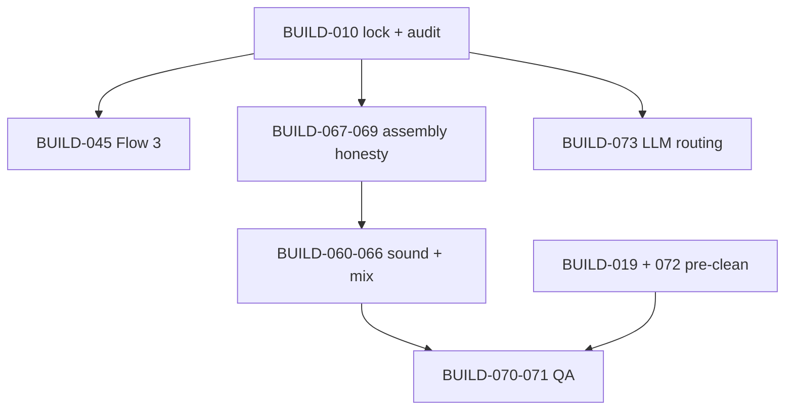

# Steps forward

Prioritized backlog for making the **whole repository** coherent: code, GUI, docs, and operator journey. Each item links to build-out tickets and north-star docs.

**What to do next (Agent work):** [remaining-build-commands.md](./remaining-build-commands.md) — open commands only; do not re-run shipped BUILD prompts from this file.

**Holistic build-out guide:** [implementation-guide.md](./implementation-guide.md) (all phases) · [full-application-flow.md](./full-application-flow.md) (operator journey) · [ticket-specs.md](./ticket-specs.md) (acceptance per BUILD id) · [stage-registry.md](./stage-registry.md) (every stage).

**Status key:** **Now** = unblock operators or agents this week · **Next** = quality/mix wave · **Later** = R&D or optional track · ~~struck~~ = **shipped** (historical reference)

---

## Cursor Agent — how to use this page

**For new work:** use [remaining-build-commands.md](./remaining-build-commands.md) (one command per chat). This page keeps **historical** step prompts for reference.

1. Open **Agent mode** in Cursor (not Ask mode).
2. Copy a command from [remaining-build-commands.md](./remaining-build-commands.md) — not the struck steps below unless you need context.
3. Use `@` to attach the listed docs (e.g. `@docs/build-out/ticket-specs.md`).
4. Use **Done when** checks from that command (pytest optional per remaining-build-commands).
5. Before starting the next command: update docs per [doc-maintenance.md](./doc-maintenance.md); mark tickets in [README.md](./README.md) and [ticket-specs.md](./ticket-specs.md).

**Always-on rules:** `.cursor/rules/interview-helper-mux.mdc` · navigation: [AGENTS.md](../../AGENTS.md)

### One-time machine setup (before step #0)

```bash
cd /path/to/interview_helper_mux
./scripts/bootstrap_venv.sh
source .venv/bin/activate
./tools/check_prerequisites.sh
cp config/templates/secrets.env.example config/secrets/secrets.env
# Edit config/secrets/secrets.env — OPENAI_API_KEY, ELEVENLABS_API_KEY, AWS_*
mkdir -p ASSETS/input
# Place a test WAV, e.g. ASSETS/input/interview.wav
```

### Verify after every step (baseline)

```bash
source .venv/bin/activate
./tools/check_prerequisites.sh
pytest tests/
```

Use step-specific **Verify** blocks below when they apply.

---

## Now — coherence and unblockers

| # | Goal | Tickets | Touch |
|---|------|---------|-------|
| ~~0~~ | ~~**ASSETS-first operator model**~~ — **done** | BUILD-014, 012, 057 | [assets-and-executions.md](../cross-cutting/assets-and-executions.md) |
| ~~1~~ | ~~**Finish anchor lock**~~ — **done** | BUILD-010 | [anchored-toolchain.md](../cross-cutting/anchored-toolchain.md) |
| ~~2~~ | ~~**Flow 3 end-to-end**~~ — **done** | BUILD-045, 046, **080** | [publishing/README.md](../pipeline/publishing/README.md) |
| ~~3~~ | ~~**Align API docs with server**~~ — **done** (flow3 at G2 + execute) | BUILD-080 | [api-reference.md](../workflows/api-reference.md) |
| ~~4~~ | ~~**Profile gate before Flow 1 extended**~~ — **done** | BUILD-081 | [operator-gates.md](../workflows/operator-gates.md) |
| 5 | **Keep operator checklists current** — any new stage/offer updates [operator-stage-checklists.md](../workflows/operator-stage-checklists.md) in the same PR | — | workflows |

### Step #0 — ASSETS-first operator model — **shipped**

**Agent prompt** (paste into Cursor Agent):

```text
Implement steps-forward backlog #0 — ASSETS-first operator model only.

Tickets: BUILD-012, BUILD-014, BUILD-057 (align code + docs; do not start unrelated tickets).

Read first:
@docs/build-out/ticket-specs.md (BUILD-012, BUILD-014, BUILD-057)
@docs/cross-cutting/assets-and-executions.md
@docs/build-out/repository-map.md (Known gaps for ASSETS / resume)
@docs/workflows/gui-surface-map.md
@docs/workflows/api-reference.md

Constraints: .cursor/rules/interview-helper-mux.mdc and AGENTS.md.
- Default input from ASSETS/ picker, not config-only INPUT_AUDIO_PATH for normal GUI use
- Runs under ASSETS/executions/exec_*
- Resume via Previous executions after ./scripts/run.sh
- Operator-visible text only via ctx.log() / gui_log.jsonl

Deliver: minimal diff in run_context.py, web/server.py, gui_session.py, CLI --run-id exec_* as needed.
Update docs per docs/build-out/doc-maintenance.md; clear matching repository-map gap rows.

When done, run the Verify commands below and report pass/fail.
```

**Verify:**

```bash
source .venv/bin/activate
./scripts/run.sh
# GUI: home lists WAV under ASSETS/input/ → start execution → note exec_* run_id in header
# Stop server (Ctrl+C), then:
./scripts/run.sh
# GUI: Previous executions → same exec_* → stages + log panel intact
ls ASSETS/executions/
```

---

### Step #1 — Finish anchor lock (BUILD-010) — **shipped**

**Agent prompt:**

```text
Implement BUILD-010 only — anchor lock (requirements.lock + pip-audit gate).

Read first:
@docs/build-out/ticket-specs.md (BUILD-010)
@docs/cross-cutting/anchored-toolchain.md
@scripts/bootstrap_venv.sh
@tools/check_prerequisites.sh

Constraints: .cursor/rules/interview-helper-mux.mdc.
- requirements.lock at repo root with full transitive pins
- bootstrap_venv.sh installs ONLY from lock when present
- check_prerequisites.sh runs pip-audit; fail on unaccepted HIGH/CRITICAL
- Update docs/cross-cutting/anchored-requirements.lock mirror if required

Do not add unrelated dependencies. Update doc-maintenance checklist items for BUILD-010.

When done, run Verify below.
```

**Verify:**

```bash
source .venv/bin/activate
./scripts/bootstrap_venv.sh
./tools/check_prerequisites.sh
python -c "import interview_mux; print('ok')"
test -f requirements.lock && head -5 requirements.lock
```

---

### Step #2 — Flow 3 end-to-end (BUILD-045, 046, 080) — **shipped**

**Agent prompt:**

```text
Implement steps-forward backlog #2 — Flow 3 end-to-end only.

Tickets: BUILD-045, BUILD-046, BUILD-080 (publishing; no flow1/flow2 mix changes).

Read first:
@docs/build-out/ticket-specs.md (BUILD-045, BUILD-046, BUILD-080)
@docs/build-out/stage-registry.md (flow3 stages)
@docs/pipeline/publishing/README.md
@docs/prompts/publishing/podcast-show-description.system.txt
@docs/cross-cutting/json-schemas/ (show description schema)
@src/interview_mux/pipeline.py
@tools/run_flow.py

Constraints: .cursor/rules/interview-helper-mux.mdc.
- publishing_flow3.py: podcast_show_description + export_show_description
- FLOW3_ORDER, run_flow3(), run_single_stage branch in pipeline.py
- tools/run_flow.py --flow flow3; cli.flow_cmd accepts flow3
- web/runner.py mode flow3; server.py FlowBody includes flow3
- web/stages.py FLOW3_STAGES + all_stages_for_run branch
- ctx.log() for operator milestones; no master.wav for flow3

Update smoke-test.md Flow 3 section, doc-maintenance, README/ticket-specs/repository-map.

When done, run Verify below (use an existing exec_* with analysis_complete.json if you have one).
```

**Verify:**

```bash
source .venv/bin/activate
# Replace EXEC_ID with a run that finished shared analysis:
export EXEC_ID=exec_001_20260523T120000Z
python tools/run_flow.py --flow flow3 --run-id "$EXEC_ID"
test -f "ASSETS/executions/${EXEC_ID}/flow_3_description/show_description.json"
test -f "ASSETS/executions/${EXEC_ID}/flow_3_description/show_description.md"
! test -f "ASSETS/executions/${EXEC_ID}/flow_3_description/master.wav"
pytest tests/
```

---

### Step #3 — Align API docs with server (after #2) — **shipped**

**Agent prompt:**

```text
Implement steps-forward backlog #3 — align API and GUI docs with shipped Flow 3 only.

Scope: documentation + GUI copy strings (minimal code only if docs reveal drift).

Read first:
@docs/workflows/api-reference.md
@docs/workflows/gui-surface-map.md
@src/interview_mux/web/server.py
@src/interview_mux/web/stages.py
@docs/build-out/repository-map.md

Update api-reference.md and gui-surface-map.md so flow3 execute, G2 selected_flow, and stage lists match server.py and web/stages.py.
Mark flow3 as shipped in build-out/README.md only if BUILD-080 verification passes.
Do not claim VO+SFX mix or other planned gaps from repository-map.

When done, run Verify below.
```

**Verify:**

```bash
source .venv/bin/activate
./scripts/run.sh
# GUI: G2 shows flow1 | flow2 | flow3; execute flow3 stage from UI
grep -E "flow3|flow_3" docs/workflows/api-reference.md docs/workflows/gui-surface-map.md
```

---

### Step #4 — Profile gate before Flow 1 extended (BUILD-081) — **shipped**

**Agent prompt:**

```text
Implement BUILD-081 only — profile gate before Flow 1 extended stages.

Read first:
@docs/build-out/ticket-specs.md (BUILD-081)
@docs/workflows/operator-gates.md
@src/interview_mux/gates.py
@docs/build-out/stage-registry.md (topic_coverage_audit)

Constraints: .cursor/rules/interview-helper-mux.mdc.
- Block or warn before topic_coverage_audit when meta.operator_verified is false in analysis_state.json
- ctx.log() explains required operator action
- GUI gate panel if applicable
- Do not run Flow 1 extended unless selected_flow is flow1

Update operator-gates.md and operator-stage-checklists.md per doc-maintenance.md.

When done, run Verify below.
```

**Verify:**

```bash
source .venv/bin/activate
pytest tests/ -q
# Manual: run with operator_verified false → topic_coverage_audit blocked or warned in gui_log.jsonl
```

---

### Step #5 — Keep operator checklists current

Run this **in the same agent session** as any step that adds stages, gates, or quality offers — not as a standalone feature build.

**Agent prompt:**

```text
Backlog #5 only: update operator-stage-checklists.md for the stages/gates/offers changed in this PR.

Read:
@docs/workflows/operator-stage-checklists.md
@docs/build-out/stage-registry.md
@docs/build-out/doc-maintenance.md

Add Pass / If fail rows for each new or changed stage id. Link to artifact-layout paths. No duplicate of api-reference or ticket-specs tables.
```

**Verify:**

```bash
grep -l "topic_coverage_audit\|podcast_show_description\|sound_design" docs/workflows/operator-stage-checklists.md || true
# Expect rows for whatever stages this PR added
```

---

## Next — podcast quality (product north star)

Aligned with [podcast-quality-roadmap.md](../cross-cutting/podcast-quality-roadmap.md).

### Wave A — Assembly honesty

| # | Goal | Tickets |
|---|------|---------|
| ~~6~~ | ~~Gap report → EDL (VO placements, timeline offsets)~~ — **done** | BUILD-067 |
| ~~7~~ | ~~Apply `nle_edits.json` before ranking / EDL~~ — **done** | BUILD-068 |
| ~~8~~ | ~~`assembly_preview.wav` (speech + VO, no SFX)~~ — **done** | BUILD-069 |

### Step #6 — Gap report → EDL (BUILD-067) — **shipped**

**Agent prompt:**

```text
Implement BUILD-067 only — gap report → EDL (VO placements, timeline offsets).

Read first:
@docs/build-out/ticket-specs.md (BUILD-067)
@docs/cross-cutting/podcast-quality-roadmap.md
@docs/pipeline/assembly_and_mux/README.md
@src/interview_mux/stages/assembly_flow1.py
@docs/cross-cutting/artifact-layout.md

Deliver: edl_flow1 includes vo_pickup placements and gap-driven ordering; transitions/ranking respect gap_report.json.
v1 honesty: document what is still speech-only vs full mix in repository-map if mix not in scope.

Update stage-registry, operator-stage-checklists, doc-maintenance.

When done, run Verify below on a flow1 run with vo_pickup WAVs.
```

**Verify:**

```bash
source .venv/bin/activate
export EXEC_ID=exec_001_20260523T120000Z
python tools/run_flow.py --flow flow1 --run-id "$EXEC_ID" --from-stage edl_flow1
python -c "import json; p='ASSETS/executions/${EXEC_ID}/flow_1_master/edl.json'; d=json.load(open(p)); print('vo' in str(d).lower(), len(d))"
```

---

### Step #7 — NLE → selection/EDL (BUILD-068) — **shipped**

**Agent prompt:**

```text
Implement BUILD-068 only — apply nle_edits.json before ranking or EDL build.

Read first:
@docs/build-out/ticket-specs.md (BUILD-068)
@docs/pipeline/audio_editing/README.md
@src/interview_mux/nle_state.py
@src/interview_mux/stages/selection_flow1.py

Deliver: segments/nle_edits.json exclude/split/reorder reflected in selection.json or edl_flow1 before full_master_ranking.
Wire GUI NLE API consumption; ctx.log() on apply.

Update gui-surface-map if new operator actions. doc-maintenance.

When done, run Verify below.
```

**Verify:**

```bash
source .venv/bin/activate
export EXEC_ID=exec_001_20260523T120000Z
test -f "ASSETS/executions/${EXEC_ID}/segments/nle_edits.json" || echo "Create nle_edits via GUI/API first"
python tools/run_flow.py --flow flow1 --run-id "$EXEC_ID" --from-stage full_master_ranking
```

---

### Step #8 — Assembly preview (BUILD-069) — **shipped**

**Agent prompt:**

```text
Implement BUILD-069 only — assembly_preview.wav (speech + VO, no SFX).

Read first:
@docs/build-out/ticket-specs.md (BUILD-069)
@docs/cross-cutting/podcast-quality-roadmap.md
@src/interview_mux/stages/assembly_flow1.py

Deliver: flow_1_master/assembly_preview.wav before ElevenLabs spend; GUI listen action; ctx.log() when ready.

Update gui-surface-map, api-reference if routes added. doc-maintenance.

When done, run Verify below.
```

**Verify:**

```bash
source .venv/bin/activate
export EXEC_ID=exec_001_20260523T120000Z
python tools/run_flow.py --flow flow1 --run-id "$EXEC_ID" --from-stage mux_flow1
test -f "ASSETS/executions/${EXEC_ID}/flow_1_master/assembly_preview.wav"
ffprobe -hide_banner "ASSETS/executions/${EXEC_ID}/flow_1_master/assembly_preview.wav" 2>&1 | head -3
```

---

### Wave B — Coherent sound + mix

| # | Goal | Tickets |
|---|------|---------|
| ~~9~~ | ~~Sound Design Plan schema + palettes~~ — **done** | BUILD-060–061 |
| ~~10~~ | ~~Flow 1/2 plan stages + ElevenLabs craft~~ — **done** | BUILD-062–064 |
| ~~11~~ | ~~Real mix engine (beds, stingers, ducking)~~ — **done** | BUILD-065–066 |
| ~~12~~ | ~~Source-derived sonic profile~~ — **done** | BUILD-082 |

### Step #9 — SDP schema + palettes (BUILD-060, then BUILD-061) — **shipped**

Use **two agent sessions** — one per BUILD id.

**Agent prompt — BUILD-060:**

```text
Implement BUILD-060 only — Sound Design Plan schema + empty plan init.

Read first:
@docs/build-out/ticket-specs.md (BUILD-060)
@docs/cross-cutting/sound-design.md
@docs/cross-cutting/json-schemas/
@docs/prompts/sound_design/README.md

Deliver: sound_design_plan.schema.json; initialize understanding/sound_design_plan.json at documented point in shared analysis.

Update json-schema-coverage, artifact-layout, stage-registry. doc-maintenance.

When done, run Verify below.
```

**Verify (BUILD-060):**

```bash
source .venv/bin/activate
pytest tests/test_prompt_validation.py -q
ls docs/cross-cutting/json-schemas/*sound*
```

**Agent prompt — BUILD-061:**

```text
Implement BUILD-061 only — sound_design_palettes stage after segment_classification.

Read first:
@docs/build-out/ticket-specs.md (BUILD-061)
@docs/build-out/stage-registry.md
@docs/prompts/sound_design/
@src/interview_mux/pipeline.py (ANALYSIS_ORDER)

Deliver: stage sound_design_palettes writes palettes + coherence to SDP; prompt from docs/prompts/; schema validation.

Update pipeline.py, web/stages.py, operator-stage-checklists. doc-maintenance.

When done, run Verify below.
```

**Verify (BUILD-061):**

```bash
source .venv/bin/activate
export EXEC_ID=exec_001_20260523T120000Z
python tools/run_analysis.py --run-id "$EXEC_ID" --from-stage sound_design_palettes
test -f "ASSETS/executions/${EXEC_ID}/understanding/sound_design_plan.json"
```

---

### Step #10 — Flow plans + ElevenLabs craft (BUILD-062, 063, 064) — **shipped**

Use **three agent sessions** unless you explicitly want one combined PR.

**Agent prompt — BUILD-062:**

```text
Implement BUILD-062 only — sound_design_plan_flow1 after G2 flow1 selection.

Read: @docs/build-out/ticket-specs.md @docs/cross-cutting/sound-design.md @src/interview_mux/pipeline.py (FLOW1_ORDER)
Cues must reference reusable asset_ids. Requires run_meta.selected_flow flow1.
```

**Agent prompt — BUILD-063:**

```text
Implement BUILD-063 only — sound_design_plan_flow2 after G2 flow2 selection.

Read: @docs/build-out/ticket-specs.md @docs/cross-cutting/sound-design.md @src/interview_mux/pipeline.py (FLOW2_ORDER)
```

**Agent prompt — BUILD-064:**

```text
Implement BUILD-064 only — ElevenLabs prompt craft + generate (one WAV per asset_id).

Read:
@docs/build-out/ticket-specs.md (BUILD-064)
@docs/cross-cutting/elevenlabs-integration-guide.md
@src/interview_mux/elevenlabs_rest.py
@docs/prompts/sound_design/

REST via elevenlabs_rest only (no SDK). OpenAI craft → elevenlabs_prompts.json; respect duration_seconds from plan.
```

**Verify (step #10):**

```bash
source .venv/bin/activate
export EXEC_ID=exec_001_20260523T120000Z
python tools/run_flow.py --flow flow1 --run-id "$EXEC_ID" --from-stage sound_design_plan_flow1
ls "ASSETS/executions/${EXEC_ID}/flow_1_master/sfx/" 2>/dev/null || ls "ASSETS/executions/${EXEC_ID}/flow_1_master/" 
```

---

### Step #11 — Mix engine + pipeline wire-up (BUILD-065, then BUILD-066) — **shipped**

**Agent prompt — BUILD-065:**

```text
Implement BUILD-065 only — mix_flow1 / mix_flow2 replacing v1 speech-only mux.

Read:
@docs/build-out/ticket-specs.md (BUILD-065)
@docs/cross-cutting/sound-design.md
@src/interview_mux/stages/assembly_flow1.py
@src/interview_mux/stages/assembly_flow2.py

Deliver: VO + beds + stingers + ducking; master.wav audibly includes SFX. ctx.log() milestones.
```

**Agent prompt — BUILD-066:**

```text
Implement BUILD-066 only — pipeline + GUI wire-up for sound design stages.

Read:
@docs/build-out/ticket-specs.md (BUILD-066)
@src/interview_mux/pipeline.py
@src/interview_mux/web/stages.py
@docs/workflows/gui-surface-map.md

Update stage order; optional G1.5 SFX prompt review panel; alias or remove v1 brief stages from default path.
```

**Verify (step #11):**

```bash
source .venv/bin/activate
export EXEC_ID=exec_001_20260523T120000Z
python tools/run_flow.py --flow flow1 --run-id "$EXEC_ID"
python tools/verify_master.py "ASSETS/executions/${EXEC_ID}/flow_1_master/master.wav"
# Manual listen: SFX + VO audible (not speech-only concat)
```

---

### Step #12 — Source acoustic profile (BUILD-082) — **shipped**

**Agent prompt:**

```text
Implement BUILD-082 only — source_acoustic_profile stage.

Read first:
@docs/build-out/ticket-specs.md (BUILD-082)
@docs/cross-cutting/source-derived-sonic-mix-profile.md
@docs/build-out/stage-registry.md

Deliver: understanding/source_acoustic_profile.json; consumed by sound_design_palettes (BUILD-061) and ElevenLabs craft (BUILD-064) per spec.

Update pipeline.py, web/stages.py, prompts if new LLM stage. doc-maintenance.
```

**Verify:**

```bash
source .venv/bin/activate
export EXEC_ID=exec_001_20260523T120000Z
python tools/run_analysis.py --run-id "$EXEC_ID" --from-stage source_acoustic_profile
test -f "ASSETS/executions/${EXEC_ID}/understanding/source_acoustic_profile.json"
```

---

### Wave C — QA and mastering

| # | Goal | Tickets |
|---|------|---------|
| ~~13~~ | ~~`verify_master` LUFS / true peak~~ — **done** | BUILD-070 |
| ~~14~~ | ~~Measured loudness on assembly bus~~ — **done** | BUILD-071 |

### Step #13 — verify_master LUFS/peak (BUILD-070) — **shipped**

**Agent prompt:**

```text
Implement BUILD-070 only — verify_master LUFS and true peak enforcement.

Read first:
@docs/build-out/ticket-specs.md (BUILD-070)
@docs/cross-cutting/evaluation-metrics.md
@tools/verify_master.py

Deliver: integrated loudness and true peak checks; CLI non-zero exit on fail; GUI surfaces result if applicable.

Update smoke-test and testing-and-verification.md. doc-maintenance.
```

**Verify:**

```bash
source .venv/bin/activate
export EXEC_ID=exec_001_20260523T120000Z
python tools/verify_master.py "ASSETS/executions/${EXEC_ID}/flow_1_master/master.wav"
echo exit_code=$?
```

---

### Step #14 — Mastering measurement (BUILD-071) — **shipped**

**Agent prompt:**

```text
Implement BUILD-071 only — measured loudness on assembly bus before final limiter.

Read first:
@docs/build-out/ticket-specs.md (BUILD-071)
@src/interview_mux/stages/mastering.py
@docs/cross-cutting/evaluation-metrics.md

Deliver: two-pass or pyloudnorm on assembly bus per spec. Integrate with BUILD-070 thresholds.
```

**Verify:**

```bash
source .venv/bin/activate
export EXEC_ID=exec_001_20260523T120000Z
python tools/run_flow.py --flow flow1 --run-id "$EXEC_ID" --from-stage master_flow1
python tools/verify_master.py "ASSETS/executions/${EXEC_ID}/flow_1_master/master.wav"
```

---

### Wave D — Pre-clean offers

| # | Goal | Tickets |
|---|------|---------|
| ~~15~~ | ~~`audio_preclean` stage (ElevenLabs isolation)~~ — **done** | BUILD-019 |
| ~~16~~ | ~~GUI offers at documented checkpoints + pickup-only scope~~ — **done** | BUILD-072 |

### Step #15 — audio_preclean stage (BUILD-019) — **shipped**

**Agent prompt:**

```text
Implement BUILD-019 only — audio_preclean stage (ElevenLabs isolation, optional).

Read first:
@docs/build-out/ticket-specs.md (BUILD-019)
@docs/pipeline/audio_preclean/README.md
@docs/cross-cutting/elevenlabs-integration-guide.md
@src/interview_mux/elevenlabs_rest.py

Constraints: never auto-enable pre-clean; operator must accept quality offer.
Stage before ingest when enabled; REST only.

Update pipeline.py, web/stages.py, operator-gates quality offers section. doc-maintenance.
```

**Verify:**

```bash
source .venv/bin/activate
export EXEC_ID=exec_001_20260523T120000Z
# Only after operator accepts offer in GUI or run_meta flag set:
python tools/run_analysis.py --run-id "$EXEC_ID" --from-stage audio_preclean
```

---

### Step #16 — Pre-clean GUI offers (BUILD-072) — **shipped**

**Agent prompt:**

```text
Implement BUILD-072 only — GUI pre-clean quality offers at documented checkpoints.

Read first:
@docs/build-out/ticket-specs.md (BUILD-072)
@docs/cross-cutting/podcast-quality-roadmap.md
@docs/workflows/operator-gates.md
@src/interview_mux/web/server.py

Deliver: GUI prompts at all checkpoints in quality roadmap; pickup-only scope flag in run_meta.json; ctx.log() for offer/accept/dismiss.

Never auto-run pre-clean. doc-maintenance.
```

**Verify:**

```bash
source .venv/bin/activate
./scripts/run.sh
# Manual: trigger offer at G1 pickup path; confirm gui_log.jsonl entries and run_meta pickup scope flag
```

---

## Later — platform and intelligence

| # | Goal | Tickets / docs |
|---|------|----------------|
| ~~17~~ | ~~Smart LLM routing (arbiter, tiers, shard/collate)~~ — **done** | BUILD-073 |
| ~~18~~ | ~~Expand pytest coverage~~ — **done** | BUILD-054–055 |
| ~~19~~ | ~~Value-analysis spikes (optional)~~ — **done** (tooling + docs) | [value-analysis/README.md](../pipeline/value-analysis/README.md) |
| ~~20~~ | ~~G1.5 SFX prompt review panel~~ — **done** | BUILD-066 |

### Step #17 — Smart LLM routing (BUILD-073) — **shipped**

**Agent prompt:**

```text
Implement BUILD-073 only — smart LLM routing (model_registry, llm_arbiter, shard/collate).

Read first:
@docs/build-out/ticket-specs.md (BUILD-073)
@docs/cross-cutting/llm-orchestration-implementation-handoff.md
@docs/cross-cutting/llm-orchestration.md
@docs/prompts/_shared/llm-arbiter-contract.md
@src/interview_mux/stages/llm_runner.py

Deliver per handoff doc; stage_runs/*/attempt_*.json records arbiter verdict; long fixture shows shard when decompose fires.

Update model-routing.md, analysis-stage-matrix if tiers change. doc-maintenance.
```

**Verify:**

```bash
source .venv/bin/activate
pytest tests/ -q
export EXEC_ID=exec_001_20260523T120000Z
python tools/run_analysis.py --run-id "$EXEC_ID" --from-stage speaker_roles
python -c "import json,glob; fs=glob.glob('ASSETS/executions/${EXEC_ID}/understanding/stage_runs/*/attempt_*.json'); print(len(fs), fs[:1])"
```

---

### Step #18 — Expand pytest coverage (BUILD-054–055 extension)

**Agent prompt:**

```text
Implement steps-forward backlog #18 — expand pytest coverage only.

Tickets: extend BUILD-054–055 (gates helpers, pipeline smoke with fixture run dir, schema fixture per stage key).

Read first:
@docs/build-out/ticket-specs.md (BUILD-054–055)
@tests/
@docs/build-out/testing-and-verification.md

Use fixture run directories under tests/fixtures/ — no live AWS/OpenAI in CI tests.
Do not change production pipeline behavior unless fixing a bug found by tests.
```

**Verify:**

```bash
source .venv/bin/activate
pytest tests/ -v
```

---

### Step #19 — Value-analysis spikes (optional R&D)

**Agent prompt:**

```text
Optional spike only — value-analysis (not on default delivery path).

Read:
@docs/pipeline/value-analysis/README.md
@docs/roadmap/future-proofing.md

Deliver: doc or prototype under docs/pipeline/value-analysis/ only unless product explicitly expands scope.
Do not wire into default pipeline.py or web/runner.py without a new BUILD ticket.
```

**Verify:**

```bash
ls docs/pipeline/value-analysis/
# No requirement for pytest unless tests were added
```

---

### Step #20 — G1.5 SFX prompt review panel (BUILD-066 partial)

**Agent prompt:**

```text
Implement G1.5 SFX prompt review panel (steps-forward #20) as part of BUILD-066 sound-design GUI wire-up.

Read first:
@docs/cross-cutting/elevenlabs-integration-guide.md
@docs/build-out/ticket-specs.md (BUILD-066)
@docs/workflows/gui-surface-map.md
@src/interview_mux/web/static/

Deliver: operator can review/edit ElevenLabs prompts before generation; outcomes via ctx.log(); api-reference + gui-surface-map updated.

Depends on BUILD-064/066 foundation — if missing, implement minimal review UI stub with clear log messages.
```

**Verify:**

```bash
source .venv/bin/activate
./scripts/run.sh
# Manual: open SFX review panel before elevenlabs generate; approve → generation runs
grep -i "G1.5\|sfx.*review\|prompt review" docs/workflows/gui-surface-map.md
```

---

## Dependency sketch



**Suggested agent order (historical):** all core steps above are shipped. Use [remaining-build-commands.md](./remaining-build-commands.md) for open work.

---

## Definition of done (repository-wide)

- [x] Operator can run end-to-end without setting `INPUT_AUDIO_PATH`: drop WAV in `ASSETS/`, `./scripts/run.sh`, pick input, resume prior `exec_*` after relaunch ([assets-and-executions.md](../cross-cutting/assets-and-executions.md); `web/server.py`, `RunContext`)
- [ ] Fresh clone: `SETUP.md` → bootstrap → `check_prerequisites` → smoke-test passes for flow1 **and** flow2 **and** flow3 on a fixture run — manual: [definition-of-done-signoff.md](./definition-of-done-signoff.md)
- [x] `docs/build-out/repository-map.md` has no stale “code today” rows (gap table cleared; ASSETS, mix, pre-clean, LLM routing shipped)
- [ ] Every pipeline stage README links to a ticket and matches `pipeline.py` stage ids
- [ ] GUI panels in [gui-surface-map.md](../workflows/gui-surface-map.md) match `web/stages.py` and live routes in `server.py`
- [ ] Prompts under `docs/prompts/` match `llm_runner` / `analysis_stage` stage keys
- [ ] Operator-visible strings only via `gui_log.jsonl` / `gui_job.json` (see `.cursor/rules/interview-helper-mux.mdc`)

**Open work:** [remaining-build-commands.md](./remaining-build-commands.md) (schema validation, post-listen GUI, optional value-features auto-extract, etc.).

### Full-repo smoke (after major milestones)

**Agent prompt:**

```text
Run full-repo verification only — no feature code.

Follow @docs/workflows/smoke-test.md and @docs/build-out/testing-and-verification.md.
Execute each command; report pass/fail per section. If a step fails, cite log path under ASSETS/executions/<exec_id>/gui_log.jsonl.
```

**Verify:**

```bash
source .venv/bin/activate
./tools/check_prerequisites.sh
pytest tests/
./scripts/run.sh
# Complete smoke-test.md GUI + CLI sections for flow1, flow2, flow3
```

---

## Related

- **[remaining-build-commands.md](./remaining-build-commands.md)** — **use this for new Agent work** (excludes shipped BUILD commands; no pytest verify)
- [implementation-guide.md](./implementation-guide.md) — phased build plan for entire app
- [build-out/README.md](./README.md) — full ticket table
- [ticket-specs.md](./ticket-specs.md) — acceptance criteria
- [stage-registry.md](./stage-registry.md) — all stage ids
- [full-application-flow.md](./full-application-flow.md) — end-to-end flow
- [testing-and-verification.md](./testing-and-verification.md) — verify each wave
- [doc-maintenance.md](./doc-maintenance.md) — docs to update per PR
- [repository-map.md](./repository-map.md) — path ↔ module index
- [INDEX.md](../INDEX.md) — documentation hub

---


---


## Appendix — archived Agent command queue

**Superseded.** BUILD-060–073, 019, 072, 081, 082, and core Waves 5–7 are shipped in code. Do **not** copy Commands 1–15 from this appendix.

**Use instead:** [remaining-build-commands.md](./remaining-build-commands.md) — Commands 2–9 for remaining doc hub, schema validation, post-listen GUI, and optional R&D.

Historical prompts for steps #0–#20 remain in the body of this file (marked **shipped**).
