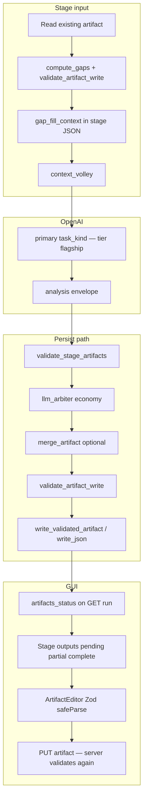

# Artifact generation and validation

**Status: shipped** — flagship OpenAI generation for all structured LLM artifacts, incremental gap-fill, JSON Schema validation on every disk write, and Zod validation in the GUI before save.

**Related:**

- [model-routing.md](./model-routing.md) — tier registry (`flagship` = `o3` by default)
- [llm-orchestration.md](./llm-orchestration.md) — primary → schema → arbiter → persist gating
- [json-schema-coverage.md](./json-schema-coverage.md) — which paths have validators
- [analysis-memory.md](./analysis-memory.md) — profile merge and operator verification
- [artifact-layout.md](./artifact-layout.md) — on-disk paths per stage
- [gui-surface-map.md](../workflows/gui-surface-map.md) — Stage outputs UI
- [api-reference.md](../workflows/api-reference.md) — `artifacts_status`, `fill-artifact-gaps`

---

## Goals

1. **Every descriptive JSON artifact** under a run workspace is produced by an **OpenAI flagship** primary call (not economy/standard tiers, not local-only pilot).
2. **Incremental fill** — when a file already exists but is incomplete, the model receives `gap_fill_context` and returns **patches only** for missing fields; satisfied keys are listed in `skip_fields`.
3. **Validate before write** — no artifact is persisted unless it passes the on-disk JSON Schema registered in `ARTIFACT_WRITE_VALIDATORS`.
4. **Operator review** — GUI shows `pending` / `partial` / `complete` per artifact; Open / edit / save with client-side Zod + server-side jsonschema.
5. **Handoff between stages** — each write to a **custom-run** descriptive path (see `CUSTOM_RUN_ARTIFACT_PATHS` in `src/interview_mux/custom_run_handoff.py`) records a review checkpoint; batch runs pause with `SystemExit` until `POST …/handoff-ack` for that stage ([operator-gates.md](../workflows/operator-gates.md)).

**Out of scope:** binary audio (`*.wav`), raw AWS Transcribe export shape (optional future schema), deterministic numeric fields in `source_acoustic_profile.json` (WPM, pause stats from audio analysis).

---

## Architecture



---

## Code modules

| Module | Path | Role |
|--------|------|------|
| Gap-fill + merge + completeness | `src/interview_mux/artifact_completeness.py` | `compute_gaps`, `merge_artifact`, `build_gap_fill_context`, `artifact_status`, `should_run_stage_for_artifact`, `make_stage_persist` |
| Validated write | `src/interview_mux/artifact_writes.py` | `write_validated_artifact` — merge, validate, log, `RunContext.write_json` |
| Schema registry | `src/interview_mux/prompt_validation.py` | `STAGE_ARTIFACT_SCHEMAS`, `STAGE_ARTIFACT_DISK_PATHS`, `ARTIFACT_WRITE_VALIDATORS`, `validate_artifact_write` |
| Stage runner | `src/interview_mux/stages/analysis_stage.py` | `attach_gap_fill_to_input` on every LLM stage input |
| Routing | `src/interview_mux/llm_stage_routing.py` | `force_openai` when `stage_key in STAGE_ARTIFACT_SCHEMAS` |
| Pipeline | `src/interview_mux/pipeline.py` | Re-run LLM stage if `should_run_stage_for_artifact` even when `.stage_done` exists |
| GUI API | `src/interview_mux/web/server.py` | `artifacts_status`, `POST …/fill-artifact-gaps` |
| Zod codegen | `tools/codegen_zod_schemas.py` | Emits `frontend/src/schemas/generated/*.ts` |
| GUI validate | `frontend/src/schemas/validateArtifact.ts` | Mirrors `ARTIFACT_WRITE_VALIDATORS` paths |

---

## Stage → disk path map

Canonical map: `STAGE_ARTIFACT_DISK_PATHS` in `prompt_validation.py`.

| Stage key | On-disk path |
|-----------|----------------|
| `speaker_roles` | `understanding/speakers.json` |
| `content_context` | `understanding/content_brief.json` |
| `boundary_detection` | `segments/boundaries.json` |
| `segment_classification` | `segments/manifest.json` |
| `sound_design_palettes` | `understanding/sound_design_plan.json` |
| `missing_framing` | `understanding/gap_evaluations.json` |
| `optimal_questions` | `understanding/gap_report.json` |
| `topic_coverage_audit` | `flow_1_master/coverage_audit.json` |
| `narrative_arc_plan` | `flow_1_master/narrative_plan.json` |
| `full_master_ranking` | `flow_1_master/selection.json` |
| `transitions` | `flow_1_master/transitions.json` |
| `podcast_sfx_brief` | `flow_1_master/podcast_sfx_brief.json` |
| `sound_design_plan_flow1` / `flow2` | `understanding/sound_design_plan.json` |
| `elevenlabs_prompt_craft` | `sound_design/elevenlabs_prompts.json` |
| `sfx_brief` | `flow_2_highlights/sfx_brief.json` |
| `podcast_show_description` | `flow_3_description/show_description.json` |
| `edl_narrative_audit` | `flow_1_master/edl_narrative_audit.json` |
| `highlight_selection` | `flow_2_highlights/selection.json` |

`analysis_state.json` is updated via `memory_updates` on the envelope (not a direct stage artifact file), but is validated on every `write_json` and included in completeness rules for themes/thesis.

---

## Gap-fill contract

### Input: `gap_fill_context`

Injected by `attach_gap_fill_to_input()` into the final user turn JSON for each LLM stage:

```json
{
  "gap_fill_context": {
    "artifact_path": "understanding/content_brief.json",
    "existing": { "... prior on-disk object or null ..." },
    "gaps": ["thesis", "topics[0].summary"],
    "skip_fields": ["audience"],
    "instructions": "Only fill listed gaps. Do not overwrite skip_fields..."
  }
}
```

Documented in [analysis-preamble.system.txt](../prompts/_shared/analysis-preamble.system.txt). Per-stage prompts should repeat the one-line rule when they write structured `artifacts`.

### Semantic completeness rules

`ARTIFACT_COMPLETENESS_RULES` in `artifact_completeness.py` — examples:

| Path | Incomplete when |
|------|-----------------|
| `understanding/content_brief.json` | empty `thesis`, no `topics`, or topic missing `summary` |
| `understanding/analysis_state.json` | no `themes`, empty `narrative.thesis`, empty `interview_identity.one_line_summary` |
| `understanding/speakers.json` | no speakers or missing `role` |
| `understanding/sound_design_plan.json` | empty `coherence.sonic_identity` or no `palettes` |
| `segments/manifest.json` | no `segments` array |

Schema validation failures also mark an artifact **partial** and trigger re-run.

### Merge behavior

`merge_artifact(rel_path, existing, patch)`:

- Default: deep merge; lists like `themes` use analysis-memory append semantics where applicable.
- `segments/manifest.json`: merge by `segment_id`.
- `understanding/sound_design_plan.json`: deep merge for palettes/coherence/assets/flow_plans.
- When `meta.operator_verified: true` on `analysis_state.json`, protected keys (`themes`, `major_questions`, `narrative`, `style`) are not overwritten by LLM patches.

Stage persist helpers use `make_stage_persist(path, stage_key)` → `write_validated_artifact(..., merge_from_disk=True)`.

---

## Validation layers

| Layer | When | Mechanism |
|-------|------|-----------|
| **Envelope** | After primary parse, before arbiter | `validate_envelope` → `analysis_envelope.schema.json` |
| **Stage artifacts** | Before persist decision | `validate_stage_artifacts(stage_key, artifacts)` → `artifacts/*.schema.json` |
| **On-disk write** | Every `RunContext.write_json` dict + GUI PUT | `validate_artifact_write(rel_path, data)` → `ARTIFACT_WRITE_VALIDATORS` |
| **GUI pre-save** | Artifact editor / profile save | Zod `safeParse` via `frontend/src/schemas/validateArtifact.ts` |

If `validate_artifact_write` fails, `write_json` raises `ValueError` and `write_validated_artifact` logs to `gui_log.jsonl` with `level=error`.

**Arbiter:** Still **economy** tier. Persist only when `should_persist_artifacts` is true (accept or successful collate, no schema errors).

---

## OpenAI flagship routing

- **Config:** `config/app.defaults.json` → `models.stages.<stage_key>.tier: "flagship"` for every stage in `STAGE_ARTIFACT_SCHEMAS`.
- **Registry:** [model-routing.md](./model-routing.md) — default API ID `o3` for tier `flagship`; override via `OPENAI_TIER_FLAGSHIP` in secrets.
- **Local LLM:** May still compress the volley ([local-llm-tier.md](./local-llm-tier.md)), but stages that write structured artifacts **always** call OpenAI primary (`force_openai` in `llm_stage_routing.py`).

---

## Pipeline re-run when incomplete

In `run_analysis()` and `_run_steps()` (flow1/2/3):

If `.stage_done/<stage>` exists **and** `should_run_stage_for_artifact(ctx, stage_key)` is true, the stage runs again and logs:

`Re-running <stage>: artifact incomplete or invalid`

Triggers: missing file, schema errors, or semantic gaps from `compute_gaps`.

---

## GUI operator workflow

### Stage outputs checklist

From `GET /api/runs/{id}` → each stage has:

| Field | Values |
|-------|--------|
| `artifacts_present` | Paths that exist on disk (legacy; subset of status) |
| `artifacts_status` | Per path: `pending` \| `partial` \| `complete` |

| UI | Meaning |
|----|---------|
| ○ pending | File missing |
| ◐ partial | File exists but schema or semantic gaps remain — **Open**, **Copy**, **Fill gaps** |
| ✓ complete | Passes schema + completeness rules |

### Fill gaps

`POST /api/runs/{run_id}/fill-artifact-gaps` body `{ "path": "understanding/content_brief.json" }` starts a background job (`mode: stage`) for the first stage in `stage_keys_for_artifact_path(path)`.

### Edit and save

1. **Open** → Files tab / `ArtifactEditor`.
2. Edit JSON; **Save** runs Zod validation client-side.
3. `PUT /api/runs/{id}/artifact` runs `validate_artifact_write` server-side.
4. Optional `invalidate_from` clears downstream `.stage_done` markers.

**Profile tab:** `PUT /api/runs/{id}/analysis-profile` validates `understanding/analysis_state.json` on write.

---

## Zod codegen (frontend)

JSON Schema remains **source of truth** under `docs/cross-cutting/json-schemas/`.

```bash
python tools/codegen_zod_schemas.py
# or
cd frontend && npm run codegen:schemas
```

Outputs:

- `frontend/src/schemas/generated/<path>Schema.ts` — one per registered artifact path
- `frontend/src/schemas/generated/index.ts` — `artifactWriteSchemas` registry

After changing any `*.schema.json`, regenerate and rebuild the GUI:

```bash
cd frontend && npm run build
```

---

## Adding a new LLM artifact

1. Add or extend `docs/cross-cutting/json-schemas/artifacts/<name>.schema.json`.
2. Register `STAGE_ARTIFACT_SCHEMAS[stage_key]`.
3. Register `STAGE_ARTIFACT_DISK_PATHS[stage_key]`.
4. Add validator to `ARTIFACT_WRITE_VALIDATORS` (thin wrapper around `_validate_by_artifact_schema` or dedicated function).
5. Add `ARTIFACT_COMPLETENESS_RULES[rel_path]` if semantic gaps matter beyond JSON Schema.
6. Use `make_stage_persist` or `write_validated_artifact` in the stage `persist` callback.
7. Update stage prompt with gap-fill one-liner; add example under `docs/prompts/_shared/examples/` if non-trivial.
8. Run `python tools/codegen_zod_schemas.py` and extend [json-schema-coverage.md](./json-schema-coverage.md).
9. Update [stage-registry.md](../build-out/stage-registry.md) and [gui-surface-map.md](../workflows/gui-surface-map.md).

---

## Verification

```bash
pytest tests/test_artifact_completeness.py tests/test_prompt_validation.py -q
python tools/codegen_zod_schemas.py
cd frontend && npm run build
```

On a run with transcript ready:

```bash
python tools/run_analysis.py --run-id <exec_id> --from-stage content_context
```

Confirm `understanding/content_brief.json` shows **complete** in Stage outputs and themes appear in `analysis_state.json` after `content_context` sync.

---

## Troubleshooting

| Symptom | Likely cause | Action |
|---------|--------------|--------|
| Artifact stuck **pending** | Stage not run or persist blocked (arbiter/schema) | Check `gui_log.jsonl`, `understanding/stage_runs/<stage>/attempt_*.json` |
| **partial** after stage done | Semantic gaps or schema drift | **Fill gaps** or fix JSON in editor; re-run from stage |
| Save fails in GUI | Zod or server schema error | Read error list in editor status / toast; fix fields |
| Empty themes after content | `memory_updates` not merged | Arbiter reject or `status != complete` — check attempt audit |
| Operator edits overwritten | Not verified | Set **Mark profile verified**; merge skips protected keys |

More: [troubleshooting.md](../workflows/troubleshooting.md).
