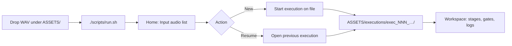

# ASSETS directory — source audio, executions, and resume

**Canonical model** for how operators supply interview audio and how every run’s state is stored, discovered, and resumed. GUI-first; CLI and automation use the same tree.

**Related:** [artifact-layout.md](./artifact-layout.md) (per-run file tree) · [gui-surface-map.md](../workflows/gui-surface-map.md) · [api-reference.md](../workflows/api-reference.md) · [full-application-flow.md](../build-out/full-application-flow.md)

---

## Design goals

| Goal | Rule |
|------|------|
| No hardcoded WAV path for normal use | Operators do **not** set `INPUT_AUDIO_PATH` or edit `input_audio_path` to use the GUI. They drop audio under `ASSETS/` and pick a file in the home screen. |
| Single filesystem root for operator media | Everything the app reads or writes for a session lives under **`ASSETS/`** (gitignored). |
| Durable executions | Each pipeline run is a folder under `ASSETS/executions/` with a stable `exec_NNN_<hash12>_TIMESTAMP` id. The hash fingerprints the canonical pipeline WAV (same bytes → same hash → reuse offers). Stopping `./scripts/run.sh` does not destroy progress. |
| Resume after relaunch | `./scripts/run.sh` → home screen lists **Previous executions** → open one → active run + stage list + logs restore from disk. |

Legacy `data/run_NNN/` runs remain readable for older clones; **new work** uses `ASSETS/executions/` only.

---

## Directory layout

```
ASSETS/
  input/                          # recommended drop zone for raw interview WAVs (any filename)
  …/other.wav                     # optional: any .wav under ASSETS/ except executions/ and .gui/
  executions/
    exec_001_a1b2c3d4e5f6_20260523T120000Z/    # one folder per run — hash12 = source_audio_hash_short (see artifact-layout)
      run_meta.json
      gui_log.jsonl
      gui_job.json
      .stage_done/
      ingest/
      transcript/
      …
    exec_002_…/
  .gui/
    active_execution.json           # active run + UI chrome (stage, tab, sub-tab)
    server_session.json             # serve process metadata (pid, port)
```

| Path | Writable by | Purpose |
|------|-------------|---------|
| `ASSETS/input/` | Operator | Convention for source captures; not required if files live elsewhere under `ASSETS/` |
| `ASSETS/executions/exec_*` | App (stages + GUI) | **Authoritative run workspace** — all stage outputs, gates, logs |
| `ASSETS/.gui/` | App (session API) | Cross-run UI convenience; not a substitute for `run_meta.json` / execution folder |

**Excluded from “Input audio” picker:** top-level segments `executions` and `.gui` (and their descendants). The API is `GET /api/assets` — see [api-reference.md](../workflows/api-reference.md).

Supported extensions for listing: `.wav`, `.wave` (and any others defined in server `AUDIO_EXTS`).

---

## Operator flow (GUI)



| Step | Operator | System |
|------|----------|--------|
| 1 | Copy interview recording(s) into `ASSETS/input/` (or another folder under `ASSETS/`) | — |
| 2 | Run `./scripts/run.sh` | FastAPI + static UI; may write `ASSETS/.gui/server_session.json` |
| 3a | **New run:** click a file under **Input audio** | `POST /api/runs` with `input_audio_path` (repo-relative path from asset list); creates `executions/exec_*`, sets active run |
| 3b | **Resume:** click a row under **Previous executions** | `PUT /api/session/active` with existing `run_id`; loads `run_meta.json`, stage progress, `gui_log.jsonl` tail |
| 4 | Continue pipeline (execute analysis / flow, gates G0–G2) | All artifacts under that `exec_*` folder |

`run_meta.json` stores the chosen source path:

```json
"input_audio_path": "ASSETS/input/my_interview.wav"
```

Ingest reads that file (or `preclean/isolated.wav` when pre-clean ran). Operators change source for an existing run only via **reset with new input** (`POST …/reset` + `new_input_audio_path`), not by editing config.

---

## CLI and automation (secondary entry)

CLI tools may still use config defaults for unattended scripts:

| Mechanism | Use |
|-----------|-----|
| `config/app.defaults.json` → `input_audio_path` | Default file when CLI omits `--run-id` / path |
| `secrets.env` → `INPUT_AUDIO_PATH` | Overrides default for CI or one-off scripts |

**Normative operator path:** GUI asset picker + executions under `ASSETS/executions/`. When documenting smoke tests or examples, prefer:

```bash
# After creating a run via GUI (or explicit run id):
python tools/run_analysis.py --run-id exec_001_a1b2c3d4e5f6_20260523T120000Z
```

not “set `INPUT_AUDIO_PATH` to a fixed path” unless testing headless automation.

---

## What “full state” means per execution

Relaunching the app must be sufficient to resume without re-copying audio or re-entering paths, as long as `ASSETS/executions/<run_id>/` is intact:

| Category | On-disk |
|----------|---------|
| Identity | `run_meta.json` (`execution_id`, `input_audio_path`, `source_audio_hash`, `source_audio_hash_short`, `selected_flow`, `stage_reuse`, timestamps) |
| Progress | `.stage_done/<stage_id>` markers |
| Operator visibility | `gui_log.jsonl`, `gui_job.json` |
| Pipeline artifacts | `ingest/`, `transcript/`, `understanding/`, `segments/`, `flow_*`, `vo_pickup/`, … |
| Gates | Transcript review queue, gap report, profile JSON (see [operator-gates.md](../workflows/operator-gates.md)) |
| UI session pointer | `ASSETS/.gui/application_state.json` (legacy `active_execution.json` synced) — fields: `run_id`, `selected_stage_id`, `active_tab`, `pipeline_sub_tab`, collapse prefs, `source_locked`, `input_audio_path`. Restored on browser refresh within one server process. Cleared on each `./scripts/run.sh` launch (default). **Clear session** removes via `DELETE /api/session/active`. Opt-in preserve across launch: `MUX_PRESERVE_SESSION=1 ./scripts/run.sh`. |

Deleting an `exec_*` folder is the only supported way to discard a run; there is no separate database.

---

## Implementation notes (for build-out)

| Area | Expected behavior |
|------|-------------------|
| `RunContext` | `executions_root` from config; atomic `exec_NNN_<hash12>_<UTC timestamp>` via `.execution_counter` + `FileLock`; `mutate_run_meta()` for locked updates |
| `source_audio_hash.py` | `source_audio_hash_pair()` — single WAV read → full + short hash |
| `stage_execution_reuse.py` | Per-stage reuse; `reuse_already_applied()` prevents double-copy after staged accept |
| `write_staging.py` | `.pending_writes/` with per-stage `FileLock`; approve/discard serialized with `JobRunner.run_guard` |
| `gui_session.py` | Persist active run under `ASSETS/.gui/` |
| `GET /api/assets` | Recursive scan of `assets_root`, skip `executions` and `.gui` |
| `GET /api/runs` | Enumerate execution dirs + summarize `run_meta.json` |
| `POST /api/runs` | Require `input_audio_path` that resolves under repo (typically from asset list) |
| New stages / artifacts | Write only under current `RunContext.run_dir` — never repo root or `ASSETS/input/` |

**Do not** reintroduce operator-required path configuration in docs or UI copy when this model applies.

---

## Related

- [artifact-layout.md](./artifact-layout.md) — file-level tree inside each `exec_*`
- [config-keys.md](./config-keys.md) — `assets_root`, `executions_root`, CLI fallbacks
- [idempotent-runs.md](../workflows/idempotent-runs.md) — `--from-stage` within an execution folder
- [stage-execution-reuse.md](../workflows/stage-execution-reuse.md) — copy prior stage outputs when hash matches
- [capture/README.md](../pipeline/capture/README.md) — manual capture → `ASSETS/input/`
