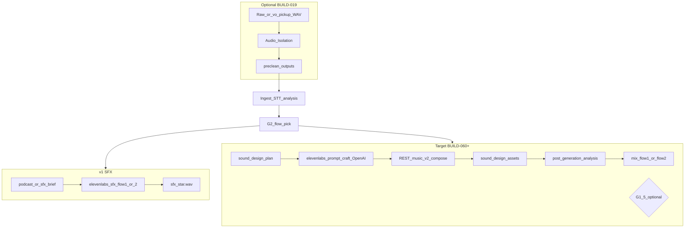

# ElevenLabs integration guide (canonical)

**Status:** Authoritative docs for all ElevenLabs usage in **interview_helper_mux**.  
**Scope:** **ElevenLabs Music v2** (sound-design beds/stingers via `POST /v1/music`), Audio Isolation (pre-clean), prompt craft, spend controls, and post-generation integration.  
**Transport:** **REST API only** in application code (`interview_mux.elevenlabs_rest`) — do not use the ElevenLabs Python SDK in pipeline stages.  
**API anchor:** `https://api.elevenlabs.io/v1` — [anchored-toolchain.md](./anchored-toolchain.md#external-http-apis-version-surfaces). Implement with **Context7** vendor docs for this path, not the SDK.  
**Not in scope:** TTS, voice cloning, dubbing, legacy `POST /v1/sound-generation`, or other ElevenLabs product lines unless the product explicitly expands.

**Also see:** [prompt-influence tuning](./elevenlabs-prompt-influence-tuning.md) · [prompt regression fixtures](../prompts/_shared/examples/elevenlabs-prompt-regression.md)

**Related:** [sound-design.md](./sound-design.md) (SDP + mix), [audio preclean](../pipeline/audio_preclean/README.md) (isolation), [podcast-quality-roadmap.md](./podcast-quality-roadmap.md) (waves), [prompts/sound_design/](../prompts/sound_design/) (LLM stages).

---

## Shipped vs optional follow-ups (read first)

| Capability | Shipped in code | Optional follow-ups |
|------------|----------------|---------------------|
| Sound-design generation | `sfx_elevenlabs.py` → REST `POST /v1/music` (`model_id`: `music_v2`); one WAV per `asset_id` after `elevenlabs_prompt_craft` | Composition-plan craft, inpainting |
| SFX inputs | `sound_design_plan.json` + `elevenlabs_prompts.json` (SDP path); legacy `podcast_sfx_brief` / `sfx_brief` ids remain for single-stage rerun | — |
| SFX outputs | `sound_design/assets/{asset_id}.wav` + flow `sfx/` copies | — |
| Flow 1 mix | `mix_flow1` → `master_flow1`: speech + VO + beds + stingers in `master.wav` (BUILD-065–067) | Extended EDL narrative validators |
| Flow 2 mix | `mix_flow2` → `master_flow2`: montage + SDP transitions (BUILD-065–066) | Cold-open polish refinements |
| Audio isolation | `audio_preclean` (BUILD-019); GUI offers (BUILD-072) | — |
| Prompt craft | `elevenlabs_prompt_craft` before REST generate | G1.5 optional approve gate (`g1_5_require_prompt_approval`) |
| Post-gen analysis | Operator listen workflow (this guide § Post-generation) | Richer post-listen GUI (remaining build commands) |
| G1.5 approval | Config-gated optional block before generation spend | — |

Operators should expect Flow 1/2 `master.wav` to include VO and SFX when SDP + generation stages completed. Use `assembly_preview.wav` to hear speech + VO before ElevenLabs spend.

---

## Services inventory

ElevenLabs is used for **two** capabilities in this repo:

| Service | Product name | Primary use | Pipeline stage(s) | Auth |
|---------|--------------|-------------|-------------------|------|
| **A** | Music v2 (`POST /v1/music`) | Podcast beds, stingers, transitions, accents (instrumental) | `elevenlabs_sfx_flow1`, `elevenlabs_sfx_flow2` | `ELEVENLABS_API_KEY` |
| **B** | Audio Isolation | Speech-focused denoise before STT / VO / mix | `audio_preclean` | Same key |

Both share one secret. See [config-keys.md](./config-keys.md).

### Service A — Music v2 (sound design)

**Purpose:** Generate non-vocal podcast sound-design assets (ambience, stingers, whooshes, foley accents) from natural-language prompts using ElevenLabs **Music v2** (`model_id`: `music_v2`, default in `config/app.defaults.json`).

**When to use (prescriptive):**

- Flow 1: chapter stingers, thematic beds under tagged segments, VO bridge textures after G1 pickups exist.
- Flow 2: cold open, **one** shared transition asset between all clip pairs, optional outro.
- After analysis has produced themes, segment tags, and (target) SDP cues — never before G2 flow pick for flow-specific assets.

**When not to use:**

- Speech replacement, interviewer VO, or narration (record pickups or future TTS — not ElevenLabs SFX).
- Music-heavy source interviews where beds would fight existing score (prefer dry mix).
- Operator dismissed SFX or wants `assembly_preview.wav` only (BUILD-069).
- Regenerating identical assets without plan change (wastes quota — use idempotent skip).

**REST (reference):**

```http
POST https://api.elevenlabs.io/v1/music
xi-api-key: <ELEVENLABS_API_KEY>
Content-Type: application/json
```

Request body (typical):

```json
{
  "prompt": "<elevenlabs_prompt>",
  "music_length_ms": 6000,
  "model_id": "music_v2",
  "force_instrumental": true
}
```

- `music_length_ms` is derived from SDP `duration_seconds` (clamped to 3 000–600 000 ms). Assets shorter than 3 s are generated at the API minimum, then **trimmed** to plan length in `sfx_elevenlabs.py`.
- `prompt_influence` from craft rows is **not** an API field on Music v2; `elevenlabs_rest.apply_prompt_influence_to_text` maps high/low values to prompt prose (see [elevenlabs-prompt-influence-tuning.md](./elevenlabs-prompt-influence-tuning.md)).
- Config: `elevenlabs.music_model_id` (default `music_v2`), `elevenlabs.force_instrumental` (default `true`).

Response: audio bytes (typically MPEG); `sfx_elevenlabs.py` normalizes to mono 48 kHz WAV via `ffmpeg` when needed.

**Implementation (repo):**

```python
from interview_mux.elevenlabs_rest import generate_music

audio_bytes = generate_music(
    api_key=api_key,
    prompt=elevenlabs_prompt,
    duration_seconds=duration_seconds,
    prompt_influence=0.30,
)
```

Module: [`src/interview_mux/elevenlabs_rest.py`](../../src/interview_mux/elevenlabs_rest.py). Stage: [`src/interview_mux/stages/sfx_elevenlabs.py`](../../src/interview_mux/stages/sfx_elevenlabs.py).

**Do not use** `elevenlabs` Python SDK, `POST /v1/sound-generation`, or `text_to_sound_effects.convert` in new code.

**Prescriptive defaults:**

| Asset role | `duration_seconds` | `prompt_influence` | Notes |
|------------|-------------------|--------------------|-------|
| `ambient_bed` | 6.0–8.0 | 0.25–0.35 | Loopable; no rhythm; no vocals |
| `chapter_stinger` | 1.2–2.0 | 0.35–0.45 | Single arc; tail decays fast |
| `transition_stinger` | 1.0–1.8 | 0.35–0.45 | Montage; shared across cuts |
| `cold_open` | 1.5–2.5 | 0.40–0.50 | Sets tone; no speech-like transients |
| `accent_foley` | 0.6–1.2 | 0.30–0.40 | Sparse; one gesture |
| `vo_bridge` | 1.0–2.0 | 0.30–0.40 | Under VO; duck aggressively |

**Craft → API mapping (target):**

| SDP / craft field | Sent to ElevenLabs Music v2 |
|-------------------|------------------------------|
| `elevenlabs_prompt` | `prompt` |
| `duration_seconds` | `music_length_ms` (= seconds × 1000, min 3000) |
| `prompt_influence` | Prose suffix via `apply_prompt_influence_to_text` (not a JSON field) |
| `negative_prompt` | Append to `prompt` as “Avoid: …”; also validate before call |
| `sonic_identity` | Woven into craft prompt, not a separate API param |
| (config) | `model_id` ← `elevenlabs.music_model_id`; `force_instrumental` ← config |

**Outputs:**

| Path | v1 | Target |
|------|-----|--------|
| Per-cue | `flow_*_*/sfx/sfx_NNN.wav` | — |
| Per-asset | — | `sound_design/assets/{asset_id}.wav` |
| Audit | — | `sound_design/elevenlabs_prompts.json` |

**Failure handling:**

1. Log HTTP status + request hash (no raw key).
2. Retry: 429/5xx with exponential backoff (see § Operations).
3. Target: ffmpeg silent placeholder of `duration_seconds` so mix can proceed; flag in GUI.

### Service B — Audio Isolation

**Purpose:** Reduce steady background noise on speech for STT, review, VO pickup, or pre-mix clarity.

**When to use (prescriptive):**

| Scope | Moment | What |
|-------|--------|------|
| `full_source` | Before ingest (operator accepts offer) | Raw capture → `preclean/isolated.wav` |
| `full_source` | After G0 if many low-confidence words may be noise | Re-run from `audio_preclean` |
| `vo_pickup` | After G1 recordings | `vo_pickup/*.wav` only |
| `normalized_rebuild` | Before final mix | `ingest/normalized.wav` lineage |

**When not to use:**

- Clean studio / booth (skip).
- Already denoised elsewhere (avoid double-processing).
- Output sounds thin, metallic, underwater → revert to original.
- Music-forward interview where isolation mangles beds (skip or RNNoise fallback).

**REST:**

```http
POST https://api.elevenlabs.io/v1/audio-isolation
xi-api-key: <ELEVENLABS_API_KEY>
Content-Type: multipart/form-data
```

**Upload size policy (shipped):**

| Path | When | Behavior |
|------|------|----------|
| **Audio isolation** (`audio_preclean`) | Source WAV > `elevenlabs.max_upload_bytes` (default 52 428 800 / 50 MiB) | `audio_timeline.chunk_wav_by_max_bytes` → isolate each chunk via REST → `concat_clips_with_crossfade` (80 ms default) → `preclean/isolated.wav`; logs `elevenlabs_chunked_isolation` |
| **Audio isolation** | Source ≤ limit | Single POST `/v1/audio-isolation` |
| **SFX generation** | Any size | **No chunking** — prompts are short; one REST call per `asset_id`. Oversized uploads are not applicable |

Config: `elevenlabs.max_upload_bytes` in [config-keys.md](./config-keys.md). Oversized single-shot isolation without chunk path raises `ElevenLabsApiError` with guidance to use chunked pre-clean.

**Implementation (repo):**

```python
from interview_mux.elevenlabs_rest import isolate_audio

out_bytes = isolate_audio(api_key=api_key, audio_bytes=wav_bytes, filename="source.wav")
```

Use `isolate_audio` from `elevenlabs_rest.py` in `stages/audio_preclean.py` (BUILD-019).

**Outputs:** `preclean/isolated.wav`, `vo_pickup/clean/*.wav`, `preclean/provider.json`, `preclean/lineage.json`.

**Fallback (not ElevenLabs):** Local RNNoise via `ffmpeg arndn` — `provider: rnnoise_local`. See [audio_preclean](../pipeline/audio_preclean/README.md).

---

## Pipeline map



### Stage ID reference

| Stage ID | Flow | Service | Doc |
|----------|------|---------|-----|
| `audio_preclean` | Shared | Isolation | [audio_preclean/README.md](../pipeline/audio_preclean/README.md) |
| `elevenlabs_sfx_flow1` | Flow 1 | SFX | [gui-surface-map.md](../workflows/gui-surface-map.md) |
| `elevenlabs_sfx_flow2` | Flow 2 | SFX | [gui-surface-map.md](../workflows/gui-surface-map.md) |
| `sound_design_palettes` | Shared | — (LLM only) | [theme-palettes.system.txt](../prompts/sound_design/theme-palettes.system.txt) |
| `sound_design_plan_flow1` | Flow 1 | — | [plan-flow1.system.txt](../prompts/sound_design/plan-flow1.system.txt) |
| `sound_design_plan_flow2` | Flow 2 | — | [plan-flow2.system.txt](../prompts/sound_design/plan-flow2.system.txt) |
| `elevenlabs_prompt_craft` | Shared | — (LLM → API) | [elevenlabs-prompt-craft.system.txt](../prompts/sound_design/elevenlabs-prompt-craft.system.txt) — **economy** tier per [llm-stage-model-matrix.md](./llm-stage-model-matrix.md) |
| `sound_design_generate_flow*` | Per flow | SFX | [sound-design.md](./sound-design.md) |

### Operator gates vs quality offers

| Control | Type | ElevenLabs impact |
|---------|------|-------------------|
| G0, G1, G2 | **Gates** | G1 pickups may trigger isolation offer only |
| Pre-clean offers | **Quality offer** | Isolation spend |
| G1.5 | **Optional gate** | Blocks SFX generation until prompt approval |
| `assembly_preview` | **Quality offer** | Listen before SFX spend (BUILD-069) |

---

## Doc inventory (all ElevenLabs touchpoints)

| File | Role |
|------|------|
| **This guide** | Canonical API + optimal use |
| [sound-design.md](./sound-design.md) | SDP, mix, post-analysis, musical structure |
| [audio_preclean/README.md](../pipeline/audio_preclean/README.md) | Isolation scopes |
| [podcast-quality-roadmap.md](./podcast-quality-roadmap.md) | Waves, offers |
| [config-keys.md](./config-keys.md) | `ELEVENLABS_API_KEY` |
| [prompts/sound_design/](../prompts/sound_design/) | LLM prompt specs |
| [prompts/_shared/examples/sound-design.examples.md](../prompts/_shared/examples/sound-design.examples.md) | Rich prompt examples |
| [elevenlabs-prompt-regression.md](../prompts/_shared/examples/elevenlabs-prompt-regression.md) | Golden prompts + must-not-hear |
| [elevenlabs-prompt-influence-tuning.md](./elevenlabs-prompt-influence-tuning.md) | `prompt_influence` table |
| [elevenlabs_rest.py](../../src/interview_mux/elevenlabs_rest.py) | REST client (implementation) |
| [guardrails-and-edge-cases.md](../prompts/sound_design/guardrails-and-edge-cases.md) | Validation rails |
| [operator-stage-checklists.md](../workflows/operator-stage-checklists.md) | Pre/post spend checks |
| [troubleshooting.md](../workflows/troubleshooting.md) | API failure playbook |
| [operator-gates.md](../workflows/operator-gates.md) | G1.5 |
| v1 briefs | [podcast-sfx-brief.system.txt](../prompts/assembly/podcast-sfx-brief.system.txt), [sfx-brief.system.txt](../prompts/assembly/sfx-brief.system.txt) |

---

## Optimal use playbooks

### Flow 1 (full podcast) — prescriptive defaults

1. **Palettes:** 1–3 themes from `content_brief` + `topic_tags`; no invented themes.
2. **Assets:** 3–6 unique `asset_id`s; one chapter stinger reused at every chapter end.
3. **Beds:** `under_segment` only on palette-matched segments; `level_db` −26 to −30; `duck_under_speech_db` ≥ 14.
4. **VO bridges:** One `vo_bridge` asset; cues `before_segment` / `after_segment` from `gap_report`.
5. **Generate:** Craft prompts → G1.5 if enabled → one API call per `asset_id`.
6. **Post-analysis:** Listen assets against speech stem; adapt duck/crossfade (§ Post-generation).
7. **Mix:** Speech bus wins; true-peak limit last.

### Flow 2 (highlight reel) — prescriptive defaults

1. **Assets:** 2–4; exactly **one** `transition_stinger` for all `between_clips`.
2. **Cold open:** `before_timeline`; 1.5–2.5s; energy matches clip 1 mood.
3. **Transitions:** Use `from_clip_rank` / `to_clip_rank` — never concat index alone.
4. **Variety:** Same WAV, different `level_db` on cues if needed — not different descriptions per cut.
5. **Post-analysis:** Check cut-to-cut spectral jump; lengthen crossfade or lower transition level if harsh.

### Edge cases → non-ElevenLabs path

| Situation | Recommendation |
|-----------|----------------|
| Quota exhausted mid-run | Placeholder silence; finish speech preview; retry assets later |
| Offline / no key | RNNoise for isolation only; skip SFX or use silent placeholders |
| Policy risk in prompt | Block call; rewrite craft; never retry same text |
| Diegetic speech in bed request | Reject at craft; no API call |

---

## Post-generation analysis and adaptive placement

**Principle:** Initial generation produces **candidate** assets. Placement (overlap, duck depth, crossfade length, sequential vs layered) is decided **after** listening and analysis against interview themes, keywords, scripture/tone notes, and speech stem — not fully predetermined in the brief.

### Phase 1 — Asset fit (per `asset_id`)

| Dimension | Question | Fail action |
|-----------|----------|-------------|
| Theme fit | Does timbre match palette keywords and `sonic_identity`? | Regenerate with revised craft; max 2 retries per asset |
| Speech intelligibility | Bed masks consonants in 1–2 kHz? | Raise duck; lower `level_db`; shorten bed span |
| Duration fit | Tail cuts abruptly vs cue window? | Adjust `duration_seconds` ±0.5s; regen |
| Policy | Any voice-like content? | Discard; tighten `negative_prompt` |
| Loop quality (beds) | Seam audible on loop? | Regen with “seamless loop, no click at wrap” |

Inputs: `content_brief`, `analysis_state.themes`, `segments.manifest` topic_tags, operator `style.sound_design_notes`, generated WAV + `ingest/normalized.wav` (or assembly preview). **Planned:** `understanding/source_acoustic_profile.json` for measured pacing, duck defaults, and prompt tokens — [source-derived-sonic-mix-profile.md](./source-derived-sonic-mix-profile.md).

### Phase 2 — Transition adaptation (per cue boundary)

Decide **after** assets exist. Options (mix engine applies; docs define intent):

| Pattern | When | Parameters |
|---------|------|------------|
| **Sequential** | Stinger after speech ends cleanly | Gap 50–150 ms silence optional |
| **Overlap + duck** | Bed under speech | Bed enters 200–400 ms before segment; duck 14–20 dB |
| **Crossfade** | Flow 2 clip change | 80–200 ms equal-power between clip and transition |
| **Fade under** | VO bridge | Prior bed −3 dB/s over 300 ms while VO rises |
| **Layer stack** | Cold open → clip 1 | Open −6 dB over 400 ms as speech fades in |

**Flow 1:** Favor narrative continuity — longer bed fades at chapter boundaries; stinger **after** speech tail, not over words.

**Flow 2:** Favor momentum — shorter crossfades; shared transition asset; cold open may overlap first 200 ms of clip 1 at −12 dB.

### Phase 3 — Operator listen gate

| Checkpoint | Pass |
|------------|------|
| Preview with speech | No word obscured in densest segment |
| Chapter boundaries | Stinger feels intentional, not trailer |
| Flow 2 montage | Cuts feel connected, not random SFX drops |
| Master peak | No clip; speech bus loudest |

Document outcomes in `gui_log.jsonl` (approve / regen asset X / lower bed on seg_Y).

---

## GUI operator journey

Maps **sidebar panels**, **artifacts**, and **`gui_log.jsonl`** for ElevenLabs work. Source: [gui-surface-map.md](../workflows/gui-surface-map.md), [operator-gates.md](../workflows/operator-gates.md).

### v1 (shipped today)

| Step | Where in GUI | Artifact / API | `gui_log.jsonl` (typical) |
|------|----------------|----------------|---------------------------|
| 1. Brief exists | Flow sidebar → **SFX brief** stage (`podcast_sfx_brief` / `sfx_brief`) | `flow_*/*_sfx_brief.json` | `stage` = brief stage on complete |
| 2. Review brief (optional) | **JSON artifact editor** — open brief path | `GET/PUT /api/runs/{id}/artifact?path=…` | `message` on manual save |
| 3. Generate SFX | Sidebar → **Generate SFX** (`elevenlabs_sfx_flow1` or `_flow2`) | `POST …/execute` `mode: flow1` or `stage: elevenlabs_sfx_*` | `ElevenLabs Music generated …` with `detail.api: rest`, `detail.path: /v1/music`, `detail.model_id: music_v2` |
| 4. API failure | Same; log panel | Placeholder silence | `ElevenLabs SFX failed for …; wrote silence placeholder` |
| 5. Listen (informal) | **Play clip** / external DAW | `flow_*_*/sfx/*.wav` | Optional `POST …/log` note |

v1 does **not** include G1.5 or crafted-prompt panels; generation uses brief `description` (or `sound_design/elevenlabs_prompts.json` if present).

### Target (BUILD-060+ / G1.5) — shipped panels

| Step | Where in GUI | Artifact | `gui_log.jsonl` (typical) |
|------|----------------|----------|----------------------------|
| Palettes / plan | Flow stages + JSON artifact editor | `understanding/sound_design_plan.json` | `sound_design_plan_written` |
| Craft review | Stage **`elevenlabs_prompt_craft`** — inline prompt review | `sound_design/elevenlabs_prompts.json` | `elevenlabs_prompts_pending_approval` |
| Approve G1.5 | Same panel → **Approve prompts** | `run_meta.json` → `elevenlabs_prompt_review` | `elevenlabs_prompts_approved` `detail: { approved_by, asset_ids }` |
| Edit + regen craft | Inline fields → **Save edits** (resets approval) | Updated `elevenlabs_prompts.json` | `ElevenLabs prompts edited in review panel; approval reset.` |
| Generate | **`elevenlabs_sfx_flow1`** / **`elevenlabs_sfx_flow2`** (blocked when `g1_5_require_prompt_approval` and not approved) | `sound_design/assets/{asset_id}.wav` | `ElevenLabs Music generated` `detail: { asset_id, model_id: music_v2, path: /v1/music, … }` |
| Post-listen QA | **Post-listen QA (advisory)** on craft + SFX panels — **Listen** → **Pass** / **Fail** + optional note | `run_meta.json` → `elevenlabs_listen_results[]` | `elevenlabs_post_listen_pass` or `elevenlabs_post_listen_fail` `detail: { asset_id, note? }` |
| Regen after fail | Re-run craft or SFX stage (manual) | New WAV | `elevenlabs_regen` (manual log) `detail: { asset_id, attempt }` |
| Influence tweak | Craft panel `prompt_influence` field → save | Same prompt, new influence | (optional manual note) |

### Post-listen actions (operator)

| Action | When | Log + next step |
|--------|------|-----------------|
| Approve asset | Regression pass | `elevenlabs_post_listen_pass` → proceed to mux |
| Lower bed level | Speech masked | `elevenlabs_mix_adjust` `detail: { cue_id, level_db }` → edit SDP or mix config |
| Regen | Timbral wrong | `elevenlabs_regen` → see [prompt-influence tuning](./elevenlabs-prompt-influence-tuning.md) |
| Rewrite prompt | Policy or repeated fail | Re-run craft stage; `elevenlabs_prompts_edited` |

**Regression fixtures:** [elevenlabs-prompt-regression.md](../prompts/_shared/examples/elevenlabs-prompt-regression.md).

---

## Musical structure (summary)

Full spec: [sound-design.md § Musical structure](./sound-design.md#musical-structure-for-elevenlabs-prompts).

For stingers and transitions that imply pitch/motion:

- Specify **register** (low/mid/high), **motion** (rise/fall/static), **harmonic density** (sparse/dense), **rhythmic presence** (none / pulse / none-for-beds).
- Default: **non-melodic** textures for beds; **single gesture** for stingers (one rise or one chord color, not a song).
- Avoid lyric-like vowel formants; use `negative_prompt`: “no vocals, no lyrics, no speech, no crowd chant”.

---

## Operations

### Cost and batching

- **v1:** Cost ≈ (# brief lines) × API price per generation.
- **Target:** Cost ≈ (# unique `asset_id`s) — reuse drives savings.
- Generate **serially** or low parallelism (2 concurrent max) unless account docs allow more — reduces 429s.
- Run **assembly_preview** before any SFX spend when available.

### Retry / backoff (prescriptive)

| HTTP | Action |
|------|--------|
| 401 | Fix key; do not retry |
| 402 | Stop; operator billing |
| 429 | Wait 2^n seconds, n=1..5; halve concurrency |
| 5xx / timeout | Retry up to 3 times with 5s, 15s, 45s backoff |
| Empty body | Retry once; then placeholder |

### Idempotency

- Skip generation if `sound_design/assets/{asset_id}.wav` exists and plan hash unchanged.
- Isolation: skip if `preclean/lineage.json` source SHA unchanged.
- Changing SDP `assets[]` or craft text invalidates hash → regen.

### Observability (implementation target)

Log per call: `asset_id`, `duration_seconds`, HTTP status, latency_ms, bytes_out, plan_hash. Store under `understanding/stage_runs/<stage>/attempt_*.json`.

### Compliance note

Interview audio sent to ElevenLabs is third-party processing. Operators should confirm policy for their organization before enabling isolation on full source.

---

## Related

- [sound-design.md](./sound-design.md) — SDP schema, mix, musical structure, post-analysis detail
- [elevenlabs-prompt-influence-tuning.md](./elevenlabs-prompt-influence-tuning.md) — symptom → influence → regen/rewrite
- [elevenlabs-prompt-regression.md](../prompts/_shared/examples/elevenlabs-prompt-regression.md) — golden prompts + must-not-hear
- [prompts/sound_design/README.md](../prompts/sound_design/README.md) — stage → prompt map
- [sound-design.examples.md](../prompts/_shared/examples/sound-design.examples.md) — worked prompts
- [gui-surface-map.md](../workflows/gui-surface-map.md) — panel ↔ API map
