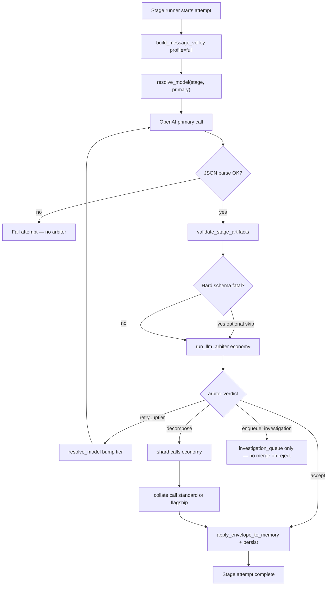
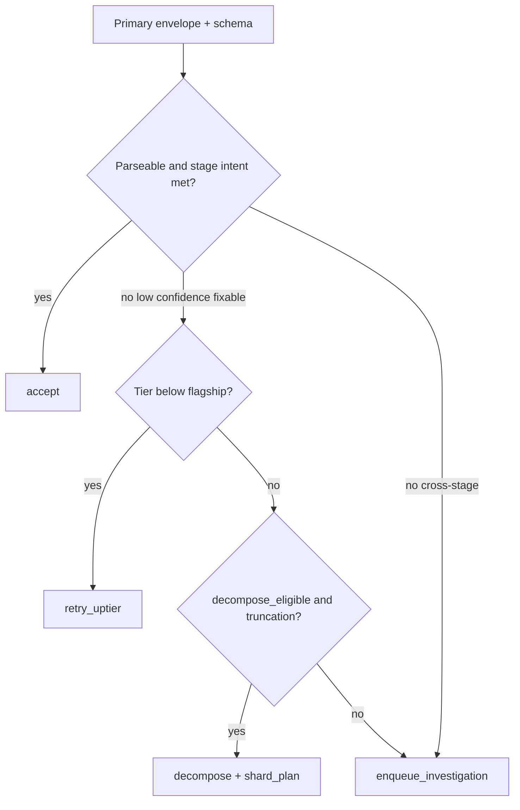

# LLM orchestration (smart routing)

**Status: implemented (BUILD-073)** — `analysis_stage.py` runs primary → schema validate → `llm_arbiter` → optional uptier / shard+collate / investigation enqueue. `get_model()` delegates to `model_registry.resolve_model`.

**Related:**

- [anchored-toolchain.md](./anchored-toolchain.md) — `openai` SDK pin, lock, CVE gate, Context7
- [model-routing.md](./model-routing.md) — tier registry and API ID mapping
- [llm-stage-model-matrix.md](./llm-stage-model-matrix.md) — per-stage severity, tier, volley profile
- [context-padding.md](./context-padding.md) — message volley and profiles
- [llm-orchestration-implementation-handoff.md](./llm-orchestration-implementation-handoff.md) — future code mapping
- [prompts/_shared/llm-arbiter-contract.md](../prompts/_shared/llm-arbiter-contract.md) — arbiter JSON contract

---

## Goals

1. **Right model for the job** — economy for low-risk and sub-calls; standard for cascade-sensitive work; flagship for high editorial impact.
2. **Validate every primary response** — economy-tier LLM arbiter after schema check, before memory merge.
3. **Decompose when evidence is too large** — shard (economy) → collate (standard or flagship), instead of silent truncation.
4. **Selective context** — full, shard, or collate volley profiles; not every call gets full prior-assistant banter.

---

## Call sequence (target)

### Legacy note

Before BUILD-073, runtime was primary-only (no arbiter). Inner loop on `status: partial | needs_input` and investigation queue drain are unchanged — see [analysis-orchestration-loop.md](../workflows/analysis-orchestration-loop.md).

---

## `task_kind` and tier resolution

Every OpenAI Chat Completions call is tagged with a `task_kind`. Resolution rules (target):

| `task_kind` | Tier rule | Used for |
|-------------|-----------|----------|
| `primary` | Stage `default_tier` from [llm-stage-model-matrix.md](./llm-stage-model-matrix.md) | Main stage prompt |
| `arbiter` | Always **economy** | Post-primary quality gate |
| `shard` | Always **economy** | Map step on decomposed evidence |
| `collate` | `max(stage default_tier, standard)` for **high** severity; else stage default | Reduce shard outputs to one envelope |

**`retry_uptier`:** Re-run `primary` with tier bumped one step: economy → standard → flagship (max one bump per attempt unless operator overrides).

**Resolution order (target config):**

1. Explicit per-stage API ID string override (escape hatch)
2. `models.stages.<stage_key>.tier` → lookup in `models.tiers`
3. Optional secrets: `OPENAI_TIER_ECONOMY`, `OPENAI_TIER_STANDARD`, `OPENAI_TIER_FLAGSHIP`
4. Registry defaults in [model-routing.md](./model-routing.md)

Concrete API model IDs appear **only** in the tier registry subsection of `model-routing.md`, not in pipeline prose.

---

## LLM arbiter

After each **successful** primary JSON parse and artifact schema validation, run the arbiter unless a pre-arbiter skip applies.

### Pre-arbiter skips (no arbiter call)

| Condition | Action |
|-----------|--------|
| No JSON object in primary response | Fail attempt immediately |
| Required artifacts empty when stage mandates output | Fail or schema-retry first; arbiter only after parseable envelope |
| Stage marked `arbiter: false` in matrix (none today; reserved) | Skip |

### Arbiter inputs (compact)

- `stage_key`, `task_kind=primary`
- Normalized envelope: `status`, `confidence`, `reasoning_summary`, artifact key list and counts
- Schema validation errors (if any non-fatal warnings remain)
- `context_chars`, `truncation_flags` from volley builder
- Stage expectations from matrix (severity, decompose_eligible)

The arbiter does **not** receive the full transcript or full `analysis_state.json`.

### Verdicts

| Verdict | Meaning | Next step |
|---------|---------|-----------|
| `accept` | Output meets stage intent | Merge memory, persist artifacts |
| `retry_uptier` | Fixable with stronger primary model | Re-run primary at next tier (cap per attempt) |
| `decompose` | Evidence too large or partial coverage | Run `shard_plan` then collate |
| `enqueue_investigation` | Cross-stage or operator issue | Push to `investigation_queue`; do not merge rejected primary |

Full JSON shape: [llm-arbiter-contract.md](../prompts/_shared/llm-arbiter-contract.md). System prompt: [arbiter.system.txt](../prompts/_shared/arbiter.system.txt).

### Caps (cost control)

| Limit | Default |
|-------|---------|
| Arbiter calls per primary attempt | 1 |
| `retry_uptier` per stage per run | 2 |
| Max shards per decompose | 8 |
| Max collate passes per decompose | 1 |

---

## Shard / collate lifecycle

When verdict is `decompose` and stage is `decompose_eligible` in the matrix:

1. **Shard plan** — arbiter returns `shard_plan[]` with `label` and `segment_ids` (or time range / theme cluster per stage strategy).
2. **Shard calls** — `task_kind=shard`, `volley_profile=shard`, economy tier, same stage system prompt where applicable.
3. **Collate call** — `task_kind=collate`, `volley_profile=collate`, tier per collate rule; produces one envelope for persist/merge.
4. **Validate** — collated artifacts through same JSON schemas as primary.

If `decompose` is requested for a non-eligible stage, fall back to `enqueue_investigation` with kind matching existing orchestration (e.g. `theme_unmapped`, `gap_unresolved`).

**Pilot stages (implement first):** `missing_framing`, `segment_classification` — highest truncation pressure. See [long-interview-chunking.md](../workflows/long-interview-chunking.md).

### Investigations vs shard_plan

| Mechanism | When |
|-----------|------|
| `follow_up_investigations` / queue | Cross-stage coherence, ambiguous theme, operator-needed input |
| `shard_plan` | Same-stage evidence too large for one context window; local merge via collate |

Prefer shard/collate when the problem is **payload size**; prefer investigations when the problem is **wrong upstream conclusion**.

---

## Memory merge rules

- **Do not** call `apply_envelope_to_memory` when arbiter verdict is `retry_uptier`, `decompose` (mid-flight), or `enqueue_investigation` on a rejected primary.
- **Do** merge after `accept` or successful collate `accept`.
- Operator edits in `analysis_state.json` remain authoritative; arbiter should not instruct silent overwrites — surface `needs` with `type: operator` instead.

---

## Observability (target attempt JSON fields)

Extend `understanding/stage_runs/<stage>/attempt_NNN.json` (written by `record_stage_attempt`):

| Field | Type | Description |
|-------|------|-------------|
| `model_tier` | string | economy \| standard \| flagship |
| `model_id` | string | Resolved OpenAI API model id |
| `task_kind` | string | primary \| arbiter \| shard \| collate |
| `arbiter_result` | object | Full arbiter verdict JSON |
| `shard_count` | int | Number of shard calls in this attempt |
| `truncation_flags` | string[] | e.g. `transcript_capped`, `segments_dropped` |

GUI/debug: see [gui-surface-map.md](../workflows/gui-surface-map.md).

---

## Cost model

- Expect **~2× API calls** per successful primary attempt (primary + economy arbiter).
- Shards add N economy calls; collate adds one standard/flagship call — still cheaper than sending full transcript to flagship once.
- Skip arbiter only on hard pre-arbiter failures to avoid paying on unparseable garbage.

---

## Decision tree (arbiter)

---

## Related v1 docs

- [analysis-memory.md](./analysis-memory.md) — what gets merged
- [config-keys.md](./config-keys.md) — `models.tiers` / `models.stages`
