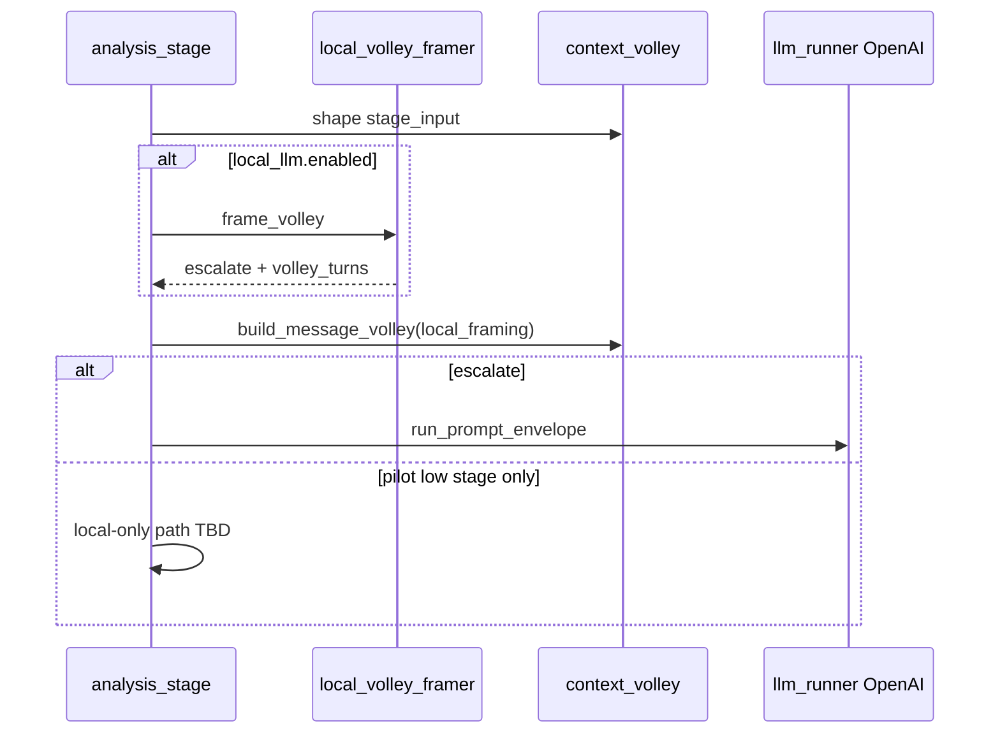

# Local LLM tier — implementation handoff

**Status: plan** — checklist for wiring [local-llm-tier.md](./local-llm-tier.md) into the pipeline.

**Before coding:** [anchored-toolchain.md](./anchored-toolchain.md) + Context7 `/ml-explore/mlx-lm` at lock pin.

**Framework docs:** [local-llm-tier.md](./local-llm-tier.md) · [context-padding.md](./context-padding.md) · [llm-orchestration.md](./llm-orchestration.md)

---

## Module map (proposed)

| Spec concept | Suggested module | Notes |
|--------------|------------------|-------|
| Download / verify weights | `scripts/download_local_llm.py` | **Exists** — venv-local paths |
| `load_local_model()` cache | `src/interview_mux/local_llm_runner.py` | Singleton `load()` per process |
| `frame_volley_for_stage(...)` | `src/interview_mux/local_volley_framer.py` | Builds local messages; parses JSON |
| Inject framed turns | extend `src/interview_mux/context_volley.py` | `local_framing: dict \| None` optional param |
| Escalation before OpenAI | `src/interview_mux/llm_stage_routing.py` | After volley build, before `run_prompt_envelope` |
| Config | `src/interview_mux/config.py` | `local_llm.*` keys |
| Prompt | `docs/prompts/_shared/local-volley-framer.system.txt` | **Exists** |

---

## Local framer JSON contract (assistant output)

```json
{
  "escalate": true,
  "confidence": 0.85,
  "reason": "one sentence",
  "volley_turns": [
    {"role": "assistant", "content": "Prior conclusions in prose..."},
    {"role": "user", "content": "## Profile slice\n..."}
  ]
}
```

| Field | Rule |
|-------|------|
| `escalate` | If `true`, run OpenAI primary with `volley_turns` merged into `build_message_volley` output |
| `confidence` | If &lt; 0.6, force `escalate: true` in code |
| `volley_turns` | Max length `local_llm.max_volley_turns` (default 2); roles only `user` \| `assistant` |
| `reason` | Audit only; not sent to OpenAI |

Invalid JSON → treat as `escalate: true`, log warning.

---

## Implementation checklist

### Phase A — toolchain

- [ ] Add `mlx-lm`, `mlx`, `huggingface_hub` to `requirements.txt`; regenerate `requirements.lock`
- [ ] Update [anchored-toolchain.md](./anchored-toolchain.md) table + `last_verified`
- [ ] Document `local_llm` keys in [config-keys.md](./config-keys.md)
- [ ] `./tools/check_prerequisites.sh` optional probe: `python -c "import mlx_lm"` when `local_llm.enabled`

### Phase B — download + paths

- [x] `scripts/download_local_llm.py` with venv-local `models/` + `hf_cache/`
- [ ] `local_llm_runner.resolve_model_path()` — env &gt; config &gt; default HF id
- [ ] Smoke: download 3B model, `generate` one line in &lt; 60s on M1

### Phase C — framer

- [ ] `local_volley_framer.frame_volley(ctx, stage_key, stage_input, plan)` → contract dict
- [ ] Unit tests: caps on `volley_turns`, parse failure → escalate
- [ ] Wire prompt loader same as `llm_runner.load_system_prompt_for_stage` pattern

### Phase D — pipeline integration

- [ ] `build_message_volley(..., local_framing=...)` — prepend/merge framed turns; keep final evidence user turn last
- [ ] `run_llm_stage_with_routing`: if `local_llm.enabled` and not `task_kind=shard`, call framer first
- [ ] Skip OpenAI primary when `escalate: false` **only** for allowlisted low stages (pilot: `speaker_roles` off by default until validated)
- [ ] Attempt JSON fields per [local-llm-tier.md](./local-llm-tier.md#observability)

### Phase E — docs & tickets

- [ ] BUILD ticket in [ticket-specs.md](../build-out/ticket-specs.md) + [repository-map.md](../build-out/repository-map.md)
- [ ] [INDEX.md](../INDEX.md) link
- [ ] [steps-forward.md](../build-out/steps-forward.md) Agent prompt block
- [ ] Troubleshooting: OOM → smaller model; slow → 3B default

---

## Integration sequence (runtime)



---

## Test scenarios

| Case | Expect |
|------|--------|
| 3B model, `speaker_roles` short input | Framed volley ≤2 turns; OpenAI still runs (pilot) |
| Truncation flag set | `escalate: true` |
| Garbage local JSON | OpenAI runs; warning in attempt JSON |
| `local_llm.enabled: false` | No import mlx; identical to today |

---

## Verify (after implementation)

```bash
source .venv/bin/activate
python scripts/download_local_llm.py --model mlx-community/Llama-3.2-3B-Instruct-4bit
python scripts/download_local_llm.py --verify
pytest tests/test_local_volley_framer.py
# Short analysis run with local_llm.enabled true in app.defaults.json
```
