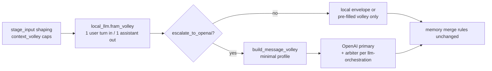

# Local LLM tier (on-device framing)

**Status: implemented (runtime)** — **on by default** (`local_llm.enabled: true`). macOS bootstrap downloads weights; see [local-llm-implementation-handoff.md](./local-llm-implementation-handoff.md) and `scripts/download_local_llm.py`.

**Related:**

- [context-padding.md](./context-padding.md) — OpenAI message volley shape
- [llm-orchestration.md](./llm-orchestration.md) — primary → arbiter → shard/collate
- [model-routing.md](./model-routing.md) — OpenAI tier registry
- [llm-stage-model-matrix.md](./llm-stage-model-matrix.md) — per-stage severity
- [prompts/_shared/local-volley-framer.system.txt](../prompts/_shared/local-volley-framer.system.txt) — local framer system prompt

---

## Problem

Every analysis/flow stage builds a **multi-turn** Chat Completions volley (`context_volley.py`) and calls **OpenAI** for the envelope. Many turns are **compression and routing** work (summarize priors, decide what fits, trim investigations) that do not need flagship reasoning. That spends API tokens and adds latency on a machine that can run a **small instruct model locally for free**.

## Goal

Insert a **local LLM tier** between **artifact shaping** and **OpenAI**:

1. **Frame** the smallest useful `user` / `assistant` volley for the upcoming OpenAI call.
2. **Decide** whether OpenAI is needed at all for this attempt (escalation gate).
3. Reserve **OpenAI** for logically hard, cascade-sensitive, or high editorial impact work ([llm-stage-model-matrix.md](./llm-stage-model-matrix.md) `high` severity and arbiter-flagged retries).

**Volley discipline:** Local and OpenAI calls both prefer **short bursts** — few turns, few tokens. The local tier must **not** simulate a long chat; one local round-trip per stage attempt unless escalated.

---

## Hardware target

| Constraint | Choice |
|------------|--------|
| Machine | Apple M1, **16 GB** unified memory |
| Runtime | **MLX** via `mlx-lm` (Apple Silicon, in `.venv`) |
| Model format | **4-bit** MLX weights from `mlx-community/*` on Hugging Face |
| Weights path | `ASSETS/local_llm/models/<slug>/` (gitignored under `ASSETS/`) |
| HF cache | `ASSETS/local_llm/hf_cache/` |
| Selection manifest | `ASSETS/local_llm/selection.json` (llmfit hardware-aware pick) |

### Hardware-aware selection (llmfit)

On macOS, [llmfit](https://github.com/AlexsJones/llmfit) scans RAM/GPU and recommends MLX models. This repo runs:

```bash
llmfit recommend --json --force-runtime mlx --limit 50
```

`scripts/select_local_llm.py` keeps `mlx-community/*` models with fit **perfect** or **good**, quality ≥ **45**, and picks the **largest context window** (tie-break: quality, then score). Writes `ASSETS/local_llm/selection.json` and downloads weights.

```bash
brew install AlexsJones/llmfit/llmfit
source .venv/bin/activate
python scripts/select_local_llm.py --download --verify
```

Override: `LOCAL_LLM_MODEL_ID` in `config/secrets/secrets.env`, or `python scripts/select_local_llm.py --refresh --download`.

**Fallback** when llmfit has no eligible candidates: `mlx-community/Llama-3.2-3B-Instruct-4bit`.

### Manual model picks (optional)

| Model (HF repo) | Approx RAM | Role |
|-----------------|------------|------|
| `mlx-community/Llama-3.2-3B-Instruct-4bit` | ~2 GB | Fallback / small machines |
| `mlx-community/Mistral-7B-Instruct-v0.3-4bit` | ~4–5 GB | Higher quality summaries |
| `mlx-community/Qwen2.5-7B-Instruct-4bit` | ~4–5 GB | Alternative 7B instruct |

Do **not** run full-precision 7B or 13B+ models on 16 GB. Prefer **4-bit** MLX builds only.

---

## Position in the pipeline



**Not replaced by local tier:**

- OpenAI **arbiter**, **shard**, **collate** ([llm-orchestration.md](./llm-orchestration.md))
- Stages that **must** emit strict JSON envelopes validated against stage schemas on first pass (`missing_framing`, `optimal_questions`, `full_master_ranking`, etc.) — local may **prepare** context only
- Operator-visible errors — still via `ctx.log()` per project rules

---

## Local call shape (minimal volley)

Local inference uses **one** structured exchange — mirror the “short burst” rule:

| Turn | Role | Content |
|------|------|---------|
| — | `system` | [local-volley-framer.system.txt](../prompts/_shared/local-volley-framer.system.txt) |
| 1 | `user` | Single JSON blob: `stage_key`, `task_kind`, `severity`, capped `stage_input` digest, `prior_one_liners`, `volley_budget` |
| 2 | `assistant` | **Strict JSON** (see handoff): `escalate`, `volley_turns[]`, `reason` |

**`volley_turns` cap (hard):** max **2** `user` and **2** `assistant` entries total for injection into OpenAI (excluding system and final evidence user turn). Prefer **1 assistant** prose block + **1 user** profile/investigation slice when possible.

Temperature **0.0** for local calls. `max_tokens` low (e.g. 512–1024).

---

## Prompt suitability audit (Llama 3.2 3B)

Current secrets may override the local model to `mlx-community/Llama-3.2-3B-Instruct-4bit`. That model is suitable as a fail-safe volley framer, not as an artifact writer.

The current `[local-volley-framer.system.txt](../prompts/_shared/local-volley-framer.system.txt)` contract is safe by default because Python forces OpenAI escalation on high-severity stages, truncation flags, operator-verified profiles, low confidence, parse failures, and empty local volleys. The default `skip_openai_primary_when_local_satisfied: false` also means OpenAI still performs the stage artifact call.

Known prompt-fit risks for this small quantized model:

- It has no few-shot JSON example, so markdown fences or malformed JSON are plausible.
- Escalation wording is partly abstract; 3B-class models do better with deterministic rules keyed to input fields such as `severity` and `truncation_flags`.
- `volley_turns` count is capped, but turn content length is not capped, so a local response can still bloat the OpenAI volley.
- The local prompt is loaded without the analysis preamble, but the generic pipeline thresholds block is still appended by the shared loader; those thresholds are noise for local framing.
- Local decoding should be deterministic for JSON reliability; docs expect temperature 0.0.

Recommended follow-up when editing the local prompt/code:

- Add one minimal JSON example with `escalate: true`, `confidence`, a short `reason`, and one assistant `volley_turn`.
- Replace abstract escalation guidance with field-based rules: high severity or truncation always escalates; medium severity usually escalates; low severity may stay local only for compression.
- Add short output budgets, such as `reason` under 120 characters and each turn content under 500-800 characters.
- Consider enforcing content truncation in `parse_framer_response` and passing deterministic generation settings in `generate_local_chat`.

---

## Escalation matrix (local → OpenAI)

| Signal | Local outcome | OpenAI |
|--------|---------------|--------|
| Stage `severity: low` and schema-simple output | May produce volley only; skip primary if policy allows | Optional economy primary |
| Stage `severity: medium` | Always frame volley; escalate primary | economy / standard per matrix |
| Stage `severity: high` | Frame + compress only; **always** escalate | flagship / standard |
| Truncation flags on shaped input | Frame shard hints; escalate | primary + possible decompose |
| Local JSON parse fail | — | escalate (fail-safe) |
| Operator `meta.operator_verified` required stage | Frame only | OpenAI primary unchanged |

**Default:** If local model uncertain (`confidence` field in JSON &lt; 0.6), **escalate**.

---

## What local LLM does vs OpenAI

| Task | Local | OpenAI |
|------|-------|--------|
| Compress `stage_summaries` to one assistant paragraph | Yes | No |
| Drop non-blocking investigations from volley | Yes | No |
| Choose `full` vs minimal volley profile hint | Yes | Arbiter/shard logic stays cloud |
| Emit stage envelope (`artifacts`, `memory_updates`) | No (except future low-risk pilots) | Yes |
| Gap / narrative / ranking editorial judgment | No | Yes |
| Schema validation + arbiter | No | Yes |

---

## Config keys (planned)

Add under `local_llm` in `config/app.defaults.json` when implementing — see [config-keys.md](./config-keys.md#local_llm-planned).

| Key | Default | Purpose |
|-----|---------|---------|
| `local_llm.enabled` | `true` | Master switch |
| `local_llm.model_id` | `mlx-community/Llama-3.2-3B-Instruct-4bit` | HF repo or path under venv share |
| `local_llm.models_dir` | (venv share path) | Override weights directory |
| `local_llm.max_volley_turns` | `2` | Hard cap on injected turns |
| `local_llm.max_tokens` | `768` | Generation cap |
| `local_llm.escalate_on_parse_error` | `true` | Fail-safe to OpenAI |

Secrets: none required for local inference.

---

## Dependencies (implementation PR)

Optional until BUILD lands; install into **same** `.venv`:

| Package | Purpose |
|---------|---------|
| `mlx-lm` | `load`, `generate`, chat template |
| `mlx` | Apple Silicon backend (pulled by mlx-lm) |
| `huggingface_hub` | `snapshot_download` for `download_local_llm.py` |

Follow [anchored-toolchain.md](./anchored-toolchain.md): add to `requirements.txt`, regenerate `requirements.lock`, run `pip-audit`, update toolchain table.

**Context7:** `/ml-explore/mlx-lm` at pinned version when implementing `local_llm_runner.py`.

---

## Observability

Use the shared [llm-call-record-framework.md](./llm-call-record-framework.md) with `provider: local_mlx` for each on-device call (same labels and volley fields as OpenAI).

Extend `understanding/stage_runs/<stage>/attempt_NNN.json`:

| Field | Description |
|-------|-------------|
| `local_llm.model_id` | HF id or path |
| `local_llm.escalate` | bool |
| `local_llm.volley_turn_count` | int |
| `local_llm.latency_ms` | int |
| `local_llm.tokens_approx` | int |

Log operator-facing summary via `ctx.log()` only on escalation or local failure — not every token.

---

## Cost model

- **Local:** $0 marginal; one-time download ~2–5 GB per model.
- **OpenAI:** Expect fewer `primary` calls on `low`/`medium` stages when escalation gate skips; arbiter count unchanged when primary runs.
- **Risk:** Under-escalation → bad envelopes. Mitigate with parse fail-safe, severity matrix, and arbiter unchanged.

---

## Out of scope (this plan)

- Replacing OpenAI arbiter with local model
- Fine-tuning on interview data
- Non-Apple/Linux CUDA servers (future optional doc)
- Ollama / external daemon (everything stays in-process Python + venv paths)
