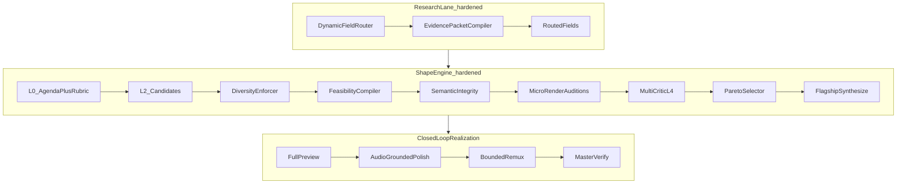

# Mastering Quality Hardening

Hardening layer on top of the [Mastering Process](./mastering-process.md). It does **not** replace the canon — it makes the same bespoke north-star **reliable across every source type, theme, and format**.

**Problem it solves:** the Shape Engine selects mostly from text plans, with one critic, unbounded context, and no diverse outcome corpus. Great plans do not guarantee great audio.

**Related:** [mastering-audition-loop.md](./mastering-audition-loop.md) · [mastering-multi-critic.md](./mastering-multi-critic.md) · [mastering-feasibility.md](./mastering-feasibility.md) · [mastering-semantic-integrity.md](./mastering-semantic-integrity.md) · [mastering-voice-clone-policy.md](./mastering-voice-clone-policy.md) · [mastering-eval-corpus.md](./mastering-eval-corpus.md)

---

## Hardened flow

---

## The nine hardening gates

| # | Gate | Kind | Artifact |
|---|------|------|----------|
| 1 | Dynamic research routing | deterministic + economy LLM | `mastering/research/routing.json` |
| 2 | Evidence packet compiler | deterministic | `mastering/evidence_packets/{consumer_id}.json` |
| 3 | Candidate diversity | deterministic | `mastering/shape/diversity_report.json` |
| 4 | Feasibility compiler | deterministic (hard) | `mastering/shape/feasibility.json` |
| 5 | Semantic integrity | hybrid (hard on critical) | `mastering/shape/semantic_integrity.json` |
| 6 | Voice-clone consent | deterministic (hard) | `mastering/voice_clone_audit.json` |
| 7 | Per-run eval rubric | LLM (L0) | `mastering/shape/eval_rubric.json` |
| 8 | Micro-render auditions | audio | `mastering/auditions/{candidate_id}/manifest.json` |
| 9 | Multi-critic L4 + Pareto | LLM + deterministic | `mastering/shape/cross_critique.json`, `pareto.json` |

Plus closed-loop polish (`mastering/polish_audit.json`) and the prompt-edit promotion gate.

---

## Why each gate exists

1. **Routing** — running all 38 fields deeply dilutes context and burns budget. Route per source.
2. **Evidence packets** — bounded, provenanced context beats dumping every artifact.
3. **Diversity** — prevents L2 from emitting renamed clones of one default arc.
4. **Feasibility** — a plan that references missing assets or impossible durations can never be best.
5. **Semantic integrity** — reordering can fabricate meaning even when every clip is real.
6. **Voice-clone consent** — least-spoken is an editorial rule, not authorization.
7. **Per-run rubric** — a comedy tape and a technical deep-dive should not share weights.
8. **Auditions** — text plans are not listener outcomes; judge rendered audio.
9. **Multi-critic + Pareto** — one critic correlates errors; one aggregate score hides fatal weaknesses.

---

## Ordering rules

- Diversity runs **after** L2, **before** feasibility (no point costing infeasible clones).
- Feasibility is a **hard** gate: failed candidates never reach auditions or L4.
- Semantic integrity `critical` findings are **hard**; `warn` findings become repair directives.
- Auditions render only **feasible, integrity-clean, diverse** survivors (default max 3).
- Pareto selects frontier survivors; flagship synthesize picks among them with tradeoff rationale.

---

## Fail-open policy

Every gate is controlled by `mastering.quality_hardening.*` in [`config/app.defaults.json`](../../config/app.defaults.json):

| Mode | Behavior |
|------|----------|
| `off` | Gate skipped entirely |
| `advisory` | Gate runs, writes artifact, never blocks (**default**) |
| `authoritative` | Gate blocks the run on hard failure |

Cutover flips gates to `authoritative` one at a time after corpus evidence. Missing hardening artifacts never break the legacy path.

---

## Preserved invariants

The hardening layer **cannot** relax Mastering Process invariants:

- New VO only on pickup-eligible (least-spoken) speaker
- Never invent guest / content-speaker evidence
- Locked speaker volleys intact through EDL
- `verify_master` remains the mechanical loudness gate

It **adds** invariants: clone consent required; feasibility required; critical semantic violations blocked.

---

## Migration

Section G of [mastering-integration-backlog.md](./mastering-integration-backlog.md).
