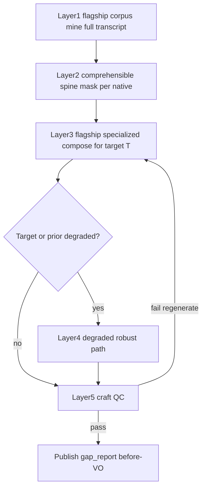

# Nugget Layup System

Canon for recovering discarded native information as **pre-native synthetic VO**.

When selection drops segments, the facts still live in the full transcript. This system:

1. **`nugget_corpus_mine`** (flagship) — mines atomic grounded nuggets from **all** speakers / segments (kept + excluded), plus talking points / ideal cuts. Prefer high-conf evidence; mark partial evidence on lexicon islands without inventing tokens.
2. **Comprehensible spine (deterministic)** — per-native `comprehensible_text` + `unclear_spans` masks (`understanding/native_comprehension_masks.json`) so garbled mid-spans never pollute LLM verbatim context as clean English.
3. **`nugget_layup_compose`** (flagship) — specialized packet per ordered native: spine + corpus + seam → clone-ready spoken before-VO.
4. **Degraded work-around** — when T or prior is `degraded_lexicon_island` / heavily degraded / low-conf must_keep / fused: orient and unlock from known spine + corpus only; never invent unclear words; thinner forward unlock OK.
5. **QC catch** — canned hinges / invented island claims / restates still fail; grace word floors apply only to degraded targets.
6. **Publish** — lay-ups become authoritative `gap_report.interviewer_lines` with `placement: before` (episode orientation preserved when it earned a seat).
7. **Realize** — existing G1 synthesis + EDL `_gap_lines_for_segment(..., "before")` unchanged.

**Clone-adjacency rule:** a cloned VO may sit immediately before or after native
audio from its clone source only when it is a nugget lay-up with evidence that it
recovers a source segment excluded from the final selection. Generic framing,
orientation, and transitions must be omitted. **Nugget-grounded (high-salience)
lines that would abut the clone speaker are retargeted** to the next non-clone
native (`before`), or merged into that dest if it already has a layup — they are
not typed-skipped.

Ideal: attempt a layup decision for every kept native, but **air** only when the line recovers unaired high-value facts or supplies a genuine conversational bridge a first-time listener needs. Prefer typed skips when the native interviewer↔interviewee handoff is already clear.

**85% nugget air floor (G-Framing Yes, homunculus 0.1.0+):** body layups plus intro recovery must reach **`analysis.nugget_layup.min_nugget_air_coverage`** (default **0.85**) combined. Compose is **body-first** toward that target; `vo_line_adjudicate` may drop, rewrite, or defer lines; the **intro sink** (flagship `nugget_intro_compose`, position 0) fills the remaining gap. Coverage is persisted on `understanding/nugget_allocation_plan.json` and surfaced in the GUI — warn + ship when unreachable on thin corpus unless the operator opts into a hard block.

Secondary row-density metric **`min_layup_coverage`** default **0.70** (raised from 0.55) — not a substitute for the nugget-air metric.

Low-conf fuse + density must_keep: [low-conf-connector-fuse.md](./low-conf-connector-fuse.md).

## Authority vs legacy VO planners

| Legacy | Role under layup authority |
|--------|----------------------------|
| `gap_framing_compose` | Gap *detection* hints only; not authoritative air copy |
| `gap_framing_recompose` | Thin adapter: re-publish layups / keep orientation (`nugget_layup_authority`) |
| `synthetic_framing_plan` | Demoted to empty lines (no content recovery LLM) |
| `seam_glue` placeholders | Suppressed when a before-VO layup already targets the next native |

## Authority is fail-closed

| Guard | Where | Behaviour |
|-------|-------|-----------|
| **Freshness** | `assert_layup_fresh_vs_selection` — compose persist, publish, recompose, `edl` | Hard stop when the plan is `_meta.stale` or its `ordered_segment_ids` ≠ `master/selection.json`. Selection owns `order_lock` — compose strips any LLM-invented lock then stamps via `attach_selection_order_lock` **before** freshness. Re-run `nugget_corpus_mine` → `nugget_layup_compose`; never republish a stale plan. |
| **Body ownership** | `lint_gap_report_layup_authority` + `restore_layup_lines` (`repair_gap_report`, `selection_framing_apply`) | Only the publish path writes body `interviewer_lines`. Any other writer that drops lay-ups has them re-injected; foreign origins and coverage below `min_layup_coverage` (default **0.70**) fail the lint. |
| **Typed skips / omit ledger** | `stamp_typed_skip`, `is_justified_skip_row`, `understanding/omit_ledger.json` | Skips must carry reason + evidence + compensating path. Justified skips leave the coverage denominator; `materialize_over_skipped_layups` must not revive them. G1 / seam / EDL consult the ledger via `effective_air_contract`. Under `recovery_policy.vo_posture=sparse_omit` (monologue / sparse-host — **not** balanced 1:1), compose **must not** call `materialize_over_skipped_layups` — stamp value-less holes instead of force-air. Never lower `min_layup_coverage`. |
| **Uniqueness** | `evaluate_layup_craft` | A `nugget_id` may be claimed once; near-duplicate lay-up wording fails. Compose receives per-target `already_aired_nugget_ids` / `already_claimed_facts` walked in air order. |
| **No canned air** | `evaluate_layup_craft`, `seam_glue.mint_missing_transitions` | The hinge menu, `default_bridge_text`, `CANNED_BRIDGE_TEXT`, and generic unlocks (“What changed after that?”) are rejected as air copy. A known native with no composed lay-up and no planned transition fails instead of shipping filler. |
| **No invented islands** | `evaluate_layup_craft` | Air text must not contain unclear placeholders or “unclear audio” narration. |

Coverage-heal and ranking-heal paths in `tools/full_auto_driver.py` call `recovery_controller.handle_stage_failure` for coverage signatures (stamp skips, resume compose) instead of marking stages done. Craft failures may still remine. Lock-only stale plans reattach selection lock when ordered IDs already match. Manifest/boundary heals re-schedule fuse via `refresh_connector_fuse_passes`.

## Next-native construction

Compose receives, per ordered native: the prior native's closing **comprehensible** excerpt, the spine (or full text when clear), unclear-span summaries, `handoff_need` / seam, `opening_owner`, and open corpus nuggets ranked for that beat (excluded tape first). Each row must return `target_beat`, `listener_need_entering_T` (soft on degraded), `selected_nugget_ids`, `setup_from_nuggets`, and `forward_unlock` — or a typed skip with compensating path.

## Artifacts

- `understanding/nugget_corpus.json`
- `understanding/native_comprehension_masks.json`
- `understanding/nugget_comprehension_index.json`
- `understanding/nugget_layup_plan.json`
- `understanding/nugget_layup_qc.json`
- `understanding/nugget_allocation_plan.json` (body / intro / waived / coverage)
- `understanding/omit_ledger.json` (append/supersede omit · suppress · defer · waive)
- `understanding/gap_report.json` (layup lines + orientation)

## Config

See `analysis.nugget_layup.*` and `analysis.nugget_layup.degraded_layup.*` in [config-keys.md](./config-keys.md).

## Prompts

- [`docs/prompts/nugget_layup/nugget-corpus-mine.system.txt`](../prompts/nugget_layup/nugget-corpus-mine.system.txt)
- [`docs/prompts/nugget_layup/nugget-layup-compose.system.txt`](../prompts/nugget_layup/nugget-layup-compose.system.txt)

## Constraints

- Grounded paraphrase only — no invented dialogue ([NORTH_STAR](../../NORTH_STAR.md)).
- No “welcome back” / chapter meta speech.
- Must not restate the upcoming native’s opening; forward-cue required.
- At most one early episode orientation, minted only when the native open does not already greet or introduce; when minted it remains selection-independent.
