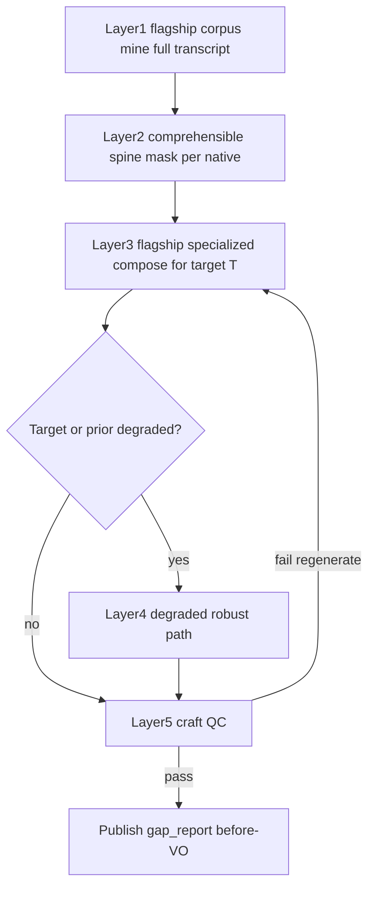

# Nugget Layup System

Canon for recovering discarded native information as **pre-native synthetic VO**.

When selection drops segments, the facts still live in the full transcript. This system:

1. **`nugget_corpus_mine`** (flagship) — mines atomic grounded nuggets from **all** speakers / segments (kept + excluded), plus talking points / ideal cuts. Prefer high-conf evidence; mark partial evidence on lexicon islands without inventing tokens.
2. **Comprehensible spine (deterministic)** — per-native `comprehensible_text` + `unclear_spans` masks (`understanding/native_comprehension_masks.json`) so garbled mid-spans never pollute LLM verbatim context as clean English.
3. **`nugget_layup_compose`** (flagship) — specialized packet per ordered native: spine + corpus + seam → clone-ready spoken before-VO.
4. **Degraded work-around** — when T or prior is `degraded_lexicon_island` / heavily degraded / low-conf must_keep / fused: orient and unlock from known spine + corpus only; never invent unclear words; thinner forward unlock OK.
5. **QC catch** — canned hinges / invented island claims / restates still fail; grace word floors apply only to degraded targets.
6. **Publish** — lay-ups become authoritative `gap_report.interviewer_lines` with `placement: before` (episode orientation preserved).
7. **Realize** — existing G1 synthesis + EDL `_gap_lines_for_segment(..., "before")` unchanged.

Ideal: nearly every kept native has a contentful before-VO so high-value excluded tape still reaches the listener — including when the on-air native contains incomprehensible STT islands.

Low-conf fuse + density must_keep: [low-conf-connector-fuse.md](./low-conf-connector-fuse.md).

## Authority vs legacy VO planners

| Legacy | Role under layup authority |
|--------|----------------------------|
| `gap_framing_compose` | Gap *detection* hints only; not authoritative air copy |
| `gap_framing_recompose` | Thin adapter: re-publish layups / keep orientation (`nugget_layup_authority`) |
| `synthetic_framing_plan` | Demoted to empty lines (no content recovery LLM) |
| `seam_glue` placeholders | Suppressed when a before-VO layup already targets the next native |

## Authority is fail-closed

| Guard | Where | Behaviour |
|-------|-------|-----------|
| **Freshness** | `assert_layup_fresh_vs_selection` — compose persist, publish, recompose, `edl` | Hard stop when the plan is `_meta.stale` or its `ordered_segment_ids` ≠ `master/selection.json`. Re-run `nugget_corpus_mine` → `nugget_layup_compose`; never republish a stale plan. |
| **Body ownership** | `lint_gap_report_layup_authority` + `restore_layup_lines` (`repair_gap_report`, `selection_framing_apply`) | Only the publish path writes body `interviewer_lines`. Any other writer that drops lay-ups has them re-injected; foreign origins and coverage below `min_layup_coverage` fail the lint. |
| **Uniqueness** | `evaluate_layup_craft` | A `nugget_id` may be claimed once; near-duplicate lay-up wording fails. Compose receives per-target `already_aired_nugget_ids` / `already_claimed_facts` walked in air order. |
| **No canned air** | `evaluate_layup_craft`, `seam_glue.mint_missing_transitions` | The hinge menu, `default_bridge_text`, `CANNED_BRIDGE_TEXT`, and generic unlocks (“What changed after that?”) are rejected as air copy. A known native with no composed lay-up and no planned transition fails instead of shipping filler. |
| **No invented islands** | `evaluate_layup_craft` | Air text must not contain unclear placeholders or “unclear audio” narration. |

Coverage-heal and ranking-heal paths in `tools/full_auto_driver.py` clear `.stage_done` for both nugget stages and schedule a re-run (`refresh_nugget_layup_plan`) instead of marking them done. Manifest/boundary heals re-schedule fuse via `refresh_connector_fuse_passes`.

## Next-native construction

Compose receives, per ordered native: the prior native's closing **comprehensible** excerpt, the spine (or full text when clear), unclear-span summaries, the seam that created the need, and open corpus nuggets ranked for that beat (excluded tape first). Each row must return `target_beat`, `listener_need_entering_T` (soft on degraded), `selected_nugget_ids`, `setup_from_nuggets`, and `forward_unlock`.

## Artifacts

- `understanding/nugget_corpus.json`
- `understanding/native_comprehension_masks.json`
- `understanding/nugget_comprehension_index.json`
- `understanding/nugget_layup_plan.json`
- `understanding/nugget_layup_qc.json`
- `understanding/gap_report.json` (layup lines + orientation)

## Config

See `analysis.nugget_layup.*` and `analysis.nugget_layup.degraded_layup.*` in [config-keys.md](./config-keys.md).

## Prompts

- [`docs/prompts/nugget_layup/nugget-corpus-mine.system.txt`](../prompts/nugget_layup/nugget-corpus-mine.system.txt)
- [`docs/prompts/nugget_layup/nugget-layup-compose.system.txt`](../prompts/nugget_layup/nugget-layup-compose.system.txt)

## Constraints

- Grounded paraphrase only — no invented dialogue ([NORTH_STAR](../../NORTH_STAR.md)).
- No “welcome back” / chapter meta speech.
- Must not restate the upcoming native’s opening; forward-cue required.
- Exactly one early episode orientation remains selection-independent.
