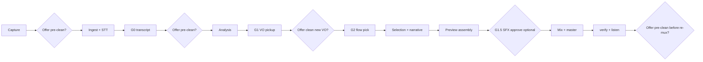

# Podcast quality roadmap

**Dependencies:** Pinned stack for mix/SFX/STT — [anchored-toolchain.md](./anchored-toolchain.md).

How the project moves from **strong analysis** to a **polished mastered podcast** the operator can trust. This doc is the north star for docs, build-out tickets, and GUI copy — not a promise that every item is implemented yet.

## v1 reality vs target

| Layer | v1 (shipped) | Target |
|-------|--------------|--------|
| Analysis | Content brief, segments, gaps, Flow 1 ranking | Same + profile gate before extended Flow 1 |
| VO pickup (G1) | Record lines to `vo_pickup/` | Same + optional **background cleanup on new VO** |
| Assembly Flow 1 | EDL with gaps + VO + transitions; mux speech-only concat | Full mix + preview (BUILD-065/069) |
| Assembly Flow 2 | Clips + SFX by index | Cold open + shared transition asset |
| Flow 3 publishing | Spec + prompt (BUILD-045) | ~200-word third-person show description from shared analysis |
| SFX | Late brief, one WAV per cue, fixed 2s | [Sound Design Plan](./sound-design.md) + [ElevenLabs guide](./elevenlabs-integration-guide.md) (BUILD-060+) |
| NLE GUI | Saves `segments/nle_edits.json` | Feeds manifest / selection / EDL |
| Master QA | LUFS + true peak (`verify_master`) | Narrative validators (planned) |
| Pre-clean | Shipped (BUILD-019 + BUILD-072 GUI offers) | Offered at **multiple workflow points** |

Until Wave 5 and assembly wiring land, treat **v1 `master.wav` as a reordered interview speech export** — not the final podcast mix described in [pipeline.md](../pipeline.md).

---

## Priority implementation waves

### Wave A — Assembly honesty (BUILD-067–069)

1. **Gap report → EDL** — **shipped (BUILD-067):** `vo_pickup` and gap placements in `edl.json`; `mux_flow1` still speech-only until mix/preview tickets.
2. **NLE → selection** — **shipped (BUILD-068):** `nle_edits.json` overrides applied in `full_master_ranking` and `edl_flow1`.
3. **Speech preview** — **shipped (BUILD-069):** `assembly_preview.wav` (speech + VO, no ElevenLabs) after ranking for operator listen-before-SFX.

### Wave B — Coherent sound + mix (BUILD-060–066)

See [sound-design.md](./sound-design.md), [elevenlabs-integration-guide.md](./elevenlabs-integration-guide.md), and [build-out/README.md](../build-out/README.md#wave-5--coherent-sound-design-planned).

**Wave B companion (design target):** [source-derived-sonic-mix-profile.md](./source-derived-sonic-mix-profile.md) — derive pacing, energy, and a shared **mix contract** once per interview from source audio + transcript; consume through SDP, craft, and mux for a homogeneous episode.

### Wave C — QA and mastering (BUILD-070–071, shipped)

- `verify_master.py`: integrated LUFS, true peak, duration rules per [evaluation-metrics.md](./evaluation-metrics.md).
- Two-pass or measured loudness on assembly bus; GUI surfaces failures.

### Wave D — Audio pre-clean (BUILD-019 + BUILD-072 done)

- `audio_preclean` stage shipped (ElevenLabs REST, optional).
- **Quality offers** at every checkpoint — see [audio pre-clean](../pipeline/audio_preclean/README.md#when-the-operator-is-offered-pre-clean).

---

## Operator quality offers (non-blocking)

These are **optional** prompts in the GUI (and future CLI flags), not gates G0–G2. The operator can accept or dismiss at any time.

| Checkpoint | Offer |
|------------|--------|
| Before ingest | Clean source interview background noise |
| After G0 (transcript review) | Re-clean if many low-confidence words may be noise-related |
| After profile / segmentation | Clean before re-running analysis from a stage |
| **G1 — after recording pickup questions** | Clean **new VO files** in `vo_pickup/` (room tone on mic, HVAC) |
| Before Flow 1/2 mix | Clean full `normalized.wav` before final assembly (re-ingest downstream) |
| Before master export | Last chance if master preview sounds noisy |

**G1 follow-up (important):** When the operator records **additional interviewer questions** to fill gaps, the app should explicitly offer: *“Remove background noise from your new pickup recordings?”* This is separate from cleaning the original interview — only `vo_pickup/*.wav` (or a merged pickup bus) need isolation.

Re-running pre-clean invalidates downstream markers from **ingest** (or from **vo_ingest** for pickup-only cleans) — see [idempotent-runs.md](../workflows/idempotent-runs.md).

---

## Recommended operator journey

---

## Related docs

- [build-out/steps-forward.md](../build-out/steps-forward.md) — prioritized implementation backlog
- [build-out/repository-map.md](../build-out/repository-map.md) — code ↔ docs layout
- [pipeline.md](../pipeline.md) — stage overview
- [operator-gates.md](../workflows/operator-gates.md) — mandatory stops + quality offers
- [audio_preclean/README.md](../pipeline/audio_preclean/README.md) — pre-clean semantics
- [assembly_and_mux/README.md](../pipeline/assembly_and_mux/README.md) — v1 vs target mux
- [evaluation-metrics.md](./evaluation-metrics.md) — pass/fail for masters
