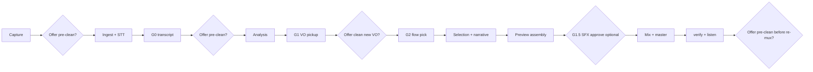

# Podcast quality roadmap

**Dependencies:** Pinned stack for mix/SFX/STT — [anchored-toolchain.md](./anchored-toolchain.md).

How the project moves from **strong analysis** to a **polished mastered podcast** the operator can trust. This doc is the north star for docs, build-out tickets, and GUI copy — not a promise that every item is implemented yet.

## v1 reality vs target

| Layer | v1 (shipped) | Target |
|-------|--------------|--------|
| Analysis | Content brief, segments, gaps, Flow 1 ranking; profile gate before extended Flow 1 (BUILD-081); **narrative QC** (`validate_narrative.py`) | Same + richer narrative validators |
| VO pickup (G1) | Record lines to `vo_pickup/`; optional **pickup-scoped pre-clean** (`vo_pickup` scope, BUILD-019 + BUILD-072) | Same |
| Assembly Flow 1 | EDL with gaps + VO + transitions; **`assembly_preview.wav`** before SFX; **`mix_flow1`** (speech + VO + SDP beds/stingers); narrative QC warn/block before ranking + EDL | Narrative validators on EDL |
| Assembly Flow 2 | **`mix_flow2`** montage + shared transition assets via SDP | Cold-open polish refinements |
| Flow 3 publishing | Third-person show description JSON + markdown (BUILD-045–046, 080) | Same |
| SFX | SDP + **`elevenlabs_prompt_craft`** + one WAV per `asset_id`; G1.5 optional approve gate | Deeper craft iteration loops |
| NLE GUI | Saves `segments/nle_edits.json`; **feeds ranking + EDL** (BUILD-068) | Richer operator edit UX |
| Master QA | LUFS + true peak (`verify_master`, BUILD-070–071); narrative QC (`validate_narrative`, topic + chapter checks) | Extended EDL narrative checks (future) |
| Pre-clean | **`audio_preclean`** + **GUI offers** at roadmap checkpoints (never auto-enabled) | Same pattern at any new checkpoint |

**Shipped mix path:** Flow 1/2 `master.wav` is built via `mix_flow1`/`mix_flow2` (BUILD-065–066), not speech-only concat. Legacy `mux_flow*` remains a single-stage rerun alias only.

---

## Priority implementation waves

### Wave A — Assembly honesty (BUILD-067–069) — **done**

1. **Gap report → EDL** — **shipped:** `vo_pickup` and gap placements in `edl.json`.
2. **NLE → selection** — **shipped:** `nle_edits.json` overrides applied in `full_master_ranking` and `edl_flow1`.
3. **Speech preview** — **shipped:** `assembly_preview.wav` (speech + VO, no ElevenLabs) after ranking for operator listen-before-SFX.

### Wave B — Coherent sound + mix (BUILD-060–066) — **done**

See [sound-design.md](./sound-design.md), [elevenlabs-integration-guide.md](./elevenlabs-integration-guide.md), and [build-out/README.md](../build-out/README.md#wave-5--coherent-sound-design-done).

**Shipped:** SDP init + palettes, flow plans, craft/generate, `mix_flow1`/`mix_flow2` in pipeline + GUI.

**Design companion:** [source-derived-sonic-mix-profile.md](./source-derived-sonic-mix-profile.md) — `source_acoustic_profile` (BUILD-082) feeds palettes and craft.

### Wave C — QA and mastering (BUILD-070–071) — **done**

- `verify_master.py`: integrated LUFS, true peak, duration rules per [evaluation-metrics.md](./evaluation-metrics.md).
- Measured loudness on assembly bus; GUI surfaces failures.

### Wave D — Audio pre-clean (BUILD-019 + BUILD-072) — **done**

- `audio_preclean` stage shipped (ElevenLabs REST, optional).
- **Quality offers** at every checkpoint — see [audio pre-clean](../pipeline/audio_preclean/README.md#when-the-operator-is-offered-pre-clean).
- Pickup-only scope (`vo_pickup`) when operator records gap-fill lines at G1.

---

## Operator quality offers (non-blocking)

These are **optional** prompts in the GUI (and future CLI flags), not gates G0–G2. The operator can accept or dismiss at any time.

| Checkpoint | Offer |
|------------|--------|
| Before ingest | Clean source interview background noise |
| After G0 (transcript review) | Re-clean if many low-confidence words may be noise-related |
| After profile / segmentation | Clean before re-running analysis from a stage |
| **G1 — after recording pickup questions** | Clean **new VO files** in `vo_pickup/` (room tone on mic, HVAC) |
| Before Flow 1/2 mix | Clean full `normalized.wav` before final assembly (re-ingest downstream) |
| Before master export | Last chance if master preview sounds noisy |

**G1 follow-up (important):** When the operator records **additional interviewer questions** to fill gaps, the app should explicitly offer: *“Remove background noise from your new pickup recordings?”* This is separate from cleaning the original interview — only `vo_pickup/*.wav` (or a merged pickup bus) need isolation.

Re-running pre-clean invalidates downstream markers from **ingest** (or from **vo_ingest** for pickup-only cleans) — see [idempotent-runs.md](../workflows/idempotent-runs.md).

---

## Recommended operator journey

---

## Related docs

- [build-out/remaining-build-commands.md](../build-out/remaining-build-commands.md) — open Agent work queue
- [build-out/repository-map.md](../build-out/repository-map.md) — code ↔ docs layout
- [pipeline.md](../pipeline.md) — stage overview
- [operator-gates.md](../workflows/operator-gates.md) — mandatory stops + quality offers
- [audio_preclean/README.md](../pipeline/audio_preclean/README.md) — pre-clean semantics
- [assembly_and_mux/README.md](../pipeline/assembly_and_mux/README.md) — mix vs legacy mux alias
- [evaluation-metrics.md](./evaluation-metrics.md) — pass/fail for masters
