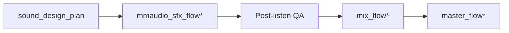

# Post-generation placement spec

How generated SFX assets are placed on the timeline **after** `mmaudio_sfx_flow*` writes WAVs. Initial SDP cues specify intent; the mix engine (`src/interview_mux/sound_design.py`) and operator listen QA adapt overlap, trim, and alignment using transcript timing and `source_acoustic_profile`.

**Principle:** Generation produces **candidates**; placement is decided at mux time. See also [local-audio-stack.md](./local-audio-stack.md) § Post-generation.

---

## Pipeline position

| Phase | Owner | Output |
|-------|-------|--------|
| Plan | `sound_design_plan_flow*` | Cue anchors + `level_db` + `placement` |
| Generate | `mmaudio_sfx_flow*` | `sound_design/assets/{asset_id}.wav`, `sound_design/mmaudio_qa.json` |
| Place | `mix_flow*` | `assembly.wav` with aligned overlays |

Config defaults: `config/app.defaults.json` → `mix_engine`, `disfluency_restore`, `sound_design`.

---

## Crossfade

Speech montage and clip joins use equal-power crossfade via `append_with_crossfade()` (`src/interview_mux/audio_timeline.py`).

### Defaults

| Flow | Config key | Default | When applied |
|------|------------|---------|--------------|
| Flow 1 speech | `mix_engine.crossfade_ms_flow1` | **100 ms** | EDL segment joins in `mix` |
| Flow 2 montage | `mix_engine.crossfade_ms_flow2` | **120 ms** | Highlight clip joins |
| Assembly preview | `mix_engine.crossfade_ms_assembly_preview` | **80 ms** | Speech + VO only preview |
| Disfluency restore | `disfluency_restore.crossfade_ms` | **30 ms** | Spliced filler clips |
| Preclean chunks | `audio_timeline` concat | **80 ms** | DeepFilterNet preclean chunk merge |

### Adaptive crossfade

When `mix_engine.adaptive_crossfade: true` (default), the engine shortens crossfade if adjacent clips share similar RMS — reduces double-mud on same-speaker joins.

### Flow-specific intent

| Pattern | Flow 1 | Flow 2 |
|---------|--------|--------|
| Speech join | 100 ms; preserve breath tails | — |
| Clip-to-clip | — | 80–200 ms; favor **120 ms** default |
| Cold open → clip 1 | Bed may overlap first 200 ms at −12 dB | Same; momentum over continuity |
| VO bridge | Prior bed −3 dB/s over 300 ms | Rare in Flow 2 |

### Operator adjustments

| Symptom | Action | Log token |
|---------|--------|-----------|
| Audible double-hit at join | Increase crossfade +20 ms | `mmaudio_mix_adjust` |
| Montage feels sluggish | Decrease crossfade −20 ms (floor 60 ms) | same |
| Spectral jump between clips | Lengthen crossfade; lower transition `level_db` | same |

### Placement QA `suggested_crossfade_ms`

When `sound_design.placement_qa_enabled: true`, `run_placement_qa()` may emit `suggested_crossfade_ms` per asset in `sound_design/placement_adjustments.json`. `apply_placement_adjustments()` copies the value onto matching SDP cues as `crossfade_ms` before mix.

| Consumer | Field used | Fallback |
|----------|------------|----------|
| Flow 1 beds (`under_segment`) | `cue.crossfade_ms` for `fade_in` / `fade_out` | 120 / 150 ms |
| Flow 1 stingers / bridges | `cue.crossfade_ms` for overlay fades | 50 / 130 ms |
| Flow 1 speech joins | `crossfade_ms` on `after_segment` / `before_segment` transition cues | `mix_engine.crossfade_ms_flow1` (100 ms) |
| Flow 2 highlight joins | `between_clips` cue `crossfade_ms` via `resolve_between_clip_transition()` | `mix_engine.crossfade_ms_flow2` (120 ms) |

Log line when applied: `placement_qa: applied level to N cue(s), crossfade to M cue(s)`.

---

## Laughter window nudge (H-F1S-02)

When `understanding/value_features.json` includes laughter windows (from `quality_trajectory_flags` labels containing `laugh` or `audio.laughter_windows`), `mix` nudges chapter stingers away from those windows via `_nudge_away_from_laughter()` in `sound_design.py`.

| Condition | Behavior |
|-----------|----------|
| `laughter_windows` empty or missing | Placement unchanged; no error (fail-open) |
| Stinger pause-tail overlaps laughter ±200 ms | Nudge ±200/400/600 ms; log `mix: stinger_aligned pause_tail` |
| All nudge candidates blocked | Returns `None`; mixer keeps cue plan position |

Recovery: update value features or transcript, then `--from-stage mix`. See [troubleshooting.md](../workflows/troubleshooting.md) § Audio / mix.

### Adaptive bed level (`mix.adaptive_level_from_sap`)

When enabled (default), `flow1_overlays_from_sdp()` adjusts bed `level_db` via `_adaptive_bed_level_db()`:

| SAP `speech_active_ratio` | Effective bed ceiling |
|---------------------------|------------------------|
| ≥ 0.75 | `min(default_level_db, -26 dB)` |
| ≥ 0.60 | `min(default_level_db, -24 dB)` |
| else | `default_level_db` from SDP cue |

Placement QA may add `suggested_level_db_delta` on top (typically −2 dB speech-first default; extra −2 dB for `panel`, `trauma_adjacent`, `noisy_room` buckets).

### Scenario crossfade override (`mix_policy.crossfade_ms_flow2`)

`sonic_context.compute_mix_policy()` may set per-atlas `crossfade_ms_flow2` (e.g. `media_profile`: 80 ms, `fireside`: 180 ms). `REMOVED_mix_flow2()` prefers this over `mix_engine.crossfade_ms_flow2` when present; Flow 1 speech joins still use `mix_engine.crossfade_ms_flow1` unless cue-level `crossfade_ms` is set by placement QA.

---

## Bed trim

Ambient beds (`placement: under_segment`) are looped to segment duration, ducked, and faded — not placed at full generated length blindly.

### Algorithm (`flow1_overlays_from_sdp`)

1. Resolve segment `[start_ms, end_ms]` from EDL / selection timing map.
2. `dur = end_ms - start_ms`; skip if `dur ≤ 0`.
3. `loop_to_duration(base, dur)` — trim or tile asset to exact window.
4. Apply `level_db - duck_under_speech_db` (default duck **16 dB**, floor `MIN_DUCK_DB`).
5. **Fade in 120 ms**, **fade out 150 ms** at segment edges.

### Trim rules

| Rule | Value | Rationale |
|------|-------|-----------|
| Bed must not extend past segment end | Hard trim at `end_ms` | Prevents bleed into next speaker |
| Bed on non-palette segment | Lint + crossval reject | `sdp_cross_validate` |
| Loop seam | Regen if audible click | Operator post-listen fail |
| Dense speech (high WPM) | Prefer no bed | SAP `underscore_policy: skip` or sparser cues |

### Bed entry overlap (plan intent)

SDP may specify bed enters **200–400 ms before** segment start for emotional priming. Mix engine positions at `start_ms`; fade-in handles overlap under prior speech. Duck depth must keep consonants intelligible (14–22 dB range per [source-derived-sonic-mix-profile.md](./source-derived-sonic-mix-profile.md)).

### VO bridge co-trim

When `placement: before_segment` with `role: vo_bridge`, measured duration from `sound_design_vo_finalize` (`measured_duration_ms`) overrides craft `duration_seconds` — bed fade-under runs for VO length + 300 ms tail.

---

## Stinger alignment

Chapter and transition stingers must land on **pause tails**, not over words. Implemented in `resolve_stinger_position_ms()` and `_align_stinger_to_pause_tail()`.

### Source-time resolution

1. Load `placement_hints` from `source_acoustic_profile.json`.
2. If `prefer_stinger_after_pause_tail: false` → use cue anchor position unchanged.
3. Find words in transcript near segment boundary (lookback up to `max(min_pause*2, 2000)` ms).
4. Select last word-end where gap to next word ≥ `stinger_min_pause_after_speech_ms` (default **400 ms**).
5. Map source ms → timeline ms via `segment_timing` offset.

### Placement types

| `placement` | Anchor | Alignment search |
|-------------|--------|------------------|
| `before_segment` | Segment start | Pause tail in lookback window before `seg_start` |
| `after_segment` | Segment end | Last pause tail inside segment ending at `seg_end` |
| `between_clips` (Flow 2) | Clip boundary | Pause at cut point; shorter min_pause (300 ms) acceptable |

### Stinger audio trim

After position resolve:

- Apply `level_db` gain.
- Fade in **50 ms**, fade out **130 ms**.
- Trim to `duration_seconds` from asset metadata (default cap **1.8 s** for `chapter_stinger`).
- Enforce `stinger_max_per_minute` from SAP mix contract — drop excess cues with warn log.

### Alignment pass/fail

| Check | Pass | Fail action |
|-------|------|-------------|
| Stinger onset ≥ min_pause after last word | `mix: stinger_aligned pause_tail` log | Reposition; if no pause, shift +50 ms after segment end |
| Overlap excluded window (disfluency restore) | Skip cue | — |
| Stinger cap | Within `cap * timeline_minutes` | Drop cue; warn |

### Scenario overrides

From [interview-scenario-atlas.md](../prompts/_shared/interview-scenario-atlas.md):

| Scenario | `stinger_min_pause_after_speech_ms` | Notes |
|----------|-------------------------------------|-------|
| `noisy_room` | 500+ | Longer pauses unreliable — prefer `after_segment` |
| `dense_jargon` | 450 | No stinger inside terminology chains |
| `trauma_adjacent` | N/A | Stinger forbidden 2 min after high-severity beat |
| `fireside` | 400 (default) | Prefer bed swell over stinger |

---

## Layer stack patterns

| Pattern | Components | Parameters |
|---------|------------|------------|
| **Sequential** | Stinger after clean speech end | Optional 50–150 ms silence gap |
| **Overlap + duck** | Bed under speech | Bed at `start_ms`; duck 14–20 dB |
| **Crossfade** | Flow 2 clip change | 80–200 ms equal-power |
| **Fade under** | VO bridge | Prior bed −3 dB/s over 300 ms |
| **Layer stack** | Cold open → speech | Open −6 dB over 400 ms as speech fades in |

---

## Operator listen gate

| Checkpoint | Pass criteria |
|------------|---------------|
| Preview with speech | No word obscured in densest segment |
| Chapter boundaries | Stinger intentional, not trailer |
| Flow 2 montage | Cuts connected, not random SFX |
| Master peak | No clip; speech bus loudest |

Record in `run_meta.sfx_listen_results[]` and `gui_log.jsonl` (`sfx_post_listen_pass` / `fail`).

---

## Placement QA (deterministic hints)

When `sound_design.placement_qa_enabled: true`, `placement_qa.py` runs after **`mmaudio_sfx_flow*`** (merging `mmaudio_qa` hints) and on mix refresh. It writes **`sound_design/placement_adjustments.json`** with conservative level/crossfade hints (missing WAV, suspiciously small file, default bed duck).

At mix, `apply_placement_adjustments()` reads that file and applies `suggested_level_db_delta` / `suggested_crossfade_ms` to SDP cue copies before `flow1_overlays_from_sdp` / Flow 2 overlay builders compute final `level_db`. Cue validation against the plan remains `post_sound_plan_*` cross-validate — placement QA does not run at plan persist (no WAVs yet).

---

## Code references

| Function | File | Role |
|----------|------|------|
| `run_placement_qa` / `apply_placement_adjustments` | `placement_qa.py` | Post-SFX hints + mix-time apply |
| `maybe_run_placement_qa` | `placement_qa.py` | Called from `sfx_mmaudio.py` after generation |
| `flow1_overlays_from_sdp` | `sound_design.py` | Bed loop/trim + stinger overlays |
| `resolve_stinger_position_ms` | `sound_design.py` | Pause-tail alignment |
| `_append_mix_clip` | `sound_design.py` | Crossfade speech joins |
| `validate_pre_mix` | `sdp_cross_validate.py` | Asset + cue completeness before mux |
| `mix_contract` | `understanding.py` | SAP-driven caps and duck defaults |

**Related:** [sound-design.md](./sound-design.md) · [operator-sound-and-mix.md](../workflows/operator-sound-and-mix.md) · [stage-quality-scorecard.md](./stage-quality-scorecard.md)
