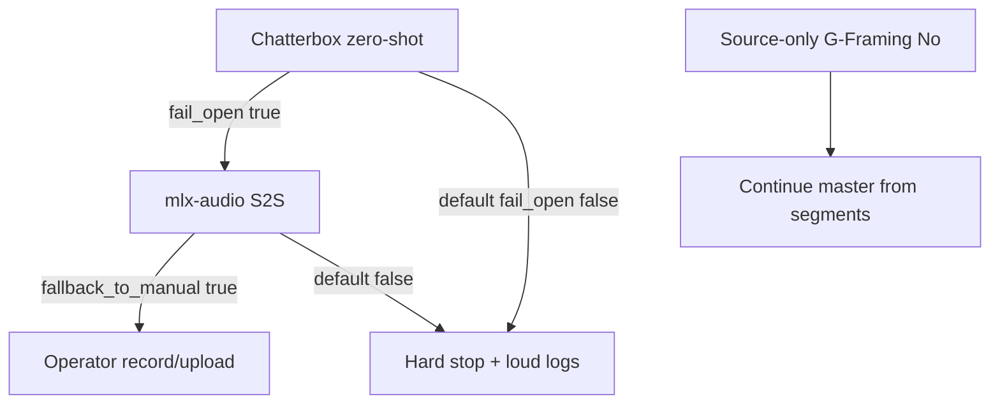

# Reliability charter — voice + pipeline guardrails

Holistic reliability for gap framing, Chatterbox synthesis, and Flow 1 delivery. Operator gates remain the primary control surface. **Irreparable major failures hard-stop** with operator-visible logs (Activity / `gui_log.jsonl` / terminal) rather than silently skipping VO.

## Voice failure posture

Shipped defaults: `gap_vo.fail_open=false`, `gap_vo.fallback_to_manual_on_failure=false`, `gap_fill.auto_skip_when_ineligible=false`. Explicit operator **No** at G-Framing still skips VO intentionally. Opt-in knobs restore the legacy degrade-and-continue ladder.

## QC tiers

| Tier | Mechanism | Default posture |
|------|-----------|-----------------|
| Schema | `prompt_validation` + JSON schemas | Blocking on write |
| Deterministic lint | `deterministic_lint` per stage | Warn (v2 simple path) |
| Framing guards | `framing_coverage_guard` after ranking | Strict on primary impact / topic survival |
| EDL narrative QC | `edl_narrative_qc` at `edl` | `strict: true` |
| Master verify | `verify_master` LUFS/TP | Release checklist |
| Loud fail | `loud_fail.raise_loud_failure` | Hard-stop irreparable VO / eligibility failures |

## Config knob index

| Key block | Purpose |
|-----------|---------|
| `analysis.gap_framing.*` | Word caps, exclusion ratio, topic survival, framing-before-impact |
| `analysis.gap_vo.*` | Chatterbox default, fail-open (off), manual fallback (off), reference length |
| `analysis.gap_fill.auto_skip_when_ineligible` | Legacy silent skip when framing ineligible (default **false** = hard-stop) |
| `edl_narrative_qc.*` | Strict EDL checks, synthesized VO requirement, framing alignment |

See `docs/cross-cutting/config-keys.md` for full key list.

## v2 lint / crossval

`v2.lint_blocking` and `v2.cross_validate_blocking` remain **documentation-only** on the v2 simple path (defaults `false`). Tiered enforcement uses stage lint + EDL QC + operator gates instead.

## Release checklist

1. `./tools/check_prerequisites.sh` (includes Chatterbox WARN in `verify_local_models.sh`)
2. Gap path smoke: `docs/workflows/smoke-test.md`
3. `./scripts/verify_artifact_contract.sh`
4. Targeted pytest: gap framing, synthesis report, EDL QC, framing guard, `test_loud_fail`, `test_synthesis_fallback`

Related: [chatterbox-interviewer-vo.md](chatterbox-interviewer-vo.md), [operator-gates.md](../workflows/operator-gates.md).
