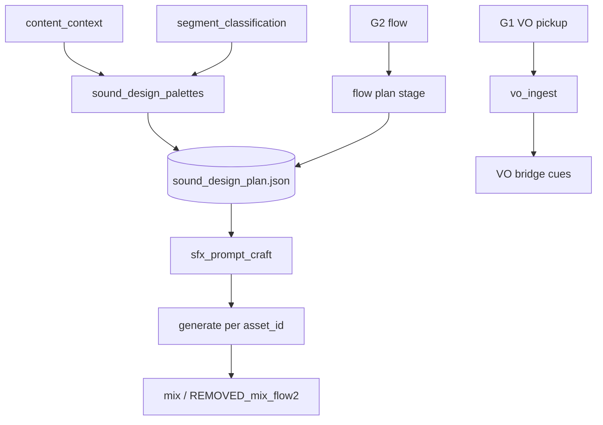
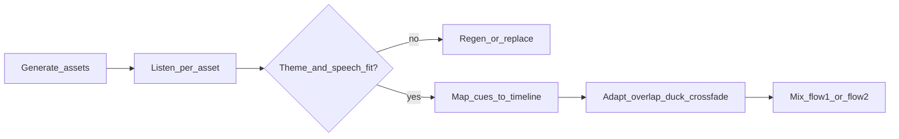

# Coherent sound design (shipped)

**Status:** Wave 5 shipped — SDP palettes + flow plans, **music-only** theme stems via **MusicGen-large** (`theme_*` roles), craft/generate per `asset_id`, and `mix`. **BUILD-SS soundscape policy** adds per-run `understanding/soundscape_policy.json`, cue slots, fitness remediation, and post-mix verify→remux — [soundscape-policy.md](./soundscape-policy.md).

**Creative delivery (locked):** show audio is **instrumental music only** — underscore, cold open, emphasis, chapter resolve, transition phrases, outro. **Forbidden forever:** whoosh, tick/woodtick, foley, murmur/HVAC, or any SFX accent. MMAudio is **not** used for creative-delivery show audio (legacy/non-creative only).

**Prompt-stage guardrails:** [prompts/sound_design/guardrails-and-edge-cases.md](../prompts/sound_design/guardrails-and-edge-cases.md)

**Local audio stack:** [local-audio-stack.md](./local-audio-stack.md) — DeepFilterNet preclean + MusicGen theme stems (+ optional legacy MMAudio venv).

**Toolchain:** [anchored-toolchain.md](./anchored-toolchain.md) (`pydub`, `ffmpeg`, local MusicGen subprocess, `openai` for craft stages).

**Prompt files (Wave 5):** [theme-palettes](../prompts/sound_design/theme-palettes.system.txt), [plan-flow1](../prompts/sound_design/plan-flow1.system.txt), [sfx-prompt-craft](../prompts/sound_design/sfx-prompt-craft.system.txt), [sfx-prompt-refine](../prompts/sound_design/sfx-prompt-refine.system.txt). Examples: [sound-design.examples.md](../prompts/_shared/examples/sound-design.examples.md).

**Per-interview acoustic baseline (shipped, BUILD-082):** [source-derived-sonic-mix-profile.md](./source-derived-sonic-mix-profile.md) — `understanding/source_acoustic_profile.json` feeds `coherence`, craft volleys, and mix contract.

**Music brief:** `understanding/music_brief.json` packs narrative/topics/moods for MusicGen prompt compile (`music_motif.py`).

---

## Problem with v1

| Gap | Impact |
|-----|--------|
| SFX chosen only at end of flow | Misses themes from `content_brief`, segment `topic_tags`, VO placement |
| One new WAV per brief line | No sonic cohesion; montage sounds unrelated |
| Fixed 2s legacy duration | Ignores `duration_ms` in brief |
| Flow 2 concat by `sfx_001` index | Cold open after clip 0; ignores `from_clip_rank` |
| Flow 1 mux ignores SFX + VO | Generated files unused |
| Ducking / beds in prompts only | Never applied in mix |

---

## North star

Sound design is a **timeline artifact**, not a one-shot JSON before export:

1. **Discover** sonic opportunities during analysis (themes, entities, beats, gaps, VO).
2. **Plan** a **motif family** (`motif_family` + music-only `theme_*` assets) with restrained cues (~28–40% underscore).
3. **Craft** MusicGen prompts via OpenAI (shared `prompt_dna` / melodic phrase).
4. **Generate and select** three candidates per underscore loop; score musicality,
   speech-band restraint, and loop safety, then promote the best stem to the canonical
   `asset_id` WAV. Candidate evidence lives in `sound_design/musicgen_candidates.json`.
5. **Arrange** chapter-aware scenes that alternate the primary and related lift loop,
   with deliberate dry breaks rather than one tiled bed across the entire show.
6. **Mix** with a modest speech-presence EQ carve, soft-gate ducking, pause-ride in air,
   and automated underbed A/B QC with bounded targeted remux.

**Open grammar (mix):** after show-open/hook VO, play a speech-free `theme_cold_open` bridge, then the interviewer question, then the answer (soft underscore under speech). Cue roles resolve from the asset when the cue omits `role`. Music lanes (`theme_bookend` / `theme_punctuator` / `theme_bed`) are exclusive beyond a short crossfade — no stacked cold_open + emphasis + bed at the same instant. Emphasis/resolve/outro cues must bind to matching `theme_*` assets (`music_lane.py` + SDP repair).

Example: interview about **founders / ESOP** → motif family with warm acoustic + piano DNA → `theme_underscore` under important beats; `theme_chapter_resolve` cadences at chapter hinges — never woodtick/murmur.

**Music elevates Shape structure, not coverage theater:** every `theme_*` cue is a mutation on the music/SFX/air axis of the [Shape mutation engine](./mastering-shape-engine.md#shape-as-mutation-engine) (soft bands: bed coverage 0.40–0.88, hinge stinger 0.3–1.0). A cue earns its place by marking a real hinge, filling an actual dead-air gap, or selling a payoff the plan already decided on — never to check off "has music here." Mechanical, unmotivated cue placement shows up as `sonic_weave` degradation at the [hard-delight audit](./mastering-audition-loop.md#auditions-and-hard-delight) downstream.

---

## Sound Design Plan (SDP)

Primary file: `understanding/sound_design_plan.json`

Supporting:

| Path | Purpose |
|------|---------|
| `sound_design/assets/{asset_id}.wav` | One generated file per reusable asset |
| `sound_design/sfx_prompts.json` | Crafted prompts per asset (audit) |
| `master/podcast_sfx_brief.json` | Legacy export (optional compat) |
| `REMOVED_flow2/sfx_brief.json` | Legacy export (optional compat) |

### Document shape

```json
{
  "version": 1,
  "coherence": {
    "sonic_identity": "warm documentary, understated",
    "primary_mood": "hopeful",
    "density": "sparse"
  },
  "palettes": [
    {
      "palette_id": "farming",
      "theme_label": "Family farm operations",
      "keywords": ["farm", "crops", "barn"],
      "segment_ids": ["seg_018", "seg_019", "seg_022"],
      "ambient_description": "soft morning pasture, distant birds, no voices",
      "accent_description": "single distant horse snort, rare",
      "avoid": ["cartoon barn", "comedy animals"]
    }
  ],
  "assets": [
    {
      "asset_id": "chapter_stinger_warm",
      "role": "chapter_stinger",
      "description": "soft tonal rise, 1.5s",
      "duration_seconds": 1.5,
      "reuse_note": "Same stinger after every chapter"
    },
    {
      "asset_id": "ambient_farm_morning",
      "role": "ambient_bed",
      "palette_id": "farming",
      "description": "loopable field ambience",
      "duration_seconds": 6.0
    }
  ],
  "flow_plans": {
    "podcast": {
      "profile": "podcast",
      "cues": [
        {
          "cue_id": "bed_seg_018",
          "asset_id": "ambient_farm_morning",
          "placement": "under_segment",
          "segment_id": "seg_018",
          "level_db": -28,
          "duck_under_speech_db": 16
        },
        {
          "cue_id": "sting_ch02",
          "asset_id": "chapter_stinger_warm",
          "placement": "after_segment",
          "after_segment_id": "seg_025",
          "chapter_id": "ch_02"
        }
      ]
    },
    "flow2": {
      "profile": "montage",
      "cues": [
        {
          "cue_id": "cold_open",
          "asset_id": "montage_rise_hit",
          "placement": "before_timeline"
        },
        {
          "cue_id": "trans_1_2",
          "asset_id": "montage_whoosh_soft",
          "placement": "between_clips",
          "from_clip_rank": 1,
          "to_clip_rank": 2
        }
      ]
    }
  },
  "generated": {
    "chapter_stinger_warm": "sound_design/assets/chapter_stinger_warm.wav"
  }
}
```

### Asset roles

| Role | Reuse pattern | Flow |
|------|---------------|------|
| `ambient_bed` | One per palette; many `under_segment` cues | Flow 1 |
| `chapter_stinger` | One asset; all chapter boundaries | Flow 1 |
| `vo_bridge` | One asset; all VO intro/outro | Flow 1 |
| `transition_stinger` | **One asset between every clip pair** | Flow 2 |
| `cold_open` / `outro` | Once each (may share asset with transition) | Flow 2 |
| `accent_foley` | Sparse; optional | Either |

**Rule:** Multiple cues → same `asset_id` → one MMAudio generation → coherent master.

---

## When stages run (multi-phase)

Do not limit SFX to the final assembly step. Information accrues; **plan early, generate late**.



| Phase | Stage key | Inputs | Writes |
|-------|-----------|--------|--------|
| A | `sound_design_palettes` | `content_brief`, `segments`, `analysis_state`, `source_acoustic_profile` | `palettes`, `coherence` |
| B | `sound_design_plan` or `_flow2` | SDP, selection, narrative, gaps, transitions | `assets`, `flow_plans.*.cues` |
| C | *(optional)* `sound_design_vo_finalize` | SDP + `vo_pickup` durations | Adjust VO bridge cues |
| D | `sound_design_generate_flow*` | SDP assets | `sound_design/assets/*.wav` |
| E | `mux_flow*` | SDP + EDL/selection + VO | `assembly.wav` |

**Gate (shipped, optional):** **G1.5** — when `g1_5_require_prompt_approval: true`, operator reviews cue list / prompt craft before MMAudio SFX generation ([operator-gates.md](../workflows/operator-gates.md#g15--sound-design-prompt-approval-optional-shipped)).

---

## LLM stages and prompts

| Stage | Model tier (shipped default) | Prompt file |
|-------|------------------------------|-------------|
| `sound_design_palettes` | flagship | [theme-palettes.system.txt](../prompts/sound_design/theme-palettes.system.txt) |
| `sound_design_plan` | flagship | [plan-flow1.system.txt](../prompts/sound_design/plan-flow1.system.txt) |
| `sfx_prompt_craft` | flagship | [sfx-prompt-craft.system.txt](../prompts/sound_design/sfx-prompt-craft.system.txt) |
| `sfx_prompt_refine` | flagship | [sfx-prompt-refine.system.txt](../prompts/sound_design/sfx-prompt-refine.system.txt) |

Full matrix: [llm-stage-model-matrix.md](./llm-stage-model-matrix.md).

### Palette stage (analysis)

- After `segment_classification`.
- Map `content_brief.topics` + `topic_tags` → thematic palettes (farm, fintech, etc.).
- No generation yet; no cues.

### Flow 1 plan

- Require **3–6 assets**; chapter stinger **reused** at every chapter.
- Beds `under_segment` only where palette `segment_ids` match.
- VO bridges from `gap_report` (`delivery: record`) → `before_segment` / `after_segment` cues.
- Subtle podcast — no trailer whooshes.

### Flow 2 plan

- Require **2–4 assets**; **one transition asset** for all `between_clips` cues.
- Cold open `before_timeline`; optional outro `after_timeline`.
- Energy via `level_db`, not unrelated SFX per cut.

### MMAudio prompt craft

- Input: `assets[]` + `coherence`.
- Output per asset: `sfx_prompt`, `duration_seconds`, `negative_prompt` (separate MMAudio API field).
- Optional: `prompt_influence`, `cfg_strength`, `mmaudio_variant`, `num_steps`, `seed`, `regression_notes`.
- See [mmaudio-prompt-tuning.md](./mmaudio-prompt-tuning.md).

---

## Generation (`mmaudio_sfx_flow*`)

For each unique `asset_id` referenced by active flow cues:

1. Run prompt craft (if not cached in `sound_design/sfx_prompts.json`).
2. Local MMAudio text-to-audio via `mmaudio_runner.generate_text_to_audio` (`prompt`, `negative_prompt`, `cfg_strength`, `num_steps`, `seed`, variant `large_44k_v2` default).
3. Write `sound_design/assets/{asset_id}.wav` (44 kHz native → resampled 48 kHz mono).
4. Run `mmaudio_asset_qa` → `sound_design/mmaudio_qa.json`; merge hints into `placement_adjustments.json`.

**Tuning / QA:** [mmaudio-prompt-tuning.md](./mmaudio-prompt-tuning.md) · [sfx-prompt-regression.md](../prompts/_shared/examples/sfx-prompt-regression.md)

5. On failure → silent ffmpeg placeholder (length from `duration_seconds`).
6. Partial regen via `run_meta.sfx_regen_asset_ids` or API `POST /sfx-prompts/regenerate`.

**Not** one file per cue (`sfx_001`, `sfx_002`).

---

## Musical structure for MMAudio prompts

Musical language in prompts must serve **speech-first podcast clarity** under dialogue, while speech-free bookends (cold open / outro / emphasis) may be musically present and multi-instrument. MusicGen `theme_*` stems may use pulse and melody; beds duck under speech rather than being inaudible.

### musical_intent schema (craft stage)

Stored on each row in `sound_design/sfx_prompts.json` when the asset uses pitch motion:

| Field | Values | Default for beds |
|-------|--------|------------------|
| `register` | `low` \| `mid` \| `high` | N/A (beds omit musical_intent) |
| `motion` | `static` \| `rise` \| `fall` \| `rise_then_fall` | — |
| `tonal_center` | `unspecified_warm` \| `unspecified_neutral` \| `none` | — |
| `harmonic_density` | `none` \| `sparse` \| `moderate` | `none` for beds |
| `rhythmic_presence` | `none` \| `pulse` | **`none`** always for beds |
| `tempo_feel_bpm` | number or null | `null` |
| `meter_feel` | `free` \| `even` \| `swung` | `free` |

### Podcast-safe defaults

- **Theme underscores (`theme_underscore`):** May carry a **restrained rhythmic pulse** (soft even meter, sparse plucked/perc ticks). Speech always wins via soft speech-gate duck; beds sit in the audible-but-subordinate band (~−22…−18 dBFS). Forbid loud kits, vocal-like leads, dense midrange hooks.
- **Ambient / MMAudio environmental beds (heritage):** No pitch center, no meter, no pulse — only environmental spectrum and motion (wind, room). Do not confuse these with MusicGen theme underscores.
- **Chapter stingers:** At most **one** pitch gesture over ≤2 s; prefer noise+filter sweep over diatonic melody.
- **Montage transitions:** Forward spectral motion; avoid memorable melodic hooks listeners would hum.
- **Midrange discipline:** Stingers and transitions keep energy out of 1–4 kHz when they might overlap speech tails.

### Role-specific musical constraints

| Role | Allowed | Forbidden |
|------|---------|-----------|
| `ambient_bed` | Aperiodic texture, rare non-pitched events | Beat, chord progression, hook |
| `chapter_stinger` | Single rise/fall, sparse partials | Drum kit, long riser >1.5 s |
| `transition_stinger` | Brief sweep, noise burst | Vocal-like formants, EDM build |
| `cold_open` | Slightly stronger gesture than transition | Lyrics, chant, recognizable tune |
| `vo_bridge` | High-passed air only | Any pitch competing with VO formants |

Craft prompts must **verbalize** these constraints in prose even when `musical_intent` is present — the API receives `sfx_prompt` text only.

---

## Post-generation analysis and adaptive placement

**Status:** Operator workflow (post-listen QA). Mix placement and ducking ship in `sound_design.py` (`mix`, `REMOVED_mix_flow2`).

Initial MMAudio output is a **candidate**. Final timeline placement uses analysis **after** generation against interview themes, keywords, operator notes (`style.sound_design_notes`), and the speech stem.

### Workflow



### Phase 1 — Per-asset fit

| Check | Method | Fail |
|-------|--------|------|
| Theme fit | Compare asset timbre to palette keywords + `sonic_identity` | Regen (max 2) |
| Intelligibility | Bed under densest speech segment | Lower level / stronger duck |
| Duration | Tail vs cue window | Adjust `duration_seconds` |
| Policy | Voice-like content | Discard; tighten negative_prompt |
| Loop seam | Bed loop in DAW | Regen with seamless-wrap language |

**Inputs:** `content_brief`, `analysis_state.themes`, `segments.manifest`, generated WAV, `ingest/normalized.wav` or `assembly_preview.wav`. Planned: `source_acoustic_profile` — [source-derived-sonic-mix-profile.md](./source-derived-sonic-mix-profile.md).

### Phase 2 — Transition adaptation (decided here, not in plan stage)

| Pattern | Use when | Typical params |
|---------|----------|----------------|
| Sequential | Stinger after clean speech tail | 50–150 ms gap optional |
| Overlap + duck | Bed under segment | Bed −26 to −30 dB; duck 14–20 dB |
| Equal-power crossfade | Flow 2 clip change | 80–200 ms |
| Fade under | VO enters over bed | Bed −3 dB/s over 300 ms |
| Layer + attenuate | Cold open into clip 1 | Open −6 to −12 dB over 400 ms |

**Flow 1:** Longer bed fades at chapters; stingers **after** words, not over them.

**Flow 2:** Shorter crossfades; one transition asset; level_db tweaks per cue only.

### Phase 3 — Operator gate

Log approve / regen / level change in `gui_log.jsonl`. When enabled, G1.5 (`g1_5_require_prompt_approval`) covers **pre-spend** prompt review; this phase is **post-listen**.

Full playbook: [local-audio-stack.md § Post-generation](./local-audio-stack.md#post-generation-analysis-and-adaptive-placement).

---

## Mix logic

Module: `src/interview_mux/sound_design.py` (`mix`, `REMOVED_mix_flow2`).

### Flow 1 (`mix`)

Timeline order per `ordered_segment_ids`:

1. Optional VO bridge stinger (`before_segment`).
2. Recorded VO from `vo_pickup/{line_id}.wav`.
3. Speech clip from `ingest/normalized.wav`.
4. Overlay `ambient_bed` assets (`pydub` loop + duck under speech).
5. Chapter stinger (`after_segment`) — **same WAV each time**.
6. VO after segment if `placement: after`.

**Contiguous beds (Plan 4):** `flow1_overlays_from_sdp` merges consecutive
per-segment `under_segment` cues that share an `asset_id` and sit on adjacent
selected segments into one `under_segment_span` scene bed (fade only at the
span edges) when `mastering.music_continuity.prefer_contiguous_beds` is set
(default `true`) — see [mix-house-chain.md](./mix-house-chain.md#prefer_contiguous_beds-plan-4-wired)

**Scene variation:** `music_palette_compose` normalizes bed cues after composition.
Eligible chapter/cue-slot anchors alternate `underscore_loop` and `optional_loop`.
If only one loop exists, a scene is capped and followed by a dry chapter break;
an existing stinger may mark a pause-safe hinge. This prevents both per-cut restart
chatter and long-loop boredom.

**Automated enjoyment/presence check:** mix measures the known rendered bed stem
against the speech-only stem per underbed window. Masking triggers more carve/duck;
an inaudible bed receives a bounded level lift. Persistent masking remains blocking,
while a presence-only miss warns after the two-cycle remediation cap. The evidence
is written to `master/underbed_ab_qc.json`.
and [seam-autopsy.md](./seam-autopsy.md#music). Ducking (step 4's under-speech
attenuation) is **speech-wins** regardless of whether the speech is native or a
recorded VO pickup — same envelope-follower contract, see
[mix-house-chain.md](./mix-house-chain.md#speech-wins-ducking--vonative-harmony-plan-4).

Bed/hinge-stinger coverage floors are the same **Shape-owned soft bands**
(`bed_coverage` `0.40–0.88`, `hinge_stinger_coverage` `0.3–1.0`) enforced by
`soundscape_verify.py` post-mix — see [soundscape-policy.md](./soundscape-policy.md#standards-measurable).
Post-mix remediation for a low ratio only seeds beds on real
palette/quartile-mapped segments, preferring to extend an already-bedded
neighbor over scattering per-clip beds — it does not game the metric.

### Flow 2 (`REMOVED_mix_flow2`)

1. Cold open asset (`before_timeline`).
2. For each highlight (by `rank`): clip WAV → **same** transition asset (`between_clips`).
3. Optional outro (`after_timeline`).

Use `from_clip_rank` / `to_clip_rank` on cues — not concat index.

---

## Analysis inputs to use

| Source | Use for |
|--------|---------|
| `content_brief.topics`, `emotional_beats` | Palettes, mood |
| `analysis_state.themes`, `entities` | Keywords, avoid list |
| `source_acoustic_profile` | `pace_class`, `mix_contract`, `prompt_tokens` |
| `segments.manifest` + `topic_tags` | Segment ↔ palette mapping |
| `gap_report` + `vo_pickup` | VO bridge cues, timing |
| `narrative_plan`, `selection.chapters` | Chapter stingers |
| `style` in analysis profile | Density, podcast vs montage |

---

## Legacy v1 vs default path (summary)

| Area | Legacy v1 (single-stage rerun) | Default (shipped) |
|------|-------------------------------|-------------------|
| Planning | `podcast_sfx_brief` / `sfx_brief` at end | SDP + palettes + flow plans |
| Reuse | Per-cue `sfx/*.wav` | `asset_id` → one WAV |
| Thematic beds | Prompt only | `under_segment` + palette map |
| Legacy brief | Raw `description`, 2s fixed | Crafted prompt + variable duration |
| Flow 1 mix | `mux_flow1` alias / legacy concat | `mix` — speech + VO + beds + stingers |
| Flow 2 mix | Index-based `sfx_i` | `REMOVED_mix_flow2` — cold open + shared transition |

---

## Operator / config

```json
"sound_design": {
  "enabled": true,
  "max_assets_flow1": 6,
  "max_assets_flow2": 4,
  "allow_diegetic_ambient": true,
  "g1_5_require_prompt_approval": true
}
```

Add `style.sound_design_notes` to `analysis_state.json` for operator overrides (density, banned sounds).

---

## Related

- [local-audio-stack.md](./local-audio-stack.md) — canonical MMAudio local stack + [mmaudio-prompt-tuning.md](./mmaudio-prompt-tuning.md)
- [sound-design.examples.md](../prompts/_shared/examples/sound-design.examples.md) — worked prompts
- v1 prompts: `docs/prompts/assembly/podcast-sfx-brief.system.txt`, `sfx-brief.system.txt`
- v1 code: `sfx_mmaudio.py`, `selection.py`, `assembly.py`, `REMOVED_assembly_flow2.py`
- [analysis-memory.md](./analysis-memory.md) — profile feeds all LLM stages
- [artifact-layout.md](./artifact-layout.md) — run folder layout (SDP path + schema link)
