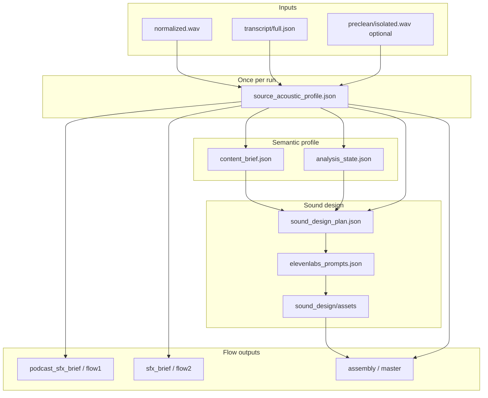

# Source-derived sonic / mix profile

**Status:** Shipped — `source_acoustic_profile` stage in `understanding.py` writes `understanding/source_acoustic_profile.json`. Defines how **acoustic and pacing signals** from each interview’s source audio and transcript become a **stable per-run profile** that guides underscore, SFX, and mix decisions for a homogeneous, speech-first episode.

**Related:** [sound-design.md](./sound-design.md) (SDP + roles), [elevenlabs-integration-guide.md](./elevenlabs-integration-guide.md) (generation + post-analysis), [analysis-memory.md](./analysis-memory.md) (semantic profile), [context-padding.md](./context-padding.md) (LLM volleys), [artifact-layout.md](./artifact-layout.md).

---

## Problem and principles

Every run is a **different** interview: speaker, room, mic, language rhythm, and emotional delivery vary. A static prompt library or fixed `tempo_feel_bpm` cannot produce a seamless podcast mix.

| Principle | Meaning |
|-----------|---------|
| **Derive once** | Compute acoustic/pacing features after ingest + transcription (and optional preclean). Reuse the same artifact for analysis LLM context, Wave 5 sound design, flow SFX briefs, and future mux duck automation. |
| **Complement speech** | Generated beds and stingers should **support** dialogue — density, ducking, and **placement on phrase boundaries** matter more than locking musical BPM to words-per-minute. |
| **Speech-first** | All generated assets share one **mix grammar** (level bands, midrange discipline, no hooks under words). See [sound-design.md § Musical structure](./sound-design.md#musical-structure-for-elevenlabs-prompts). |
| **Semantic + acoustic** | `analysis_state` / `content_brief` carry **what** the interview is about; this profile carries **how** it sounds and **how fast** it moves. Neither replaces the other. |
| **Operator override** | Verified `analysis_state.style` and `style.sound_design_notes` win over automatic suggestions. |
| **Music-heavy sources** | If the raw interview already contains score or strong bed, the profile should flag **sparse or skip** underscore — see [elevenlabs-integration-guide.md](./elevenlabs-integration-guide.md). |

### Pacing: complement vs literal BPM = WPM

Speech is **irregular** (bursts, pauses, overlap). Setting `tempo_feel_bpm` equal to a global WPM value usually **fights** the talk track.

| Approach | Use when |
|----------|----------|
| **Phrase alignment** | Place stingers and bed fades at **pause tails** and segment boundaries derived from transcript timing. |
| **Density matching** | High WPM / low pause → **sparser** beds, fewer stingers per minute, stronger duck. |
| **Optional tempo hint** | Only for montage / cold-open roles when `pace_class` is `brisk` or `dense` and policy allows `rhythmic_presence: pulse` — still avoid memorable hooks. |
| **Shared spectral baseline** | Same midrange carve and level targets for **all** generated assets (beds, stingers, accents). |

---

## Signal inventory

### 1. Transcript-timing (primary for pace and placement)

**Inputs:** `transcript/full.json` (word-level timestamps), `transcript/speakers.json` (diarization).

| Signal | Derivation | Downstream use |
|--------|------------|----------------|
| `global_wpm` | Words / spoken minutes (exclude long silence gaps) | `pace_class`, craft prose |
| `wpm_by_quartile` | Timeline split into four equal **time** windows | Narrative arc pacing; montage vs podcast density |
| `pause_p50_ms`, `pause_p90_ms` | Gaps between words above threshold | Stinger placement, bed fade length |
| `phrase_boundary_density` | Pauses per minute in speech-active regions | Max stingers per minute |
| `overlap_proxy` | Adjacent speaker labels with overlapping word times | Duck aggressiveness; avoid beds under overlap |
| `speech_active_ratio` | Speech time / total duration | Bed span vs dry speech export |

**Note:** Syllable rate improves cross-language fairness but needs a syllabifier — optional v2 field `syllables_per_second`.

### 2. Waveform / DSP (primary for energy and room)

**Inputs:** `ingest/normalized.wav`; prefer `preclean/isolated.wav` or speech stem when preclean ran and separation is trustworthy.

| Signal | Derivation | Downstream use |
|--------|------------|----------------|
| `loudness_p10_db`, `loudness_p50_db`, `loudness_p90_db` | Short-term RMS or LUFS blocks | Default `level_db` offsets vs dialogue |
| `dynamic_range_db` | p90 − p10 | Stinger peak discipline |
| `silence_ratio` | Fraction below noise gate | Whether continuous beds are safe |
| `room_timbre_hint` | Coarse band energy (low/mid/high) | Palette timbre keywords (dry vs reverberant) |
| `prosody_summary` (optional) | F0 median band, variability flag — **not** full pitch tracks in JSON | `musical_intent.register`, warm vs neutral `tonal_center` |
| `source_music_risk` | Heuristic: sustained harmonic energy under speech | Flag `underscore_policy: sparse_or_skip` |

**Tools (implementation options):** **ffmpeg**, **pyloudnorm** (pinned in [anchored-toolchain.md](./anchored-toolchain.md)); optional spike libs (openSMILE, SpeechBrain) — [tools-not-in-repo-landscape.md](../pipeline/value-analysis/tools-not-in-repo-landscape.md). Use **Context7** at lock versions when implementing.

### 3. Semantic profile (existing — merge, do not duplicate)

| Source | Role |
|--------|------|
| `understanding/analysis_state.json` | Themes, `style.tone`, `style.pacing` (LLM prose) |
| `understanding/content_brief.json` | Thesis, topics, emotional_beats |
| Operator `style.sound_design_notes` | Hard bans and density override |

The acoustic profile **informs** LLM stages (optional summary injected into volley) and **constrains** numeric mix fields. LLM themes still drive **palette keywords** and narrative fit.

---

## Target artifact

**Path:** `understanding/source_acoustic_profile.json`

**Stage key:** `source_acoustic_profile` — runs once after `transcribe` + `transcript_review_build` (and after `audio_preclean` when enabled), before `speaker_roles`; consumed by `sound_design_palettes` and `elevenlabs_prompt_craft`.

### Invalidation

Re-derive when any of these change (bump `derived_from` hashes):

- `ingest/normalized.wav`
- `preclean/isolated.wav` (if used)
- `transcript/full.json` or `transcript/corrections.json` applied to timings
- Operator clicks **Recompute acoustic profile** (future GUI)

Do **not** re-derive per ElevenLabs asset or per cue.

### Document shape (informative)

See [Appendix A](#appendix-a--example-source_acoustic_profilejson) for a full example.

| Section | Purpose |
|---------|---------|
| `derived_from` | Paths + checksums of inputs |
| `pacing` | WPM, pause stats, `pace_class` |
| `energy` | Loudness percentiles, dynamic range |
| `prosody_summary` | Optional coarse pitch/animation flags |
| `mix_contract` | Shared baseline for **all** generated assets |
| `prompt_tokens` | Short phrases for craft / negative prompts |
| `placement_hints` | Global rules (e.g. stinger after pause tail ≥ 400 ms) |
| `operator_overrides` | Editable fields merged at read time |

### `pace_class` enum

| Value | Typical signals | Suggested defaults |
|-------|-----------------|-------------------|
| `calm` | Low WPM, long pauses | `density: sparse`, no `tempo_feel_bpm` |
| `conversational` | Mid WPM | Default podcast underscore |
| `brisk` | High WPM, short pauses | Fewer beds; stingers only on long pauses |
| `dense` | High WPM + high overlap or low pause | Minimal beds; strong duck; no pulse |

### `mix_contract` (shared baseline)

One contract per run so beds, stingers, and accents feel like the same “show”:

| Field | Example intent |
|-------|----------------|
| `bed_level_db_range` | e.g. −26 to −30 under speech |
| `duck_under_speech_db` | e.g. 14–20, tighten when `pace_class` is `dense` |
| `stinger_max_per_minute` | Cap from `phrase_boundary_density` |
| `midrange_policy` | Keep stinger energy out of 1–4 kHz when overlapping speech tails |
| `rhythmic_presence_default` | `none` for Flow 1; `none` or rare `pulse` for Flow 2 montage |
| `tempo_feel_bpm` | `null` unless montage policy + `brisk`/`dense` |
| `underscore_policy` | `normal` \| `sparse` \| `skip` |

Maps conceptually to SDP `coherence.density` and per-asset `musical_intent` in [elevenlabs-prompt-craft.system.txt](../prompts/sound_design/elevenlabs-prompt-craft.system.txt).

---

## Lifecycle and data flow



**Ordering:**

1. `ingest` → `transcription` → **`source_acoustic_profile`**
2. Wave 2 LLM stages may receive a **compact prose summary** of pacing + mix_contract in the volley ([context-padding.md](./context-padding.md) — future `STAGE_PLANS` row).
3. Wave 5: `sound_design_palettes` / plan / `elevenlabs_prompt_craft` read `source_acoustic_profile` + semantic profile.
4. Post-generation QA and mux use `mix_contract` + per-cue placement hints.

---

## Consumption map

| Consumer | Reads | Effect |
|----------|-------|--------|
| `content_context` (optional) | `pace_class`, `prompt_tokens.tone` | Align brief pacing language with measured speech |
| `sound_design_palettes` | `room_timbre_hint`, `mix_contract`, semantic themes | Richer `ambient_description`; `coherence.density` |
| `sound_design_plan_flow*` | `stinger_max_per_minute`, `placement_hints` | Cue density and placement types |
| `elevenlabs_prompt_craft` | `prompt_tokens`, `musical_intent` hints, `mix_contract` | 80–220 word prompts; `tempo_feel_bpm` only when allowed |
| `podcast_sfx_brief` / `sfx_brief` (v1) | Compact summary | Until full SDP ships |
| Post-gen analysis | Theme fit + **intelligibility under measured duck** | Regen / level_db tweaks |
| `mux_flow*` (future) | `duck_under_speech_db`, pause-aligned gaps | Automated duck curves |
| GUI **Interview profile** (future) | Editable overrides | Operator tune without re-running DSP |

### Context volley slices

| Stage | Profile slice | Status |
|-------|----------------|--------|
| `content_context` | `pace_class` + one-line pacing summary | shipped (`pacing_one_liner` in `understanding.py`) |
| `sound_design_palettes` | `mix_contract` + `prompt_tokens` + `pace_class` + `room_timbre_hint` | shipped (`acoustic_profile.compact_for_volley` via `context_volley.py`) |
| `sound_design_plan_flow*` | `placement_hints` + `stinger_max_per_minute` | shipped (`compact_for_volley` in plan stage `build_input`) |
| `elevenlabs_prompt_craft` | Full profile via `build_input` (`prompt_tokens`, `mix_contract`, pacing) | shipped |
| `podcast_sfx_brief` / `sfx_brief` | `pace_class`, `underscore_policy` | shipped (`selection_flow1.run_podcast_sfx_brief`) |

Keep under ~500 tokens prose per injection — numeric fields as short bullets.

---

## Holistic integration with generated assets

All ElevenLabs outputs for a run should obey the **same** `mix_contract`:

1. **Level** — Beds and stingers generated with language that assumes the run’s `bed_level_db_range` and duck depth (craft stage).
2. **Spectrum** — Shared midrange policy; beds avoid masking 1–4 kHz ([sound-design.md](./sound-design.md)).
3. **Rhythm** — Default `rhythmic_presence: none`; pulse only when `pace_class` and flow profile allow.
4. **Placement** — Stingers aligned to **pause tails** from transcript, not arbitrary segment midpoints.
5. **Reuse** — Same `asset_id` WAV referenced by many cues still follows one profile (SDP reuse model).
6. **Master QA** — Future LUFS / true-peak checks on assembly bus ([evaluation-metrics.md](./evaluation-metrics.md), [podcast-quality-roadmap.md](./podcast-quality-roadmap.md)).

---

## Operator and safety

| Case | Behavior |
|------|----------|
| Operator edits `operator_overrides` in profile JSON | Merged at read; log in `gui_log.jsonl` |
| `style.sound_design_notes` conflicts with `mix_contract` | Operator notes win |
| `underscore_policy: skip` | Palettes may still define accents; no continuous beds |
| `source_music_risk: high` | Recommend dry mix; document in operator checklist |
| Profile missing (stage not run) | Fall back to `style.pacing` prose + sound-design defaults |

---

## Implementation notes (for future BUILD tickets)

| Piece | Suggestion |
|-------|------------|
| Stage | `src/interview_mux/stages/understanding.py` (`run_source_acoustic_profile`) — pure Python + wave/numpy; no LLM required |
| Config | `analysis.source_acoustic.enabled`, pause thresholds, WPM window seconds |
| GUI | Read-only panel + override fields; **Recompute** button |
| Schema | `docs/cross-cutting/json-schemas/source_acoustic_profile.schema.json` |
| Tests | Golden fixture from short WAV + synthetic transcript |

**Build-out:** Link from [build-out/README.md](../build-out/README.md) when ticket is added (e.g. companion to Wave 5 / BUILD-060).

---

## Appendix A — Example `source_acoustic_profile.json`

Informative only — not validated in CI until schema ships.

```json
{
  "schema_version": 1,
  "derived_from": {
    "normalized_wav": "ingest/normalized.wav",
    "normalized_wav_sha256": "abc123…",
    "transcript": "transcript/full.json",
    "transcript_sha256": "def456…",
    "preclean_isolated": null,
    "computed_at": "2026-05-26T14:30:00Z",
    "stage": "source_acoustic_profile"
  },
  "pacing": {
    "global_wpm": 142,
    "wpm_by_quartile": [118, 138, 148, 155],
    "pause_p50_ms": 520,
    "pause_p90_ms": 1100,
    "phrase_boundary_density_per_min": 8.2,
    "speech_active_ratio": 0.71,
    "pace_class": "conversational"
  },
  "energy": {
    "loudness_p10_lufs": -38.2,
    "loudness_p50_lufs": -24.1,
    "loudness_p90_lufs": -18.6,
    "dynamic_range_db": 19.6,
    "silence_ratio": 0.29,
    "room_timbre_hint": "dry_close_mic_warm_low_mid"
  },
  "prosody_summary": {
    "f0_band": "mid",
    "f0_variability": "moderate",
    "animation": "conversational_not_theatrical"
  },
  "source_music_risk": "low",
  "mix_contract": {
    "bed_level_db_range": [-30, -26],
    "duck_under_speech_db": 16,
    "stinger_max_per_minute": 2,
    "midrange_policy": "keep_stinger_energy_below_4khz_under_speech",
    "rhythmic_presence_default": "none",
    "tempo_feel_bpm": null,
    "underscore_policy": "normal"
  },
  "prompt_tokens": {
    "bed": "warm documentary room tone, loopable, no pulse, no melody hook, designed for heavy ducking under close-mic speech",
    "stinger": "single soft mid-register rise-fall under 1.8s, no percussion, decay to silence",
    "avoid": "trailer whoosh, drum loop, vocal formants, cartoon SFX",
    "density": "sparse — guest speaks quickly with short pauses; do not add rhythmic bed"
  },
  "placement_hints": {
    "stinger_min_pause_after_speech_ms": 400,
    "bed_fade_in_ms": 300,
    "bed_fade_out_ms": 500,
    "prefer_stinger_after_pause_tail": true
  },
  "operator_overrides": {}
}
```

---

## See also

- [sound-design.md](./sound-design.md) — SDP, musical_intent, post-generation
- [elevenlabs-integration-guide.md](./elevenlabs-integration-guide.md) — API, theme fit QA
- [roadmap/future-proofing.md](../roadmap/future-proofing.md) — prosody / pacing R&D
- [pipeline/understanding/README.md](../pipeline/understanding/README.md) — analysis stage outputs
