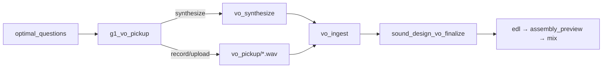
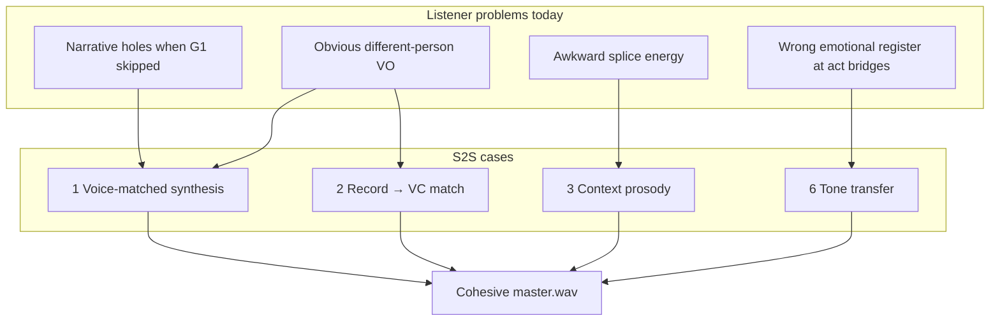

# Speech-to-speech (S2S) for gap VO

**Status:** Partial ship. **DSP timbre match** for operator-recorded gap VO is shipped (`analysis.gap_vo.timbre_match` → `vo_pickup/matched/`). Full ML voice conversion remains R&D. Complements [local-audio-stack.md](./local-audio-stack.md) (DeepFilterNet + MMAudio).

**North star:** [NORTH_STAR.md](../../NORTH_STAR.md) — one interview → listener-ready `master/master.wav`.

This document describes speech-to-speech use cases that improve **gap VO** (G1) quality and operator experience without adding mandatory gates. v2 keeps G1 optional; S2S makes filling gaps **low-friction and sonically trustworthy**.

---

## Why S2S here

The delivery chain already handles mix mechanics well: crossfades, ducking, measured VO duration (`sound_design_vo_finalize`), SDP beds/stingers (MMAudio). What it cannot fix is the perceptual failure at VO splice points:

> The host suddenly sounds like they were recorded in a different room, on a different day, with a different person.

| Modality | Input → output | In repo today |
|----------|----------------|---------------|
| STT | audio → text | Local MLX speech (`ASSETS/local_speech`) |
| TTS / clone synthesis | text + reference → new VO | Chatterbox + mlx-audio fail-open |
| **DSP timbre match** | operator take + reference → matched take | **Shipped** — `timbre_match.match_vo_take` → `vo_pickup/matched/` |
| **S2S / ML voice conversion** | audio + reference → identity-transformed audio | Not present (R&D) |
| Text-to-audio (SFX) | text → non-speech sound | MMAudio |

Pickup resolution precedence: **matched → synthesized → clean → normalized → raw**.

S2S is functionally superior to plain TTS for podcast masters because listeners judge **identity and pacing continuity**, not transcript accuracy alone.

---

## S2S vs cascaded local stack

A common local alternative is a **cascaded pipeline**:

```text
[Audio] → Silero VAD → Whisper-MLX (STT) → Llama-3-8B-Instruct-Q4 (LLM) → Kokoro-82M (TTS)
```

That architecture is appropriate for **open-ended speech assistants** (listen → understand → respond → speak). For **gap VO in interview_helper_mux**, most of the cascade is redundant or actively harmful. The repo already owns the upstream steps with stronger, operator-verified artifacts.

### What this app already has (making cascade hops unnecessary)

| Cascade stage | Repo equivalent | Implication for gap VO |
|---------------|-----------------|------------------------|
| Silero VAD | Segment boundaries + `targets_segment_id` in `gap_report` | Boundaries are known; no VAD on pickup needed for synthesis |
| Whisper-MLX STT | Local STT + **G0 transcript review** | Word truth is fixed before analysis; re-STT adds error surface |
| Llama-3-8B LLM | Cloud `optimal_questions` / `missing_framing` (flagship LLM) | Gap **text** already in `gap_report.json` — local LLM would rewrite authoritative copy |
| Kokoro-82M TTS | *(not shipped)* | Only the last hop is needed for audio — and it is the weakest link for **host matching** |

**Correct minimal cascade for case 1 in this repo:** `gap_report.text` + `speaker_samples` → **reference-conditioned TTS or S2S** → `vo_pickup/{line_id}.wav`. STT and LLM hops should not sit on the synthesis path.

### Benefits S2S has over the full cascade (cases 1, 2, 3, 6)

| Benefit | S2S / reference-conditioned audio | Full Audio→VAD→STT→LLM→Kokoro cascade |
|---------|-----------------------------------|----------------------------------------|
| **Host identity (case 1)** | Conditions on `speaker_samples/{id}.wav` — timbre from *this* interview | Kokoro-82M is a small general TTS; no zero-shot clone from 3–15 s host reference → obvious “different person” |
| **Operator performance preserved (case 2)** | Voice conversion: same waveform timing, emphasis, breaths; only timbre changes | Must STT the rough take (word errors on names) → LLM may paraphrase → Kokoro re-times delivery — **case 2 is effectively unsupported** |
| **Prosody at splice (case 3)** | Can ingest **waveform context** from adjacent segment (energy, rate, pauses) | Kokoro gets text + maybe a speed token; cannot “hear” how the guest ended the prior clip |
| **Tone in performance (case 6)** | Style/emotion transfer on audio (analytical vs consumer **delivery**) | Llama can rewrite text tone; Kokoro has limited prosodic/style control — tone stays “TTS default” |
| **Error accumulation** | One generative step (or TTS→VC hybrid) | Each hop adds failure: STT mishears proper noun → LLM “fixes” meaning → TTS mispronounces again |
| **Latency / cost per line** | One local inference pass | Four model loads + four passes per gap line |
| **Source of truth** | `gap_report.text` after G0 + flagship gap LLM | Local Llama second-guesses text the operator may have already edited in Conversation Studio |
| **Duration contract** | Output length follows performance or model duration control; `sound_design_vo_finalize` measures ms | Kokoro duration decoupled from neighbor clip — splice mismatch persists |

### Where the cascade *does* help (and where it still falls short)

| Use | Cascade fit | Gap VO fit |
|-----|-------------|------------|
| Transcribe unknown audio | Whisper-MLX ✓ | **Not this problem** — transcript exists |
| Draft new gap copy from scratch | Llama ✓ | **Already done** by `optimal_questions` with full run context |
| Cheap local TTS from fixed text | Kokoro ✓ | Case 1 **only if** Kokoro supports reference voice cloning — stock Kokoro does not |
| Verify operator read the script | Whisper on `vo_pickup` upload | Useful **QA**, not synthesis — compare to `gap_report.text`, fail-open |

### Hybrid that captures cascade strengths without full cascade

For case 1, a practical local path that avoids redundant hops:

```text
gap_report.text + speaker_samples + context_clip → S2S (or ref-TTS) → vo_pickup/*.wav
```

For case 2:

```text
operator recording → (optional Whisper QA vs script) → S2S voice conversion → vo_pickup/matched/*.wav
```

For case 6, prefer **audio-level tone conditioning** (S2S) over **text rewrite** (Llama) so words stay locked to `gap_report` while delivery changes.

Optional **Kokoro as draft + VC refine:** Kokoro generates timing-agnostic speech → S2S VC to `speaker_samples` reference. Still two steps, but VC fixes identity Kokoro cannot. Pure Kokoro alone does not close the north-star “same host” gap.

### Decision summary

| Priority | Prefer |
|----------|--------|
| Listener trust at VO splices | S2S or ref-conditioned audio — not generic Kokoro |
| Case 2 (rough record → match host) | S2S VC only — cascade cannot preserve performance |
| Case 3 (join prosody) | S2S with context audio — not text-only TTS |
| Case 6 (tone) | S2S style transfer on fixed text — not Llama rewrite + Kokoro |
| Local MLX budget | Skip re-running STT/LLM; reuse `gap_report` + AWS/G0 transcript spine |
| Operator text authority | Never route synthesis through local Llama when `gap_report` is canonical |

---

## Existing hooks (no new product concepts)

The pipeline already produces everything S2S needs:

| Artifact / module | Role for S2S |
|-------------------|--------------|
| `understanding/gap_report.json` | Lines with `text`, `placement`, `delivery`, `voice_speaker_id`, `suggested_tone`, `act_context` — [gap_report.schema.json](./json-schemas/gap_report.schema.json) |
| `understanding/speaker_samples/{speaker_id}.wav` | Reference timbre per speaker — `ensure_speaker_sample_clips()` in `source_topology.py` |
| `flow_adaptation.pickup_eligible_speaker_id` | Only least-spoken speaker may receive new VO (TBIY invariant) |
| `ingest/normalized.wav` + segment timestamps | Context audio around `targets_segment_id` for prosody matching |
| `vo_pickup/{line_id}.wav` | Canonical pickup output consumed by `vo_ingest` → `edl` → `mix` |
| `VoPickupPanel` | G1 record/upload/skip — [operator-gates.md](../workflows/operator-gates.md) |
| DeepFilterNet preclean (`scope: vo_pickup`) | Noise only — not timbre/room match |

Today `delivery: synthesize` exists in the gap schema but is **downgraded to `record`** at persist time (`gaps.py` → `persist_optimal_questions_companion_artifacts`). Shipping S2S re-enables that path as an **optional operator offer** (never auto-run — same rule as preclean).

---

## Four use cases

### 1 — Voice-matched gap VO synthesis

**Capability:** Generate gap lines in the pickup-eligible host’s voice from `gap_report` text, using `speaker_samples/{voice_speaker_id}.wav` as reference.

**Quality improvement**

- Fills narrative holes when operator would otherwise **Skip G1**, without obvious “narrator insert” TTS.
- VO bridges sound like the **same host** from the interview — the main listener trust signal for mixed speech + VO masters.
- Supports north star: *ordered speech, VO bridges where needed* — “where needed” without sacrificing cohesion.

**App improvement**

- Third G1 path beside Record and Skip: **Synthesize** (review/approve generated WAVs).
- Faster, predictable path to `assembly_preview` and `master.wav`.
- Aligns with schema intent (`delivery: synthesize`) already designed into gap analysis.

**Pipeline placement**



**Operator model:** Optional offer at G1 — “Generate gap VO in host voice?” Dismissible; skip-all still available (`POST …/g1/skip-optional`).

---

### 2 — Voice conversion on operator recordings

**Capability:** Operator records a rough take → S2S voice conversion maps performance to the reference host while preserving timing, emphasis, and breaths.

**Quality improvement**

- Fixes the #1 amateur edit tell: **different mic / room / timbre** next to studio interview speech.
- Preclean (DeepFilterNet) removes noise; **VC removes identity mismatch**. Loudness normalization (`vo_ingest`) does not substitute for same-person matching.
- Keeps human delivery intent — superior to full synthesis when the operator has a strong read but bad capture chain (browser mic, home office).

**App improvement**

- Lowers skill barrier: “Record rough; we match your voice to the host.”
- Optional quality offer after upload (same consent pattern as pickup preclean).
- Higher G1 completion rate without new mandatory gates.

**Artifact precedence (shipped):** `vo_pickup/matched/` → `vo_pickup/synthesized/` → `vo_pickup/clean/` → `vo_pickup/normalized/` → raw — `resolve_vo_pickup_path()` in assembly.

**Complementarity with case 1**

| Scenario | Path |
|----------|------|
| Speed / no mic | Case 1: synthesize |
| Strong read, bad mic | Case 2: record → VC |
| Already matched studio | Raw recording |

---

### 3 — Context-aware bridge generation (prosody at join points)

**Capability:** Condition synthesis or VC on **adjacent speech** from `ingest/normalized.wav` around `targets_segment_id` (before/after per `placement`), in addition to speaker reference.

**Quality improvement**

- VO bridges fail at the **splice**, not mid-line. Short crossfades (80–100 ms speech joins) hide level gaps but **expose** prosody mismatches (guest trails off; bridge starts in promo voice; speech resumes conversational).
- Bridge inherits local energy, speaking rate, and pause behavior — joins feel **edited in**, not **laid on**.
- Fewer “fix it in the mix” failures; tighter natural pre/post roll from `sound_design_vo_finalize`.

**App improvement**

- `assembly_preview` becomes validation, not surprise — fewer re-records after listening.
- Less Timeline trim fiddling to hide bad joins.
- Protects operator trust in the delivery chain: if preview sounds right, mix/master likely ship clean.

**Inputs (proposed per line)**

| Input | Source |
|-------|--------|
| Reference timbre | `understanding/speaker_samples/{voice_speaker_id}.wav` |
| Context window (2–8 s) | Clip from `ingest/normalized.wav` at segment boundary |
| Pace hint | `source_acoustic_profile` / SAP `pace_class` |
| Placement | `gap_report` `before` \| `after` |

Store `synthesis_context_ms` in VO line metadata for audit (`vo_pickup_trim` / `vo_metadata`).

---

### 6 — Tone transfer via `suggested_tone`

**Capability:** Render the same gap line text with delivery register matching `suggested_tone`: `analytical` \| `consumer` \| `neutral`, optionally weighted by `act_context` (1–5).

**Quality improvement**

- Gap metadata today shapes **LLM text only**; audio delivery is unconstrained. Wrong tone at act transitions sounds like a producer note, not story (especially TBIY-style frame/reactor bridges — [tbiy-production-profile.md](./tbiy-production-profile.md)).
- Beds/stingers set mood **under** speech; tone-correct VO **carries** narrative between clips.
- Master sounds **directed**, not assembled.

**App improvement**

- Operators are not voice actors. Tone transfer externalizes performance direction already in `gap_report`.
- Per-line or batch: approve, re-generate with different tone, or fall back to record — no re-performance required.
- GUI can expose tone as a review dimension alongside text (Conversation Studio / G1 panel).

**Tone intent**

| `suggested_tone` | Listener should feel |
|------------------|----------------------|
| `analytical` | Host synthesizing, connecting dots |
| `consumer` | Host translating for the audience |
| `neutral` | Light connective tissue, not editorializing |

Cases 1 and 2 set **who** speaks; case 3 sets **how the cut feels**; case 6 sets **why the line lands**.

---

## Combined impact



| Dimension | Without S2S | With cases 1, 2, 3, 6 |
|-----------|-------------|------------------------|
| Narrative completeness | Skip → holes | Synthesis lowers cost to fill |
| Sonic continuity | VO lottery | Host identity preserved |
| Pacing at cuts | Crossfade band-aids | Prosody matched to neighbors |
| Story direction | Tone in text only | Tone in performance |
| Operator friction | Record well or skip | Synthesize / record rough / approve |
| Preview → ship trust | Problems surface late | Preview confirms cohesion |

---

## What S2S must not replace

| Do not use S2S for | Reason |
|--------------------|--------|
| MMAudio SFX | Different modality — beds/stingers stay text-to-audio |
| AWS STT / G0 transcript | Word truth is mandatory; S2S does not fix STT |
| New guest speech | Topology: only pickup-eligible speaker gets new VO |
| Auto-run without consent | Same as preclean — offer only |
| Critical/legal-sensitive lines (default) | Human record or explicit operator approve on synthetics |

---

## Proposed implementation (local stack)

Follow isolated-runtime pattern from [local-audio-stack.md](./local-audio-stack.md):

| Piece | Location / pattern |
|-------|-------------------|
| Venv | `ASSETS/local_speech/venv` |
| Verify | `scripts/verify_local_models.sh` gate + `install.json` |
| CLI | `tools/s2s_generate.py` — `--text`, `--reference`, `--context`, `--tone`, `--out` |
| Runner | `src/interview_mux/s2s_runner.py` (subprocess via `local_runtime.py`) |
| Stage | `vo_synthesize` on-demand at G1 or in delivery order after gap lines finalized |
| QA sidecar | `vo_pickup/s2s_qa.json` (model id, reference speaker, duration, tone) — mirror `mmaudio_qa.json` |
| Config | `s2s.enabled`, `s2s.model`, `s2s.min_reference_sec`, `s2s.fail_open` (default **true**) — document in [config-keys.md](./config-keys.md) when shipped |

**Output contract:** 48 kHz mono WAV → `vo_pickup/{line_id}.wav` (same as human record) so `vo_ingest`, `sound_design_vo_finalize`, `edl`, and `mix` stay unchanged.

**Fail-open (v2):** Missing model or generation error → log via `ctx.log()`, skip line, do not block `master_finalize`. Operator may still record or skip G1.

**Toolchain:** New deps follow [anchored-toolchain.md](./anchored-toolchain.md) — pin in `requirements.lock`, `pip-audit`, Context7 at implementation time. Prefer batch/offline models with short-reference (3–15 s) support on Apple Silicon where applicable — see [arm64_vs_x64.md](../arm64_vs_x64.md) for native runtime discipline.

---

## Suggested rollout order

1. **Case 1** — voice-matched synthesis; re-enable `delivery: synthesize` as optional path.
2. **Case 2** — VC on operator uploads; artifact precedence `matched/`.
3. **Cases 3 + 6** — shared `s2s_generate` inputs (context clip + tone tokens).
4. Proxy synthetics for assembly preview (listen before commit) — optional follow-on.

---

## Evaluation (when shipped)

Extend [evaluation-metrics.md](./evaluation-metrics.md) gap/segment and listen QA:

| Signal | Method |
|--------|--------|
| VO continuity | Blind A/B: raw record vs VC vs synthesize at bridge splices |
| Narrative completeness | `gap_report` record lines satisfied vs skipped_optional |
| Splice quality | Operator re-record rate after `assembly_preview` |
| Master pass | Existing `verify_master.py` (−16 LUFS, true peak) — unchanged |
| Mispronunciation | Manual G0 term spot-check on synthesized lines (names, acronyms) |

Future-proofing row: [future-proofing.md](../roadmap/future-proofing.md).

---

## Related

- [operator-gates.md](../workflows/operator-gates.md) — G1 optional
- [pipeline/interviewer-gap/README.md](../pipeline/interviewer-gap/README.md) — gap stages
- [pipeline/audio_preclean/README.md](../pipeline/audio_preclean/README.md) — pickup noise (complements, does not replace VC)
- [sound-design.md](./sound-design.md) — VO bridge cues and mix order
- [post-generation-placement.md](./post-generation-placement.md) — crossfade defaults at speech joins
- [tbiy-production-profile.md](./tbiy-production-profile.md) — pickup voice invariant, act bridges
