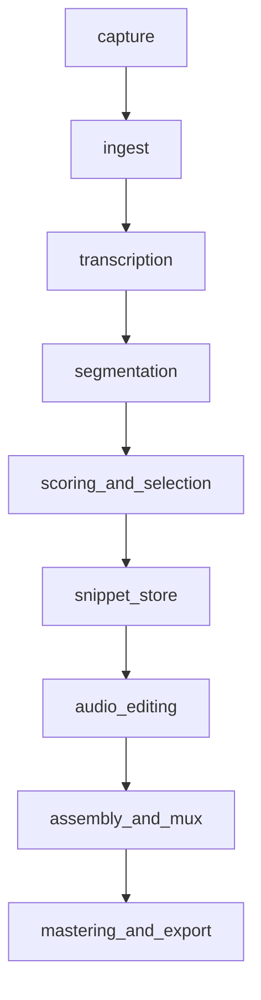

# Orchestration and component library review

This file is the **control tower**: for each end-to-end **orchestration** (archetype A–J), it names the **minimum** docs/components that must exist, what you **deliberately skip**, what **breaks in practice**, and whether the **current library** is enough or needs a **targeted extension** (not random new files).

Read [complexity-ladder-end-to-end-ideas.md](complexity-ladder-end-to-end-ideas.md) for the one-line pitch of A–K; read here for **conformance and challenge**.

## Canonical run order (all orchestrations)

This is the **backbone DAG** every preset still sits on; loops are optional overlays ([../workflows/feedback-loops-and-reruns.md](../workflows/feedback-loops-and-reruns.md)).

Optional **difficulty escalations** (archetypes **I–J**) attach **after ingest**, in parallel to the backbone, and only write annotations consumed by `score` / `mux`—see [spectrogram-yolo-wav2vec-orchestration.md](spectrogram-yolo-wav2vec-orchestration.md).

**Human review** is not a separate physics stage; it is a **control plane** that can fire after `score`, after `mux`, or on gates ([high-risk-first-use-gating.md](high-risk-first-use-gating.md)) without duplicating pipeline folders.

## Library governance (when to add a component)

Add a **new pipeline leaf** only if **all** are true:

1. A **distinct engineering contract** (inputs/outputs, failure modes) not covered by an existing leaf.
2. At least **two orchestrations** or **two stages** would link to it routinely.
3. Merging into an existing doc would **blur** ownership (e.g. EDL syntax vs search algorithm—kept split: [../pipeline/assembly-and-mux/timeline-and-edl.md](../pipeline/assembly-and-mux/timeline-and-edl.md) vs [../pipeline/assembly-and-mux/edge-cost-bridging-and-order-search.md](../pipeline/assembly-and-mux/edge-cost-bridging-and-order-search.md)).

Otherwise: **extend the existing leaf** with a short subsection + link.

## Per-archetype conformance

Legend: **Min** = minimum library path; **Skip** = do not pay complexity tax; **Stress** = what falsifies a naive implementation; **Library** = sufficient as-is / one gap.

### A — Highlight reel

| | |
|--|--|
| **Min** | [capture](../pipeline/capture/README.md) → [ingest](../pipeline/ingest/README.md) → [transcription](../pipeline/transcription/README.md) → [segmentation/silence](../pipeline/segmentation/silence-and-pause-splits.md) → [scoring/heuristics](../pipeline/scoring-and-selection/salience-heuristics.md) → [snippet store](../pipeline/snippet-store/README.md) → [audio cuts](../pipeline/audio-editing/cut-boundaries-samples.md) + [crossfades](../pipeline/audio-editing/crossfades-room-tone.md) → [timeline EDL](../pipeline/assembly-and-mux/timeline-and-edl.md) → [mastering](../pipeline/mastering-and-export/README.md) |
| **Skip** | Dynamic graph, S2S, diarization, custom training, parallel segmenters |
| **Stress** | “Top-N by score” often picks **near-duplicate** moments; boring reel. Heuristics alone miss narrative. |
| **Library** | **Sufficient** if you add **diversity** or a single LLM rank pass when quality plateaus ([../pipeline/scoring-and-selection/diversity-constraints.md](../pipeline/scoring-and-selection/diversity-constraints.md), [../pipeline/scoring-and-selection/llm-assisted-ranking.md](../pipeline/scoring-and-selection/llm-assisted-ranking.md))—no new component type required. |

### B — Chapter podcast

| | |
|--|--|
| **Min** | A’s chain + [chapters export](../pipeline/mastering-and-export/chapters-metadata-export.md); chapter text from **LLM headings** or fixed template |
| **Skip** | Nonlinear graph unless you later promote to D |
| **Stress** | Chapter titles that **lie** about content if STT dropped words; boundaries misaligned with ear. |
| **Library** | **Sufficient**; orchestration burden is **prompt + validation** ([automation-and-prompt-orchestration.md](automation-and-prompt-orchestration.md)), not new folders. |

### C — Director’s cut (timeboxed)

| | |
|--|--|
| **Min** | A/B + explicit **duration budget** in orchestrator config; [diversity](../pipeline/scoring-and-selection/diversity-constraints.md); optional [LLM rank](../pipeline/scoring-and-selection/llm-assisted-ranking.md); [dynamic assembly](../pipeline/assembly-and-mux/dynamic-assembly-graph.md) only as far as “insert bridges” |
| **Skip** | Full graph drama editor until you need D |
| **Stress** | Knapsack-style **NP-ish** selection: best subset under length + diversity + `force_include` ([../pipeline/human-review-ui/force-include-exclude.md](../pipeline/human-review-ui/force-include-exclude.md)). |
| **Library** | **Mostly sufficient**; if you implement a solver, document it beside **scoring** or **mux**, not scattered—**one** “budgeted selection” subsection in [llm-assisted-ranking.md](../pipeline/scoring-and-selection/llm-assisted-ranking.md) or mux graph doc is enough before inventing `budget-solver.md`. |

### D — Nonlinear story

| | |
|--|--|
| **Min** | [Dynamic assembly graph](../pipeline/assembly-and-mux/dynamic-assembly-graph.md) + [timeline EDL](../pipeline/assembly-and-mux/timeline-and-edl.md) + [difficult combinations](difficult-segment-combinations.md) + [edge cost / order search](../pipeline/assembly-and-mux/edge-cost-bridging-and-order-search.md) |
| **Skip** | S2S unless you need VO glue |
| **Stress** | Listener confusion on **non-monotonic** time; **callback** without setup; contradiction pairs. |
| **Library** | **Was partially gap** before `edge-cost-bridging-and-order-search.md`; with that leaf, **graph + edges** are covered. Narrative **contradiction detection** still lives in **scoring policy**—if you codify it, extend [llm-assisted-ranking.md](../pipeline/scoring-and-selection/llm-assisted-ranking.md) or heuristics with a “mutual exclusion” convention in [segment-schema](../cross-cutting/segment-schema.md), not a new top-level stage. |

### E — Bilingual / code-switch

| | |
|--|--|
| **Min** | [STT adapters](../pipeline/transcription/stt-provider-adapters.md) + multilingual model **or** per-span locale + [chunking](../pipeline/ingest/chunking-long-interviews.md) + [word timestamps](../pipeline/transcription/word-level-timestamps.md); segmentation must not split mid-span ([segmentation README](../pipeline/segmentation/README.md)) |
| **Skip** | S2S per locale until quality demands it ([speech-to-speech-and-trained-remix-models.md](speech-to-speech-and-trained-remix-models.md)) |
| **Stress** | Wrong language id **corrupts** entire paragraph; code-switch **inside** one semantic segment. |
| **Library** | **Sufficient** without a new “multilingual.md” if **transcription** + **ingest** docs hold locale strategy; add a leaf only when you document **three+ concrete provider behaviors**. |

### F — Room and breath polish

| | |
|--|--|
| **Min** | [Crossfades / room tone](../pipeline/audio-editing/crossfades-room-tone.md) + [loudness working](../pipeline/audio-editing/loudness-targets-lufs.md) + optional separation/denoise adapters (treat as **high-risk** tools → [high-risk-first-use-gating.md](high-risk-first-use-gating.md)) |
| **Skip** | Custom acoustic training until F is stable with stock DSP |
| **Stress** | **Neighboring processed vs raw** timbre jump ([difficult combinations](difficult-segment-combinations.md)); music bed masks errors until mastering exposes them. |
| **Library** | **Sufficient** at doc level; implementation is adapter sprawl—register each DSP/separation binary as **high-risk tool** entries, not new pipeline stages. |

### G — S2S “same words, cleaner performance”

| | |
|--|--|
| **Min** | [S2S trained remix](speech-to-speech-and-trained-remix-models.md) + [provenance](../pipeline/snippet-store/provenance-retranscribe.md) + [gating](high-risk-first-use-gating.md) + [mux edges](../pipeline/assembly-and-mux/edge-cost-bridging-and-order-search.md) |
| **Skip** | Custom training day one—ship off-the-shelf S2S/VC first |
| **Stress** | **Hallucinated** words; duration drift; **timbre seam** vs unprocessed neighbors. |
| **Library** | **Sufficient** for architecture; **quality** is model-choice, not more markdown. |

### H — Custom ranker + custom acoustic

| | |
|--|--|
| **Min** | Everything in G + labeled preference data + [evaluation](../cross-cutting/evaluation-metrics.md) + [idempotency](../workflows/idempotent-runs.md) for model versions |
| **Skip** | Nothing is truly skippable if you claim “custom”; shrink scope to **either** ranker **or** acoustic first |
| **Stress** | Overfitting to “interesting” → **wrong** factual clips rise; training data **leaks** future episodes into past picks if IDs sloppy. |
| **Library** | **Sufficient** if every trained artifact declares **version + hash** in store ([segment-schema](../cross-cutting/segment-schema.md)); avoid `training/` tree in docs until you have code—keep notes in [speech-to-speech](speech-to-speech-and-trained-remix-models.md) and evaluation metrics. |

### I — Spectrogram hazard overlay (YOLO11)

| | |
|--|--|
| **Min** | [ingest](../pipeline/ingest/README.md) + fixed mel/STFT front-end contract + [spectrogram-yolo-wav2vec-orchestration.md](spectrogram-yolo-wav2vec-orchestration.md) + outputs merged into segment manifest / edge annotations; consumes [difficult combinations](difficult-segment-combinations.md) taxonomy where relevant |
| **Skip** | Running full-file inference when edge-cost search already low—**windowed** escalation only |
| **Stress** | False positives **block** good edits; domain shift on new devices; time↔freq box alignment to sample-accurate EDL ([../pipeline/assembly-and-mux/edge-cost-bridging-and-order-search.md](../pipeline/assembly-and-mux/edge-cost-bridging-and-order-search.md)). |
| **Library** | **Added** orchestration note + dedicated doc; implementation is **gated tool** `spectrogram_yolo11` (custom weights = high-risk). |

### J — Wav2Vec-assisted rank & continuity

| | |
|--|--|
| **Min** | [ingest](../pipeline/ingest/README.md) + chunk policy + [spectrogram-yolo-wav2vec-orchestration.md](spectrogram-yolo-wav2vec-orchestration.md) + vectors attached to segments for scoring / mux continuity; pairs naturally with **D**, **E**, **C** knapsack when **dedup** or **reorder** stress appears |
| **Skip** | Using embeddings as sole **fact** arbiter—acoustic similarity must not replace transcript policy for contradictions ([difficult-segment-combinations.md](difficult-segment-combinations.md)) |
| **Stress** | “Sounds the same” picks **wrong** story; cluster drift across model versions; extra GPU RAM in parallel with STT. |
| **Library** | **Same** dedicated doc; **gated tool** `wav2vec_embed` (checkpoint change = version bump + [evaluation](../cross-cutting/evaluation-metrics.md) spot-check). |

### K — Full localized dub (translate + voice clone → new language master)

| | |
|--|--|
| **Min** | [full-localized-dub-orchestration.md](full-localized-dub-orchestration.md): [ingest](../pipeline/ingest/README.md) → **source-language** [STT](../pipeline/transcription/README.md) + [word timestamps](../pipeline/transcription/word-level-timestamps.md) → [segmentation](../pipeline/segmentation/README.md) → [scoring / selection](../pipeline/scoring-and-selection/README.md) → **MT + checker + glossary** (orchestrated tools) → **TTS / voice clone** (high-risk, e.g. ElevenLabs) → [snippet store](../pipeline/snippet-store/README.md) + [provenance](../pipeline/snippet-store/provenance-retranscribe.md) → [audio editing](../pipeline/audio-editing/README.md) → [mux / EDL](../pipeline/assembly-and-mux/timeline-and-edl.md) → [mastering](../pipeline/mastering-and-export/README.md); [gating](high-risk-first-use-gating.md) on first synthetic profile and on publish |
| **Skip** | Nothing “easy” if you claim a **full** dub; you may **skip** I–J unless mixing retained atmos |
| **Stress** | MT **hallucination** or **entity** corruption; **duration** mismatch vs original pacing; **legal** / consent on cloned voices; **code-switch** in source ([§ E](#e--bilingual--code-switch)) interacting with wrong target script |
| **Library** | **Idea doc added**; implement MT/TTS as **versioned adapters** + manifest fields—avoid a `translation/` tree until multiple providers force a shared contract ([library governance](#library-governance-when-to-add-a-component)) |

## Implemented Python hooks (integrations)

Shared loader: **`ai/python/mux_secrets/`** — Parses **non-committed** `config/secrets/openai.env` (if present), then `config/secrets/secrets.env` (template: `config/templates/secrets.env.example`); duplicate keys use **`secrets.env`**. Values are **not** written to the process environment. See repository `config/README.md`.

| Module | Role |
|--------|------|
| **`openai_mux`** | OpenAI client + `rank_segments_by_rubric` ([LLM-assisted ranking](../pipeline/scoring-and-selection/llm-assisted-ranking.md)). |
| **`aws_mux`** | `boto3.Session` built from `AWS_PROFILE` or `AWS_ACCESS_KEY_ID` / `AWS_SECRET_ACCESS_KEY` plus `AWS_DEFAULT_REGION` (or `AWS_REGION`) in the same secrets file only. |
| **`elevenlabs_mux`** | ElevenLabs SDK client for TTS / voice workflows ([speech-to-speech-and-trained-remix-models.md](speech-to-speech-and-trained-remix-models.md), [full-localized-dub-orchestration.md](full-localized-dub-orchestration.md)). |

**Smoke tools:** `tools/openai_smoke.py`, `tools/aws_smoke.py`, `tools/elevenlabs_smoke.py`.

## Reassessment summary

| Orchestration | Library action taken |
|---------------|----------------------|
| A | No new files; use diversity/LLM rank when heuristics plateau |
| B | No new files; strengthen prompts + validation |
| C | No new files yet; optional future **single** budget-solver doc if code lands |
| D | **Added** [edge-cost-bridging-and-order-search.md](../pipeline/assembly-and-mux/edge-cost-bridging-and-order-search.md)—fills real mux gap |
| E | Stay in transcription/ingest; split out only after multiple providers force it |
| F | Treat heavy DSP as **gated tools**, not new stages |
| G–H | Discipline + metrics, not more folders |
| I–J | **Added** [spectrogram-yolo-wav2vec-orchestration.md](spectrogram-yolo-wav2vec-orchestration.md)—optional parallel enrichments; register as gated tools, not new backbone stages |
| K | **Added** [full-localized-dub-orchestration.md](full-localized-dub-orchestration.md)—synthetic speech + translation stack; adapters + gates, not new backbone stages until provider sprawl forces it |

## Open decisions

- Whether **C** gets a dedicated `budgeted-selection.md` once the solver code exists.

## Links

- [automation-and-prompt-orchestration.md](automation-and-prompt-orchestration.md)
- [complexity-ladder-end-to-end-ideas.md](complexity-ladder-end-to-end-ideas.md)
- [spectrogram-yolo-wav2vec-orchestration.md](spectrogram-yolo-wav2vec-orchestration.md)
- [../INDEX.md](../INDEX.md)
