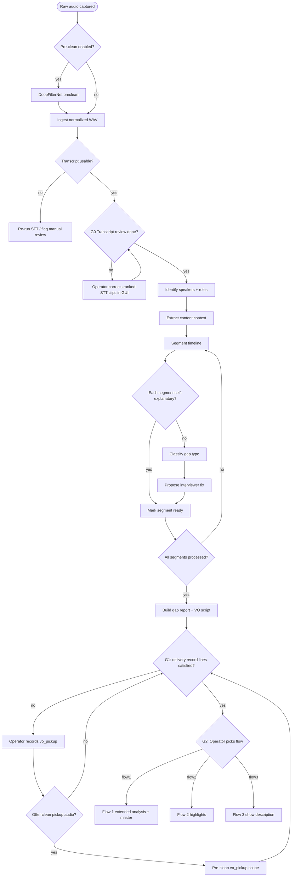
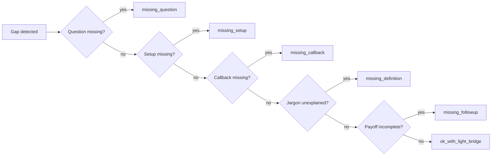
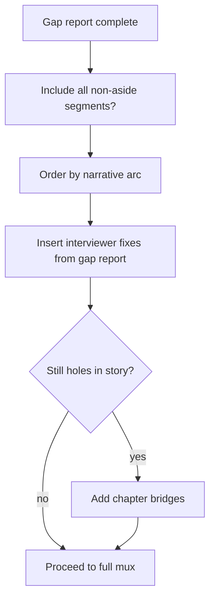
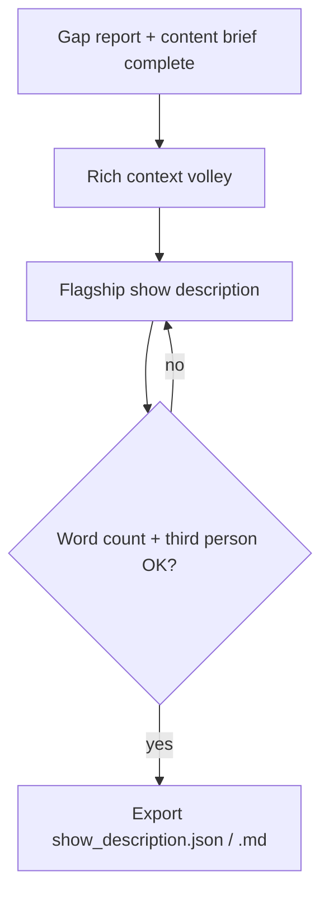
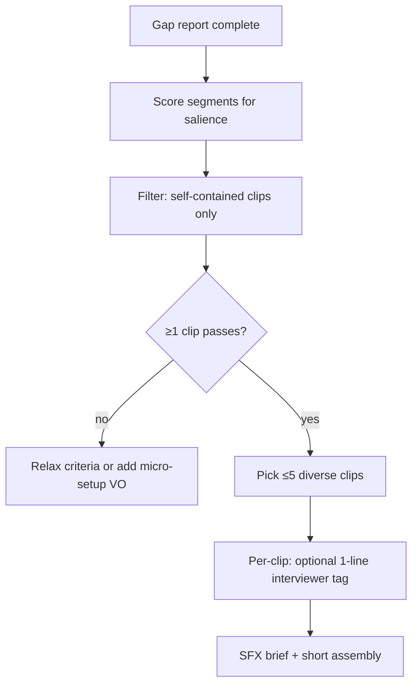
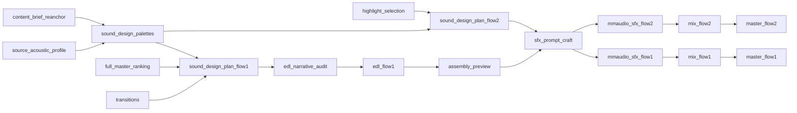

# Logic tree — content understanding and interviewer gaps

Decision logic the pipeline uses **before and during** assembly. Primary job: understand **what was said**, **who said it**, **how it segments**, and **what additional interviewer audio or text** is required so the final master tells a complete, compelling story.

This tree is the spec for automated decisions; prompts in [prompts/](./prompts/) implement each node.

**Per-interview memory:** Rolling state in `understanding/analysis_state.json` is padded into every LLM stage and updated via the [analysis envelope](./cross-cutting/json-schemas/analysis_envelope.schema.json). Stage artifacts (`content_brief.json`, `speakers.json`, segment manifest, flow JSON) are generated by **OpenAI flagship** calls with **gap-fill** (patch missing fields only), validated on write — [artifact-generation-and-validation.md](./cross-cutting/artifact-generation-and-validation.md). Operators edit themes, major questions, and style in the GUI or JSON — see [analysis-memory.md](./cross-cutting/analysis-memory.md) and [analysis-orchestration-loop.md](./workflows/analysis-orchestration-loop.md).

---

## Top-level decision flow



See [workflows/operator-gates.md](./workflows/operator-gates.md) for G1 and G2.

---

## Node reference

### 0. Audio pre-clean (optional quality offer)

Not a blocking gate. The operator may be **offered** background noise removal at several points — not only before ingest.

| Moment | Scope | Action |
|--------|-------|--------|
| Before ingest | `full_source` | `preclean/isolated.wav` → ingest |
| After G0 if STT struggled | `full_source` | Re-run from `audio_preclean` |
| After G1 pickup recordings | `vo_pickup` only | Clean new interviewer lines; original interview unchanged |
| Before final mix | `full_source` or `normalized_rebuild` | Re-ingest or rebuild normalized from cleaner source |

| Check | Action |
|-------|--------|
| Operator accepts offer with `enabled: true` | Run isolation per `scope` in `run_meta.json` |
| Operator dismisses | Continue with current audio lineage |

See [audio_preclean/README.md](./pipeline/audio_preclean/README.md) and [operator-gates.md](./workflows/operator-gates.md#quality-improvement-offers-not-gates).

---

### 1. Transcript usable?

| Check | Pass | Fail action |
|-------|------|-------------|
| Word error rate heuristic acceptable | Continue | Re-transcribe or human QC |
| Speaker labels present | Continue | Run diarization |
| Timestamps monotonic | Continue | Fix alignment |
| G0 transcript review signed off | Continue | GUI: ranked clips + synced dock word editor + fuzzy similar-word replace |

AWS per-word `confidence` drives review queue ordering; see [transcript-review.md](./pipeline/transcription/transcript-review.md).

---

### 2. Identify speakers and roles

Map diarization labels to **roles**, not just `SPEAKER_00`.

| Signal | Inference |
|--------|-----------|
| More questions, shorter turns | Likely **interviewer** |
| Longer explanatory answers | Likely **interviewee** |
| Intro/outro patterns (“thanks for joining”) | Interviewer |
| First-person product/company story | Interviewee |

**Output:** `speakers.json` — `{ id, role, display_name? }`, where `role` is one of `interviewer`, `interviewee`, or `unknown`.

**Decision:** If roles ambiguous → prompt [speaker-roles](./prompts/understanding/speaker-roles.system.txt) on transcript sample; prefer interviewer = question-asker.

---

### 3. Extract content context

Build a **content brief** the rest of the tree consumes.

| Field | Description |
|-------|-------------|
| `thesis` | One-sentence takeaway of the interview |
| `topics` | Ordered list of themes discussed |
| `key_claims` | Factual or opinion claims worth preserving |
| `emotional_beats` | Tension, humor, vulnerability, triumph |
| `audience` | Who should care (investors, customers, general) |
| `jargon_glossary` | Terms that may need interviewer setup |

**Prompt:** [content-context](./prompts/understanding/content-context.system.txt)

---

### 4. Segment timeline

Split the transcript into **segments** — contiguous time ranges with a single communicative intent.

| Segment type | Typical speaker | Notes |
|--------------|-----------------|-------|
| `interviewer_question` | Interviewer | Explicit or implied question |
| `interviewee_answer` | Interviewee | Main response block |
| `interviewer_reaction` | Interviewer | Short backchannel (“right”, “interesting”) |
| `aside` | Either | Off-topic; often trimmed in Flow 1, rarely in Flow 2 |
| `setup` | Interviewer | Context before a topic |
| `coda` | Either | Wrap-up |

**Rules:**

- Prefer splits at **pauses ≥ ~700ms** and **topic shifts**.
- Do not split mid-sentence unless STT error recovery.
- Each segment gets: `start_ms`, `end_ms`, `type`, `speaker_id`, `text`, `topic_tags[]`.

**Prompt:** [boundary-detection](./prompts/segmentation/boundary-detection.system.txt), [segment-classification](./prompts/segmentation/segment-classification.system.txt)

---

### 3b. Re-anchor content brief

After segments exist, patch the content brief with timeline anchors and cross-topic structure.

| Field | Description |
|-------|-------------|
| `topics[].segment_ids` | Ground each theme to manifest segments |
| `key_claims[].segment_ids` / `evidence_segment_ids` | Anchor claims with typed structure |
| `topic_relationships[]` | Links between themes (`supports`, `prerequisite`, etc.) |
| `hypotheses` | Confirm or reject open hypotheses from pass 1 |

**Prompt:** [content-brief-reanchor](./prompts/understanding/content-brief-reanchor.system.txt)

---

### 5. Is each segment self-explanatory?

For every segment (especially `interviewee_answer`), ask: **Would a listener who only hears this clip understand it in context of the episode?**

| Question | If NO → gap |
|----------|-------------|
| Is the question that prompted this answer present? | Missing question |
| Are key entities (names, products) introduced? | Missing setup |
| Does the answer reference “what I said earlier” without that earlier part? | Missing callback bridge |
| Does jargon need a one-line definition? | Missing definitional frame |
| Does the segment end abruptly before the payoff? | Missing follow-up question |

**Prompt:** [missing-framing](./prompts/interviewer-gap/missing-framing.system.txt)

---

### 6. Classify gap type

When a segment fails self-explanatory check, assign one primary gap type:



| Gap type | Meaning | Typical fix |
|----------|---------|-------------|
| `missing_question` | Answer hangs without prompt | Record/synthesize optimal question before clip |
| `missing_setup` | Entities or stakes unclear | Short interviewer context line |
| `missing_callback` | References unavailable prior content | Bridge line or include prior segment |
| `missing_definition` | Term blocks comprehension | One-sentence definitional question |
| `missing_followup` | Thread abandoned | Follow-up that draws out the payoff |
| `ok_with_light_bridge` | Minor jump | 3–8 word transition only |

---

### 7. Propose interviewer fix (optimal questions)

Interviewer lines must **serve the interviewee’s message**, not steal focus.

**Principles:**

1. **Short** — Questions often ≤ 15 words; setups ≤ 20 words.
2. **Open when drawing story** — “What happened when…?” not yes/no.
3. **Neutral tone** — No leading unless correcting a factual setup gap.
4. **Faithful** — Do not put words in the interviewee’s mouth; frame what they already said.
5. **Optimal for message** — The question should be the one an ideal interviewer would have asked to elicit *this* answer.

**Decision table:**

| Gap type | Interviewer artifact | Placement |
|----------|---------------------|-----------|
| `missing_question` | Full question VO | Immediately before answer segment |
| `missing_setup` | Context + question | Before topic block |
| `missing_callback` | “You mentioned X earlier…” bridge | Before dependent answer |
| `missing_definition` | “For listeners, what is X?” | Before first use of term |
| `missing_followup` | Targeted follow-up | After truncated answer |
| `ok_with_light_bridge` | Transition phrase | Between adjacent segments |

**Prompt:** [optimal-questions](./prompts/interviewer-gap/optimal-questions.system.txt)

**Output fields per proposed line:**

```json
{
  "gap_type": "missing_question",
  "text": "What made you decide to pivot the product in 2024?",
  "targets_segment_id": "seg_042",
  "placement": "before|after",
  "delivery": "record|synthesize",
  "rationale": "Answer discusses pivot but no question exists in source."
}
```

---

### 8. Build gap report + VO script

Aggregate all fixes into:

- **`gap_report.json`** — Machine-readable decisions and segment readiness flags.
- **`interviewer_script.txt`** — Human-readable script for recording pickup VO.

**Readiness rule:** Flow 1 assembly may proceed when every **included** segment is `ready` or has a scheduled interviewer fix. Flow 2 may ignore gaps inside individual highlight clips if each clip is self-contained (re-run checks per clip).

---

## Flow-specific branches

### After gap analysis → Flow 1 (full master)



- Prefer **including** weak sections with interviewer bridges over silent deletion.
- Asides: trim unless they humanize the interviewee.

### After gap analysis → Flow 3 (show description)



- Uses **whole-interview** understanding, not clip selection.
- **Third person** editorial voice; ~200 words; entice without inventing facts.
- Does not require Flow 1 ranking or Flow 2 highlights.

See [pipeline/publishing/README.md](./pipeline/publishing/README.md).

### After gap analysis → Flow 2 (highlights)



- A highlight clip **must pass** self-explanatory check **or** accept a **single** interviewer setup line ≤ 8 seconds.
- Do not select five clips from the same 30-second window.

---

## Operator gates (v1)

| Gate | Condition | Action |
|------|-----------|--------|
| **G0** | `review_queue.json` present, transcript review not signed off | GUI: ranked clips + synced dock + fuzzy similar-word replace; complete review |
| **G1** | `delivery: record` in gap report without `vo_pickup/*.wav` | Stop; operator records from `interviewer_script.txt` |
| **G2** | Analysis complete, G1 clear | Operator selects `flow1`, `flow2`, or `flow3` in `run_meta.json` |

`synthesize` delivery is **deferred** in v1 — only `record` triggers G1.

## Human override hooks (future)

| Override | Effect |
|----------|--------|
| Force-include segment | Segment in Flow 1 regardless of score |
| Force-exclude segment | Removed from both flows |
| Replace proposed question | Use operator text in VO script |
| Lock clip for Flow 2 | Segment id pinned in `selection.json` |

---

## Assembly and export (target)

Flow 1 export must include gap VO, transitions, and sound design per [podcast-quality-roadmap.md](./cross-cutting/podcast-quality-roadmap.md). v1 concat-only behavior is documented in [assembly_and_mux](./pipeline/assembly_and_mux/README.md).

---

## Sound design branch (SDP path — default)

Legacy `podcast_sfx_brief` / `sfx_brief` / `mux_flow*` are rerun aliases only. Default Flow 1/2 audio path: palettes → plan → craft → generate → mix.



| Stage | Input gist | Output gist |
|-------|------------|-------------|
| `sound_design_palettes` | Brief themes + manifest + SAP | `sound_design_plan.json` coherence + theme palettes |
| `sound_design_plan_flow1` | Ranking + transitions + palettes | Reusable `asset_id`s + Flow 1 cue placements |
| `sound_design_plan_flow2` | Highlight selection + palettes | Montage assets + transition cues |
| `sfx_prompt_craft` | SDP assets | `sfx_prompts.json` (one prompt per `asset_id`) |
| `mmaudio_sfx_flow*` | Approved prompts | `sound_design/assets/*.wav` |
| `mix_flow*` | EDL/selection + speech + VO + SFX | `assembly.wav` → `master.wav` |

**Spend order:** Listen at `assembly_preview` before craft/generate. G1.5 (`g1_5_require_prompt_approval`) blocks generation until prompts approved. Cross-validate checkpoints: `post_sound_palettes`, `post_sound_plan_flow*`, `pre_sfx_generation`, `pre_mix_flow*` — see [sound-design.md](./cross-cutting/sound-design.md) and [LLM-ANALYSIS-ARCHITECTURE.md §19](../LLM-ANALYSIS-ARCHITECTURE.md#19-guidance-program).

---

## Related prompts

| Stage | Prompt file |
|-------|-------------|
| Content brief | [content-context.system.txt](./prompts/understanding/content-context.system.txt) |
| Speaker roles | [speaker-roles.system.txt](./prompts/understanding/speaker-roles.system.txt) |
| Segment boundaries | [boundary-detection.system.txt](./prompts/segmentation/boundary-detection.system.txt) |
| Segment types | [segment-classification.system.txt](./prompts/segmentation/segment-classification.system.txt) |
| Gap detection | [missing-framing.system.txt](./prompts/interviewer-gap/missing-framing.system.txt) |
| Interviewer lines | [optimal-questions.system.txt](./prompts/interviewer-gap/optimal-questions.system.txt) |
| Flow 1 ordering | [full-master-ranking.system.txt](./prompts/selection/full-master-ranking.system.txt) |
| Flow 2 picks | [highlight-selection.system.txt](./prompts/selection/highlight-selection.system.txt) |
| Flow 3 show description | [podcast-show-description.system.txt](./prompts/publishing/podcast-show-description.system.txt) |
