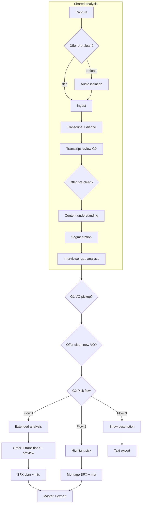

# Pipeline — three output flows

**Toolchain:** Pinned Python packages, `ffmpeg`/`aws` CLI, and HTTP API paths — [cross-cutting/anchored-toolchain.md](./cross-cutting/anchored-toolchain.md). Implementers use **Context7** at those exact versions.

One source interview session produces **three possible deliverables** (operator chooses after shared analysis). Early stages are shared; selection, publishing, and assembly diverge after **gate G2**.

**Quality target:** A polished mastered podcast — narrative order, gap-filling VO, cohesive sound design, measured loudness — plus optional **distribution copy** for Flow 3. **v1 gap:** Flow 1 mux is speech-only concat; SFX/VO/transitions artifacts are produced but not yet mixed. Flow 3 is **docs + prompt spec** until BUILD-045 ships. See [podcast-quality-roadmap.md](./cross-cutting/podcast-quality-roadmap.md).

---

## Shared foundation

All work starts from a single long-form interview recording in `./ASSETS/`.

| Stage | Goal | Key artifacts |
|-------|------|----------------|
| **Audio pre-clean** *(optional)* | Remove background noise before STT/mux | `preclean/isolated.wav`, `preclean/lineage.json` |
| **Ingest** | Normalize format, checksum, session id | `run_NNN/` workspace, normalized WAV |
| **Transcribe + diarize** | Word-level text with speaker labels | Transcript JSON, speaker map |
| **Transcript review (G0)** | Operator fixes STT using confidence-ranked clips | Corrections merged into transcript |
| **Content understanding** | Themes, narrative arc, who said what | `analysis_state.json`, content brief, speaker roles |
| **Segmentation** | Time-bounded units | Segment manifest |
| **Interviewer gap analysis** | Missing framing, VO script | Gap report |

**Optional pre-clean (offered throughout):** Background noise removal is **never required** but should be **offered** at multiple checkpoints — before ingest, after transcript review, when re-running analysis, **after the operator records additional pickup questions at G1**, and before final mix. Full-source clean improves STT and assembly; pickup-only clean targets new `vo_pickup/` files without re-processing the interview. Default is off. See [audio pre-clean](./pipeline/audio_preclean/README.md).

Run via: `python tools/run_analysis.py`

Analysis uses a **memory-backed orchestrator**: each LLM stage can retry, merge themes/questions into `understanding/analysis_state.json`, and queue investigations. Operators edit the profile in the GUI or JSON files — see [analysis-memory.md](./cross-cutting/analysis-memory.md).

**Gate G1** — human VO for `delivery: record` → [operator-gates.md](./workflows/operator-gates.md)

**Gate G2** — choose `flow1`, `flow2`, or `flow3` before `run_flow.py`

---

## Flow 1 — Full master podcast

**Intent:** Complete episode covering **all usable interview material**, ordered for the best podcast listen, with subtle ElevenLabs SFX.

### Stage sequence (after G2)

1. **Topic coverage audit** — map every brief topic/claim to segments
2. **Narrative arc plan** — setup → payoff, chapters, ordering constraints
3. **Full master ranking** — optimal segment order (not chronological default)
4. **Transitions** — interviewer bridges
5. **Podcast SFX brief** — subtle stingers and beds *(v1; see [coherent sound design](./cross-cutting/sound-design.md))*
6. **ElevenLabs SFX** — generate `sfx/*.wav`
7. **Assembly preview** *(planned)* — speech + VO listen before SFX spend
8. **Mux assembly** — speech + VO + SFX *(v1: speech-only concat; target: BUILD-065 mix)*
9. **Master** — −16 LUFS *(target: measured QA per [evaluation-metrics](./cross-cutting/evaluation-metrics.md))*

### Success criteria

- All non-aside topics represented or explicitly excluded
- No narrative holes; every included segment `ready` or has VO in EDL
- SFX does not obscure speech; shared assets per [sound-design](./cross-cutting/sound-design.md)

---

## Flow 2 — Highlight reel

**Intent:** ≤5 clips, montage SFX, 60s–3min.

### Stage sequence (after G2)

1. **Highlight selection**
2. **SFX brief** (montage)
3. **ElevenLabs SFX**
4. **Micro-assembly**
5. **Master** — −14 LUFS

---

## Flow 3 — Podcast show description

**Intent:** A **~200-word, third-person** episode blurb that allures and entices listeners — for podcast directories, web pages, and social previews. **No audio output.**

### Stage sequence (after G2)

1. **Podcast show description** — flagship LLM with rich user/assistant context volley (content brief, profile, manifest slice, optional gap summaries)
2. **Export** *(planned)* — `show_description.md` plain text alongside JSON

### Success criteria

- 150–250 words; third person throughout
- Hook, stakes, themes, and audience pitch grounded in `content_brief` / segments
- No invented facts, long transcript quotes, or pipeline jargon

See [pipeline/publishing/README.md](./pipeline/publishing/README.md) and [podcast-show-description.system.txt](./prompts/publishing/podcast-show-description.system.txt).

---

## Flow comparison

| Dimension | Flow 1 | Flow 2 | Flow 3 |
|-----------|--------|--------|--------|
| Output | Mastered WAV (full episode) | Mastered WAV (reel) | Show description (text) |
| Coverage | All usable material | ≤5 clips | Whole-interview narrative |
| Analysis | Shared + extended audit/arc | Shared only | Shared only |
| Ordering | Optimal podcast narrative | Hook → kicker | N/A |
| SFX / mux | Yes | Yes | No |
| Length | Long episode | ≤ ~3 min | ~200 words |
| Model tier (key stage) | Flagship (ranking) | Flagship (selection) | **Flagship** (`podcast_show_description`) |

---

## File structure (per run)

See [cross-cutting/artifact-layout.md](./cross-cutting/artifact-layout.md).

---

## Related docs

- [podcast-quality-roadmap.md](./cross-cutting/podcast-quality-roadmap.md) — v1 vs target, priority waves
- [logic-tree.md](./logic-tree.md)
- [prompts/README.md](./prompts/README.md)
- [build-out/README.md](./build-out/README.md) — tickets
- [build-out/repository-map.md](./build-out/repository-map.md) — repo ↔ code
- [build-out/steps-forward.md](./build-out/steps-forward.md) — prioritized backlog
- [cross-cutting/sound-design.md](./cross-cutting/sound-design.md) — coherent SFX (BUILD-060+)
- [workflows/gui-surface-map.md](./workflows/gui-surface-map.md) — panels ↔ API ↔ logs
- [workflows/long-interview-chunking.md](./workflows/long-interview-chunking.md) — context caps
- [workflows/operator-gates.md](./workflows/operator-gates.md) — gates + quality offers
- [workflows/operator-stage-checklists.md](./workflows/operator-stage-checklists.md) — per-stage verification
- [workflows/troubleshooting.md](./workflows/troubleshooting.md) — symptom playbook
- [pipeline/transcription/stt-and-diarization.md](./pipeline/transcription/stt-and-diarization.md)
- [pipeline/transcription/source-separation-and-enhancement.md](./pipeline/transcription/source-separation-and-enhancement.md)
- [pipeline/publishing/README.md](./pipeline/publishing/README.md) — Flow 3 copy stage
