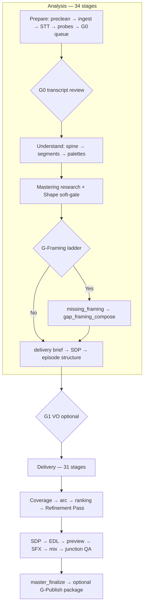

# Pipeline — single delivery path

**Toolchain:** Pinned Python packages, `ffmpeg`/`ffprobe`, OpenAI SDK, optional Terraform + boto3 for podcast RSS — [cross-cutting/anchored-toolchain.md](./cross-cutting/anchored-toolchain.md). Implementers use **Context7** at those exact versions. AWS infra is **Terraform-only** ([podcast-rss-hosting.md](./cross-cutting/podcast-rss-hosting.md) · [terraform/README.md](../terraform/README.md)); never assume AWS CLI.

One source interview → one deliverable: **`master/master.wav`**. Product Essence: find golden nuggets, cut for listenability, weave native + grounded synthetic + music/SFX/air under Shape — [NORTH_STAR.md](../NORTH_STAR.md). Optional Ship packaging + ASSETS-wide S3 sync is separate from the north-star master.

Canonical stage ids: [`src/interview_mux/v2/config.py`](../src/interview_mux/v2/config.py) (**34 analysis + 31 delivery = 65 stages**). Inventory: [v2/port-manifest.csv](./v2/port-manifest.csv). Flow 2 / Flow 3 and G2 were **removed** — [v2/drop-manifest.md](./v2/drop-manifest.md).

**Quality target:** Narrative order via the [Mastering Process](./cross-cutting/mastering-process.md), gap-framing VO when enabled, SDP beds/stingers via local MMAudio, measured loudness (`tools/verify_master.py`), and **authoritative listen_delight** (blocks ship when floors fail). Soft duration ideal (~45%); hard retention floor ~10% only. Bed coverage **0.40–0.88**, hinge stinger **0.3–1.0**.



**Brains:** **0.1.0** (default — latest registered) uses the same 65 host stages as tools under the mastering homunculus conductor (logged seed-agenda fallback if the tool loop cannot finish). **0.0.0** walks this graph linearly. See [cross-cutting/mastering-homunculus.md](./cross-cutting/mastering-homunculus.md).

---

## Shared foundation

All work starts from a single long-form interview recording in `./ASSETS/`. Operators select the file in the GUI (**Input audio**) or pass `input_audio_path` when creating a run via API; each run persists under `ASSETS/executions/exec_NNN_<hash12>_TIMESTAMP` — [cross-cutting/assets-and-executions.md](./cross-cutting/assets-and-executions.md) · [workflows/stage-execution-reuse.md](./workflows/stage-execution-reuse.md).

| Block | Goal | Key artifacts |
|-------|------|----------------|
| **Prepare** | Normalize, STT, audio probes, G0 queue | `ingest/`, `transcript/`, probe JSON |
| **G0** | Operator fixes STT | `transcript/full.json`, corrections |
| **Understand** | Speakers, segments, vernacular, sonic context, palettes | `understanding/`, `segments/` |
| **Mastering research + Shape** | Research dossier → two-pass Shape → `mastering_plan` | `mastering/research_dossier.json`, `mastering/mastering_plan.json` |
| **G-Framing → gaps** | Optional interviewer framing VO plan | `understanding/gap_report.json` |
| **Delivery brief / structure** | Adaptive policy + episode structure | delivery brief, soundscape policy, episode structure |
| **G1** | Record/synthesize pickup or skip | `vo_pickup/` |
| **Plan & refine** | Coverage, arc, ranking, Refinement Pass | ranking + refine artifacts |
| **Sound & build** | SDP, EDL, preview, MMAudio, mix, junction QA | `master/assembly.wav`, SFX assets |
| **Ship** | Loudness master; optional local RSS package | `master/master.wav`, `publish/` |

**Optional pre-clean:** Offered before ingest and after G1 pickup recording — never auto-run. See [audio pre-clean](./pipeline/audio_preclean/README.md).

```bash
python tools/run_analysis.py --run-id <exec_id>
python tools/run_delivery.py --run-id <exec_id>
```

LLM stages use **`llm_simple.py`** (max **2** attempts, then hard-stop). No shard/collate/arbiter fallback.

Gates: [workflows/operator-gates.md](./workflows/operator-gates.md) · Journey: [workflows/operator-journey.md](./workflows/operator-journey.md)

---

## Delivery (after analysis)

1. **Topic coverage / narrative / ranking** — coverage audit → arc → full-master ranking  
2. **Refinement Pass** — L0 agenda + gap recompose / framing apply / optional refines — [refinement-passes.md](./cross-cutting/refinement-passes.md)  
3. **Transitions** (+ optional refine)  
4. **Sound design** — SDP → intent refine → VO finalize → SFX prompt craft  
5. **EDL path** — narrative audit/refine → EDL → assembly preview → listen delight (**authoritative**)  
6. **MMAudio + mix** — `mmaudio_sfx` → `mix` → `junction_snip_qa`  
7. **Master** — `master_finalize` → −16 LUFS  
7b. **Master transcript** — `master_transcript_build` (Apple VTT from EDL + sidecars)  
8. **Optional G-Publish** — local `episode_meta_build` … `podcast_publish` (no S3); sync this run via GUI or `scripts/sync_podcast_episodes.py --execution-id …` — [podcast-rss-hosting.md](./cross-cutting/podcast-rss-hosting.md)

### Success criteria

- Playable `master/master.wav`; `verify_master.py` exits 0  
- Framing VO present only when G-Framing was Yes and G1 completed (or intentional skip)  
- SFX does not obscure speech — [sound-design.md](./cross-cutting/sound-design.md)

---

## File structure (per run)

See [cross-cutting/artifact-layout.md](./cross-cutting/artifact-layout.md).

---

## Related docs

- [cross-cutting/stage-contracts/00-INDEX.md](./cross-cutting/stage-contracts/00-INDEX.md) — stage contracts  
- [workflows/operator-journey.md](./workflows/operator-journey.md)  
- [cross-cutting/mastering-process.md](./cross-cutting/mastering-process.md)  
- [podcast-quality-roadmap.md](./cross-cutting/podcast-quality-roadmap.md)  
- [logic-tree.md](./logic-tree.md)  
- [prompts/README.md](./prompts/README.md)  
- [v2/drop-manifest.md](./v2/drop-manifest.md)  
- [cross-cutting/sound-design.md](./cross-cutting/sound-design.md)  
- [workflows/gui-surface-map.md](./workflows/gui-surface-map.md)  
- [workflows/operator-gates.md](./workflows/operator-gates.md)  
- [workflows/operator-stage-checklists.md](./workflows/operator-stage-checklists.md)  
- [workflows/troubleshooting.md](./workflows/troubleshooting.md)  
- [pipeline/publishing/README.md](./pipeline/publishing/README.md) — Ship packaging + RSS (not Flow 3)  
- [pipeline/transcription/stt-and-diarization.md](./pipeline/transcription/stt-and-diarization.md)  
