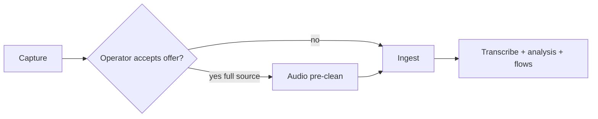
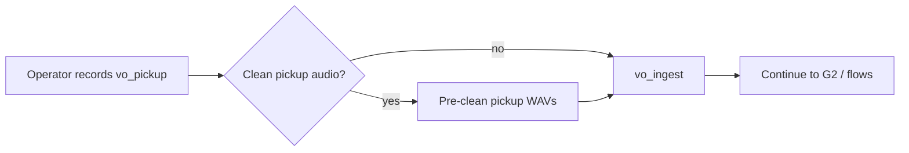

# Audio pre-clean (optional)

**Toolchain:** [DeepFilterNet](https://github.com/rikorose/deepfilternet) (local subprocess), **ffmpeg** fallback — [anchored-toolchain.md](../../cross-cutting/anchored-toolchain.md) · [local-audio-stack.md](../../cross-cutting/local-audio-stack.md).

Reduce steady background noise so speech is clearer for STT, review clips, VO pickup, and the final mix. This is **noise reduction**, not voice isolation — operator copy should not promise “stem separation.”

**Always optional** — never auto-enabled without operator consent. Under **first-try**, readiness green may **auto-dismiss** the offer (never auto-accept). See [`journey_ui.first_try_mode`](../../cross-cutting/config-keys.md#top-level).

## When to use

| Signal | Recommendation |
|--------|----------------|
| Audible constant hum or hiss under speech | Offer / enable pre-clean |
| Clean studio / booth recording | Skip |
| Phone or Zoom with light noise only | Try without first; accept pre-clean before ingest if noise is obvious |
| New VO pickup sounds noisy (home office mic) | **Clean pickup files only** at G1 |
| Already processed by another denoiser | Skip (avoid double-processing) |

**Rule:** If enhancement makes speech thin, metallic, or “underwater,” disable pre-clean and use the original source.

---

## When the operator is offered pre-clean

Pre-clean is **not** a gate (not G0/G1/G2). The product offers it at **exactly two moments** in a run.

| Workflow moment | What gets cleaned | Why |
|-----------------|-------------------|-----|
| **Before ingest** (start of run) | Raw capture (`run_meta.input_audio_path`) | Better STT and segmentation on noisy source |
| **G1 — after recording pickup questions** | **`vo_pickup/*.wav` only** | New interviewer lines often recorded in a noisier room |

### G1 pickup cleanup

When gap analysis prompts the operator to record **additional interviewer questions** ([interviewer-gap](../interviewer-gap/README.md), gate G1):

1. Operator records lines into `vo_pickup/{line_id}.wav`.
2. UI offers: **“Remove background noise from your pickup recordings?”**
3. If yes → DeepFilterNet enhance on pickup files; write `vo_pickup/clean/*.wav` and record lineage with `scope: vo_pickup`.
4. **Does not** require re-cleaning the original interview unless the operator also chooses full-source pre-clean.

---

## Placement in pipeline

When enabled for **full source**, pre-clean runs **before** [ingest](../ingest/README.md):



When enabled for **VO pickup only** (typical at G1):



---

## Provider choice

### Primary — DeepFilterNet (local)

| Item | Value |
|------|--------|
| Runtime | `ASSETS/local_deepfilter/venv` → `tools/deepfilter_enhance.py` |
| Runner | `interview_mux.deepfilter_runner.enhance_wav` |
| Config | `deepfilter.*`, `audio_preclean.chunk_max_bytes` |
| Lineage `provider` | `deepfilternet` |

Large sources are chunked when size exceeds `audio_preclean.chunk_max_bytes`, enhanced per chunk, then merged with crossfade.

### Fallback — ffmpeg_local (offline)

| Item | Value |
|------|--------|
| Tool | `ffmpeg` filters `afftdn`, highpass, lowpass |
| Use | When DeepFilterNet stack unavailable or enhance fails |
| `preclean/provider.json` | `provider: ffmpeg_local` |

---

## Operator control

**Persist in `run_meta.json`:**

```json
{
  "audio_preclean": {
    "enabled": true,
    "scope": "full_source",
    "provider": "deepfilternet",
    "requested_at": "2026-05-25T12:00:00Z",
    "offered_at": ["before_ingest", "g1_vo_pickup"]
  }
}
```

`scope` values:

| `scope` | Meaning |
|---------|---------|
| `full_source` | Clean raw capture; re-run ingest + downstream |
| `vo_pickup` | Clean only files in `vo_pickup/`; re-run `vo_ingest` and assembly stages that use VO |
| `normalized_rebuild` | Re-clean from current `ingest/normalized.wav` |

Default: `enabled: false`.

---

## Outputs

| Path | Description |
|------|-------------|
| `preclean/isolated.wav` | Full-source enhanced track (ingest input) |
| `vo_pickup/clean/*.wav` | Optional cleaned pickup files |
| `preclean/provider.json` | Provider + `scope` |
| `preclean/lineage.json` | Source paths, SHA-256, `scope`, timestamps |
| `.stage_done/audio_preclean` | Idempotency marker |

## Bootstrap

```bash
./scripts/bootstrap_venv.sh
ASSETS/local_deepfilter/venv/bin/python scripts/download_deepfilter.py --verify
```

## Related

- [local-audio-stack.md](../../cross-cutting/local-audio-stack.md)
- [capture](../capture/README.md)
- [ingest](../ingest/README.md)
- [interviewer-gap](../interviewer-gap/README.md)
- [operator-gates.md](../../workflows/operator-gates.md)
- [artifact-layout.md](../../cross-cutting/artifact-layout.md)
