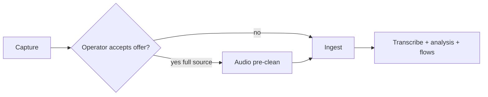
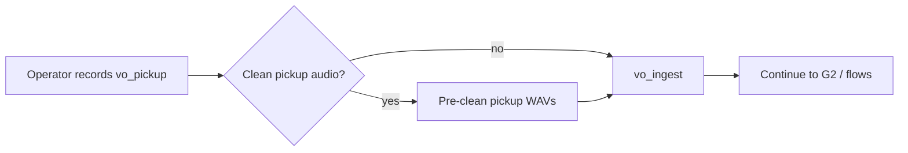

# Audio pre-clean (optional)

**Toolchain:** ElevenLabs REST `/v1/audio-isolation`, **ffmpeg** — [anchored-toolchain.md](../../cross-cutting/anchored-toolchain.md). No ElevenLabs SDK.

Remove background noise so speech is clearer for STT, review clips, VO pickup, and the final mix. **Always optional** — never auto-enabled without operator consent.

Most interviews skip pre-clean. Enable when the source or **new pickup recordings** have noticeable room tone, HVAC, keyboard clicks, traffic, or other steady noise.

## When to use

| Signal | Recommendation |
|--------|----------------|
| Audible constant hum or hiss under speech | Offer / enable pre-clean |
| Clean studio / booth recording | Skip |
| Phone or Zoom with light noise only | Try without first; offer after G0 if many low-confidence words |
| New VO pickup sounds noisy (home office mic) | **Clean pickup files only** at G1 |
| Already processed by another denoiser | Skip (avoid double-processing) |

**Rule:** If isolation makes speech thin, metallic, or “underwater,” disable pre-clean and use the original source.

---

## When the operator is offered pre-clean

Pre-clean is **not** a gate (not G0/G1/G2). The product should **offer** it at quality checkpoints throughout the run. The operator can accept, dismiss, or re-open the offer later.

| Workflow moment | What gets cleaned | Why |
|-----------------|-------------------|-----|
| **Before ingest** (start of run) | Raw capture (`run_meta.input_audio_path`, usually under `ASSETS/input/`) | Best STT and segmentation on noisy source |
| **After G0 transcript review** | Full source (re-run from `audio_preclean` → ingest) | Low-confidence errors may be noise, not words |
| **After analysis / before re-run** | Full source | Operator chose to redo from ingest with cleaner audio |
| **G1 — after recording pickup questions** | **`vo_pickup/*.wav` only** | New interviewer lines often recorded in a noisier room than the interview |
| **Before assembly / mix** | Full `ingest/normalized.wav` path | Final mux clarity before master |
| **After master preview sounds noisy** | Full source or assembly bus (operator choice) | Last-chance quality fix before export |

### G1 pickup cleanup (explicit product behavior)

When gap analysis prompts the operator to record **additional interviewer questions** ([interviewer-gap](../interviewer-gap/README.md), gate G1):

1. Operator records lines into `vo_pickup/{line_id}.wav`.
2. UI offers: **“Remove background noise from your pickup recordings?”**
3. If yes → run isolation on pickup files (or a merged pickup stem); write `vo_pickup/clean/` or replace with cleaned WAVs and record lineage in `preclean/lineage.json` with `scope: vo_pickup`.
4. **Does not** require re-cleaning the original interview unless the operator also chooses full-source pre-clean.

This makes pre-clean useful **late in the workflow**, not only at capture time.

---

## Placement in pipeline

Default path: capture → ingest (no API call).

When enabled for **full source**, pre-clean runs **before** [ingest](../ingest/README.md):



When enabled for **VO pickup only** (typical at G1):



Downstream stages use the cleaned file when pre-clean ran for that scope (full source → `preclean/isolated.wav` → ingest; pickup-only → cleaned files in `vo_pickup/`).

---

## Provider choice (v1 spec)

### Primary — ElevenLabs Audio Isolation (recommended)

Uses the same `ELEVENLABS_API_KEY` as SFX generation.

| Item | Value |
|------|--------|
| API | `POST https://api.elevenlabs.io/v1/audio-isolation` (multipart; streaming for long files when implemented) |
| Client | `interview_mux.elevenlabs_rest.isolate_audio` — **REST only** (no Python SDK) |
| Strength | Speech-focused background removal; already in project secrets |

**Caveats:** Tuned for vocals/speech; music-heavy beds may be altered. Re-processing clean audio can degrade quality.

### Fallback — local RNNoise (offline)

| Item | Value |
|------|--------|
| Tool | `ffmpeg` filter `arnndn` |
| Use | Quota/offline runs; document `provider: rnnoise_local` in `preclean/provider.json` |

### AWS

**Not used for pre-clean.** Transcribe assumes normalized WAV input; no speech-denoise preprocessor in this repo.

---

## Operator control

**Persist in `run_meta.json`:**

```json
{
  "audio_preclean": {
    "enabled": true,
    "scope": "full_source",
    "provider": "elevenlabs",
    "requested_at": "2026-05-25T12:00:00Z",
    "offered_at": ["before_ingest", "g1_vo_pickup"]
  }
}
```

`scope` values:

| `scope` | Meaning |
|---------|---------|
| `full_source` | Clean raw capture; re-run ingest + downstream |
| `vo_pickup` | Clean only files in `vo_pickup/`; re-run `vo_ingest` and assembly stages that use VO |
| `normalized_rebuild` | Re-clean from current `ingest/normalized.wav` (late offer before mix) |

**CLI:**

```bash
python -m interview_mux run-stage --run-id exec_001 --stage audio_preclean
python tools/run_analysis.py --run-id exec_001 --from-stage audio_preclean
```

Default: `enabled: false`.

---

## Inputs

| Path | Description |
|------|-------------|
| Raw capture or `ingest/normalized.wav` | `scope: full_source` / `normalized_rebuild` |
| `vo_pickup/*.wav` | `scope: vo_pickup` |
| `ELEVENLABS_API_KEY` | When `provider: elevenlabs` |

## Outputs

| Path | Description |
|------|-------------|
| `preclean/isolated.wav` | Full-source denoised track (ingest input) |
| `vo_pickup/clean/*.wav` | Optional cleaned pickup files |
| `preclean/provider.json` | Provider + `scope` |
| `preclean/lineage.json` | Source paths, SHA-256, `scope`, timestamps |
| `.stage_done/audio_preclean` | Idempotency marker |

## Handoff to ingest

When **full_source** pre-clean completed:

1. Ingest input = `preclean/isolated.wav`.
2. `ingest/checksums.json` records `preclean_sha256` and `source_sha256`.
3. Transcription, review clips, segmentation, and mux use `ingest/normalized.wav` from the cleaned lineage.

When **vo_pickup** only: ingest/transcript unchanged; mux and gap ingest read cleaned pickup paths.

## Success criteria

- Output WAV exists; duration matches source ± tolerance
- Operator can A/B raw vs cleaned in GUI
- Idempotent skip when checksums unchanged
- Offers logged in `run_meta.json` / `gui_log.jsonl` for audit (dismissed vs accepted)

## Implementation tickets

- **BUILD-019** — stage module `stages/audio_preclean.py`
- **BUILD-072** — **done** — GUI quality offers at checkpoints (including G1 pickup prompt; `scope: vo_pickup` in `run_meta.json`)

See [build-out/README.md](../../build-out/README.md) and [podcast-quality-roadmap.md](../../cross-cutting/podcast-quality-roadmap.md).

## Related

- [elevenlabs-integration-guide.md](../../cross-cutting/elevenlabs-integration-guide.md) — isolation service + scopes (canonical)
- [capture](../capture/README.md)
- [ingest](../ingest/README.md)
- [interviewer-gap](../interviewer-gap/README.md) — G1 pickup
- [operator-gates.md](../../workflows/operator-gates.md) — gates vs quality offers
- [artifact-layout.md](../../cross-cutting/artifact-layout.md)

---

## Build-out

BUILD-019, BUILD-072 · [README.md](../../build-out/README.md) · [steps-forward.md](../../build-out/steps-forward.md)
