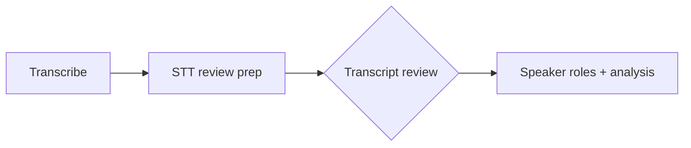

# Transcript review (operator STT QC)

Human checkpoint immediately after AWS Transcribe. Operators listen to **pre-cut clips** ranked by **communicative salience** (idea-break risk), correct text, then sign off before content understanding runs. Confidence-only ordering is available as a config fallback for A/B (`transcript_review.sort_mode: confidence`).

## Pipeline position



| Step | Stage id | Automated? |
|------|----------|------------|
| AWS Transcribe | `transcribe` | Yes |
| Build ranked queue + clips | `transcript_review_build` | Yes |
| Operator corrections | `transcript_review` (gate) | No |
| Downstream analysis | `speaker_roles` … | Yes (blocked until gate clears) |

## Confidence ranking

Each pronunciation item from AWS Transcribe includes `alternatives[0].confidence` (0–1). The prep stage:

1. Groups words into review **chunks** (speaker diarization segments, split on pauses ≥700ms or max 30s).
2. Computes chunk confidence = **mean word confidence**.
3. Computes **acoustic stress** at chunk edges (H-G0-02) from `ingest/normalized.wav`.
4. Sorts chunks by **communicative salience** (H-G0-01): weighted blend of low confidence (0.45), word density (0.2), pause proxy (0.15), and acoustic stress (0.2). Tie-break: lower confidence first.
5. Flags `needs_review` when confidence &lt; **0.85** (configurable constant in code).

**Config:** `transcript_review.sort_mode` — `salience` (default) or `confidence` (legacy ascending). Persisted on `transcript/review_queue.json` as `sort_mode`.

**Log:** `G0 review queue built: sort_mode=…` in `gui_log.jsonl` (`stage=transcript_review_build`) with top chunk ids and mean stress in `detail`.

## Artifacts

| Path | Description |
|------|-------------|
| `transcript/full.json` | Word-level transcript; `words[].corrected` set on dock edits; `review_applied_at` on G0 complete |
| `transcript/review_queue.json` | Ranked chunks with timings, text, clip paths |
| `transcript/review_clips/{chunk_id}.wav` | Pre-cut audio per chunk |
| `transcript/corrections.json` | Chunk-level edits `{ chunk_id: { text, reviewed } }` |
| `operator/transcript_corrected.json` | Independent corrected transcript snapshot (updated on each dock or chunk save) |
| `operator/transcript_corrected.txt` | Plain-text corrected transcript for reuse |
| `operator/transcript_corrections.json` | Copy of `transcript/corrections.json` on chunk save / complete |
| `operator/manifest.json` | Index of all operator snapshots in this execution |
| `.stage_done/transcript_review_build` | Prep complete |
| `.stage_done/transcript_review` | Operator signed off |

**Dock word edits** write `transcript/full.json` immediately (by word index) and refresh `operator/transcript_corrected.*` with `source: dock_edit`. **Chunk saves** update `transcript/corrections.json` and operator snapshots but do not merge into `full.json` until **Complete transcript review**.

## GUI workflow

1. Run **Transcribe**, then **STT review prep** (or “Run all analysis” — pipeline pauses at the gate).
2. Open stage **Transcript review** in the sidebar (checkpoint modal opens automatically when G0 is pending).
3. For each ranked clip:
   - Play the chunk audio.
   - Use the **synced transcript dock** below for word-by-word fixes (recommended).
   - Optionally bulk-edit the chunk textarea and **Save chunk** (or **Mark reviewed** if unchanged).
4. Click **Complete transcript review** (or **Accept remaining & complete**).

The dock is also available on **Transcribe** and **Transcript review** stage detail outside the modal for ongoing word edits.

## Synced transcript dock (word editor)

**Component:** `TranscriptDockViewer` (`frontend/src/components/workspace/TranscriptDockViewer.tsx`)

| Interaction | Behavior |
|-------------|----------|
| Click word | Seek synced audio to that word |
| Double-click word | Inline edit; auto-save after 450ms debounce |
| Enter | Save **this word only** and close edit |
| Escape | Cancel edit |
| Low-confidence words | Wavy underline until corrected |
| Corrected words | Dotted green underline |

**API:** `GET /api/runs/{id}/transcript` loads `words[]`, `duration_ms`, `audio_path`, `low_confidence_threshold`. Each save batches to `PATCH /api/runs/{id}/transcript/words`.

**Queue sync:** Each dock save updates overlapping chunks in `transcript/review_queue.json` (`corrected_text`) and `transcript/corrections.json` (text only; `reviewed` unchanged). The chunk textarea refreshes automatically.

**Undo:** Toolbar **Undo** or ⌘Z / Ctrl+Z reverts the last word edit or batch fuzzy replace (up to 30 steps).

**Session summary:** The dock toolbar and review footer show cumulative stats, e.g. `Corrected 12 words (8 via fuzzy batch)`. The same line appears in the completion toast when you finish G0.

**Log line:** `Transcript dock: saved N word edit(s).` in `gui_log.jsonl` (`stage: transcript_review`).

## Fuzzy find-and-replace (similar words)

When editing a word, the **Fix similar words** side panel (`FuzzyReplacePopover`) helps correct repeated mishearings across the **entire transcript** in one action.

| Control | Behavior |
|---------|----------|
| Panel | Opens automatically on double-click edit; dismiss with × or backdrop (use **Find similar** pill to reopen) |
| Correction card | Shows `original → your correction` as you type |
| Match strictness | Slider **80–100%** (default 90%); only matches at or above threshold appear |
| Similar in transcript | All matches listed (scrollable) with score + timestamp; **click to jump** and scroll in the dock |
| Per-match selection | Checkbox on each match; **All** / **None** shortcuts; header shows `N of M selected` |
| Exclude false positives | Uncheck a close-but-wrong match to keep it unchanged; excluded rows are struck through |
| Replace | **Replace N words** = active word + selected matches; **Replace this word only** when none selected |
| Candidate highlight | Only **selected** matches get a warm highlight while the panel is open |

**Client-only:** Fuzzy scoring uses normalized Levenshtein similarity in `frontend/src/utils/fuzzyMatch.ts`. No new backend endpoint — approved matches batch through the existing `PATCH …/transcript/words` body `{ updates: [{ index, text }, …] }`.

**Keyboard:** Enter saves this word only; Esc cancels edit. Use the panel **Replace** button for batch similar-word fixes (confirmation when replacing 3+ words).

**G0 complete:** Chunk corrections merge into `full.json` without collapsing dock word-level edits — ranges where every word is already `corrected: true` are left intact; equal token-count chunk text updates words in place.

## API (web server)

| Method | Path | Purpose |
|--------|------|---------|
| GET | `/api/runs/{id}/transcript` | Word-level dock state (audio sync) |
| PATCH | `/api/runs/{id}/transcript/words` | Inline word edits (single or batch) |
| GET | `/api/runs/{id}/transcript-review` | Ranked queue + pending count |
| PUT | `/api/runs/{id}/transcript-review/{chunk_id}` | Save chunk correction |
| POST | `/api/runs/{id}/transcript-review/complete` | Merge chunk corrections into `full.json`, mark gate done |

Request/response shapes: [api-reference.md](../../workflows/api-reference.md#transcript-dock-word-edits).

## CLI / pipeline

```bash
# Prep only (after transcribe)
python -m interview_mux run-stage --run-id exec_001_... --stage transcript_review_build

# Sign off (or use GUI)
python -m interview_mux run-stage --run-id exec_001_... --stage transcript_review
```

`run_analysis` stops after prep when review is pending. Downstream LLM stages require `.stage_done/transcript_review`.

## Module

`src/interview_mux/stages/transcript_review.py` — `get_transcript_state`, `patch_transcript_words`, `get_review_state`, `save_chunk_correction`, `apply_corrections`.

This is separate from the offer at **G1** to clean only new `vo_pickup/` recordings.

## Related

- [operator-gates.md](../../workflows/operator-gates.md) — G0 definition
- [gui-surface-map.md](../../workflows/gui-surface-map.md) — transcript review API rows + GUI components
- [operator-flow-audit.md](../../workflows/operator-flow-audit.md) — G0 panel branching
- [stt-and-diarization.md](./stt-and-diarization.md) — upstream STT options
- [audio_preclean/README.md](../audio_preclean/README.md) — when offers appear
- [artifact-layout.md](../../cross-cutting/artifact-layout.md) — paths
- [evaluation-metrics.md](../../cross-cutting/evaluation-metrics.md) — STT QC heuristics
