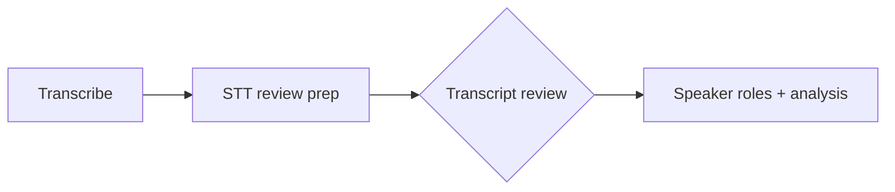

# Transcript review (operator STT QC)

Human checkpoint immediately after AWS Transcribe. Operators listen to **pre-cut clips** ranked by **lowest word confidence first**, correct text, then sign off before content understanding runs.

## Pipeline position



| Step | Stage id | Automated? |
|------|----------|------------|
| AWS Transcribe | `transcribe` | Yes |
| Build ranked queue + clips | `transcript_review_build` | Yes |
| Operator corrections | `transcript_review` (gate) | No |
| Downstream analysis | `speaker_roles` … | Yes (blocked until gate clears) |

## Confidence ranking

Each pronunciation item from AWS Transcribe includes `alternatives[0].confidence` (0–1). The prep stage:

1. Groups words into review **chunks** (speaker diarization segments, split on pauses ≥700ms or max 30s).
2. Computes chunk confidence = **mean word confidence**.
3. Sorts chunks ascending by confidence (weakest first).
4. Flags `needs_review` when confidence &lt; **0.85** (configurable constant in code).

## Artifacts

| Path | Description |
|------|-------------|
| `transcript/full.json` | Words include `confidence`; updated when review completes |
| `transcript/review_queue.json` | Ranked chunks with timings, text, clip paths |
| `transcript/review_clips/{chunk_id}.wav` | Pre-cut audio per chunk |
| `transcript/corrections.json` | Operator edits `{ chunk_id: { text, reviewed } }` |
| `operator/transcript_corrected.json` | Independent corrected transcript snapshot (updated on each edit) |
| `operator/transcript_corrected.txt` | Plain-text corrected transcript for reuse |
| `operator/manifest.json` | Index of all operator snapshots in this execution |
| `.stage_done/transcript_review_build` | Prep complete |
| `.stage_done/transcript_review` | Operator signed off |

## GUI workflow

1. Run **Transcribe**, then **STT review prep** (or “Run all analysis” — pipeline pauses at the gate).
2. Open stage **Transcript review** in the sidebar.
3. For each ranked clip: play audio, edit textarea, **Save chunk** (or **Mark reviewed** if unchanged).
4. Click **Complete transcript review** (or **Accept remaining & complete**).

## API (web server)

| Method | Path | Purpose |
|--------|------|---------|
| GET | `/api/runs/{id}/transcript-review` | Ranked queue + pending count |
| PUT | `/api/runs/{id}/transcript-review/{chunk_id}` | Save correction |
| POST | `/api/runs/{id}/transcript-review/complete` | Apply to `full.json`, mark gate done |

## CLI / pipeline

```bash
# Prep only (after transcribe)
python -m interview_mux run-stage --run-id exec_001_... --stage transcript_review_build

# Sign off (or use GUI)
python -m interview_mux run-stage --run-id exec_001_... --stage transcript_review
```

`run_analysis` stops after prep when review is pending. Downstream LLM stages require `.stage_done/transcript_review`.

## Module

`src/interview_mux/stages/transcript_review.py`

This is separate from the offer at **G1** to clean only new `vo_pickup/` recordings.

## Related

- [operator-gates.md](../../workflows/operator-gates.md) — G0 definition
- [gui-surface-map.md](../../workflows/gui-surface-map.md) — transcript review API rows
- [stt-and-diarization.md](./stt-and-diarization.md) — upstream STT options
- [audio_preclean/README.md](../audio_preclean/README.md) — when offers appear
- [artifact-layout.md](../../cross-cutting/artifact-layout.md) — paths
- [evaluation-metrics.md](../../cross-cutting/evaluation-metrics.md) — STT QC heuristics
