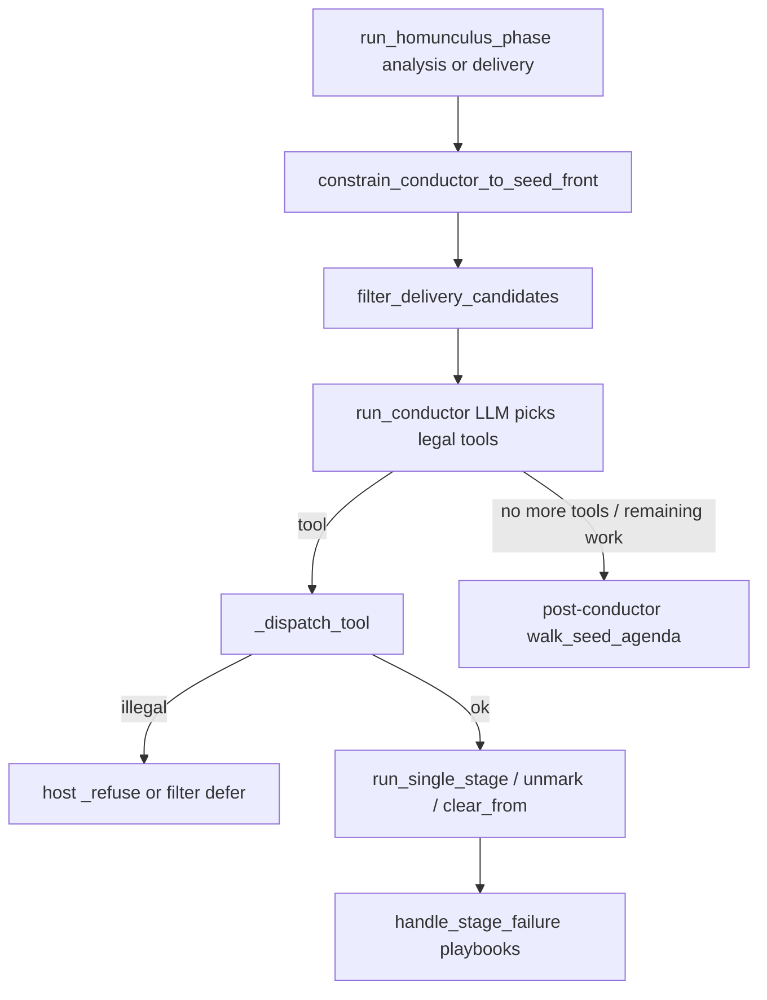

# Homunculus 0.1.0 — HDT axes, tools, refuses, walks (R0)

Generated from live code. Brain **0.1.0** only. Do not treat as infinite path enumeration.

## Discrete axes

| Axis | Values (from code) |
|------|-------------------|
| `phase` | `analysis` \| `delivery` (`agenda.run_homunculus_phase`) |
| `delivery_phase` | `A`…`E` (`delivery_guardrails.current_delivery_phase`) |
| Seed-front pin | earliest incomplete in seed order (`constrain_conductor_to_seed_front`) |
| Gate categories | transcript_integrity, framing_consent, vo_pickup, source_preclean, nle_optional, listen_borderline, optimizer_authority, quality_ship, publish_package, prompt_promotion |
| Gate actions | `open` \| `auto_resolve` \| `present_operator` \| `skip` (`gates.set_gate`; G0 cannot skip/auto_resolve) |
| Artifact stamps | assembly wav, Phase A seal, `music_complete_at`, `master.wav`, `ship_path_ready` |
| Agenda bags | remaining / skipped / scheduled / hollow-done |
| Remediation | none \| playbook / `allowed_rerun_stages` → mode `remediation_heal_only` |
| Invalidate mode | `heal_only` \| `structural` \| `remediation_heal_only` |
| Conductor tool family | progress (`run_stage_*`) \| heal (rerun/invalidate/impact) \| gate \| walk \| pack/admit \| judge/ears |
| Post-conductor walk | see walk reasons below |

## HEAL_ONLY_PRODUCERS

gap_framing_compose, gap_framing_recompose, nugget_layup_compose, vo_line_adjudicate

Structural invalidate iff stage ∉ heal-only **or** fingerprints mismatch / no checkpoint (`invalidation_is_structural`).

## INVALIDATION_BLAST_RADIUS (policy table — **unused at call sites**)

`invalidation_allowed_downstream` is defined in `delivery_guardrails.py` but **never called** from `invalidate_downstream` / agenda. Live blast control is heal_only vs structural + profiles + filters.

```json
{
  "junction_snip_qa": [
    "junction_snip_qa",
    "master/transitions.json",
    "master_finalize",
    "mix"
  ],
  "nugget_layup_compose": [
    "assembly_preview",
    "edl",
    "edl_narrative_audit",
    "listen_delight_audit",
    "vo_synthesize"
  ]
}
```

**Durable backlog:** wire `invalidation_allowed_downstream` at structural clear sites **or** stop documenting BLAST_RADIUS as live control.

## Host conductor tools (excluding `run_stage_*`)

| Tool | Identity |
|------|----------|
| `admit_result` | `admit_result` |
| `pack_volley` | `pack_volley` |
| `persist_artifact` | `persist_artifact` |
| `analyze_issue` | `analyze_issue` |
| `retrieve_canon` | `retrieve_canon` |
| `read_json` | `read_json` |
| `ears_stt_window` | `ears_stt_window` |
| `end_judgment` | `end_judgment` |
| `shape_pre_critique_gates` | `shape_pre_critique_gates` |
| `shape_post_critique_gates` | `shape_post_critique_gates` |
| `build_speaker_dossier` | `build_speaker_dossier` |
| `run_musicgen` | `run_musicgen` |
| `run_mmaudio` | `run_mmaudio` |
| `run_chatterbox` | `run_chatterbox` |
| `run_s2s` | `run_s2s` |
| `run_deepfilter` | `run_deepfilter` |
| `verify_master` | `verify_master` |
| `set_gate` | `set_gate` |
| `promote_prompt` | `promote_prompt` |
| `mint_prompt` | `mint_prompt` |
| `stack_prompt_module` | `stack_prompt_module` |
| `skip_stage` | `skip_stage` |
| `schedule_stage` | `schedule_stage` |
| `rerun_stage` | `rerun_stage` |
| `walk_seed_remainder` | `walk_seed_remainder` |
| `invalidate_downstream` | `invalidate_downstream` |
| `resolve_stage_plan` | `resolve_stage_plan` |
| `rerun_with_impact` | `rerun_with_impact` |
| `axis_select` | `axis_select` |
| `write_thinking` | `write_thinking` |
| `build_source_card` | `build_source_card` |

## Stage run tools

Count: **69** (`run_stage_<id>` for every ANALYSIS + DELIVERY stage).

## Host refuses / hard guards

- `_refuse_g0_locked_rerun — G0 closed: refuse transcribe/ingest/audio_preclean rerun/invalidate`
- `_refuse_classified_manifest_rerun — classified manifest present: refuse rewind of locked analysis stages`
- `_refuse_delivery_timeline_rewind — delivery phase: refuse analysis rewind that archives gap artifacts`
- `_refuse_topology_skip_without_samples — skip topology without speaker samples`
- `_refuse_music_before_assembly — music triad before assembly wav`
- `HollowSkipBlockedError — hollow done → unmark_and_rerun_once then needs_operator`
- `delivery_epoch_locked + structural invalidate → RuntimeError unlock required`

## Post-conductor walk reasons (`walk_seed_agenda`)

- `walk_seed_remainder`
- `delivery_needs_analysis`
- `delivery_walk_to_master`
- `delivery_walk_unpublishable_master`
- `delivery_walk_to_publish`
- `analysis_fill_delivery_prereqs`

## Impact-class ADG chains (4–N depth budget)

| Producer | ADG invalidate len | Stub depth (min(len,8) max(3)) |
|----------|-------------------:|-------------------------------:|
| `nugget_layup_compose` | 25 | 8 |
| `vo_line_adjudicate` | 17 | 8 |
| `transitions` | 20 | 8 |
| `edl` | 14 | 8 |
| `gap_framing_compose` | 3 | 3 |
| `full_master_ranking` | 29 | 8 |
| `sound_design_plan` | 19 | 8 |
| `mmaudio_sfx` | 9 | 8 |
| `mix` | 8 | 8 |
| `junction_snip_qa` | 7 | 7 |

## Control-flow map (R1) — host vs LLM



**LLM owns:** which legal tool among schemas.  
**Host owns:** seed-front pin, filters, all refuses, invalidate mode, seating bump, post-conductor walks, budgets.
