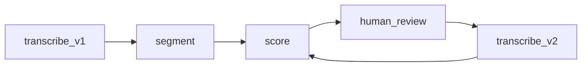

# Feedback loops and re-runs

You can **improve STT** or **segmentation** and recompute downstream without redoing everything.

## Example loop

## Patterns

- **Re-score only:** same `segment_id` boundaries; refresh text and salience from new transcript.
- **Re-segment:** invalidate boundaries; new `segment_id` namespace or version field ([idempotent-runs.md](idempotent-runs.md)).

## Open decisions

- UI for diffing transcript v1 vs v2 at segment level.

## Links

- [../pipeline/snippet-store/provenance-retranscribe.md](../pipeline/snippet-store/provenance-retranscribe.md)
- [idempotent-runs.md](idempotent-runs.md)
