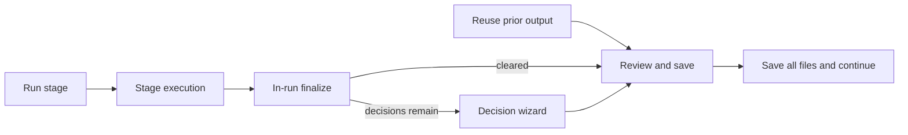

# Full autopilot operator model

Canonical description of the **full autopilot** stage UX (`journey_ui.full_autopilot`, default **on**). For ITR mechanics (repair strategies, APIs, triage pipeline), see [artifact-issue-triage.md](../cross-cutting/artifact-issue-triage.md). For GUI panels and API routes, see [gui-surface-map.md](gui-surface-map.md).

## North star

Every **automated** stage follows:

**Reuse or Run → (in-run auto-resolve) → Stage Decision Wizard (only if needed) → Review → Save**

**Manual gates are unchanged:** G0 transcript review, G0.5 disfluency, analysis profile, G1 VO pickup, G2 flow select.

## In-run finalize (server)

After each LLM stage completes, `finalize_stage_outputs()` in `stage_finalize.py` runs automatically:

1. Deterministic triage (`run_triage_pipeline`)
2. Auto-resolve (`auto_resolve_stage(autopilot=True)`)
3. Risk-based force advance (`risk_based_force_advance`) when blocking issues remain
4. Auto-propagation when safe (boundary → segment chain, capped downstream re-runs)
5. Build operator decision queue when autopilot cannot finish alone

During finalize the GUI job reports:

| Field | Value |
|-------|--------|
| `status` | `running` |
| `phase` | `auto_resolving` |
| `substep` | `artifact_resolution` |

On success with no decisions: `awaiting_write_approval` (never `needs_clarification` in full autopilot).

On unrecoverable failure: `status: failed`, `failure_kind: auto_resolve_exhausted`.

## Operator-visible substeps (automated stages)

| # | Step id | Label | When shown |
|---|---------|-------|------------|
| 1 | `reuse` | Reuse or run fresh | reuse candidates exist |
| 2 | `run` | Run {title} | stage not done |
| 3 | `auto_resolving` | Resolving outputs… | `job.phase == auto_resolving` |
| 4 | `operator_decisions` | Your input needed (n) | pending decisions > 0 |
| 5 | `write_approval` | Review and save | staged files; decisions cleared |

Step 4 is **omitted** when the queue is empty — no placeholder shell.

Gate stages keep their existing multi-step checklists.

## Stage Decision Wizard

**Component:** `StageDecisionWizard.tsx` — one decision per screen, server-driven copy.

**Trigger:** any open `OperatorDecision` after finalize. **Skip:** empty queue → land on Review.

| Decision kind | Primary control | Label pattern |
|---------------|-----------------|---------------|
| `issue_choice` | Select + button | Options in plain language; button **Apply choice** |
| `propagation` | Primary + skip | **Re-run {stage title}** / **Skip — I'll fix manually** |
| `upstream_rerun` | Confirm + skip | **Re-run {upstream}** / skip |
| `acknowledge_warning` | Single button | **Continue to review** |

**APIs:**

- `GET /api/runs/{run_id}/stages/{stage_id}/decisions` — queue + current cursor
- `POST /api/runs/{run_id}/stages/{stage_id}/decisions/{id}/resolve` — apply choice; returns `ready_for_review` when done

Persisted at `understanding/operator_decisions.json`.

## Risk-based force advance

When auto-resolve cannot clear blocking issues, `issue_risk_assessment.py` classifies each item:

| Risk | Action |
|------|--------|
| `guaranteed_breakage` | Delete segment / wipe refs (duplicate ids, broken timeline) |
| `repairable` | Deterministic repair (`accept_auto_repair`, merge, defaults) |
| `passable` | Dismiss with logged warning |

Config: `analysis.artifact_issue_triage.risk_based_force_advance` (default true).

## Hidden in full autopilot

- **Fix all & continue** (client auto-resolve POST)
- Standalone **Artifact clarification** panel
- Standalone **Propagation wizard** panel
- Separate **handoff acknowledge** step (folded into **Save all files & continue**)

## Legacy mode (`full_autopilot: false`)

Restores prior semi-manual ITR: `needs_clarification`, Fix all, artifact clarification substep, propagation wizard. Use for rollback or debugging.

## Observability

In-run finalize emits structured operator log lines (see `gui_log.jsonl` Activity tab):

| Phase | `action_id` |
|-------|-------------|
| Finalize span | `stage_finalize.start` / `stage_finalize.complete` / `stage_finalize.failed` |
| Triage | `itr.triage.start` / `itr.triage.complete` |
| Auto-resolve | `itr.auto_resolve.start` / `itr.auto_resolve.apply` / `itr.auto_resolve.complete` |
| Risk advance | `itr.risk.apply` / `itr.risk.advance.complete` |
| Decision queue | `itr.decision.queue_set` / `itr.decision.resolve` |
| Wizard (GUI) | `gui.decision.resolve.start` / `gui.decision.apply` |
| LLM calls | `llm.api_call` (pre) / `llm.success` (post; links `llm_call_path` when recorded) |

Forensics index: `operator/action_trace.jsonl`. Full LLM payloads: `understanding/llm_calls/`.

## Config

| Key | Default | Role |
|-----|---------|------|
| `journey_ui.full_autopilot` | `true` | Master switch |
| `journey_ui.auto_advance_pipeline` | `true` | Auto-run next stage after save |
| `journey_ui.require_handoff_between_stages` | ignored when full autopilot | Handoff auto-acked on save |
| `analysis.artifact_issue_triage.in_run_auto_resolve` | `true` | Finalize runs auto-resolve |
| `analysis.artifact_issue_triage.risk_based_force_advance` | `true` | Risk assessor on open issues |

See [config-keys.md](../cross-cutting/config-keys.md).

## Related docs

- [operator-gates.md](operator-gates.md) — G0–G2 unchanged
- [operator-stage-checklists.md](operator-stage-checklists.md) — per-stage verification
- [troubleshooting.md](troubleshooting.md) — wizard stuck, `auto_resolve_exhausted`
