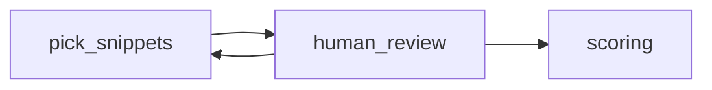

# Human overrides and re-score

Human review can **send work back** to scoring or segmentation without starting from raw audio.

## Flow

## Behaviors

- **Boost / ban** signals stored per `segment_id` ([../pipeline/human-review-ui/force-include-exclude.md](../pipeline/human-review-ui/force-include-exclude.md)).
- Optional: re-run **LLM ranker** only on top-K after edits.

## Open decisions

- Whether boosted segments bypass diversity filter.

## Links

- [feedback-loops-and-reruns.md](feedback-loops-and-reruns.md)
