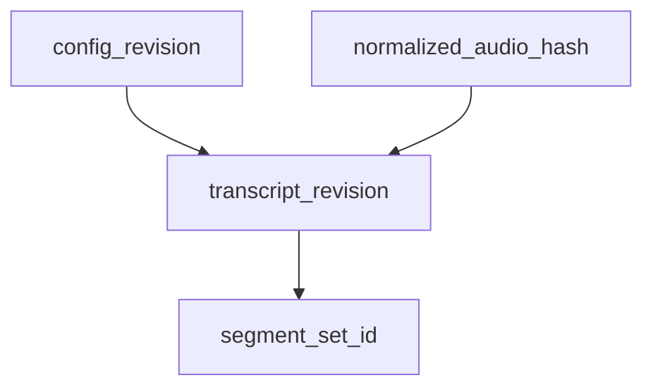

# Idempotent runs

Same **inputs** + same **config revision** should yield the same **segment_ids** and scores so manifests stay stable across retries.

## Rules of thumb

- Hash **normalized audio** + `ingest_config` + `stt_model_id` → `transcript_revision`.
- Segmenter emits ids as `hash(session_id, t_start_ms, t_end_ms, transcript_revision)` or explicit UUIDs stored on first successful run.

## Graph: stable vs branching work

## Open decisions

- Whether to forbid reuse of ids across incompatible `transcript_revision` (recommended: new id set).

## Links

- [../pipeline/ingest/checksums-and-lineage.md](../pipeline/ingest/checksums-and-lineage.md)
- [human-overrides-and-rescore.md](human-overrides-and-rescore.md)
