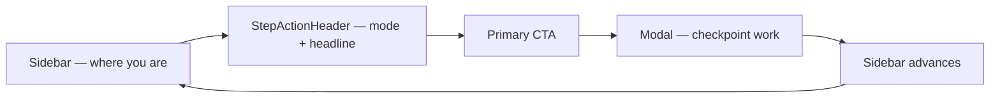

# Operator journey

**Start here** for the happy path from interview WAV to podcast master, highlight reel, or show description. Engineers: [AGENTS.md](../../AGENTS.md). Gates: [operator-gates.md](./operator-gates.md). Problems: [troubleshooting.md](./troubleshooting.md).

The GUI reads the same **journey snapshot** as this doc (`GET /api/runs/{id}` → `journey`). **StepActionHeader** and **`resolveOperatorAction`** are the canonical source for mode, headline, and primary CTA.

### Canonical operator loop (5 steps)

1. **Look** at the highlighted sidebar row (`sidebar-step--focus` when **Needs you**).
2. **Read** **StepActionHeader** — badge, headline, one primary button.
3. **Click** primary (`step-action-primary`) — opens modal or runs step.
4. **Work** in **OperatorActionModal** (write approval, reuse, gates, handoff).
5. **Continue** — modal closes, sidebar advances to the next blocker or runnable step.

**Live status bar** (all tabs) shows global status; on **Pipeline** the header primary lives in **StepActionHeader**. **Pipeline activity panel** (Live / This step / All) shows per-step `gui_log.jsonl` entries inline.

**In-app guidance:** Each stage exposes `stages[].guidance` (prerequisites, actions, unlocks). The **Steps sidebar** expands each pipeline stage into **substeps** — a navigation checklist (save review, gate, handoff). Checkpoint work happens in **OperatorActionModal** (modal-first). Click a substep or **Review & continue** to open the modal (`activateSubstep`). The **Live status bar** shows **Workflow phase N of 7** (Prepare → Export) as a read-only progress bar on Pipeline.

### Three progress levels (GUI)

| Level | Example | Where shown |
|-------|---------|-------------|
| **Workflow phase** | Prepare, Analyze, Export | Live status bar (read-only on Pipeline) |
| **Pipeline stage** | Ingest, Transcribe, G0 review | Steps sidebar, **StepActionHeader** |
| **Substep** | Save review, Complete transcript review | Sidebar under stage (navigation only) |

### Two progress numbers (GUI)

| Surface | Label | Meaning |
|---------|-------|---------|
| Live status bar | **Workflow phase** | High-level journey: Start → Prepare → Analyze → Record & choose → Build → Sound → Export |
| Steps sidebar / **StepActionHeader** | **Pipeline step** | Each automated or manual stage in the current run (Flow 1 can expose 40+ steps) |

When the run is **blocked** at a gate, **StepActionHeader** shows **Needs you** and the modal opens for the checkpoint. See [ux-operator-model.md](./ux-operator-model.md).

---

## Before you start

1. Place audio under `ASSETS/input/` (or anywhere under `ASSETS/` except `executions/`).
2. `./scripts/bootstrap_venv.sh` and `config/secrets/secrets.env` — see [SETUP.md](../../SETUP.md).
3. `./scripts/run.sh` → **Start** tab (or auto-restore last run if one was active).

Details: [assets-and-executions.md](../cross-cutting/assets-and-executions.md).

**Session restore:** Browser refresh and `./scripts/run.sh` restart (default) reload `active_execution.json` — same run, tab, and stage. Use **Menu → Clear session** only when starting over. Opt-in fresh pointer: `MUX_FRESH_SESSION=1 ./scripts/run.sh`.

**Same interview, new execution:** Starting a second run on the same WAV gets the same `source_audio_hash`. The **Executions** tab shows **Same audio** on matching runs. At each stage you can **Reuse outputs** from a prior execution instead of re-running expensive steps — [stage-execution-reuse.md](./stage-execution-reuse.md).

**Review before save:** By default, each automated stage pauses in **Review outputs before saving** so you can preview JSON, text, and audio before files land on disk. Approve to continue or discard to re-run — see [gui-surface-map.md](./gui-surface-map.md).

---

## Phase: Prepare

**Goal:** Trust the transcript before AI assigns speaker roles.

1. Optional: accept **audio pre-clean** once ([audio_preclean](../pipeline/audio_preclean/README.md)).
2. Run **Prepare transcript for review** (ingest → transcribe → STT review queue).
3. **G0:** Open transcript review; fix lowest-confidence clips first using the **synced transcript dock** (word-by-word) or chunk textarea; use **Fix similar words** to batch-replace repeated mishearings; **Complete transcript review**.

Go deeper: [transcript-review.md](../pipeline/transcription/transcript-review.md).

---

## Phase: Understand

**Goal:** Let AI analyze the interview, then review populated outputs.

1. Run **Run understanding analysis** (speaker roles through optimal questions). The pipeline pauses after each LLM stage with **Review AI-generated outputs** — acknowledge before the next stage runs.
2. After analysis completes, open **Story** or **Profile (JSON)** — review AI-generated themes, questions, and tone; edit only if needed.
3. For **full master** (Flow 1): **Review AI story profile** — mark profile verified before extended Flow 1 stages.

Empty scaffold JSON at run create is not shown for verification — checkpoints unlock only after artifacts are populated.

Go deeper: [analysis-memory.md](../cross-cutting/analysis-memory.md).

---

## Phase: Record & choose

**Goal:** Fill missing voice and confirm deliverable.

1. **G1:** Record pickup lines to `vo_pickup/` when gap report requires `delivery: record`.
2. Optional: clean **pickup VO only** at G1.
3. **G2:** **Confirm output** — pick flow1 / flow2 / flow3, or click **Use planned choice** if you set intent on the Start tab.

`flow_intent` (Start) is planning only; `selected_flow` (G2) commits execution.

Go deeper: [interviewer-gap README](../pipeline/interviewer-gap/README.md).

---

## Phase: Create

| Intent | Action |
|--------|--------|
| flow1 | **Build episode order → preview** — runs through `assembly_preview.wav` (speech + VO, no SFX spend) |
| flow2 | **Select highlight clips** |
| flow3 | **Generate show description** |

**Listen** to `assembly_preview.wav` before MMAudio SFX generation. Click **I've listened — continue to sound** on the deliverable card.

Express Flow 1: Create CTA + Polish CTA (sound) + Ship CTA (master).

---

## Phase: Polish

1. Optional **G1.5:** Approve MMAudio prompts when enabled (`g1_5_require_prompt_approval`).
2. **Add sound and export** — craft → generate SFX → optional post-listen QA, refine, or per-asset regen → mix.

Go deeper: [operator-sound-and-mix.md](./operator-sound-and-mix.md) · [local-audio-stack.md](../cross-cutting/local-audio-stack.md) · [mmaudio-prompt-tuning.md](../cross-cutting/mmaudio-prompt-tuning.md).

---

## Phase: Ship

- **flow1/2:** `master.wav` — verify LUFS in Logs (`verify_master`).
- **flow3:** Copy `flow_3_description/show_description.md`.

Go deeper: [evaluation-metrics.md](../cross-cutting/evaluation-metrics.md).

---

## Appendix: `next_action` strings (kernel)

Must match `journey_orchestrator.py` constants (tested in `tests/test_journey_orchestrator.py`).

| Constant | Text |
|----------|------|
| NEXT_ACTION_PREPARE_G0 | Review STT clips (low confidence first) — dock word editor + **Fix similar words** panel |
| NEXT_ACTION_PREPARE_RUN | Prepare transcript for review |
| NEXT_ACTION_UNDERSTAND_RUN | Run understanding analysis |
| NEXT_ACTION_UNDERSTAND_PROFILE | Review AI story profile |
| NEXT_ACTION_UNDERSTAND_INVESTIGATIONS | Resolve open questions in Story Board |
| NEXT_ACTION_COMPLETE_G1 | Record pickup lines |
| NEXT_ACTION_COMPLETE_G2 | Confirm output type |
| NEXT_ACTION_CREATE_FLOW1 | Build episode order → preview |
| NEXT_ACTION_CREATE_FLOW2 | Select highlight clips |
| NEXT_ACTION_CREATE_FLOW3 | Generate show description |
| NEXT_ACTION_POLISH_PREVIEW | Listen to preview, then approve sound |
| NEXT_ACTION_POLISH_SFX | Add sound and mix |
| NEXT_ACTION_SHIP_MASTER | Export master |
| NEXT_ACTION_SHIP_DESC | Export show description |
| NEXT_ACTION_DONE | Deliverable ready — listen or export |

When not blocked, `journey.next_action` matches `execute_hint.label` (single primary CTA string). **LiveStatusBar** (all tabs) shows status + primary button; Pipeline **ActivityLogPanel** shows step-scoped logs.

## Journey log kinds

`gate` · `quality` · `preview` · `sfx` · `qc` · `milestone` · `execute` — filter in **Logs** tab (**Journey view**).
